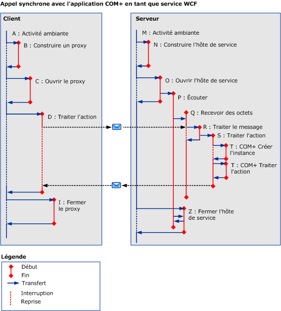

# COM+.
L'illustration suivante montre comment vous pouvez utiliser le suivi d'activité dans une application COM+. Au lieu d'exécuter le code utilisateur sur le serveur, nous pouvons définir une activité COM+ pour chaque appel de méthode au modèle objet COM+.  
  
 
