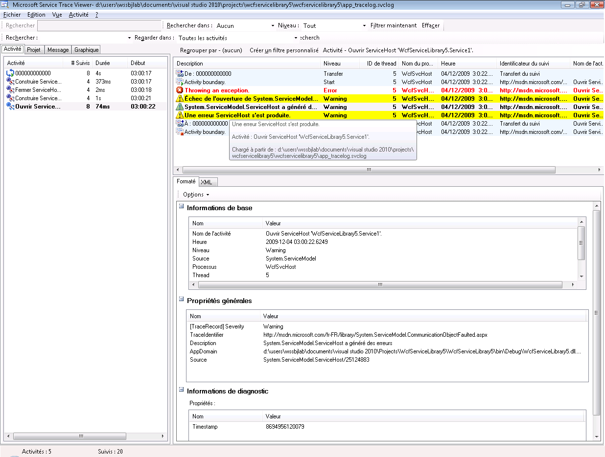
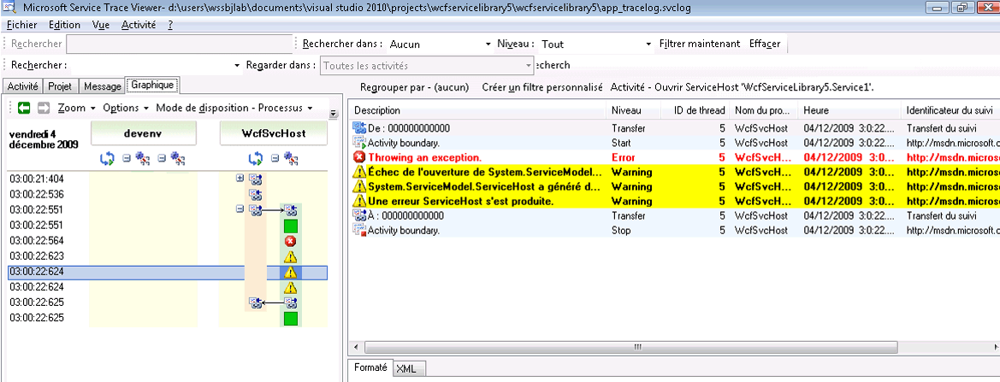

# <a name="emitting-user-code-traces"></a>Émission de suivis dans du code utilisateur
En plus de permettre le suivi dans la configuration pour rassembler des données d'instrumentation générées par [!INCLUDE[indigo1](../../../../../includes/indigo1-md.md)], vous pouvez également émettre des suivis par programme dans le code utilisateur. Ainsi, vous pouvez créer de manière proactive des données d'instrumentation que vous pouvez consulter ultérieurement à des fins de diagnostic. Cette rubrique explique comment procéder.  
  
 En outre, le [extension suivi](../../../../../docs/framework/wcf/samples/extending-tracing.md) exemple inclut tout le code présenté dans les sections suivantes.  
  
## <a name="creating-a-trace-source"></a>Création d'une source de suivi  
 Vous pouvez utiliser le code suivant pour créer une source de suivi de l'utilisateur.  
  
```  
TraceSource ts = new TraceSource("myUserTraceSource");  
```  
  
## <a name="creating-activities"></a>Création d'activités  
 Les activités sont des unités logiques de traitement. Vous pouvez créer une activité pour chaque unité de traitement majeure dans laquelle vous souhaitez regrouper les suivis. Par exemple, vous pouvez créer une activité pour chaque demande au service. Pour cela, effectuez les étapes suivantes.  
  
1.  Enregistrez l'ID d'activité dans la portée.  
  
2.  Créez un nouvel ID d'activité.  
  
3.  Transférez depuis l'activité dans la portée vers la nouvelle, définissez la nouvelle activité dans la portée et émettez un suivi de démarrage pour cette activité.  
  
 Le code suivant montre comment procéder.  
  
```  
Guid oldID = Trace.CorrelationManager.ActivityId;  
Guid traceID = Guid.NewGuid();  
ts.TraceTransfer(0, "transfer", traceID);  
Trace.CorrelationManager.ActivityId = traceID; // Trace is static  
ts.TraceEvent(TraceEventType.Start, 0, "Add request");  
```  
  
## <a name="emitting-traces-within-a-user-activity"></a>Émission de suivis dans une activité des utilisateurs  
 Le code suivant émet des suivis dans une activité des utilisateurs.  
  
```  
double value1 = 100.00D;  
double value2 = 15.99D;  
ts.TraceInformation("Client sends message to Add " + value1 + ", " + value2);  
double result = client.Add(value1, value2);  
ts.TraceInformation("Client receives Add response '" + result + "'");  
```  
  
## <a name="stopping-the-activities"></a>Arrêt des activités  
 Pour arrêter les activités, transférez en retour vers l'ancienne activité, arrêtez l'ID d'activité actuel et réinitialisez l'ID de l'ancienne activité dans la portée.  
  
 Le code suivant montre comment procéder.  
  
```  
ts.TraceTransfer(0, "transfer", oldID);  
ts.TraceEvent(TraceEventType.Stop, 0, "Add request");  
Trace.CorrelationManager.ActivityId = oldID;  
```  
  
## <a name="propagating-the-activity-id-to-a-service"></a>Propager l'ID d'activité à un service  
 Si vous affectez à l'attribut `propagateActivity` la valeur `true` pour la source de suivi `System.ServiceModel` dans les fichiers de configuration de client et de service, le traitement de service pour la demande Ajouter se produit dans la même activité que celle définie dans le client. Si le service définit ses propres activités et transferts, les suivis de service n'apparaissent pas dans l'activité propagée par le client. À la place, ils apparaissent dans une activité corrélée par les suivis de transfert à l'activité dont l'ID est propagé par le client.  
  
> [!NOTE]
>  Si l'attribut `propagateActivity` a la valeur `true` sur le client et le service, l'activité ambiante dans la portée d'opération du service est définie par [!INCLUDE[indigo2](../../../../../includes/indigo2-md.md)].  
  
 Vous pouvez utiliser le code suivant pour vérifier si une activité a été définie dans la portée par [!INCLUDE[indigo2](../../../../../includes/indigo2-md.md)].  
  
```  
// Check if an activity was set in scope by WCF, if it was   
// propagated from the client. If not, ( ambient activity is   
// equal to Guid.Empty), create a new one.  
if(Trace.CorrelationManager.ActivityId == Guid.Empty)  
{  
    Guid newGuid = Guid.NewGuid();  
    Trace.CorrelationManager.ActivityId = newGuid;  
}  
// Emit your Start trace.  
ts.TraceEvent(TraceEventType.Start, 0, "Add Activity");  
  
// Emit the processing traces for that request.  
serviceTs.TraceInformation("Service receives Add "   
                            + n1 + ", " + n2);  
// double result = n1 + n2;  
serviceTs.TraceInformation("Service sends Add result" + result);  
  
// Emit the Stop trace and exit the method scope.  
ts.TraceEvent(TraceEventType.Stop, 0, "Add Activity");  
// return result;  
```  
  
## <a name="tracing-exceptions-thrown-in-code"></a>Exceptions de suivi levées dans le code  
 Lorsque vous levez une exception dans le code, vous pouvez également tracer l'exception au niveau avertissement ou au niveau supérieur à l'aide du code suivant.  
  
```  
ts.TraceEvent(TraceEventType.Warning, 0, "Throwing exception " + "exceptionMessage");  
```  
  
## <a name="viewing-user-traces-in-the-service-trace-viewer-tool"></a>Consultation des suivis d'utilisateur dans l'outil Service Trace Viewer  
 Cette section contient des captures d’écran de suivis générés en exécutant la [extension suivi](../../../../../docs/framework/wcf/samples/extending-tracing.md) exemple, lorsqu’ils sont affichés à l’aide de la [outil Service Trace Viewer (SvcTraceViewer.exe)](../../../../../docs/framework/wcf/service-trace-viewer-tool-svctraceviewer-exe.md).  
  
 Dans le diagramme suivant, l’activité « Demande ajouter » créée précédemment est sélectionnée dans le volet gauche. Elle est répertoriée avec trois autres activités mathématiques (Division, Soustraction, Multiplication) qui constituent le logiciel client d'application. Le code utilisateur a défini une nouvelle activité pour chaque opération pour isoler des occurrences d'erreur potentielles dans les différentes demandes.  
  
 Pour illustrer l’utilisation des transferts dans le [extension suivi](../../../../../docs/framework/wcf/samples/extending-tracing.md) exemple, une activité de calculatrice qui encapsule les demandes de quatre opération est également créée. Pour chaque demande, il s'opère un transfert aller/retour depuis l'activité de calculatrice à l'activité de demande (le suivi est mis en surbrillance dans le volet supérieur droit dans l'illustration).  
  
 Lorsque vous sélectionnez une activité sur le volet gauche, les suivis inclus par cette activité sont montrés sur le volet supérieur droit. Si `propagateActivity` est `true` à chaque point de terminaison dans le chemin d’accès de la demande, suivis dans l’activité de demande sont issus de tous les processus qui participent à la demande. Dans cet exemple, vous pouvez consulter des suivis issus aussi bien du client et du service dans la 4e colonne du volet.  
  
 Cette activité affiche l'ordre de traitement suivant :  
  
1.  Le client envoie le message à la demande Ajouter.  
  
2.  Le service reçoit le message de demande Ajouter.  
  
3.  Le service envoie la réponse Ajouter.  
  
4.  Le client reçoit la réponse Ajouter.  
  
 Tous ces suivis ont été émis au niveau des informations. Un clic sur un suivi dans le volet supérieur droit affiche les détails de ce suivi dans le volet inférieur droit.  
  
 Le diagramme suivant contient aussi les traces de transfert aller/retour de l'activité de calculatrice, ainsi que deux paires de suivi de démarrage et d'arrêt par activité de demande, une pour le client et une pour le service (une pour chaque source de suivi).  
  
   
Liste des activités par heure de création (volet gauche) et leurs activités imbriquées (volet supérieur droit)  
  
 Si le code de service lève une exception qui entraîne la levée d'une exception aussi chez le client (par exemple, lorsque le client n'a pas reçu de réponse à sa demande), l'avertissement ou les messages d'erreur du client et du service se produisent dans la même activité par corrélation directe. Dans le diagramme suivant, le service lève une exception qui indique « le service refuse de traiter cette demande dans le code utilisateur. » Le client lève également une exception qui indique « le serveur n’a pas pu traiter la demande en raison d’une erreur interne. »  
  
   
Les erreurs sur les points de terminaison pour une demande donnée apparaissent dans la même activité si l'ID d'activité de la demande a été propagé.  
  
 Un double-clic sur l'activité de multiplication sur le volet gauche affiche le graphique suivant, avec les suivis pour l'activité de multiplication pour chaque processus concerné. Le graphique affiche un avertissement survenu en premier au service (exception levée) et qui est suivi par des avertissements et des erreurs sur le client en raison de l'impossibilité de traiter la demande. Par conséquent, nous pouvons déduire la relation causale d’erreur entre des points de terminaison et en déduire la cause racine de l’erreur.  
  
   
Vue Graphique de corrélation d'erreur  
  
 Pour obtenir les suivis précédents, nous définissons `ActivityTracing` pour les sources de suivi de l'utilisateur et `propagateActivity=true` pour la source de suivi `System.ServiceModel`. Nous n'avons pas défini `ActivityTracing` pour la source de suivi `System.ServiceModel` pour permettre la propagation d'activité du code utilisateur au code utilisateur. (Lorsque le suivi d'activité ServiceModel est activé, l'ID d'activité défini dans le client n'est pas entièrement propagé au code utilisateur de service ; les transferts, toutefois, corrèlent les activités de code utilisateur du client et du service aux activités [!INCLUDE[indigo2](../../../../../includes/indigo2-md.md)] intermédiaires.)  
  
 La définition d'activités et la propagation de l'ID d'activité nous permettent d'effectuer une corrélation directe d'erreur sur des points de terminaison. De cette manière, il est possible de localiser plus rapidement la cause racine d’une erreur.  
  
## <a name="see-also"></a>Voir aussi  
 [Étendre le suivi](../../../../../docs/framework/wcf/samples/extending-tracing.md)
