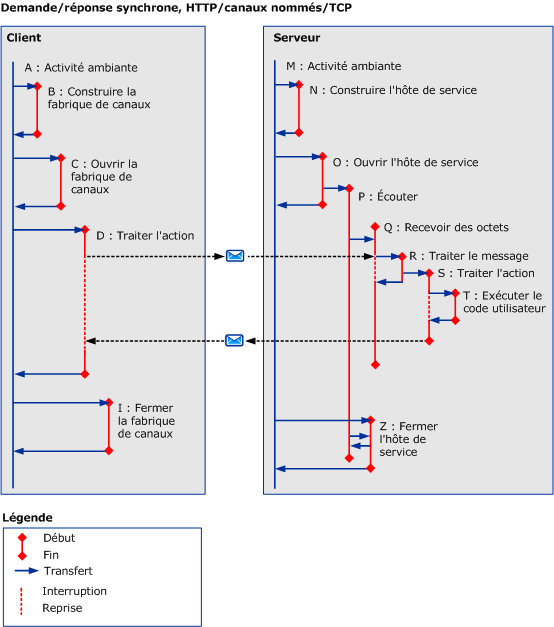

# Scénarios synchrones utilisant HTTP, TCP ou Canal nommé
Cette rubrique décrit les activités et transferts pour différents scénarios demande/réponse synchrones, avec un client à thread unique, utilisant une connexion HTTP, TCP ou de canal nommé. Consultez [scénarios asynchrones à l’aide de HTTP, TCP ou canal nommé](../../../../../docs/framework/wcf/diagnostics/tracing/asynchronous-scenarios-using-http-tcp-or-named-pipe.md) pour plus d’informations sur les requêtes multithreads.  
  
## Demande/Réponse synchrone sans erreurs  
 Cette section décrit les activités et transferts pour un scénario demande/réponse synchrone valide, avec un client à thread unique.  
  
### Client  
  
#### Établissement de la communication avec le point de terminaison de service  
 Un client est construit et ouvert. Pour chacune de ces étapes, l’activité ambiante (A) est transférée à un « Client de construction » (B) et « Client ouvert » (C) activité respectivement. Pour chaque activité vers laquelle le transfert est effectué, l'activité ambiante est interrompue jusqu'à ce qu'un transfert de retour ait lieu, autrement dit jusqu'à ce que le code ServiceModel soit exécuté.  
  
#### Exécution d'une demande au point de terminaison de service  
 L’activité ambiante est transférée à une activité « ProcessAction » (D). Dans cette activité, un message de demande est envoyé et un message de réponse est reçu. L'activité se termine lorsque le contrôle retourne au code utilisateur. Étant donné qu'il s'agit d'une demande synchrone, l'activité ambiante s'interrompt jusqu'à ce que le contrôle soit retourné.  
  
#### Fermeture de la communication avec le point de terminaison de service  
 L'activité de fermeture du client (I) est créée à partir de l'activité ambiante. Ceci est identique aux activités nouvelle et ouverte.  
  
### Serveur  
  
#### Configuration d'un hôte de service  
 Les activités nouvelle et ouverte (N et O) du ServiceHost sont créées à partir de l'activité ambiante (M).  
  
 Une activité d'écoute (P) est créée à partir de l'ouverture d'un ServiceHost pour chaque écouteur. L'activité d'écoute attend de recevoir et de traiter des données.  
  
#### Réception de données sur le câble  
 Lorsque les données arrivent sur le câble, une activité « ReceiveBytes » est créée si elle n’existe pas déjà (Q) pour traiter les données reçues. Cette activité peut être réutilisée pour plusieurs messages dans une connexion ou une file d'attente.  
  
 L'activité ReceiveBytes lance une activité ProcessMessage (R) si elle a suffisamment de données pour former un message d'action SOAP.  
  
 Dans l'activité R, les en-têtes de message sont traités et l'en-tête activityID est vérifié. Si cet en-tête est présent, l'ID d'activité a pour valeur l'activité ProcessAction ; sinon, un nouvel ID est créé.  
  
 L'activité ProcessAction (S) est créée et un transfert vers elle est effectuée lorsque l'appel est traité. Cette activité se termine lorsque tout le traitement lié au message entrant est achevé, y compris l'exécution du code utilisateur (T) et l'envoi du message de réponse le cas échéant.  
  
#### Fermeture d'un hôte de service  
 L'activité de fermeture (Z) de ServiceHost est créée à partir de l'activité ambiante.  
  
   
  
 Dans \<A: name >, `A` est un symbole de raccourci qui décrit l’activité dans le texte précédent et dans le tableau 3. `Name` est un nom raccourci de l'activité.  
  
 Si `propagateActivity` = `true`, traiter l’Action sur le client et le service ont le même ID d’activité.  
  
## Demande/Réponse synchrone avec erreurs  
 La seule différence avec le scénario précédent est qu'un message d'erreur SOAP est retourné en tant que message de réponse. Si `propagateActivity` = `true`, l’ID d’activité du message de demande est ajoutée au message d’erreur SOAP.  
  
## Unidirectionnel synchrone sans erreurs  
 La seule différence avec le premier scénario est qu'aucun message n'est retourné au serveur. Pour les protocoles basés sur HTTP, un état (valide ou erreur) est encore retourné au client. Cela est dû au fait que le protocole HTTP est le seul protocole avec une sémantique de demande/réponse qui fait partie de la pile de protocole [!INCLUDE[indigo2](../../../../../includes/indigo2-md.md)]. Le traitement TCP étant masqué de la vue de [!INCLUDE[indigo2](../../../../../includes/indigo2-md.md)], aucun accusé de réception n'est envoyé au client.  
  
## Unidirectionnel synchrone avec erreurs  
 Si une erreur se produit lors du traitement du message (Q ou au-delà), aucune notification n'est retournée au client. Cela est identique au scénario « Unidirectionnel synchrone sans erreurs ». Vous ne devez pas utiliser de scénario unidirectionnel si vous souhaitez recevoir un message d'erreur.  
  
## Duplex  
 La différence avec les scénarios précédents est que le client joue le rôle de service ; il crée les activités ReceiveBytes et ProcessMessage, comme pour les scénarios asynchrones.
