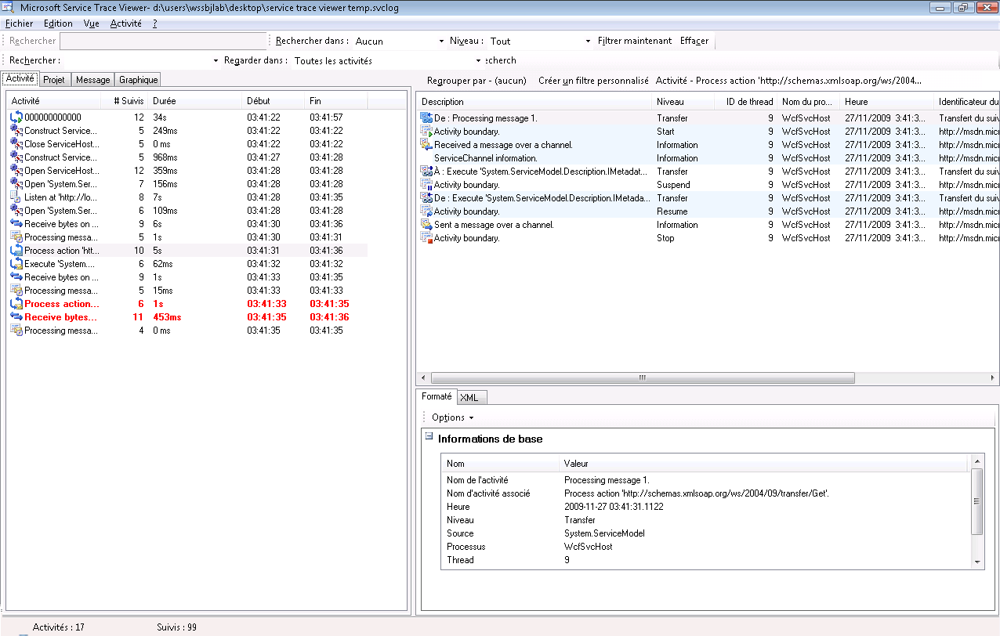
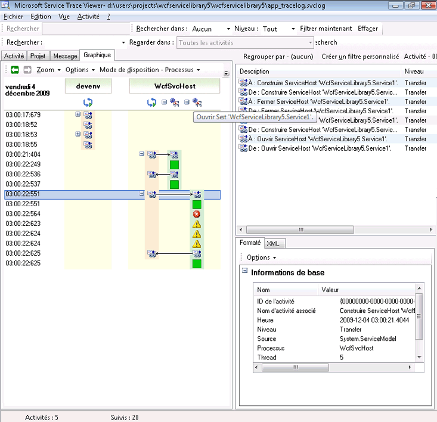
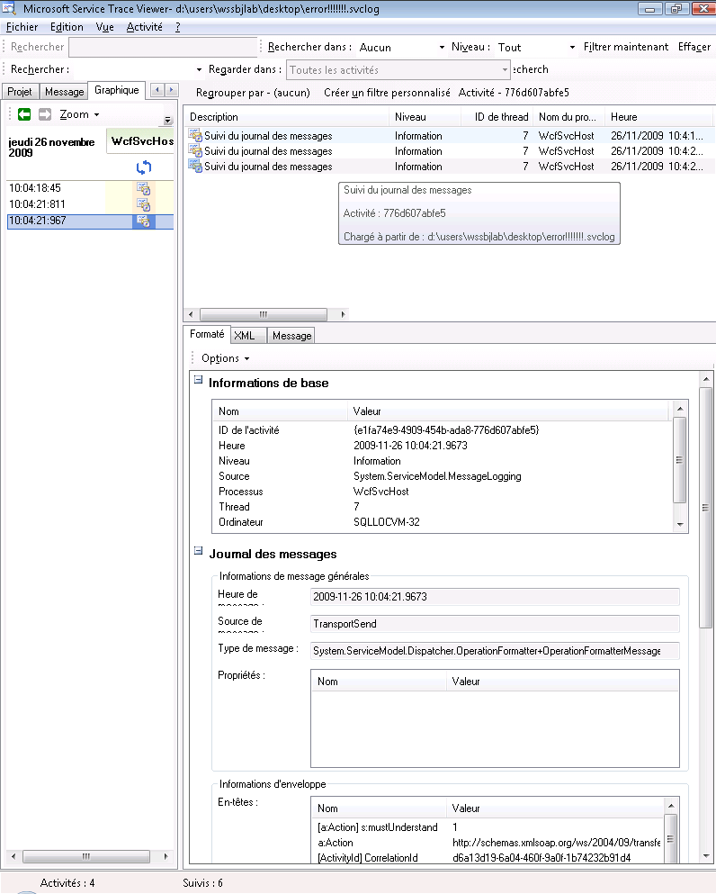
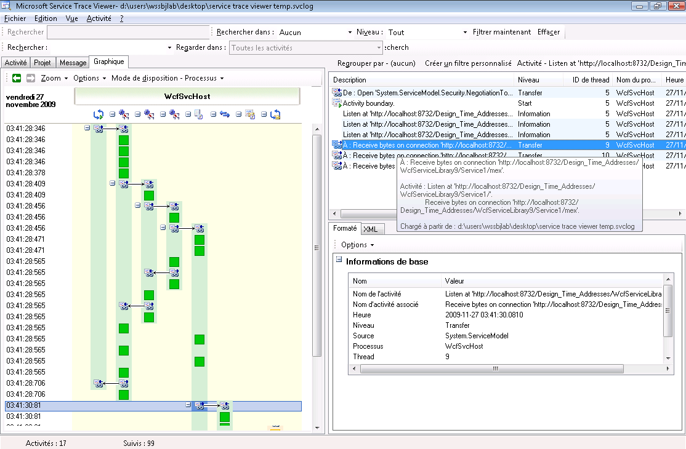
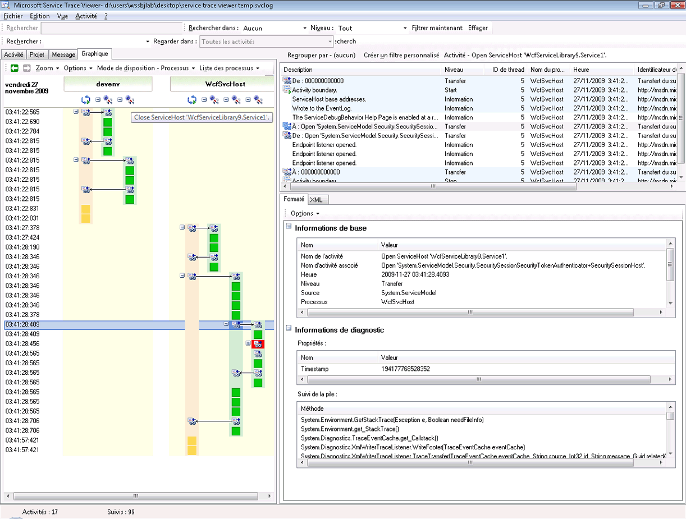
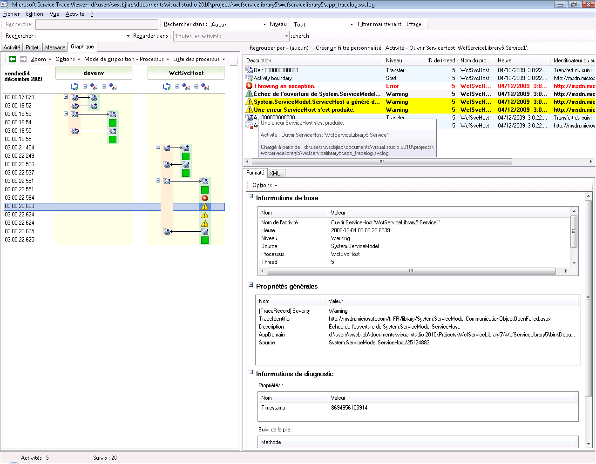
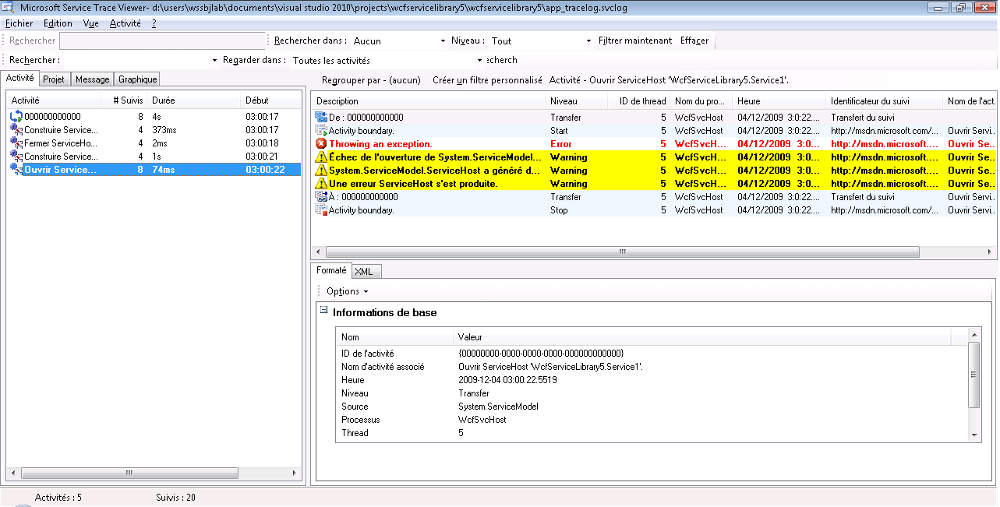
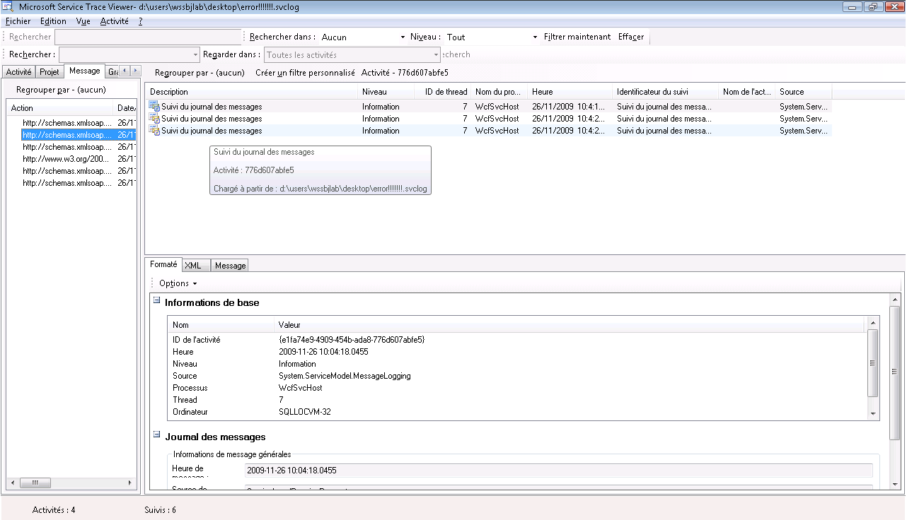

# <a name="using-service-trace-viewer-for-viewing-correlated-traces-and-troubleshooting"></a><span data-ttu-id="854d0-102">Utilisation de Service Trace Viewer pour afficher les suivis corrélés et résoudre les problèmes</span><span class="sxs-lookup"><span data-stu-id="854d0-102">Using Service Trace Viewer for Viewing Correlated Traces and Troubleshooting</span></span>
<span data-ttu-id="854d0-103">Cette rubrique décrit le format des données de suivi, leur mode de consultation, et les approches qui utilisent Service Trace Viewer pour résoudre les problèmes posés par votre application.</span><span class="sxs-lookup"><span data-stu-id="854d0-103">This topic describes the format of trace data, how to view it, and approaches that use the Service Trace Viewer to troubleshoot your application.</span></span>  
  
## <a name="using-the-service-trace-viewer-tool"></a><span data-ttu-id="854d0-104">Utilisation de l'outil Service Trace Viewer</span><span class="sxs-lookup"><span data-stu-id="854d0-104">Using the Service Trace Viewer Tool</span></span>  
 <span data-ttu-id="854d0-105">L'outil Service Trace Viewer [!INCLUDE[indigo1](../../../../../includes/indigo1-md.md)] vous aide à corréler des suivis de diagnostic produits par les écouteurs [!INCLUDE[indigo2](../../../../../includes/indigo2-md.md)] pour localiser l'origine d'une erreur.</span><span class="sxs-lookup"><span data-stu-id="854d0-105">The [!INCLUDE[indigo1](../../../../../includes/indigo1-md.md)] Service Trace Viewer tool helps you correlate diagnostic traces produced by [!INCLUDE[indigo2](../../../../../includes/indigo2-md.md)] listeners to locate the root cause of an error.</span></span> <span data-ttu-id="854d0-106">L'outil vous permet de consulter, regrouper et filtrer facilement les suivis afin de pouvoir diagnostiquer, réparer et vérifier les problèmes liés aux services [!INCLUDE[indigo2](../../../../../includes/indigo2-md.md)].</span><span class="sxs-lookup"><span data-stu-id="854d0-106">The tool gives you a way to easily view, group, and filter traces so that you can diagnose, repair and verify issues with [!INCLUDE[indigo2](../../../../../includes/indigo2-md.md)] services.</span></span> <span data-ttu-id="854d0-107">Pour plus d’informations sur l’utilisation de cet outil, consultez [outil Service Trace Viewer (SvcTraceViewer.exe)](../../../../../docs/framework/wcf/service-trace-viewer-tool-svctraceviewer-exe.md).</span><span class="sxs-lookup"><span data-stu-id="854d0-107">For more information about using this tool, see [Service Trace Viewer Tool (SvcTraceViewer.exe)](../../../../../docs/framework/wcf/service-trace-viewer-tool-svctraceviewer-exe.md).</span></span>  
  
 <span data-ttu-id="854d0-108">Cette rubrique contient des captures d’écran de suivis générés en exécutant la [Tracing and Message Logging](../../../../../docs/framework/wcf/samples/tracing-and-message-logging.md) exemple, lorsqu’ils sont affichés à l’aide de la [outil Service Trace Viewer (SvcTraceViewer.exe)](../../../../../docs/framework/wcf/service-trace-viewer-tool-svctraceviewer-exe.md).</span><span class="sxs-lookup"><span data-stu-id="854d0-108">This topic contains screenshots of traces generated by running the [Tracing and Message Logging](../../../../../docs/framework/wcf/samples/tracing-and-message-logging.md) sample, when viewed using the [Service Trace Viewer Tool (SvcTraceViewer.exe)](../../../../../docs/framework/wcf/service-trace-viewer-tool-svctraceviewer-exe.md).</span></span> <span data-ttu-id="854d0-109">Cette rubrique explique comment interpréter le contenu, les activités de suivi, et leur corrélation, et comment analyser un grand nombre de suivis au cours de la résolution des problèmes.</span><span class="sxs-lookup"><span data-stu-id="854d0-109">This topic demonstrates how to understand trace content, activities and their correlation, and how to analyze large numbers of traces when troubleshooting.</span></span>  
  
## <a name="viewing-trace-content"></a><span data-ttu-id="854d0-110">Consultation du contenu de suivi</span><span class="sxs-lookup"><span data-stu-id="854d0-110">Viewing Trace Content</span></span>  
 <span data-ttu-id="854d0-111">Un événement de suivi contient les informations significatives suivantes :</span><span class="sxs-lookup"><span data-stu-id="854d0-111">A trace event contains the following most significant information:</span></span>  
  
-   <span data-ttu-id="854d0-112">Nom d'activité lorsqu'il est défini.</span><span class="sxs-lookup"><span data-stu-id="854d0-112">Activity name when set.</span></span>  
  
-   <span data-ttu-id="854d0-113">Heure d'émission.</span><span class="sxs-lookup"><span data-stu-id="854d0-113">Emission time.</span></span>  
  
-   <span data-ttu-id="854d0-114">Niveau de suivi.</span><span class="sxs-lookup"><span data-stu-id="854d0-114">Trace level.</span></span>  
  
-   <span data-ttu-id="854d0-115">Nom de source de suivi.</span><span class="sxs-lookup"><span data-stu-id="854d0-115">Trace source name.</span></span>  
  
-   <span data-ttu-id="854d0-116">Nom du processus.</span><span class="sxs-lookup"><span data-stu-id="854d0-116">Process name.</span></span>  
  
-   <span data-ttu-id="854d0-117">ID de thread.</span><span class="sxs-lookup"><span data-stu-id="854d0-117">Thread id.</span></span>  
  
-   <span data-ttu-id="854d0-118">Identificateur de suivi unique, qui est une URL qui pointe vers une destination dans Docs Microsoft, à partir de laquelle vous pouvez obtenir plus d’informations sur la trace.</span><span class="sxs-lookup"><span data-stu-id="854d0-118">A unique trace identifier, which is a URL that points to a destination in Microsoft Docs, from which you can obtain more information related to the trace.</span></span>  
  
 <span data-ttu-id="854d0-119">Tous ces éléments peuvent être consultés dans le volet supérieur droit dans Service Trace Viewer, ou dans le **des informations de base** section dans la vue mise en forme du panneau inférieur droit lors de la sélection d’une trace.</span><span class="sxs-lookup"><span data-stu-id="854d0-119">All of these can be seen in the upper right panel in the Service Trace Viewer, or in the **Basic Information** section in the formatted view of the lower-right panel when selecting a trace.</span></span>  
  
> [!NOTE]
>  <span data-ttu-id="854d0-120">Si le client et le service se trouvent sur le même ordinateur, les suivis des deux applications seront présents.</span><span class="sxs-lookup"><span data-stu-id="854d0-120">If the client and the service are on the same machine, the traces for both applications will be present.</span></span> <span data-ttu-id="854d0-121">Ils peuvent être filtrés à l’aide de la **nom de processus** colonne.</span><span class="sxs-lookup"><span data-stu-id="854d0-121">These can be filtered using the **Process Name** column.</span></span>  
  
 <span data-ttu-id="854d0-122">De plus, la vue mise en forme fournit également une description du suivi et des informations détaillées supplémentaires lorsqu'elles sont disponibles.</span><span class="sxs-lookup"><span data-stu-id="854d0-122">In addition, the formatted view also provides a description for the trace and additional detailed information when available.</span></span> <span data-ttu-id="854d0-123">Ces informations peuvent contenir le type d'exception et le message, les piles d'appel, l'action du message, les champs De/À, et d'autres informations sur les exceptions.</span><span class="sxs-lookup"><span data-stu-id="854d0-123">The latter can include exception type and message, call stacks, message action, from/to fields, and other exception information.</span></span>  
  
 <span data-ttu-id="854d0-124">Dans la vue XML, les étiquettes xml utiles incluent les éléments suivants :</span><span class="sxs-lookup"><span data-stu-id="854d0-124">In the XML view, useful xml tags include the following:</span></span>  
  
-   <span data-ttu-id="854d0-125">\<Sous-type > (niveau de suivi).</span><span class="sxs-lookup"><span data-stu-id="854d0-125">\<SubType> (trace level).</span></span>  
  
-   <span data-ttu-id="854d0-126">\<TimeCreated >.</span><span class="sxs-lookup"><span data-stu-id="854d0-126">\<TimeCreated>.</span></span>  
  
-   <span data-ttu-id="854d0-127">\<Source > (nom de source de trace).</span><span class="sxs-lookup"><span data-stu-id="854d0-127">\<Source> (trace source name).</span></span>  
  
-   <span data-ttu-id="854d0-128">\<Corrélation > (id d’activité défini lors de l’émission de la trace).</span><span class="sxs-lookup"><span data-stu-id="854d0-128">\<Correlation> (activity id set when emitting the trace).</span></span>  
  
-   <span data-ttu-id="854d0-129">\<L’exécution > (id de processus et de thread).</span><span class="sxs-lookup"><span data-stu-id="854d0-129">\<Execution> (process and thread id).</span></span>  
  
-   <span data-ttu-id="854d0-130">\<Ordinateur >.</span><span class="sxs-lookup"><span data-stu-id="854d0-130">\<Computer>.</span></span>  
  
-   <span data-ttu-id="854d0-131">\<ExtendedData >, y compris \<Action >, \<MessageID > et la \<ActivityId > défini dans l’en-tête de message lors de l’envoi d’un message.</span><span class="sxs-lookup"><span data-stu-id="854d0-131">\<ExtendedData>, including \<Action>, \<MessageID> and the \<ActivityId> set in the message header when sending a message.</span></span>  
  
 <span data-ttu-id="854d0-132">Si vous examinez le suivi "Envoi d'un message sur un canal", vous pouvez consulter le contenu suivant.</span><span class="sxs-lookup"><span data-stu-id="854d0-132">If you examine the "Sent a message over a channel" trace, you may see the following content.</span></span>  
  
```xml  
<E2ETraceEvent xmlns="http://schemas.microsoft.com/2004/06/E2ETraceEvent">  
   <System xmlns="http://schemas.microsoft.com/2004/06/windows/eventlog/system">  
      <EventID>262163</EventID>  
      <Type>3</Type>  
      <SubType Name="Information">0</SubType>  
      <Level>8</Level>  
      <TimeCreated SystemTime="2006-08-04T18:45:30.8491051Z" />  
      <Source Name="System.ServiceModel" />  
       <Correlation ActivityID="{27c6331d-8998-43aa-a382-03239013a6bd}"/>  
       <Execution ProcessName="client" ProcessID="1808" ThreadID="1" />  
       <Channel />  
       <Computer>TEST1</Computer>  
   </System>  
   <ApplicationData>  
       <TraceData>  
          <DataItem>  
             <TraceRecord xmlns="http://schemas.microsoft.com/2004/10/E2ETraceEvent/TraceRecord" Severity="Information">  
                 <TraceIdentifier>http://msdn.microsoft.com/library/System.ServiceModel.Channels.MessageSent.aspx</TraceIdentifier>  
                 <Description>Sent a message over a channel.</Description>  
                 <AppDomain>client.exe</AppDomain>  
                 <Source>System.ServiceModel.Channels.ClientFramingDuplexSessionChannel/35191196</Source>  
                <ExtendedData xmlns="http://schemas.microsoft.com/2006/08/ServiceModel/MessageTransmitTraceRecord">  
  
                  <MessageProperties>  
                     <AllowOutputBatching>False</AllowOutputBatching>  
                  </MessageProperties>  
                  <MessageHeaders>  
                     <Action d4p1:mustUnderstand="1" xmlns:d4p1="http://www.w3.org/2003/05/soap-envelope" xmlns="http://www.w3.org/2005/08/addressing">http://Microsoft.ServiceModel.Samples/ICalculator/Multiply</Action>  
                     <MessageID xmlns="http://www.w3.org/2005/08/addressing">urn:uuid:7c6670d8-4c9c-496e-b6a0-2ceb6db35338</MessageID>  
                     <ActivityId CorrelationId="b02e2189-0816-4387-980c-dd8e306440f5" xmlns="http://schemas.microsoft.com/2004/09/ServiceModel/Diagnostics">27c6331d-8998-43aa-a382-03239013a6bd</ActivityId>  
                     <ReplyTo xmlns="http://www.w3.org/2005/08/addressing">  
                        <Address>http://www.w3.org/2005/08/addressing/anonymous</Address>  
                    </ReplyTo>  
                    <To d4p1:mustUnderstand="1" xmlns:d4p1="http://www.w3.org/2003/05/soap-envelope" xmlns="http://www.w3.org/2005/08/addressing">net.tcp://localhost/servicemodelsamples/service</To>  
                  </MessageHeaders>  
                  <RemoteAddress>net.tcp://localhost/servicemodelsamples/service</RemoteAddress>  
                </ExtendedData>  
            </TraceRecord>  
          </DataItem>  
       </TraceData>  
   </ApplicationData>  
</E2ETraceEvent>  
```  
  
## <a name="servicemodel-e2e-tracing"></a><span data-ttu-id="854d0-133">Suivi de ServiceModel E2E</span><span class="sxs-lookup"><span data-stu-id="854d0-133">ServiceModel E2E Tracing</span></span>  
 <span data-ttu-id="854d0-134">Lorsque la source de suivi `System.ServiceModel` est définie avec un `switchValue` différent de « Désactivé » et `ActivityTracing`, [!INCLUDE[indigo2](../../../../../includes/indigo2-md.md)] crée des activités et des transferts pour le traitement [!INCLUDE[indigo2](../../../../../includes/indigo2-md.md)].</span><span class="sxs-lookup"><span data-stu-id="854d0-134">When the `System.ServiceModel` trace source is set with a `switchValue` other than Off, and `ActivityTracing`, [!INCLUDE[indigo2](../../../../../includes/indigo2-md.md)] creates activities and transfers for [!INCLUDE[indigo2](../../../../../includes/indigo2-md.md)] processing.</span></span>  
  
 <span data-ttu-id="854d0-135">Une activité est une unité logique de traitement qui regroupe tous les suivis liés à cette unité de traitement.</span><span class="sxs-lookup"><span data-stu-id="854d0-135">An activity is a logical unit of processing that groups all traces related to that processing unit.</span></span> <span data-ttu-id="854d0-136">Par exemple, vous pouvez définir une activité pour chaque demande.</span><span class="sxs-lookup"><span data-stu-id="854d0-136">For example, you can define one activity for each request.</span></span> <span data-ttu-id="854d0-137">Les transferts créent une relation causale entre des activités dans des points de terminaison.</span><span class="sxs-lookup"><span data-stu-id="854d0-137">Transfers create a causal relationship between activities within endpoints.</span></span> <span data-ttu-id="854d0-138">Propager l'ID d'activité vous permet de lier des activités sur des points de terminaison.</span><span class="sxs-lookup"><span data-stu-id="854d0-138">Propagating the activity ID enables you to relate activities across endpoints.</span></span> <span data-ttu-id="854d0-139">Cela est possible en définissant `propagateActivity` = `true` dans la configuration à chaque point de terminaison.</span><span class="sxs-lookup"><span data-stu-id="854d0-139">This can be done by setting `propagateActivity`=`true` in configuration at every endpoint.</span></span> <span data-ttu-id="854d0-140">Les activités, les transferts et la propagation vous permettent d'effectuer la corrélation d'erreur.</span><span class="sxs-lookup"><span data-stu-id="854d0-140">Activities, transfers, and propagation allow you to perform error correlation.</span></span> <span data-ttu-id="854d0-141">De cette manière, vous pouvez rechercher plus rapidement l'origine d'une erreur.</span><span class="sxs-lookup"><span data-stu-id="854d0-141">In this way, you can find the root cause of an error more quickly.</span></span>  
  
 <span data-ttu-id="854d0-142">Sur le client, une activité [!INCLUDE[indigo2](../../../../../includes/indigo2-md.md)] est créée pour chaque appel de modèle objet (par exemple, Ouvrir ChannelFactory, Ajouter, Diviser, et ainsi de suite.) Chacun des appels d’opération est traité dans une activité « Action de processus ».</span><span class="sxs-lookup"><span data-stu-id="854d0-142">On the client, one [!INCLUDE[indigo2](../../../../../includes/indigo2-md.md)] activity is created for each object model call (for example, Open ChannelFactory, Add, Divide, and so on.) Each of the operation calls is processed in a "Process Action" activity.</span></span>  
  
 <span data-ttu-id="854d0-143">Dans la capture d’écran suivante, extraite à partir de la [Tracing and Message Logging](../../../../../docs/framework/wcf/samples/tracing-and-message-logging.md) exemple, le volet gauche affiche la liste des activités créées dans le processus client, trié par date de création.</span><span class="sxs-lookup"><span data-stu-id="854d0-143">In the following screenshot, extracted from the [Tracing and Message Logging](../../../../../docs/framework/wcf/samples/tracing-and-message-logging.md) sample the left panel displays the list of activities created in the client process, sorted by creation time.</span></span> <span data-ttu-id="854d0-144">Vous trouverez ci-dessous une liste chronologique des activités :</span><span class="sxs-lookup"><span data-stu-id="854d0-144">The following is a chronological list of activities:</span></span>  
  
-   <span data-ttu-id="854d0-145">Construction de la fabrication de canal (ClientBase).</span><span class="sxs-lookup"><span data-stu-id="854d0-145">Constructed the channel factory (ClientBase).</span></span>  
  
-   <span data-ttu-id="854d0-146">Ouverture de la fabrication de canal.</span><span class="sxs-lookup"><span data-stu-id="854d0-146">Opened the channel factory.</span></span>  
  
-   <span data-ttu-id="854d0-147">Traitement de l'action Add.</span><span class="sxs-lookup"><span data-stu-id="854d0-147">Processed the Add action.</span></span>  
  
-   <span data-ttu-id="854d0-148">Configuration de la session sécurisée (s'est produite à la première demande) et traitement de trois messages de réponse d'infrastructure de sécurité : RST, RSTR, SCT (traiter le message 1, 2, 3).</span><span class="sxs-lookup"><span data-stu-id="854d0-148">Set up the Secure Session (this OCCURRED on the first request) and processed three security infrastructure response messages: RST, RSTR, SCT (Process message 1, 2, 3).</span></span>  
  
-   <span data-ttu-id="854d0-149">Traitement des demandes de soustraction, multiplication et division.</span><span class="sxs-lookup"><span data-stu-id="854d0-149">Processed the Subtract, Multiply, and Divide requests.</span></span>  
  
-   <span data-ttu-id="854d0-150">Fermeture de la fabrication de canal, et ce faisant de la session sécurisée et traitement de la réponse de message de sécurité Cancel.</span><span class="sxs-lookup"><span data-stu-id="854d0-150">Closed the channel factory, and doing so closed the Secure session and processed the security message response Cancel.</span></span>  
  
 <span data-ttu-id="854d0-151">Les messages d'infrastructure de sécurité s'affichent à cause de l'élément wsHttpBinding.</span><span class="sxs-lookup"><span data-stu-id="854d0-151">We see the security infrastructure messages because of the wsHttpBinding.</span></span>  
  
> [!NOTE]
>  <span data-ttu-id="854d0-152">Dans [!INCLUDE[indigo2](../../../../../includes/indigo2-md.md)], nous affichons des messages de réponse qui sont traités initialement dans une activité séparée (Traiter le message) avant de les corréler à l'activité Traiter l'action correspondante qui inclut le message de demande, par le biais d'un transfert.</span><span class="sxs-lookup"><span data-stu-id="854d0-152">In [!INCLUDE[indigo2](../../../../../includes/indigo2-md.md)], we show response messages being processed initially in a separate activity (Process message) before we correlate them to the corresponding Process Action activity that includes the request message, through a transfer.</span></span> <span data-ttu-id="854d0-153">Cette opération a lieu pour les messages d'infrastructure et les demandes asynchrones et tient au fait que nous devons inspecter le message, lire l'en-tête activityId et identifier l'activité Traiter l'action existante avec cet ID pour le corréler.</span><span class="sxs-lookup"><span data-stu-id="854d0-153">This happens for infrastructure messages and asynchronous requests and is due to the fact that we must inspect the message, read the activityId header, and identify the existing Process Action activity with that id to correlate to it.</span></span> <span data-ttu-id="854d0-154">Pour les demandes synchrones, nous attendons la réponse et donc nous savons à quelle activité de traitement d’action se rapporte la réponse.</span><span class="sxs-lookup"><span data-stu-id="854d0-154">For synchronous requests, we are blocking for the response and hence know which Process action the response relates to.</span></span>  
  
 <span data-ttu-id="854d0-155"></span><span class="sxs-lookup"><span data-stu-id="854d0-155"></span></span>  
<span data-ttu-id="854d0-156">Activités clientes WCF répertoriées selon l'heure de création (volet gauche) et leurs activités et suivis imbriqués (volet supérieur droit)</span><span class="sxs-lookup"><span data-stu-id="854d0-156">WCF client activities listed by creation time (left panel) and their nested activities and traces (upper right panel)</span></span>  
  
 <span data-ttu-id="854d0-157">Lorsque nous sélectionnons une activité dans le volet gauche, le volet supérieur droit affiche des activités et des suivis imbriqués.</span><span class="sxs-lookup"><span data-stu-id="854d0-157">When we select an activity in the left panel, we can see nested activities and traces on the upper right panel.</span></span> <span data-ttu-id="854d0-158">Par conséquent, il s'agit d'une vue hiérarchique réduite de la liste des activités de gauche basées sur l'activité parente sélectionnée.</span><span class="sxs-lookup"><span data-stu-id="854d0-158">Therefore, this is a reduced hierarchical view of the list of activities on the left, based on the selected parent activity.</span></span> <span data-ttu-id="854d0-159">Comme l'activité « Traiter l'action Add » sélectionnée est la première demande effectuée, cette activité contient l'activité Configurer une session sécurisée (transférer vers, transférer en retour) et les suivis du traitement réel de l'action Ajouter.</span><span class="sxs-lookup"><span data-stu-id="854d0-159">Because the selected Process action Add is the first request made, this activity contains the Set Up Secure Session activity (transfer to, transfer back from), and traces for the actual processing of the Add action.</span></span>  
  
 <span data-ttu-id="854d0-160">En double-cliquant sur l'activité « Traiter l'action Add » dans le volet gauche, une représentation graphique des activités [!INCLUDE[indigo2](../../../../../includes/indigo2-md.md)] clientes liées à l'activité Ajouter est affichée.</span><span class="sxs-lookup"><span data-stu-id="854d0-160">If we double click the Process action Add activity in the left panel, we can see a graphical representation of the client [!INCLUDE[indigo2](../../../../../includes/indigo2-md.md)] activities related to Add.</span></span> <span data-ttu-id="854d0-161">La première activité à gauche est l'activité racine (0000), l'activité par défaut.</span><span class="sxs-lookup"><span data-stu-id="854d0-161">The first activity on the left is the root activity (0000), which is the default activity.</span></span> [!INCLUDE[indigo2](../../../../../includes/indigo2-md.md)]<span data-ttu-id="854d0-162"> transfère l'activité ambiante.</span><span class="sxs-lookup"><span data-stu-id="854d0-162"> transfers out of the ambient activity.</span></span> <span data-ttu-id="854d0-163">Si celle-ci n'est pas définie, [!INCLUDE[indigo2](../../../../../includes/indigo2-md.md)] transfère hors de 0000.</span><span class="sxs-lookup"><span data-stu-id="854d0-163">If this is not defined, [!INCLUDE[indigo2](../../../../../includes/indigo2-md.md)] transfers out of 0000.</span></span> <span data-ttu-id="854d0-164">Dans ce contexte, la deuxième activité (« Traiter l'action Add ») transfère hors de 0.</span><span class="sxs-lookup"><span data-stu-id="854d0-164">Here, the second activity, Process Action Add, transfers out of 0.</span></span> <span data-ttu-id="854d0-165">Elle est suivie de Configurer la session sécurisée.</span><span class="sxs-lookup"><span data-stu-id="854d0-165">Then we see Setup Secure Session.</span></span>  
  
 <span data-ttu-id="854d0-166"></span><span class="sxs-lookup"><span data-stu-id="854d0-166"></span></span>  
<span data-ttu-id="854d0-167">Vue graphique des activités clientes de WCF : activité ambiante (ici 0), Traiter l'action et Configurer une session sécurisée</span><span class="sxs-lookup"><span data-stu-id="854d0-167">Graph view of WCF client activities: Ambient Activity (here 0), Process action, and Set Up Secure Session</span></span>  
  
 <span data-ttu-id="854d0-168">Dans le volet supérieur droit, nous pouvons consulter tous les suivis se rapportant à l'activité Traiter l'action Add.</span><span class="sxs-lookup"><span data-stu-id="854d0-168">On the upper right panel, we can see all traces related to the Process Action Add activity.</span></span> <span data-ttu-id="854d0-169">Spécifiquement, nous avons envoyé le message de demande (« Envoi d'un message sur un canal ») et avons reçu la réponse (« Réception d'un message sur un canal ») dans la même activité.</span><span class="sxs-lookup"><span data-stu-id="854d0-169">Specifically, we have sent the request message ("Sent a message over a channel") and received the response ("Received a message over a channel") in the same activity.</span></span> <span data-ttu-id="854d0-170">Ce cas est illustré dans le graphique suivant.</span><span class="sxs-lookup"><span data-stu-id="854d0-170">This is shown in the following graph.</span></span> <span data-ttu-id="854d0-171">À des fins de clarté, l‘activité Configurer une session sécurisée est réduite dans le graphique.</span><span class="sxs-lookup"><span data-stu-id="854d0-171">For clarity, the Set up Secure Session activity is collapsed in the graph.</span></span>  
  
 <span data-ttu-id="854d0-172"></span><span class="sxs-lookup"><span data-stu-id="854d0-172"></span></span>  
<span data-ttu-id="854d0-173">Liste de suivis pour l'activité Traiter l'action : nous envoyons la demande et recevons la réponse dans la même activité.</span><span class="sxs-lookup"><span data-stu-id="854d0-173">List of traces for the Process Action activity: we send the request and receive the response in the same activity.</span></span>  
  
 <span data-ttu-id="854d0-174">Ici, nous charger suivis clients uniquement par souci de clarté, mais les suivis de service (message de demande reçu et message de réponse envoyé) apparaissent dans la même activité si elles sont également chargés dans l’outil et `propagateActivity` a été défini sur `true.` cela est illustré plus loin.</span><span class="sxs-lookup"><span data-stu-id="854d0-174">Here, we load client traces only for clarity, but service traces (request message received and response message sent) appear in the same activity if they are also loaded in the tool and `propagateActivity` was set to `true.` This is shown in a later illustration.</span></span>  
  
 <span data-ttu-id="854d0-175">Sur le service, le modèle d'activité est mappé aux concepts [!INCLUDE[indigo2](../../../../../includes/indigo2-md.md)] comme suit :</span><span class="sxs-lookup"><span data-stu-id="854d0-175">On the service, the activity model maps to the [!INCLUDE[indigo2](../../../../../includes/indigo2-md.md)] concepts as follows:</span></span>  
  
1.  <span data-ttu-id="854d0-176">Nous construisons et ouvrons un ServiceHost (cela peut créer plusieurs activités associées à l'hôte, par exemple, dans le cas de la sécurité).</span><span class="sxs-lookup"><span data-stu-id="854d0-176">We construct and open a ServiceHost (this may create several host-related activities, for instance, in the case of security).</span></span>  
  
2.  <span data-ttu-id="854d0-177">Nous créons une activité Écouter à pour chaque écouteur dans le ServiceHost (avec des transferts en entrée et en sortie de l'activité Ouvrir ServiceHost).</span><span class="sxs-lookup"><span data-stu-id="854d0-177">We create a Listen At activity for each listener in the ServiceHost (with transfers in and out of Open ServiceHost).</span></span>  
  
3.  <span data-ttu-id="854d0-178">Lorsque l’écouteur détecte une demande de communication initiée par le client, elle transfère à une activité « Recevoir des octets », dans lequel tous les octets envoyés par le client sont traités.</span><span class="sxs-lookup"><span data-stu-id="854d0-178">When the listener detects a communication request initiated by the client, it transfers to a "Receive Bytes" activity, in which all bytes sent from the client are processed.</span></span> <span data-ttu-id="854d0-179">Dans cette activité, nous pouvons voir les erreurs de connexion qui se sont produites pendant l'interaction du service et du client.</span><span class="sxs-lookup"><span data-stu-id="854d0-179">In this activity, we can see any connection errors that have happened during the client-service interaction.</span></span>  
  
4.  <span data-ttu-id="854d0-180">Pour chaque ensemble d’octets reçu qui correspond à un message, nous traitons ces octets dans une activité « Traiter le Message », où nous créons le [!INCLUDE[indigo2](../../../../../includes/indigo2-md.md)] objet Message.</span><span class="sxs-lookup"><span data-stu-id="854d0-180">For each set of bytes that is received that corresponds to a message, we process these bytes in a "Process Message" activity, where we create the [!INCLUDE[indigo2](../../../../../includes/indigo2-md.md)] Message object.</span></span> <span data-ttu-id="854d0-181">Dans cette activité, nous constatons des erreurs dues à un message erroné ou à une enveloppe incorrecte.</span><span class="sxs-lookup"><span data-stu-id="854d0-181">In this activity, we see errors related to a bad envelope or a malformed message.</span></span>  
  
5.  <span data-ttu-id="854d0-182">Une fois que le message est formé, nous transférons à une activité Traiter l'action.</span><span class="sxs-lookup"><span data-stu-id="854d0-182">Once the message is formed, we transfer to a Process Action activity.</span></span> <span data-ttu-id="854d0-183">Si `propagateActivity` a la valeur `true` sur le client et le service, cette activité a le même identificateur que celui défini dans le client et décrit précédemment.</span><span class="sxs-lookup"><span data-stu-id="854d0-183">If `propagateActivity` is set to `true` on both the client and service, this activity has the same id as the one defined in the client, and described previously.</span></span> <span data-ttu-id="854d0-184">À partir de cette étape, nous commençons à bénéficier de la corrélation directe sur des points de terminaison, car tous les suivis émis dans [!INCLUDE[indigo2](../../../../../includes/indigo2-md.md)] liés à la demande appartiennent à cette même activité, y compris le traitement du message de réponse.</span><span class="sxs-lookup"><span data-stu-id="854d0-184">From this stage we start to benefit from direct correlation across endpoints, because all traces emitted in [!INCLUDE[indigo2](../../../../../includes/indigo2-md.md)] that are related to the request are in that same activity, including the response message processing.</span></span>  
  
6.  <span data-ttu-id="854d0-185">Pour l’action d’out-of-process, nous créons une activité « Exécuter le code utilisateur » pour isoler les suivis émis dans le code utilisateur à partir de ceux émis dans [!INCLUDE[indigo2](../../../../../includes/indigo2-md.md)].</span><span class="sxs-lookup"><span data-stu-id="854d0-185">For out-of-process action, we create an "Execute user code" activity to isolate traces emitted in user code from the ones emitted in [!INCLUDE[indigo2](../../../../../includes/indigo2-md.md)].</span></span> <span data-ttu-id="854d0-186">Dans l’exemple précédent, le suivi de « Service envoie la réponse ajouter » est émis dans l’activité « Exécuter le code utilisateur », pas dans l’activité propagée par le client, le cas échéant.</span><span class="sxs-lookup"><span data-stu-id="854d0-186">In the preceding example, the "Service sends Add response" trace is emitted in the "Execute User code" activity not in the activity propagated by the client, if applicable.</span></span>  
  
 <span data-ttu-id="854d0-187">Dans l'illustration suivante, la première activité à gauche est l'activité racine (0000), l'activité par défaut.</span><span class="sxs-lookup"><span data-stu-id="854d0-187">In the illustration that follows, the first activity on the left is the root activity (0000), which is the default activity.</span></span> <span data-ttu-id="854d0-188">Les trois activités suivantes consistent à ouvrir le ServiceHost.</span><span class="sxs-lookup"><span data-stu-id="854d0-188">The next three activities are to open the ServiceHost.</span></span> <span data-ttu-id="854d0-189">L'activité dans la colonne 5 est l'écouteur, et les activités restantes (6 à 8) décrivent le traitement WCF d'un message, du traitement des octets à l'activation du code utilisateur.</span><span class="sxs-lookup"><span data-stu-id="854d0-189">The activity in column 5 is the listener, and the remaining activities (6 to 8) describe the WCF processing of a message, from bytes processing to user code activation.</span></span>  
  
 <span data-ttu-id="854d0-190"></span><span class="sxs-lookup"><span data-stu-id="854d0-190"></span></span>  
<span data-ttu-id="854d0-191">Liste des activités de service WCF</span><span class="sxs-lookup"><span data-stu-id="854d0-191">List of WCF service activities</span></span>  
  
 <span data-ttu-id="854d0-192">La capture d'écran suivante affiche les activités pour le client et le service, et met en surbrillance l'activité Traiter l'action Add dans les processus (orange).</span><span class="sxs-lookup"><span data-stu-id="854d0-192">The following screenshot shows the activities for both the client and service, and highlights the Process Action Add activity across processes (orange).</span></span> <span data-ttu-id="854d0-193">Les flèches lient les messages de demande et de réponse envoyés et reçus par le client et le service.</span><span class="sxs-lookup"><span data-stu-id="854d0-193">Arrows relate the request and response messages sent and received by the client and service.</span></span> <span data-ttu-id="854d0-194">Les suivis de Traiter l'action sont séparés par processus dans le graphique, mais sont affichés dans le cadre de la même activité dans le volet supérieur droit.</span><span class="sxs-lookup"><span data-stu-id="854d0-194">The traces of Process Action are separated across processes in the graph, but shown as part of the same activity in the upper-right panel.</span></span> <span data-ttu-id="854d0-195">Dans ce volet, nous pouvons voir les suivis clients pour les messages envoyés qui précèdent les suivis de service pour les messages reçus et traités.</span><span class="sxs-lookup"><span data-stu-id="854d0-195">In this panel, we can see client traces for sent messages followed by service traces for received and processed messages.</span></span>  
  
 <span data-ttu-id="854d0-196"></span><span class="sxs-lookup"><span data-stu-id="854d0-196"></span></span>  
<span data-ttu-id="854d0-197">Vue graphique des activités de client et de service WCF</span><span class="sxs-lookup"><span data-stu-id="854d0-197">Graph view of both WCF client and service activities</span></span>  
  
 <span data-ttu-id="854d0-198">Dans le scénario d'erreur suivant, les suivis d'erreur et d'avertissement au niveau du service et du client sont liés.</span><span class="sxs-lookup"><span data-stu-id="854d0-198">In the following error scenario, error and warning traces at the service and client are related.</span></span> <span data-ttu-id="854d0-199">Une exception est levée d'abord dans le code utilisateur sur le service (activité verte la plus à droite qui inclut un suivi d'avertissement pour l'exception « Le service ne peut pas traiter cette demande dans le code utilisateur »).</span><span class="sxs-lookup"><span data-stu-id="854d0-199">An exception is first thrown in user code on the service (right-most green activity that includes a warning trace for the exception "The service cannot process this request in user code.").</span></span> <span data-ttu-id="854d0-200">Lorsque la réponse est envoyée au client, un suivi d'avertissement est encore émis pour désigner le message d'erreur (activité rose à gauche).</span><span class="sxs-lookup"><span data-stu-id="854d0-200">When the response is sent to the client, a warning trace is again emitted to denote the fault message (left pink activity).</span></span> <span data-ttu-id="854d0-201">Le client ferme ensuite son client WCF (activité jaune sur le côté inférieur gauche) qui abandonne la connexion au service.</span><span class="sxs-lookup"><span data-stu-id="854d0-201">The client then closes its WCF client (yellow activity on the lower-left side), which aborts the connection to the service.</span></span> <span data-ttu-id="854d0-202">Le service génère une erreur (activité rose la plus longue, à droite).</span><span class="sxs-lookup"><span data-stu-id="854d0-202">The service throws an error (longest pink activity on the right).</span></span>  
  
 <span data-ttu-id="854d0-203"></span><span class="sxs-lookup"><span data-stu-id="854d0-203"></span></span>  
<span data-ttu-id="854d0-204">Corrélation d'erreurs dans le service et le client</span><span class="sxs-lookup"><span data-stu-id="854d0-204">Error correlation across the service and client</span></span>  
  
 <span data-ttu-id="854d0-205">L’exemple utilisé pour générer ces suivis est une série de demandes synchrones qui utilisent wsHttpBinding.</span><span class="sxs-lookup"><span data-stu-id="854d0-205">The sample used to generate these traces is a series of synchronous requests using the wsHttpBinding.</span></span> <span data-ttu-id="854d0-206">Les scénarios sans sécurité présentent des différences par rapport à ce graphique, ou dans le cas des demandes asynchrones, dans lesquelles l'activité Traiter l'action comprend les opérations de début et de fin qui constituent l'appel asynchrone, et affiche les transferts vers une activité de rappel.</span><span class="sxs-lookup"><span data-stu-id="854d0-206">There are deviations from this graph for scenarios without security, or with asynchronous requests, where the Process Action activity encompasses the begin and end operations that constitute the asynchronous call, and shows transfers to a callback activity.</span></span> <span data-ttu-id="854d0-207">Pour plus d’informations sur les autres scénarios, consultez [scénarios de suivi de bout en bout](../../../../../docs/framework/wcf/diagnostics/tracing/end-to-end-tracing-scenarios.md).</span><span class="sxs-lookup"><span data-stu-id="854d0-207">For more information about additional scenarios, see [End-To-End Tracing Scenarios](../../../../../docs/framework/wcf/diagnostics/tracing/end-to-end-tracing-scenarios.md).</span></span>  
  
## <a name="troubleshooting-using-the-service-trace-viewer"></a><span data-ttu-id="854d0-208">Résolution des problèmes à l'aide de Service Trace Viewer</span><span class="sxs-lookup"><span data-stu-id="854d0-208">Troubleshooting Using the Service Trace Viewer</span></span>  
 <span data-ttu-id="854d0-209">Lorsque vous chargez des fichiers de suivi dans l'outil Service Trace Viewer, vous pouvez sélectionner une activité rouge ou jaune dans le volet gauche pour localiser la cause d'un problème dans votre application.</span><span class="sxs-lookup"><span data-stu-id="854d0-209">When you load trace files in the Service Trace Viewer Tool, you can select any red or yellow activity on the left panel to track down the cause of a problem in your application.</span></span> <span data-ttu-id="854d0-210">En général, l'activité 000 contient des exceptions non prises en charge qui se présentent à l'utilisateur.</span><span class="sxs-lookup"><span data-stu-id="854d0-210">The 000 activity typically has unhandled exceptions that bubble up to the user.</span></span>  
  
 <span data-ttu-id="854d0-211"></span><span class="sxs-lookup"><span data-stu-id="854d0-211"></span></span>  
<span data-ttu-id="854d0-212">Sélection de l'activité rouge ou jaune pour localiser l'origine d'un problème</span><span class="sxs-lookup"><span data-stu-id="854d0-212">Selecting red or yellow activity to locate the root of a problem</span></span>  
  
 <span data-ttu-id="854d0-213">Dans le volet supérieur droit, vous pouvez examiner des suivis de l'activité que vous avez sélectionnée sur la gauche.</span><span class="sxs-lookup"><span data-stu-id="854d0-213">On the upper right panel, you can examine traces for the activity you selected on the left.</span></span> <span data-ttu-id="854d0-214">Vous pouvez examiner ensuite des suivis rouges ou jaunes dans ce volet et observer la manière dont ils sont corrélés.</span><span class="sxs-lookup"><span data-stu-id="854d0-214">You can then examine red or yellow traces in that panel and see how they are correlated.</span></span> <span data-ttu-id="854d0-215">Dans le graphique précédent, nous voyons des suivis d'avertissement à la fois pour le client et le service dans la même activité Traiter l'action.</span><span class="sxs-lookup"><span data-stu-id="854d0-215">In the preceding graph, we see warning traces both for the client and service in the same Process Action activity.</span></span>  
  
 <span data-ttu-id="854d0-216">Si ces suivis n'indiquent pas l'origine de l'erreur, vous pouvez utiliser le graphique en double-cliquant sur l'activité sélectionnée dans le volet gauche (ici, Traiter l'action).</span><span class="sxs-lookup"><span data-stu-id="854d0-216">If these traces do not provide you with the root cause of the error, you can utilize the graph by double-clicking the selected activity on the left panel (here Process action).</span></span> <span data-ttu-id="854d0-217">Puis le graphique avec les activités connexes est affiché.</span><span class="sxs-lookup"><span data-stu-id="854d0-217">The graph with related activities is then displayed.</span></span> <span data-ttu-id="854d0-218">Vous pouvez développer les activités connexes (en cliquant sur le signe « + ») pour rechercher le premier suivi émis en rouge ou jaune dans une activité connexe.</span><span class="sxs-lookup"><span data-stu-id="854d0-218">You can then expand related activities (by clicking the "+" signs) to find the first emitted trace in red or yellow in a related activity.</span></span> <span data-ttu-id="854d0-219">Continuez à développer les activités qui se sont produites avant le suivi rouge ou jaune présentant un intérêt, les transferts aux flux d’activités ou de messages connexes sur des points de terminaison, jusqu’à ce que vous localisiez la cause racine du problème.</span><span class="sxs-lookup"><span data-stu-id="854d0-219">Keep expanding the activities that happened just before the red or yellow trace of interest, following transfers to related activities or message flows across endpoints, until you track the root cause of the problem.</span></span>  
  
 <span data-ttu-id="854d0-220"></span><span class="sxs-lookup"><span data-stu-id="854d0-220"></span></span>  
<span data-ttu-id="854d0-221">Développement des activités pour localiser la cause racine d’un problème</span><span class="sxs-lookup"><span data-stu-id="854d0-221">Expanding activities to track the root cause of a problem</span></span>  
  
 <span data-ttu-id="854d0-222">Si `ActivityTracing` ServiceModel est désactivé mais le suivi ServiceModel est activé, vous pouvez consulter des suivis ServiceModel émis dans l'activité 0000.</span><span class="sxs-lookup"><span data-stu-id="854d0-222">If ServiceModel `ActivityTracing` is off but ServiceModel tracing is on, you can see ServiceModel traces emitted in the 0000 activity.</span></span> <span data-ttu-id="854d0-223">Toutefois, la corrélation de ces suivis demande un effort d'interprétation plus grand.</span><span class="sxs-lookup"><span data-stu-id="854d0-223">However, this requires more effort to understand the correlation of these traces.</span></span>  
  
 <span data-ttu-id="854d0-224">Si l'enregistrement des messages est activé, vous pouvez utiliser l'onglet Message pour voir quel message est concerné par l'erreur.</span><span class="sxs-lookup"><span data-stu-id="854d0-224">If Message Logging is enabled, you can use the Message Tab to see which message is impacted by the error.</span></span> <span data-ttu-id="854d0-225">En double-cliquant sur un message en rouge ou en jaune, vous pouvez consulter la vue graphique des activités connexes.</span><span class="sxs-lookup"><span data-stu-id="854d0-225">By double-clicking a message in red or yellow, you can see the graph view of the related activities.</span></span> <span data-ttu-id="854d0-226">Ces activités sont celles qui sont le plus étroitement liées à la demande où une erreur s'est produite.</span><span class="sxs-lookup"><span data-stu-id="854d0-226">These activities are the ones most closely related to the request where an error happened.</span></span>  
  
 <span data-ttu-id="854d0-227"></span><span class="sxs-lookup"><span data-stu-id="854d0-227"></span></span>  
<span data-ttu-id="854d0-228">Pour commencer la résolution des problèmes, vous pouvez aussi sélectionner un suivi de message rouge ou jaune et double-cliquer dessus pour localiser la cause racine.</span><span class="sxs-lookup"><span data-stu-id="854d0-228">To start troubleshooting, you can also pick a red or yellow message trace and double click it to track the root cause</span></span>  
  
## <a name="see-also"></a><span data-ttu-id="854d0-229">Voir aussi</span><span class="sxs-lookup"><span data-stu-id="854d0-229">See Also</span></span>  
 [<span data-ttu-id="854d0-230">Scénarios de suivi de bout en bout</span><span class="sxs-lookup"><span data-stu-id="854d0-230">End-To-End Tracing Scenarios</span></span>](../../../../../docs/framework/wcf/diagnostics/tracing/end-to-end-tracing-scenarios.md)  
 [<span data-ttu-id="854d0-231">Outil Service Trace Viewer (SvcTraceViewer.exe)</span><span class="sxs-lookup"><span data-stu-id="854d0-231">Service Trace Viewer Tool (SvcTraceViewer.exe)</span></span>](../../../../../docs/framework/wcf/service-trace-viewer-tool-svctraceviewer-exe.md)  
 [<span data-ttu-id="854d0-232">Suivi</span><span class="sxs-lookup"><span data-stu-id="854d0-232">Tracing</span></span>](../../../../../docs/framework/wcf/diagnostics/tracing/index.md)
