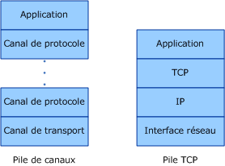
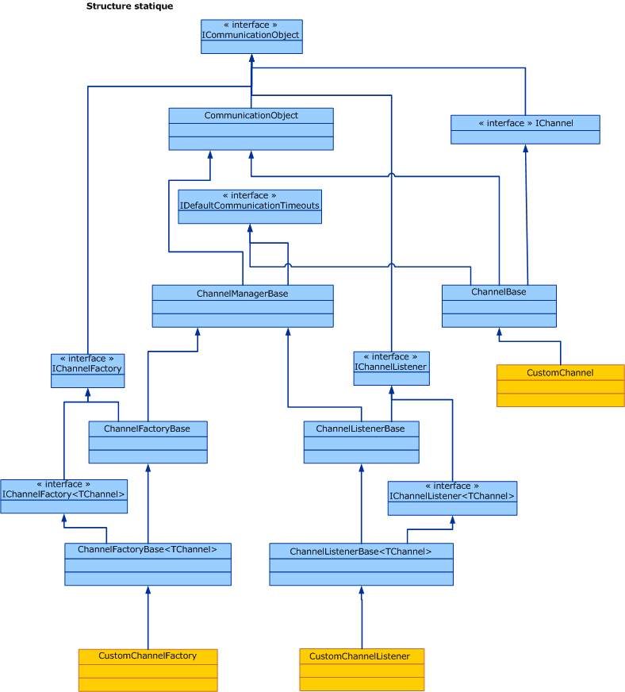

# Vue d'ensemble du modèle de canalChannel Model Overview
La pile de canaux [!INCLUDE[indigo1](../../../../includes/indigo1-md.md)] est une pile de communication superposée qui traitent les messages à l'aide d'un ou plusieurs canaux.The [!INCLUDE[indigo1](../../../../includes/indigo1-md.md)] channel stack is a layered communication stack with one or more channels that process messages. Le canal de transport, qui figure tout en bas de la pile, est chargé d'adapter la pile de canaux au transport sous-jacent (par exemple, au transport TCP, HTTP, SMTP ainsi qu'à d'autres types de transports).At the bottom of the stack is a transport channel that is responsible for adapting the channel stack to the underlying transport (for example, TCP, HTTP, SMTP and other types of transport.). Les canaux fournissent un modèle de programmation de bas niveau pour l'envoi et la réception des messages.Channels provide a low-level programming model for sending and receiving messages. Ce modèle de programmation s'appuie sur plusieurs interfaces et autres types désignés collectivement par le terme « modèle de canal [!INCLUDE[indigo2](../../../../includes/indigo2-md.md)] ».This programming model relies on several interfaces and other types collectively known as the [!INCLUDE[indigo2](../../../../includes/indigo2-md.md)] channel model. Cette rubrique aborde les thèmes suivants : formes de canal, construction d'un écouteur de canal de base (côté service) et fabrication de canal (côté client).This topic discusses channel shapes, the construction of a basic channel listener (on the service) and channel factory (on the client).  
  
## Pile de canauxChannel Stack  
 Les points de terminaison [!INCLUDE[indigo2](../../../../includes/indigo2-md.md)] communiquent avec le reste du monde à l'aide d'une pile de communication appelée pile de canaux.[!INCLUDE[indigo2](../../../../includes/indigo2-md.md)] endpoints communicate with the world using a communication stack called the channel stack. Le diagramme suivant compare la pile de canaux avec d'autres piles de communication, notamment avec la pile TCP/IP.The following diagram compares the channel stack with other communication stacks, for example TCP/IP.  
  
   
  
 Pour commencer, leurs points communs : chaque couche de la pile fournit une abstraction du monde figurant en dessous d'elle et expose cette abstraction uniquement à la couche se trouvant immédiatement au-dessus d'elle.First, the similarities: In both cases, each layer of the stack provides some abstraction of the world below that layer and exposed that abstraction only to the layer directly above it. Chaque couche utilise uniquement l'abstraction de la couche se trouvant immédiatement en dessous d'elle.Each layer uses the abstraction of only the layer directly below it. Lorsque deux piles communiquent, chacune de leurs couches communique avec la couche lui correspondant de l'autre pile, par exemple la couche IP avec la couche IP, la couche TCP avec la couche TCP, etc.Also in both cases, when two stacks communicate, each layer communicates with the corresponding layer in the other stack, for example, the IP layer communicates with the IP layer and the TCP layer with the TCP layer, and so on.  
  
 À présent, leurs différences : alors que la pile TCP a été conçue pour fournir une abstraction du réseau physique, la pile de canaux a été conçue pour fournir une abstraction de la manière dont les messages sont remis, à savoir le transport, mais également pour fournir d'autres fonctionnalités permettant de connaître le contenu des messages, le protocole utilisé pour communiquer (notamment le transport), etc.Now, the differences: While the TCP stack was designed to provide an abstraction of the physical network, the channel stack is designed to provide an abstraction of not only how the message is delivered, that is, the transport, but also other features such as what is in the message or what protocol is used for communication, including the transport but much more than that. Par exemple, l'élément de liaison de session fiable fait partie de la pile de canaux mais ne figure pas en dessous du transport ou du transport lui-même.For example, reliable session binding element is part of the channel stack but is not below the transport or the transport itself. Pour obtenir une abstraction, le canal inférieur dans la pile doit adapter le protocole de transport sous-jacent à l'architecture de la pile de canaux, puis en s'appuyant sur les canaux figurant plus haut dans la pile doit fournir des fonctionnalités de communication, notamment en matière de garanties de fiabilité et de sécurité.This abstraction is achieved by requiring the bottom channel in the stack to adapt the underlying transport protocol to the channel stack architecture and then relying on channels further up in the stack to provide communication features such as reliability guarantees and security.  
  
 Les messages circulent via la pile de communication sous forme d'objets <xref:System.ServiceModel.Channels.Message>.Messages flow through the communication stack as <xref:System.ServiceModel.Channels.Message> objects. Comme illustré sur le schéma ci-dessus, le canal inférieur est appelé canal de transport.As shown in figure above, the bottom channel is called a transport channel. Ce canal est chargé de l'envoi des messages depuis leur expéditeur et de leur réception par leur destinataire.It is the channel that is responsible for sending and receiving messages to and from other parties. Il lui incombe notamment de transformer l'objet <xref:System.ServiceModel.Channels.Message> dans le format utilisé pour communiquer avec les autres correspondants.This includes the responsibility of transforming the <xref:System.ServiceModel.Channels.Message> object to and from the format used to communicate with other parties. Au-dessus de ce canal de transport, peuvent figurer un nombre indéfini de canaux de protocole, chacun d'entre eux offrant des fonctionnalités de communication spécifiques, par exemple en matière de garantie de remise fiable.Above the transport channel there can be any number of protocol channels each responsible for providing a communication function such as reliable delivery guarantees. Les canaux de protocole interviennent sur les messages qui circulent dans la pile sous forme d'objet <xref:System.ServiceModel.Channels.Message>.Protocol channels operate on messages flowing through them in the form of the <xref:System.ServiceModel.Channels.Message> object. En principe, leur tâche consiste à transformer ces messages, par exemple en y ajoutant des en-têtes ou en chiffrant leur contenu. Elle peut également consister à envoyer ou recevoir leurs propres messages de contrôle de protocole, par exemple des accusés de réception.They typically either transform the message, for example, by adding headers or encrypting the body, or send and receive their own protocol control messages, for example, receipt acknowledgments.  
  
## Formes de canalChannel Shapes  
 Chaque canal implémente une ou plusieurs interfaces également désignées par les termes « interfaces de forme de canal » ou « formes de canal ».Each channel implements one or more interfaces known as channel shape interfaces or channel shapes. Ces formes de canal fournissent des méthodes orientées communication, par exemple les méthodes « envoyer et recevoir » ou « demande-réponse » implémentées par le canal ou appelées par l'utilisateur du canal.Those channel shapes provide the communication-oriented methods such as send and receive or request and reply that the channel implements and the user of the channel calls. À la base de formes de canal est la <xref:System.ServiceModel.Channels.IChannel> interface, qui est une interface qui fournit un `GetProperty` \<T > méthode conçu comme un mécanisme superposé pour accéder aux fonctionnalités arbitraires exposées par les canaux de la pile.At the base of the channel shapes is the <xref:System.ServiceModel.Channels.IChannel> interface, which is an interface that provides a `GetProperty`\<T> method intended as a layered mechanism to access arbitrary features exposed by channels in the stack. Les cinq formes de canal qui étendent un objet <xref:System.ServiceModel.Channels.IChannel> sont :The five channel shapes that extend <xref:System.ServiceModel.Channels.IChannel> are:  
  
-   <xref:System.ServiceModel.Channels.IInputChannel>  
  
-   <xref:System.ServiceModel.Channels.IOutputChannel>  
  
-   <xref:System.ServiceModel.Channels.IRequestChannel>  
  
-   <xref:System.ServiceModel.Channels.IReplyChannel>  
  
-   <xref:System.ServiceModel.Channels.IDuplexChannel>  
  
 À chacune de ces formes correspond un équivalent qui étend <xref:System.ServiceModel.Channels.ISessionChannel%601?displayProperty=nameWithType> pour prendre en charge des sessions.Further, each of these shapes has an equivalent that extends <xref:System.ServiceModel.Channels.ISessionChannel%601?displayProperty=nameWithType> to support sessions. Ces équivalents sont :These are:  
  
-   <xref:System.ServiceModel.Channels.IInputSessionChannel>  
  
-   <xref:System.ServiceModel.Channels.IOutputSessionChannel>  
  
-   <xref:System.ServiceModel.Channels.IRequestSessionChannel>  
  
-   <xref:System.ServiceModel.Channels.IReplySessionChannel>  
  
-   <xref:System.ServiceModel.Channels.IDuplexSessionChannel>  
  
 Les modèles des formes de canal s’inspirent de certains des principaux modèles d’échange de messages pris en charge par les protocoles de transport existants.The channel shapes are patterned after some of the fundamental message exchange patterns supported by existing transport protocols. Par exemple, la messagerie unidirectionnelle correspond à un <xref:System.ServiceModel.Channels.IInputChannel> / <xref:System.ServiceModel.Channels.IOutputChannel> paire de demande-réponse correspond à <xref:System.ServiceModel.Channels.IRequestChannel> / <xref:System.ServiceModel.Channels.IReplyChannel> paires et les communications duplex bidirectionnelles correspondent à <xref:System.ServiceModel.Channels.IDuplexChannel> (ce qui étend à la fois <xref:System.ServiceModel.Channels.IInputChannel> et <xref:System.ServiceModel.Channels.IOutputChannel>).For example, one-way messaging corresponds to an <xref:System.ServiceModel.Channels.IInputChannel>/<xref:System.ServiceModel.Channels.IOutputChannel> pair, request-reply corresponds to <xref:System.ServiceModel.Channels.IRequestChannel>/<xref:System.ServiceModel.Channels.IReplyChannel> pairs and two-way duplex communications corresponds to <xref:System.ServiceModel.Channels.IDuplexChannel> (which extends both <xref:System.ServiceModel.Channels.IInputChannel> and <xref:System.ServiceModel.Channels.IOutputChannel>).  
  
## Programmation avec la pile de canauxProgramming with the Channel Stack  
 Les piles de canaux sont créées en principe à l'aide d'un modèle de fabrication, plus précisément à l'aide de liaisons.Channel stacks are typically created using a factory pattern where a binding creates the channel stack. Du côté expédition, une liaison est utilisée pour générer une fabrication <xref:System.ServiceModel.ChannelFactory>, qui génère ensuite une pile de canaux et renvoie une référence au canal figurant en haut de la pile.On the send side, a binding is used to build a <xref:System.ServiceModel.ChannelFactory>, which in turn builds a channel stack and returns a reference to the top channel in the stack. L'application peut utiliser ensuite ce canal pour envoyer des messages.The application can then use this channel to send messages. Pour plus d’informations, consultez [de programmation au niveau du canal de Client](../../../../docs/framework/wcf/extending/client-channel-level-programming.md).For more information, see [Client Channel-Level Programming](../../../../docs/framework/wcf/extending/client-channel-level-programming.md).  
  
 Du côté réception, une liaison est utilisée pour générer un écouteur <xref:System.ServiceModel.Channels.IChannelListener>, qui écoute les messages entrants.On the receive side a binding is used to build a <xref:System.ServiceModel.Channels.IChannelListener>, which listens for incoming messages. L'écouteur <xref:System.ServiceModel.Channels.IChannelListener> envoie des messages à l'application écoutant en créant des piles de canaux et en remettant la référence d'application au canal supérieur.The <xref:System.ServiceModel.Channels.IChannelListener> provides messages to the listening application by creating channel stacks and handing the application reference to the top channel. L'application utilise ensuite ce canal pour recevoir les messages entrants.The application then uses this channel to receive incoming messages. Pour plus d’informations, consultez [de programmation au niveau du canal de Service](../../../../docs/framework/wcf/extending/service-channel-level-programming.md).For more information, see [Service Channel-Level Programming](../../../../docs/framework/wcf/extending/service-channel-level-programming.md).  
  
## Modèle d'objet de canalThe Channel Object Model  
 Le modèle d'objet de canal correspond à l'ensemble principal d'interfaces nécessaire à l'implémentation des canaux, des écouteurs de canal et des fabrications de canaux.The channel object model is the core set of interfaces required to implement channels, channel listeners and channel factories. Certaines classes de base sont également disponibles pour faciliter les implémentations personnalisées.There are also some base classes provided to assist in custom implementations.  
  
 Les écouteurs de canal sont chargés d'écouter les messages entrants, puis de les remettre à la couche supérieure à l'aide des canaux qu'ils ont eux-mêmes créés.Channel listeners are responsible for listening for incoming messages, then delivering them to the layer above through channels created by the channel listener.  
  
 Les fabrications de canaux sont chargées de créer les canaux utilisés pour l'envoi des messages et de fermer ces mêmes canaux à leur propre fermeture.Channel factories are responsible for creating channels that are used for sending messages and for closing all channels they created when the channel factory is closed.  
  
 <xref:System.ServiceModel.ICommunicationObject> est la principale interface qui définit la machine à états de base que tous les objets de communication implémentent.<xref:System.ServiceModel.ICommunicationObject> is the core interface that defines the basic state machine that all communication objects implement. <xref:System.ServiceModel.Channels.CommunicationObject> fournit une implémentation de cette interface principale dont d'autres classes de canal peuvent dériver au lieu de réimplémenter l'interface.<xref:System.ServiceModel.Channels.CommunicationObject> provides an implementation of this core interface that other channel classes can derive from rather than re-implementing the interface. Toutefois, ceci n'est pas obligatoire : un canal personnalisé peut implémenter <xref:System.ServiceModel.ICommunicationObject> directement et ne pas hériter de <xref:System.ServiceModel.Channels.CommunicationObject>.However, this is not required: a custom channel can implement <xref:System.ServiceModel.ICommunicationObject> directly and not inherit from <xref:System.ServiceModel.Channels.CommunicationObject>. Aucune des classes de l'illustration 3 n'est considérée comme faisant partie du modèle de canal. Elles sont disponibles afin d'aider les implémenteurs de canaux personnalisés à construire ces derniers.None of the classes in Figure 3 are considered part of the channel model; they are helpers available to custom channel implementers who want to build channels.  
  
   
  
 Les rubriques suivantes contiennent des informations sur le modèle d'objet de canal ainsi que sur diverses zones de développement qui facilitent la construction de canaux personnalisés.The following topics describe the channel object model as well as various development areas that help build custom channels.  
  
|RubriqueTopic|DescriptionDescription|  
|-----------|-----------------|  
|[Service : Écouteurs de canal et canauxService: Channel Listeners and Channels](../../../../docs/framework/wcf/extending/service-channel-listeners-and-channels.md)|Contient des informations sur les écouteurs de canal, qui écoutent les canaux entrants dans une application de service.Describes channel listeners, which listen for incoming channels in a service application.|  
|[Client : Fabriques de canaux et canauxClient: Channel Factories and Channels](../../../../docs/framework/wcf/extending/client-channel-factories-and-channels.md)|Contient des informations sur les fabrications de canaux, lesquelles créent des canaux pour pouvoir se connecter aux applications de service.Describes channel factories, which create channels to connect to a service application.|  
|[Modifications de la description de l’étatUnderstanding State Changes](../../../../docs/framework/wcf/extending/understanding-state-changes.md)|Contient des informations qui expliquent comment l'état des modèles d'interface <xref:System.ServiceModel.ICommunicationObject?displayProperty=nameWithType> change dans les canaux.Describes how the <xref:System.ServiceModel.ICommunicationObject?displayProperty=nameWithType> interface models state changes in channels.|  
|[Choix d’un modèle d’échange de messagesChoosing a Message Exchange Pattern](../../../../docs/framework/wcf/extending/choosing-a-message-exchange-pattern.md)|Présente les six modèles d’échange de messages de base pris en charge par les canaux.Describes the six basic message exchange patterns that channels can support.|  
|[La gestion des Exceptions et des erreursHandling Exceptions and Faults](../../../../docs/framework/wcf/extending/handling-exceptions-and-faults.md)|Contient des instructions indiquant comment gérer les erreurs et les exceptions qui surviennent sur les canaux personnalisés.Describes how to handle faults and exceptions in custom channels.|  
|[Configuration et la prise en charge des métadonnéesConfiguration and Metadata Support](../../../../docs/framework/wcf/extending/configuration-and-metadata-support.md)|Contient des instructions indiquant comment procéder pour assurer la prise en charge des canaux personnalisés à partir du modèle d’application ainsi que pour exporter et importer des métadonnées à l’aide de liaisons et d’éléments de liaison.Describes how to support the use of custom channels from the application model and how to export and import metadata using bindings and binding elements.|
