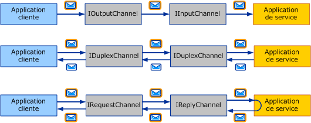
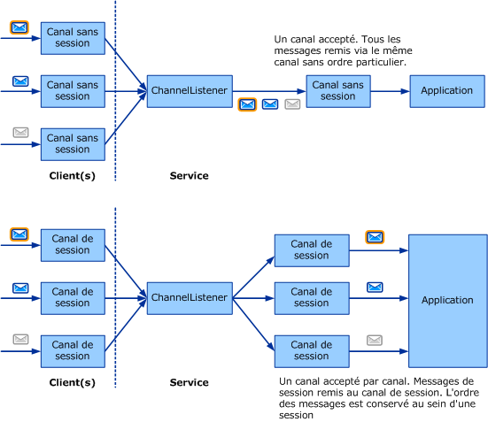

# Sélection d’un modèle d’échange de messages
La première étape de l’écriture d’un transport personnalisé consiste à décider quels *modèles d’échange de messages* (ou MEP) sont requis pour le canal que vous développez. Cette rubrique contient des explications sur les options disponibles ainsi que sur les différentes exigences. C’est la première tâche dans la liste de tâches de développement channel décrite dans [développement canaux](../../../../docs/framework/wcf/extending/developing-channels.md).  
  
## Modèles d’échange de messages  
 Trois MEP sont disponibles :  
  
-   Datagramme (<xref:System.ServiceModel.Channels.IInputChannel> et <xref:System.ServiceModel.Channels.IOutputChannel>)  
  
     Lorsque vous utilisez un MEP datagramme, un client envoie un message à l’aide un *déclenché et oublié* exchange. Un échange de ce type requiert une confirmation hors bande de la réussite de la remise. Le message peut être perdu lors de la transmission et ne jamais atteindre le service. Si l'opération d'envoi s'exécute correctement au niveau du client, cela ne garantit pas que le point de terminaison distant a effectivement reçu le message. Le datagramme est un bloc de construction de messagerie fondamental. Vous pouvez en effet définir vos propres protocoles au-dessus de ce bloc, notamment des protocoles fiables et sécurisés. Les canaux de datagramme du client implémentent l'interface <xref:System.ServiceModel.Channels.IOutputChannel> et ceux du service implémentent l'interface <xref:System.ServiceModel.Channels.IInputChannel>.  
  
-   Demande-réponse (<xref:System.ServiceModel.Channels.IRequestChannel> et <xref:System.ServiceModel.Channels.IReplyChannel>)  
  
     Dans ce MEP, un message est envoyé et une réponse est reçue. Ce modèle se compose de paires demande-réponse. Parmi les exemples d'appels demande-réponse figurent notamment les appels de procédure distante (RPC) et les demandes GET de navigateur. Ce modèle est également connu sous le nom de mode semi-duplex. Dans ce MEP, les canaux du client implémentent <xref:System.ServiceModel.Channels.IRequestChannel> et ceux du service implémentent <xref:System.ServiceModel.Channels.IReplyChannel>.  
  
-   Duplex (<xref:System.ServiceModel.Channels.IDuplexChannel>)  
  
     Le MEP duplex permet à un nombre aléatoire de messages d'être envoyés par un client et d'être reçus dans un ordre indifférencié. Le MEP duplex est similaire à une conversation téléphonique, où chaque mot prononcé correspond à un message. Les deux côtés pouvant envoyer et recevoir des messages dans ce MEP, l'interface implémentée par les canaux du client et du service est <xref:System.ServiceModel.Channels.IDuplexChannel>.  
  
   
Les trois modèles d’échange de messages de base. De haut en bas : datagramme, demande-réponse et duplex.  
  
 Chacun de ces MEP peut également prendre en charge *sessions*. Une session (et une implémentation de <xref:System.ServiceModel.Channels.ISessionChannel%601?displayProperty=nameWithType> de type <xref:System.ServiceModel.Channels.ISession?displayProperty=nameWithType>) met en corrélation tous les messages envoyés et reçus sur un canal. Le modèle de demande-réponse correspond à une session autonome à deux messages, la demande et la réponse étant corrélées. Par comparaison, lorsque le modèle demande-réponse prend en charge les sessions, cela signifie que toutes les paires demande-réponse envoyées et reçues sur le canal doivent être corrélées les unes avec les autres. Vous pouvez donc choisir entre six MEP au total :  
  
-   Datagramme  
  
-   Demande-réponse  
  
-   Duplex  
  
-   Datagramme avec sessions  
  
-   Demande-réponse avec sessions  
  
-   Duplex avec sessions  
  
> [!NOTE]
>  Pour le transport UDP, le seul MEP pris en charge est datagramme, le protocole UDP, de part sa nature même, permettant uniquement l'échange de messages de type « déclenché et oublié ».  
  
## Sessions et canaux de session  
 En matière de réseaux, il existe des protocoles orientés connexion (par exemple, le protocole TCP) et des protocoles sans connexion (par exemple, le protocole UDP). [!INCLUDE[indigo2](../../../../includes/indigo2-md.md)] utilise le terme « session » à la place du terme « connexion » à des fins d'abstraction logique. Les protocoles de session WCF s'apparentent aux protocoles de réseau orientés connexion et les protocoles sans session WCF aux protocoles de réseau sans connexion.  
  
 Dans le modèle d'objet de canal, chaque session logique se manifeste sous forme d'instance de canal de session. Par conséquent, chaque nouvelle session créée par le client et acceptée par le service correspond à un nouveau canal de session de part et d'autre. Le diagramme suivant contient, dans sa partie supérieure, la structure des canaux sans session et, dans sa partie inférieure, la structure des canaux de session.  
  
   
  
 Un client crée un nouveau canal de session, puis envoie un message. Du côté du service, l'écouteur de canal reçoit ce message et détecte qu'il appartient à une nouvelle session. Il crée par conséquent un nouveau canal de session qu'il transmet à l'application (en réponse à l'appel AcceptChannel transmis par cette dernière). L'application reçoit alors le message ainsi que tous les messages suivants envoyés dans la même session via le même canal de session.  
  
 Un autre client (ou le même client que précédemment) crée un nouveau canal de session, puis envoie un message. L'écouteur de canal détecte que ce message figure dans une nouvelle session et crée un nouveau canal de session, puis la même procédure se répète.  
  
 Sans session, il n'existe pas de corrélation entre canaux et sessions. Par conséquent, l'écouteur de canal crée un seul canal via lequel tous les messages sont reçus, puis remis à l'application. En l'absence de session pour maintenir l'ordre des messages, ceux-ci sont transmis sans respecter leur ordre d'envoi. La partie supérieure du graphique précédent illustre un échange de messages sans session.  
  
## Démarrage et fin des sessions  
 Les sessions sont démarrées à partir du client à la création par ce dernier d'un nouveau canal de session. Elles sont démarrées à partir du service à réception par cette dernière d'un message envoyé dans une nouvelle session. De la même façon, les sessions sont arrêtées par la fermeture ou l'annulation du canal de session.  
  
 Le canal <xref:System.ServiceModel.Channels.IDuplexSessionChannel> qui est utilisé à la fois pour l'envoi et la réception des messages selon un modèle de communication duplex avec session fait exception à cette règle. L'une des parties peut souhaiter ne plus envoyer de messages tout en continuant à en recevoir. Par conséquent, lors de l'utilisation d'un canal <xref:System.ServiceModel.Channels.IDuplexSessionChannel>, un système vous permet de fermer la session de sortie, indiquant ainsi que vous ne souhaitez plus envoyer de messages, tout en maintenant la session d'entrée ouverte, ce qui vous permet en revanche de continuer à en recevoir.  
  
 En général, les sessions sont fermées du côté sortant et non du côté entrant. En d'autres termes, il est possible de fermer les canaux de sortie des sessions, permettant ainsi de mettre correctement un terme à ces dernières. Lorsqu'un canal de sortie de session est fermé, le canal d'entrée de session retourne la valeur null en réponse à l'appel <xref:System.ServiceModel.Channels.IInputChannel.Receive%2A?displayProperty=nameWithType> de l'application sur <xref:System.ServiceModel.Channels.IDuplexSessionChannel>.  
  
 Cependant, les canaux d'entrée de session ne doivent pas être fermés, sauf si la méthode <xref:System.ServiceModel.Channels.IInputChannel.Receive%2A?displayProperty=nameWithType> sur <xref:System.ServiceModel.Channels.IDuplexSessionChannel> retourne la valeur null, indiquant alors que la session est déjà fermée. Lorsque la méthode <xref:System.ServiceModel.Channels.IInputChannel.Receive%2A?displayProperty=nameWithType> sur <xref:System.ServiceModel.Channels.IDuplexSessionChannel> ne retourne pas la valeur null, la fermeture du canal d'entrée de session risque de lever une exception, celui-ci étant susceptible de recevoir des messages de manière inopinée pendant le processus de fermeture. Lorsque le destinataire souhaite mettre un terme à la session avant l'expéditeur, il doit appeler la méthode <xref:System.ServiceModel.ICommunicationObject.Abort%2A> sur le canal d'entrée, mettant ainsi un terme brutal à la session.  
  
## Création des canaux de session  
 Lorsque vous créez des canaux de session, ceux-ci doivent remplir certaines conditions pour permettre l'avènement des sessions. Du côté expéditeur, votre canal doit :  
  
-   Créer une nouvelle session (pour chaque nouveau canal) et y associer un nouvel ID de session correspondant à une chaîne unique. Ou obtenir une nouvelle session à partir du canal de session figurant en dessous du vôtre dans la pile.  
  
-   Si votre canal a créé la session (c'est-à-dire qu'il ne l'a pas obtenue à partir de la couche figurant en dessous du vôtre dans la pile), vous devez associer chaque message envoyé à l'aide de ce canal à cette session. Pour les canaux de protocole, cette association s'effectue en principe en ajoutant un en-tête SOAP. Pour les canaux de transport, cette association s'effectue en principe en créant une nouvelle connexion de transport ou en ajoutant des informations de session au protocole de tramage.  
  
-   Pour chaque message envoyé à l'aide de ce canal, vous devez également fournir les garanties de remise mentionnées ci-dessus. Si vous utilisez le canal figurant en dessous du vôtre dans la pile pour générer la session, ce canal fournira également les garanties de remise requises. Si la session est générée par votre propre canal, vous devrez implémenter ces garanties dans le cadre de votre propre protocole. En principe, si vous rédigez un canal de protocole en supposant que WCF est utilisé de part et d'autre, vous aurez vraisemblablement besoin d'un transport TCP ou d'un canal de messagerie fiable pour générer la session.  
  
-   Lorsque la méthode <xref:System.ServiceModel.ICommunicationObject.Close%2A?displayProperty=nameWithType> est appelée sur votre canal, effectuez la tâche requise pour fermer la session en utilisant le délai spécifié ou le délai par défaut. Cette tâche peut simplement consister à appeler la méthode <xref:System.ServiceModel.ICommunicationObject.Close%2A> sur le canal figurant en dessous du vôtre dans la pile (s'il s'agit du canal utilisé pour obtenir la session), à envoyer un message SOAP spécial ou à fermer une connexion de transport.  
  
-   Lorsque la méthode <xref:System.ServiceModel.ICommunicationObject.Abort%2A> est appelée sur votre canal, mettez sans plus attendre un terme à la session sans effectuer d'E/S. Cette fermeture peut être sans conséquence ou signifier l'annulation d'une connexion réseau ou d'une autre ressource.  
  
 Du côté destinataire, votre canal doit :  
  
-   Permettre à l'écouteur de canal de détecter la session à laquelle chaque message entrant appartient. S'il s'agit du premier message dans la session, l'écouteur de canal doit créer un nouveau canal et le retourner en réponse à l'appel de la méthode <xref:System.ServiceModel.Channels.IChannelListener%601.AcceptChannel%2A?displayProperty=nameWithType>. Dans le cas contraire, l'écouteur de canal doit rechercher le canal existant, correspondant à la session et remettre le message via ce canal.  
  
-   Si la session a été générée par votre propre canal (avec les garanties de remise requises), le destinataire devra peut-être effectuer certaines opérations, telles que remettre les messages dans l'ordre ou envoyer des accusés de réception.  
  
-   Lorsque la méthode <xref:System.ServiceModel.ICommunicationObject.Close%2A> est appelée sur votre canal, opérez la tâche requise pour fermer la session en utilisant le délai spécifié ou le délai par défaut. Cette opération peut provoquer la levée d'une exception si le canal reçoit un message avant expiration du délai de fermeture. Ce qui est prévisible dans la mesure où l'état du canal est « en cours de fermeture » lorsqu'il reçoit le message.  
  
-   Lorsque la méthode <xref:System.ServiceModel.ICommunicationObject.Abort%2A> est appelée sur votre canal, mettez sans plus attendre un terme à la session sans effectuer d'E/S. Encore une fois, cette fermeture peut être sans conséquence ou signifier l'annulation d'une connexion réseau ou d'une autre ressource.  
  
## Voir aussi  
 [Vue d’ensemble du modèle de canal](../../../../docs/framework/wcf/extending/channel-model-overview.md)
