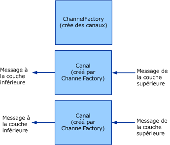

# <a name="client-channel-factories-and-channels"></a><span data-ttu-id="0337f-102">Client : fabrications de canaux et canaux</span><span class="sxs-lookup"><span data-stu-id="0337f-102">Client: Channel Factories and Channels</span></span>
<span data-ttu-id="0337f-103">Cette rubrique décrit la création de fabrications de canaux et de canaux.</span><span class="sxs-lookup"><span data-stu-id="0337f-103">This topic discusses the creation of channel factories and channels.</span></span>  
  
## <a name="channel-factories-and-channels"></a><span data-ttu-id="0337f-104">Fabrications de canaux et canaux</span><span class="sxs-lookup"><span data-stu-id="0337f-104">Channel Factories and Channels</span></span>  
 <span data-ttu-id="0337f-105">Les fabrications de canaux sont chargées de créer des canaux.</span><span class="sxs-lookup"><span data-stu-id="0337f-105">Channel factories are responsible for creating channels.</span></span> <span data-ttu-id="0337f-106">Les canaux créés par les fabrications de canaux sont utilisés pour l'envoi de messages.</span><span class="sxs-lookup"><span data-stu-id="0337f-106">Channels created by channel factories are used for sending messages.</span></span> <span data-ttu-id="0337f-107">Ces canaux sont chargés d'obtenir le message de la couche supérieure, quel que soit le traitement nécessaire pour y arriver, puis de l'envoyer à la couche inférieure.</span><span class="sxs-lookup"><span data-stu-id="0337f-107">These channels are responsible for getting the message from the layer above, performing whatever processing is necessary, then sending the message to the layer below.</span></span> <span data-ttu-id="0337f-108">Le graphique ci-dessous illustre ce processus.</span><span class="sxs-lookup"><span data-stu-id="0337f-108">The following graphic illustrates this process.</span></span>  
  
 <span data-ttu-id="0337f-109"></span><span class="sxs-lookup"><span data-stu-id="0337f-109"></span></span>  
<span data-ttu-id="0337f-110">Une fabrication de canal crée des canaux.</span><span class="sxs-lookup"><span data-stu-id="0337f-110">A channel factory creates channels.</span></span>  
  
 <span data-ttu-id="0337f-111">Une fois fermées, les fabrications de canaux sont chargées de fermer tous les canaux qu'elles ont créés et qui ne sont pas déjà fermés.</span><span class="sxs-lookup"><span data-stu-id="0337f-111">When closed, channel factories are responsible for closing any channels they created that are not yet closed.</span></span> <span data-ttu-id="0337f-112">Notez que le modèle présenté ici est asymétrique car lorsqu'un écouteur de canal est fermé, il cesse seulement d'accepter de nouveaux canaux mais laisse les canaux existants ouverts afin qu'ils puissent continuer à recevoir des messages.</span><span class="sxs-lookup"><span data-stu-id="0337f-112">Note that the model is asymmetric here because when a channel listener is closed, it only stops accepting new channels but leaves existing channels open so that they can continue receiving messages.</span></span>  
  
 [!INCLUDE[indigo2](../../../../includes/indigo2-md.md)]<span data-ttu-id="0337f-113"> fournit des assistants de classe de base pour ce processus.</span><span class="sxs-lookup"><span data-stu-id="0337f-113"> provides base class helpers for this process.</span></span> <span data-ttu-id="0337f-114">(Pour un diagramme des classes d’assistance canal décrites dans cette rubrique, consultez [vue d’ensemble du modèle de canal](../../../../docs/framework/wcf/extending/channel-model-overview.md).)</span><span class="sxs-lookup"><span data-stu-id="0337f-114">(For a diagram of the channel helper classes discussed in this topic, see [Channel Model Overview](../../../../docs/framework/wcf/extending/channel-model-overview.md).)</span></span>  
  
-   <span data-ttu-id="0337f-115">Le <xref:System.ServiceModel.Channels.CommunicationObject> la classe implémente <xref:System.ServiceModel.ICommunicationObject> et applique la machine à états décrite à l’étape 2 de [développement canaux](../../../../docs/framework/wcf/extending/developing-channels.md).</span><span class="sxs-lookup"><span data-stu-id="0337f-115">The <xref:System.ServiceModel.Channels.CommunicationObject> class implements <xref:System.ServiceModel.ICommunicationObject> and enforces the state machine described in step 2 of [Developing Channels](../../../../docs/framework/wcf/extending/developing-channels.md).</span></span>  
  
-   <span data-ttu-id="0337f-116">Le «<xref:System.ServiceModel.Channels.ChannelManagerBase> la classe implémente <xref:System.ServiceModel.Channels.CommunicationObject> et fournit une classe de base unifiée pour <xref:System.ServiceModel.Channels.ChannelFactoryBase?displayProperty=nameWithType> et <xref:System.ServiceModel.Channels.ChannelListenerBase?displayProperty=nameWithType>.</span><span class="sxs-lookup"><span data-stu-id="0337f-116">The``<xref:System.ServiceModel.Channels.ChannelManagerBase> class implements <xref:System.ServiceModel.Channels.CommunicationObject> and provides a unified base class for <xref:System.ServiceModel.Channels.ChannelFactoryBase?displayProperty=nameWithType> and <xref:System.ServiceModel.Channels.ChannelListenerBase?displayProperty=nameWithType>.</span></span> <span data-ttu-id="0337f-117">La classe <xref:System.ServiceModel.Channels.ChannelManagerBase> fonctionne avec <xref:System.ServiceModel.Channels.ChannelBase>, qui est une classe de base implémentant <xref:System.ServiceModel.Channels.IChannel>.</span><span class="sxs-lookup"><span data-stu-id="0337f-117">The <xref:System.ServiceModel.Channels.ChannelManagerBase> class works in conjunction with <xref:System.ServiceModel.Channels.ChannelBase>, which is a base class that implements <xref:System.ServiceModel.Channels.IChannel>.</span></span>  
  
-   <span data-ttu-id="0337f-118">Le ''<xref:System.ServiceModel.Channels.ChannelFactoryBase> la classe implémente <xref:System.ServiceModel.Channels.ChannelManagerBase> et <xref:System.ServiceModel.Channels.IChannelFactory> et regroupe les `CreateChannel` les surcharges en une seule `OnCreateChannel` méthode abstraite.</span><span class="sxs-lookup"><span data-stu-id="0337f-118">The``<xref:System.ServiceModel.Channels.ChannelFactoryBase> class implements <xref:System.ServiceModel.Channels.ChannelManagerBase> and <xref:System.ServiceModel.Channels.IChannelFactory> and consolidates the `CreateChannel` overloads into one `OnCreateChannel` abstract method.</span></span>  
  
-   <span data-ttu-id="0337f-119">Le «<xref:System.ServiceModel.Channels.ChannelListenerBase> la classe implémente <xref:System.ServiceModel.Channels.IChannelListener>.</span><span class="sxs-lookup"><span data-stu-id="0337f-119">The``<xref:System.ServiceModel.Channels.ChannelListenerBase> class implements <xref:System.ServiceModel.Channels.IChannelListener>.</span></span> <span data-ttu-id="0337f-120">Elle se charge de la gestion d'état de base.</span><span class="sxs-lookup"><span data-stu-id="0337f-120">It takes care of basic state management.</span></span>  
  
 <span data-ttu-id="0337f-121">La discussion suivante est basée sur le [Transport : UDP](../../../../docs/framework/wcf/samples/transport-udp.md) exemple.</span><span class="sxs-lookup"><span data-stu-id="0337f-121">The following discussion is based upon the [Transport: UDP](../../../../docs/framework/wcf/samples/transport-udp.md) sample.</span></span>  
  
### <a name="creating-a-channel-factory"></a><span data-ttu-id="0337f-122">Création d'une fabrication de canal</span><span class="sxs-lookup"><span data-stu-id="0337f-122">Creating a Channel Factory</span></span>  
 <span data-ttu-id="0337f-123">`UdpChannelFactory` dérive de <xref:System.ServiceModel.Channels.ChannelFactoryBase>.</span><span class="sxs-lookup"><span data-stu-id="0337f-123">The `UdpChannelFactory` derives from <xref:System.ServiceModel.Channels.ChannelFactoryBase>.</span></span> <span data-ttu-id="0337f-124">L'exemple substitue <xref:System.ServiceModel.Channels.ChannelFactoryBase.GetProperty%2A> pour fournir un accès à la version du message de l'encodeur de message.</span><span class="sxs-lookup"><span data-stu-id="0337f-124">The sample overrides <xref:System.ServiceModel.Channels.ChannelFactoryBase.GetProperty%2A> to provide access to the message version of the message encoder.</span></span> <span data-ttu-id="0337f-125">L'exemple substitue également <xref:System.ServiceModel.Channels.ChannelFactoryBase.OnClose%2A> pour détruire notre instance de <xref:System.ServiceModel.Channels.BufferManager> lors des transitions d'ordinateurs d'état.</span><span class="sxs-lookup"><span data-stu-id="0337f-125">The sample also overrides <xref:System.ServiceModel.Channels.ChannelFactoryBase.OnClose%2A> to tear down our instance of <xref:System.ServiceModel.Channels.BufferManager> when the state machine transitions.</span></span>  
  
#### <a name="the-udp-output-channel"></a><span data-ttu-id="0337f-126">Canal de sortie UDP</span><span class="sxs-lookup"><span data-stu-id="0337f-126">The UDP Output Channel</span></span>  
 <span data-ttu-id="0337f-127">`UdpOutputChannel` implémente <xref:System.ServiceModel.Channels.IOutputChannel>.</span><span class="sxs-lookup"><span data-stu-id="0337f-127">The `UdpOutputChannel` implements <xref:System.ServiceModel.Channels.IOutputChannel>.</span></span> <span data-ttu-id="0337f-128">Le constructeur valide les arguments et construit un objet <xref:System.Net.EndPoint> de destination reposant sur le <xref:System.ServiceModel.EndpointAddress> qui est passé.</span><span class="sxs-lookup"><span data-stu-id="0337f-128">The constructor validates the arguments and constructs a destination <xref:System.Net.EndPoint> object based on the <xref:System.ServiceModel.EndpointAddress> that is passed in.</span></span>  
  
 <span data-ttu-id="0337f-129">La substitution de la méthode <xref:System.ServiceModel.Channels.CommunicationObject.OnOpen%2A> crée un socket qui est utilisé pour envoyer des messages à ce <xref:System.Net.EndPoint>.</span><span class="sxs-lookup"><span data-stu-id="0337f-129">The override of <xref:System.ServiceModel.Channels.CommunicationObject.OnOpen%2A> creates a socket that is used to send messages to this <xref:System.Net.EndPoint>.</span></span>  
  
 `this.socket = new Socket(`  
  
 `this.remoteEndPoint.AddressFamily,`  
  
 `SocketType.Dgram,`  
  
 `ProtocolType.Udp`  
  
 `);`  
  
 <span data-ttu-id="0337f-130">Le canal peut être fermé de façon appropriée ou incorrecte.</span><span class="sxs-lookup"><span data-stu-id="0337f-130">The channel can be closed gracefully or ungracefully.</span></span> <span data-ttu-id="0337f-131">Si le canal est fermé de façon normale, le socket est fermé et un appel à la méthode `OnClose` de la classe de base est réalisé.</span><span class="sxs-lookup"><span data-stu-id="0337f-131">If the channel is closed gracefully the socket is closed and a call is made to the base class `OnClose` method.</span></span> <span data-ttu-id="0337f-132">Si une exception est alors levée, l'infrastructure appelle `Abort` pour veiller à ce que le canal soit nettoyé.</span><span class="sxs-lookup"><span data-stu-id="0337f-132">If this throws an exception, the infrastructure calls `Abort` to ensure the channel is cleaned up.</span></span>  
  
```  
this.socket.Close();  
base.OnClose(timeout);  
```  
  
 <span data-ttu-id="0337f-133">Implémentez `Send()` et `BeginSend()` / `EndSend()`.</span><span class="sxs-lookup"><span data-stu-id="0337f-133">Implement `Send()` and `BeginSend()`/`EndSend()`.</span></span> <span data-ttu-id="0337f-134">Deux phases peuvent alors être distinguées.</span><span class="sxs-lookup"><span data-stu-id="0337f-134">This breaks down into two main sections.</span></span> <span data-ttu-id="0337f-135">Tout d'abord, la sérialisation du message dans un tableau d'octets :</span><span class="sxs-lookup"><span data-stu-id="0337f-135">First serialize the message into a byte array:</span></span>  
  
```  
ArraySegment<byte> messageBuffer = EncodeMessage(message);  
```  
  
 <span data-ttu-id="0337f-136">Puis, l'envoi des données obtenues sur le câble :</span><span class="sxs-lookup"><span data-stu-id="0337f-136">Then send the resulting data on the wire:</span></span>  
  
```  
this.socket.SendTo(  
  messageBuffer.Array,   
  messageBuffer.Offset,   
  messageBuffer.Count,   
  SocketFlags.None,   
  this.remoteEndPoint  
);  
```  
  
## <a name="see-also"></a><span data-ttu-id="0337f-137">Voir aussi</span><span class="sxs-lookup"><span data-stu-id="0337f-137">See Also</span></span>  
 [<span data-ttu-id="0337f-138">Développement de canaux</span><span class="sxs-lookup"><span data-stu-id="0337f-138">Developing Channels</span></span>](../../../../docs/framework/wcf/extending/developing-channels.md)
