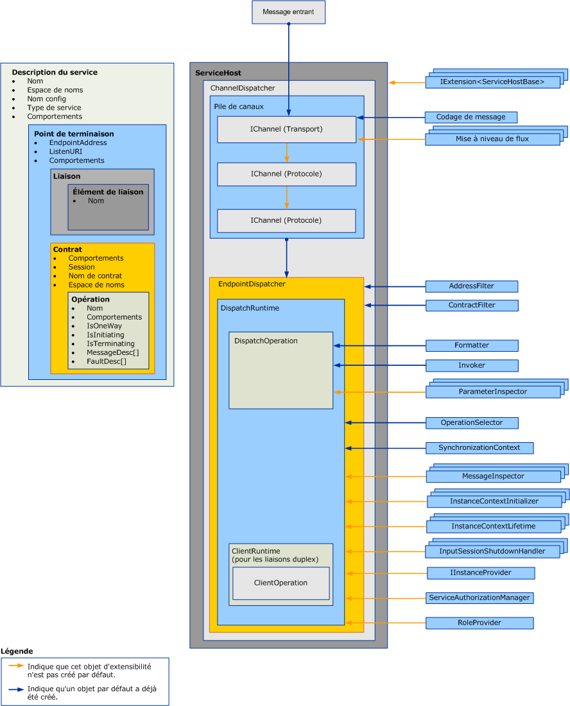

# Extension des répartiteurs
Les répartiteurs sont chargés de tirer des messages entrants des canaux sous-jacents, de les traduire dans des appels de méthode dans le code d’application et de renvoyer les résultats à l’appelant. Les extensions de répartiteurs vous permettent de modifier ce traitement.  Vous pouvez implémenter des inspecteurs de messages ou de paramètres qui inspectent ou modifient le contenu des messages ou des paramètres.  Vous pouvez modifier la manière dont les messages sont acheminés vers les opérations ou fournir d'autres fonctionnalités.  
  
 Cette rubrique décrit comment utiliser les classes <xref:System.ServiceModel.Dispatcher.DispatchRuntime> et <xref:System.ServiceModel.Dispatcher.DispatchOperation> dans une application cliente [!INCLUDE[indigo1](../../../../includes/indigo1-md.md)] afin de modifier le comportement d'exécution par défaut d'un répartiteur ou d'intercepter ou de modifier des messages, des paramètres ou des valeurs de retour avant ou à la suite de leur envoi ou de leur récupération dans la couche du canal. Pour plus d’informations sur le traitement des messages client équivalent runtime, consultez [Clients d’extension](../../../../docs/framework/wcf/extending/extending-clients.md). Pour comprendre le rôle qui <xref:System.ServiceModel.IExtensibleObject%601> types lire dans l’accès à un état partagé entre les différents objets de personnalisation du runtime, consultez [objets extensibles](../../../../docs/framework/wcf/extending/extensible-objects.md).  
  
## Répartiteurs  
 La couche de modèle de service effectue la conversion entre le modèle de programmation du développeur et l'échange de message sous-jacent, ou communément, couche de canal. Dans [!INCLUDE[indigo2](../../../../includes/indigo2-md.md)] les répartiteurs de canal et de point de terminaison (<xref:System.ServiceModel.Dispatcher.ChannelDispatcher> et <xref:System.ServiceModel.Dispatcher.EndpointDispatcher>, respectivement) sont les composants de service chargés d'accepter de nouveaux canaux, de recevoir des messages, de distribuer et d'appeler l'opération et de traiter la réponse. Les objets de répartiteur sont des objets de récepteur, mais les implémentations de contrat de rappel dans les services duplex exposent également leurs objets de répartiteur pour l'inspection, le changement ou l'extension.  
  
 Le répartiteur de canal (et le <xref:System.ServiceModel.Channels.IChannelListener>d'accompagnement) extrait des messages hors du canal sous-jacent et passe les messages à leurs répartiteurs de point de terminaison respectifs. Chaque répartiteur de point de terminaison a un <xref:System.ServiceModel.Dispatcher.DispatchRuntime> qui route des messages au <xref:System.ServiceModel.Dispatcher.DispatchOperation> approprié, chargé d'appeler la méthode qui implémente l'opération. Différentes classes d'extension facultatives et requises sont appelées. Cette rubrique explique comment ces morceaux s'ajustent les uns aux autres et comment vous pouvez modifier des propriétés et brancher votre propre code pour étendre les fonctionnalités de base.  
  
 Les propriétés de répartiteur et les objets de personnalisation modifiés sont insérés en utilisant un service, un point de terminaison, un contrat ou les objets de comportement de l'opération. Cette rubrique ne décrit pas comment utiliser des comportements. Pour plus d’informations sur les types utilisés pour insérer des modifications de répartiteur, consultez [configuration et l’extension de l’exécution des comportements](../../../../docs/framework/wcf/extending/configuring-and-extending-the-runtime-with-behaviors.md).  
  
 Le graphique suivant fournit une vue d'ensemble des éléments architecturaux dans un service.  
  
   
  
### Répartiteurs de canal  
 Un objet <xref:System.ServiceModel.Dispatcher.ChannelDispatcher> est créé pour associer un objet <xref:System.ServiceModel.Channels.IChannelListener> à un URI donné (appelé « URI d'écoute ») avec une instance d'un service. Chaque objet <xref:System.ServiceModel.ServiceHost> peut avoir de nombreux objets <xref:System.ServiceModel.Dispatcher.ChannelDispatcher>, chacun étant associé à un seul écouteur et à un seul URI d'écoute. Lorsqu'un message arrive, le <xref:System.ServiceModel.Dispatcher.ChannelDispatcher> interroge chacun des objets <xref:System.ServiceModel.Dispatcher.EndpointDispatcher> associés pour déterminer si le point de terminaison peut accepter le message, et passe le message à celui-ci.  
  
 Toutes les propriétés qui contrôlent la durée de vie et le comportement d'une session de canal sont disponibles pour l'inspection ou la modification sur l'objet <xref:System.ServiceModel.Dispatcher.ChannelDispatcher>. Cela inclut les initialiseurs de canal personnalisés, l'écouteur de canal, l'hôte, le <xref:System.ServiceModel.InstanceContext>associé, et ainsi de suite.  
  
### Répartiteurs de point de terminaison  
 L'objet <xref:System.ServiceModel.Dispatcher.EndpointDispatcher> est chargé du traitement des messages à partir d'un <xref:System.ServiceModel.Dispatcher.ChannelDispatcher> lorsque l'adresse de destination d'un message correspond à la propriété <xref:System.ServiceModel.Dispatcher.EndpointDispatcher.AddressFilter%2A> et que l'action de message correspond à la propriété <xref:System.ServiceModel.Dispatcher.EndpointDispatcher.ContractFilter%2A>. Si deux objets <xref:System.ServiceModel.Dispatcher.EndpointDispatcher> peuvent accepter un message, la valeur de la propriété <xref:System.ServiceModel.Dispatcher.EndpointDispatcher.FilterPriority%2A> détermine le point de terminaison dont la priorité est la plus élevée.  
  
 Utilisez <xref:System.ServiceModel.Dispatcher.EndpointDispatcher> pour acquérir les deux principaux points d'extension de modèle de service, les classes <xref:System.ServiceModel.Dispatcher.DispatchRuntime> et <xref:System.ServiceModel.Dispatcher.DispatchOperation>, que vous pouvez utiliser pour personnaliser le traitement du répartiteur. La classe <xref:System.ServiceModel.Dispatcher.DispatchRuntime> permet aux utilisateurs d'intercepter et d'étendre le répartiteur à l'étendue du contrat (autrement dit, pour tous les messages dans un contrat). La classe <xref:System.ServiceModel.Dispatcher.DispatchOperation> permet aux utilisateurs d'intercepter et d'étendre le répartiteur à une étendue d'opération (autrement dit, pour tous les messages dans une opération).  
  
## Scénarios  
 Plusieurs raisons d'étendre le répartiteur existent :  
  
-   Validation personnalisée des messages. Les utilisateurs peuvent s'assurer qu'un message est valide pour un schéma spécifique. Cela peut être accompli en implémentant les interfaces d'intercepteur de messages. Pour obtenir un exemple, consultez [inspecteurs de Message](../../../../docs/framework/wcf/samples/message-inspectors.md).  
  
-   Enregistrement personnalisé des messages. Les utilisateurs peuvent inspecter et enregistrer des jeux de messages d'application qui transitent par un point de terminaison. Cela peut également être accompli à l'aide des interfaces de l'intercepteur de messages.  
  
-   Transformations personnalisées des messages. Les utilisateurs peuvent appliquer certaines transformations au message dans l'exécution (par exemple, pour le contrôle de la version). Cela peut, à nouveau, être accompli à l'aide des interfaces de l'intercepteur de messages.  
  
-   Modèle personnalisé de données. Les utilisateurs peuvent disposer d'un modèle de sérialisation des données autre que celui pris en charge par défaut dans [!INCLUDE[indigo2](../../../../includes/indigo2-md.md)] (à savoir, <xref:System.Runtime.Serialization.DataContractSerializer?displayProperty=nameWithType>, <xref:System.Xml.Serialization.XmlSerializer?displayProperty=nameWithType>et messages bruts). Cela peut être accompli en implémentant les interfaces du module de formatage de messages. Pour obtenir un exemple, consultez [formateur d’opération et le sélecteur d’opération](../../../../docs/framework/wcf/samples/operation-formatter-and-operation-selector.md).  
  
-   Validation personnalisée des paramètres. Les utilisateurs peuvent s'assurer que les paramètres typés sont valides (contrairement à XML). Cela peut être accompli à l'aide des interfaces de l'inspecteur de paramètres.  
  
-   Distribution personnalisée d'opérations. Les utilisateurs peuvent implémenter la distribution sur autre chose qu'une action. par exemple, sur le corps ou sur une propriété de message personnalisée. Cela peut s'effectuer à l'aide de l'interface <xref:System.ServiceModel.Dispatcher.IDispatchOperationSelector>. Pour obtenir un exemple, consultez [formateur d’opération et le sélecteur d’opération](../../../../docs/framework/wcf/samples/operation-formatter-and-operation-selector.md).  
  
-   mise en pool d’objet Les utilisateurs peuvent regrouper des instances plutôt qu'allouer une nouvelle instance pour chaque appel. Cela peut être implémenté à l'aide des interfaces du fournisseur d'instances. Pour obtenir un exemple, consultez [Pooling](../../../../docs/framework/wcf/samples/pooling.md).  
  
-   Bail d'instances. Les utilisateurs peuvent implémenter un modèle de bail pour la durée de vie de l'instance, semblable à celui de .NET Framework Remoting. Cela peut s'effectuer à l'aide des interfaces de durée de vie de contexte d'instance.  
  
-   Gestion personnalisée des erreurs. Les utilisateurs peuvent contrôler à la fois, comment les erreurs locales sont traitées et comment les erreurs sont retournées aux clients. Cela peut être implémenté à l'aide des interfaces <xref:System.ServiceModel.Dispatcher.IErrorHandler>.  
  
-   Comportements d'autorisation personnalisés. Les utilisateurs peuvent implémenter un contrôle d'accès personnalisé en étendant les morceaux d'exécution Contrat ou Opération et en ajoutant des vérifications de sécurité en fonction des jetons présents dans le message. Cela peut être accompli en utilisant soit les interfaces de l'intercepteur de messages, soit les interfaces de l'intercepteur de paramètres. Pour obtenir des exemples, consultez [extensibilité de la sécurité](../../../../docs/framework/wcf/samples/security-extensibility.md).  
  
    > [!CAUTION]
    >  Parce qu'altérer des propriétés de sécurité peut compromettre la sécurité des applications [!INCLUDE[indigo2](../../../../includes/indigo2-md.md)], il est fortement recommandé d'accorder un soin particulier aux changements relatifs à la sécurité et de procéder à des tests complets avant le déploiement.  
  
-   Validateurs d'exécution WCF personnalisés. Vous pouvez installer des validateurs personnalisés qui examinent des services, des contrats et des liaisons pour mettre en vigueur des stratégies au niveau de l'entreprise en ce qui concerne les applications [!INCLUDE[indigo2](../../../../includes/indigo2-md.md)]. (Par exemple, consultez [Comment : verrouiller bas points de terminaison de l’entreprise](../../../../docs/framework/wcf/extending/how-to-lock-down-endpoints-in-the-enterprise.md).)  
  
### Utilisation de la classe DispatchRuntime  
 Utilisez la classe <xref:System.ServiceModel.Dispatcher.DispatchRuntime> pour modifier le comportement par défaut d'un service ou d'un point de terminaison individuel, ou insérer des objets qui implémentent des changements personnalisés vers un ou deux des processus de service (ou processus client, dans le cas d'un client duplex) suivants :  
  
-   La transformation de messages entrants dans les objets et la diffusion de ces objets comme appels de méthode sur un objet de service.  
  
-   La transformation d'objets reçu de la réponse à un appel d'opération de service dans des messages sortants.  
  
 <xref:System.ServiceModel.Dispatcher.DispatchRuntime> vous permet d'intercepter et d'étendre le canal ou le répartiteur de point de terminaison pour tous les messages à travers un contrat particulier, même lorsqu'un message n'est pas reconnu. Lorsqu'un message arrive et qu'il ne correspond à aucun message déclaré dans le contrat, il est distribué à l'opération retournée par la propriété <xref:System.ServiceModel.Dispatcher.DispatchRuntime.UnhandledDispatchOperation%2A>. Pour intercepter ou étendre à travers tous les messages une opération particulière, consultez la classe <xref:System.ServiceModel.Dispatcher.DispatchOperation>.  
  
 Il existe quatre domaines principaux d'extensibilité de répartiteur exposés par la classe <xref:System.ServiceModel.Dispatcher.DispatchRuntime> :  
  
1.  Les composants de canal utilisent les propriétés de <xref:System.ServiceModel.Dispatcher.DispatchRuntime> et celles du répartiteur de canal associé retournées par la propriété <xref:System.ServiceModel.Dispatcher.DispatchRuntime.ChannelDispatcher%2A> pour personnaliser la façon dont le répartiteur de canal accepte et ferme des canaux. Cette catégorie inclut les propriétés <xref:System.ServiceModel.Dispatcher.ChannelDispatcher.ChannelInitializers%2A> et <xref:System.ServiceModel.Dispatcher.DispatchRuntime.InputSessionShutdownHandlers%2A>.  
  
2.  Les composants de message sont personnalisés pour chaque message traité. Cette catégorie inclut les propriétés <xref:System.ServiceModel.Dispatcher.DispatchRuntime.MessageInspectors%2A>, <xref:System.ServiceModel.Dispatcher.DispatchRuntime.OperationSelector%2A>, <xref:System.ServiceModel.Dispatcher.DispatchRuntime.Operations%2A> et <xref:System.ServiceModel.Dispatcher.ChannelDispatcher.ErrorHandlers%2A>.  
  
3.  Les composants d'instance personnalisent la création, la durée de vie et la suppression des instances du type de service. Pour plus d'informations sur la durée de vie de l'objet de service, consultez la propriété <xref:System.ServiceModel.ServiceBehaviorAttribute.InstanceContextMode%2A>. Cette catégorie inclut les propriétés <xref:System.ServiceModel.Dispatcher.DispatchRuntime.InstanceContextInitializers%2A> et <xref:System.ServiceModel.Dispatcher.DispatchRuntime.InstanceProvider%2A>.  
  
4.  Les composants relatifs à la sécurité peuvent utiliser les propriétés suivantes :  
  
    -   <xref:System.ServiceModel.Dispatcher.DispatchRuntime.SecurityAuditLogLocation%2A> indique où les événements d'audit sont écrits.  
  
    -   <xref:System.ServiceModel.Dispatcher.DispatchRuntime.ImpersonateCallerForAllOperations%2A> contrôle si le service essaie d'emprunter l'identité à l'aide des informations d'identification fournies par le message entrant.  
  
    -   <xref:System.ServiceModel.Dispatcher.DispatchRuntime.MessageAuthenticationAuditLevel%2A> contrôle si les événements d'authentification de message réussis sont écrits dans le journal des événements spécifié par <xref:System.ServiceModel.Dispatcher.DispatchRuntime.SecurityAuditLogLocation%2A>.  
  
    -   <xref:System.ServiceModel.Dispatcher.DispatchRuntime.PrincipalPermissionMode%2A> contrôle la façon dont la propriété <xref:System.Threading.Thread.CurrentPrincipal%2A> est définie.  
  
    -   <xref:System.ServiceModel.Dispatcher.DispatchRuntime.ServiceAuthorizationAuditLevel%2A> spécifie comment l'audit d'événements d'autorisation est effectué.  
  
    -   <xref:System.ServiceModel.Dispatcher.DispatchRuntime.SuppressAuditFailure%2A> spécifie s'il faut supprimer les exceptions non critiques qui se produisent pendant le processus d'enregistrement.  
  
 Généralement, des objets d'extension personnalisés sont affectés à une propriété <xref:System.ServiceModel.Dispatcher.DispatchRuntime> ou insérés dans une collection par un comportement de service (un objet qui implémente <xref:System.ServiceModel.Description.IServiceBehavior>), un comportement de contrat (un objet qui implémente <xref:System.ServiceModel.Description.IContractBehavior>) ou un comportement de point de terminaison (un objet qui implémente <xref:System.ServiceModel.Description.IEndpointBehavior>). Puis, l'objet de comportement installé est ajouté à la collection appropriée de comportements soit via le programme soit en implémentant un objet <xref:System.ServiceModel.Configuration.BehaviorExtensionElement> personnalisé pour que le comportement soit inséré à l'aide d'un fichier de configuration d'application.  
  
 Les clients duplex (clients qui implémentent un contrat de rappel spécifié par un service duplex) ont également un objet <xref:System.ServiceModel.Dispatcher.DispatchRuntime> qui peut être accédé à l'aide de la propriété <xref:System.ServiceModel.Dispatcher.ClientRuntime.CallbackDispatchRuntime%2A>.  
  
### Utilisation de la classe DispatchOperation  
 La classe <xref:System.ServiceModel.Dispatcher.DispatchOperation> est l'emplacement des modifications d'exécution et le point d'insertion des extensions personnalisées qui sont limitées à une seule opération de service. (Pour modifier le comportement d'exécution du service pour tous les messages d'un contrat, utilisez la classe <xref:System.ServiceModel.Dispatcher.DispatchRuntime>.)  
  
 Installez des changements <xref:System.ServiceModel.Dispatcher.DispatchOperation> à l'aide d'un objet de comportement de service personnalisé.  
  
 Utilisez la propriété <xref:System.ServiceModel.Dispatcher.DispatchRuntime.Operations%2A> pour localiser l'objet <xref:System.ServiceModel.Dispatcher.DispatchOperation> qui représente une opération de service particulière.  
  
 La propriétés suivantes contrôlent l'exécution au niveau de l'opération :  
  
-   Les propriétés <xref:System.ServiceModel.Dispatcher.DispatchOperation.Action%2A>, <xref:System.ServiceModel.Dispatcher.DispatchOperation.ReplyAction%2A>, <xref:System.ServiceModel.Dispatcher.DispatchOperation.FaultContractInfos%2A>, <xref:System.ServiceModel.Dispatcher.DispatchOperation.IsOneWay%2A>, <xref:System.ServiceModel.Dispatcher.DispatchOperation.IsTerminating%2A> et <xref:System.ServiceModel.Dispatcher.DispatchOperation.Name%2A> obtiennent les valeurs respectives pour l'opération.  
  
-   <xref:System.ServiceModel.Dispatcher.DispatchOperation.TransactionAutoComplete%2A> et <xref:System.ServiceModel.Dispatcher.DispatchOperation.TransactionRequired%2A> spécifient le comportement de la transaction.  
  
-   Les propriétés <xref:System.ServiceModel.Dispatcher.DispatchOperation.ReleaseInstanceBeforeCall%2A> et <xref:System.ServiceModel.Dispatcher.DispatchOperation.ReleaseInstanceAfterCall%2A> contrôlent la durée de vie de l'objet de service défini par l'utilisateur relatif à <xref:System.ServiceModel.InstanceContext>.  
  
-   Les propriétés <xref:System.ServiceModel.Dispatcher.DispatchOperation.DeserializeRequest%2A>, <xref:System.ServiceModel.Dispatcher.DispatchOperation.SerializeReply%2A>et <xref:System.ServiceModel.Dispatcher.DispatchOperation.Formatter%2A> activent le contrôle explicite sur la conversion des messages en objets et vice versa.  
  
-   La propriété <xref:System.ServiceModel.Dispatcher.DispatchOperation.Impersonation%2A> spécifie le niveau d'emprunt d'identité de l'opération.  
  
-   La propriété <xref:System.ServiceModel.Dispatcher.DispatchOperation.CallContextInitializers%2A> insère des extensions de contexte d'appel personnalisées pour l'opération.  
  
-   La propriété <xref:System.ServiceModel.Dispatcher.DispatchOperation.AutoDisposeParameters%2A> contrôle à quel moment les objets de paramètre sont détruits.  
  
-   La propriété <xref:System.ServiceModel.Dispatcher.DispatchOperation.Invoker%2A> insère un objet de méthode d'appel personnalisé.  
  
-   La propriété <xref:System.ServiceModel.Dispatcher.DispatchOperation.ParameterInspectors%2A> vous permet d'insérer un inspecteur de paramètre personnalisé que vous pouvez utiliser pour inspecter ou modifier des paramètres et des valeurs de retour.  
  
## Voir aussi  
 <xref:System.ServiceModel.Dispatcher.DispatchRuntime>  
 <xref:System.ServiceModel.Dispatcher.DispatchOperation>  
 [Comment : inspecter et modifier des Messages sur le Service](../../../../docs/framework/wcf/extending/how-to-inspect-and-modify-messages-on-the-service.md)  
 [Comment : inspecter ou modifier les paramètres](../../../../docs/framework/wcf/extending/how-to-inspect-or-modify-parameters.md)  
 [Comment : verrouiller des points de terminaison de l’entreprise](../../../../docs/framework/wcf/extending/how-to-lock-down-endpoints-in-the-enterprise.md)
