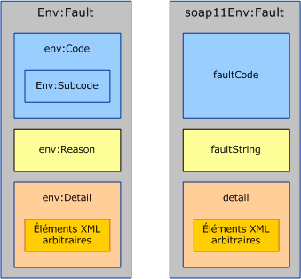
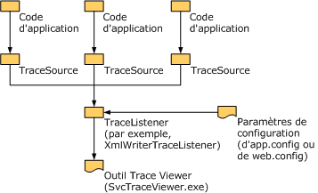

# <a name="handling-exceptions-and-faults"></a>Gestion des exceptions et des erreurs
Les exceptions sont utilisées pour communiquer localement des erreurs au sein du service ou de l'implémentation cliente. Les erreurs, en revanche, sont utilisées pour communiquer des erreurs au-delà des limites du service, notamment du serveur au client ou vice versa. En plus des erreurs, les canaux de transport utilisent souvent des mécanismes propres au transport pour communiquer des erreurs de niveau transport. Par exemple, le transport HTTP utilise des codes d'état tels que 404 pour communiquer une URL de point de terminaison inexistante (il n'existe aucun point de terminaison pour renvoyer une erreur). Ce document se compose de trois sections qui fournissent des indications aux auteurs de canaux personnalisés. La première section indique quand et comment définir et lever des exceptions. La deuxième section fournir des indications sur la génération et la consommation des erreurs. La troisième section explique comment fournir des informations de suivi afin d'aider l'utilisateur de votre canal personnalisé à résoudre les problèmes des applications en cours d'exécution.  
  
## <a name="exceptions"></a>Exceptions  
 Il y a deux choses à ne pas oublier pour lever une exception : primo, elle doit être d'un type qui permet aux utilisateurs d'écrire le code correct pouvant réagir convenablement à l'exception. Secondo, elle doit fournir suffisamment d'informations à l'utilisateur afin qu'il comprenne ce qui ne s'est pas produit correctement, l'impact de l'échec et la manière d'y remédier. Les sections suivantes donnent des indications sur les types d'exceptions et les messages pour les canaux [!INCLUDE[indigo1](../../../../includes/indigo1-md.md)]. Des indications générales sur les exceptions dans .NET sont également données dans le document Règles de conception pour les exceptions.  
  
### <a name="exception-types"></a>Types d'exceptions  
 Toutes les exceptions levées par les canaux doivent être soit <xref:System.TimeoutException?displayProperty=nameWithType>, <xref:System.ServiceModel.CommunicationException?displayProperty=nameWithType>, soit un type dérivé de <xref:System.ServiceModel.CommunicationException>. (Les exceptions telles que <xref:System.ObjectDisposedException> peuvent également être levées, mais uniquement pour indiquer que le code appelant a utilisé le canal incorrectement. Si un canal est utilisé correctement, il doit uniquement lever les exceptions données.) [!INCLUDE[indigo2](../../../../includes/indigo2-md.md)] propose sept types d'exceptions dérivant de <xref:System.ServiceModel.CommunicationException> et conçus pour être utilisés par les canaux. Il existe d'autres exceptions dérivées de <xref:System.ServiceModel.CommunicationException> conçues pour être utilisées par d'autres parties du système. Ces types d'exceptions sont :  
  
|Type d'exception|Signification|Contenu d'exception interne|Stratégie de récupération|  
|--------------------|-------------|-----------------------------|-----------------------|  
|<xref:System.ServiceModel.AddressAlreadyInUseException>|L'adresse de point de terminaison spécifiée pour l'écoute est déjà utilisée.|Le cas échéant, fournit plus de détails à propos de l'erreur de transport qui a provoqué cette exception. Par exemple : <xref:System.IO.PipeException>, <xref:System.Net.HttpListenerException>, ou <xref:System.Net.Sockets.SocketException>.|Essayez une autre adresse.|  
|<xref:System.ServiceModel.AddressAccessDeniedException>|L'accès à l'adresse de point de terminaison spécifiée pour l'écoute n'est pas autorisé au processus.|Le cas échéant, fournit plus de détails à propos de l'erreur de transport qui a provoqué cette exception. Par exemple : <xref:System.IO.PipeException> ou <xref:System.Net.HttpListenerException>.|Essayez avec d'autres informations d'identification.|  
|<xref:System.ServiceModel.CommunicationObjectFaultedException>|Le <xref:System.ServiceModel.ICommunicationObject> utilisé est dans l’état Faulted (pour plus d’informations, consultez [présentation des modifications d’état](../../../../docs/framework/wcf/extending/understanding-state-changes.md)). Notez que lorsqu'un objet avec plusieurs appels en attente passe dans l'état Faulted, un seul appel lève une exception liée à l'échec et le reste des appels lèvent une <xref:System.ServiceModel.CommunicationObjectFaultedException>. Cette exception est généralement levée parce qu'une application oublie une certaine exception et essaie d'utiliser un objet déjà dans un état Faulted, éventuellement sur un thread autre que celui qui a intercepté l'exception d'origine.|Le cas échéant, fournit des détails à propos de l'exception interne.|Créez un nouvel objet. Notez qu'en fonction de ce qui a provoqué l'erreur de <xref:System.ServiceModel.ICommunicationObject> au départ, il existe peut-être d'autre travail requis à récupérer.|  
|<xref:System.ServiceModel.CommunicationObjectAbortedException>|Le <xref:System.ServiceModel.ICommunicationObject> utilisé a été annulé (pour plus d’informations, consultez [présentation des modifications d’état](../../../../docs/framework/wcf/extending/understanding-state-changes.md)). Semblable à <xref:System.ServiceModel.CommunicationObjectFaultedException>, son exception indique que l'application a appelé <xref:System.ServiceModel.ICommunicationObject.Abort%2A> sur l'objet, peut-être à partir d'un autre thread, et l'objet n'est plus utilisable pour cette raison.|Le cas échéant, fournit des détails à propos de l'exception interne.|Créez un nouvel objet. Notez qu'en fonction de ce qui a provoqué l'abandon de <xref:System.ServiceModel.ICommunicationObject> au départ, il existe peut-être d'autre travail requis à récupérer.|  
|<xref:System.ServiceModel.EndpointNotFoundException>|Le point de terminaison distant cible n'écoute pas. Cette erreur peut être due au fait qu'une partie de l'adresse de point de terminaison est incorrecte ou ne peut pas être résolue ou au fait que le point de terminaison est arrêté. Des exemples incluent l'erreur DNS, l'indisponibilité du gestionnaire de files d'attente et la non-exécution du service.|L'exception interne fournit des détails, en général à partir du transport sous-jacent.|Essayez une autre adresse. L'expéditeur peut également patienter un instant et réessayer au cas où le service serait interrompu.|  
|<xref:System.ServiceModel.ProtocolException>|Les protocoles de communication, tels qu'ils sont décrits par la stratégie du point de terminaison, ne correspondent pas entre des points de terminaison. Par exemple, incompatibilité du type de contenu de tramage ou dépassement de la taille maximale des messages.|Le cas échéant, fournit plus d'informations sur l'erreur de protocole spécifique. Par exemple, <xref:System.ServiceModel.QuotaExceededException> est l'exception interne lorsque la cause de l'erreur est un dépassement de MaxReceivedMessageSize.|Récupération : Vérifiez que les paramètres de l'expéditeur et du protocole reçu correspondent. Une façon d’y parvenir consiste à importer de nouveau les métadonnées du point de terminaison de service (stratégie) et à utiliser la liaison générée pour recréer le canal.|  
|<xref:System.ServiceModel.ServerTooBusyException>|Le point de terminaison distant écoute mais n'est pas préparé pour traiter des messages.|Le cas échéant, l'exception interne fournit des détails sur l'erreur SOAP ou sur l'erreur de niveau transport.|Récupération : attendez et retentez l'opération ultérieurement.|  
|<xref:System.TimeoutException>|L'opération n'a pas réussi à s'effectuer à l'issue du délai d'attente.|Fournit éventuellement des détails à propos du délai d'attente.|Attendez et retentez l'opération ultérieurement.|  
  
 Définissez un nouveau type d'exception uniquement si ce type correspond à une stratégie de récupération spécifique différente de tous les types d'exceptions existants. Si vous définissez un nouveau type d'exception, il doit dériver de <xref:System.ServiceModel.CommunicationException> ou d'une de ses classes dérivées.  
  
### <a name="exception-messages"></a>Messages d'exception  
 Les messages d'exception sont destinés à l'utilisateur et non au programme, ils doivent donc fournir des informations suffisantes pour aider l'utilisateur à comprendre et résoudre le problème. Les trois parties essentielles d'un bon message d'exception sont :  
  
 Ce qui s'est passé. Fournissez une description claire du problème à l'aide de termes qui sont en rapport avec l'expérience de l'utilisateur. Par exemple, « Section de configuration non valide » serait un mauvais message d'exception. En effet, il laisse l'utilisateur se demander quelle section de configuration est incorrecte et pourquoi elle l'est. Un meilleur message serait « section de configuration non valide \<customBinding > ». Un message encore meilleur serait : « Impossible d’ajouter le transport nommé monTransport à la liaison nommée maLiaison parce que la liaison possède déjà un transport nommé monTransport ». Il s'agit d'un message très spécifique qui utilise des termes et des noms que l'utilisateur peut facilement identifier dans le fichier de configuration de l'application. Toutefois, il existe encore quelques composants clés manquants.  
  
 L'importance de l'erreur. Si le message n'indique pas clairement ce que l'erreur signifie, il est probable que l'utilisateur se demande s'il s'agit d'une erreur irrécupérable ou si elle peut être ignorée. En général, les messages doivent amener la signification ou l'importance de l'erreur. Pour améliorer l'exemple précédent, le message pourrait être : « ServiceHost n'a pas pu s'ouvrir en raison d'une erreur de configuration : impossible d'ajouter le transport nommé monTransport à la liaison nommée maLiaison parce que la liaison possède déjà un transport nommé monTransport ».  
  
 Comment l'utilisateur doit résoudre le problème. La partie la plus importante du message est l'aide apportée à l'utilisateur afin de résoudre le problème. Le message doit inclure des indications ou conseils sur ce qu'il doit vérifier ou corriger pour remédier au problème. Exemple : « ServiceHost n'a pas pu s'ouvrir en raison d'une erreur de configuration : impossible d'ajouter le transport nommé monTransport à la liaison nommée maLiaison parce que la liaison possède déjà un transport nommé monTransport. Vérifiez que la liaison comporte un seul transport ».  
  
## <a name="communicating-faults"></a>Communication des erreurs  
 SOAP 1.1 et SOAP 1.2 définissent une structure spécifique pour les erreurs. Il existe des différences entre les deux spécifications mais en général, les types Message et MessageFault sont utilisés pour créer et consommer des erreurs.  
  
   
Erreur SOAP 1.2 (à gauche) et erreur SOAP 1.1 (à droite). Notez que dans SOAP 1.1, seul l'élément Fault fait l'objet d'une qualification dans l'espace de noms.  
  
 SOAP définit un message d'erreur comme un message qui contient uniquement un élément d'erreur (un élément dont le nom est `<env:Fault>`) en tant qu'enfant de `<env:Body>`. Le contenu de l'élément d'erreur diffère légèrement entre SOAP 1.1 et SOAP 1.2, comme indiqué à la figure 1. Toutefois, la classe <xref:System.ServiceModel.Channels.MessageFault?displayProperty=nameWithType> normalise ces différences dans un modèle objet :  
  
```  
public abstract class MessageFault  
{  
    protected MessageFault();  
  
    public virtual string Actor { get; }  
    public virtual string Node { get; }  
    public static string DefaultAction { get; }  
    public abstract FaultCode Code { get; }  
    public abstract bool HasDetail { get; }  
    public abstract FaultReason Reason { get; }  
  
    public T GetDetail<T>();  
    public T GetDetail<T>( XmlObjectSerializer serializer);  
    public System.Xml.XmlDictionaryReader GetReaderAtDetailContents();  
  
    // other methods omitted  
}  
```  
  
 La propriété `Code` correspond à `env:Code` (ou `faultCode` dans SOAP 1.1) et identifie le type de l'erreur. SOAP 1.2 définit cinq valeurs autorisées pour `faultCode` (par exemple, Expéditeur et Destinataire) et définit un élément `Subcode` qui peut contenir une valeur de sous-code. (Consultez la [spécification SOAP 1.2](http://go.microsoft.com/fwlink/?LinkId=95176) pour obtenir la liste des codes d’erreur autorisée et leur signification.) SOAP 1.1 possède un mécanisme légèrement différent : il définit quatre valeurs `faultCode` (par exemple, Client et Serveur) qui peuvent être étendues soit en définissant de nouvelles valeurs, soit en utilisant la notation par point pour créer d'autres `faultCodes` plus spécifiques, par exemple, Client.Authentication.  
  
 Lorsque vous utilisez MessageFault pour programmer les erreurs, FaultCode.Name et FaultCode.Namespace correspondent au nom et à l'espace de noms de SOAP 1.2 `env:Code` ou de SOAP 1.1 `faultCode`. FaultCode.SubCode correspond à `env:Subcode` pour SOAP 1.2 et à null pour SOAP 1.1.  
  
 Vous devez créer des sous-codes d'erreur (ou de nouveaux codes d'erreur si vous utilisez SOAP 1.1) s'il s'avère intéressant de distinguer une erreur par programme. Cela revient à créer un type d'exception. Vous devez éviter d'utiliser la notation par point avec les codes d'erreur SOAP 1.1. (Le [WS-I Basic Profile](http://go.microsoft.com/fwlink/?LinkId=95177) également déconseille l’utilisation de la notation par points de code erreur.)  
  
```  
public class FaultCode  
{  
    public FaultCode(string name);  
    public FaultCode(string name, FaultCode subCode);  
    public FaultCode(string name, string ns);  
    public FaultCode(string name, string ns, FaultCode subCode);  
  
    public bool IsPredefinedFault { get; }  
    public bool IsReceiverFault { get; }  
    public bool IsSenderFault { get; }  
    public string Name { get; }  
    public string Namespace { get; }  
    public FaultCode SubCode { get; }  
  
//  methods omitted  
  
}  
```  
  
 La propriété `Reason` correspond à `env:Reason` (ou à `faultString` dans SOAP 1.1) et constitue une description explicite de la condition d'erreur analogue au message d'une exception. La classe `FaultReason` (et SOAP `env:Reason/faultString`) possède la prise en charge intégrée de plusieurs traductions dans l'intérêt de la globalisation.  
  
```  
public class FaultReason  
{  
    public FaultReason(FaultReasonText translation);  
    public FaultReason(IEnumerable<FaultReasonText> translations);  
    public FaultReason(string text);  
  
    public SynchronizedReadOnlyCollection<FaultReasonText> Translations   
    {   
       get;   
    }  
  
 }  
```  
  
 Le contenu détaillé de l’erreur est présenté sur MessageFault à l’aide de différentes méthodes, y compris le `GetDetail` \<T > et `GetReaderAtDetailContents`(). Le détail de l'erreur est un élément opaque permettant de transmettre des informations supplémentaires à propos de l'erreur. Il s'avère utile s'il existe des informations structurées arbitraires que vous souhaitez transmettre avec l'erreur.  
  
### <a name="generating-faults"></a>Génération des erreurs  
 Cette section explique le processus de génération d'une erreur en réponse à une condition d'erreur détectée dans un canal ou dans une propriété de message créée par le canal. Le renvoi d'une erreur en réponse à un message de demande qui contient des données non valides est un exemple type.  
  
 Lors de la génération d'une erreur, le canal personnalisé ne doit pas envoyer directement l'erreur, il doit plutôt lever une exception et laisser la couche au-dessus décider s'il faut convertir cette exception en erreur et comment l'envoyer. Pour faciliter cette conversion, le canal doit fournir une implémentation `FaultConverter` qui peut convertir l'exception levée par le canal personnalisé en erreur appropriée. `FaultConverter` est défini comme :  
  
```  
public class FaultConverter  
{  
    public static FaultConverter GetDefaultFaultConverter(  
                                   MessageVersion version);  
    protected abstract bool OnTryCreateFaultMessage(  
                                   Exception exception,   
                                   out Message message);  
    public bool TryCreateFaultMessage(  
                                   Exception exception,   
                                   out Message message);  
}  
```  
  
 Chaque canal qui génère des erreurs personnalisées doit implémenter `FaultConverter` et le retourner à partir d'un appel à `GetProperty<FaultConverter>`. L'implémentation `OnTryCreateFaultMessage` personnalisée doit soit convertir l'exception en erreur, soit déléguer au `FaultConverter` du canal interne. Si le canal est un transport, il doit soit convertir l'exception, soit déléguer au `FaultConverter` de l'encodeur ou au `FaultConverter` par défaut fourni dans [!INCLUDE[indigo2](../../../../includes/indigo2-md.md)]. Le `FaultConverter` par défaut convertit les erreurs correspondant aux messages d'erreur spécifiés par WS-Addressing et SOAP. Voici un exemple d'implémentation `OnTryCreateFaultMessage` :  
  
```  
public override bool OnTryCreateFaultMessage(Exception exception,   
                                             out Message message)  
{  
    if (exception is ...)  
    {  
        message = ...;  
        return true;  
    }  
  
#if IMPLEMENTING_TRANSPORT_CHANNEL  
    FaultConverter encoderConverter =   
                    this.encoder.GetProperty<FaultConverter>();  
    if ((encoderConverter != null) &&               
        (encoderConverter.TryCreateFaultMessage(  
         exception, out message)))  
    {  
        return true;  
    }  
  
    FaultConverter defaultConverter =   
                   FaultConverter.GetDefaultFaultConverter(  
                   this.channel.messageVersion);  
    return defaultConverter.TryCreateFaultMessage(  
                   exception,   
                   out message);  
#else  
    FaultConverter inner =   
                   this.innerChannel.GetProperty<FaultConverter>();  
    if (inner != null)  
    {  
        return inner.TryCreateFaultMessage(exception, out message);  
    }  
    else  
    {  
        message = null;  
        return false;  
    }  
#endif  
}  
```  
  
 Une conséquence de ce modèle est que les exceptions levées entre des couches pour les conditions d'erreur qui requièrent des erreurs doivent contenir suffisamment d'informations pour que le générateur d'erreurs correspondant crée l'erreur correcte. En tant qu'auteur de canal personnalisé, vous pouvez définir des types d'exceptions qui correspondent aux différentes conditions d'erreur si de telles exceptions n'existent pas déjà. Notez que les exceptions qui traversent les couches du canal doivent communiquer la condition d'erreur plutôt que des données d'erreur opaques.  
  
### <a name="fault-categories"></a>Catégories d'erreur  
 Il existe en général trois catégories d'erreurs :  
  
1.  Erreurs envahissant toute la pile. Ces erreurs pouvant être rencontrées au niveau de toute couche dans la pile des canaux, par exemple InvalidCardinalityAddressingException.  
  
2.  Erreurs pouvant être rencontrées n'importe où au-dessus d'une certaine couche de la pile, par exemple, certaines erreurs en rapport avec une transaction transmise ou avec des rôles de sécurité.  
  
3.  Erreurs dirigées vers une couche unique dans la pile, par exemple, erreurs comme les erreurs de numéro de séquence WS-RM.  
  
 Catégorie 1. Les erreurs sont en général des erreurs WS-Addressing et SOAP. La classe `FaultConverter` de base fournie par [!INCLUDE[indigo2](../../../../includes/indigo2-md.md)] convertit les erreurs correspondant aux messages d'erreur spécifiés par WS-Addressing et SOAP afin que vous n'ayez pas à gérer la conversion de ces exceptions vous-même.  
  
 Catégorie 2. Les erreurs se produisent lorsqu'une couche ajoute une propriété au message qui ne consomme pas complètement les informations de message en rapport avec cette couche. Les erreurs peuvent être détectées ultérieurement lorsqu'une couche supérieure demande la propriété de message pour traiter davantage les informations de message. De tels canaux doivent implémenter `GetProperty`, spécifié précédemment, pour permettre à la couche supérieure de renvoyer l'erreur correcte. TransactionMessageProperty en est un exemple. Cette propriété est ajoutée au message sans valider pleinement toutes les données dans l'en-tête (cette opération peut impliquer de contacter le coordinateur de transactions distribuées (DTC).  
  
 Catégorie 3. Les erreurs sont uniquement générées et envoyées par une couche unique dans le processeur. Par conséquent, toutes les exceptions sont contenues dans la couche. Pour améliorer la cohérence parmi les canaux et faciliter la maintenance, votre canal personnalisé doit utiliser le modèle spécifié précédemment pour générer les messages d'erreur même pour des erreurs internes.  
  
### <a name="interpreting-received-faults"></a>Interprétation des erreurs reçues  
 Cette section fournit des indications pour générer l'exception appropriée lors de la réception d'un message d'erreur. L'arbre de décision pour le traitement d'un message à chaque couche de la pile est le suivant :  
  
1.  Si la couche considère le message comme non valide, elle doit effectuer son traitement des messages non valides. Un tel traitement est spécifique à la couche mais peut inclure le déplacement du message, le suivi ou la levée d'une exception par la suite convertie en erreur. Par exemple, la sécurité reçoit un message qui n'est pas correctement sécurisé ou RM reçoit un message avec un mauvais numéro de séquence.  
  
2.  Sinon, si le message est un message d'erreur qui s'applique spécifiquement à la couche, et que le message n'est pas explicite en dehors de l'interaction de la couche, la couche doit gérer la condition d'erreur. Exemple : une erreur de séquence RM refusée non significative pour les couches au-dessus du canal RM et qui implique de provoquer une erreur dans le canal RM et de lever à partir d'opérations en attente.  
  
3.  Sinon, le message doit être retourné à partir de Request() ou Receive(). Cela inclut les cas où la couche reconnaît l'erreur, mais l'erreur indique juste qu'une demande a échoué et n'implique pas de provoquer une erreur dans le canal et de lever à partir d'opérations en attente. Pour améliorer la facilité d'utilisation dans un tel cas, la couche doit implémenter `GetProperty<FaultConverter>` et retourner une classe dérivée `FaultConverter` qui peut convertir l'erreur en exception en remplaçant `OnTryCreateException`.  
  
 Le modèle objet suivant prend en charge la conversion des messages en exceptions :  
  
```  
public class FaultConverter  
{  
    public static FaultConverter GetDefaultFaultConverter(  
                                  MessageVersion version);  
    protected abstract bool OnTryCreateException(  
                                 Message message,   
                                 MessageFault fault,   
                                 out Exception exception);  
    public bool TryCreateException(  
                                 Message message,   
                                 MessageFault fault,   
                                 out Exception exception);  
}  
```  
  
 Une couche du canal peut implémenter `GetProperty<FaultConverter>` pour prendre en charge la conversion des messages d'erreur en exceptions. Pour cela, remplacez `OnTryCreateException` et inspectez le message d'erreur. En cas de reconnaissance, effectuez la conversion, sinon demandez au canal interne de le convertir. Les canaux de transport doivent déléguer à `FaultConverter.GetDefaultFaultConverter` pour obtenir le FaultConverter SOAP/WS-Addressing par défaut.  
  
 Une implémentation type ressemble à celle-ci :  
  
```  
public override bool OnTryCreateException(  
                            Message message,   
                            MessageFault fault,   
                            out Exception exception)  
{  
    if (message.Action == "...")  
    {  
        exception = ...;  
        return true;  
    }  
    // OR  
    if ((fault.Code.Name == "...") && (fault.Code.Namespace == "..."))  
    {  
        exception = ...;  
        return true;  
    }  
  
    if (fault.IsMustUnderstand)  
    {  
        if (fault.WasHeaderNotUnderstood(  
                   message.Headers, "...", "..."))  
        {  
            exception = new ProtocolException(...);  
            return true;  
        }  
    }  
  
#if IMPLEMENTING_TRANSPORT_CHANNEL  
    FaultConverter encoderConverter =   
              this.encoder.GetProperty<FaultConverter>();  
    if ((encoderConverter != null) &&   
        (encoderConverter.TryCreateException(  
                              message, fault, out exception)))  
    {  
        return true;  
    }  
  
    FaultConverter defaultConverter =  
             FaultConverter.GetDefaultFaultConverter(  
                             this.channel.messageVersion);  
    return defaultConverter.TryCreateException(  
                             message, fault, out exception);  
#else  
    FaultConverter inner =   
                    this.innerChannel.GetProperty<FaultConverter>();  
    if (inner != null)  
    {  
        return inner.TryCreateException(message, fault, out exception);  
    }  
    else  
    {  
        exception = null;  
        return false;  
    }  
#endif  
}  
```  
  
 Pour les conditions d'erreur spécifiques dont les scénarios de récupération diffèrent, envisagez de définir une classe dérivée de `ProtocolException`.  
  
### <a name="mustunderstand-processing"></a>Traitement de MustUnderstand  
 SOAP définit une erreur générale pour signaler qu'un en-tête requis n'a pas été compris par le destinataire. Cette erreur est connu en tant qu'erreur `mustUnderstand`. Dans [!INCLUDE[indigo2](../../../../includes/indigo2-md.md)], les canaux personnalisés ne génèrent jamais des erreurs `mustUnderstand`. En revanche, le Répartiteur [!INCLUDE[indigo2](../../../../includes/indigo2-md.md)], situé en haut de la pile de communication [!INCLUDE[indigo2](../../../../includes/indigo2-md.md)], vérifie que tous les en-têtes marqués comme MustUndestand=true ont été compris par la pile sous-jacente. Si certains n'ont pas été compris, une erreur `mustUnderstand` est générée à ce stade. (L'utilisateur peut choisir de désactiver ce traitement `mustUnderstand` et de faire recevoir à l'application tous les en-têtes de message. Dans ce cas, l'application est chargée d'exécuter le traitement `mustUnderstand`.) L'erreur générée inclut un en-tête NotUnderstood qui contient les noms de tous les en-têtes avec MustUnderstand=true qui n'ont pas été compris.  
  
 Si votre canal de protocole envoie un en-tête personnalisé avec MustUnderstand=true et reçoit une erreur `mustUnderstand`, il doit déterminer si cette erreur est due à l'en-tête qu'il a envoyé. Il existe deux membres sur la classe `MessageFault` qui s'avèrent utiles à cette fin :  
  
```  
public class MessageFault  
{  
    ...  
    public bool IsMustUnderstandFault { get; }  
    public static bool WasHeaderNotUnderstood(MessageHeaders headers,   
        string name, string ns) { }  
    ...  
  
}  
```  
  
 `IsMustUnderstandFault` retourne `true` si l'erreur est une erreur `mustUnderstand`. `WasHeaderNotUnderstood` retourne la valeur `true` si l'en-tête avec le nom et l'espace de noms spécifiés est inclus dans l'erreur en tant qu'en-tête NotUnderstood.  Sinon, il retourne `false`.  
  
 Si un canal émet un en-tête marqué MustUnderstand = true, puis cette couche doit également implémenter le modèle de l'API de la génération de l'exception et doit convertir les erreurs `mustUnderstand` provoquées par cet en-tête en une exception plus utile comme décrit précédemment.  
  
## <a name="tracing"></a>Traçage  
 .NET Framework fournit un mécanisme pour suivre l'exécution des programmes afin de faciliter le diagnostic des applications de production ou des problèmes intermittents lorsqu'il n'est pas possible de joindre juste un débogueur et de parcourir le code. Les composants principaux de ce mécanisme sont dans l'espace de noms <xref:System.Diagnostics?displayProperty=nameWithType> et se composent de :  
  
-   <xref:System.Diagnostics.TraceSource?displayProperty=nameWithType>, qui est la source d'informations de suivi à écrire, <xref:System.Diagnostics.TraceListener?displayProperty=nameWithType>, qui est une classe de base abstraite pour les écouteurs concrets qui reçoivent les informations à suivre à partir de <xref:System.Diagnostics.TraceSource> et qui les transmettent à une destination spécifique à l'écouteur. Par exemple, <xref:System.Diagnostics.XmlWriterTraceListener> transmet les informations de suivi à un fichier XML. Enfin, <xref:System.Diagnostics.TraceSwitch?displayProperty=nameWithType>, qui permet à l'utilisateur de l'application de contrôler les commentaires de suivi et qui est en général spécifié dans la configuration.  
  
-   Outre les composants principaux, vous pouvez utiliser la [outil Service Trace Viewer (SvcTraceViewer.exe)](../../../../docs/framework/wcf/service-trace-viewer-tool-svctraceviewer-exe.md) pour afficher et rechercher [!INCLUDE[indigo2](../../../../includes/indigo2-md.md)] des traces. L'outil est conçu spécifiquement pour les fichiers de suivi générés par [!INCLUDE[indigo2](../../../../includes/indigo2-md.md)] et écrits à l'aide de <xref:System.Diagnostics.XmlWriterTraceListener>. La figure suivante montre les divers composants impliqués dans le suivi.  
  
   
  
### <a name="tracing-from-a-custom-channel"></a>Suivi à partir d'un canal personnalisé  
 Les canaux personnalisés doivent écrire des messages de suivi pour faciliter le diagnostic des problèmes lorsqu'il n'est pas possible de joindre un débogueur à l'application en cours d'exécution. Cela implique deux tâches de niveau élevé : instanciation de <xref:System.Diagnostics.TraceSource> et appel de ses méthodes pour écrire des suivis.  
  
 Lorsque vous instanciez <xref:System.Diagnostics.TraceSource>, la chaîne que vous spécifiez devient le nom de cette source. Ce nom est utilisé pour configurer (activer/désactiver/définir le niveau de suivi) la source de suivi. Il apparaît également dans la sortie de suivi elle-même. Les canaux personnalisés doivent utiliser un nom de source unique pour aider les lecteurs de la sortie de suivi à comprendre la provenance des informations de suivi. L'usage consiste à utiliser le nom de l'assembly qui écrit les informations en tant que nom de la source de suivi. Par exemple, [!INCLUDE[indigo2](../../../../includes/indigo2-md.md)] utilise System.ServiceModel comme source de suivi pour les informations écrites à partir de l'assembly System.ServiceModel.  
  
 Une fois que vous avez une source de suivi, vous appelez ses méthodes <xref:System.Diagnostics.TraceSource.TraceData%2A>, <xref:System.Diagnostics.TraceSource.TraceEvent%2A>ou <xref:System.Diagnostics.TraceSource.TraceInformation%2A> pour écrire des entrées de suivi dans les écouteurs de suivi. Pour chaque entrée de suivi que vous écrivez, vous devez classifier le type d'événement comme l'un des types d'événements définis dans <xref:System.Diagnostics.TraceEventType>. Cette classification et le paramètre du niveau de suivi dans la configuration déterminent si l'entrée de suivi est envoyée à l'écouteur. Par exemple, affecter au niveau de suivi dans la configuration la valeur `Warning` permet d'écrire les entrées de suivi `Warning`, `Error` et `Critical` mais de bloquer les entrées Informations et En clair. Voici un exemple d'instanciation d'une source de suivi et d'écriture d'une entrée au niveau Informations :  
  
```  
using System.Diagnostics;  
//...  
TraceSource udpSource=new TraceSource("Microsoft.Samples.Udp");  
//...  
udpsource.TraceInformation("UdpInputChannel received a message");  
```  
  
> [!IMPORTANT]
>  Il est fortement recommandé de spécifier un nom unique pour la source de suivi dans votre canal personnalisé afin d'aider les lecteurs de sortie de suivi à comprendre la provenance du résultat.  
  
#### <a name="integrating-with-the-trace-viewer"></a>Intégration au Trace Viewer  
 Suivis générés par votre canal peuvent être sortie dans un format lisible par le [outil Service Trace Viewer (SvcTraceViewer.exe)](../../../../docs/framework/wcf/service-trace-viewer-tool-svctraceviewer-exe.md) à l’aide de <xref:System.Diagnostics.XmlWriterTraceListener?displayProperty=nameWithType> en tant que l’écouteur de suivi. En tant que développeur de canal, vous n'avez pas à le faire. Il incombe plutôt à l'utilisateur de l'application (ou à la personne qui résout les problèmes de l'application) de configurer cet écouteur de suivi dans le fichier de configuration de l'application. Par exemple, la configuration suivante génère des informations de suivi à partir de <xref:System.ServiceModel?displayProperty=nameWithType> et `Microsoft.Samples.Udp` dans le fichier nommé `TraceEventsFile.e2e` :  
  
```xml  
<configuration>  
  <system.diagnostics>  
    <sources>  
      <!-- configure System.ServiceModel trace source -->  
      <source name="System.ServiceModel" switchValue="Verbose"   
              propagateActivity="true">  
        <listeners>  
          <add name="e2e" />  
        </listeners>  
      </source>  
      <!-- configure Microsoft.Samples.Udp trace source -->  
      <source name="Microsoft.Samples.Udp" switchValue="Verbose" >  
        <listeners>  
          <add name="e2e" />  
        </listeners>  
      </source>  
    </sources>  
    <!--   
    Define a shared trace listener that outputs to TraceFile.e2e  
    The listener name is e2e   
    -->  
    <sharedListeners>  
      <add name="e2e" type="System.Diagnostics.XmlWriterTraceListener"  
        initializeData=".\TraceFile.e2e"/>  
    </sharedListeners>  
    <trace autoflush="true" />  
  </system.diagnostics>  
</configuration>  
```  
  
#### <a name="tracing-structured-data"></a>Suivi de données structurées  
 <xref:System.Diagnostics.TraceSource?displayProperty=nameWithType> possède une méthode <xref:System.Diagnostics.TraceSource.TraceData%2A> qui prend un ou plusieurs objets à inclure dans l'entrée de suivi. En général, la méthode <xref:System.Object.ToString%2A?displayProperty=nameWithType> est appelée sur chaque objet et la chaîne obtenue est écrite dans le cadre de l'entrée de suivi. Lorsque vous utilisez <xref:System.Diagnostics.XmlWriterTraceListener?displayProperty=nameWithType> pour générer des suivis, vous pouvez passer <xref:System.Xml.XPath.IXPathNavigable?displayProperty=nameWithType> en tant qu'objet de données à <xref:System.Diagnostics.TraceSource.TraceData%2A>. L'entrée de suivi obtenue inclut le XML fourni par <xref:System.Xml.XPath.XPathNavigator?displayProperty=nameWithType>. Voici un exemple d'entrée avec des données d'application XML :  
  
```xml  
<E2ETraceEvent xmlns="http://schemas.microsoft.com/2004/06/E2ETraceEvent">  
  <System xmlns="...">  
    <EventID>12</EventID>  
    <Type>3</Type>  
    <SubType Name="Information">0</SubType>  
    <Level>8</Level>  
    <TimeCreated SystemTime="2006-01-13T22:58:03.0654832Z" />  
    <Source Name="Microsoft.ServiceModel.Samples.Udp" />  
    <Correlation ActivityID="{00000000-0000-0000-0000-000000000000}" />  
    <Execution  ProcessName="UdpTestConsole"   
                ProcessID="3348" ThreadID="4" />  
    <Channel />  
    <Computer>COMPUTER-LT01</Computer>  
  </System>  
<!-- XML application data -->  
  <ApplicationData>  
  <TraceData>  
   <DataItem>  
   <TraceRecord   
     Severity="Information"  
     xmlns="…">  
        <TraceIdentifier>some trace id</TraceIdentifier>  
        <Description>EndReceive called</Description>  
        <AppDomain>UdpTestConsole.exe</AppDomain>  
        <Source>UdpInputChannel</Source>  
      </TraceRecord>  
    </DataItem>  
  </TraceData>  
  </ApplicationData>  
</E2ETraceEvent>  
```  
  
 [!INCLUDE[indigo2](../../../../includes/indigo2-md.md)] Trace Viewer comprend le schéma de l'élément `TraceRecord` illustré précédemment et extrait les données de ses éléments enfants, puis les affiche dans un format tabulaire. Votre canal doit utiliser ce schéma lors du suivi de données d'application structurées pour aider les utilisateurs de Svctraceviewer.exe à lire les données.
