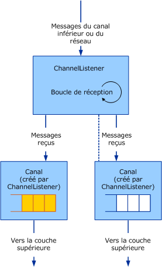

# <a name="service-channel-listeners-and-channels"></a>Service : écouteurs de canal et canaux
Il existe trois catégories d'objets de canal : les canaux, les écouteurs de canal et les fabrications de canaux. Les canaux sont l'interface entre l'application et la pile de canaux. Les écouteurs de canal sont chargés de créer des canaux du côté réception (ou écoute), généralement en réponse à une nouvelle connexion ou un nouveau message entrant. Les fabrications de canaux sont chargées de créer des canaux du côté envoi afin d'initier la communication avec un point de terminaison.  
  
## <a name="channel-listeners-and-channels"></a>Écouteurs de canal et canaux  
 Les écouteurs de canal sont chargés de créer des canaux et de recevoir les messages de la couche inférieure ou du réseau. Les messages reçus sont remis à la couche supérieure à l'aide d'un canal créé par l'écouteur de canal.  
  
 Le diagramme suivant illustre le processus de réception des messages et de leur remise à la couche supérieure.  
  
   
Écouteur de canal recevant des messages et les remettant à la couche supérieure par le biais de canaux.  
  
 Le processus peut être modelé conceptuellement comme une file d'attente à l'intérieur de chaque canal, bien que l'implémentation n'utilise pas obligatoirement de file d'attente. L'écouteur de canal est chargé de recevoir les messages de la couche inférieure ou du réseau et de les mettre dans la file d'attente. Le canal est chargé d'obtenir des messages de la file d'attente et de les transmettre à la couche supérieure lorsque celle-ci demande un message, par exemple en appelant `Receive` sur le canal.  
  
 [!INCLUDE[indigo2](../../../../includes/indigo2-md.md)] fournit des assistants de classe de base pour ce processus. (Pour un diagramme des classes d’assistance canal décrites dans cette rubrique, consultez [vue d’ensemble du modèle de canal](../../../../docs/framework/wcf/extending/channel-model-overview.md).)  
  
-   Le <xref:System.ServiceModel.Channels.CommunicationObject> la classe implémente <xref:System.ServiceModel.ICommunicationObject> et applique la machine à états décrite à l’étape 2 de [développement canaux](../../../../docs/framework/wcf/extending/developing-channels.md).  
  
-   Le <xref:System.ServiceModel.Channels.ChannelManagerBase> la classe implémente <xref:System.ServiceModel.Channels.CommunicationObject> et fournit une classe de base unifiée pour <xref:System.ServiceModel.Channels.ChannelFactoryBase> et <xref:System.ServiceModel.Channels.ChannelListenerBase>. La classe <xref:System.ServiceModel.Channels.ChannelManagerBase> fonctionne avec <xref:System.ServiceModel.Channels.ChannelBase>, qui est une classe de base implémentant <xref:System.ServiceModel.Channels.IChannel>.  
  
-   Le ''<xref:System.ServiceModel.Channels.ChannelFactoryBase> la classe implémente <xref:System.ServiceModel.Channels.ChannelManagerBase> et <xref:System.ServiceModel.Channels.IChannelFactory> et regroupe les `CreateChannel` les surcharges en une seule `OnCreateChannel` méthode abstraite.  
  
-   Le <xref:System.ServiceModel.Channels.ChannelListenerBase> la classe implémente <xref:System.ServiceModel.Channels.IChannelListener>. Elle se charge de la gestion d'état de base.  
  
 La discussion suivante est basée sur le [Transport : UDP](../../../../docs/framework/wcf/samples/transport-udp.md) exemple.  
  
## <a name="creating-a-channel-listener"></a>Création d'un écouteur de canal  
 Le « UdpChannelListener l’exemple implémente dérive la <xref:System.ServiceModel.Channels.ChannelListenerBase> classe. Il utilise un socket UDP unique pour recevoir des datagrammes. La méthode `OnOpen` reçoit des données à l'aide du socket UDP dans une boucle asynchrone. Les données sont ensuite converties en messages à l'aide du système d'encodage de message :  
  
```  
message = UdpConstants.MessageEncoder.ReadMessage(  
  new ArraySegment<byte>(buffer, 0, count),   
  bufferManager  
);  
```  
  
 Étant donné que le même canal de datagramme représente des messages qui arrivent de plusieurs sources, l'`UdpChannelListener` est un écouteur Singleton. Il existe à la plupart d’une active <xref:System.ServiceModel.Channels.IChannel>'' associé à cet écouteur à la fois. L'exemple en génère un autre uniquement si un canal retourné par la méthode <xref:System.ServiceModel.Channels.ChannelListenerBase%601.AcceptChannel%2A> est disposé par la suite. Lorsqu'un message est reçu, il est mis en file d'attente dans ce canal singleton.  
  
### <a name="udpinputchannel"></a>UdpInputChannel  
 Le `UdpInputChannel` la classe implémente <xref:System.ServiceModel.Channels.IInputChannel>. Elle se compose d'une file d'attente de messages entrants remplie par le socket de `UdpChannelListener`. Ces messages sont extraits de la file d'attente par la méthode <xref:System.ServiceModel.Channels.IInputChannel.Receive%2A>.
