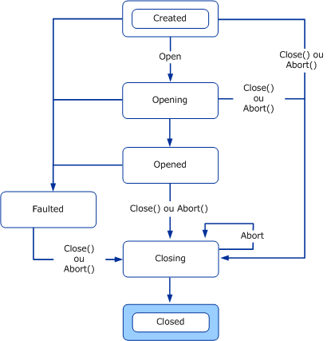
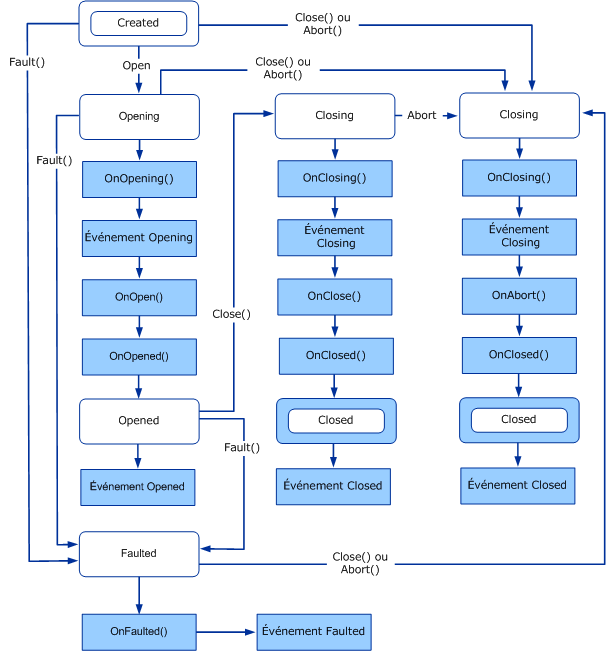
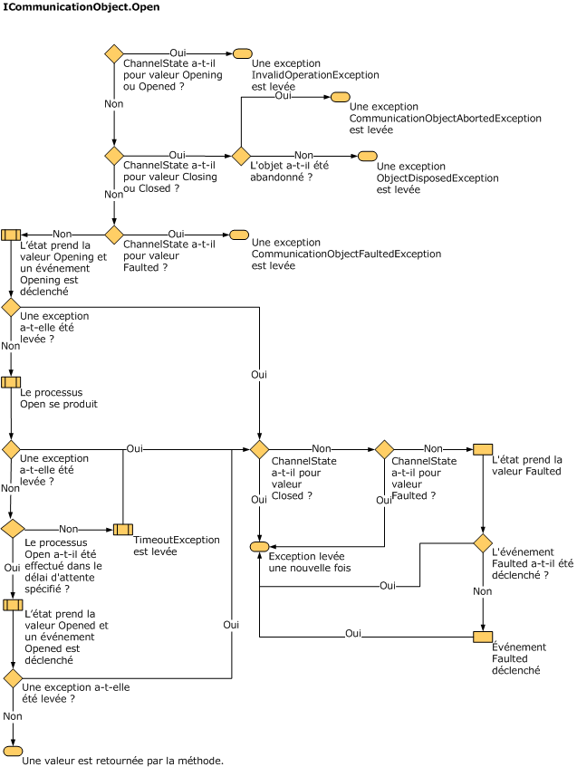
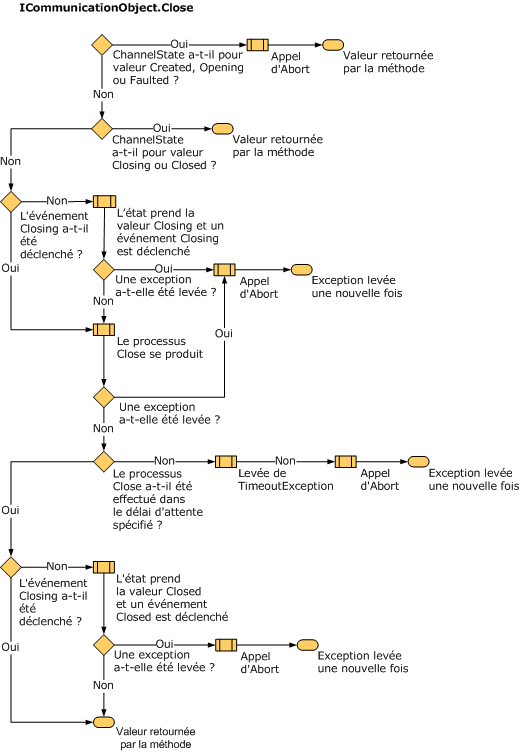
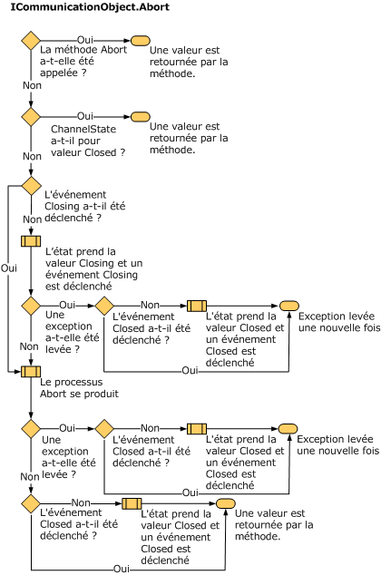

# Fonctionnement des modifications d'état
Cette rubrique présente les états et transitions des canaux, les types utilisés pour structurer les états des canaux et la manière de les implémenter.  
  
## Ordinateurs d'état et canaux  
 Les objets qui sont en charge de la communication, par exemple les sockets, présentent habituellement un ordinateur d'état dont les transitions d'état sont liées à l'allocation des ressources réseau, à l'établissement ou l'acceptation des connexions, à la fermeture des connexions et à l'arrêt de la communication. L'ordinateur d'état des canaux fournit un modèle uniforme des états d'un objet de communication qui extrait l'implémentation sous-jacente de cet objet. L'interface <xref:System.ServiceModel.ICommunicationObject> fournit un jeu d'états, de méthodes de transition d'état et d'événements de transition d'état. Tous les canaux, toutes les fabrications de canaux et tous les écouteurs de canal implémentent l'ordinateur d'état des canaux.  
  
 Les événements Closed, Closing, Faulted, Opened et Opening avertissent un observateur externe après une transition d'état.  
  
 Les méthodes Abort, Close et Open (et leurs équivalents asynchrones) provoquent des transitions d'état.  
  
 La propriété d'état retourne l'état actuel comme le définit <xref:System.ServiceModel.CommunicationState> :  
  
## États et transitions d'état ICommunicationObject et CommunicationObject  
 Un <xref:System.ServiceModel.ICommunicationObject> démarre dans l'état Created où ses différentes propriétés peuvent être configurées. Une fois dans l'état Opened, l'objet est utilisable pour envoyer et recevoir des messages mais ses propriétés sont considérées comme immuables. Une fois dans l'état Closing, l'objet ne peut plus traiter de nouvelles demandes d'envoi ou de réception, mais les demandes existantes ont la possibilité d'aboutir jusqu'à ce que le délai d'attente Close soit atteint.  Si une erreur irrécupérable se produit, l'objet passe à l'état Faulted qui permet de rechercher des informations sur l'erreur avant de le fermer. Dans l'état Closed, l'objet a atteint avant tout la fin de l'ordinateur d'état. Une fois qu'un objet est passé d'un état au suivant, il ne revient pas à l'état précédent.  
  
 Le diagramme suivant présente les états et les transitions d'état <xref:System.ServiceModel.ICommunicationObject>. Les transitions d'état peuvent être provoquées en appelant l'une des trois méthodes : Abort, Open ou Close. Elles peuvent également être provoquées en appelant d'autres méthodes spécifiques à l'implémentation. La transition vers l'état Faulted peut se produire suite à des erreurs lors de l'ouverture ou à l'issue de l'ouverture de l'objet de communication.  
  
 Chaque <xref:System.ServiceModel.ICommunicationObject> démarre dans l'état Created. Dans cet état, une application peut configurer l'objet en définissant ses propriétés. Une fois qu'un objet est dans un état autre que Created, il est considéré comme immuable.  
  
   
Figure 1. Ordinateur d'état ICommunicationObject.  
  
 [!INCLUDE[indigo1](../../../../includes/indigo1-md.md)] fournit une classe de base abstraite nommée <xref:System.ServiceModel.Channels.CommunicationObject> qui implémente <xref:System.ServiceModel.ICommunicationObject> et l'ordinateur d'état des canaux. Le graphique suivant est un diagramme d'état modifié qui est spécifique à <xref:System.ServiceModel.Channels.CommunicationObject>. Outre l'ordinateur d'état <xref:System.ServiceModel.ICommunicationObject>, il présente la temporisation lorsque des méthodes <xref:System.ServiceModel.Channels.CommunicationObject> supplémentaires sont appelées.  
  
   
Figure 2. Implémentation CommunicationObject de l'ordinateur d'état ICommunicationObject comprenant les appels d'événements et de méthodes protégées.  
  
### Événements ICommunicationObject  
 <xref:System.ServiceModel.Channels.CommunicationObject> expose les cinq événements définis par <xref:System.ServiceModel.ICommunicationObject>. Ces événements sont conçus pour le code à l'aide de l'objet de communication à notifier des transitions d'état. Comme l'illustre la figure 2 ci-dessus, chaque événement est déclenché une fois après la transition de l'état de l'objet vers l'état nommé par l'événement. Les cinq événements sont tous du type `EventHandler` défini comme suit :  
  
 `public delegate void EventHandler(object sender, EventArgs e);`  
  
 Dans l'implémentation <xref:System.ServiceModel.Channels.CommunicationObject>, l'expéditeur est soit <xref:System.ServiceModel.Channels.CommunicationObject>, soit ce qui a été passé en tant qu'expéditeur au constructeur <xref:System.ServiceModel.Channels.CommunicationObject> (si la surcharge de ce constructeur a été utilisée). Le paramètre EventArgs, `e`, a toujours la valeur `EventArgs.Empty`.  
  
### Rappels d'objets dérivés  
 Outre les cinq événements, <xref:System.ServiceModel.Channels.CommunicationObject> déclare huit méthodes virtuelles protégées conçues pour autoriser un objet dérivé à être rappelé avant et après les transitions d'état.  
  
 Les méthodes <xref:System.ServiceModel.Channels.CommunicationObject.Open%2A?displayProperty=nameWithType> et <xref:System.ServiceModel.Channels.CommunicationObject.Close%2A?displayProperty=nameWithType> possèdent trois rappels de ce type associés avec chacune d'elles. Par exemple, en rapport avec <xref:System.ServiceModel.Channels.CommunicationObject.Open%2A?displayProperty=nameWithType>, il y a <xref:System.ServiceModel.Channels.CommunicationObject.OnOpening%2A?displayProperty=nameWithType>, <xref:System.ServiceModel.Channels.CommunicationObject.OnOpen%2A?displayProperty=nameWithType> et <xref:System.ServiceModel.Channels.CommunicationObject.OnOpened%2A?displayProperty=nameWithType>. En association avec <xref:System.ServiceModel.Channels.CommunicationObject.Close%2A?displayProperty=nameWithType> figurent les méthodes <xref:System.ServiceModel.Channels.CommunicationObject.OnClose%2A?displayProperty=nameWithType>, <xref:System.ServiceModel.Channels.CommunicationObject.OnClosing%2A?displayProperty=nameWithType> et <xref:System.ServiceModel.Channels.CommunicationObject.OnClosed%2A?displayProperty=nameWithType>.  
  
 De même, la méthode <xref:System.ServiceModel.Channels.CommunicationObject.Abort%2A?displayProperty=nameWithType> est associée à <xref:System.ServiceModel.Channels.CommunicationObject.OnAbort%2A?displayProperty=nameWithType>.  
  
 Alors que <xref:System.ServiceModel.Channels.CommunicationObject.OnOpen%2A?displayProperty=nameWithType>, <xref:System.ServiceModel.Channels.CommunicationObject.OnClose%2A?displayProperty=nameWithType> et <xref:System.ServiceModel.Channels.CommunicationObject.OnAbort%2A?displayProperty=nameWithType> n'ont aucune implémentation par défaut, les autres rappels en ont une qui est nécessaire pour que l'ordinateur d'état soit correct. Si vous substituez ces méthodes, veillez à appeler l'implémentation de base ou à la remplacer correctement.  
  
 <xref:System.ServiceModel.Channels.CommunicationObject.OnOpening%2A?displayProperty=nameWithType>, <xref:System.ServiceModel.Channels.CommunicationObject.OnClosing%2A?displayProperty=nameWithType> et <xref:System.ServiceModel.Channels.CommunicationObject.OnFaulted%2A?displayProperty=nameWithType> déclenchent les événements <xref:System.ServiceModel.Channels.CommunicationObject.Opening?displayProperty=nameWithType>, <xref:System.ServiceModel.Channels.CommunicationObject.Closing?displayProperty=nameWithType> et <xref:System.ServiceModel.Channels.CommunicationObject.Faulted?displayProperty=nameWithType> correspondants. <xref:System.ServiceModel.Channels.CommunicationObject.OnOpened%2A?displayProperty=nameWithType> et <xref:System.ServiceModel.Channels.CommunicationObject.OnClosed%2A?displayProperty=nameWithType> définissent l'état de l'objet à Ouvert et Fermé respectivement, puis déclenchent les événements <xref:System.ServiceModel.Channels.CommunicationObject.Opened?displayProperty=nameWithType> et <xref:System.ServiceModel.Channels.CommunicationObject.Closed?displayProperty=nameWithType> correspondants.  
  
### Méthodes de transition d'état  
 <xref:System.ServiceModel.Channels.CommunicationObject> fournit des implémentations d'Abort, Close et Open. Il fournit également une méthode Fault qui provoque une transition d'état vers l'état Faulted. La figure 2 illustre l'ordinateur d'état <xref:System.ServiceModel.ICommunicationObject> avec chaque transition étiquetée par la méthode qui la provoque (les transitions sans étiquette se produisent à l'intérieur de l'implémentation de la méthode qui a provoqué la dernière transition étiquetée).  
  
> [!NOTE]
>  Toutes les implémentations <xref:System.ServiceModel.Channels.CommunicationObject> d'obtentions/définitions d'état de communication sont synchronisées par thread.  
  
 Constructeur  
  
 <xref:System.ServiceModel.Channels.CommunicationObject> fournit trois constructeurs, qui laissent tous l'objet dans l'état Created. Les constructeurs sont définis comme suit :  
  
 Le premier constructeur est un constructeur par défaut qui délègue à la surcharge du constructeur qui prend un objet :  
  
 `protected CommunicationObject() : this(new object()) { … }`  
  
 Le constructeur qui prend un objet utilise ce paramètre comme objet à verrouiller lors de la synchronisation de l’accès à l’état de l’objet de communication :  
  
 `protected CommunicationObject(object mutex) { … }`  
  
 Enfin, un troisième constructeur prend un paramètre supplémentaire utilisé comme argument d'expéditeur lorsque des événements <xref:System.ServiceModel.ICommunicationObject> sont déclenchés.  
  
 `protected CommunicationObject(object mutex, object eventSender) { … }`  
  
 Les deux constructeurs précédents affectent cette valeur à l'expéditeur.  
  
 Méthode Open  
  
 Condition préalable : l'état est Created.  
  
 Post-condition : l'état est Opened ou Faulted. Peut lever une exception.  
  
 La méthode Open() essaiera d'ouvrir l'objet de communication et d'affecter la valeur Opened à l'état. Si elle rencontre une erreur, elle affectera la valeur Faulted à l'état.  
  
 La méthode vérifie d'abord que l'état actuel est Created. Si l'état actuel est Opening ou Opened, elle lève une <xref:System.InvalidOperationException>. Si l'état actuel est Closing ou Closed, elle lève une <xref:System.ServiceModel.CommunicationObjectAbortedException> si l'objet a été arrêté et une <xref:System.ObjectDisposedException> sinon. Si l'état actuel est Faulted, elle lève une <xref:System.ServiceModel.CommunicationObjectFaultedException>.  
  
 Elle affecte ensuite la valeur Opening à l'état et appelle OnOpening() (laquelle déclenche l'événement Opening), OnOpen() et OnOpened() dans cet ordre. OnOpened() affecte la valeur Opened à l'état et déclenche l'événement Opened. Si l'un de ces appels lève une exception, Open() appelle Fault() et permet à l'exception de se propager. Le diagramme suivant présente le processus Open de manière plus détaillée.  
  
   
Substituez la méthode OnOpen pour implémenter une logique d'ouverture personnalisée telle que l'ouverture d'un objet de communication interne.  
  
 Close, méthode  
  
 Condition préalable : aucune.  
  
 Post-condition : l'état est Closed. Peut lever une exception.  
  
 La méthode Close() peut être appelée à tous les états. Elle essaie de fermer normalement l'objet. Si une erreur est rencontrée, elle arrête l'objet. La méthode ne fait rien si l'état actuel est Closing ou Closed. Sinon, elle affecte la valeur Closing à l'état. Si l'état d'origine est Created, Opening ou Faulted, elle appelle Abort() (voir le diagramme suivant). Si l'état d'origine est Opened, elle appelle OnClosing() (laquelle déclenche l'événement Closing), OnClose() et OnClosed() dans cet ordre. Si l'un de ces appels lève une exception, Close() appelle Abort() et permet à l'exception de se propager. OnClosed() affecte la valeur Closed à l'état et déclenche l'événement Closed. Le diagramme suivant présente le processus Close de manière plus détaillée.  
  
   
Substituez la méthode OnClose pour implémenter une logique de fermeture personnalisée telle que la fermeture d'un objet de communication interne. Toute la logique de fermeture normale, susceptible d'être bloquée pendant longtemps (par exemple, en attendant la réponse de l'autre côté), doit être implémentée dans OnClose() parce qu'un paramètre de délai d'attente est nécessaire et parce qu'elle n'est pas appelée dans le cadre d'Abort().  
  
 Abandonner  
  
 Condition préalable : aucune.  
Post-condition : l'état est Closed. Peut lever une exception.  
  
 La méthode Abort() ne fait rien si l'état actuel est Closed ou si l'objet a été arrêté avant (par exemple, en faisant exécuter Abort() sur un autre thread). Sinon, elle affecte la valeur Closing à l'état et appelle OnClosing() (laquelle déclenche l'événement Closing), OnAbort() et OnClosed() dans cet ordre (elle n'appelle pas OnClose parce que l'objet est arrêté, mais pas fermé). OnClosed() affecte la valeur Closed à l'état et déclenche l'événement Closed. En cas de levée d'une exception, celle-ci est à nouveau levée pour l'appelant d'Abort. Les implémentations d'OnClosing(), OnClosed() et OnAbort() ne doivent pas bloquer (par exemple, lors de l'entrée/sortie). Le diagramme suivant présente le processus Abort de manière plus détaillée.  
  
   
Substituez la méthode OnAbort pour implémenter une logique d'arrêt personnalisée telle que l'arrêt d'un objet de communication interne.  
  
 Fault  
  
 La méthode Fault est propre à <xref:System.ServiceModel.Channels.CommunicationObject> et ne fait pas partie de l'interface <xref:System.ServiceModel.ICommunicationObject>. Elle est incluse ici par souci d'exhaustivité.  
  
 Condition préalable : aucune.  
  
 Post-condition : l'état est Faulted. Peut lever une exception.  
  
 La méthode Fault() ne fait rien si l'état actuel est Faulted ou Closed. Sinon, elle affecte la valeur Faulted à l'état et appelle OnFaulted(), laquelle déclenche l'événement Faulted. Si OnFaulted lève une exception, elle est à nouveau levée.  
  
### Méthodes ThrowIfXxx  
 CommunicationObject possède trois méthodes protégées qui peuvent être utilisées pour lever des exceptions si l'objet est dans un état spécifique.  
  
 <xref:System.ServiceModel.Channels.CommunicationObject.ThrowIfDisposed%2A> lève une exception si l'état est Closing, Closed ou Faulted.  
  
 <xref:System.ServiceModel.Channels.CommunicationObject.ThrowIfDisposedOrImmutable%2A> lève une exception si l'état n'est pas Created.  
  
 <xref:System.ServiceModel.Channels.CommunicationObject.ThrowIfDisposedOrNotOpen%2A> lève une exception si l'état n'est pas Opened.  
  
 Les exceptions levées dépendent de l'état. Le tableau suivant présente les différents états et le type d'exception correspondant levé en appelant une méthode ThrowIfXxx qui lève sur cet état.  
  
|État|La méthode Abort a-t-elle été appelée ?|Exception|  
|-----------|----------------------------|---------------|  
|Créé le|N/A|<xref:System.InvalidOperationException?displayProperty=nameWithType>|  
|Opening|N/A|<xref:System.InvalidOperationException?displayProperty=nameWithType>|  
|Opened|N/A|<xref:System.InvalidOperationException?displayProperty=nameWithType>|  
|Closing|Oui|<xref:System.ServiceModel.CommunicationObjectAbortedException?displayProperty=nameWithType>|  
|Closing|Non|<xref:System.ObjectDisposedException?displayProperty=nameWithType>|  
|Closed|Oui|<xref:System.ServiceModel.CommunicationObjectAbortedException?displayProperty=nameWithType> dans le cas où un objet aurait été fermé par un appel précédent et explicite d'Abort. Si vous appelez Close sur l'objet, alors une <xref:System.ObjectDisposedException?displayProperty=nameWithType> est levée.|  
|Fermé|Non|<xref:System.ObjectDisposedException?displayProperty=nameWithType>|  
|Faulted|N/A|<xref:System.ServiceModel.CommunicationObjectFaultedException?displayProperty=nameWithType>|  
  
### Délais d'attente  
 Plusieurs des méthodes présentées prennent des paramètres de délai d'attente. Ces paramètres sont Close, Open (certaines surcharges et versions asynchrones), OnClose et OnOpen. Ces méthodes sont conçues pour tenir compte des longues opérations (par exemple, un blocage sur l'entrée/sortie pendant l'arrêt normal d'une connexion), donc le paramètre de délai d'attente indique la durée maximale de ces opérations avant leur interruption. Les implémentations de chacune de ces méthodes doivent utiliser la valeur du délai d'attente fournie pour garantir le renvoi à l'appelant à l'issue de ce délai d'attente. Les implémentations d'autres méthodes qui ne prennent pas de délai d'attente ne sont pas conçues pour les opérations longues et ne doivent pas bloquer sur l'entrée/sortie.  
  
 Les surcharges Open() et Close() qui ne prennent pas de délai d'attente font exception. Elles utilisent une valeur de délai par défaut fournie par la classe dérivée. <xref:System.ServiceModel.Channels.CommunicationObject> expose deux propriétés abstraites protégées nommées <xref:System.ServiceModel.Channels.CommunicationObject.DefaultCloseTimeout%2A> et <xref:System.ServiceModel.Channels.CommunicationObject.DefaultOpenTimeout%2A> définies comme suit :  
  
 `protected abstract TimeSpan DefaultCloseTimeout { get; }`  
  
 `protected abstract TimeSpan DefaultOpenTimeout { get; }`  
  
 Une classe dérivée implémente ces propriétés pour fournir le délai d'attente par défaut pour les surcharges Open() et Close() qui ne prennent pas de valeur de délai d'attente. Ensuite, les implémentations Open() et Close() délèguent à la surcharge qui prend un délai d'attente en la transmettant à la valeur de délai d'attente par défaut, par exemple :  
  
 `public void Open()`  
  
 `{`  
  
 `this.Open(this.DefaultOpenTimeout);`  
  
 `}`  
  
#### IDefaultCommunicationTimeouts  
 Cette interface possède quatre propriétés en lecture seule pour fournir des valeurs de délai d'attente par défaut pour l'ouverture, l'envoi, la réception et la fermeture. Chaque implémentation est chargée d'obtenir les valeurs par défaut de quelque manière appropriée que ce soit. Par commodité, <xref:System.ServiceModel.Channels.ChannelFactoryBase> et <xref:System.ServiceModel.Channels.ChannelListenerBase> utilisent par défaut 1 minute pour chacune de ces valeurs.
