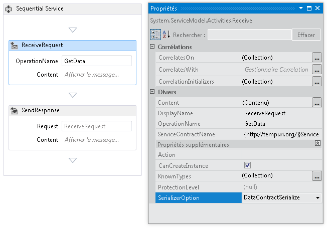
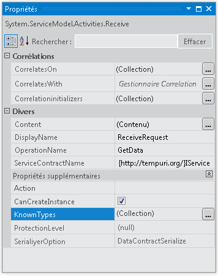
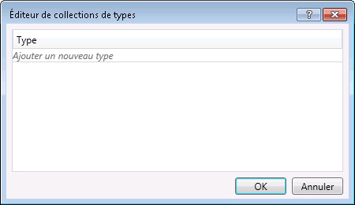

# Configuration de la s&#233;rialisation dans un service de workflow
Les services de workflow sont des services [!INCLUDE[indigo1](../../../../includes/indigo1-md.md)] et ont donc la possibilité d'utiliser <xref:System.Runtime.Serialization.DataContractSerializer> \(le service par défaut\) ou <xref:System.Xml.Serialization.XmlSerializer>.Lors de l'écriture de services en dehors du workflow, le type de sérialiseur à utiliser est spécifié dans le contrat de service ou d'opération.Lors de la création de services de workflow [!INCLUDE[indigo2](../../../../includes/indigo2-md.md)], vous ne spécifiez pas ces contrats dans du code, mais ils sont générés au moment de l'exécution par inférence de contrat.[!INCLUDE[crabout](../../../../includes/crabout-md.md)] l'inférence de contrat, consultez [Utilisation de contrats dans le workflow](../../../../docs/framework/wcf/feature-details/using-contracts-in-workflow.md).Le sérialiseur est spécifié à l'aide de la propriété <xref:System.ServiceModel.Activities.Receive.SerializerOption%2A>.Celle\-ci peut être définie dans le concepteur comme le montre l'illustration suivante.  
  
   
  
 Le sérialiseur peut également être défini dans le code, comme le montre l'exemple suivant,  
  
```  
Receive approveExpense = new Receive  
            {  
                OperationName = "ApproveExpense",  
                CanCreateInstance = true,  
                ServiceContractName = "FinanceService",  
                SerializerOption = SerializerOption.DataContractSerializer,  
                Content = ReceiveContent.Create(new OutArgument<Expense>(expense))  
            };  
  
```  
  
 Les types connus peuvent également être spécifiés dans des services de workflow.[!INCLUDE[crabout](../../../../includes/crabout-md.md)] les types connus, consultez [Types connus de contrats de données](../../../../docs/framework/wcf/feature-details/data-contract-known-types.md).Les types connus peuvent être spécifiés dans le concepteur ou dans du code.Pour spécifier les types courants dans le concepteur, cliquez sur le bouton de sélection en regard de la propriété KnownTypes dans la fenêtre Propriétés pour une activité <xref:System.ServiceModel.Activities.Receive>, comme le montre l'illustration suivante.  
  
   
  
 L'Éditeur de collections de types s'affiche et vous permet de rechercher et de spécifier des types connus.  
  
   
  
 Cliquez sur le lien **Ajouter un nouveau type** et utilisez la liste déroulante pour sélectionner ou rechercher un type à ajouter à la collection de types connus.Pour spécifier des types connus dans le code, utilisez la propriété <xref:System.ServiceModel.Activities.Receive.KnownTypes%2A>, comme le montre l'exemple suivant :  
  
```  
Receive approveExpense = new Receive  
            {  
                OperationName = "ApproveExpense",  
                CanCreateInstance = true,  
                ServiceContractName = "FinanceService",  
                SerializerOption = SerializerOption.DataContractSerializer,  
                Content = ReceiveContent.Create(new OutArgument<Expense>(expense))  
            };  
            approveExpense.KnownTypes.Add(typeof(Travel));  
            approveExpense.KnownTypes.Add(typeof(Meal));  
  
```  
  
 Pour obtenir un exemple de code complet qui montre comment configurer la sérialisation pour un service de workflow, consultez [Mise en forme des messages dans les services de workflow](../../../../docs/framework/windows-workflow-foundation/samples/formatting-messages-in-workflow-services.md).