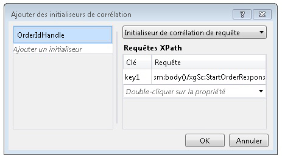

# Corrélation basée sur le contenuContent Based Correlation
Lorsque les services de workflow communiquent avec des clients et d'autres services, il existe souvent des données dans les messages échangés qui servent uniquement à lier un message à une instance particulière.When workflow services communicate with clients and other services, often there is some data in the exchanged messages that uniquely relates a message to a particular instance. La corrélation basée sur le contenu utilise ces données dans les messages, par exemple un numéro de client ou un ID de commande, pour router les messages vers l'instance de workflow appropriée.Content-based correlation uses this data in the message, such as a customer number or order ID, to route messages to the proper workflow instance. Cette rubrique explique comment utiliser la corrélation basée sur le contenu dans les workflows.This topic explains how to use content-based correlation in workflows.  
  
## Utilisation de la corrélation basée sur le contenuUsing Content-Based Correlation  
 La corrélation basée sur le contenu est utilisée lorsqu'un service de workflow possède plusieurs méthodes accessibles par un client unique et dispose de quelques données dans les messages échangés qui identifient l'instance souhaitée.Content-based correlation is used when a workflow service has multiple methods that are accessed by a single client and a piece of data in the exchanged messages identifies the desired instance.  
  
> [!NOTE]
>  La corrélation basée sur le contenu est utile lorsque la corrélation de contexte ne peut pas être utilisée parce que la liaison ne fait pas partie des liaisons d’échange de contexte compatibles.Content-based correlation is useful when context correlation cannot be used because the binding is not one of the supported context exchange bindings. [!INCLUDE[crabout](../../../../includes/crabout-md.md)]corrélation de contexte, consultez [échange de contexte](../../../../docs/framework/wcf/feature-details/context-exchange-correlation.md). context correlation, see [Context Exchange](../../../../docs/framework/wcf/feature-details/context-exchange-correlation.md).  
  
 Chaque activité de messagerie utilisée dans ce type de communication doit spécifier à quel emplacement dans le message se trouvent les données identifiant l'instance de manière unique.Each messaging activity used in these communications must specify the location of the data in the message that uniquely identifies the instance. Cela s'effectue en fournissant un objet <xref:System.ServiceModel.MessageQuerySet>, utilisant un objet <xref:System.ServiceModel.Activities.QueryCorrelationInitializer> ou une propriété <xref:System.ServiceModel.Activities.Receive.CorrelatesOn%2A>, qui recherche dans le message les données identifiant l'instance de manière unique.This is done by providing a <xref:System.ServiceModel.MessageQuerySet>, using either a <xref:System.ServiceModel.Activities.QueryCorrelationInitializer> or <xref:System.ServiceModel.Activities.Receive.CorrelatesOn%2A>, that queries the message for the piece or pieces of data that uniquely identify the instance.  
  
> [!WARNING]
>  Les données utilisées pour identifier l'instance sont hachées en une clé de corrélation.The data that is used to identify the instance is hashed into a correlation key. Il est important de s'assurer que les données utilisées pour la corrélation sont uniques, pour éviter que des conflits se produisent dans la clé hachée, entraînant des confusions dans le routage des messages.Care must be taken to ensure that the data used for correlation is unique or else collisions in the hashed key could occur and cause messages to be misrouted. Par exemple, une corrélation basée uniquement sur un nom de client risque de provoquer un conflit, au cas où d'autres clients aient un nom identique.For example, a correlation based solely on a customer name may cause a collision because there may be multiple customers with the same name. Les deux-points (`:`) ne doivent pas être utilisés à l'intérieur des données qui servent à mettre les messages en corrélation. En effet, ils servent déjà à délimiter la clé et la valeur de la requête de message pour former la chaîne qui est ensuite hachée.The colon (`:`) should not be used as part of the data used to correlate the message because it is already used to delimit the message query’s key and value to form the string that is subsequently hashed.  
  
 Dans l’exemple suivant, la première <xref:System.ServiceModel.Activities.Receive> / <xref:System.ServiceModel.Activities.SendReply> dans un service de workflow retourne un `OrderId`, qui est ensuite transmis par le client sur l’appel à ce qui suit <xref:System.ServiceModel.Activities.Receive> activité dans le service de workflow.In the following example, the initial <xref:System.ServiceModel.Activities.Receive>/<xref:System.ServiceModel.Activities.SendReply> in a workflow service returns an `OrderId`, which is then passed back by the client on the call to the following <xref:System.ServiceModel.Activities.Receive> activity in the workflow service.  
  
 [!code-csharp[CFX_ContentCorrelation#1](../../../../samples/snippets/csharp/VS_Snippets_CFX/cfx_contentcorrelation/cs/program.cs#1)]  
  
 L'exemple précédent montre une corrélation basée sur le contenu initialisée par l'activité <xref:System.ServiceModel.Activities.SendReply>.The previous example shows a content-based correlation that is initialized by the <xref:System.ServiceModel.Activities.SendReply>. L'objet <xref:System.ServiceModel.MessageQuerySet> spécifie que les données utilisées pour identifier les prochains messages vers ce service correspondent à `OrderId`.The <xref:System.ServiceModel.MessageQuerySet> specifies that the data used to identify subsequent messages to this service is the `OrderId`.  
  
 [!code-csharp[CFX_ContentCorrelation#2](../../../../samples/snippets/csharp/VS_Snippets_CFX/cfx_contentcorrelation/cs/program.cs#2)]  
  
 L'activité <xref:System.ServiceModel.Activities.Receive> qui succède à l'activité <xref:System.ServiceModel.Activities.SendReply> dans le workflow respecte la corrélation initialisée par l'activité <xref:System.ServiceModel.Activities.SendReply>.The <xref:System.ServiceModel.Activities.Receive> activity that follows the <xref:System.ServiceModel.Activities.SendReply> in the workflow follows the correlation that was initialized by the <xref:System.ServiceModel.Activities.SendReply>. Les deux activités partagent le même <xref:System.ServiceModel.Activities.CorrelationHandle>, mais chacune possède son propre <xref:System.ServiceModel.MessageQuerySet> et son propre <xref:System.ServiceModel.XPathMessageQuery> qui spécifie où se trouvent les données d'identification dans ce message particulier.Both activities share the same <xref:System.ServiceModel.Activities.CorrelationHandle>, but each one has its own <xref:System.ServiceModel.MessageQuerySet> and <xref:System.ServiceModel.XPathMessageQuery> that specifies where the identifying data is in that particular message. Pour l'activité qui initialise la corrélation, ce <xref:System.ServiceModel.MessageQuerySet> est spécifié dans la propriété <xref:System.ServiceModel.Activities.Receive.CorrelationInitializers%2A>, et pour toutes les activités <xref:System.ServiceModel.Activities.Receive> qui lui succèdent, il est spécifié à l'aide de la propriété <xref:System.ServiceModel.Activities.Receive.CorrelatesOn%2A>.On the activity that initializes the correlation, this <xref:System.ServiceModel.MessageQuerySet> is specified in the <xref:System.ServiceModel.Activities.Receive.CorrelationInitializers%2A> property, and for any following <xref:System.ServiceModel.Activities.Receive> activities, it is specified using the <xref:System.ServiceModel.Activities.Receive.CorrelatesOn%2A> property.  
  
 [!code-csharp[CFX_ContentCorrelation#3](../../../../samples/snippets/csharp/VS_Snippets_CFX/cfx_contentcorrelation/cs/program.cs#3)]  
  
 Une corrélation basée sur le contenu peut être initialisée par n'importe quelle activité de messagerie (<xref:System.ServiceModel.Activities.Send>, <xref:System.ServiceModel.Activities.Receive>, <xref:System.ServiceModel.Activities.SendReply>, <xref:System.ServiceModel.Activities.ReceiveReply>) lorsque les données circulent dans le cadre d'un message.A content-based correlation can be initialized by any messaging activity (<xref:System.ServiceModel.Activities.Send>, <xref:System.ServiceModel.Activities.Receive>, <xref:System.ServiceModel.Activities.SendReply>, <xref:System.ServiceModel.Activities.ReceiveReply>) when the data flows as part of a message. Si ces données particulières ne circulent pas dans le cadre d'un message, la corrélation peut alors être initialisée de manière explicite à l'aide de l'activité <xref:System.ServiceModel.Activities.InitializeCorrelation>.If the particular piece of data does not flow as part of a message, then it can be initialized explicitly by using the <xref:System.ServiceModel.Activities.InitializeCorrelation> activity. Si plusieurs fragments de données sont nécessaires pour identifier le message de manière unique, plusieurs requêtes peuvent être ajoutées au <xref:System.ServiceModel.MessageQuerySet>.If multiple pieces of data are required to uniquely identify the message, then multiple queries can be added to the <xref:System.ServiceModel.MessageQuerySet>. Dans ces exemples, un objet <xref:System.ServiceModel.Activities.CorrelationHandle> a été fourni de manière explicite à chacune des activités à l'aide des propriétés `CorrelatesWith` ou `CorrelationHandle`, mais si une seule corrélation est nécessaire pour l'intégralité du workflow, comme dans cet exemple où tout est mis en corrélation en fonction d'`OrderId`, la gestion de handle de corrélation implicite fournie par <xref:System.ServiceModel.Activities.WorkflowServiceHost> suffit.In these examples, a <xref:System.ServiceModel.Activities.CorrelationHandle> was explicitly provided to each of the activities using the `CorrelatesWith` or `CorrelationHandle` properties, but if there is only one correlation required for the entire workflow, such as in this example where everything correlates on `OrderId`, the implicit correlation handle management provided by <xref:System.ServiceModel.Activities.WorkflowServiceHost> is sufficient.  
  
## Utilisation de l'activité InitializeCorrelationUsing the InitializeCorrelation Activity  
 Dans l'exemple précédent, l'`OrderId` était transmis à l'appelant via l'activité <xref:System.ServiceModel.Activities.SendReply>, celle qui a initialisé la corrélation.In the previous example, the `OrderId` flowed to the caller through the <xref:System.ServiceModel.Activities.SendReply> activity and this is where the correlation was initialized. Le même comportement peut être obtenu à l'aide de l'activité <xref:System.ServiceModel.Activities.InitializeCorrelation>.The same behavior can be accomplished by using the <xref:System.ServiceModel.Activities.InitializeCorrelation> activity. L'activité <xref:System.ServiceModel.Activities.InitializeCorrelation> prend le <xref:System.ServiceModel.Activities.CorrelationHandle> et un dictionnaire d'éléments qui représentent les données utilisées pour mapper le message à l'instance correcte.The <xref:System.ServiceModel.Activities.InitializeCorrelation> activity takes the <xref:System.ServiceModel.Activities.CorrelationHandle> and a dictionary of items that represent the data used to map the message to the correct instance. Pour utiliser l'activité <xref:System.ServiceModel.Activities.InitializeCorrelation> dans l'exemple précédent, supprimez la propriété <xref:System.ServiceModel.Activities.SendReply.CorrelationInitializers%2A> de l'activité <xref:System.ServiceModel.Activities.SendReply> et initialisez la corrélation à l'aide de l'activité <xref:System.ServiceModel.Activities.InitializeCorrelation>.To use the <xref:System.ServiceModel.Activities.InitializeCorrelation> activity in the preceding sample, remove the <xref:System.ServiceModel.Activities.SendReply.CorrelationInitializers%2A> from the <xref:System.ServiceModel.Activities.SendReply> activity and initialize the correlation using the <xref:System.ServiceModel.Activities.InitializeCorrelation> activity.  
  
 [!code-csharp[CFX_ContentCorrelation#4](../../../../samples/snippets/csharp/VS_Snippets_CFX/cfx_contentcorrelation/cs/program.cs#4)]  
  
 L'activité <xref:System.ServiceModel.Activities.InitializeCorrelation> est alors utilisée dans le workflow, une fois remplies les variables qui contiennent les données, mais avant l'activité <xref:System.ServiceModel.Activities.Receive> qui se met en corrélation avec l'objet <xref:System.ServiceModel.Activities.CorrelationHandle> initialisé.The <xref:System.ServiceModel.Activities.InitializeCorrelation> activity is then used in the workflow, after the variables that hold the data are populated but before the <xref:System.ServiceModel.Activities.Receive> activity that correlates with the initialized <xref:System.ServiceModel.Activities.CorrelationHandle>.  
  
 [!code-csharp[CFX_ContentCorrelation#5](../../../../samples/snippets/csharp/VS_Snippets_CFX/cfx_contentcorrelation/cs/program.cs#5)]  
  
## Configuration de requêtes XPath à l'aide du Workflow DesignerConfiguring XPath Queries Using the Workflow Designer  
 Dans les exemples précédents, les activités et les requêtes XPath utilisées dans les requêtes de message ont été spécifiées dans le code.In the previous examples, the activities and the XPath queries used in the message queries were specified in code. Le Workflow Designer de [!INCLUDE[vs_current_long](../../../../includes/vs-current-long-md.md)] fournit également la possibilité de générer des XPaths à partir de types `DataContract` pour la corrélation basée sur le contenu.The workflow designer in [!INCLUDE[vs_current_long](../../../../includes/vs-current-long-md.md)] also provides the ability to generate XPaths from `DataContract` types for content-based correlation. Le premier XPath configuré dans l'exemple précédent a été configuré pour l'activité <xref:System.ServiceModel.Activities.SendReply>.The first XPath configured in the previous example was configured for the <xref:System.ServiceModel.Activities.SendReply>.  
  
 [!code-csharp[CFX_ContentCorrelation#2](../../../../samples/snippets/csharp/VS_Snippets_CFX/cfx_contentcorrelation/cs/program.cs#2)]  
  
 Sélectionnez l’activité de messagerie pour laquelle vous souhaitez configurer le XPath dans le Workflow Designer.To configure the XPath for a messaging activity in the workflow designer, select the activity in the workflow designer. Si l’activité initialise la corrélation, comme dans l’exemple précédent, cliquez sur le bouton de sélection pour la **CorrelationInitializers** propriété dans le **propriétés** fenêtre.If the activity is initializing the correlation, as in the previous example, click the ellipsis button for the **CorrelationInitializers** property in the **Properties** window. Cela permet d’afficher le **ajouter des initialiseurs de corrélation** boîte de dialogue.This displays the **Add Correlation Initializers** dialog window. Dans cette fenêtre, vous pouvez spécifier le type de corrélation et sélectionner le contenu utilisé pour la corrélation.From this dialog you can specify the correlation type and select the content that is used for the correlation. Le <xref:System.ServiceModel.Activities.CorrelationHandle> la variable est spécifiée dans le **ajouter initialiseur** boîte, le type de corrélation et les données utilisées pour la corrélation est sélectionné à partir de la **requêtes XPath** section de la boîte de dialogue.The <xref:System.ServiceModel.Activities.CorrelationHandle> variable is specified in the **Add initializer** box, and the correlation type and data used for the correlation is selected from the **XPath Queries** section of the dialog box.  
  
   
  
 La deuxième requête XPath de l'exemple précédent a été configurée dans l'activité <xref:System.ServiceModel.Activities.Receive>.The second XPath query in the previous example was configured in the <xref:System.ServiceModel.Activities.Receive> activity.  
  
 [!code-csharp[CFX_ContentCorrelation#3](../../../../samples/snippets/csharp/VS_Snippets_CFX/cfx_contentcorrelation/cs/program.cs#3)]  
  
 Pour configurer la requête XPath pour une activité de messagerie qui n’initialise pas la corrélation, sélectionnez l’activité dans le Concepteur de flux de travail, puis cliquez sur le bouton de sélection pour la **CorrelatesOn** propriété dans le  **Propriétés** fenêtre.To configure the XPath query for a messaging activity that does not initialize the correlation, select the activity in the workflow designer and then click the ellipsis button for the **CorrelatesOn** property in the **Properties** window. Cela permet d’afficher le **définition CorrelatesOn** boîte de dialogue.This displays the **CorrelatesOn Definition** dialog window.  
  
   
  
 Dans cette boîte de dialogue, spécifiez la <xref:System.ServiceModel.Activities.CorrelationHandle> et choisissez des éléments dans le **requêtes XPath** liste pour générer la requête XPath.From this dialog you specify the <xref:System.ServiceModel.Activities.CorrelationHandle> and choose items in the **XPath Queries** list to build the XPath query.
