# <a name="creating-a-long-running-workflow-service"></a>Création d'un service de workflow de longue durée
Cette rubrique décrit comment créer un service de workflow de longue durée. Les services de workflow de longue durée peuvent s'exécuter sur de longues périodes. À un certain stade, le workflow peut devenir inactif en attendant des informations supplémentaires. Lorsque cela se produit, le workflow est rendu persistant dans une base de données SQL et supprimé de la mémoire. Une fois que les informations supplémentaires sont disponibles, l'instance de workflow est à nouveau chargée dans la mémoire et continue de s'exécuter.  Dans ce scénario, vous implémentez un système de commande très simplifié.  Le client envoie un message initial au service de workflow pour commencer la commande. Un ID de commande est retourné au client. À ce stade, le service de workflow attend un autre message du client, passe à l'état inactif et est rendu persistant dans une base de données SQL Server.  Lorsque le client envoie le message suivant pour commander un article, le service de workflow est à nouveau chargé dans la mémoire et termine le traitement de la commande. Dans l'exemple de code, il retourne une chaîne indiquant que l'article a été ajouté à la commande. L'exemple de code n'est pas censé refléter une application réelle de la technologie mais plutôt un exemple simple illustrant des services de workflow de longue durée. Cette rubrique suppose que vous savez déjà créer des projets et des solutions [!INCLUDE[vs_current_long](../../../../includes/vs-current-long-md.md)].  
  
## <a name="prerequisites"></a>Prérequis  
 Les logiciels suivants doivent être installés pour suivre cette procédure pas à pas :  
  
1.  Microsoft SQL Server 2008  
  
2.  [!INCLUDE[vs_current_long](../../../../includes/vs-current-long-md.md)]  
  
3.  Microsoft [!INCLUDE[netfx_current_long](../../../../includes/netfx-current-long-md.md)]  
  
4.  Vous êtes familiarisé avec WCF et [!INCLUDE[vs_current_long](../../../../includes/vs-current-long-md.md)] et vous savez déjà créer des projets et des solutions.  
  
### <a name="to-setup-the-sql-database"></a>Pour configurer la base de données SQL  
  
1.  Pour que les instances du service de workflow soient persistantes, Microsoft SQL Server doit être installé et vous devez configurer une base de données pour stocker les instances de workflow persistantes. Exécutez Microsoft SQL Management Studio en cliquant sur le **Démarrer** bouton, en sélectionnant **tous les programmes**, **Microsoft SQL Server 2008**, et **Microsoft SQL Management Studio**.  
  
2.  Cliquez sur le **Connect** bouton pour ouvrir une session sur l’instance de SQL Server  
  
3.  Bouton droit sur **bases de données** dans l’arborescence et sélectionnez **nouvelle base de données...** Pour créer une nouvelle base de données appelée `SQLPersistenceStore`.  
  
4.  Exécutez le fichier de script SqlWorkflowInstanceStoreSchema.sql situé dans le répertoire C:\Windows\Microsoft.NET\Framework\v4.0\SQL\en dans la base de données SQLPersistenceStore pour configurer les schémas de base de données requis.  
  
5.  Exécutez le fichier de script SqlWorkflowInstanceStoreLogic.sql situé dans le répertoire C:\Windows\Microsoft.NET\Framework\v4.0\SQL\en dans la base de données SQLPersistenceStore pour configurer la logique de base de données requise.  
  
### <a name="to-create-the-web-hosted-workflow-service"></a>Pour créer le service de workflow hébergé sur le Web  
  
1.  Créez une solution [!INCLUDE[vs_current_long](../../../../includes/vs-current-long-md.md)] vide et nommez-la `OrderProcessing`.  
  
2.  Ajoutez à la solution un nouveau projet d'application de service de workflow [!INCLUDE[indigo2](../../../../includes/indigo2-md.md)] nommé `OrderService`.  
  
3.  Dans la boîte de dialogue Propriétés du projet, sélectionnez le **Web** onglet.  
  
    1.  Sous **Action de démarrage** sélectionnez **Page spécifique** et spécifiez `Service1.xamlx`.  
  
         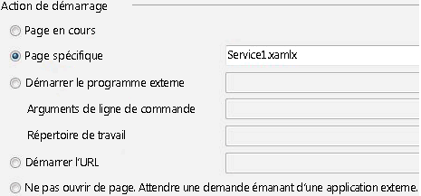  
  
    2.  Sous **serveurs** sélectionnez **serveur Web IIS Local d’utilisation**.  
  
         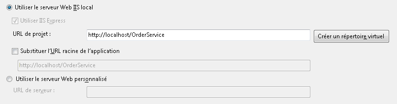  
  
        > [!WARNING]
        >  Vous devez exécuter [!INCLUDE[vs_current_long](../../../../includes/vs-current-long-md.md)] en mode Administrateur pour effectuer ce paramétrage.  
  
         Ces deux étapes configurent le projet du service de workflow pour qu'il soit hébergé par IIS.  
  
4.  Ouvrez `Service1.xamlx` si elle n’est pas déjà ouvert et supprimez les **ReceiveRequest** et **SendResponse** activités.  
  
5.  Sélectionnez le **Service séquentiel** activité et cliquez sur le **Variables** lier et ajoutez les variables affichées dans l’illustration suivante. Cette action permet d'ajouter des variables qui seront utilisées ultérieurement dans le service de workflow.  
  
    > [!NOTE]
    >  Si CorrelationHandle ne figure pas dans la liste déroulante Type de Variable, sélectionnez **rechercher des types** à partir de la liste déroulante. Tapez CorrelationHandle dans la **nom de Type** zone, sélectionnez CorrelationHandle dans la zone de liste et cliquez sur **OK**.  
  
     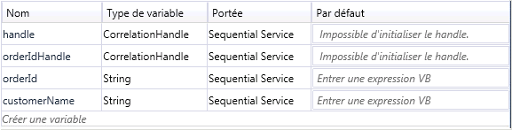  
  
6.  Faites glisser et déposez un **ReceiveAndSendReply** modèle d’activité dans le **Service séquentiel** activité. Cet ensemble d'activités recevra un message d'un client et enverra une réponse en retour.  
  
    1.  Sélectionnez le **réception** activité et le jeu de propriétés des mise en surbrillance dans l’illustration suivante.  
  
         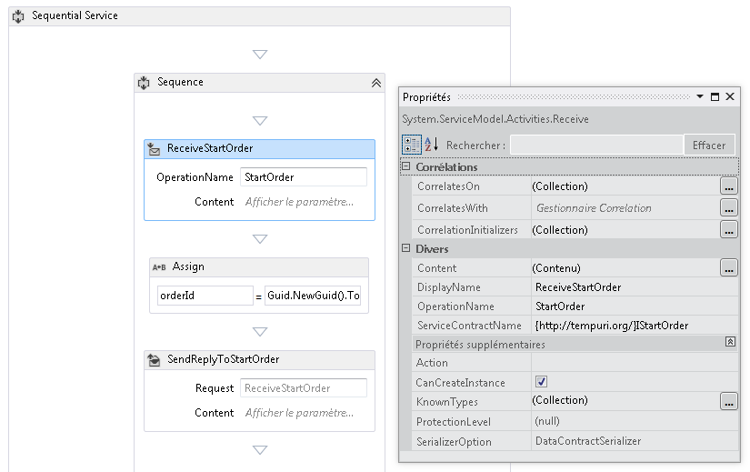  
  
         La propriété DisplayName définit le nom affiché pour l'activité Receive dans le concepteur. Les propriétés ServiceContractName et OperationName spécifient le nom du contrat de service et de l'opération implémentés par l'activité Receive. [!INCLUDE[crabout](../../../../includes/crabout-md.md)]utilisation des contrats dans le flux de travail des services voir [à l’aide de contrats dans le Workflow](../../../../docs/framework/wcf/feature-details/using-contracts-in-workflow.md).  
  
    2.  Cliquez sur le **définir...**  lien dans le **ReceiveStartOrder** activité et définissez les propriétés affichées dans l’illustration suivante.  Notez que la **paramètres** case d’option est sélectionnée, un paramètre nommé `p_customerName` est lié à la `customerName` variable. Cela configure le **réception** activité qui permet de recevoir des données et de lier ces données aux variables locales.  
  
         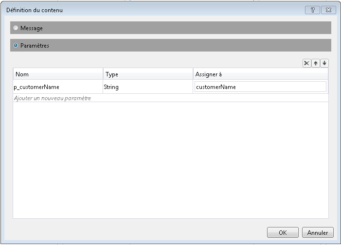  
  
    3.  Sélectionnez le **SendReplyToReceive** activité et définissez la propriété en surbrillance indiquée dans l’illustration suivante.  
  
         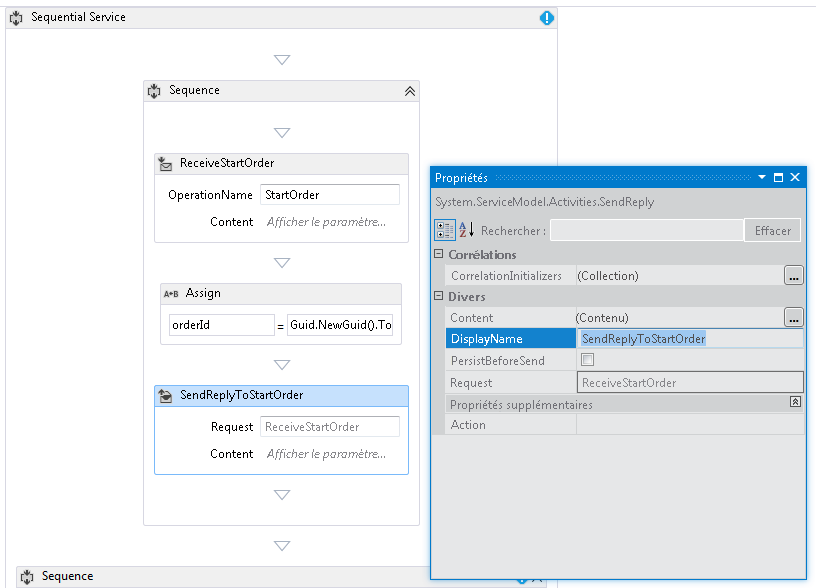  
  
    4.  Cliquez sur le **définir...**  lien dans le **SendReplyToStartOrder** activité et définissez les propriétés affichées dans l’illustration suivante. Notez que la **paramètres** case d’option est sélectionnée ; un paramètre nommé `p_orderId` est lié à la `orderId` variable. Ce paramètre spécifie que l'activité SendReplyToStartOrder retournera une valeur de type String à l'appelant.  
  
         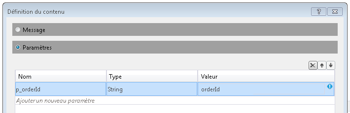  
  
    5.  Faites glisser et déposez une activité Assign entre les **réception** et **SendReply** activités et définissez les propriétés comme indiqué dans l’illustration suivante :  
  
         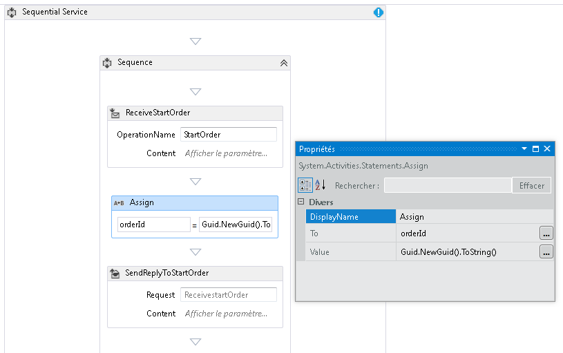  
  
         Cette action permet de créer un nouvel ID de commande et de placer la valeur dans la variable orderId.  
  
    6.  Sélectionnez le **ReplyToStartOrder** activité. Dans la fenêtre Propriétés, cliquez sur le bouton de sélection **CorrelationInitializers**. Sélectionnez le **ajouter initialiseur** lier, entrez `orderIdHandle` dans la zone de texte initialiseur, sélectionnez l’initialiseur de corrélation de requête pour le type de corrélation et sélectionnez p_orderId sous la zone de liste déroulante des requêtes XPATH. Ces paramètres sont indiqués dans l'illustration suivante. Cliquez sur **OK**.  Cette action permet d'initialiser une corrélation entre le client et cette instance du service de workflow. Lorsqu'un message contenant cet ID de commande est reçu, il est routé vers cette instance du service de workflow.  
  
         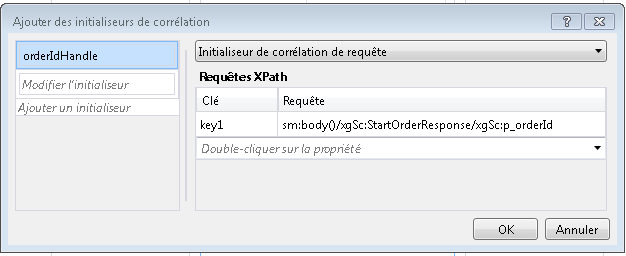  
  
7.  Faites glisser une autre **ReceiveAndSendReply** activité à la fin du flux de travail (en dehors de la **séquence** contenant les premières **réception** et  **SendReply** activités). Le second message envoyé par le client sera alors reçu et une réponse sera renvoyée.  
  
    1.  Sélectionnez le **séquence** contenant récemment ajouté **réception** et **SendReply** activités et cliquez sur le **Variables** bouton. Ajoutez la variable mise en surbrillance dans l'illustration suivante :  
  
         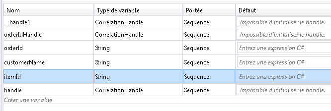  
  
    2.  Sélectionnez le **réception** activité et définissez les propriétés affichées dans l’illustration suivante :  
  
         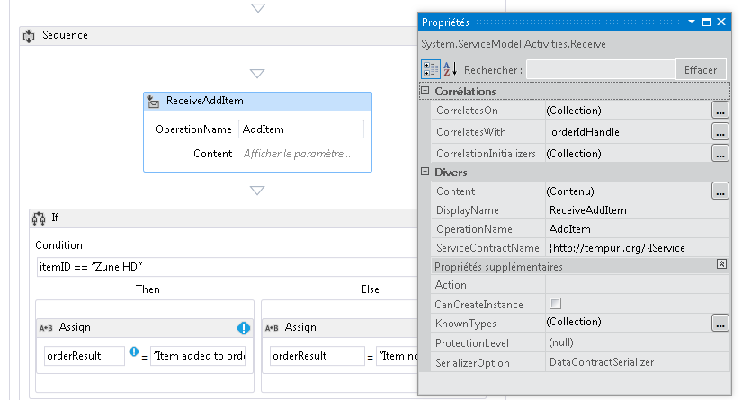  
  
    3.  Cliquez sur le **définir...**  lien dans le **ReceiveAddItem** activité et ajoutez les paramètres indiqués dans l’illustration suivante : Cela configure l’activité de réception pour accepter deux paramètres, l’ID de commande et l’ID de l’article commandé.  
  
         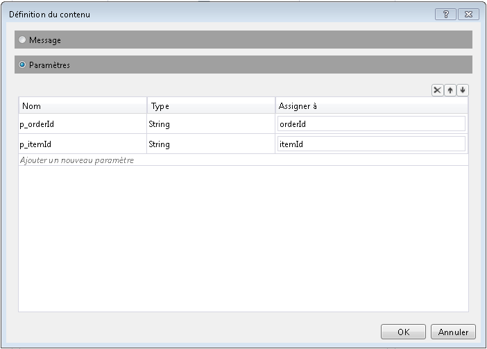  
  
    4.  Cliquez sur le **CorrelateOn** points de suspension bouton et entrez `orderIdHandle`. Sous **requêtes XPath**, cliquez sur la flèche déroulante et sélectionnez `p_orderId`. Cela permet de configurer la corrélation sur la deuxième activité Receive. [!INCLUDE[crabout](../../../../includes/crabout-md.md)]corrélation, consultez [corrélation](../../../../docs/framework/wcf/feature-details/correlation.md).  
  
         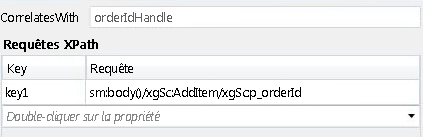  
  
    5.  Faites glisser et déposez une **si** activité immédiatement après le **ReceiveAddItem** activité. Cette activité agit de la même façon qu'une instruction if.  
  
        1.  Définir le **Condition** propriété`itemId=="Zune HD" (itemId="Zune HD" for Visual Basic)`  
  
        2.  Glisser- déposer un **affecter** activité dans le **puis** section et une autre dans le **Else** section définie les propriétés de la **affecter** activités, comme indiqué dans l’illustration suivante.  
  
             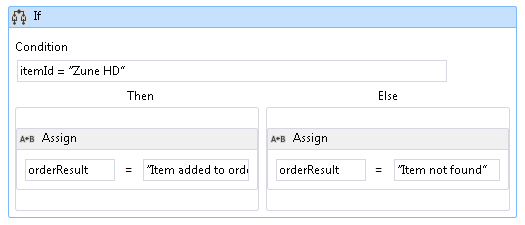  
  
             Si la condition est `true` le **puis** section sera exécutée. Si la condition est `false` le **Else** section est exécutée.  
  
        3.  Sélectionnez le **SendReplyToReceive** activité et définissez la **DisplayName** propriété indiquée dans l’illustration suivante.  
  
             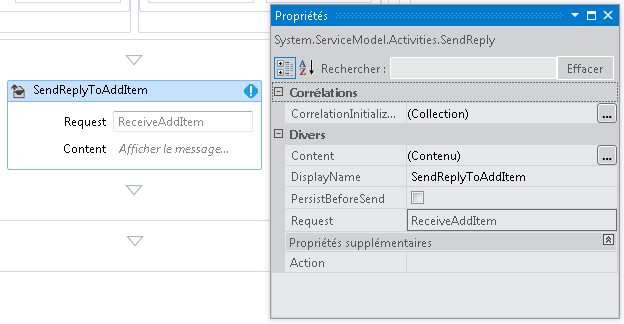  
  
        4.  Cliquez sur le **définir...**  lien dans le **SetReplyToAddItem** activité et le configurer comme indiqué dans l’illustration suivante. Cela configure le **SendReplyToAddItem** activité qui permet de retourner la valeur dans la `orderResult` variable.  
  
             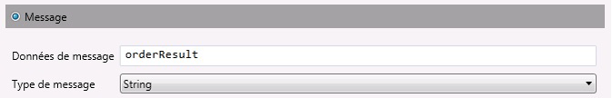  
  
8.  Ouvrez le fichier web.config et ajoutez les éléments suivants dans le \<comportement > section pour activer la persistance de workflow.  
  
    ```xml  
    <sqlWorkflowInstanceStore connectionString="Data Source=your-machine\SQLExpress;Initial Catalog=SQLPersistenceStore;Integrated Security=True;Asynchronous Processing=True" instanceEncodingOption="None" instanceCompletionAction="DeleteAll" instanceLockedExceptionAction="BasicRetry" hostLockRenewalPeriod="00:00:30" runnableInstancesDetectionPeriod="00:00:02" />  
              <workflowIdle timeToUnload="0"/>  
    ```  
  
    > [!WARNING]
    >  Assurez-vous de remplacer le nom de l'hôte et de l'instance SQL Server dans l'extrait de code précédent.  
  
9. Générez la solution.  
  
### <a name="to-create-a-client-application-to-call-the-workflow-service"></a>Pour créer une application cliente pour appeler le service de workflow  
  
1.  Ajoutez à la solution un nouveau projet d'application console nommé `OrderClient`.  
  
2.  Ajoutez les références aux assemblys suivantes au projet `OrderClient` :  
  
    1.  System.ServiceModel.dll  
  
    2.  System.ServiceModel.Activities.dll  
  
3.  Ajoutez une référence de service au service de workflow et spécifiez `OrderService` comme espace de noms.  
  
4.  Dans la méthode `Main()` du projet client, ajoutez le code suivant :  
  
    ```  
    static void Main(string[] args)  
    {  
       // Send initial message to start the workflow service  
       Console.WriteLine("Sending start message");  
       StartOrderClient startProxy = new StartOrderClient();  
       string orderId = startProxy.StartOrder("Kim Abercrombie");  
  
       // The workflow service is now waiting for the second message to be sent  
       Console.WriteLine("Workflow service is idle...");  
       Console.WriteLine("Press [ENTER] to send an add item message to reactivate the workflow service...");  
       Console.ReadLine();  
  
       // Send the second message  
       Console.WriteLine("Sending add item message");  
       AddItemClient addProxy = new AddItemClient();  
       AddItem item = new AddItem();  
       item.p_itemId = "Zune HD";  
       item.p_orderId = orderId;  
  
       string orderResult = addProxy.AddItem(item);  
       Console.WriteLine("Service returned: " + orderResult);  
    }  
    ```  
  
5.  Générez la solution et exécutez l'application `OrderClient`. Le client affiche le texte suivant :  
  
    ```Output  
    Sending start messageWorkflow service is idle...Press [ENTER] to send an add item message to reactivate the workflow service...  
    ```  
  
6.  Pour vérifier que le service de workflow a été rendue persistante, démarrez SQL Server Management Studio en accédant à la **Démarrer** menu, si vous sélectionnez **tous les programmes**, **deMicrosoftSQLServer2008**, **SQL Server Management Studio**.  
  
    1.  Dans le volet gauche, développez **bases de données**, **SQLPersistenceStore**, **vues** avec le bouton droit sur **System.Activities.DurableInstancing.Instances**  et sélectionnez **sélectionnez 1000 lignes du haut**. Dans le **résultats** volet Vérifiez au moins une instance est listée. D'autres instances d'exécutions précédentes peuvent également être présentes si une exception s'est produite pendant l'exécution. Vous pouvez supprimer des lignes existantes en cliquant **System.Activities.DurableInstancing.Instances** et en sélectionnant **modifier les 200 lignes du haut**, en cliquant sur le **Execute** bouton, sélectionner toutes les lignes dans le volet de résultats et **supprimer**.  Pour vous assurer que l'instance affichée dans la base de données est bien l'instance créée par votre application, vérifiez que la vue Instances est vide avant d'exécuter le client. Une fois que le client est en cours d'exécution, réexécutez la requête (Sélectionner les 1000 lignes du haut) et assurez-vous qu'une nouvelle instance a été ajoutée.  
  
7.  Appuyez sur Entrée pour envoyer le message d'ajout d'élément au service de workflow. Le client affiche le texte suivant :  
  
    ```Output  
    Sending add item messageService returned: Item added to orderPress any key to continue . . .  
    ```  
  
## <a name="see-also"></a>Voir aussi  
 [Services de workflow](../../../../docs/framework/wcf/feature-details/workflow-services.md)
