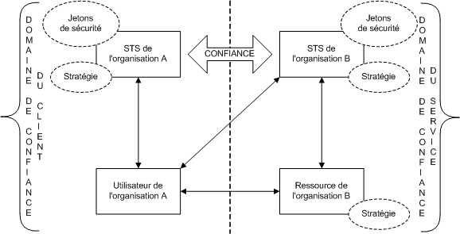
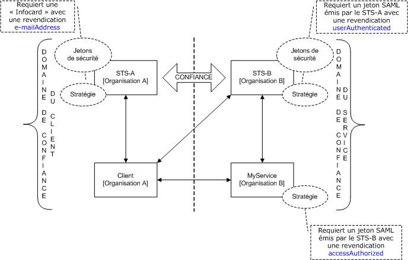
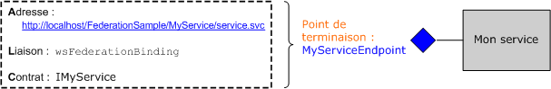
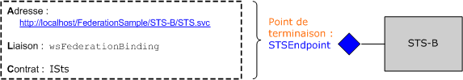
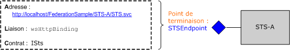
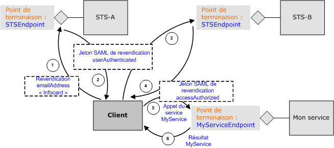

# <a name="federation"></a><span data-ttu-id="6b470-102">Fédération</span><span class="sxs-lookup"><span data-stu-id="6b470-102">Federation</span></span>
<span data-ttu-id="6b470-103">Cette rubrique fournit une brève vue d'ensemble du concept de sécurité fédérée.</span><span class="sxs-lookup"><span data-stu-id="6b470-103">This topic provides a brief overview of the concept of federated security.</span></span> <span data-ttu-id="6b470-104">Elle décrit également la prise en charge [!INCLUDE[indigo1](../../../../includes/indigo1-md.md)] permettant de déployer des architectures de sécurité fédérée.</span><span class="sxs-lookup"><span data-stu-id="6b470-104">It also describes [!INCLUDE[indigo1](../../../../includes/indigo1-md.md)] support for deploying federated security architectures.</span></span> <span data-ttu-id="6b470-105">Pour un exemple d’application qui illustre la fédération, consultez [Federation, exemple](../../../../docs/framework/wcf/samples/federation-sample.md).</span><span class="sxs-lookup"><span data-stu-id="6b470-105">For a sample application that demonstrates federation, see [Federation Sample](../../../../docs/framework/wcf/samples/federation-sample.md).</span></span>  
  
## <a name="definition-of-federated-security"></a><span data-ttu-id="6b470-106">Définition de sécurité fédérée</span><span class="sxs-lookup"><span data-stu-id="6b470-106">Definition of Federated Security</span></span>  
 <span data-ttu-id="6b470-107">La sécurité fédérée permet une séparation nette entre le service auquel un client accède et les procédures d'authentification et d'autorisation associées.</span><span class="sxs-lookup"><span data-stu-id="6b470-107">Federated security allows for clean separation between the service a client is accessing and the associated authentication and authorization procedures.</span></span> <span data-ttu-id="6b470-108">La sécurité fédérée permet également la collaboration sur plusieurs systèmes, réseaux et organisations dans les différents domaines de confiance.</span><span class="sxs-lookup"><span data-stu-id="6b470-108">Federated security also enables collaboration across multiple systems, networks, and organizations in different trust realms.</span></span>  
  
 [!INCLUDE[indigo2](../../../../includes/indigo2-md.md)]<span data-ttu-id="6b470-109"> prend en charge la création et le déploiement des systèmes distribués qui utilisent la sécurité fédérée.</span><span class="sxs-lookup"><span data-stu-id="6b470-109"> provides support for building and deploying distributed systems that employ federated security.</span></span>  
  
### <a name="elements-of-a-federated-security-architecture"></a><span data-ttu-id="6b470-110">Éléments d'une architecture de sécurité fédérée</span><span class="sxs-lookup"><span data-stu-id="6b470-110">Elements of a Federated Security Architecture</span></span>  
 <span data-ttu-id="6b470-111">L'architecture de sécurité fédérée a trois éléments clés, tel qu'indiqué dans le tableau suivant.</span><span class="sxs-lookup"><span data-stu-id="6b470-111">The federated security architecture has three key elements, as described in the following table.</span></span>  
  
|<span data-ttu-id="6b470-112">Élément</span><span class="sxs-lookup"><span data-stu-id="6b470-112">Element</span></span>|<span data-ttu-id="6b470-113">Description</span><span class="sxs-lookup"><span data-stu-id="6b470-113">Description</span></span>|  
|-------------|-----------------|  
|<span data-ttu-id="6b470-114">Domaine</span><span class="sxs-lookup"><span data-stu-id="6b470-114">Domain/realm</span></span>|<span data-ttu-id="6b470-115">Unité unique de confiance ou d'administration de sécurité.</span><span class="sxs-lookup"><span data-stu-id="6b470-115">A single unit of security administration or trust.</span></span> <span data-ttu-id="6b470-116">Un domaine classique peut inclure une organisation unique.</span><span class="sxs-lookup"><span data-stu-id="6b470-116">A typical domain might include a single organization.</span></span>|  
|<span data-ttu-id="6b470-117">Fédération</span><span class="sxs-lookup"><span data-stu-id="6b470-117">Federation</span></span>|<span data-ttu-id="6b470-118">Collection de domaines qui ont établi la confiance.</span><span class="sxs-lookup"><span data-stu-id="6b470-118">A collection of domains that have established trust.</span></span> <span data-ttu-id="6b470-119">Le niveau de confiance peut varier, mais il inclut en général l'authentification et presque toujours l'autorisation.</span><span class="sxs-lookup"><span data-stu-id="6b470-119">The level of trust may vary, but typically includes authentication and almost always includes authorization.</span></span> <span data-ttu-id="6b470-120">Une fédération classique peut inclure un certain nombre d'organisations qui ont établi la confiance pour l'accès partagé à un ensemble de ressources.</span><span class="sxs-lookup"><span data-stu-id="6b470-120">A typical federation might include a number of organizations that have established trust for shared access to a set of resources.</span></span>|  
|<span data-ttu-id="6b470-121">Service d'émission de jeton de sécurité (STS, Security Token Service)</span><span class="sxs-lookup"><span data-stu-id="6b470-121">Security Token Service (STS)</span></span>|<span data-ttu-id="6b470-122">Service Web qui émet des jetons de sécurité ; autrement dit, fait des assertions en fonction de la preuve qu'il approuve, à quiconque l'approuve.</span><span class="sxs-lookup"><span data-stu-id="6b470-122">A Web service that issues security tokens; that is, it makes assertions based on evidence that it trusts, to whomever trusts it.</span></span> <span data-ttu-id="6b470-123">Il constitue la base de l'échange de confiance entre les domaines.</span><span class="sxs-lookup"><span data-stu-id="6b470-123">This forms the basis of trust brokering between domains.</span></span>|  
  
### <a name="example-scenario"></a><span data-ttu-id="6b470-124">Exemple de scénario</span><span class="sxs-lookup"><span data-stu-id="6b470-124">Example Scenario</span></span>  
 <span data-ttu-id="6b470-125">L'illustration suivante présente un exemple de sécurité fédérée.</span><span class="sxs-lookup"><span data-stu-id="6b470-125">The following illustration shows an example of federated security.</span></span>  
  
 <span data-ttu-id="6b470-126"></span><span class="sxs-lookup"><span data-stu-id="6b470-126"></span></span>  
  
 <span data-ttu-id="6b470-127">Ce scénario inclut deux organisations : A et B. L'organisation B a une ressource Web (un service Web) que certains utilisateurs de l'organisation A trouvent utile.</span><span class="sxs-lookup"><span data-stu-id="6b470-127">This scenario includes two organizations: A and B. Organization B has a Web resource (a Web service) that some users in organization A find valuable.</span></span>  
  
> [!NOTE]
>  <span data-ttu-id="6b470-128">Cette section utilise les termes du contrat *ressource*, *service*, et *service Web* indifféremment.</span><span class="sxs-lookup"><span data-stu-id="6b470-128">This section uses the terms *resource*, *service*, and *Web service* interchangeably.</span></span>  
  
 <span data-ttu-id="6b470-129">En général, l'organisation B requiert qu'un utilisateur de l'organisation A fournisse des formulaires d'authentification valides avant d'accéder au service.</span><span class="sxs-lookup"><span data-stu-id="6b470-129">Typically, organization B requires that a user from organization A provide some valid form of authentication before accessing the service.</span></span> <span data-ttu-id="6b470-130">De plus, l'organisation peut également requérir que l'utilisateur soit autorisé à accéder à la ressource spécifique en question.</span><span class="sxs-lookup"><span data-stu-id="6b470-130">In addition, the organization may also require that the user be authorized to access the specific resource in question.</span></span> <span data-ttu-id="6b470-131">L'une des méthodes pour résoudre ce problème et permettre aux utilisateurs de l'organisation A d'accéder à la ressource de l'organisation B est la suivante :</span><span class="sxs-lookup"><span data-stu-id="6b470-131">One way to address this problem and enable users in organization A to access the resource in organization B is as follows:</span></span>  
  
-   <span data-ttu-id="6b470-132">Les utilisateurs de l'organisation A enregistrent leurs informations d'identification (nom d'utilisateur et mot de passe) auprès de l'organisation B.</span><span class="sxs-lookup"><span data-stu-id="6b470-132">Users from organization A register their credentials (a user name and password) with organization B.</span></span>  
  
-   <span data-ttu-id="6b470-133">Pendant l'accès aux ressources, les utilisateurs de l'organisation A présentent leurs informations d'identification à l'organisation B et sont authentifiés avant d'accéder à la ressource.</span><span class="sxs-lookup"><span data-stu-id="6b470-133">During the resource access, users from organization A present their credentials to organization B and are authenticated before accessing the resource.</span></span>  
  
 <span data-ttu-id="6b470-134">Cette approche a trois inconvénients significatifs :</span><span class="sxs-lookup"><span data-stu-id="6b470-134">This approach has three significant drawbacks:</span></span>  
  
-   <span data-ttu-id="6b470-135">L'organisation B doit gérer les informations d'identification des utilisateurs de l'organisation A, outre la gestion de ses utilisateurs internes.</span><span class="sxs-lookup"><span data-stu-id="6b470-135">Organization B has to manage the credentials for users from organization A in addition to managing the credentials of its local users.</span></span>  
  
-   <span data-ttu-id="6b470-136">Les utilisateurs de l'organisation A doivent gérer un ensemble d'informations d'identification supplémentaire (autrement dit, se souvenir d'un nom d'utilisateur et d'un mot de passe supplémentaires) outre les informations d'identification qu'ils utilisent habituellement pour accéder aux ressources dans l'organisation A. Cela favorise la pratique qui consiste à utiliser des noms d'utilisateur et mots de passe identiques au niveau de plusieurs sites de service, ce qui est une mesure de sécurité faible.</span><span class="sxs-lookup"><span data-stu-id="6b470-136">Users in organization A need to maintain an additional set of credentials (that is, remember an additional user name and password) apart from the credentials they normally use to gain access to resources within organization A. This usually encourages the practice of using the same user name and password at multiple service sites, which is a weak security measure.</span></span>  
  
-   <span data-ttu-id="6b470-137">L'architecture n'évolue pas car plusieurs organisations perçoivent la ressource de l'organisation B comme étant utile.</span><span class="sxs-lookup"><span data-stu-id="6b470-137">The architecture does not scale as more organizations perceive the resource at organization B as being of some value.</span></span>  
  
 <span data-ttu-id="6b470-138">L'autre approche, qui résout les inconvénients précédemment mentionnés, consiste à utiliser la sécurité fédérée.</span><span class="sxs-lookup"><span data-stu-id="6b470-138">An alternative approach, which addresses the previously mentioned drawbacks, is to employ federated security.</span></span> <span data-ttu-id="6b470-139">Dans cette approche, les organisations A et B établissent une relation de confiance et utilisent le STS pour permettre l'échange de la confiance établie.</span><span class="sxs-lookup"><span data-stu-id="6b470-139">In this approach, organizations A and B establish a trust relationship and employ Security Token Service (STS) to enable brokering of the established trust.</span></span>  
  
 <span data-ttu-id="6b470-140">Dans une architecture de sécurité fédérée, les utilisateurs de l'organisation A savent que s'ils souhaitent accéder au service Web de l'organisation B, ils doivent présenter un jeton de sécurité valide provenant du STS à l'organisation B, qui authentifie et autorise leur accès au service spécifique.</span><span class="sxs-lookup"><span data-stu-id="6b470-140">In a federated security architecture, users from organization A know that if they want to access the Web service in organization B that they must present a valid security token from the STS at organization B, which authenticates and authorizes their access to the specific service.</span></span>  
  
 <span data-ttu-id="6b470-141">Lorsqu'ils contactent le STS B, les utilisateurs reçoivent un autre niveau d'indirection de la stratégie associée au STS.</span><span class="sxs-lookup"><span data-stu-id="6b470-141">On contacting the STS B, the users receive another level of indirection from the policy associated with the STS.</span></span> <span data-ttu-id="6b470-142">Ils doivent présenter un jeton de sécurité valide provenant du STS A (autrement dit, le domaine de confiance client) pour que le STS B puisse leur délivrer un jeton de sécurité.</span><span class="sxs-lookup"><span data-stu-id="6b470-142">They must present a valid security token from the STS A (that is, the client trust realm) before the STS B can issue them a security token.</span></span> <span data-ttu-id="6b470-143">C'est un corollaire de la relation de confiance établie entre les deux organisations et cela implique que l'organisation B n'a pas à gérer des identités pour les utilisateurs de l'organisation A. Dans la pratique, le STS B a en général un `issuerAddress` et un `issuerMetadataAddress` null.</span><span class="sxs-lookup"><span data-stu-id="6b470-143">This is a corollary of the trust relationship established between the two organizations and implies that organization B does not have to manage identities for users from organization A. In practice, STS B typically has a null `issuerAddress` and `issuerMetadataAddress`.</span></span> [!INCLUDE[crdefault](../../../../includes/crdefault-md.md)]<span data-ttu-id="6b470-144">[Comment : configurer un émetteur Local](../../../../docs/framework/wcf/feature-details/how-to-configure-a-local-issuer.md).</span><span class="sxs-lookup"><span data-stu-id="6b470-144"> [How to: Configure a Local Issuer](../../../../docs/framework/wcf/feature-details/how-to-configure-a-local-issuer.md).</span></span> <span data-ttu-id="6b470-145">Dans ce cas, le client consulte une stratégie locale pour localiser STS A. Cette configuration est appelée *fédération de domaine d’accueil* et elle évolue mieux car STS B n’a pas à mettre à jour les informations sur le STS A.</span><span class="sxs-lookup"><span data-stu-id="6b470-145">In that case, the client consults a local policy to locate STS A. This configuration is called *home realm federation* and it scales better because STS B does not have to maintain information about STS A.</span></span>  
  
 <span data-ttu-id="6b470-146">Les utilisateurs contactent ensuite le STS de l'organisation A et obtiennent un jeton de sécurité en présentant les informations d'identification qu'ils utilisent habituellement pour accéder aux autres ressources de l'organisation A. Cela évite aux utilisateurs d'avoir à gérer plusieurs ensembles d'informations d'identification ou à utiliser le même ensemble au niveau de plusieurs sites de service.</span><span class="sxs-lookup"><span data-stu-id="6b470-146">The users then contact the STS at organization A and obtain a security token by presenting authentication credentials that they normally use to gain access to any other resource within organization A. This also alleviates the problem of users having to maintain multiple sets of credentials or using the same set of credentials at multiple service sites.</span></span>  
  
 <span data-ttu-id="6b470-147">Une fois que les utilisateurs obtiennent un jeton de sécurité du STS A, ils présentent le jeton au STS B. L'organisation B continue à procéder à l'autorisation des demandes des utilisateurs et leur envoie un jeton de sécurité provenant de son propre jeu.</span><span class="sxs-lookup"><span data-stu-id="6b470-147">Once the users obtain a security token from the STS A, they present the token to the STS B. Organization B proceeds to perform authorization of the users' requests and issues a security token to the users from its own set of security tokens.</span></span> <span data-ttu-id="6b470-148">Les utilisateurs peuvent ensuite présenter leur jeton à la ressource de l'organisation B et accéder au service.</span><span class="sxs-lookup"><span data-stu-id="6b470-148">The users can then present their token to the resource at organization B and access the service.</span></span>  
  
## <a name="support-for-federated-security-in-wcf"></a><span data-ttu-id="6b470-149">Prise en charge de la sécurité fédérée dans WCF</span><span class="sxs-lookup"><span data-stu-id="6b470-149">Support for Federated Security in WCF</span></span>  
 [!INCLUDE[indigo2](../../../../includes/indigo2-md.md)]<span data-ttu-id="6b470-150">Fournit la prise en charge des clés en main pour déployer des architectures de sécurité fédérée via la [ \<wsFederationHttpBinding >](../../../../docs/framework/configure-apps/file-schema/wcf/wsfederationhttpbinding.md).</span><span class="sxs-lookup"><span data-stu-id="6b470-150"> provides turnkey support for deploying federated security architectures through the [\<wsFederationHttpBinding>](../../../../docs/framework/configure-apps/file-schema/wcf/wsfederationhttpbinding.md).</span></span>  
  
 <span data-ttu-id="6b470-151">Le [ \<wsFederationHttpBinding >](../../../../docs/framework/configure-apps/file-schema/wcf/wsfederationhttpbinding.md) élément fournit pour une liaison sécurisée, fiable et interopérable qui implique l’utilisation de HTTP comme mécanisme de transport sous-jacent pour le style de communication demande-réponse, emploi en tant que le format de câble d’encodage de texte et XML.</span><span class="sxs-lookup"><span data-stu-id="6b470-151">The [\<wsFederationHttpBinding>](../../../../docs/framework/configure-apps/file-schema/wcf/wsfederationhttpbinding.md) element provides for a secure, reliable, interoperable binding that entails the use of HTTP as the underlying transport mechanism for request-reply communication style, employing text and XML as the wire format for encoding.</span></span>  
  
 <span data-ttu-id="6b470-152">L’utilisation de [ \<wsFederationHttpBinding >](../../../../docs/framework/configure-apps/file-schema/wcf/wsfederationhttpbinding.md) dans la sécurité fédérée scénario peut être dissocié en deux phases logiquement indépendantes, comme décrit dans les sections suivantes.</span><span class="sxs-lookup"><span data-stu-id="6b470-152">The use of [\<wsFederationHttpBinding>](../../../../docs/framework/configure-apps/file-schema/wcf/wsfederationhttpbinding.md) in a federated security scenario can be decoupled into two logically independent phases, as described in the following sections.</span></span>  
  
### <a name="phase-1-design-phase"></a><span data-ttu-id="6b470-153">Phase 1 : phase de conception</span><span class="sxs-lookup"><span data-stu-id="6b470-153">Phase 1: Design Phase</span></span>  
 <span data-ttu-id="6b470-154">Pendant la phase de conception, le client utilise le [ServiceModel Metadata Utility Tool (Svcutil.exe)](../../../../docs/framework/wcf/servicemodel-metadata-utility-tool-svcutil-exe.md) pour lire la stratégie de point de terminaison de service expose et rassembler des exigences d’authentification et d’autorisation du service.</span><span class="sxs-lookup"><span data-stu-id="6b470-154">During the design phase, the client uses the [ServiceModel Metadata Utility Tool (Svcutil.exe)](../../../../docs/framework/wcf/servicemodel-metadata-utility-tool-svcutil-exe.md) to read the policy the service endpoint exposes and to collect the service's authentication and authorization requirements.</span></span> <span data-ttu-id="6b470-155">Les proxys appropriés sont construits pour créer le modèle de communication de sécurité fédérée suivant au niveau du client :</span><span class="sxs-lookup"><span data-stu-id="6b470-155">The appropriate proxies are constructed to create the following federated security communication pattern at the client:</span></span>  
  
-   <span data-ttu-id="6b470-156">Procurez-vous un jeton de sécurité auprès du STS du domaine de confiance du client.</span><span class="sxs-lookup"><span data-stu-id="6b470-156">Obtain a security token from the STS in the client trust realm.</span></span>  
  
-   <span data-ttu-id="6b470-157">Présentez le jeton au STS du domaine de confiance du service.</span><span class="sxs-lookup"><span data-stu-id="6b470-157">Present the token to the STS in the service trust realm.</span></span>  
  
-   <span data-ttu-id="6b470-158">Procurez-vous un jeton de sécurité auprès du STS du domaine de confiance du service.</span><span class="sxs-lookup"><span data-stu-id="6b470-158">Obtain a security token from the STS in the service trust realm.</span></span>  
  
-   <span data-ttu-id="6b470-159">Présentez le jeton au service pour accéder au service.</span><span class="sxs-lookup"><span data-stu-id="6b470-159">Present the token to the service to access the service.</span></span>  
  
### <a name="phase-2-run-time-phase"></a><span data-ttu-id="6b470-160">Phase 2 : phase d'exécution</span><span class="sxs-lookup"><span data-stu-id="6b470-160">Phase 2: Run-Time Phase</span></span>  
 <span data-ttu-id="6b470-161">Pendant la phase d'exécution, le client instancie un objet de la classe de client [!INCLUDE[indigo2](../../../../includes/indigo2-md.md)] et lance un appel à l'aide du client [!INCLUDE[indigo2](../../../../includes/indigo2-md.md)].</span><span class="sxs-lookup"><span data-stu-id="6b470-161">During the run-time phase, the client instantiates an object of the [!INCLUDE[indigo2](../../../../includes/indigo2-md.md)] client class and makes a call using the [!INCLUDE[indigo2](../../../../includes/indigo2-md.md)] client.</span></span> <span data-ttu-id="6b470-162">L'infrastructure sous-jacente de [!INCLUDE[indigo2](../../../../includes/indigo2-md.md)] gère les étapes précédemment mentionnées dans le modèle de communication de sécurité fédérée et active le client pour consommer le service de façon transparente.</span><span class="sxs-lookup"><span data-stu-id="6b470-162">The underlying framework of [!INCLUDE[indigo2](../../../../includes/indigo2-md.md)] handles the previously mentioned steps in the federated security communication pattern and enables the client to seamlessly consume the service.</span></span>  
  
## <a name="sample-implementation-using-wcf"></a><span data-ttu-id="6b470-163">Exemple d'implémentation à l'aide de WCF</span><span class="sxs-lookup"><span data-stu-id="6b470-163">Sample Implementation Using WCF</span></span>  
 <span data-ttu-id="6b470-164">L'illustration suivante présente un exemple d'implémentation pour une architecture de sécurité fédérée utilisant la prise en charge native de [!INCLUDE[indigo2](../../../../includes/indigo2-md.md)].</span><span class="sxs-lookup"><span data-stu-id="6b470-164">The following illustration shows a sample implementation for a federated security architecture using native support from [!INCLUDE[indigo2](../../../../includes/indigo2-md.md)].</span></span>  
  
 <span data-ttu-id="6b470-165"></span><span class="sxs-lookup"><span data-stu-id="6b470-165"></span></span>  
  
### <a name="example-myservice"></a><span data-ttu-id="6b470-166">Exemple MyService</span><span class="sxs-lookup"><span data-stu-id="6b470-166">Example MyService</span></span>  
 <span data-ttu-id="6b470-167">Le service `MyService` expose un point de terminaison unique via `MyServiceEndpoint`.</span><span class="sxs-lookup"><span data-stu-id="6b470-167">The service `MyService` exposes a single endpoint through `MyServiceEndpoint`.</span></span> <span data-ttu-id="6b470-168">L’illustration suivante présente l’adresse, la liaison et le contrat associés au point de terminaison.</span><span class="sxs-lookup"><span data-stu-id="6b470-168">The following illustration shows the address, binding, and contract associated with the endpoint.</span></span>  
  
 <span data-ttu-id="6b470-169"></span><span class="sxs-lookup"><span data-stu-id="6b470-169"></span></span>  
  
 <span data-ttu-id="6b470-170">Le point de terminaison de service `MyServiceEndpoint` utilise le [ \<wsFederationHttpBinding >](../../../../docs/framework/configure-apps/file-schema/wcf/wsfederationhttpbinding.md) et nécessite un jeton de sécurité Assertions Markup Language (SAML) valide avec un `accessAuthorized` revendication émise par le STS B. Cela est spécifié de façon déclarative dans la configuration du service.</span><span class="sxs-lookup"><span data-stu-id="6b470-170">The service endpoint `MyServiceEndpoint` uses the [\<wsFederationHttpBinding>](../../../../docs/framework/configure-apps/file-schema/wcf/wsfederationhttpbinding.md) and requires a valid Security Assertions Markup Language (SAML) token with an `accessAuthorized` claim issued by STS B. This is declaratively specified in the service configuration.</span></span>  
  
```xml  
<system.serviceModel>  
  <services>  
    <service type="FederationSample.MyService"      
        behaviorConfiguration='MyServiceBehavior'>  
        <endpoint address=""  
            binding=" wsFederationHttpBinding"  
            bindingConfiguration='MyServiceBinding'  
            contract="Federation.IMyService" />  
   </service>  
  </services>  
  
  <bindings>  
    <wsFederationHttpBinding>  
    <!-- This is the binding used by MyService. It redirects   
    clients to STS-B. -->  
      <binding name='MyServiceBinding'>  
        <security mode="Message">  
           <message issuedTokenType=  
"http://docs.oasis-open.org/wss/oasis-wss-saml-token-profile-1.1#SAMLV1.1">  
           <issuer address="http://localhost/FederationSample/STS-B/STS.svc" />  
            <issuerMetadata   
           address=  
"http://localhost/FederationSample/STS-B/STS.svc/mex" />  
         <requiredClaimTypes>  
            <add claimType="http://tempuri.org:accessAuthorized" />  
         </requiredClaimTypes>  
        </message>  
      </security>  
      </binding>  
    </wsFederationHttpBinding>  
  </bindings>  
  
  <behaviors>  
    <behavior name='MyServiceBehavior'>  
      <serviceAuthorization   
operationRequirementType="FederationSample.MyServiceOperationRequirement, MyService" />  
       <serviceCredentials>  
         <serviceCertificate findValue="CN=FederationSample.com"  
         x509FindType="FindBySubjectDistinguishedName"  
         storeLocation='LocalMachine'  
         storeName='My' />  
      </serviceCredentials>  
    </behavior>  
  </behaviors>  
</system.serviceModel>  
```  
  
> [!NOTE]
>  <span data-ttu-id="6b470-171">Un point subtil doit être noté concernant les revendications requises par `MyService`.</span><span class="sxs-lookup"><span data-stu-id="6b470-171">A subtle point should be noted about the claims required by `MyService`.</span></span> <span data-ttu-id="6b470-172">La deuxième figure indique que `MyService` requiert un jeton SAML avec la revendication `accessAuthorized`.</span><span class="sxs-lookup"><span data-stu-id="6b470-172">The second figure indicates that `MyService` requires a SAML token with the `accessAuthorized` claim.</span></span> <span data-ttu-id="6b470-173">Pour être plus précis, cela spécifie le type de revendication que `MyService` requiert.</span><span class="sxs-lookup"><span data-stu-id="6b470-173">To be more precise, this specifies the claim type that `MyService` requires.</span></span> <span data-ttu-id="6b470-174">Le nom complet de ce type de revendication est http://tempuri.org:accessAuthorized (avec l'espace de noms associé), qui est utilisé dans le fichier de configuration de service.</span><span class="sxs-lookup"><span data-stu-id="6b470-174">The fully-qualified name of this claim type is http://tempuri.org:accessAuthorized (along with the associated namespace), which is used in the service configuration file.</span></span> <span data-ttu-id="6b470-175">La valeur de cette revendication indique sa présence et elle est supposée être définie à `true` par le STS B.</span><span class="sxs-lookup"><span data-stu-id="6b470-175">The value of this claim indicates the presence of this claim and is assumed to be set to `true` by STS B.</span></span>  
  
 <span data-ttu-id="6b470-176">Pendant l'exécution, cette stratégie est appliquée par la classe `MyServiceOperationRequirement` implémentée dans le cadre de `MyService`.</span><span class="sxs-lookup"><span data-stu-id="6b470-176">At runtime, this policy is enforced by the `MyServiceOperationRequirement` class that is implemented as part of the `MyService`.</span></span>  
  
 [!code-csharp[C_Federation#0](../../../../samples/snippets/csharp/VS_Snippets_CFX/c_federation/cs/source.cs#0)]
 [!code-vb[C_Federation#0](../../../../samples/snippets/visualbasic/VS_Snippets_CFX/c_federation/vb/source.vb#0)]  
[!code-csharp[C_Federation#1](../../../../samples/snippets/csharp/VS_Snippets_CFX/c_federation/cs/source.cs#1)]
[!code-vb[C_Federation#1](../../../../samples/snippets/visualbasic/VS_Snippets_CFX/c_federation/vb/source.vb#1)]  
  
#### <a name="sts-b"></a><span data-ttu-id="6b470-177">STS B</span><span class="sxs-lookup"><span data-stu-id="6b470-177">STS B</span></span>  
 <span data-ttu-id="6b470-178">L'illustration suivante présente le STS B. Comme indiqué précédemment, un service d'émission de jeton de sécurité (STS) est également un service Web et peut avoir ses points de terminaison associés, sa stratégie, etc.</span><span class="sxs-lookup"><span data-stu-id="6b470-178">The following illustration shows the STS B. As stated earlier, a security token service (STS) is also a Web service and can have its associated endpoints, policy, and so on.</span></span>  
  
 <span data-ttu-id="6b470-179"></span><span class="sxs-lookup"><span data-stu-id="6b470-179"></span></span>  
  
 <span data-ttu-id="6b470-180">STS B expose un point de terminaison unique appelé `STSEndpoint` qui permet de demander des jetons de sécurité.</span><span class="sxs-lookup"><span data-stu-id="6b470-180">STS B exposes a single endpoint, called `STSEndpoint` that can be use to request security tokens.</span></span> <span data-ttu-id="6b470-181">Plus précisément, le STS B émet des jetons SAML avec la revendication `accessAuthorized`, qui peuvent être présentés au niveau du site de service `MyService` permettant d'accéder au service.</span><span class="sxs-lookup"><span data-stu-id="6b470-181">Specifically, STS B issues SAML tokens with the `accessAuthorized` claim, which can be presented at the `MyService` service site for accessing the service.</span></span> <span data-ttu-id="6b470-182">Toutefois, le STS B requiert que les utilisateurs présentent un jeton SAML valide émis par le STS A qui contient la revendication `userAuthenticated`.</span><span class="sxs-lookup"><span data-stu-id="6b470-182">However, STS B requires users to present a valid SAML token issued by STS A that contains the `userAuthenticated` claim.</span></span> <span data-ttu-id="6b470-183">Cela est spécifié de façon déclarative dans la configuration de STS.</span><span class="sxs-lookup"><span data-stu-id="6b470-183">This is declaratively specified in the STS configuration.</span></span>  
  
```xml  
<system.serviceModel>  
  <services>  
    <service type="FederationSample.STS_B" behaviorConfiguration=  
     "STS-B_Behavior">  
    <endpoint address=""  
              binding="wsFederationHttpBinding"  
              bindingConfiguration='STS-B_Binding'  
      contract="FederationSample.ISts" />  
    </service>  
  </services>  
  <bindings>  
    <wsFederationHttpBinding>  
    <!-- This is the binding used by STS-B. It redirects clients to   
         STS-A. -->  
      <binding name='STS-B_Binding'>  
        <security mode='Message'>  
          <message issuedTokenType="http://docs.oasis-open.org/wss/oasis-wss-saml-token-profile-1.1#SAMLV1.1">  
          <issuer address='http://localhost/FederationSample/STS-A/STS.svc' />  
          <issuerMetadata address='http://localhost/FederationSample/STS-A/STS.svc/mex'/>  
          <requiredClaimTypes>  
            <add claimType='http://tempuri.org:userAuthenticated'/>  
          </requiredClaimTypes>  
          </message>  
        </security>  
    </binding>  
   </wsFederationHttpBinding>  
  </bindings>  
  <behaviors>  
  <behavior name='STS-B_Behavior'>  
    <serviceAuthorization   operationRequirementType='FederationSample.STS_B_OperationRequirement, STS_B' />  
    <serviceCredentials>  
      <serviceCertificate findValue='CN=FederationSample.com'  
      x509FindType='FindBySubjectDistinguishedName'  
       storeLocation='LocalMachine'  
       storeName='My' />  
     </serviceCredentials>  
   </behavior>  
  </behaviors>  
</system.serviceModel>  
```  
  
> [!NOTE]
>  <span data-ttu-id="6b470-184">Une nouvelle fois, la revendication `userAuthenticated` est le type de revendication requis par le STS B. Le nom complet de ce type de revendication est http://tempuri.org:userAuthenticated (avec l'espace de noms associé), qui est utilisé dans le fichier de configuration de STS.</span><span class="sxs-lookup"><span data-stu-id="6b470-184">Again, the `userAuthenticated` claim is the claim type that is required by STS B. The fully-qualified name of this claim type is http://tempuri.org:userAuthenticated (along with the associated namespace), which is used in the STS configuration file.</span></span> <span data-ttu-id="6b470-185">La valeur de cette revendication indique sa présence et elle est supposée être définie à `true` par le STS A.</span><span class="sxs-lookup"><span data-stu-id="6b470-185">The value of this claim indicates the presence of this claim and is assumed to be set to `true` by STS A.</span></span>  
  
 <span data-ttu-id="6b470-186">Pendant l'exécution, la classe `STS_B_OperationRequirement` applique cette stratégie, qui est implémentée dans le cadre du STS B.</span><span class="sxs-lookup"><span data-stu-id="6b470-186">At runtime, the `STS_B_OperationRequirement` class enforces this policy, which is implemented as part of STS B.</span></span>  
  
 [!code-csharp[C_Federation#2](../../../../samples/snippets/csharp/VS_Snippets_CFX/c_federation/cs/source.cs#2)]
 [!code-vb[C_Federation#2](../../../../samples/snippets/visualbasic/VS_Snippets_CFX/c_federation/vb/source.vb#2)]  
  
 <span data-ttu-id="6b470-187">Si le contrôle d'accès est clair, le STS B émet un jeton SAML avec la revendication `accessAuthorized`.</span><span class="sxs-lookup"><span data-stu-id="6b470-187">If the access check is clear, STS B issues a SAML token with the `accessAuthorized` claim.</span></span>  
  
 [!code-csharp[C_Federation#3](../../../../samples/snippets/csharp/VS_Snippets_CFX/c_federation/cs/source.cs#3)]
 [!code-vb[C_Federation#3](../../../../samples/snippets/visualbasic/VS_Snippets_CFX/c_federation/vb/source.vb#3)]  
  
#### <a name="sts-a"></a><span data-ttu-id="6b470-188">STS A</span><span class="sxs-lookup"><span data-stu-id="6b470-188">STS A</span></span>  
 <span data-ttu-id="6b470-189">L'illustration suivante présente le STS A.</span><span class="sxs-lookup"><span data-stu-id="6b470-189">The following illustration shows the STS A.</span></span>  
  
 <span data-ttu-id="6b470-190"></span><span class="sxs-lookup"><span data-stu-id="6b470-190"></span></span>  
  
 <span data-ttu-id="6b470-191">À l'instar du STS B, le STS A est également un service Web qui émet des jetons de sécurité et expose un point de terminaison unique à cette fin.</span><span class="sxs-lookup"><span data-stu-id="6b470-191">Similar to the STS B, the STS A is also a Web service that issues security tokens and exposes a single endpoint for this purpose.</span></span> <span data-ttu-id="6b470-192">Toutefois, il utilise une liaison différente (`wsHttpBinding`) et requiert que les utilisateurs présentent un [!INCLUDE[infocard](../../../../includes/infocard-md.md)] valide avec une revendication `emailAddress`.</span><span class="sxs-lookup"><span data-stu-id="6b470-192">However, it uses a different binding (`wsHttpBinding`) and requires users to present a valid [!INCLUDE[infocard](../../../../includes/infocard-md.md)] with an `emailAddress` claim.</span></span> <span data-ttu-id="6b470-193">En réponse, il émet des jetons SAML avec la revendication `userAuthenticated`.</span><span class="sxs-lookup"><span data-stu-id="6b470-193">In response, it issues SAML tokens with the `userAuthenticated` claim.</span></span> <span data-ttu-id="6b470-194">Cela est spécifié de façon déclarative dans la configuration de service.</span><span class="sxs-lookup"><span data-stu-id="6b470-194">This is declaratively specified in the service configuration.</span></span>  
  
```xml  
<system.serviceModel>  
  <services>  
    <service type="FederationSample.STS_A" behaviorConfiguration="STS-A_Behavior">  
      <endpoint address=""  
                binding="wsHttpBinding"  
                bindingConfiguration="STS-A_Binding"  
                contract="FederationSample.ISts">  
       <identity>  
       <certificateReference findValue="CN=FederationSample.com"    
                       x509FindType="FindBySubjectDistinguishedName"  
                       storeLocation="LocalMachine"   
                       storeName="My" />  
       </identity>  
    <endpoint>  
  </service>  
</services>  
  
<bindings>  
  <wsHttpBinding>  
  <!-- This is the binding used by STS-A. It requires users to present  
   a CardSpace. -->  
    <binding name='STS-A_Binding'>  
      <security mode='Message'>  
        <message clientCredentialType="CardSpace" />  
      </security>  
    </binding>  
  </wsHttpBinding>  
</bindings>  
  
<behaviors>  
  <behavior name='STS-A_Behavior'>  
    <serviceAuthorization operationRequirementType=  
     "FederationSample.STS_A_OperationRequirement, STS_A" />  
      <serviceCredentials>  
  <serviceCertificate findValue="CN=FederationSample.com"  
                     x509FindType='FindBySubjectDistinguishedName'  
                     storeLocation='LocalMachine'  
                     storeName='My' />  
      </serviceCredentials>  
    </behavior>  
  </behaviors>  
</system.serviceModel>  
```  
  
 <span data-ttu-id="6b470-195">Pendant l'exécution, la classe `STS_A_OperationRequirement` applique cette stratégie, qui est implémentée dans le cadre du STS A.</span><span class="sxs-lookup"><span data-stu-id="6b470-195">At runtime, the `STS_A_OperationRequirement` class enforces this policy, which is implemented as part of STS A.</span></span>  
  
 [!code-csharp[C_Federation#4](../../../../samples/snippets/csharp/VS_Snippets_CFX/c_federation/cs/source.cs#4)]
 [!code-vb[C_Federation#4](../../../../samples/snippets/visualbasic/VS_Snippets_CFX/c_federation/vb/source.vb#4)]  
  
 <span data-ttu-id="6b470-196">Si l'accès est `true`, le STS A émet un jeton SAML avec la revendication `userAuthenticated`.</span><span class="sxs-lookup"><span data-stu-id="6b470-196">If the access is `true`, STS A issues a SAML token with `userAuthenticated` claim.</span></span>  
  
 [!code-csharp[C_Federation#5](../../../../samples/snippets/csharp/VS_Snippets_CFX/c_federation/cs/source.cs#5)]
 [!code-vb[C_Federation#5](../../../../samples/snippets/visualbasic/VS_Snippets_CFX/c_federation/vb/source.vb#5)]  
  
### <a name="client-at-organization-a"></a><span data-ttu-id="6b470-197">Client au niveau de l'organisation A</span><span class="sxs-lookup"><span data-stu-id="6b470-197">Client at Organization A</span></span>  
 <span data-ttu-id="6b470-198">L'illustration suivante présente le client au niveau de l'organisation A, ainsi que les étapes impliquées dans le lancement d'un appel de service `MyService`.</span><span class="sxs-lookup"><span data-stu-id="6b470-198">The following illustration shows the client at organization A, along with the steps involved in making a `MyService` service call.</span></span> <span data-ttu-id="6b470-199">Les autres composants fonctionnels sont également inclus par souci d'exhaustivité.</span><span class="sxs-lookup"><span data-stu-id="6b470-199">The other functional components are also included for completeness.</span></span>  
  
 <span data-ttu-id="6b470-200"></span><span class="sxs-lookup"><span data-stu-id="6b470-200"></span></span>  
  
## <a name="summary"></a><span data-ttu-id="6b470-201">Résumé</span><span class="sxs-lookup"><span data-stu-id="6b470-201">Summary</span></span>  
 <span data-ttu-id="6b470-202">La sécurité fédérée fournit une division nette de la responsabilité et permet de générer des architectures de service sécurisées et évolutives.</span><span class="sxs-lookup"><span data-stu-id="6b470-202">Federated security provides a clean division of responsibility and helps to build secure, scalable service architectures.</span></span> <span data-ttu-id="6b470-203">À l'instar d'une plateforme de génération et de déploiement d'applications distribuées, [!INCLUDE[indigo2](../../../../includes/indigo2-md.md)] fournit une prise en charge native permettant d'implémenter la sécurité fédérée.</span><span class="sxs-lookup"><span data-stu-id="6b470-203">As a platform for building and deploying distributed applications, [!INCLUDE[indigo2](../../../../includes/indigo2-md.md)] provides native support for implementing federated security.</span></span>  
  
## <a name="see-also"></a><span data-ttu-id="6b470-204">Voir aussi</span><span class="sxs-lookup"><span data-stu-id="6b470-204">See Also</span></span>  
 [<span data-ttu-id="6b470-205">Sécurité</span><span class="sxs-lookup"><span data-stu-id="6b470-205">Security</span></span>](../../../../docs/framework/wcf/feature-details/security.md)
