# <a name="flowing-transactions-into-and-out-of-workflow-services"></a>Flux de transactions vers et depuis des services de workflow
Les services et clients de workflow peuvent participer aux transactions.  Pour qu'une opération de service fasse partie d'une transaction ambiante, placez une activité <xref:System.ServiceModel.Activities.Receive> dans une activité <xref:System.ServiceModel.Activities.TransactedReceiveScope>. Tous les appels effectués par une activité <xref:System.ServiceModel.Activities.Send> ou <xref:System.ServiceModel.Activities.SendReply> au sein de l'activité <xref:System.ServiceModel.Activities.TransactedReceiveScope> seront également effectués dans la transaction ambiante. Une application cliente de workflow peut créer une transaction ambiante en utilisant l'activité <xref:System.Activities.Statements.TransactionScope> et appeler des opérations de service à l'aide de la transaction ambiante. Cette rubrique vous guide dans la création d'un service de workflow et d'un client de workflow qui participent à des transactions.  
  
> [!WARNING]
>  Si une instance de service de workflow est chargée dans une transaction et le workflow contient une activité <xref:System.Activities.Statements.Persist>, l'instance de workflow va être bloquée le temps que la transaction expire.  
  
> [!IMPORTANT]
>  Lorsque vous utilisez une activité <xref:System.ServiceModel.Activities.TransactedReceiveScope>, il est recommandé de placer toutes les réceptions dans le workflow dans les activités <xref:System.ServiceModel.Activities.TransactedReceiveScope>.  
  
> [!IMPORTANT]
>  Lorsque vous utilisez <xref:System.ServiceModel.Activities.TransactedReceiveScope> et les messages arrivent dans le mauvais ordre incorrect, le workflow est abandonné lorsque vous tentez de livrer le premier message dans le désordre. Vous devez vous assurer que votre workflow est toujours à un point d'arrêt cohérent lorsqu'il est inactif. Cela vous permet de redémarrer le workflow à partir d'un point de persistance précédent s'il est abandonné.  
  
### <a name="create-a-shared-library"></a>Créer une bibliothèque partagée  
  
1.  Créez une solution Visual Studio vide.  
  
2.  Ajoutez un nouveau projet de bibliothèque de classes nommé `Common`. Ajoutez des références aux assemblys suivants :  
  
    -   System.Activities.dll  
  
    -   System.ServiceModel.dll  
  
    -   System.ServiceModel.Activities.dll  
  
    -   System.Transactions.dll  
  
3.  Ajoutez une nouvelle classe nommée `PrintTransactionInfo` au projet `Common`. Cette classe est dérivée de <xref:System.Activities.NativeActivity> et surcharge la méthode <xref:System.Activities.NativeActivity.Execute%2A>.  
  
    ```  
    using System;  
    using System;  
    using System.Activities;  
    using System.Transactions;  
  
    namespace Common  
    {  
        public class PrintTransactionInfo : NativeActivity  
        {  
            protected override void Execute(NativeActivityContext context)  
            {  
                RuntimeTransactionHandle rth = context.Properties.Find(typeof(RuntimeTransactionHandle).FullName) as RuntimeTransactionHandle;  
  
                if (rth == null)  
                {  
                    Console.WriteLine("There is no ambient RuntimeTransactionHandle");  
                }  
  
                Transaction t = rth.GetCurrentTransaction(context);  
  
                if (t == null)  
                {  
                    Console.WriteLine("There is no ambient transaction");  
                }  
                else  
                {  
                    Console.WriteLine("Transaction: {0} is {1}", t.TransactionInformation.DistributedIdentifier, t.TransactionInformation.Status);  
                }  
            }  
        }  
  
    }  
    ```  
  
     Il s’agit d’une activité native qui affiche des informations sur la transaction ambiante et est utilisée dans les workflows du service et du client utilisés dans cette rubrique. Générez la solution pour rendre cette activité disponible dans le **commune** section de la **boîte à outils**.  
  
### <a name="implement-the-workflow-service"></a>Implémenter le service de workflow  
  
1.  Ajouter un nouveau [!INCLUDE[indigo2](../../../../includes/indigo2-md.md)] Service de flux de travail, appelée `WorkflowService` à la `Common` projet. Pour cela, cliquez droit sur le `Common` projet, sélectionnez **ajouter**, **un nouvel élément...** , Sélectionnez **Workflow** sous **modèles installés** et sélectionnez **Service de Workflow WCF**.  
  
       
  
2.  Supprimez les activités par défaut `ReceiveRequest` et `SendResponse`.  
  
3.  Faites glisser une activité <xref:System.Activities.Statements.WriteLine> dans l'activité `Sequential Service`. Affectez à la propriété Text la valeur `"Workflow Service starting ..."`, comme le montre l'exemple suivant.  
  
     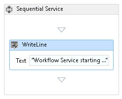  
  
4.  Faites glisser une activité <xref:System.ServiceModel.Activities.TransactedReceiveScope> après l'activité <xref:System.Activities.Statements.WriteLine>. Le <xref:System.ServiceModel.Activities.TransactedReceiveScope> activité se trouvent dans le **messagerie** section de la **boîte à outils**. Le <xref:System.ServiceModel.Activities.TransactedReceiveScope> activité est composée de deux sections **demande** et **corps**. Le **demande** section contient les <xref:System.ServiceModel.Activities.Receive> activité. Le **corps** section contient les activités à exécuter dans une transaction après réception d’un message.  
  
     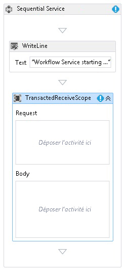  
  
5.  Sélectionnez le <xref:System.ServiceModel.Activities.TransactedReceiveScope> activité et cliquez sur le **Variables** bouton. Ajoutez les variables suivantes.  
  
     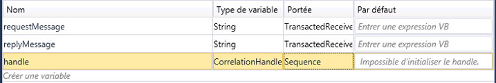  
  
    > [!NOTE]
    >  Vous pouvez supprimer la variable de données proposée à cet endroit par défaut. Vous pouvez également utiliser la variable de handle existante.  
  
6.  Faites glisser et déposez un <xref:System.ServiceModel.Activities.Receive> activité dans le **demande** section de la <xref:System.ServiceModel.Activities.TransactedReceiveScope> activité. Définissez les propriétés suivantes :  
  
    |Propriété|Valeur|  
    |--------------|-----------|  
    |CanCreateInstance|True (activez la case à cocher)|  
    |OperationName|StartSample|  
    |ServiceContractName|ITransactionSample|  
  
     Le workflow doit ressembler à ceci :  
  
     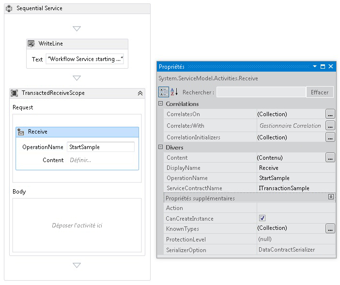  
  
7.  Cliquez sur le **définir...**  lien dans le <xref:System.ServiceModel.Activities.Receive> activité et effectuez les paramétrages suivants :  
  
     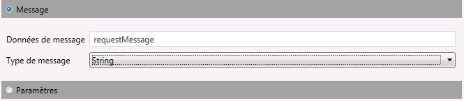  
  
8.  Faites glisser une activité <xref:System.Activities.Statements.Sequence> dans la section de corps du <xref:System.ServiceModel.Activities.TransactedReceiveScope>. Dans l'activité <xref:System.Activities.Statements.Sequence>, faites glisser deux activités <xref:System.Activities.Statements.WriteLine> et définissez les propriétés <xref:System.Activities.Statements.WriteLine.Text%2A> conformément aux indications du tableau suivant.  
  
    |Activité|Valeur|  
    |--------------|-----------|  
    |1re WriteLine|« Service : réception terminée »|  
    |2e WriteLine|"Service: Received = " + requestMessage|  
  
     Le workflow doit maintenant ressembler à ceci :  
  
     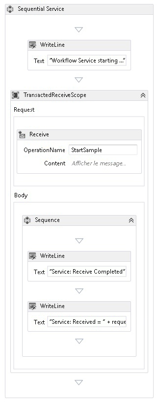  
  
9. Faites glisser et déposez le `PrintTransactionInfo` activité après la deuxième <xref:System.Activities.Statements.WriteLine> activité dans le **corps** dans le <xref:System.ServiceModel.Activities.TransactedReceiveScope> activité.  
  
     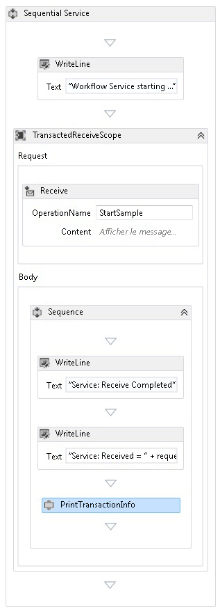  
  
10. Faites glisser une activité <xref:System.Activities.Statements.Assign> après l'activité `PrintTransactionInfo` et définissez ses propriétés conformément aux indications du tableau suivant.  
  
    |Propriété|Valeur|  
    |--------------|-----------|  
    |Pour|replyMessage|  
    |Valeur|"Service: Sending reply."|  
  
11. Faites glisser une activité <xref:System.Activities.Statements.WriteLine> après l'activité <xref:System.Activities.Statements.Assign> et affectez à sa propriété <xref:System.Activities.Statements.WriteLine.Text%2A> la valeur "Service: Begin reply."  
  
     Le workflow doit maintenant ressembler à ceci :  
  
     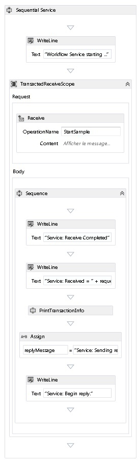  
  
12. Bouton droit sur le <xref:System.ServiceModel.Activities.Receive> activité et sélectionnez **Create SendReply** et collez-le après la dernière <xref:System.Activities.Statements.WriteLine> activité. Cliquez sur le **définir...**  lien dans le `SendReplyToReceive` activité et effectuez les paramétrages suivants.  
  
     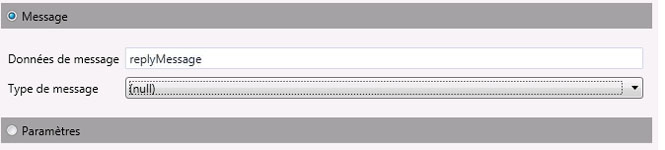  
  
13. Faites glisser et déposez un <xref:System.Activities.Statements.WriteLine> activité après le `SendReplyToReceive` activité et l’ensemble qu’il a <xref:System.Activities.Statements.WriteLine.Text%2A> propriété » Service : réponse envoyée. »  
  
14. Faites glisser une activité <xref:System.Activities.Statements.WriteLine> en bas du workflow et affectez à sa propriété <xref:System.Activities.Statements.WriteLine.Text%2A> la valeur "Service: Workflow ends, press ENTER to exit."  
  
     Le workflow de service terminé doit ressembler à ceci :  
  
     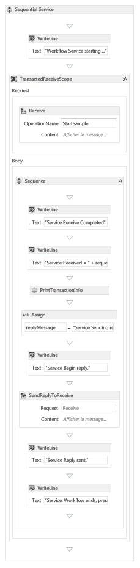  
  
### <a name="implement-the-workflow-client"></a>Implémenter le client de workflow  
  
1.  Ajoutez une nouvelle application de workflow WCF nommée `WorkflowClient` au projet `Common`. Pour cela, cliquez droit sur le `Common` projet, sélectionnez **ajouter**, **un nouvel élément...** , Sélectionnez **Workflow** sous **modèles installés** et sélectionnez **activité**.  
  
     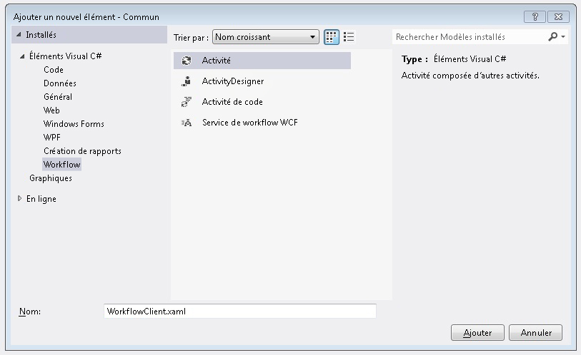  
  
2.  Faites glisser une activité <xref:System.Activities.Statements.Sequence> sur l'aire de conception.  
  
3.  Dans l'activité <xref:System.Activities.Statements.Sequence>, faites glisser une activité <xref:System.Activities.Statements.WriteLine> et affectez à sa propriété <xref:System.Activities.Statements.WriteLine.Text%2A> la valeur `"Client: Workflow starting"`. Le workflow doit maintenant ressembler à ceci :  
  
     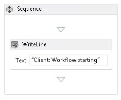  
  
4.  Faites glisser une activité <xref:System.Activities.Statements.TransactionScope> après l'activité <xref:System.Activities.Statements.WriteLine>.  Sélectionnez l'activité <xref:System.Activities.Statements.TransactionScope>, cliquez sur le bouton Variables et ajoutez les variables suivantes.  
  
     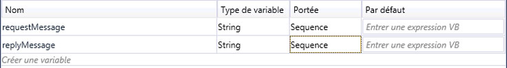  
  
5.  Faites glisser une activité <xref:System.Activities.Statements.Sequence> dans le corps de l'activité <xref:System.Activities.Statements.TransactionScope>.  
  
6.  Faites glisser une activité `PrintTransactionInfo` dans <xref:System.Activities.Statements.Sequence>.  
  
7.  Glisser- déposer un <xref:System.Activities.Statements.WriteLine> activité après le `PrintTransactionInfo` activité et définissez son <xref:System.Activities.Statements.WriteLine.Text%2A> propriété « Client : Beginning Send ». Le workflow doit maintenant ressembler à ceci :  
  
     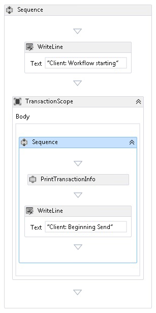  
  
8.  Faites glisser une activité <xref:System.ServiceModel.Activities.Send> après l'activité <xref:System.Activities.Statements.Assign> et définissez les propriétés suivantes :  
  
    |Propriété|Valeur|  
    |--------------|-----------|  
    |EndpointConfigurationName|workflowServiceEndpoint|  
    |OperationName|StartSample|  
    |ServiceContractName|ITransactionSample|  
  
     Le workflow doit maintenant ressembler à ceci :  
  
     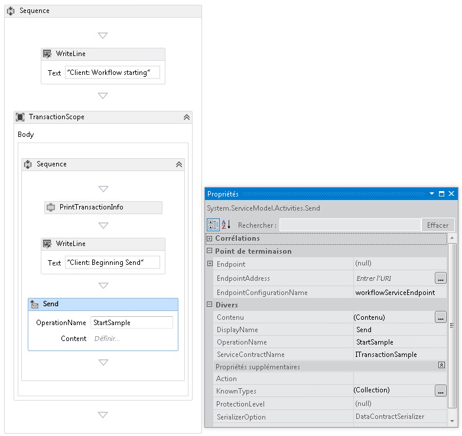  
  
9. Cliquez sur le **définir...**  lier et effectuez les paramétrages suivants :  
  
     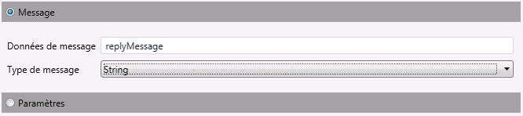  
  
10. Bouton droit sur le <xref:System.ServiceModel.Activities.Send> activité et sélectionnez **Create ReceiveReply**. L'activité <xref:System.ServiceModel.Activities.ReceiveReply> sera automatiquement placée après l'activité <xref:System.ServiceModel.Activities.Send>.  
  
11. Cliquez sur le lien Définir de l'activité ReceiveReplyForSend et effectuez les paramétrages suivants :  
  
     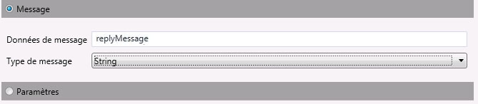  
  
12. Faites glisser une activité <xref:System.Activities.Statements.WriteLine> entre les activités <xref:System.ServiceModel.Activities.Send> et <xref:System.ServiceModel.Activities.ReceiveReply> et affectez à sa propriété <xref:System.Activities.Statements.WriteLine.Text%2A> la valeur "Client: Send complete."  
  
13. Faites glisser une activité <xref:System.Activities.Statements.WriteLine> après l'activité <xref:System.ServiceModel.Activities.ReceiveReply> et affectez à sa propriété <xref:System.Activities.Statements.WriteLine.Text%2A> la valeur "Client side: Reply received = " + replyMessage  
  
14. Faites glisser une activité `PrintTransactionInfo` après l'activité <xref:System.Activities.Statements.WriteLine>.  
  
15. Faites glisser une activité <xref:System.Activities.Statements.WriteLine> à la fin du workflow et affectez à sa propriété <xref:System.Activities.Statements.WriteLine.Text%2A> la valeur "Client workflow ends." Le workflow du client terminé doit ressembler au diagramme suivant.  
  
     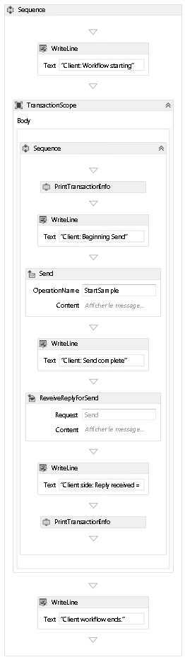  
  
16. Générez la solution.  
  
### <a name="create-the-service-application"></a>Créer l'application Service  
  
1.  Ajoutez à la solution un nouveau projet d'application console nommé `Service`. Ajoutez des références aux assemblys suivants :  
  
    1.  System.Activities.dll  
  
    2.  System.ServiceModel.dll  
  
    3.  System.ServiceModel.Activities.dll  
  
2.  Ouvrez le fichier Program.cs généré et le code suivant :  
  
    ```  
    static void Main()  
          {  
              Console.WriteLine("Building the server.");  
              using (WorkflowServiceHost host = new WorkflowServiceHost(new DeclarativeServiceWorkflow(), new Uri("net.tcp://localhost:8000/TransactedReceiveService/Declarative")))  
              {                
                  //Start the server  
                  host.Open();  
                  Console.WriteLine("Service started.");  
  
                  Console.WriteLine();  
                  Console.ReadLine();  
                  //Shutdown  
                  host.Close();  
              };         
          }  
    ```  
  
3.  Ajoutez le fichier app.config suivant au projet.  
  
    ```xml  
    <?xml version="1.0" encoding="utf-8" ?>  
    <!-- Copyright © Microsoft Corporation.  All rights reserved. -->  
    <configuration>  
        <system.serviceModel>  
            <bindings>  
                <netTcpBinding>  
                    <binding transactionFlow="true" />  
                </netTcpBinding>  
            </bindings>  
        </system.serviceModel>  
    </configuration>  
    ```  
  
### <a name="create-the-client-application"></a>Créer l'application Client  
  
1.  Ajoutez à la solution un nouveau projet d'application console nommé `Client`. Ajoutez une référence à System.Activities.dll.  
  
2.  Ouvrez le fichier program.cs et ajoutez le code suivant.  
  
    ```  
    class Program  
        {  
  
            private static AutoResetEvent syncEvent = new AutoResetEvent(false);  
  
            static void Main(string[] args)  
            {  
                //Build client  
                Console.WriteLine("Building the client.");  
                WorkflowApplication client = new WorkflowApplication(new DeclarativeClientWorkflow());  
                client.Completed = Program.Completed;  
                client.Aborted = Program.Aborted;  
                client.OnUnhandledException = Program.OnUnhandledException;  
  
                //Wait for service to start  
                Console.WriteLine("Press ENTER once service is started.");  
                Console.ReadLine();  
  
                //Start the client              
                Console.WriteLine("Starting the client.");  
                client.Run();  
                syncEvent.WaitOne();  
  
                //Sample complete  
                Console.WriteLine();  
                Console.WriteLine("Client complete. Press ENTER to exit.");  
                Console.ReadLine();  
            }  
  
            private static void Completed(WorkflowApplicationCompletedEventArgs e)  
            {  
                Program.syncEvent.Set();  
            }  
  
            private static void Aborted(WorkflowApplicationAbortedEventArgs e)  
            {  
                Console.WriteLine("Client Aborted: {0}", e.Reason);  
                Program.syncEvent.Set();  
            }  
  
            private static UnhandledExceptionAction OnUnhandledException(WorkflowApplicationUnhandledExceptionEventArgs e)  
            {  
                Console.WriteLine("Client had an unhandled exception: {0}", e.UnhandledException);  
                return UnhandledExceptionAction.Cancel;  
            }  
        }  
    ```  
  
## <a name="see-also"></a>Voir aussi  
 [Services de workflow](../../../../docs/framework/wcf/feature-details/workflow-services.md)  
 [Vue d’ensemble des Transactions de Windows Communication Foundation](../../../../docs/framework/wcf/feature-details/transactions-overview.md)  
 [Utilisation de TransactedReceiveScope](../../../../docs/framework/windows-workflow-foundation/samples/use-of-transactedreceivescope.md)
