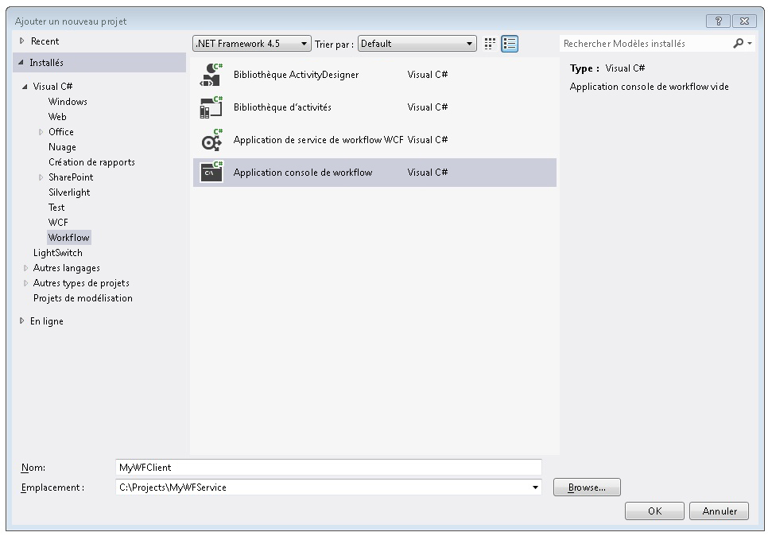
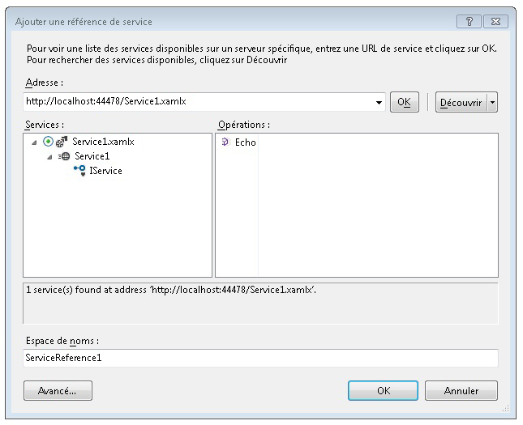
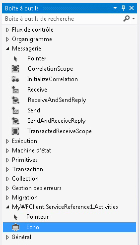
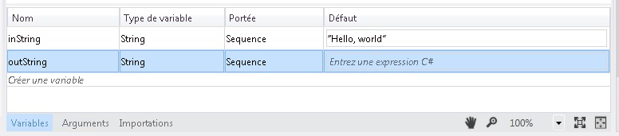
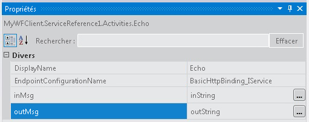
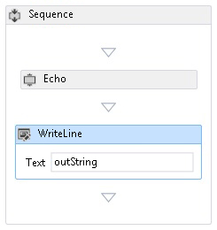
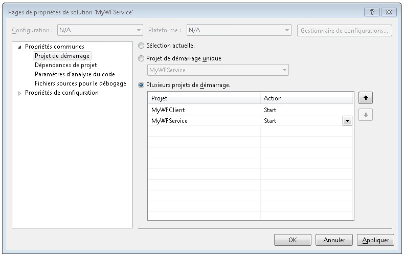

# Procédure : accéder à un service à partir d'une application de workflow
Cette rubrique décrit comment appeler un service de workflow à partir d'une application console de workflow. Il dépend de l’achèvement de la [Comment : créer un Service de flux de travail avec les activités de messagerie](../../../../docs/framework/wcf/feature-details/how-to-create-a-workflow-service-with-messaging-activities.md) rubrique. Cette rubrique décrit comment appeler un service de workflow à partir d'une application de workflow, mais les mêmes méthodes peuvent être utilisées pour appeler n'importe quel service [!INCLUDE[indigo1](../../../../includes/indigo1-md.md)] à partir d'une application de workflow.  
  
### Créer un projet d'application console de workflow.  
  
1.  Démarrez [!INCLUDE[vs_current_long](../../../../includes/vs-current-long-md.md)].  
  
2.  Charger le projet MyWFService que vous avez créé dans le [Comment : créer un Service de flux de travail avec les activités de messagerie](../../../../docs/framework/wcf/feature-details/how-to-create-a-workflow-service-with-messaging-activities.md) rubrique.  
  
3.  Bouton droit sur le **MyWFService** solution dans le **l’Explorateur de solutions** et sélectionnez **ajouter**, **nouveau projet**. Sélectionnez **Workflow** dans les **modèles installés** et **Application Console de Workflow** dans la liste des types de projets. Nommez le projet MyWFClient et utilisez l'emplacement par défaut, comme indiqué dans l'illustration suivante.  
  
       
  
     Cliquez sur le **OK** bouton pour fermer la **nouveau projet de boîte de dialogue Ajouter**.  
  
4.  Après avoir créé le projet, le fichier Workflow1.xaml s'ouvre dans le concepteur. Cliquez sur le **boîte à outils** tab pour ouvrir la boîte à outils, si elle n’est pas déjà ouvert puis cliquez sur la punaise pour garder la fenêtre Boîte à outils ouverte.  
  
5.  Appuyez sur CTRL + F5 pour générer et lancer le service. Comme auparavant, le Serveur de développement ASP.NET se lance et Internet Explorer affiche la page d'aide WCF. Notez l'URI de cette page, car vous devez l'utiliser dans l'étape suivante.  
  
       
  
6.  Bouton droit sur le **MyWFClient** de projet dans le **l’Explorateur de solutions** et sélectionnez **ajouter une référence de Service**. Cliquez sur le **Discover** bouton pour rechercher la solution actuelle pour tous les services. Cliquez sur le triangle à côté de Service1.xamlx dans la liste des services. Cliquez sur le triangle à côté de Service1 pour répertorier les contrats implémentés par le service Service1. Développez le **Service1** nœud dans le **Services** liste. L’opération Echo est affichée dans le **Operations** liste comme indiqué dans l’illustration suivante.  
  
       
  
     Conservez l’espace de noms par défaut et cliquez sur **OK** pour faire disparaître la **ajouter une référence de Service** boîte de dialogue. La boîte de dialogue suivante s'affiche.  
  
       
  
     Cliquez sur **OK** pour fermer la boîte de dialogue. Appuyez ensuite sur Ctrl+Maj+B pour générer la solution. Notez dans la boîte à outils a été ajoutée une nouvelle section appelée **MyWFClient.ServiceReference1.Activities**. Développez cette section ; l’activité Echo a été ajoutée comme indiqué dans l’illustration suivante.  
  
       
  
7.  Faites glisser et déposez un <!--zz <xref:System.ServiceModel.Activities.Sequence>--> `System.ServiceModel.Activities.Sequence` activité sur l’aire du concepteur. Il se trouve sous le **flux de contrôle** section de la boîte à outils.  
  
8.  Avec la <!--zz <xref:System.ServiceModel.Activities.Sequence>--> `System.ServiceModel.Activities.Sequence` activité dans le focus, cliquez sur le **Variables** lier et ajoutez une variable chaîne nommée `inString`. Affectez la valeur par défaut à la variable `"Hello, world"` , ainsi que d’une variable chaîne nommée `outString` comme indiqué dans le diagramme suivant.  
  
       
  
9. Faites glisser et déposez une **Echo** l’activité dans le <!--zz <xref:System.ServiceModel.Activities.Sequence>--> `System.ServiceModel.Activities.Sequence`. Dans la fenêtre Propriétés lier le `inMsg` l’argument de la `inString` variable et la `outMsg` l’argument de la `outString` variable comme indiqué dans l’illustration suivante. Cela transmet la valeur de la variable `inString` à l'opération, puis prend la valeur de retour et la place dans la variable `outString`.  
  
       
  
10. Faites glisser et déposez un **WriteLine** activité ci-dessous le **Echo** activité pour afficher la chaîne retournée par l’appel de service. Le **WriteLine** activité se trouve dans le **Primitives** nœud dans la boîte à outils. Lier le **texte** argument de la **WriteLine** activité à la `outString` variable en tapant `outString` dans la zone de texte sur le **WriteLine** activité. Le workflow doit maintenant ressembler à l'illustration suivante.  
  
       
  
11. Avec le bouton droit de la solution MyWFService et sélectionnez **définir les projets de démarrage...** . Sélectionnez le **plusieurs projets de démarrage** case d’option et sélectionnez **Démarrer** pour chaque projet dans le **Action** colonne comme indiqué dans l’illustration suivante.  
  
       
  
12. Appuyez sur Ctrl + F5 pour lancer à la fois le service et le client. Le serveur de développement ASP.NET héberge le service, Internet Explorer affiche la page d’aide WCF et l’application de flux de travail cliente est lancée dans une fenêtre de console et affiche la chaîne retournée par le service (« Hello, world »).  
  
## Voir aussi  
 [Services de workflow](../../../../docs/framework/wcf/feature-details/workflow-services.md)  
 [Comment : créer un Service de Workflow avec les activités de messagerie](../../../../docs/framework/wcf/feature-details/how-to-create-a-workflow-service-with-messaging-activities.md)  
 [Utilisation d’un Service WCF à partir d’un flux de travail dans un projet Web](http://go.microsoft.com/fwlink/?LinkId=207725)
