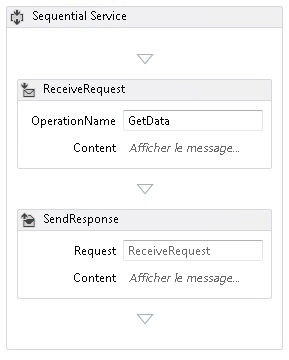
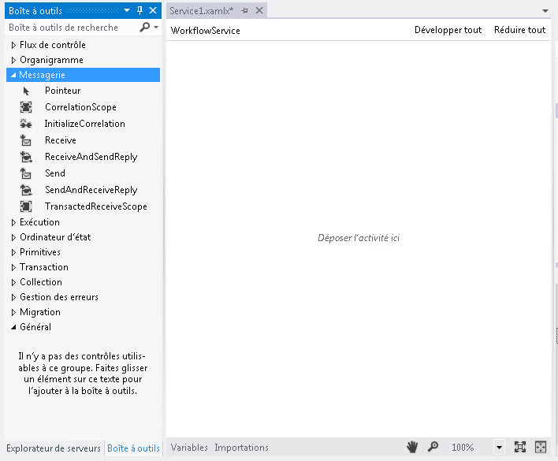
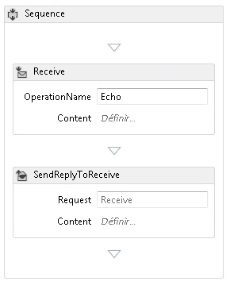
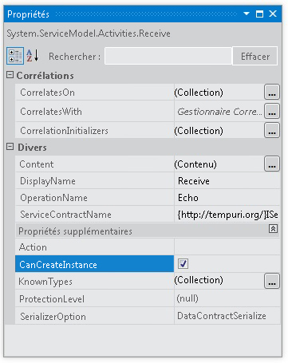
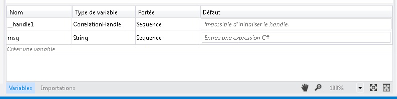
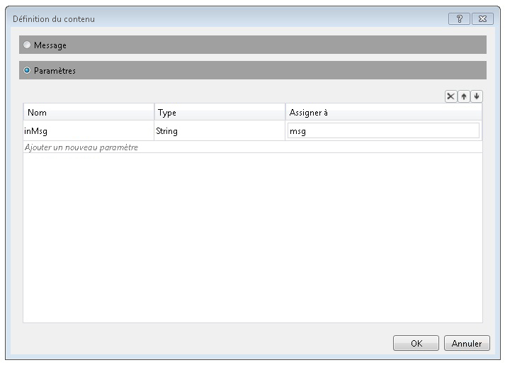
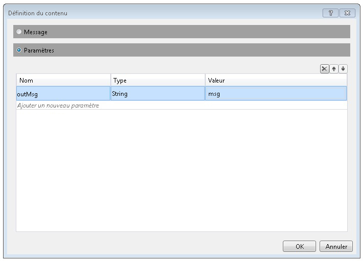
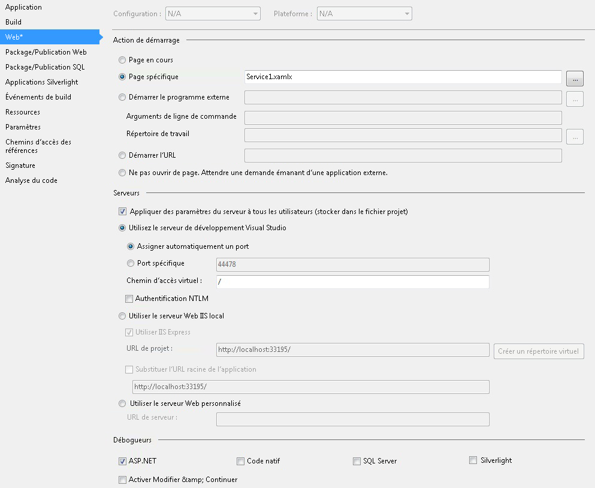

# Proc&#233;dure&#160;: cr&#233;er un service de workflow avec les activit&#233;s de messagerie
Cette rubrique décrit comment créer un service de workflow simple, à l'aide d'activités de messagerie.  Elle est consacrée à la mécanique de création d'un service de workflow, simplement constitué d'activités de messagerie.  Dans un service réel, le workflow contient de nombreuses autres activités.  Le service implémente une opération nommée Echo, qui prend une chaîne et la retourne à l'appelant.  Cette rubrique est la première d'une série de deux.  La rubrique suivante, [Procédure : accéder à un service à partir d'une application de workflow](../../../../docs/framework/wcf/feature-details/how-to-access-a-service-from-a-workflow-application.md), explique comment créer une application de workflow capable d'appeler le service créé dans cette rubrique.  
  
### Pour créer un projet de service de workflow  
  
1.  Démarrez [!INCLUDE[vs_current_long](../../../../includes/vs-current-long-md.md)].  
  
2.  Cliquez sur le menu **Fichier**, sélectionnez **Nouveau**, puis **Projet** pour afficher la **boîte de dialogue Nouveau projet**.  Sélectionnez **Workflow** dans la liste des modèles installés et **Application de service de workflow WCF** dans la liste des types de projet.  Nommez le projet `MyWFService` et utilisez l'emplacement par défaut, comme indiqué dans l'illustration suivante.  
  
     Cliquez sur le bouton **OK** pour fermer la **boîte de dialogue Nouveau projet**.  
  
3.  Lorsque le projet est créé, le fichier Service1.xamlx s'ouvre dans le concepteur, comme indiqué dans l'illustration suivante.  
  
       
  
     Cliquez avec le bouton droit sur l'activité intitulée **Service séquentiel** et sélectionnez **Supprimer**.  
  
### Pour implémenter le service de workflow  
  
1.  Sélectionnez l'onglet **Boîte à outils** dans la partie gauche de l'écran pour afficher la boîte à outils et cliquez sur la punaise pour garder la fenêtre ouverte.  Développez la section **Messagerie** de la boîte à outils pour afficher les activités de messagerie et les modèles d'activité de messagerie, comme indiqué dans l'illustration suivante.  
  
       
  
2.  Glissez\-déplacez un modèle **ReceiveAndSendReply** sur le Workflow Designer.  Cela crée une activité <xref:System.ServiceModel.Activities.Sequence>, avec une activité **Receive** suivie d'une activité <xref:System.ServiceModel.Activities.SendReply>, comme indiqué dans l'illustration suivante.  
  
       
  
     Remarque : l'activité <xref:System.ServiceModel.Activities.SendReply> possède une propriété <xref:System.ServiceModel.Activities.SendReply.Request%2A> qui est définie sur `Receive`, le nom de l'activité <xref:System.ServiceModel.Activities.Receive> à laquelle répond l'activité <xref:System.ServiceModel.Activities.SendReply>.  
  
3.  Dans l'activité <xref:System.ServiceModel.Activities.Receive>, tapez `Echo` dans la zone de texte intitulée **OperationName**.  Cela définit le nom de l'opération que le service implémente.  
  
       
  
4.  Avec l'activité <xref:System.ServiceModel.Activities.Receive> sélectionnée, ouvrez la fenêtre des propriétés, si elle n'est pas déjà ouverte, en cliquant sur le menu **Affichage** et en sélectionnant **Fenêtre Propriétés**.  Faites défiler la **Fenêtre Propriétés** vers le bas pour trouver **CanCreateInstance**, puis activez la case à cocher, comme indiqué dans l'illustration suivante.  Ce paramètre active l'hôte de service de workflow pour créer une nouvelle instance du service \(si requis\) lorsqu'un message est reçu.  
  
       
  
5.  Sélectionnez l'activité <xref:System.ServiceModel.Activities.Sequence> et cliquez sur le bouton **Variables** dans l'angle inférieur gauche du concepteur.  Cela affiche l'éditeur de variables.  Cliquez sur le lien **Créer une variable** pour ajouter une variable pour stocker la chaîne envoyée à l'opération.  Nommez la variable `msg` et définissez son type de **Variable** à la valeur Chaîne, comme indiqué dans l'illustration suivante.  
  
       
  
     Cliquez encore sur le bouton **Variables** pour fermer l'éditeur de variables.  
  
6.  Cliquez sur le lien **Définir** dans la zone de texte **Contenu** de l'activité <xref:System.ServiceModel.Activities.Receive> pour afficher la boîte de dialogue **Définition du contenu**.  Activez la case d'option **Paramètres**, cliquez sur le lien **Ajouter un nouveau paramètre**, tapez `inMsg` dans la zone de texte **nom**, sélectionnez **Chaîne** dans la zone de liste déroulante **Type**, et tapez `msg` dans la zone de texte **Affecter à**, comme le montre l'illustration suivante.  
  
       
  
     Cela spécifie que l'activité Receive reçoit le paramètre de chaîne et que les données sont liées à la variable `msg`.  Cliquez sur **OK** pour fermer la boîte de dialogue **Définition du contenu**.  
  
7.  Cliquez sur le lien **Définir** dans la zone **Contenu** de l'activité <xref:System.ServiceModel.Activities.SendReply> pour afficher la boîte de dialogue **Définition du contenu**.  Activez la case d'option **Paramètres**, cliquez sur le lien **Ajouter un nouveau paramètre**, tapez `msg` dans la zone de texte **nom**, sélectionnez **Chaîne** dans la zone de liste déroulante **Type**, et `msg` dans la zone de texte **Valeur**, comme le montre l'illustration suivante.  
  
       
  
     Cela spécifie que l'activité <xref:System.ServiceModel.Activities.SendReply> envoie un message ou un type de contrat de message et que les données sont liées à la variable `msg`.  Comme il s'agit d'une activité <xref:System.ServiceModel.Activities.SendReply>, cela signifie que les données dans `msg` sont utilisées pour remplir le message que l'activité renvoie au client.  Cliquez sur **OK** pour fermer la boîte de dialogue **Définition du contenu**.  
  
8.  Enregistrez et générez la solution en cliquant sur le menu **Générer**, puis en sélectionnant **Générer la solution**.  
  
## Configurer le projet du service de workflow  
 Le service de workflow est terminé.  Cette section explique comment configurer la solution de service de workflow pour en faciliter l'hébergement et l'exécution.  Cette solution utilise le serveur de développement ASP.NET pour héberger le service.  
  
#### Pour définir les options de démarrage du projet  
  
1.  Dans l'**Explorateur de solutions**, cliquez avec le bouton droit sur **MyWFService** et sélectionnez **Propriétés** pour afficher la boîte de dialogue **Propriétés du projet**.  
  
2.  Sélectionnez l'onglet **Web** et sélectionnez **Page spécifique** sous **Action de démarrage**, puis tapez `Service1.xamlx` dans la zone de texte, comme indiqué dans l'illustration suivante.  
  
       
  
     Cela héberge le service défini dans Service1.xamlx dans le serveur de développement ASP.NET.  
  
3.  Appuyez sur Ctrl \+ F5 pour lancer le service.  L'icône du serveur de développement ASP.NET s'affiche dans la partie inférieure droite du Bureau, comme le montre l'image suivante.  
  
       
  
     De plus, Internet Explorer affiche la page d'aide du service WCF pour le service.  
  
       
  
4.  Passez maintenant à la rubrique [Procédure : accéder à un service à partir d'une application de workflow](../../../../docs/framework/wcf/feature-details/how-to-access-a-service-from-a-workflow-application.md) pour créer un client de workflow qui appelle ce service.  
  
## Voir aussi  
 [Services de workflow](../../../../docs/framework/wcf/feature-details/workflow-services.md)   
 [Vue d'ensemble de l'hébergement de services de workflow](../../../../docs/framework/wcf/feature-details/hosting-workflow-services-overview.md)   
 [Activités de messagerie](../../../../docs/framework/wcf/feature-details/messaging-activities.md)