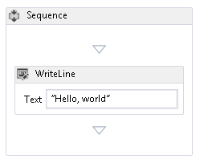
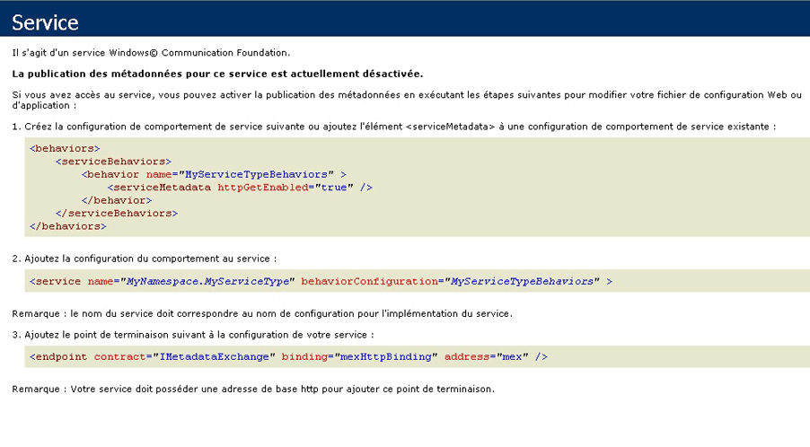

# <a name="how-to-host-a-non-service-workflow-in-iis"></a><span data-ttu-id="4e7a5-102">Procédure : héberger un workflow sans service dans IIS</span><span class="sxs-lookup"><span data-stu-id="4e7a5-102">How to: Host a non-service workflow in IIS</span></span>
<span data-ttu-id="4e7a5-103">Les workflows qui ne sont pas des services de workflow peuvent être hébergés sous IIS/WAS.</span><span class="sxs-lookup"><span data-stu-id="4e7a5-103">Workflows that are not workflow services can be hosted under IIS/WAS.</span></span> <span data-ttu-id="4e7a5-104">Cela peut s'avérer utile lorsque vous avez besoin d'héberger un workflow écrit par une autre personne.</span><span class="sxs-lookup"><span data-stu-id="4e7a5-104">This is useful when you need to host a workflow written by somebody else.</span></span> <span data-ttu-id="4e7a5-105">Cela peut être le cas si vous hébergez à nouveau le concepteur de workflow et permettez aux utilisateurs de créer leurs propres workflows.</span><span class="sxs-lookup"><span data-stu-id="4e7a5-105">For example, if you rehost the workflow designer and allow users to create their own workflows.</span></span>  <span data-ttu-id="4e7a5-106">L'hébergement dans IIS de workflows sans service permet la prise en charge de fonctionnalités telles que le recyclage de processus, l'arrêt en cas d'inactivité, le contrôle d'état de processus et l'activation basée sur message.</span><span class="sxs-lookup"><span data-stu-id="4e7a5-106">Hosting non-service workflows in IIS provides support for features like process recycling, idle shutdown, process health monitoring, and message-based activation.</span></span> <span data-ttu-id="4e7a5-107">Les services de workflow hébergés dans IIS contiennent des activités <xref:System.ServiceModel.Activities.Receive> et sont activés lorsque IIS reçoit un message.</span><span class="sxs-lookup"><span data-stu-id="4e7a5-107">Workflow services hosted in IIS contain <xref:System.ServiceModel.Activities.Receive> activities and are activated when a message is received by IIS.</span></span> <span data-ttu-id="4e7a5-108">Les workflows sans service ne contiennent pas d'activités de messagerie et, par défaut, ne peuvent pas être activés par l'envoi d'un message.</span><span class="sxs-lookup"><span data-stu-id="4e7a5-108">Non-service workflows do not contain messaging activities, and by default cannot be activated by sending a message.</span></span>  <span data-ttu-id="4e7a5-109">Pour créer une instance du workflow, vous devez dériver une classe de <xref:System.ServiceModel.Activities.WorkflowHostingEndpoint> et définir un contrat de service contenant des opérations.</span><span class="sxs-lookup"><span data-stu-id="4e7a5-109">You must derive a class from <xref:System.ServiceModel.Activities.WorkflowHostingEndpoint> and define a service contract that contains operations to create an instance of the workflow.</span></span> <span data-ttu-id="4e7a5-110">Cette rubrique vous guide dans la création d’un workflow simple, la définition d’un contrat de service un client peut utiliser pour activer le flux de travail et la dériver une classe de <xref:System.ServiceModel.Activities.WorkflowHostingEndpoint> qui utilise le contrat de service pour écouter les demandes de création de workflow.</span><span class="sxs-lookup"><span data-stu-id="4e7a5-110">This topic will walk you through creating a simple workflow, defining a service contract a client can use to activate the workflow, and deriving a class from <xref:System.ServiceModel.Activities.WorkflowHostingEndpoint> which uses the service contract to listen for workflow creating requests.</span></span>  
  
### <a name="create-a-simple-workflow"></a><span data-ttu-id="4e7a5-111">Créer un workflow simple</span><span class="sxs-lookup"><span data-stu-id="4e7a5-111">Create a simple workflow</span></span>  
  
1.  <span data-ttu-id="4e7a5-112">Créez une solution [!INCLUDE[vs_current_long](../../../../includes/vs-current-long-md.md)] vide appelée `CreationEndpointTest`.</span><span class="sxs-lookup"><span data-stu-id="4e7a5-112">Create a new [!INCLUDE[vs_current_long](../../../../includes/vs-current-long-md.md)] empty solution called `CreationEndpointTest`.</span></span>  
  
2.  <span data-ttu-id="4e7a5-113">Ajoutez à la solution un nouveau projet d'application de service de workflow WCF appelée `SimpleWorkflow`.</span><span class="sxs-lookup"><span data-stu-id="4e7a5-113">Add a new WCF Workflow Service Application project called `SimpleWorkflow` to the solution.</span></span> <span data-ttu-id="4e7a5-114">Le concepteur de workflow s'ouvre.</span><span class="sxs-lookup"><span data-stu-id="4e7a5-114">The workflow designer will open.</span></span>  
  
3.  <span data-ttu-id="4e7a5-115">Supprimez les activités ReceiveRequest et SendResponse.</span><span class="sxs-lookup"><span data-stu-id="4e7a5-115">Delete the ReceiveRequest and SendResponse activities.</span></span> <span data-ttu-id="4e7a5-116">Ces activités font d'un workflow un service de workflow.</span><span class="sxs-lookup"><span data-stu-id="4e7a5-116">These activities are what makes a workflow a workflow service.</span></span> <span data-ttu-id="4e7a5-117">Elles ne nous sont plus utiles dans la mesure où nous ne travaillons pas avec un service de workflow.</span><span class="sxs-lookup"><span data-stu-id="4e7a5-117">Since we are not working with a workflow service, we no longer need them.</span></span>  
  
4.  <span data-ttu-id="4e7a5-118">Affectez au DisplayName de l’activité de séquence à « Workflow séquentiel ».</span><span class="sxs-lookup"><span data-stu-id="4e7a5-118">Set the DisplayName for the sequence activity to "Sequential Workflow".</span></span>  
  
5.  <span data-ttu-id="4e7a5-119">Renommez Service1.xamlx en Workflow1.xamlx.</span><span class="sxs-lookup"><span data-stu-id="4e7a5-119">Rename Service1.xamlx to Workflow1.xamlx.</span></span>  
  
6.  <span data-ttu-id="4e7a5-120">Cliquez sur le concepteur en dehors de l’activité de séquence et définissez les propriétés Name et ConfigurationName valeur « Workflow1 »</span><span class="sxs-lookup"><span data-stu-id="4e7a5-120">Click the designer outside of the sequence activity, and set the Name and ConfigurationName properties to "Workflow1"</span></span>  
  
7.  <span data-ttu-id="4e7a5-121">Faites glisser une activité <xref:System.Activities.Statements.WriteLine> dans <xref:System.Activities.Statements.Sequence>.</span><span class="sxs-lookup"><span data-stu-id="4e7a5-121">Drag a <xref:System.Activities.Statements.WriteLine> activity into the <xref:System.Activities.Statements.Sequence>.</span></span> <span data-ttu-id="4e7a5-122">Le <xref:System.Activities.Statements.WriteLine> activité se trouvent dans le **Primitives** section de la boîte à outils.</span><span class="sxs-lookup"><span data-stu-id="4e7a5-122">The <xref:System.Activities.Statements.WriteLine> activity can be found in the **Primitives** section of the toolbox.</span></span> <span data-ttu-id="4e7a5-123">Définir le <xref:System.Activities.Statements.WriteLine.Text%2A> propriété de la <xref:System.Activities.Statements.WriteLine> activité à « Hello, world ».</span><span class="sxs-lookup"><span data-stu-id="4e7a5-123">Set the <xref:System.Activities.Statements.WriteLine.Text%2A> property of the <xref:System.Activities.Statements.WriteLine> activity to "Hello, world".</span></span>  
  
     <span data-ttu-id="4e7a5-124">Le workflow doit maintenant ressembler au diagramme suivant.</span><span class="sxs-lookup"><span data-stu-id="4e7a5-124">The workflow should now look like the following diagram.</span></span>  
  
     <span data-ttu-id="4e7a5-125"></span><span class="sxs-lookup"><span data-stu-id="4e7a5-125"></span></span>  
  
### <a name="create-the-workflow-creation-service-contract"></a><span data-ttu-id="4e7a5-126">Créer le contrat de service de création de workflow</span><span class="sxs-lookup"><span data-stu-id="4e7a5-126">Create the workflow creation service contract</span></span>  
  
1.  <span data-ttu-id="4e7a5-127">Ajoutez à la solution `Shared` un nouveau projet de bibliothèque de classes appelé `CreationEndpointTest`.</span><span class="sxs-lookup"><span data-stu-id="4e7a5-127">Add a new class library project called `Shared` to the `CreationEndpointTest` solution.</span></span>  
  
2.  <span data-ttu-id="4e7a5-128">Ajoutez au projet `Shared` une référence à System.ServiceModel.dll, System.Configuration et System.ServiceModel.Activities.</span><span class="sxs-lookup"><span data-stu-id="4e7a5-128">Add a reference to System.ServiceModel.dll, System.Configuration, and System.ServiceModel.Activities to the `Shared` project.</span></span>  
  
3.  <span data-ttu-id="4e7a5-129">Renommez le fichier Class1.cs en IWorkflowCreation.cs et ajoutez le code suivant au fichier.</span><span class="sxs-lookup"><span data-stu-id="4e7a5-129">Rename the Class1.cs file to IWorkflowCreation.cs and the following code to the file.</span></span>  
  
    ```  
    using System;  
    using System.Collections.Generic;  
    using System.Linq;  
    using System.Text;  
    using System.ServiceModel;  
  
    namespace Shared  
    {  
        //service contract exposed from the endpoint  
        [ServiceContract(Name = "IWorkflowCreation")]  
        public interface IWorkflowCreation  
        {  
            [OperationContract(Name = "Create")]  
            Guid Create(IDictionary<string, object> inputs);  
  
            [OperationContract(Name = "CreateWithInstanceId", IsOneWay = true)]  
            void CreateWithInstanceId(IDictionary<string, object> inputs, Guid instanceId);  
        }  
    }  
    ```  
  
     <span data-ttu-id="4e7a5-130">Ce contrat définit deux opérations qui créent toutes deux une instance du workflow sans service que vous venez de créer.</span><span class="sxs-lookup"><span data-stu-id="4e7a5-130">This contract defines two operations both create a new instance of the non-service workflow you just created.</span></span> <span data-ttu-id="4e7a5-131">L'une crée une instance avec un ID d'instance généré, l'autre vous permet de spécifier l'ID d'instance de la nouvelle instance de workflow.</span><span class="sxs-lookup"><span data-stu-id="4e7a5-131">One creates a new instance with a generated instance ID and the other allows you to specify the instance ID for the new workflow instance.</span></span>  <span data-ttu-id="4e7a5-132">Ces deux méthodes vous permettent de passer des paramètres à la nouvelle instance de workflow.</span><span class="sxs-lookup"><span data-stu-id="4e7a5-132">Both methods allow you to pass in parameters to the new workflow instance.</span></span> <span data-ttu-id="4e7a5-133">Ce contrat sera exposé par le <xref:System.ServiceModel.Activities.WorkflowHostingEndpoint> pour permettre aux clients de créer des instances d’un workflow sans service.</span><span class="sxs-lookup"><span data-stu-id="4e7a5-133">This contract will be exposed by the <xref:System.ServiceModel.Activities.WorkflowHostingEndpoint> to allow clients to create new instances of a non-service workflow.</span></span>  
  
### <a name="derive-a-class-from-workflowhostingendpoint"></a><span data-ttu-id="4e7a5-134">Dériver une classe de WorkflowHostingEndpoint</span><span class="sxs-lookup"><span data-stu-id="4e7a5-134">Derive a class from WorkflowHostingEndpoint</span></span>  
  
1.  <span data-ttu-id="4e7a5-135">Ajouter une nouvelle classe nommée `CreationEndpoint` dérivé <xref:System.ServiceModel.Activities.WorkflowHostingEndpoint> à la `Shared` projet.</span><span class="sxs-lookup"><span data-stu-id="4e7a5-135">Add a new class called `CreationEndpoint` derived from <xref:System.ServiceModel.Activities.WorkflowHostingEndpoint> to the `Shared` project.</span></span>  
  
    ```  
    using System;  
    using System.Collections.Generic;  
    using System.Diagnostics;  
    using System.Globalization;  
    using System.ServiceModel;  
    using System.ServiceModel.Activities;  
    using System.ServiceModel.Channels;  
  
    namespace Shared  
    {  
        public class CreationEndpoint : WorkflowHostingEndpoint  
        {  
        }  
    }  
    ```  
  
2.  <span data-ttu-id="4e7a5-136">Ajoutez à la classe <xref:System.Uri> une variable `defaultBaseUri` statique locale appelée `CreationEndpoint`.</span><span class="sxs-lookup"><span data-stu-id="4e7a5-136">Add a local static <xref:System.Uri> variable called `defaultBaseUri` to the `CreationEndpoint` class.</span></span>  
  
    ```  
    public class CreationEndpoint : WorkflowHostingEndpoint  
    {  
        static Uri defaultBaseUri;  
    }  
    ```  
  
3.  <span data-ttu-id="4e7a5-137">Ajoutez le constructeur suivant à la classe `CreationEndpoint`.</span><span class="sxs-lookup"><span data-stu-id="4e7a5-137">Add the following constructor to the `CreationEndpoint` class.</span></span> <span data-ttu-id="4e7a5-138">Notez que nous spécifions le contrat de service `IWorkflowCreation` dans l'appel au constructeur de base.</span><span class="sxs-lookup"><span data-stu-id="4e7a5-138">Notice we specify the `IWorkflowCreation` service contract in the call to the base constructor.</span></span>  
  
    ```  
    public CreationEndpoint(Binding binding, EndpointAddress address)  
       : base(typeof(IWorkflowCreation), binding, address)  
       {  
       }  
    ```  
  
4.  <span data-ttu-id="4e7a5-139">Ajoutez le constructeur par défaut suivant à la classe `CreationEndpoint`.</span><span class="sxs-lookup"><span data-stu-id="4e7a5-139">Add the following default constructor to the `CreationEndpoint` class.</span></span>  
  
    ```  
    public CreationEndpoint()  
       : this(GetDefaultBinding(),  
       new EndpointAddress(new Uri(DefaultBaseUri, new Uri(Guid.NewGuid().ToString(), UriKind.Relative))))  
       {  
       }  
    ```  
  
5.  <span data-ttu-id="4e7a5-140">Ajoutez une propriété `DefaultBaseUri` statique à la classe `CreationEndpoint`.</span><span class="sxs-lookup"><span data-stu-id="4e7a5-140">Add a static `DefaultBaseUri` property to the `CreationEndpoint` class.</span></span> <span data-ttu-id="4e7a5-141">Cette propriété permet de stocker un URI de base par défaut au cas où il n'en serait pas fourni.</span><span class="sxs-lookup"><span data-stu-id="4e7a5-141">This property will be used to hold a default base URI if one is not provided.</span></span>  
  
    ```  
    static Uri DefaultBaseUri  
    {  
       get  
       {  
          if (defaultBaseUri == null)  
          {  
             defaultBaseUri = new Uri(string.Format(CultureInfo.InvariantCulture, "net.pipe://localhost/workflowCreationEndpoint/{0}/{1}",  
                Process.GetCurrentProcess().Id,  
                AppDomain.CurrentDomain.Id));  
          }  
          return defaultBaseUri;  
       }  
     }  
    ```  
  
6.  <span data-ttu-id="4e7a5-142">Créez la méthode suivante afin d'obtenir la liaison par défaut à utiliser pour le point de terminaison de création.</span><span class="sxs-lookup"><span data-stu-id="4e7a5-142">Create the following method to get the default binding to use for the creation endpoint.</span></span>  
  
    ```  
    //defaults to NetNamedPipeBinding  
    public static Binding GetDefaultBinding()  
    {  
       return new NetNamedPipeBinding(NetNamedPipeSecurityMode.None) { TransactionFlow = true };  
    }  
    ```  
  
7.  <span data-ttu-id="4e7a5-143">Substituez la méthode <xref:System.ServiceModel.Activities.WorkflowHostingEndpoint.OnGetInstanceId%2A> pour retourner l'ID de l'instance de workflow.</span><span class="sxs-lookup"><span data-stu-id="4e7a5-143">Override the <xref:System.ServiceModel.Activities.WorkflowHostingEndpoint.OnGetInstanceId%2A> method to return the workflow instance ID.</span></span> <span data-ttu-id="4e7a5-144">Si le `Action` se termine d’en-tête par « Créer » renvoie un GUID vide, si le `Action` en-tête se termine par « createwithinstanceid », retournez le GUID passé à la méthode.</span><span class="sxs-lookup"><span data-stu-id="4e7a5-144">If the `Action` header ends with "Create" return an empty GUID, if the `Action` header ends with "CreateWithInstanceId" return the GUID passed into the method.</span></span> <span data-ttu-id="4e7a5-145">Sinon, levez une exception <xref:System.InvalidOperationException>.</span><span class="sxs-lookup"><span data-stu-id="4e7a5-145">Otherwise, throw an <xref:System.InvalidOperationException>.</span></span> <span data-ttu-id="4e7a5-146">Ces en-têtes `Action` correspondent aux deux opérations définies dans le contrat de service `IWorkflowCreation`.</span><span class="sxs-lookup"><span data-stu-id="4e7a5-146">These `Action` headers correspond to the two operations defined in the `IWorkflowCreation` service contract.</span></span>  
  
    ```  
    protected override Guid OnGetInstanceId(object[] inputs, OperationContext operationContext)  
    {  
       //Create was called by client  
       if (operationContext.IncomingMessageHeaders.Action.EndsWith("Create"))  
       {  
          return Guid.Empty;  
       }  
       //CreateWithInstanceId was called by client  
       else if (operationContext.IncomingMessageHeaders.Action.EndsWith("CreateWithInstanceId"))  
       {  
          return (Guid)inputs[1];  
       }  
       else  
       {  
          throw new InvalidOperationException("Invalid Action: " + operationContext.IncomingMessageHeaders.Action);  
       }  
    }  
    ```  
  
8.  <span data-ttu-id="4e7a5-147">Substituez la méthode <xref:System.ServiceModel.Activities.WorkflowHostingEndpoint.OnGetCreationContext%2A> pour créer un <xref:System.ServiceModel.Activities.WorkflowCreationContext> et ajoutez les arguments pour le workflow, envoyez l'ID de l'instance au client, puis retournez le <xref:System.ServiceModel.Activities.WorkflowCreationContext>.</span><span class="sxs-lookup"><span data-stu-id="4e7a5-147">Override the <xref:System.ServiceModel.Activities.WorkflowHostingEndpoint.OnGetCreationContext%2A> method to create a <xref:System.ServiceModel.Activities.WorkflowCreationContext> and add any arguments for the workflow, send the instance ID to the client, and then return the <xref:System.ServiceModel.Activities.WorkflowCreationContext>.</span></span>  
  
    ```  
    protected override WorkflowCreationContext OnGetCreationContext(object[] inputs, OperationContext operationContext, Guid instanceId, WorkflowHostingResponseContext responseContext)  
    {  
       WorkflowCreationContext creationContext = new WorkflowCreationContext();  
       if (operationContext.IncomingMessageHeaders.Action.EndsWith("Create") || (operationContext.IncomingMessageHeaders.Action.EndsWith("CreateWithInstanceId")))  
       {  
          Dictionary<string, object> arguments = (Dictionary<string, object>)inputs[0];  
          if (arguments != null && arguments.Count > 0)  
          {  
             foreach (KeyValuePair<string, object> pair in arguments)  
             {  
                //arguments to pass to the workflow  
                creationContext.WorkflowArguments.Add(pair.Key, pair.Value);  
             }  
          }  
          //reply to client with instanceId  
          responseContext.SendResponse(instanceId, null);  
       }  
       else  
       {  
          throw new InvalidOperationException("Invalid Action: " + operationContext.IncomingMessageHeaders.Action);  
       }  
       return creationContext;  
    }  
    ```  
  
### <a name="create-a-standard-endpoint-element-to-allow-you-to-configure-the-workflowcreationendpoint"></a><span data-ttu-id="4e7a5-148">Créer un élément de point de terminaison standard vous permettant de configurer WorkflowCreationEndpoint</span><span class="sxs-lookup"><span data-stu-id="4e7a5-148">Create a standard endpoint element to allow you to configure the WorkflowCreationEndpoint</span></span>  
  
1.  <span data-ttu-id="4e7a5-149">Ajoutez au projet `CreationEndpoint` une référence à Shared.</span><span class="sxs-lookup"><span data-stu-id="4e7a5-149">Add a reference to Shared in the `CreationEndpoint` project</span></span>  
  
2.  <span data-ttu-id="4e7a5-150">Ajoutez au projet `CreationEndpointElement` une nouvelle classe nommée <xref:System.ServiceModel.Configuration.StandardEndpointElement>, dérivée de `CreationEndpoint`.</span><span class="sxs-lookup"><span data-stu-id="4e7a5-150">Add a new class called `CreationEndpointElement`, derived from <xref:System.ServiceModel.Configuration.StandardEndpointElement> to the `CreationEndpoint` project.</span></span> <span data-ttu-id="4e7a5-151">Cette classe représente l'élément `CreationEndpoint` d'un fichier web.config.</span><span class="sxs-lookup"><span data-stu-id="4e7a5-151">This class will represent a `CreationEndpoint` in a web.config file.</span></span>  
  
    ```  
    using System;  
    using System.Configuration;  
    using System.ServiceModel.Activities;  
    using System.ServiceModel.Configuration;  
    using System.ServiceModel.Description;  
    using Shared;  
  
    namespace CreationEndpointTest  
    {  
        //config element for CreationEndpoint  
        public class CreationEndpointElement : StandardEndpointElement  
        {  
       }  
    ```  
  
3.  <span data-ttu-id="4e7a5-152">Ajoutez une propriété appelée `EndpointType` pour retourner le type du point de terminaison.</span><span class="sxs-lookup"><span data-stu-id="4e7a5-152">Add a property called `EndpointType` to return the type of the endpoint.</span></span>  
  
    ```  
    protected override Type EndpointType  
    {  
       get { return typeof(CreationEndpoint); }  
    }  
    ```  
  
4.  <span data-ttu-id="4e7a5-153">Substituez la méthode <xref:System.ServiceModel.Configuration.StandardEndpointElement.CreateServiceEndpoint%2A> et retournez un nouveau `CreationEndpoint`.</span><span class="sxs-lookup"><span data-stu-id="4e7a5-153">Override the <xref:System.ServiceModel.Configuration.StandardEndpointElement.CreateServiceEndpoint%2A> method and return a new `CreationEndpoint`.</span></span>  
  
    ```  
    protected override ServiceEndpoint CreateServiceEndpoint(ContractDescription contractDescription)  
    {  
       return new CreationEndpoint();  
    }  
    ```  
  
5.  <span data-ttu-id="4e7a5-154">Surchargez les méthodes <xref:System.ServiceModel.Configuration.StandardEndpointElement.OnApplyConfiguration%2A>, <xref:System.ServiceModel.Configuration.StandardEndpointElement.OnApplyConfiguration%2A>, <xref:System.ServiceModel.Configuration.StandardEndpointElement.OnInitializeAndValidate%2A> et <xref:System.ServiceModel.Configuration.StandardEndpointElement.OnInitializeAndValidate%2A>.</span><span class="sxs-lookup"><span data-stu-id="4e7a5-154">Overload the <xref:System.ServiceModel.Configuration.StandardEndpointElement.OnApplyConfiguration%2A>, <xref:System.ServiceModel.Configuration.StandardEndpointElement.OnApplyConfiguration%2A>, <xref:System.ServiceModel.Configuration.StandardEndpointElement.OnInitializeAndValidate%2A>, and <xref:System.ServiceModel.Configuration.StandardEndpointElement.OnInitializeAndValidate%2A> methods.</span></span> <span data-ttu-id="4e7a5-155">Ces méthodes ont seulement besoin d'être définies ; il n'est pas nécessaire de leur ajouter du code.</span><span class="sxs-lookup"><span data-stu-id="4e7a5-155">These methods just need to be defined, you do not need to add any code to them.</span></span>  
  
    ```  
    protected override void OnApplyConfiguration(ServiceEndpoint endpoint, ChannelEndpointElement channelEndpointElement)  
    {  
    }  
  
    protected override void OnApplyConfiguration(ServiceEndpoint endpoint, ServiceEndpointElement serviceEndpointElement)  
    {  
    }  
  
    protected override void OnInitializeAndValidate(ChannelEndpointElement channelEndpointElement)  
    {  
    }  
  
    protected override void OnInitializeAndValidate(ServiceEndpointElement serviceEndpointElement)  
    {  
    }  
    ```  
  
6.  <span data-ttu-id="4e7a5-156">Ajoutez la classe de collection de `CreationEndpoint` au fichier CreationEndpointElement.cs du projet `CreationEndpoint`.</span><span class="sxs-lookup"><span data-stu-id="4e7a5-156">Add the collection class for `CreationEndpoint` to the CreationEndpointElement.cs file in the `CreationEndpoint` project.</span></span> <span data-ttu-id="4e7a5-157">Cette classe est utilisée par la configuration pour stocker un certain nombre d'instances de `CreationEndpoint` dans un fichier web.config.</span><span class="sxs-lookup"><span data-stu-id="4e7a5-157">This class is used by configuration to hold a number of `CreationEndpoint` instances in a web.config file.</span></span>  
  
    ```  
    public class CreationEndpointCollection : StandardEndpointCollectionElement<CreationEndpoint, CreationEndpointElement>  
    {  
    }  
    ```  
  
7.  <span data-ttu-id="4e7a5-158">Générez la solution.</span><span class="sxs-lookup"><span data-stu-id="4e7a5-158">Build the solution.</span></span>  
  
### <a name="host-the-workflow-in-iis"></a><span data-ttu-id="4e7a5-159">Héberger le workflow dans IIS</span><span class="sxs-lookup"><span data-stu-id="4e7a5-159">Host the workflow in IIS</span></span>  
  
1.  <span data-ttu-id="4e7a5-160">Créez une application appelée `MyCreationEndpoint` dans IIS.</span><span class="sxs-lookup"><span data-stu-id="4e7a5-160">Create a new application called `MyCreationEndpoint` in IIS.</span></span>  
  
2.  <span data-ttu-id="4e7a5-161">Copiez le fichier workflow1.xaml généré par le concepteur de workflow dans le répertoire de l'application et renommez-le workflow1.xamlx.</span><span class="sxs-lookup"><span data-stu-id="4e7a5-161">Copy the workflow1.xaml file generated by the workflow designer to the application directory and rename it to workflow1.xamlx.</span></span>  
  
3.  <span data-ttu-id="4e7a5-162">Copiez les fichiers shared.dll et CreationEndpoint.dll dans le répertoire bin de l'application (créez le répertoire bin s'il n'existe pas).</span><span class="sxs-lookup"><span data-stu-id="4e7a5-162">Copy the shared.dll and CreationEndpoint.dll files to the application’s bin directory (create the bin directory if it is not present).</span></span>  
  
4.  <span data-ttu-id="4e7a5-163">Remplacez le contenu du fichier Web.config du projet `CreationEndpoint` par le code suivant.</span><span class="sxs-lookup"><span data-stu-id="4e7a5-163">Replace the contents of the Web.config file in the `CreationEndpoint` project with the following code.</span></span>  
  
    ```xaml  
    <?xml version="1.0" encoding="utf-8" ?>  
    <configuration>  
      <system.web>  
        <compilation debug="true" targetFramework="4.0" />  
      </system.web>   
    </configuration>  
    ```  
  
5.  <span data-ttu-id="4e7a5-164">Après l'élément `<system.web>`, inscrivez `CreationEndpoint` en ajoutant le code de configuration suivant.</span><span class="sxs-lookup"><span data-stu-id="4e7a5-164">After the `<system.web>` element, register `CreationEndpoint` by adding the following configuration code.</span></span>  
  
    ```xml  
    <system.serviceModel>  
        <!--register CreationEndpoint-->  
        <serviceHostingEnvironment multipleSiteBindingsEnabled="true" />  
        <extensions>  
          <endpointExtensions>  
            <add name="creationEndpoint" type="CreationEndpointTest.CreationEndpointCollection, CreationEndpoint, Version=1.0.0.0, Culture=neutral, PublicKeyToken=null" />  
          </endpointExtensions>  
        </extensions>  
    </system.serviceModel>  
    ```  
  
     <span data-ttu-id="4e7a5-165">Cela inscrit la classe `CreationEndpointCollection` pour vous permettre de configurer un `CreationEndpoint` dans un fichier web.config.</span><span class="sxs-lookup"><span data-stu-id="4e7a5-165">This registers the `CreationEndpointCollection` class so you can configure a `CreationEndpoint` in a web.config file.</span></span>  
  
6.  <span data-ttu-id="4e7a5-166">Ajouter un `<service>` élément (une fois la \</extensions > balise) avec un `CreationEndpoint` qui écoutera les messages entrants.</span><span class="sxs-lookup"><span data-stu-id="4e7a5-166">Add a `<service>` element (after the \</extensions> tag) with a `CreationEndpoint` which will listen for incoming messages.</span></span>  
  
    ```xml  
    <services>  
          <!-- add endpoint to service-->  
          <service name="Workflow1" behaviorConfiguration="basicConfig" >  
            <endpoint kind="creationEndpoint" binding="basicHttpBinding" address=""/>  
          </service>  
        </services>  
    ```  
  
7.  <span data-ttu-id="4e7a5-167">Ajouter un \<comportements > élément (une fois la  \< /services > balise) pour activer les métadonnées de service.</span><span class="sxs-lookup"><span data-stu-id="4e7a5-167">Add a \<behaviors> element (after the \</services> tag) to enable service metadata.</span></span>  
  
    ```xml  
    <behaviors>  
          <serviceBehaviors>  
            <behavior name="basicConfig">  
              <serviceMetadata httpGetEnabled="true" />  
            </behavior>  
          </serviceBehaviors>  
        </behaviors>  
    ```  
  
8.  <span data-ttu-id="4e7a5-168">Copiez le fichier web.config dans le répertoire de votre application IIS.</span><span class="sxs-lookup"><span data-stu-id="4e7a5-168">Copy the web.config to your IIS application directory.</span></span>  
  
9. <span data-ttu-id="4e7a5-169">Vérifiez si le point de terminaison de création fonctionne en démarrant Internet Explorer et en accédant à http://localhost/MyCreationEndpoint/Workflow1.xamlx.</span><span class="sxs-lookup"><span data-stu-id="4e7a5-169">Test to see if the creation endpoint is working by starting Internet Explorer and browsing to http://localhost/MyCreationEndpoint/Workflow1.xamlx.</span></span> <span data-ttu-id="4e7a5-170">Internet Explorer doit afficher l'écran suivant :</span><span class="sxs-lookup"><span data-stu-id="4e7a5-170">Internet Explorer should display the following screen:</span></span>  
  
     <span data-ttu-id="4e7a5-171"></span><span class="sxs-lookup"><span data-stu-id="4e7a5-171"></span></span>  
  
### <a name="create-a-client-that-will-call-the-creationendpoint"></a><span data-ttu-id="4e7a5-172">Créer un client qui appellera CreationEndpoint</span><span class="sxs-lookup"><span data-stu-id="4e7a5-172">Create a client that will call the CreationEndpoint.</span></span>  
  
1.  <span data-ttu-id="4e7a5-173">Ajoutez à la solution `CreationEndpointTest` une nouvelle application Console.</span><span class="sxs-lookup"><span data-stu-id="4e7a5-173">Add a new Console application to the `CreationEndpointTest` solution.</span></span>  
  
2.  <span data-ttu-id="4e7a5-174">Ajoutez des références à System.ServiceModel.dll, à System.ServiceModel.Activities et au projet `Shared`.</span><span class="sxs-lookup"><span data-stu-id="4e7a5-174">Add references to System.ServiceModel.dll, System.ServiceModel.Activities, and the `Shared` project.</span></span>  
  
3.  <span data-ttu-id="4e7a5-175">Dans le `Main` méthode créer un <xref:System.ServiceModel.ChannelFactory%601> de type `IWorkflowCreation` et appelez <xref:System.ServiceModel.ChannelFactory%601.CreateChannel%2A>.</span><span class="sxs-lookup"><span data-stu-id="4e7a5-175">In the `Main` method create a <xref:System.ServiceModel.ChannelFactory%601> of type `IWorkflowCreation` and call <xref:System.ServiceModel.ChannelFactory%601.CreateChannel%2A>.</span></span> <span data-ttu-id="4e7a5-176">Un proxy sera retourné.</span><span class="sxs-lookup"><span data-stu-id="4e7a5-176">This will return a proxy.</span></span> <span data-ttu-id="4e7a5-177">Vous pourrez alors appeler `Create` sur ce proxy pour créer l'instance de workflow hébergée sous IIS :</span><span class="sxs-lookup"><span data-stu-id="4e7a5-177">You can then call `Create` on that proxy to create the workflow instance hosted under IIS:</span></span>  
  
    ```  
    using System.Text;  
    using Shared;  
    using System.ServiceModel;  
  
    namespace CreationEndpointClient  
    {  
        class Program  
        {  
            static void Main(string[] args)  
            {  
                try  
                {  
                    //client using BasicHttpBinding  
                    IWorkflowCreation client = new ChannelFactory<IWorkflowCreation>(new BasicHttpBinding(), new EndpointAddress("http://localhost/CreationEndpoint/Workflow1.xamlx")).CreateChannel();  
  
                    Console.WriteLine("Workflow Instance created using CreationEndpoint added in config. Instance Id: {0}", client.Create(null));  
                    Console.WriteLine("Press return to exit ...");  
                    Console.ReadLine();  
                }  
                catch (Exception ex)  
                {  
                    Console.WriteLine(ex);  
                    Console.ReadLine();  
                }  
            }  
        }  
    }  
    ```  
  
4.  <span data-ttu-id="4e7a5-178">Exécutez CreationEndpointClient.</span><span class="sxs-lookup"><span data-stu-id="4e7a5-178">Run the CreationEndpointClient.</span></span> <span data-ttu-id="4e7a5-179">La sortie doit se présenter comme suit :</span><span class="sxs-lookup"><span data-stu-id="4e7a5-179">The output should look like the following:</span></span>  
  
    ```Output  
    Workflow Instance created using CreationEndpoint added in config. Instance Id: 0875dac0-2b8b-473e-b3cc-abcb235e9693Press return to exit ...  
    ```  
  
    > [!NOTE]
    >  <span data-ttu-id="4e7a5-180">Vous ne verrez pas la sortie du workflow, car il s'exécute sous IIS, qui n'a pas de sortie de console.</span><span class="sxs-lookup"><span data-stu-id="4e7a5-180">You will not see the output of the workflow because it is running under IIS which has no console output.</span></span>  
  
## <a name="example"></a><span data-ttu-id="4e7a5-181">Exemple</span><span class="sxs-lookup"><span data-stu-id="4e7a5-181">Example</span></span>  
 <span data-ttu-id="4e7a5-182">Voici le code complet de cet exemple.</span><span class="sxs-lookup"><span data-stu-id="4e7a5-182">The following is the complete code for this sample.</span></span>  
  
```xaml  
<!-— workflow1.xamlx -->  
<WorkflowService mc:Ignorable="sap"   
                 ConfigurationName="Workflow1"   
                 sap:VirtualizedContainerService.HintSize="263,230"   
                 Name="Workflow1"   
                 mva:VisualBasic.Settings="Assembly references and imported namespaces serialized as XML namespaces"   
                 xmlns="http://schemas.microsoft.com/netfx/2009/xaml/servicemodel"   
                 xmlns:mc="http://schemas.openxmlformats.org/markup-compatibility/2006"   
                 xmlns:mv="clr-namespace:Microsoft.VisualBasic;assembly=System"   
                 xmlns:mva="clr-namespace:Microsoft.VisualBasic.Activities;assembly=System.Activities"   
                 xmlns:p="http://schemas.microsoft.com/netfx/2009/xaml/activities"   
                 xmlns:s="clr-namespace:System;assembly=mscorlib"   
                 xmlns:s1="clr-namespace:System;assembly=System"   
                 xmlns:s2="clr-namespace:System;assembly=System.Xml"   
                 xmlns:s3="clr-namespace:System;assembly=System.Core"   
                 xmlns:sad="clr-namespace:System.Activities.Debugger;assembly=System.Activities"   
                 xmlns:sap="http://schemas.microsoft.com/netfx/2009/xaml/activities/presentation"   
                 xmlns:scg="clr-namespace:System.Collections.Generic;assembly=System"   
                 xmlns:scg1="clr-namespace:System.Collections.Generic;assembly=System.ServiceModel"   
                 xmlns:scg2="clr-namespace:System.Collections.Generic;assembly=System.Core"   
                 xmlns:scg3="clr-namespace:System.Collections.Generic;assembly=mscorlib"   
                 xmlns:sd="clr-namespace:System.Data;assembly=System.Data"   
                 xmlns:sl="clr-namespace:System.Linq;assembly=System.Core"   
                 xmlns:st="clr-namespace:System.Text;assembly=mscorlib"   
                 xmlns:x="http://schemas.microsoft.com/winfx/2006/xaml">  
  <p:Sequence DisplayName="Sequential Service"   
              sad:XamlDebuggerXmlReader.FileName="c:\projects\CreationEndpointTest\CreationEndpoint\Service1.xamlx"   
              sap:VirtualizedContainerService.HintSize="233,200"   
              mva:VisualBasic.Settings="Assembly references and imported namespaces serialized as XML namespaces">  
    <p:Sequence.Variables>  
      <p:Variable x:TypeArguments="CorrelationHandle" Name="handle" />  
      <p:Variable x:TypeArguments="x:Int32" Name="data" />  
    </p:Sequence.Variables>  
    <sap:WorkflowViewStateService.ViewState>  
      <scg3:Dictionary x:TypeArguments="x:String, x:Object">  
        <x:Boolean x:Key="IsExpanded">True</x:Boolean>  
      </scg3:Dictionary>  
    </sap:WorkflowViewStateService.ViewState>  
    <p:WriteLine sap:VirtualizedContainerService.HintSize="211,61" Text="Hello, world" />  
  </p:Sequence>  
</WorkflowService>  
```  
  
```csharp  
// CreationEndpointElement.cs  
using System;  
using System.Configuration;  
using System.ServiceModel.Activities;  
using System.ServiceModel.Configuration;  
using System.ServiceModel.Description;  
using Shared;  
  
namespace CreationEndpointTest  
{  
    //config element for CreationEndpoint  
    public class CreationEndpointElement : StandardEndpointElement  
    {  
        protected override Type EndpointType  
        {  
            get { return typeof(CreationEndpoint); }  
        }  
  
        protected override ConfigurationPropertyCollection Properties  
        {  
            get  
            {  
                ConfigurationPropertyCollection properties = base.Properties;  
                properties.Add(new ConfigurationProperty("name", typeof(String), null, ConfigurationPropertyOptions.IsRequired));  
                return properties;  
            }  
        }  
  
        protected override ServiceEndpoint CreateServiceEndpoint(ContractDescription contractDescription)  
        {  
            return new CreationEndpoint();  
        }  
  
        protected override void OnApplyConfiguration(ServiceEndpoint endpoint, ChannelEndpointElement channelEndpointElement)  
        {  
        }  
  
        protected override void OnApplyConfiguration(ServiceEndpoint endpoint, ServiceEndpointElement serviceEndpointElement)  
        {  
        }  
  
        protected override void OnInitializeAndValidate(ChannelEndpointElement channelEndpointElement)  
        {  
        }  
  
        protected override void OnInitializeAndValidate(ServiceEndpointElement serviceEndpointElement)  
        {  
        }  
    }  
  
    public class CreationEndpointCollection : StandardEndpointCollectionElement<CreationEndpoint, CreationEndpointElement>  
    {  
    }  
}  
```  
  
```xml  
<!-- web.config -->  
<?xml version="1.0" encoding="utf-8" ?>  
<configuration>  
  <system.web>  
    <compilation debug="true" targetFramework="4.0" />  
  </system.web>  
  <system.serviceModel>  
    <!--register CreationEndpoint-->  
    <serviceHostingEnvironment multipleSiteBindingsEnabled="true" />  
    <extensions>  
      <endpointExtensions>  
        <add name="creationEndpoint" type="CreationEndpointTest.CreationEndpointCollection, Shared, Version=1.0.0.0, Culture=neutral, PublicKeyToken=null" />  
      </endpointExtensions>  
    </extensions>  
    <services>  
      <!-- add endpoint to service-->  
      <service name="Workflow1" behaviorConfiguration="basicConfig" >  
        <endpoint kind="creationEndpoint" binding="basicHttpBinding" address=""/>  
      </service>  
    </services>  
    <behaviors>  
      <serviceBehaviors>  
        <behavior name="basicConfig">  
          <serviceMetadata httpGetEnabled="true" />  
        </behavior>  
      </serviceBehaviors>  
    </behaviors>  
  </system.serviceModel>  
</configuration>  
```  
  
```csharp  
// IWorkflowCreation.cs  
using System;  
using System.Collections.Generic;  
using System.Linq;  
using System.Text;  
using System.ServiceModel;  
  
namespace Shared  
{  
    //service contract exposed from the endpoint  
    [ServiceContract(Name = "IWorkflowCreation")]  
    public interface IWorkflowCreation  
    {  
        [OperationContract(Name = "Create")]  
        Guid Create(IDictionary<string, object> inputs);  
  
        [OperationContract(Name = "CreateWithInstanceId", IsOneWay = true)]  
        void CreateWithInstanceId(IDictionary<string, object> inputs, Guid instanceId);  
    }  
}  
```  
  
```csharp  
// CreationEndpoint.cs  
using System;  
using System.Collections.Generic;  
using System.Linq;  
using System.Text;  
using System.ServiceModel.Activities;  
using System.ServiceModel.Channels;  
using System.ServiceModel;  
using System.Globalization;  
using System.Diagnostics;  
  
namespace Shared  
{  
    public class CreationEndpoint : WorkflowHostingEndpoint  
    {  
        static Uri defaultBaseUri;  
  
        public CreationEndpoint(Binding binding, EndpointAddress address)  
            : base(typeof(IWorkflowCreation), binding, address) { }  
  
        public CreationEndpoint()  
            : this(GetDefaultBinding(),  
                new EndpointAddress(new Uri(DefaultBaseUri, new Uri(Guid.NewGuid().ToString(), UriKind.Relative)))) { }  
  
        static Uri DefaultBaseUri  
        {  
            get  
            {  
                if (defaultBaseUri == null)  
                {  
                    defaultBaseUri = new Uri(string.Format(CultureInfo.InvariantCulture, "net.pipe://localhost/workflowCreationEndpoint/{0}/{1}",  
                        Process.GetCurrentProcess().Id,  
                        AppDomain.CurrentDomain.Id));  
                }  
                return defaultBaseUri;  
            }  
        }  
  
        //defaults to NetNamedPipeBinding  
        public static Binding GetDefaultBinding()  
        {  
            return new NetNamedPipeBinding(NetNamedPipeSecurityMode.None) { TransactionFlow = true };  
        }  
  
        protected override Guid OnGetInstanceId(object[] inputs, OperationContext operationContext)  
        {  
            //Create was called by client  
            if (operationContext.IncomingMessageHeaders.Action.EndsWith("Create"))  
            {  
                return Guid.Empty;  
            }  
  
            //CreateWithInstanceId was called by client  
            else if (operationContext.IncomingMessageHeaders.Action.EndsWith("CreateWithInstanceId"))  
            {  
                return (Guid)inputs[1];  
            }  
            else  
            {  
                throw new InvalidOperationException("Invalid Action: " + operationContext.IncomingMessageHeaders.Action);  
            }  
        }  
  
        protected override WorkflowCreationContext OnGetCreationContext(object[] inputs, OperationContext operationContext, Guid instanceId, WorkflowHostingResponseContext responseContext)  
        {  
            WorkflowCreationContext creationContext = new WorkflowCreationContext();  
            if (operationContext.IncomingMessageHeaders.Action.EndsWith("Create"))  
            {  
                Dictionary<string, object> arguments = (Dictionary<string, object>)inputs[0];  
                if (arguments != null && arguments.Count > 0)  
                {  
                    foreach (KeyValuePair<string, object> pair in arguments)  
                    {  
                        //arguments to pass to the workflow  
                        creationContext.WorkflowArguments.Add(pair.Key, pair.Value);  
                    }  
                }  
                //reply to client with instanceId  
                responseContext.SendResponse(instanceId, null);  
            }  
            else if (operationContext.IncomingMessageHeaders.Action.EndsWith("CreateWithInstanceId"))  
            {  
                Dictionary<string, object> arguments = (Dictionary<string, object>)inputs[0];  
                if (arguments != null && arguments.Count > 0)  
                {  
                    foreach (KeyValuePair<string, object> pair in arguments)  
                    {  
                        //arguments to pass to workflow  
                        creationContext.WorkflowArguments.Add(pair.Key, pair.Value);  
                    }  
                }  
            }  
            else  
            {  
                throw new InvalidOperationException("Invalid Action: " + operationContext.IncomingMessageHeaders.Action);  
            }  
            return creationContext;  
        }  
    }  
}  
```  
  
```csharp  
// CreationEndpointClient.cs  
using System;  
using System.Collections.Generic;  
using System.Linq;  
using System.Text;  
using Shared;  
using System.ServiceModel;  
  
namespace CreationClient  
{  
    class Program  
    {  
        static void Main(string[] args)  
        {  
            try  
            {  
                //client using BasicHttpBinding  
                IWorkflowCreation client = new ChannelFactory<IWorkflowCreation>(new BasicHttpBinding(), new EndpointAddress("http://localhost/MyCreationEndpoint/Workflow1.xamlx")).CreateChannel();  
  
                Console.WriteLine("Workflow Instance created using CreationEndpoint added in config. Instance Id: {0}", client.Create(null));  
                Console.WriteLine("Press return to exit ...");  
                Console.ReadLine();  
            }  
            catch (Exception ex)  
            {  
                Console.WriteLine(ex);  
                Console.ReadLine();  
            }  
  
        }  
    }  
  
}  
```  
  
 <span data-ttu-id="4e7a5-183">Cet exemple peut sembler déroutant, parce que vous n'y implémentez pas de service qui implémente `IWorkflowCreation`.</span><span class="sxs-lookup"><span data-stu-id="4e7a5-183">This example may seem confusing because you never implement a service that implements `IWorkflowCreation`.</span></span> <span data-ttu-id="4e7a5-184">La raison en est que `CreationEndpoint` le fait pour vous.</span><span class="sxs-lookup"><span data-stu-id="4e7a5-184">This is because the `CreationEndpoint` does this for you.</span></span>  
  
## <a name="see-also"></a><span data-ttu-id="4e7a5-185">Voir aussi</span><span class="sxs-lookup"><span data-stu-id="4e7a5-185">See Also</span></span>  
 [<span data-ttu-id="4e7a5-186">Services de workflow</span><span class="sxs-lookup"><span data-stu-id="4e7a5-186">Workflow Services</span></span>](../../../../docs/framework/wcf/feature-details/workflow-services.md)  
 [<span data-ttu-id="4e7a5-187">Hébergement dans les services IIS (Internet Information Services)</span><span class="sxs-lookup"><span data-stu-id="4e7a5-187">Hosting in Internet Information Services</span></span>](../../../../docs/framework/wcf/feature-details/hosting-in-internet-information-services.md)  
 [<span data-ttu-id="4e7a5-188">Bonnes pratiques pour l’hébergement dans Internet Information Services</span><span class="sxs-lookup"><span data-stu-id="4e7a5-188">Internet Information Services Hosting Best Practices</span></span>](../../../../docs/framework/wcf/feature-details/internet-information-services-hosting-best-practices.md)  
 [<span data-ttu-id="4e7a5-189">Instructions relatives à l’hébergement dans Internet Information Services</span><span class="sxs-lookup"><span data-stu-id="4e7a5-189">Internet Information Service Hosting Instructions</span></span>](../../../../docs/framework/wcf/samples/internet-information-service-hosting-instructions.md)  
 [<span data-ttu-id="4e7a5-190">Architecture de Windows Workflow</span><span class="sxs-lookup"><span data-stu-id="4e7a5-190">Windows Workflow Architecture</span></span>](../../../../docs/framework/windows-workflow-foundation/architecture.md)  
 [<span data-ttu-id="4e7a5-191">Reprise de signet WorkflowHostingEndpoint</span><span class="sxs-lookup"><span data-stu-id="4e7a5-191">WorkflowHostingEndpoint Resume Bookmark</span></span>](../../../../docs/framework/windows-workflow-foundation/samples/workflowhostingendpoint-resume-bookmark.md)  
 [<span data-ttu-id="4e7a5-192">Réhébergement du concepteur de flux de travail</span><span class="sxs-lookup"><span data-stu-id="4e7a5-192">Rehosting the Workflow Designer</span></span>](../../../../docs/framework/windows-workflow-foundation/rehosting-the-workflow-designer.md)  
 [<span data-ttu-id="4e7a5-193">Vue d’ensemble de Windows Workflow</span><span class="sxs-lookup"><span data-stu-id="4e7a5-193">Windows Workflow Overview</span></span>](../../../../docs/framework/windows-workflow-foundation/overview.md)
