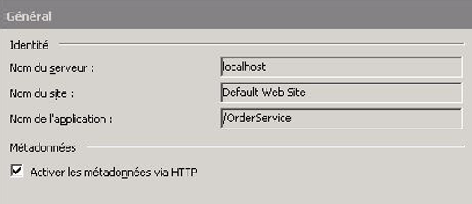
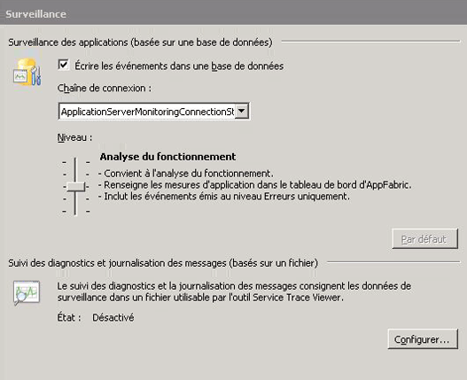
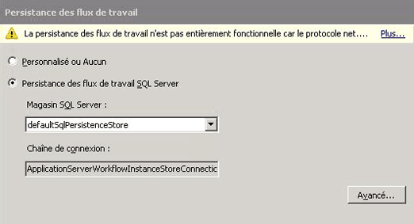
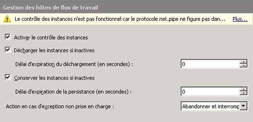
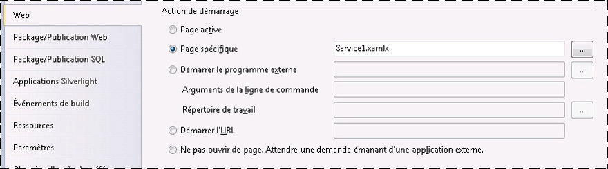
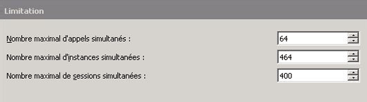
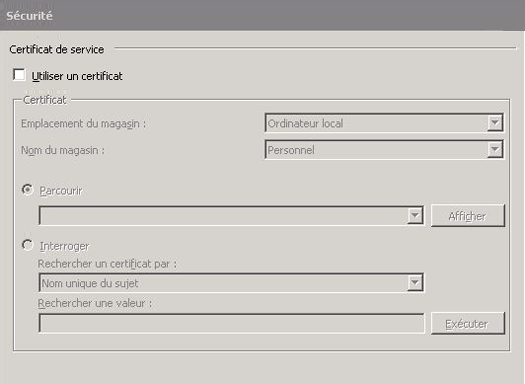
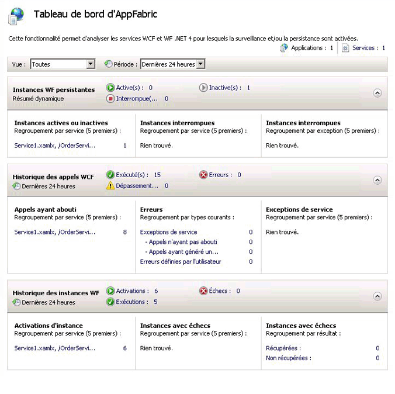
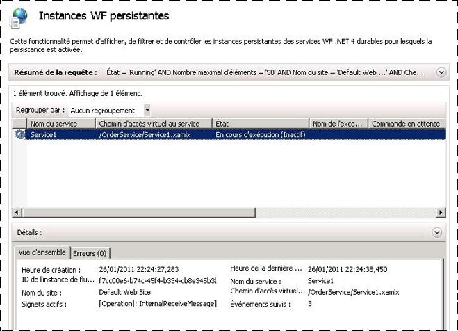

# Procédure : héberger un service de workflow avec Windows Server App Fabric
L'hébergement de services de workflow dans App Fabric est similaire à l'hébergement sous IIS/WAS. La seule différence réside dans les outils que propose App Fabric pour déployer, surveiller et gérer les services de workflow. Cette rubrique utilise le service de flux de travail créé dans le [création d’un Service de flux de travail de longue](../../../../docs/framework/wcf/feature-details/creating-a-long-running-workflow-service.md). Celle-ci vous guide dans la création d'un service de workflow. La présente rubrique explique comment héberger le service de workflow à l'aide d'App Fabric. [!INCLUDE[crabout](../../../../includes/crabout-md.md)]Windows Server AppFabric, consultez [Documentation de Windows Server App Fabric](http://go.microsoft.com/fwlink/?LinkID=193037&clcid=0x409). Avant de réaliser les étapes suivantes, vérifiez que Windows Server App Fabric est installé.  Pour cela, ouvrez Internet Information Services (inetmgr.exe), cliquez sur le nom de votre serveur dans le **connexions** afficher, cliquez sur Sites, puis cliquez sur **Site Web par défaut**. Dans la partie droite de l’écran, vous devez voir une section intitulée **App Fabric**. Si cette section ne s'affiche pas (en haut du volet droit), AppFabric n'est pas installé. [!INCLUDE[crabout](../../../../includes/crabout-md.md)]l’installation de Windows Server AppFabric consultez [l’installation de Windows Server AppFabric](http://go.microsoft.com/fwlink/?LinkId=193136).  
  
### Création d'un service de workflow simple  
  
1.  Ouvrez [!INCLUDE[vs_current_long](../../../../includes/vs-current-long-md.md)] et chargez la solution OrderProcessing que vous avez créé dans le [création d’un Service de flux de travail de longue](../../../../docs/framework/wcf/feature-details/creating-a-long-running-workflow-service.md) rubrique.  
  
2.  Bouton droit sur le **OrderService** de projet et sélectionnez **propriétés** et sélectionnez le **Web** onglet.  
  
3.  Dans le **Action de démarrage** section de la page de propriétés, sélectionnez **Page spécifique** et tapez Service1.xamlx dans la zone d’édition.  
  
4.  Dans le **serveurs** section de la page de propriétés, sélectionnez **utiliser le serveur Web IIS Local** et tapez l’URL suivante : `http://localhost/OrderService`.  
  
5.  Cliquez sur le **créer un répertoire virtuel** bouton. Cette opération crée un répertoire virtuel et configure le projet de sorte que les fichiers nécessaires soient copiés dans ce répertoire virtuel lorsque le projet est généré.  Vous avez toutefois la possibilité de copier manuellement les fichiers .xamlx, web.config et les DLL requises dans le répertoire virtuel.  
  
### Configuration d'un service de workflow hébergé dans Windows Server App Fabric  
  
1.  Ouvrez le Gestionnaire des services IIS (inetmgr.exe).  
  
2.  Accédez au répertoire virtuel OrderService dans le **connexions** volet.  
  
3.  Cliquez avec le bouton droit sur OrderService et sélectionnez **gérer les Services WCF et WF**, **configurer...** . Le **configurer WCF et WF pour l’Application** boîte de dialogue s’affiche.  
  
4.  Sélectionnez le **général** onglet pour afficher des informations générales sur l’application, comme indiqué dans la capture d’écran suivante.  
  
       
  
5.  Sélectionnez le **analyse** onglet. Celui-ci présente les divers paramètres de surveillance, comme illustré dans la capture d'écran suivante.  
  
       
  
     [!INCLUDE[crabout](../../../../includes/crabout-md.md)]configuration de la surveillance d’un service de workflow dans App Fabric consultez [configuration de la surveillance avec AppFabric](http://go.microsoft.com/fwlink/?LinkId=193153).  
  
6.  Sélectionnez le **persistance de Workflow** onglet. Il vous permet de configurer votre application pour l'utilisation du fournisseur de persistance par défaut d'App Fabric, comme illustré dans la capture d'écran suivante.  
  
       
  
     [!INCLUDE[crabout](../../../../includes/crabout-md.md)]configuration de la persistance des flux de travail dans Windows Server AppFabric consultez [configuration de la persistance de Workflow dans App Fabric](http://go.microsoft.com/fwlink/?LinkId=193148).  
  
7.  Sélectionnez le **gestion des hôtes de flux de travail** onglet. Il vous permet de spécifier quand les instances de services de workflow inactives doivent être déchargées et rendues persistantes, comme illustré dans la capture d'écran suivante.  
  
       
  
     [!INCLUDE[crabout](../../../../includes/crabout-md.md)]flux de travail hôte gestion de configuration, consultez [gestion des hôtes de flux de travail configuration dans App Fabric](http://go.microsoft.com/fwlink/?LinkId=193151).  
  
8.  Sélectionnez le **démarrage automatique** onglet. Il vous permet de spécifier les paramètres de démarrage automatique des services de workflow dans l'application, comme illustré dans la capture d'écran suivante.  
  
       
  
     [!INCLUDE[crabout](../../../../includes/crabout-md.md)]configuration du démarrage automatique voir [configuration de démarrage automatique avec AppFabric](http://go.microsoft.com/fwlink/?LinkId=193150).  
  
9. Sélectionnez le **limitation** onglet. Il vous permet de configurer les paramètres de limitation du service de workflow, comme illustré dans la capture d'écran suivante.  
  
       
  
     [!INCLUDE[crabout](../../../../includes/crabout-md.md)]configuration de la limitation consultez [configuration limitation avec AppFabric](http://go.microsoft.com/fwlink/?LinkId=193149).  
  
10. Sélectionnez le **sécurité** onglet. Il vous permet de configurer les paramètres de sécurité de l'application, comme illustré dans la capture d'écran suivante.  
  
       
  
     [!INCLUDE[crabout](../../../../includes/crabout-md.md)]configuration de la sécurité avec Windows Server AppFabric consultez [configuration de la sécurité avec AppFabric](http://go.microsoft.com/fwlink/?LinkId=193152).  
  
### Utilisation de Windows Server App Fabric  
  
1.  Générez la solution pour copier les fichiers nécessaires dans le répertoire virtuel.  
  
2.  Cliquez avec le bouton droit sur le projet OrderClient et sélectionnez **déboguer**, **démarrer une nouvelle Instance** pour lancer l’application cliente.  
  
3.  Le client s’exécute et Visual Studio affiche un **attacher un avertissement de sécurité** boîte de dialogue, cliquez sur le **ne pas attacher** bouton. Cela indique à Visual Studio de ne pas attacher le débogueur au processus IIS pour le débogage.  
  
4.  L'application cliente appelle immédiatement le service de workflow, puis attend. Le service de workflow devient inactif, puis est rendu persistant. Vous pouvez le vérifier en démarrant Internet Information Services (inetmgr.exe), en accédant à OrderService dans le volet Connexions, puis en le sélectionnant. Ensuite, cliquez sur l'icône Tableau de bord d'AppFabric dans le volet droit. Sous Instances WF persistantes, vous verrez qu'une instance de service de workflow a été rendue persistante, comme illustré dans la capture d'écran suivante.  
  
       
  
     Le **historique des instances WF** répertorie des informations sur le service de flux de travail tels que le nombre d’activations de service de flux de travail, le nombre de saisies semi-automatiques instance de service de flux de travail et le nombre d’instances de flux de travail avec des erreurs. Sous Instances actives ou inactives, un lien s'affiche. Il suffit de cliquer dessus pour afficher plus d'informations sur les instances de workflow inactives, comme illustré dans la capture d'écran suivante.  
  
       
  
     Pour plus d’informations sur Windows Server AppFabric, fonctionnalités et comment les utiliser consultez [fonctionnalités d’hébergement Windows Server App Fabric](http://go.microsoft.com/fwlink/?LinkID=193143&clcid=0x409)  
  
## Voir aussi  
 [Création d’un service de workflow de longue durée](../../../../docs/framework/wcf/feature-details/creating-a-long-running-workflow-service.md)  
 [Fonctionnalités d’hébergement de Windows Server App Fabric](http://go.microsoft.com/fwlink/?LinkId=193143)  
 [L’installation de Windows Server AppFabric](http://go.microsoft.com/fwlink/?LinkId=193136)  
 [Documentation de Windows Server AppFabric](http://go.microsoft.com/fwlink/?LinkID=193037&clcid=0x409)
