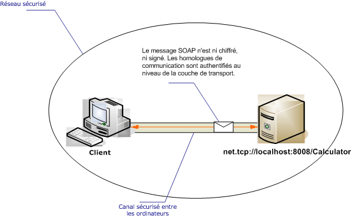

# <a name="intranet-unsecured-client-and-service"></a><span data-ttu-id="0e312-102">Service et client intranet non sécurisés</span><span class="sxs-lookup"><span data-stu-id="0e312-102">Intranet Unsecured Client and Service</span></span>
<span data-ttu-id="0e312-103">L'illustration suivante représente un service [!INCLUDE[indigo1](../../../../includes/indigo1-md.md)] simple développé pour fournir des informations sur un réseau privé sécurisé à une application [!INCLUDE[indigo2](../../../../includes/indigo2-md.md)].</span><span class="sxs-lookup"><span data-stu-id="0e312-103">The following illustration depicts a simple [!INCLUDE[indigo1](../../../../includes/indigo1-md.md)] service developed to provide information on a secure private network to a [!INCLUDE[indigo2](../../../../includes/indigo2-md.md)] application.</span></span> <span data-ttu-id="0e312-104">La sécurité n'est pas requise parce que les données ne sont pas stratégiques, le réseau est fondamentalement sécurisé, ou la sécurité est fournie par une couche située sous l'infrastructure [!INCLUDE[indigo2](../../../../includes/indigo2-md.md)].</span><span class="sxs-lookup"><span data-stu-id="0e312-104">Security is not required because the data is of low importance, the network is expected to be inherently secure, or security is provided by a layer below the [!INCLUDE[indigo2](../../../../includes/indigo2-md.md)] infrastructure.</span></span>  
  
 <span data-ttu-id="0e312-105"></span><span class="sxs-lookup"><span data-stu-id="0e312-105"></span></span>  
  
|<span data-ttu-id="0e312-106">Caractéristique</span><span class="sxs-lookup"><span data-stu-id="0e312-106">Characteristic</span></span>|<span data-ttu-id="0e312-107">Description</span><span class="sxs-lookup"><span data-stu-id="0e312-107">Description</span></span>|  
|--------------------|-----------------|  
|<span data-ttu-id="0e312-108">Mode de sécurité</span><span class="sxs-lookup"><span data-stu-id="0e312-108">Security Mode</span></span>|<span data-ttu-id="0e312-109">None</span><span class="sxs-lookup"><span data-stu-id="0e312-109">None</span></span>|  
|<span data-ttu-id="0e312-110">Transport</span><span class="sxs-lookup"><span data-stu-id="0e312-110">Transport</span></span>|<span data-ttu-id="0e312-111">TCP</span><span class="sxs-lookup"><span data-stu-id="0e312-111">TCP</span></span>|  
|<span data-ttu-id="0e312-112">Binding</span><span class="sxs-lookup"><span data-stu-id="0e312-112">Binding</span></span>|<xref:System.ServiceModel.NetTcpBinding>|  
|<span data-ttu-id="0e312-113">Interopérabilité</span><span class="sxs-lookup"><span data-stu-id="0e312-113">Interoperability</span></span>|[!INCLUDE[indigo2](../../../../includes/indigo2-md.md)]<span data-ttu-id="0e312-114"> uniquement</span><span class="sxs-lookup"><span data-stu-id="0e312-114"> only</span></span>|  
|<span data-ttu-id="0e312-115">Authentification</span><span class="sxs-lookup"><span data-stu-id="0e312-115">Authentication</span></span>|<span data-ttu-id="0e312-116">None</span><span class="sxs-lookup"><span data-stu-id="0e312-116">None</span></span>|  
|<span data-ttu-id="0e312-117">Intégrité</span><span class="sxs-lookup"><span data-stu-id="0e312-117">Integrity</span></span>|<span data-ttu-id="0e312-118">None</span><span class="sxs-lookup"><span data-stu-id="0e312-118">None</span></span>|  
|<span data-ttu-id="0e312-119">Confidentialité</span><span class="sxs-lookup"><span data-stu-id="0e312-119">Confidentiality</span></span>|<span data-ttu-id="0e312-120">None</span><span class="sxs-lookup"><span data-stu-id="0e312-120">None</span></span>|  
  
## <a name="service"></a><span data-ttu-id="0e312-121">Service</span><span class="sxs-lookup"><span data-stu-id="0e312-121">Service</span></span>  
 <span data-ttu-id="0e312-122">La configuration et le code ci-dessous sont conçus pour s'exécuter indépendamment.</span><span class="sxs-lookup"><span data-stu-id="0e312-122">The following code and configuration are meant to run independently.</span></span> <span data-ttu-id="0e312-123">Effectuez l’une des opérations suivantes :</span><span class="sxs-lookup"><span data-stu-id="0e312-123">Do one of the following:</span></span>  
  
-   <span data-ttu-id="0e312-124">Créez un service autonome à l'aide du code sans configuration.</span><span class="sxs-lookup"><span data-stu-id="0e312-124">Create a stand-alone service using the code with no configuration.</span></span>  
  
-   <span data-ttu-id="0e312-125">Créez un service à l'aide de la configuration fournie, mais ne définissez pas de point de terminaison.</span><span class="sxs-lookup"><span data-stu-id="0e312-125">Create a service using the supplied configuration, but do not define any endpoints.</span></span>  
  
### <a name="code"></a><span data-ttu-id="0e312-126">Code</span><span class="sxs-lookup"><span data-stu-id="0e312-126">Code</span></span>  
 <span data-ttu-id="0e312-127">Le code ci-dessous montre comment créer un point de terminaison sans sécurité :</span><span class="sxs-lookup"><span data-stu-id="0e312-127">The following code shows how to create an endpoint with no security:</span></span>  
  
 [!code-csharp[C_UnsecuredService#2](../../../../samples/snippets/csharp/VS_Snippets_CFX/c_unsecuredservice/cs/source.cs#2)]
 [!code-vb[C_UnsecuredService#2](../../../../samples/snippets/visualbasic/VS_Snippets_CFX/c_unsecuredservice/vb/source.vb#2)]  
  
### <a name="configuration"></a><span data-ttu-id="0e312-128">Configuration</span><span class="sxs-lookup"><span data-stu-id="0e312-128">Configuration</span></span>  
 <span data-ttu-id="0e312-129">Le code ci-dessous configure le même point de terminaison en utilisant la configuration :</span><span class="sxs-lookup"><span data-stu-id="0e312-129">The following code sets up the same endpoint using configuration:</span></span>  
  
```xml  
<?xml version="1.0" encoding="utf-8"?>  
<configuration>  
  <system.serviceModel>  
    <behaviors />  
    <services>  
      <service behaviorConfiguration=""   
               name="ServiceModel.Calculator">  
        <endpoint address="net.tcp://localhost:8008/Calculator"   
                  binding="netTcpBinding"  
                  bindingConfiguration="tcp_Unsecured"   
                  name="netTcp_ICalculator"  
                  contract="ServiceModel.ICalculator" />  
      </service>  
    </services>  
    <bindings>  
      <netTcpBinding>  
        <binding name="tcp_Unsecured">  
          <security mode="None" />  
        </binding>  
      </netTcpBinding>  
    </bindings>  
    <client />  
  </system.serviceModel>  
</configuration>  
```  
  
## <a name="client"></a><span data-ttu-id="0e312-130">Client</span><span class="sxs-lookup"><span data-stu-id="0e312-130">Client</span></span>  
 <span data-ttu-id="0e312-131">La configuration et le code ci-dessous sont conçus pour s'exécuter indépendamment.</span><span class="sxs-lookup"><span data-stu-id="0e312-131">The following code and configuration are meant to run independently.</span></span> <span data-ttu-id="0e312-132">Effectuez l’une des opérations suivantes :</span><span class="sxs-lookup"><span data-stu-id="0e312-132">Do one of the following:</span></span>  
  
-   <span data-ttu-id="0e312-133">Créez un client autonome à l'aide du code (et du code client).</span><span class="sxs-lookup"><span data-stu-id="0e312-133">Create a stand-alone client using the code (and client code).</span></span>  
  
-   <span data-ttu-id="0e312-134">Créez un client qui ne définit pas d'adresse de point de terminaison.</span><span class="sxs-lookup"><span data-stu-id="0e312-134">Create a client that does not define any endpoint addresses.</span></span> <span data-ttu-id="0e312-135">Au lieu de cela, utilisez le constructeur client qui accepte le nom de configuration comme argument.</span><span class="sxs-lookup"><span data-stu-id="0e312-135">Instead, use the client constructor that takes the configuration name as an argument.</span></span> <span data-ttu-id="0e312-136">Par exemple :</span><span class="sxs-lookup"><span data-stu-id="0e312-136">For example:</span></span>  
  
     [!code-csharp[C_SecurityScenarios#0](../../../../samples/snippets/csharp/VS_Snippets_CFX/c_securityscenarios/cs/source.cs#0)]
     [!code-vb[C_SecurityScenarios#0](../../../../samples/snippets/visualbasic/VS_Snippets_CFX/c_securityscenarios/vb/source.vb#0)]  
  
### <a name="code"></a><span data-ttu-id="0e312-137">Code</span><span class="sxs-lookup"><span data-stu-id="0e312-137">Code</span></span>  
 <span data-ttu-id="0e312-138">Le code suivant affiche un client [!INCLUDE[indigo2](../../../../includes/indigo2-md.md)] de base qui accède à un point de terminaison non protégé à l'aide du protocole TCP.</span><span class="sxs-lookup"><span data-stu-id="0e312-138">The following code shows a basic [!INCLUDE[indigo2](../../../../includes/indigo2-md.md)] client that accesses an unsecured endpoint using the TCP protocol.</span></span>  
  
 [!code-csharp[C_UnsecuredClient#2](../../../../samples/snippets/csharp/VS_Snippets_CFX/c_unsecuredclient/cs/source.cs#2)]
 [!code-vb[C_UnsecuredClient#2](../../../../samples/snippets/visualbasic/VS_Snippets_CFX/c_unsecuredclient/vb/source.vb#2)]  
  
### <a name="configuration"></a><span data-ttu-id="0e312-139">Configuration</span><span class="sxs-lookup"><span data-stu-id="0e312-139">Configuration</span></span>  
 <span data-ttu-id="0e312-140">Le code de configuration suivant s'applique au client :</span><span class="sxs-lookup"><span data-stu-id="0e312-140">The following configuration code applies to the client:</span></span>  
  
```xml  
<?xml version="1.0" encoding="utf-8"?>  
<configuration>  
  <system.serviceModel>  
    <bindings>  
      <netTcpBinding>  
        <binding name="NetTcpBinding_ICalculator" >  
          <security mode="None">  
          </security>  
        </binding>  
      </netTcpBinding>  
    </bindings>  
    <client>  
      <endpoint address="net.tcp://machineName:8008/Calculator "  
                binding="netTcpBinding"   
                bindingConfiguration="NetTcpBinding_ICalculator"  
                contract="ICalculator"   
                name="NetTcpBinding_ICalculator" />  
    </client>  
  </system.serviceModel>  
</configuration>  
```  
  
## <a name="see-also"></a><span data-ttu-id="0e312-141">Voir aussi</span><span class="sxs-lookup"><span data-stu-id="0e312-141">See Also</span></span>  
 <xref:System.ServiceModel.NetTcpBinding>  
 [<span data-ttu-id="0e312-142">Vue d’ensemble de la sécurité</span><span class="sxs-lookup"><span data-stu-id="0e312-142">Security Overview</span></span>](../../../../docs/framework/wcf/feature-details/security-overview.md)  
 [<span data-ttu-id="0e312-143">Modèle de sécurité pour Windows Server AppFabric</span><span class="sxs-lookup"><span data-stu-id="0e312-143">Security Model for Windows Server App Fabric</span></span>](http://go.microsoft.com/fwlink/?LinkID=201279&clcid=0x409)
