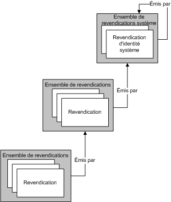
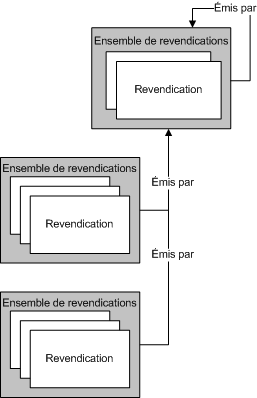
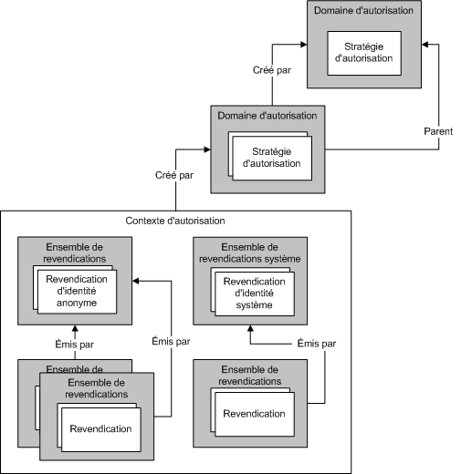

# Gestion des revendications et autorisation avec le mod&#232;le d&#39;identit&#233;
Une autorisation correspond au processus permettant d'identifier les entités autorisées à changer ou à consulter des ressources informatiques ou à y accéder d'une manière ou d'une autre.Par exemple, dans une entreprise, seuls les responsables peuvent avoir accès aux fichiers des employés.[!INCLUDE[indigo1](../../../../includes/indigo1-md.md)] prend en charge deux mécanismes pour exécuter le traitement des autorisations.Le premier mécanisme vous permet de contrôler les processus d'autorisation à l'aide des constructions CLR \(Common Language Runtime\) existantes.Le second mécanisme correspond à un modèle basé sur les revendications appelé *modèle d'identité*.[!INCLUDE[indigo2](../../../../includes/indigo2-md.md)] utilise le modèle d'identité pour créer des revendications à partir des messages entrants. Les classes de ce modèle peuvent être étendues pour assurer la prise en charge de nouveaux types de revendication lorsqu'un schéma d'autorisation personnalisé est utilisé.Cette rubrique présente les principaux concepts de programmation du modèle d'identité et répertorie les principales classes utilisées par cette fonctionnalité.  
  
## Scénarios d'utilisation du modèle d'identité  
 Les scénarios suivants présentent différents cas d'utilisation de la fonctionnalité Modèle d'identité.  
  
### Scénario 1 : Prise en charge des revendications de groupe, de rôle et d'identité  
 Les utilisateurs envoient des messages à un service Web.Les spécifications de contrôle d'accès du service Web utilisent les groupes, les rôles et l'identité.L'expéditeur du message est mappé à un ensemble de rôles ou de groupes.Les informations concernant les rôles et les groupe sont utilisées pour effectuer les vérifications requises en matière d'accès.  
  
### Scénario 2 : prise en charge des revendications enrichies  
 Les utilisateurs envoient des messages à un service Web.Les spécifications de contrôle d'accès du service Web nécessitent le recours à un modèle enrichi, l'identité, les rôles ou les groupes étant insuffisants.Le service Web détermine si un utilisateur donné est autorisé à accéder à une ressource protégée particulière en utilisant le modèle basé sur les revendications enrichies.Par exemple, un utilisateur peut être autorisé à consulter des informations particulières, telles que les informations concernant les salaires, auxquelles les autres utilisateurs ne sont pas autorisés à accéder.  
  
### Scénario 3 : mappage de revendications distinctes  
 Un utilisateur envoie un message à un service Web.L'utilisateur peut spécifier ses informations d'identification de différentes façons : Certificat X.509, jeton de nom d'utilisateur ou jeton Kerberos.Le service Web doit effectuer les contrôles d'accès de la même façon, quel que soit le type utilisé pour définir les informations d'identification de l'utilisateur.Si, au fil du temps, de nouveaux types d'informations d'identification sont pris en charge, le système devra évoluer en conséquence.  
  
### Scénario 4 : contrôle de l'accès à plusieurs ressources  
 Un service Web essaie d'accéder à plusieurs ressources.Le service identifie les ressources protégées auxquelles un utilisateur donné est autorisé à accéder en comparant ses revendications avec celles requises pour accéder à ces ressources.  
  
## Termes utilisés dans le cadre du modèle d'identité  
 La liste suivante contient les termes clés utilisés pour décrire les concepts relatifs au modèle d'identité.  
  
 Stratégie d'autorisation  
 Cette stratégie définit un ensemble de règles permettant de mapper les ensembles de revendications en entrée aux ensembles de revendications en sortie.L'évaluation de la stratégie d'autorisation entraîne l'ajout d'ensembles de revendications à un contexte d'évaluation, puis à un contexte d'autorisation.  
  
 Contexte d'autorisation  
 Ce contexte contient des ensembles de revendications ainsi qu'aucune ou plusieurs propriétés.Il s'agit du résultat obtenu après évaluation d'une ou plusieurs stratégies d'autorisation.  
  
 Revendication  
 Une revendication est définie par ses trois composantes : type, droits et valeur.  
  
 Ensemble de revendications  
 Il s'agit de l'ensemble de revendications émis par un émetteur particulier.  
  
 Type de revendication  
 Ce type indique le type de la revendication.Les revendications définies par l'API du modèle d'identité sont des propriétés de la classe <xref:System.IdentityModel.Claims.Claim.ClaimType%2A>.Les types de revendication fournis par le système sont notamment <xref:System.IdentityModel.Claims.ClaimTypes.Dns%2A>, <xref:System.IdentityModel.Claims.ClaimTypes.Email%2A>, <xref:System.IdentityModel.Claims.ClaimTypes.Hash%2A>, <xref:System.IdentityModel.Claims.ClaimTypes.Name%2A>, <xref:System.IdentityModel.Claims.ClaimTypes.Rsa%2A>, <xref:System.IdentityModel.Claims.ClaimTypes.Sid%2A>, <xref:System.IdentityModel.Claims.ClaimTypes.Spn%2A>, <xref:System.IdentityModel.Claims.ClaimTypes.System%2A>, <xref:System.IdentityModel.Claims.ClaimTypes.Thumbprint%2A>, <xref:System.IdentityModel.Claims.ClaimTypes.Uri%2A>et <xref:System.IdentityModel.Claims.ClaimTypes.X500DistinguishedName%2A>.  
  
 Contexte d'évaluation  
 Il s'agit du contexte dans lequel les stratégies d'autorisation sont évaluées.Ce contexte contient des propriétés et des ensembles de revendications.Il sert de base au contexte d'autorisation un fois l'évaluation terminée.  
  
 Revendication d'identité  
 Il s'agit d'une revendication dont le droit correspond à identité.  
  
 Émetteur  
 Il s'agit d'un ensemble de revendications contenant au moins une revendication d'identité et considéré comme ayant émis un autre ensemble de revendications.  
  
 Propriétés  
 Il s'agit de l'ensemble des informations associées à un contexte d'évaluation ou d'autorisation.  
  
 Ressources protégées  
 Il s'agit de ressources pouvant être utilisées ou manipulées d'une manière ou d'une autre uniquement si certaines conditions sont remplies.  
  
 Droits  
 Les droits correspondent aux fonctions pouvant être exécutées sur une ressource donnée.Les droits définis par l'API du modèle d'identité sont des propriétés de la classe <xref:System.IdentityModel.Claims.Rights>.Les types de droits fournis par le système sont notamment <xref:System.IdentityModel.Claims.Rights.Identity%2A> et <xref:System.IdentityModel.Claims.Rights.PossessProperty%2A>.  
  
 Valeur  
 Il s'agit de la valeur sur laquelle l'utilisateur a des droits.  
  
## Revendications  
 Le modèle d'identité est un système basé sur des revendications.Les revendications décrivent les fonctions associées aux entités d'un système. Ces entités correspondent le plus souvent aux utilisateurs de ce système.L'ensemble de revendications associées à une entité donnée est en fait une sorte de clé.Les différentes revendications définissent la forme et les caractéristiques particulières de cette clé, de même qu'une véritable clé est façonnée selon des caractéristiques physiques particulières pour pouvoir ouvrir la serrure d'une porte donnée.Les revendications sont utilisées pour accéder aux ressources.Les autorisations d'accès à une ressource protégée donnée sont accordées en comparant les revendications requises pour y accéder à celles de l'entité tentant d'y accéder.  
  
 Les revendications définissent les droits des entités par rapport à certaines valeurs.Ces droits peuvent correspondre à « lecture », « écriture » ou « exécution ». Les valeurs peuvent correspondre à une base de données, à une boîte aux lettres ou à une propriété.Un type est également défini pour les revendications.Le type et le droit définis pour les revendications déterminent les types de tâches qu'elles peuvent exécuter sur les valeurs.Par exemple, lorsqu'une revendication a le type « Fichier » et le droit « Lecture » sur la valeur « Biographie.doc », cela signifie que l'entité associée à cette revendication bénéficie de droits d'accès en lecture au fichier Biographie.doc.Lorsqu'une revendication a le type « Nom » et le droit « PossessProperty » sur la valeur « Martin », cela signifie que l'entité qui lui est associée dispose de la propriété « Nom » sur la valeur « Martin ».  
  
 Bien que les divers types et droits de revendication soient définis dans le cadre du modèle d'identité, ce système est extensible, ce qui permet à d'autres systèmes de définir d'autres types et droits de revendication comme requis par dessus l'infrastructure de ce modèle.  
  
### Revendications d'identité  
 L'identité correspond à un droit particulier.Les revendications disposant de ce droit contiennent une instruction par rapport à l'identité des entités auxquelles elles se rapportent.Par exemple, une revendication ayant le type « nom d'utilisateur principal » \(UPN\) avec une valeur de « xyz@example.com » et un droit correspondant à identité indique une identité particulière dans un domaine particulier.  
  
#### Revendication d'identité système  
 Le modèle d'identité définit une seule revendication d'identité, la revendication d'identité système.Cette revendication d'identité indique que l'entité correspond en fait à l'application ou au système en cours.  
  
### Ensembles de revendications  
 Le modèle des revendications représentant l'identité joue un rôle important, les revendications étant toujours émises par une entité du système, même si cette entité correspond en définitive à une sorte d'auto\-concept. Les revendications sont regroupées dans des ensembles, chaque ensemble correspondant à un émetteur.Un émetteur est en fait un ensemble de revendications.Une telle relation récursive doit prendre fin pour permettre à chaque ensemble de revendications d'être son propre émetteur.  
  
 Dans l'exemple suivant, l'illustration contient trois ensembles de revendications. L'un d'eux a pour émetteur un autre ensemble de revendications, lequel a comme émetteur la revendication système.Par conséquent, les ensembles de revendications forment une hiérarchie susceptible de se composer d'un grand nombre de niveaux différents.  
  
   
  
 Plusieurs ensembles de revendications peuvent avoir pour émetteur le même ensemble de revendications comme illustré dans l'exemple suivant.  
  
   
  
 À l'exception d'un ensemble de revendications constituant son propre émetteur, le modèle d'identité ne permet pas la formation de boucles entre les émetteurs.Cela signifie qu'un ensemble de revendications B servant d'émetteur à un ensemble de revendications A ne peut lui même être émis par l'ensemble A.En outre, le modèle d'identité ne permet pas aux ensembles de revendications de disposer de plusieurs émetteurs.Si deux émetteurs ou plus doivent publier un ensemble de revendications donné, vous devez utiliser plusieurs ensembles de revendications, chacun contenant les mêmes revendications, mais disposant d'émetteurs différents.  
  
### Origine des revendications  
 Les revendications peuvent émaner de sources diverses.Les informations d'identification communiquées par les utilisateurs, par exemple lors de l'envoi d'un message à un service Web, constituent fréquemment la source des revendications.Après validation par le système, ces revendications deviennent les ensembles des revendications associés ensuite à ces utilisateurs.Les revendications peuvent également provenir d'autres composants système, par exemple du système d'exploitation, de la pile réseau, de l'environnement d'exécution, de l'application, etc.Les revendications peuvent enfin provenir de services distants.  
  
### Stratégies d'autorisation  
 Avec la fonctionnalité de modèle d'identité, les revendications sont générées dans le cadre du processus d'évaluation des stratégies d'autorisation.Les stratégies d'autorisation examinent les ensembles \(éventuellement vides\) de revendications existantes et peuvent choisir d'y ajouter des revendications supplémentaires en fonction des revendications déjà présentes et des autres informations à leur disposition.Ces opérations sont à la base du mappage entre les revendications.La présence ou absence de revendications dans le système influence le comportement des stratégies d'autorisation en ce qui concerne l'ajout de revendications supplémentaires.  
  
 Par exemple, la stratégie d'autorisation a accès à une base de données contenant les dates de naissance des différentes entités utilisant le système.La stratégie d'autorisation utilise ces informations afin d'ajouter une revendication « plus de 18 ans » au contexte.Remarque 1 : cette nouvelle revendication divulgue uniquement l'information « plus de 18 ans » sur les entités.Remarque 2 : la manière dont la revendication « plus de 18 ans » est interprétée dépend de la manière dont la sémantique de cette revendication est comprise.La stratégie d'autorisation qui a ajouté cette revendication comprend sa sémantique à un certain niveau.Le code qui examine par la suite les revendications obtenues suite à l'évaluation de la stratégie doit également être informé de cette sémantique.  
  
 Une stratégie d'autorisation donnée peut nécessiter d'être évaluée à plusieurs reprises, car à mesure que d'autres stratégies d'autorisation ajoutent des revendications, cette stratégie peut également ajouter d'autres revendications.Le modèle d'identité est conçu pour poursuivre les évaluations tant que des nouvelles revendications sont ajoutées au contexte par les stratégies d'autorisation en vigueur.Ce processus d'évaluation des stratégies d'autorisation en continu empêchent leur évaluation en fonction d'un ordre particulier. Elles peuvent en effet être évaluées dans n'importe quel ordre.Par exemple, si la stratégie X peut ajouter la revendication Z uniquement une fois la revendication B de la stratégie Z ajoutée, puis si X est évaluée en premier, la revendication Z n'est pas ajoutée.Par la suite, A est évaluée et ajoute la revendication B.X est évaluée une deuxième fois, et cette fois la revendication Z est ajoutée.  
  
 De nombreuses stratégies d'autorisation différentes peuvent être en vigueur pour un même système donné.  
  
### Machine à fabriquer des clés  
 Évaluer un groupe de stratégies d'autorisation associées s'apparente à utiliser une machine pour fabriquer des clés.Après évaluation de toutes les stratégies d'autorisation, des ensembles de revendications sont générés, donnant ainsi leur forme aux clés.Lorsque les clés ont leur forme définitive, elles peuvent être utilisées afin de tenter d'ouvrir certaines serrures.La forme des clés est stockée dans un « contexte d'autorisation », lequel est créé par un gestionnaire d'autorisations.  
  
### Contexte d'autorisation  
 Les gestionnaires d'autorisations évaluent les différentes stratégies d'autorisation comme décrit. Le résultat de cette évaluation correspond à un contexte d'autorisation, c'est\-à\-dire à un ensemble d'ensembles de revendications et de propriétés afférentes.Le contexte d'autorisation peut être examiné afin d'identifier les revendications, les relations qu'elles entretiennent entre elles \(par exemple, s'agissant des ensembles de revendications remplissant la fonction d'émetteur\) et enfin afin de les comparer avec les spécifications requises pour accéder à une ressource donnée.  
  
### Serrures  
 Si un contexte d'autorisation \(c'est\-à\-dire un ensemble de revendications\) correspond à une clé, les spécifications qui doivent être respectées pour permettre l'accès à une ressource protégée sont la serrure que cette clé doit ouvrir.Le modèle d'identité ne spécifie pas formellement les modalités selon lesquelles ces spécifications sont exprimées, mais, en raison de la nature du système, c'est\-à\-dire basée sur des revendications, implique la comparaison des revendications présentes dans le contexte d'autorisation avec certains ensembles de revendications requises.  
  
### En résumé  
 Le modèle d'identité s'appuie sur le concept des revendications.Les revendications sont regroupées dans des ensembles, lesquels sont regroupées dans un contexte d'autorisation.Un contexte d'autorisation contient un ensemble de revendications et correspond au résultat de l'évaluation d'une ou plusieurs stratégies d'autorisation associées à un gestionnaire d'autorisations.Cet ensemble de revendications peut ensuite être examiné afin de déterminer si les spécifications d'accès requises sont respectées.L'illustration suivante révèle la manière dont ces différents concepts du modèle d'identité sont liés entre eux.  
  
   
  
## WCF et modèle d'identité  
 [!INCLUDE[indigo2](../../../../includes/indigo2-md.md)] utilise l'infrastructure du modèle d'identité pour effectuer les contrôles d'autorisation.Dans [!INCLUDE[indigo2](../../../../includes/indigo2-md.md)], la classe <xref:System.ServiceModel.Description.ServiceAuthorizationBehavior> vous permet de spécifier des stratégies *d'autorisation* dans le cadre d'un service.Ces stratégies d'autorisation sont appelées *stratégies d'autorisation externes*. Elles peuvent procéder au traitement des revendications en fonction d'une stratégie locale ou en interagissant avec un service distant.Le gestionnaire d'autorisations, représenté par la classe <xref:System.ServiceModel.ServiceAuthorizationManager>, évalue les stratégies d'autorisation externes ainsi que les stratégies d'autorisation reconnaissant divers types d'informations d'identification \(jetons\) et remplit le *contexte d'autorisation* des revendications associées aux messages entrants.Le contexte d'autorisation est représenté par la classe <xref:System.IdentityModel.Policy.AuthorizationContext>.  
  
## Programmation du modèle d'identité  
 La table suivante décrit le modèle d'objet utilisé pour programmer les extensions du modèle d'identité.Toutes ces classes existent dans <xref:System.IdentityModel.Policy> ou dans les espaces de noms <xref:System.IdentityModel.Claims>.  
  
|Classe|Description|  
|------------|-----------------|  
|Composant d'autorisation|Classe du modèle d'identité qui implémente l'interface <xref:System.IdentityModel.Policy.IAuthorizationComponent>.|  
|<xref:System.IdentityModel.Policy.IAuthorizationComponent>|Interface qui fournit une propriété de chaîne en lecture seule unique : Id.La valeur de cette propriété est unique pour chaque instance dans le système qui implémente cette interface.|  
|<xref:System.IdentityModel.Policy.AuthorizationContext>|*Composant d'autorisation* qui contient un ensemble d'instances `ClaimSet` avec aucune ou plusieurs propriétés. Il résulte de l'évaluation d'une ou plusieurs stratégies d'autorisation.|  
|<xref:System.IdentityModel.Claims.Claim>|Association de trois composants : type, droits et valeur.Les droits et la valeur sont limités par le type de la revendication.|  
|<xref:System.IdentityModel.Claims.ClaimSet>|Classe de base abstraite.Collection d'instances `Claim`.|  
|<xref:System.IdentityModel.Claims.DefaultClaimSet>|Classe sealed.Implémentation de la classe `ClaimSet`.|  
|<xref:System.IdentityModel.Policy.EvaluationContext>|Classe de base abstraite.Passée à une stratégie d'autorisation pendant son évaluation.|  
|<xref:System.IdentityModel.Policy.IAuthorizationPolicy>|Interface dérivée de `IAuthorizationComponent` et implémentée par les classes de stratégie d'autorisation.|  
|<xref:System.IdentityModel.Claims.Rights>|Classe statique qui contient des valeurs de droit prédéfinies.|  
  
 Les classes suivantes sont également utilisées pour la programmation du modèle d'identité, mais ne figurent pas dans les espaces de noms <xref:System.IdentityModel.Policy> et <xref:System.IdentityModel.Claims>.  
  
|Classe|Description|  
|------------|-----------------|  
|<xref:System.ServiceModel.ServiceAuthorizationManager>|Classe qui fournit une méthode <xref:System.ServiceModel.ServiceAuthorizationManager.CheckAccessCore%2A> permettant d'effectuer les contrôles d'autorisation basés sur les revendications pour chaque opération d'un service.Vous devez dériver une classe de la classe et remplacer la méthode.|  
|<xref:System.ServiceModel.Description.ServiceAuthorizationBehavior>|Classe sealed qui fournit diverses propriétés définissant le comportement d'un service des contrôles d'autorisation.|  
|<xref:System.ServiceModel.ServiceSecurityContext>|Classe qui fournit le contexte de sécurité, notamment le contexte d'autorisation, pour l'opération en cours d'exécution \(ou sur le point de s'exécuter\).Une instance de cette classe fait partie de <xref:System.ServiceModel.OperationContext>.|  
  
### Membres significatifs  
 Les membres suivants sont fréquemment utilisés pour créer de nouveaux types de revendication.  
  
|Membre|Description|  
|------------|-----------------|  
|<xref:System.ServiceModel.ServiceAuthorizationManager.CheckAccessCore%2A>|Les classes dérivées implémentent cette méthode pour effectuer des contrôles d'accès basés sur les revendications avant d'exécuter les opérations des services.Toutes les informations figurant dans le contexte <xref:System.ServiceModel.OperationContext> fourni ou ailleurs peuvent être examinées lors de la prise de décision d'accorder ou non l'accès.Si la méthode <xref:System.ServiceModel.ServiceAuthorizationManager.CheckAccessCore%2A> retourne la valeur `true`, l'accès est accordé et l'opération est autorisée à s'exécuter.Si la méthode `CheckAccessCore` retourne la valeur `false`, l'accès est refusé et l'opération ne s'exécute pas.Pour obtenir un exemple, consultez [Comment : créer un gestionnaire d'autorisations personnalisé pour un service](../../../../docs/framework/wcf/extending/how-to-create-a-custom-authorization-manager-for-a-service.md).|  
|<xref:System.ServiceModel.Description.ServiceAuthorizationBehavior.ServiceAuthorizationManager%2A>|Retourne le gestionnaire <xref:System.ServiceModel.ServiceAuthorizationManager> du service.Le gestionnaire <xref:System.ServiceModel.ServiceAuthorizationManager> est chargé de prendre les décisions concernant les autorisations.|  
|<xref:System.ServiceModel.Description.ServiceAuthorizationBehavior.ExternalAuthorizationPolicies%2A>|Collection de stratégies d'autorisation personnalisées spécifiées pour le service.Ces stratégies sont évaluées en plus des stratégies associées aux informations d'identification présentes dans les messages entrants.|  
  
## Voir aussi  
 <xref:System.IdentityModel.Policy.AuthorizationContext>   
 <xref:System.IdentityModel.Claims.Claim>   
 <xref:System.IdentityModel.Policy.EvaluationContext>   
 <xref:System.IdentityModel.Policy.IAuthorizationComponent>   
 <xref:System.IdentityModel.Policy.IAuthorizationPolicy>   
 <xref:System.IdentityModel.Claims.Rights>   
 <xref:System.IdentityModel.Claims>   
 <xref:System.IdentityModel.Policy>   
 <xref:System.IdentityModel.Tokens>   
 <xref:System.IdentityModel.Selectors>   
 [Revendications et jetons](../../../../docs/framework/wcf/feature-details/claims-and-tokens.md)   
 [Revendications et refus de l'accès aux ressources](../../../../docs/framework/wcf/feature-details/claims-and-denying-access-to-resources.md)   
 [Création de revendications et valeurs de ressource](../../../../docs/framework/wcf/feature-details/claim-creation-and-resource-values.md)   
 [Comment : créer une revendication personnalisée](../../../../docs/framework/wcf/extending/how-to-create-a-custom-claim.md)   
 [Comment : comparer des revendications](../../../../docs/framework/wcf/extending/how-to-compare-claims.md)   
 [Comment : créer une stratégie d'autorisation personnalisée](../../../../docs/framework/wcf/extending/how-to-create-a-custom-authorization-policy.md)   
 [Comment : créer un gestionnaire d'autorisations personnalisé pour un service](../../../../docs/framework/wcf/extending/how-to-create-a-custom-authorization-manager-for-a-service.md)   
 [Vue d'ensemble de la sécurité](../../../../docs/framework/wcf/feature-details/security-overview.md)   
 [Autorisation](../../../../docs/framework/wcf/feature-details/authorization-in-wcf.md)