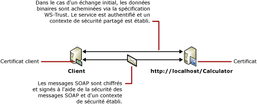

# S&#233;curit&#233; de message avec un client de certificat
Le scénario suivant montre un client et un service [!INCLUDE[indigo1](../../../../includes/indigo1-md.md)] sécurisés à l'aide du mode de sécurité de message.Le client et le service sont tous les deux authentifiés à l'aide de certificats.[!INCLUDE[crdefault](../../../../includes/crdefault-md.md)][Sécurité des applications distribuées](../../../../docs/framework/wcf/feature-details/distributed-application-security.md).  
  
 Pour obtenir un exemple d'application, consultez [Message Security Certificate](../../../../docs/framework/wcf/samples/message-security-certificate.md).  
  
   
  
|Caractéristique|Description|  
|---------------------|-----------------|  
|Mode de sécurité|Message|  
|Interopérabilité|[!INCLUDE[indigo2](../../../../includes/indigo2-md.md)] uniquement|  
|Authentification \(serveur\)|Utilisation de certificat de service|  
|Authentification \(client\)|Utilisation de certificat client|  
|Intégrité|Oui|  
|Confidentialité|Oui|  
|Transport|HTTP|  
|Liaison|<xref:System.ServiceModel.WSHttpBinding>|  
  
## Service  
 La configuration et le code ci\-dessous sont conçus pour s'exécuter indépendamment.Effectuez l'une des opérations suivantes :  
  
-   Créez un service autonome à l'aide du code sans configuration.  
  
-   Créez un service à l'aide de la configuration fournie, mais ne définissez pas de point de terminaison.  
  
### Code  
 Le code ci\-dessous montre comment créer un point de terminaison de service qui utilise la sécurité de message pour établir un contexte sécurisé.  
  
 [!code-csharp[C_SecurityScenarios#10](../../../../samples/snippets/csharp/VS_Snippets_CFX/c_securityscenarios/cs/source.cs#10)]
 [!code-vb[C_SecurityScenarios#10](../../../../samples/snippets/visualbasic/VS_Snippets_CFX/c_securityscenarios/vb/source.vb#10)]  
  
### Configuration  
 La configuration ci\-dessous peut être utilisée à la place du code.  
  
```  
<?xml version="1.0" encoding="utf-8"?>  
<configuration>  
  <system.serviceModel>  
    <behaviors>  
      <serviceBehaviors>  
        <behavior name="ServiceCredentialsBehavior">  
          <serviceCredentials>  
            <serviceCertificate findValue="Contoso.com"  
                                x509FindType="FindBySubjectName" />  
          </serviceCredentials>  
        </behavior>  
      </serviceBehaviors>  
    </behaviors>  
    <services>  
      <service behaviorConfiguration="ServiceCredentialsBehavior"   
               name="ServiceModel.Calculator">  
        <endpoint address="http://localhost/Calculator"   
                  binding="wsHttpBinding"  
                  bindingConfiguration="MessageAndCerficiateClient"   
                  name="SecuredByClientCertificate"  
                  contract="ServiceModel.ICalculator" />  
      </service>  
    </services>  
    <bindings>  
      <wsHttpBinding>  
        <binding name="WSHttpBinding_ICalculator">  
          <security mode="Message">  
            <message clientCredentialType="Certificate" />  
          </security>  
        </binding>  
      </wsHttpBinding>  
    </bindings>  
    <client />  
  </system.serviceModel>  
</configuration>  
```  
  
## Client  
 La configuration et le code ci\-dessous sont destinés à s'exécuter indépendamment.Effectuez l'une des opérations suivantes :  
  
-   Créez un client autonome à l'aide du code \(et du code client\).  
  
-   Créez un client qui ne définit pas d'adresse de point de terminaison.Au lieu de cela, utilisez le constructeur client qui accepte le nom de configuration comme argument.Par exemple :  
  
     [!code-csharp[C_SecurityScenarios#0](../../../../samples/snippets/csharp/VS_Snippets_CFX/c_securityscenarios/cs/source.cs#0)]
     [!code-vb[C_SecurityScenarios#0](../../../../samples/snippets/visualbasic/VS_Snippets_CFX/c_securityscenarios/vb/source.vb#0)]  
  
### Code  
 Le code ci\-dessous crée le client.La liaison s'effectue avec la sécurité en mode de message et le type d'informations d'identification client a la valeur `Certificate`.  
  
 [!code-csharp[C_SecurityScenarios#17](../../../../samples/snippets/csharp/VS_Snippets_CFX/c_securityscenarios/cs/source.cs#17)]
 [!code-vb[C_SecurityScenarios#17](../../../../samples/snippets/visualbasic/VS_Snippets_CFX/c_securityscenarios/vb/source.vb#17)]  
  
### Configuration  
 La configuration ci\-dessous spécifie le certificat client à l'aide d'un comportement de point de terminaison.Pour plus d'informations sur les certificats, consultez [Utilisation des certificats](../../../../docs/framework/wcf/feature-details/working-with-certificates.md).Le code utilise également un élément \<`identity`\> pour spécifier un nom DNS \(Domain Name System\) de l'identité de serveur attendue.[!INCLUDE[crabout](../../../../includes/crabout-md.md)] l'identité, consultez [Identité du service et authentification](../../../../docs/framework/wcf/feature-details/service-identity-and-authentication.md).  
  
```  
<?xml version="1.0" encoding="utf-8"?>  
<configuration>  
  <system.serviceModel>  
    <behaviors>  
      <endpointBehaviors>  
        <behavior name="endpointCredentialsBehavior">  
          <clientCredentials>  
            <clientCertificate findValue="Cohowinery.com"   
               storeLocation="LocalMachine"  
              x509FindType="FindBySubjectName" />  
          </clientCredentials>  
        </behavior>  
      </endpointBehaviors>  
    </behaviors>  
    <bindings>  
      <wsHttpBinding>  
        <binding name="WSHttpBinding_ICalculator" >  
          <security mode="Message">  
            <message clientCredentialType="Certificate" />  
          </security>  
        </binding>  
      </wsHttpBinding>  
    </bindings>  
    <client>  
      <endpoint address="http://machineName/Calculator"   
                behaviorConfiguration="endpointCredentialsBehavior"  
                binding="wsHttpBinding"  
                bindingConfiguration="WSHttpBinding_ICalculator"  
                contract="ICalculator"  
                name="WSHttpBinding_ICalculator">  
        <identity>  
          <dns value="Contoso.com" />  
        </identity>  
      </endpoint>  
    </client>  
  </system.serviceModel>  
</configuration>  
```  
  
## Voir aussi  
 [Vue d'ensemble de la sécurité](../../../../docs/framework/wcf/feature-details/security-overview.md)   
 [Identité du service et authentification](../../../../docs/framework/wcf/feature-details/service-identity-and-authentication.md)   
 [Utilisation des certificats](../../../../docs/framework/wcf/feature-details/working-with-certificates.md)   
 [Modèle de sécurité pour Windows Server AppFabric](http://go.microsoft.com/fwlink/?LinkID=201279&clcid=0x409)