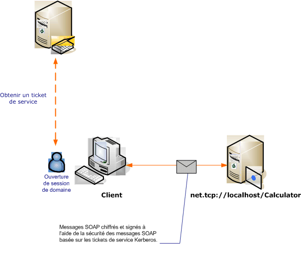

# <a name="message-security-with-a-windows-client-without-credential-negotiation"></a><span data-ttu-id="7ac3f-102">Sécurité de message avec un client Windows sans négociation d'informations d'identification</span><span class="sxs-lookup"><span data-stu-id="7ac3f-102">Message Security with a Windows Client without Credential Negotiation</span></span>
<span data-ttu-id="7ac3f-103">Le scénario suivant montre un client et un service [!INCLUDE[indigo1](../../../../includes/indigo1-md.md)] sécurisés par le protocole Kerberos.</span><span class="sxs-lookup"><span data-stu-id="7ac3f-103">The following scenario shows a [!INCLUDE[indigo1](../../../../includes/indigo1-md.md)] client and service secured by the Kerberos protocol.</span></span>  
  
 <span data-ttu-id="7ac3f-104">Le service et le client appartiennent au même domaine ou domaines approuvés.</span><span class="sxs-lookup"><span data-stu-id="7ac3f-104">Both the service and the client are in the same domain or trusted domains.</span></span>  
  
> [!NOTE]
>  <span data-ttu-id="7ac3f-105">La différence entre ce scénario et [sécurité de Message avec un Client Windows](../../../../docs/framework/wcf/feature-details/message-security-with-a-windows-client.md) est que ce scénario ne négocie pas les informations d’identification de service avec le service avant d’envoyer le message de l’application.</span><span class="sxs-lookup"><span data-stu-id="7ac3f-105">The difference between this scenario and [Message Security with a Windows Client](../../../../docs/framework/wcf/feature-details/message-security-with-a-windows-client.md) is that this scenario does not negotiate the service credential with the service prior to sending the application message.</span></span> <span data-ttu-id="7ac3f-106">En outre, comme cette opération requiert le protocole Kerberos, ce scénario requiert un environnement de domaine Windows.</span><span class="sxs-lookup"><span data-stu-id="7ac3f-106">Additionally, because this requires the Kerberos protocol, this scenario requires a Windows domain environment.</span></span>  
  
 <span data-ttu-id="7ac3f-107"></span><span class="sxs-lookup"><span data-stu-id="7ac3f-107"></span></span>  
  
|<span data-ttu-id="7ac3f-108">Caractéristique</span><span class="sxs-lookup"><span data-stu-id="7ac3f-108">Characteristic</span></span>|<span data-ttu-id="7ac3f-109">Description</span><span class="sxs-lookup"><span data-stu-id="7ac3f-109">Description</span></span>|  
|--------------------|-----------------|  
|<span data-ttu-id="7ac3f-110">Mode de sécurité</span><span class="sxs-lookup"><span data-stu-id="7ac3f-110">Security Mode</span></span>|<span data-ttu-id="7ac3f-111">Message</span><span class="sxs-lookup"><span data-stu-id="7ac3f-111">Message</span></span>|  
|<span data-ttu-id="7ac3f-112">Interopérabilité</span><span class="sxs-lookup"><span data-stu-id="7ac3f-112">Interoperability</span></span>|<span data-ttu-id="7ac3f-113">Oui, WS-Security avec des clients compatibles avec le profil de jeton Kerberos</span><span class="sxs-lookup"><span data-stu-id="7ac3f-113">Yes, WS-Security with Kerberos token-profile compatible clients</span></span>|  
|<span data-ttu-id="7ac3f-114">Authentification (serveur)</span><span class="sxs-lookup"><span data-stu-id="7ac3f-114">Authentication (Server)</span></span>|<span data-ttu-id="7ac3f-115">Authentification mutuelle du serveur et du client</span><span class="sxs-lookup"><span data-stu-id="7ac3f-115">Mutual authentication of the server and client</span></span>|  
|<span data-ttu-id="7ac3f-116">Authentification (client)</span><span class="sxs-lookup"><span data-stu-id="7ac3f-116">Authentication (Client)</span></span>|<span data-ttu-id="7ac3f-117">Authentification mutuelle du serveur et du client</span><span class="sxs-lookup"><span data-stu-id="7ac3f-117">Mutual authentication of the server and client</span></span>|  
|<span data-ttu-id="7ac3f-118">Intégrité</span><span class="sxs-lookup"><span data-stu-id="7ac3f-118">Integrity</span></span>|<span data-ttu-id="7ac3f-119">Oui</span><span class="sxs-lookup"><span data-stu-id="7ac3f-119">Yes</span></span>|  
|<span data-ttu-id="7ac3f-120">Confidentialité</span><span class="sxs-lookup"><span data-stu-id="7ac3f-120">Confidentiality</span></span>|<span data-ttu-id="7ac3f-121">Oui</span><span class="sxs-lookup"><span data-stu-id="7ac3f-121">Yes</span></span>|  
|<span data-ttu-id="7ac3f-122">Transport</span><span class="sxs-lookup"><span data-stu-id="7ac3f-122">Transport</span></span>|<span data-ttu-id="7ac3f-123">HTTP</span><span class="sxs-lookup"><span data-stu-id="7ac3f-123">HTTP</span></span>|  
|<span data-ttu-id="7ac3f-124">Binding</span><span class="sxs-lookup"><span data-stu-id="7ac3f-124">Binding</span></span>|<xref:System.ServiceModel.WSHttpBinding>|  
  
## <a name="service"></a><span data-ttu-id="7ac3f-125">Service</span><span class="sxs-lookup"><span data-stu-id="7ac3f-125">Service</span></span>  
 <span data-ttu-id="7ac3f-126">La configuration et le code ci-dessous sont conçus pour s'exécuter indépendamment.</span><span class="sxs-lookup"><span data-stu-id="7ac3f-126">The following code and configuration are meant to run independently.</span></span> <span data-ttu-id="7ac3f-127">Effectuez l’une des opérations suivantes :</span><span class="sxs-lookup"><span data-stu-id="7ac3f-127">Do one of the following:</span></span>  
  
-   <span data-ttu-id="7ac3f-128">Créez un service autonome à l'aide du code sans configuration.</span><span class="sxs-lookup"><span data-stu-id="7ac3f-128">Create a stand-alone service using the code with no configuration.</span></span>  
  
-   <span data-ttu-id="7ac3f-129">Créez un service à l'aide de la configuration fournie, mais ne définissez pas de point de terminaison.</span><span class="sxs-lookup"><span data-stu-id="7ac3f-129">Create a service using the supplied configuration, but do not define any endpoints.</span></span>  
  
### <a name="code"></a><span data-ttu-id="7ac3f-130">Code</span><span class="sxs-lookup"><span data-stu-id="7ac3f-130">Code</span></span>  
 <span data-ttu-id="7ac3f-131">Le code ci-dessous crée un point de terminaison de service qui utilise la sécurité de message.</span><span class="sxs-lookup"><span data-stu-id="7ac3f-131">The following code creates a service endpoint that uses message security.</span></span> <span data-ttu-id="7ac3f-132">Le code désactive la négociation des informations d'identification du service, et l'établissement d'un jeton de contexte de sécurité (SCT).</span><span class="sxs-lookup"><span data-stu-id="7ac3f-132">The code disables service credential negotiation, and the establishment of a security context token (SCT).</span></span>  
  
> [!NOTE]
>  <span data-ttu-id="7ac3f-133">Pour utiliser le type d'informations d'identification Windows sans négociation, le compte d'utilisateur du service doit avoir accès au nom de principal du service (SPN) enregistré avec le domaine Active Directory.</span><span class="sxs-lookup"><span data-stu-id="7ac3f-133">To use the Windows credential type without negotiation, the service's user account must have access to service principal name (SPN) that is registered with the Active Directory domain.</span></span> <span data-ttu-id="7ac3f-134">Pour cela, deux solutions s'offrent à vous :</span><span class="sxs-lookup"><span data-stu-id="7ac3f-134">You can do this in two ways:</span></span>  
  
1.  <span data-ttu-id="7ac3f-135">Utilisez le compte `NetworkService` ou `LocalSystem` pour exécuter votre service.</span><span class="sxs-lookup"><span data-stu-id="7ac3f-135">Use the `NetworkService` or `LocalSystem` account to run your service.</span></span> <span data-ttu-id="7ac3f-136">Comme ces comptes ont accès à l'ordinateur SPN établi lorsque l'ordinateur joint le domaine Active Directory, [!INCLUDE[indigo2](../../../../includes/indigo2-md.md)] génère automatiquement l'élément SPN correct à l'intérieur du point de terminaison du service dans les métadonnées du service (Web Services Description Language ou WSDL).</span><span class="sxs-lookup"><span data-stu-id="7ac3f-136">Because those accounts have access to the machine SPN that is established when the machine joins the Active Directory domain, [!INCLUDE[indigo2](../../../../includes/indigo2-md.md)] automatically generates the proper SPN element inside the service's endpoint in the service's metadata (Web Services Description Language, or WSDL).</span></span>  
  
2.  <span data-ttu-id="7ac3f-137">Utilisez un compte de domaine Active Directory arbitraire pour exécuter votre service.</span><span class="sxs-lookup"><span data-stu-id="7ac3f-137">Use an arbitrary Active Directory domain account to run your service.</span></span> <span data-ttu-id="7ac3f-138">Dans ce cas, vous devez établir un nom de principal du service pour ce compte de domaine.</span><span class="sxs-lookup"><span data-stu-id="7ac3f-138">In this case, you need to establish an SPN for that domain account.</span></span> <span data-ttu-id="7ac3f-139">Une façon de procéder consiste à faire appel à l'utilitaire Setspn.exe.</span><span class="sxs-lookup"><span data-stu-id="7ac3f-139">One way of doing this is to use the Setspn.exe utility tool.</span></span> <span data-ttu-id="7ac3f-140">Une fois que le nom de principal du service du compte du service a été créé, configurez [!INCLUDE[indigo2](../../../../includes/indigo2-md.md)] pour publier ce nom de principal du service sur les clients du service par le biais de ses métadonnées (WSDL).</span><span class="sxs-lookup"><span data-stu-id="7ac3f-140">Once the SPN is created for the service's account, configure [!INCLUDE[indigo2](../../../../includes/indigo2-md.md)] to publish that SPN to the service's clients through its metadata (WSDL).</span></span> <span data-ttu-id="7ac3f-141">Cette opération s'effectue en définissant l'identité de point de terminaison pour le point de terminaison exposé, par le biais d'un fichier de configuration de l'application ou du code.</span><span class="sxs-lookup"><span data-stu-id="7ac3f-141">This is done by setting the endpoint identity for the exposed endpoint, either though an application configuration file or code.</span></span> <span data-ttu-id="7ac3f-142">L'exemple suivant publie l'identité par programme.</span><span class="sxs-lookup"><span data-stu-id="7ac3f-142">The following example publishes the identity programmatically.</span></span>  
  
 [!INCLUDE[crabout](../../../../includes/crabout-md.md)]<span data-ttu-id="7ac3f-143">Noms principaux de service, le protocole Kerberos et Active Directory, voir [Kerberos supplément technique pour Windows](http://go.microsoft.com/fwlink/?LinkId=88330).</span><span class="sxs-lookup"><span data-stu-id="7ac3f-143"> SPNs, the Kerberos protocol, and Active Directory, see [Kerberos Technical Supplement for Windows](http://go.microsoft.com/fwlink/?LinkId=88330).</span></span> [!INCLUDE[crabout](../../../../includes/crabout-md.md)]<span data-ttu-id="7ac3f-144">identité du point de terminaison, consultez [Modes d’authentification SecurityBindingElement](../../../../docs/framework/wcf/feature-details/securitybindingelement-authentication-modes.md).</span><span class="sxs-lookup"><span data-stu-id="7ac3f-144"> endpoint identities, see [SecurityBindingElement Authentication Modes](../../../../docs/framework/wcf/feature-details/securitybindingelement-authentication-modes.md).</span></span>  
  
 [!code-csharp[C_SecurityScenarios#12](../../../../samples/snippets/csharp/VS_Snippets_CFX/c_securityscenarios/cs/source.cs#12)]
 [!code-vb[C_SecurityScenarios#12](../../../../samples/snippets/visualbasic/VS_Snippets_CFX/c_securityscenarios/vb/source.vb#12)]  
  
### <a name="configuration"></a><span data-ttu-id="7ac3f-145">Configuration</span><span class="sxs-lookup"><span data-stu-id="7ac3f-145">Configuration</span></span>  
 <span data-ttu-id="7ac3f-146">La configuration ci-dessous peut être utilisée à la place du code.</span><span class="sxs-lookup"><span data-stu-id="7ac3f-146">The following configuration can be used instead of the code.</span></span>  
  
```xml  
<?xml version="1.0" encoding="utf-8"?>  
<configuration>  
  <system.serviceModel>  
    <behaviors />  
    <services>  
      <service behaviorConfiguration="" name="ServiceModel.Calculator">  
        <endpoint address="http://localhost/Calculator"   
                  binding="wsHttpBinding"  
                  bindingConfiguration="KerberosBinding"  
                  name="WSHttpBinding_ICalculator"  
                  contract="ServiceModel.ICalculator"   
                  listenUri="net.tcp://localhost/metadata" >  
         <identity>  
            <servicePrincipalName value="service_spn_name" />  
         </identity>  
        </endpoint>  
      </service>  
    </services>  
    <bindings>  
      <wsHttpBinding>  
        <binding name="KerberosBinding">  
          <security>  
            <message negotiateServiceCredential="false"   
                     establishSecurityContext="false" />  
          </security>  
        </binding>  
      </wsHttpBinding>  
    </bindings>  
    <client />  
  </system.serviceModel>  
</configuration>  
```  
  
## <a name="client"></a><span data-ttu-id="7ac3f-147">Client</span><span class="sxs-lookup"><span data-stu-id="7ac3f-147">Client</span></span>  
 <span data-ttu-id="7ac3f-148">La configuration et le code ci-dessous sont conçus pour s'exécuter indépendamment.</span><span class="sxs-lookup"><span data-stu-id="7ac3f-148">The following code and configuration are meant to run independently.</span></span> <span data-ttu-id="7ac3f-149">Effectuez l’une des opérations suivantes :</span><span class="sxs-lookup"><span data-stu-id="7ac3f-149">Do one of the following:</span></span>  
  
-   <span data-ttu-id="7ac3f-150">Créez un client autonome à l'aide du code (et du code client).</span><span class="sxs-lookup"><span data-stu-id="7ac3f-150">Create a stand-alone client using the code (and client code).</span></span>  
  
-   <span data-ttu-id="7ac3f-151">Créez un client qui ne définit pas d'adresse de point de terminaison.</span><span class="sxs-lookup"><span data-stu-id="7ac3f-151">Create a client that does not define any endpoint addresses.</span></span> <span data-ttu-id="7ac3f-152">Au lieu de cela, utilisez le constructeur client qui accepte le nom de configuration comme argument.</span><span class="sxs-lookup"><span data-stu-id="7ac3f-152">Instead, use the client constructor that takes the configuration name as an argument.</span></span> <span data-ttu-id="7ac3f-153">Par exemple :</span><span class="sxs-lookup"><span data-stu-id="7ac3f-153">For example:</span></span>  
  
     [!code-csharp[C_SecurityScenarios#0](../../../../samples/snippets/csharp/VS_Snippets_CFX/c_securityscenarios/cs/source.cs#0)]
     [!code-vb[C_SecurityScenarios#0](../../../../samples/snippets/visualbasic/VS_Snippets_CFX/c_securityscenarios/vb/source.vb#0)]  
  
### <a name="code"></a><span data-ttu-id="7ac3f-154">Code</span><span class="sxs-lookup"><span data-stu-id="7ac3f-154">Code</span></span>  
 <span data-ttu-id="7ac3f-155">Le code ci-dessous configure le client.</span><span class="sxs-lookup"><span data-stu-id="7ac3f-155">The following code configures the client.</span></span> <span data-ttu-id="7ac3f-156">Le mode de sécurité a la valeur Message, et le type d'informations d'identification du client a la valeur Windows.</span><span class="sxs-lookup"><span data-stu-id="7ac3f-156">The security mode is set to Message, and the client credential type is set to Windows.</span></span> <span data-ttu-id="7ac3f-157">Notez que les propriétés <xref:System.ServiceModel.MessageSecurityOverHttp.NegotiateServiceCredential%2A> et <xref:System.ServiceModel.NonDualMessageSecurityOverHttp.EstablishSecurityContext%2A> ont la valeur `false`.</span><span class="sxs-lookup"><span data-stu-id="7ac3f-157">Note that the <xref:System.ServiceModel.MessageSecurityOverHttp.NegotiateServiceCredential%2A> and <xref:System.ServiceModel.NonDualMessageSecurityOverHttp.EstablishSecurityContext%2A> properties are set to `false`.</span></span>  
  
> [!NOTE]
>  <span data-ttu-id="7ac3f-158">Pour utiliser le type d'informations d'identification Windows sans négociation, le client doit être configuré avec le compte SPN du service avant de commencer la communication avec le service.</span><span class="sxs-lookup"><span data-stu-id="7ac3f-158">To use Windows credential type without negotiation, the client must be configured with the service's account SPN prior to commencing the communication with the service.</span></span> <span data-ttu-id="7ac3f-159">Le client utilise le nom de principal du service pour obtenir le jeton Kerberos afin d'authentifier et de sécuriser la communication avec le service.</span><span class="sxs-lookup"><span data-stu-id="7ac3f-159">The client uses the SPN to get the Kerberos token to authenticate and secure the communication with the service.</span></span> <span data-ttu-id="7ac3f-160">L'exemple suivant montre comment configurer le client avec le nom principal du service.</span><span class="sxs-lookup"><span data-stu-id="7ac3f-160">The following sample shows how to configure the client with the service's SPN.</span></span> <span data-ttu-id="7ac3f-161">Si vous utilisez la [ServiceModel Metadata Utility Tool (Svcutil.exe)](../../../../docs/framework/wcf/servicemodel-metadata-utility-tool-svcutil-exe.md) pour générer le client, le SPN du service n’est automatiquement propagé vers le client dans les métadonnées du service (WSDL), si les métadonnées du service contient Ces informations.</span><span class="sxs-lookup"><span data-stu-id="7ac3f-161">If you are using the [ServiceModel Metadata Utility Tool (Svcutil.exe)](../../../../docs/framework/wcf/servicemodel-metadata-utility-tool-svcutil-exe.md) to generate the client, the service's SPN will be automatically propagated to the client from the service's metadata (WSDL), if the service's metadata contains that information.</span></span> [!INCLUDE[crabout](../../../../includes/crabout-md.md)]<span data-ttu-id="7ac3f-162"> la configuration du service pour inclure son SPN dans ses métadonnées, consultez la section « Service » plus loin dans cette rubrique.</span><span class="sxs-lookup"><span data-stu-id="7ac3f-162"> how to configure the service to include its SPN in the service's metadata, see the "Service" section later in this topic .</span></span>  
>   
>  <span data-ttu-id="7ac3f-163">Pour plus d’informations sur les SPN, Kerberos et Active Directory, consultez [Kerberos supplément technique pour Windows](http://go.microsoft.com/fwlink/?LinkId=88330).</span><span class="sxs-lookup"><span data-stu-id="7ac3f-163">For more information about SPNs, Kerberos, and Active Directory, see [Kerberos Technical Supplement for Windows](http://go.microsoft.com/fwlink/?LinkId=88330).</span></span> [!INCLUDE[crabout](../../../../includes/crabout-md.md)]<span data-ttu-id="7ac3f-164">identité du point de terminaison, consultez [Modes d’authentification SecurityBindingElement](../../../../docs/framework/wcf/feature-details/securitybindingelement-authentication-modes.md) rubrique.</span><span class="sxs-lookup"><span data-stu-id="7ac3f-164"> endpoint identities, see [SecurityBindingElement Authentication Modes](../../../../docs/framework/wcf/feature-details/securitybindingelement-authentication-modes.md) topic.</span></span>  
  
 [!code-csharp[C_SecurityScenarios#19](../../../../samples/snippets/csharp/VS_Snippets_CFX/c_securityscenarios/cs/source.cs#19)]
 [!code-vb[C_SecurityScenarios#19](../../../../samples/snippets/visualbasic/VS_Snippets_CFX/c_securityscenarios/vb/source.vb#19)]  
  
### <a name="configuration"></a><span data-ttu-id="7ac3f-165">Configuration</span><span class="sxs-lookup"><span data-stu-id="7ac3f-165">Configuration</span></span>  
 <span data-ttu-id="7ac3f-166">Le code ci-dessous configure le client.</span><span class="sxs-lookup"><span data-stu-id="7ac3f-166">The following code configures the client.</span></span> <span data-ttu-id="7ac3f-167">Notez que la [ \<servicePrincipalName >](../../../../docs/framework/configure-apps/file-schema/wcf/serviceprincipalname.md) élément doit être défini pour faire correspondre le SPN du service inscrit pour le compte du service dans le domaine Active Directory.</span><span class="sxs-lookup"><span data-stu-id="7ac3f-167">Note that the [\<servicePrincipalName>](../../../../docs/framework/configure-apps/file-schema/wcf/serviceprincipalname.md) element must be set to match the service's SPN as registered for the service's account in the Active Directory domain.</span></span>  
  
```xml  
<?xml version="1.0" encoding="utf-8"?>  
<configuration>  
  <system.serviceModel>  
    <bindings>  
      <wsHttpBinding>  
        <binding name="WSHttpBinding_ICalculator" >  
          <security mode="Message">  
            <message clientCredentialType="Windows"   
                     negotiateServiceCredential="false"  
                     establishSecurityContext="false" />  
          </security>  
        </binding>  
      </wsHttpBinding>  
    </bindings>  
    <client>  
      <endpoint address="http://localhost/Calculator"   
                binding="wsHttpBinding"  
                bindingConfiguration="WSHttpBinding_ICalculator"  
                contract="ICalculator"  
                name="WSHttpBinding_ICalculator">  
        <identity>  
          <servicePrincipalName value="service_spn_name" />  
        </identity>  
      </endpoint>  
    </client>  
  </system.serviceModel>  
</configuration>  
```  
  
## <a name="see-also"></a><span data-ttu-id="7ac3f-168">Voir aussi</span><span class="sxs-lookup"><span data-stu-id="7ac3f-168">See Also</span></span>  
 [<span data-ttu-id="7ac3f-169">Vue d’ensemble de la sécurité</span><span class="sxs-lookup"><span data-stu-id="7ac3f-169">Security Overview</span></span>](../../../../docs/framework/wcf/feature-details/security-overview.md)  
 [<span data-ttu-id="7ac3f-170">L’authentification et identité de Service</span><span class="sxs-lookup"><span data-stu-id="7ac3f-170">Service Identity and Authentication</span></span>](../../../../docs/framework/wcf/feature-details/service-identity-and-authentication.md)  
 [<span data-ttu-id="7ac3f-171">Modèle de sécurité pour Windows Server AppFabric</span><span class="sxs-lookup"><span data-stu-id="7ac3f-171">Security Model for Windows Server App Fabric</span></span>](http://go.microsoft.com/fwlink/?LinkID=201279&clcid=0x409)
