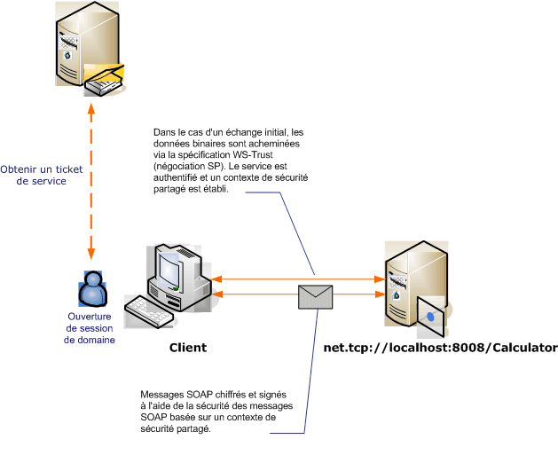

# <a name="message-security-with-a-windows-client"></a><span data-ttu-id="e3c06-102">Sécurité de message avec un client Windows</span><span class="sxs-lookup"><span data-stu-id="e3c06-102">Message Security with a Windows Client</span></span>
<span data-ttu-id="e3c06-103">Dans le scénario suivant, le client [!INCLUDE[indigo1](../../../../includes/indigo1-md.md)] et le serveur sont sécurisés à l'aide du mode de sécurité de niveau message.</span><span class="sxs-lookup"><span data-stu-id="e3c06-103">This scenario shows a [!INCLUDE[indigo1](../../../../includes/indigo1-md.md)] client and server secured by message security mode.</span></span> <span data-ttu-id="e3c06-104">Le client et le service sont authentifiés à l'aide des informations d'identification Windows.</span><span class="sxs-lookup"><span data-stu-id="e3c06-104">The client and service are authenticated using Windows credentials.</span></span>  
  
 <span data-ttu-id="e3c06-105"></span><span class="sxs-lookup"><span data-stu-id="e3c06-105"></span></span>  
  
|<span data-ttu-id="e3c06-106">Caractéristique</span><span class="sxs-lookup"><span data-stu-id="e3c06-106">Characteristic</span></span>|<span data-ttu-id="e3c06-107">Description</span><span class="sxs-lookup"><span data-stu-id="e3c06-107">Description</span></span>|  
|--------------------|-----------------|  
|<span data-ttu-id="e3c06-108">Mode de sécurité</span><span class="sxs-lookup"><span data-stu-id="e3c06-108">Security Mode</span></span>|<span data-ttu-id="e3c06-109">Message</span><span class="sxs-lookup"><span data-stu-id="e3c06-109">Message</span></span>|  
|<span data-ttu-id="e3c06-110">Interopérabilité</span><span class="sxs-lookup"><span data-stu-id="e3c06-110">Interoperability</span></span>|[!INCLUDE[indigo2](../../../../includes/indigo2-md.md)]<span data-ttu-id="e3c06-111"> uniquement</span><span class="sxs-lookup"><span data-stu-id="e3c06-111"> Only</span></span>|  
|<span data-ttu-id="e3c06-112">Authentification (serveur)</span><span class="sxs-lookup"><span data-stu-id="e3c06-112">Authentication (Server)</span></span>|<span data-ttu-id="e3c06-113">Authentification mutuelle du serveur et du client</span><span class="sxs-lookup"><span data-stu-id="e3c06-113">Mutual authentication of the server and client</span></span>|  
|<span data-ttu-id="e3c06-114">Authentification (client)</span><span class="sxs-lookup"><span data-stu-id="e3c06-114">Authentication (Client)</span></span>|<span data-ttu-id="e3c06-115">Authentification mutuelle du serveur et du client</span><span class="sxs-lookup"><span data-stu-id="e3c06-115">Mutual authentication of the server and client</span></span>|  
|<span data-ttu-id="e3c06-116">Intégrité</span><span class="sxs-lookup"><span data-stu-id="e3c06-116">Integrity</span></span>|<span data-ttu-id="e3c06-117">Oui, à l'aide du contexte de sécurité partagé</span><span class="sxs-lookup"><span data-stu-id="e3c06-117">Yes, using shared security context</span></span>|  
|<span data-ttu-id="e3c06-118">Confidentialité</span><span class="sxs-lookup"><span data-stu-id="e3c06-118">Confidentiality</span></span>|<span data-ttu-id="e3c06-119">Oui, à l'aide du contexte de sécurité partagé</span><span class="sxs-lookup"><span data-stu-id="e3c06-119">Yes, using shared security context</span></span>|  
|<span data-ttu-id="e3c06-120">Transport</span><span class="sxs-lookup"><span data-stu-id="e3c06-120">Transport</span></span>|<span data-ttu-id="e3c06-121">NET.TCP</span><span class="sxs-lookup"><span data-stu-id="e3c06-121">NET.TCP</span></span>|  
|<span data-ttu-id="e3c06-122">Liaison</span><span class="sxs-lookup"><span data-stu-id="e3c06-122">Binding</span></span>|<xref:System.ServiceModel.NetTcpBinding>|  
  
## <a name="service"></a><span data-ttu-id="e3c06-123">Service</span><span class="sxs-lookup"><span data-stu-id="e3c06-123">Service</span></span>  
 <span data-ttu-id="e3c06-124">La configuration et le code ci-dessous sont conçus pour s'exécuter indépendamment.</span><span class="sxs-lookup"><span data-stu-id="e3c06-124">The following code and configuration are meant to run independently.</span></span> <span data-ttu-id="e3c06-125">Effectuez l’une des opérations suivantes :</span><span class="sxs-lookup"><span data-stu-id="e3c06-125">Do one of the following:</span></span>  
  
-   <span data-ttu-id="e3c06-126">Créez un service autonome à l'aide du code sans configuration.</span><span class="sxs-lookup"><span data-stu-id="e3c06-126">Create a stand-alone service using the code with no configuration.</span></span>  
  
-   <span data-ttu-id="e3c06-127">Créez un service à l'aide de la configuration fournie, mais ne définissez pas de point de terminaison.</span><span class="sxs-lookup"><span data-stu-id="e3c06-127">Create a service using the supplied configuration, but do not define any endpoints.</span></span>  
  
### <a name="code"></a><span data-ttu-id="e3c06-128">Code</span><span class="sxs-lookup"><span data-stu-id="e3c06-128">Code</span></span>  
 <span data-ttu-id="e3c06-129">Le code suivant indique comment créer un point de terminaison de service qui utilise la sécurité de message pour établir un contexte sécurisé lorsqu'un ordinateur sous Windows est utilisé.</span><span class="sxs-lookup"><span data-stu-id="e3c06-129">The following code shows how to create a service endpoint that uses message security to establish a secure context with a Windows machine.</span></span>  
  
 [!code-csharp[C_SecurityScenarios#11](../../../../samples/snippets/csharp/VS_Snippets_CFX/c_securityscenarios/cs/source.cs#11)]
 [!code-vb[C_SecurityScenarios#11](../../../../samples/snippets/visualbasic/VS_Snippets_CFX/c_securityscenarios/vb/source.vb#11)]  
  
### <a name="configuration"></a><span data-ttu-id="e3c06-130">Configuration</span><span class="sxs-lookup"><span data-stu-id="e3c06-130">Configuration</span></span>  
 <span data-ttu-id="e3c06-131">La configuration suivante peut être utilisée à la place du code pour paramétrer le service :</span><span class="sxs-lookup"><span data-stu-id="e3c06-131">The following configuration can be used instead of the code to set up the service:</span></span>  
  
```xml  
<?xml version="1.0" encoding="utf-8"?>  
<configuration>  
  <system.serviceModel>  
    <services>  
      <service behaviorConfiguration=""  
               name="ServiceModel.Calculator">  
        <endpoint address="net.tcp://localhost:8008/Calculator"  
                  binding="netTcpBinding"  
                  bindingConfiguration="Windows"  
                  name="WindowsOverMessage"  
                  contract="ServiceModel.ICalculator" />  
      </service>  
    </services>  
    <bindings>  
      <netTcpBinding>  
        <binding name="Windows">  
          <security mode="Message">  
            <message clientCredentialType="Windows" />  
          </security>  
        </binding>  
      </netTcpBinding>  
    </bindings>  
    <client />  
  </system.serviceModel>  
</configuration>  
```  
  
## <a name="client"></a><span data-ttu-id="e3c06-132">Client</span><span class="sxs-lookup"><span data-stu-id="e3c06-132">Client</span></span>  
 <span data-ttu-id="e3c06-133">La configuration et le code ci-dessous sont conçus pour s'exécuter indépendamment.</span><span class="sxs-lookup"><span data-stu-id="e3c06-133">The following code and configuration are meant to run independently.</span></span> <span data-ttu-id="e3c06-134">Effectuez l’une des opérations suivantes :</span><span class="sxs-lookup"><span data-stu-id="e3c06-134">Do one of the following:</span></span>  
  
-   <span data-ttu-id="e3c06-135">Créez un client autonome à l'aide du code (et du code client).</span><span class="sxs-lookup"><span data-stu-id="e3c06-135">Create a stand-alone client using the code (and client code).</span></span>  
  
-   <span data-ttu-id="e3c06-136">Créez un client qui ne définit pas d'adresse de point de terminaison.</span><span class="sxs-lookup"><span data-stu-id="e3c06-136">Create a client that does not define any endpoint addresses.</span></span> <span data-ttu-id="e3c06-137">Au lieu de cela, utilisez le constructeur client qui accepte le nom de configuration comme argument.</span><span class="sxs-lookup"><span data-stu-id="e3c06-137">Instead, use the client constructor that takes the configuration name as an argument.</span></span> <span data-ttu-id="e3c06-138">Par exemple :</span><span class="sxs-lookup"><span data-stu-id="e3c06-138">For example:</span></span>  
  
     [!code-csharp[C_SecurityScenarios#0](../../../../samples/snippets/csharp/VS_Snippets_CFX/c_securityscenarios/cs/source.cs#0)]
     [!code-vb[C_SecurityScenarios#0](../../../../samples/snippets/visualbasic/VS_Snippets_CFX/c_securityscenarios/vb/source.vb#0)]  
  
### <a name="code"></a><span data-ttu-id="e3c06-139">Code</span><span class="sxs-lookup"><span data-stu-id="e3c06-139">Code</span></span>  
 <span data-ttu-id="e3c06-140">Le code suivant crée un client.</span><span class="sxs-lookup"><span data-stu-id="e3c06-140">The following code creates a client.</span></span> <span data-ttu-id="e3c06-141">La liaison est définie au mode de sécurité de niveau message et le type d'informations d'identification du client a la valeur `Windows`.</span><span class="sxs-lookup"><span data-stu-id="e3c06-141">The binding is to Message mode security, and the client credential type is set to `Windows`.</span></span>  
  
 [!code-csharp[C_SecurityScenarios#18](../../../../samples/snippets/csharp/VS_Snippets_CFX/c_securityscenarios/cs/source.cs#18)]
 [!code-vb[C_SecurityScenarios#18](../../../../samples/snippets/visualbasic/VS_Snippets_CFX/c_securityscenarios/vb/source.vb#18)]  
  
### <a name="configuration"></a><span data-ttu-id="e3c06-142">Configuration</span><span class="sxs-lookup"><span data-stu-id="e3c06-142">Configuration</span></span>  
 <span data-ttu-id="e3c06-143">La configuration suivante est utilisée pour définir les propriétés du client.</span><span class="sxs-lookup"><span data-stu-id="e3c06-143">The following configuration is used to set the client properties.</span></span>  
  
```xml  
<?xml version="1.0" encoding="utf-8"?>  
<configuration>  
  <system.serviceModel>  
    <bindings>  
      <netTcpBinding>  
        <binding name="NetTcpBinding_ICalculator" >  
         <security mode="Message">  
            <message clientCredentialType="Windows" />  
          </security>  
        </binding>  
      </netTcpBinding>  
    </bindings>  
    <client>  
      <endpoint address="net.tcp://machineName:8008/Calculator"   
                binding="netTcpBinding"  
                bindingConfiguration="NetTcpBinding_ICalculator"  
                contract="ICalculator"  
                name="NetTcpBinding_ICalculator">          
      </endpoint>  
    </client>  
  </system.serviceModel>  
</configuration>  
```  
  
## <a name="see-also"></a><span data-ttu-id="e3c06-144">Voir aussi</span><span class="sxs-lookup"><span data-stu-id="e3c06-144">See Also</span></span>  
 [<span data-ttu-id="e3c06-145">Vue d’ensemble de la sécurité</span><span class="sxs-lookup"><span data-stu-id="e3c06-145">Security Overview</span></span>](../../../../docs/framework/wcf/feature-details/security-overview.md)  
 [<span data-ttu-id="e3c06-146">Modèle de sécurité pour Windows Server AppFabric</span><span class="sxs-lookup"><span data-stu-id="e3c06-146">Security Model for Windows Server App Fabric</span></span>](http://go.microsoft.com/fwlink/?LinkID=201279&clcid=0x409)
