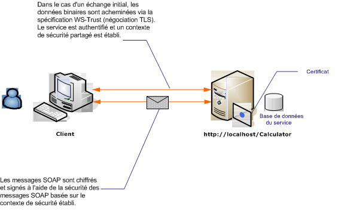

# <a name="message-security-with-an-anonymous-client"></a>Sécurité de message avec un client anonyme
Le scénario suivant illustre un client et le service sécurisé par la sécurité de message [!INCLUDE[indigo1](../../../../includes/indigo1-md.md)]. L'un des objectifs de conception consiste à utiliser la sécurité de message plutôt que la sécurité de transport, afin qu'à l'avenir il puisse prendre en charge un modèle plus riche basé sur les revendications. [!INCLUDE[crabout](../../../../includes/crabout-md.md)]l’utilisation des revendications riche pour l’autorisation, consultez [la gestion des revendications et autorisation avec le modèle d’identité](../../../../docs/framework/wcf/feature-details/managing-claims-and-authorization-with-the-identity-model.md).  
  
 Pour un exemple d’application, consultez [Message Security Anonymous](../../../../docs/framework/wcf/samples/message-security-anonymous.md).  
  
   
  
|Caractéristique|Description|  
|--------------------|-----------------|  
|Mode de sécurité|Message|  
|Interopérabilité|[!INCLUDE[indigo2](../../../../includes/indigo2-md.md)] uniquement|  
|Authentification (serveur)|La négociation initiale requiert l'authentification du serveur, mais pas l'authentification du client|  
|Authentification (client)|None|  
|Intégrité|Oui, à l'aide du contexte de sécurité partagé|  
|Confidentialité|Oui, à l'aide du contexte de sécurité partagé|  
|Transport|HTTP|  
  
## <a name="service"></a>Service  
 La configuration et le code ci-dessous sont conçus pour s'exécuter indépendamment. Effectuez l’une des opérations suivantes :  
  
-   Créez un service autonome à l'aide du code sans configuration.  
  
-   Créez un service à l'aide de la configuration fournie, mais ne définissez pas de point de terminaison.  
  
### <a name="code"></a>Code  
 Le code suivant montre comment créer un point de terminaison de service qui utilise la sécurité de message.  
  
 [!code-csharp[C_SecurityScenarios#8](../../../../samples/snippets/csharp/VS_Snippets_CFX/c_securityscenarios/cs/source.cs#8)]
 [!code-vb[C_SecurityScenarios#8](../../../../samples/snippets/visualbasic/VS_Snippets_CFX/c_securityscenarios/vb/source.vb#8)]  
  
### <a name="configuration"></a>Configuration  
 La configuration ci-dessous peut être utilisée à la place du code. L'élément de comportement du service est utilisé pour spécifier un certificat servant à authentifier le service auprès du client. L'élément de service doit spécifier le comportement à l'aide de l'attribut `behaviorConfiguration`. L'élément de liaison spécifie que le type d'informations d'identification du client est `None`, ce qui permet aux clients anonymes d'utiliser le service.  
  
```xml  
<?xml version="1.0" encoding="utf-8"?>  
<configuration>  
  <system.serviceModel>  
    <behaviors>  
      <serviceBehaviors>  
        <behavior name="ServiceCredentialsBehavior">  
          <serviceCredentials>  
            <serviceCertificate findValue="contoso.com"   
                                storeLocation="LocalMachine"  
                                storeName="My" />  
          </serviceCredentials>  
        </behavior>  
      </serviceBehaviors>  
    </behaviors>  
    <services>  
      <service behaviorConfiguration="ServiceCredentialsBehavior"   
               name="ServiceModel.Calculator">  
        <endpoint address="http://localhost/Calculator"   
                  binding="wsHttpBinding"  
                  bindingConfiguration="WSHttpBinding_ICalculator"   
                  name="CalculatorService"  
                  contract="ServiceModel.ICalculator" />  
      </service>  
    </services>  
    <bindings>  
      <wsHttpBinding>  
        <binding name="WSHttpBinding_ICalculator" >  
          <security mode="Message">  
            <message clientCredentialType="None" />  
          </security>  
        </binding>  
      </wsHttpBinding>  
    </bindings>  
    <client />  
  </system.serviceModel>  
</configuration>  
```  
  
## <a name="client"></a>Client  
 La configuration et le code ci-dessous sont conçus pour s'exécuter indépendamment. Effectuez l’une des opérations suivantes :  
  
-   Créez un client autonome à l'aide du code (et du code client).  
  
-   Créez un client qui ne définit pas d'adresse de point de terminaison. Au lieu de cela, utilisez le constructeur client qui accepte le nom de configuration comme argument. Par exemple :  
  
     [!code-csharp[C_SecurityScenarios#0](../../../../samples/snippets/csharp/VS_Snippets_CFX/c_securityscenarios/cs/source.cs#0)]
     [!code-vb[C_SecurityScenarios#0](../../../../samples/snippets/visualbasic/VS_Snippets_CFX/c_securityscenarios/vb/source.vb#0)]  
  
### <a name="code"></a>Code  
 Le code suivant crée une instance du client. La liaison utilise le mode de sécurité au niveau du message, et le type d'informations d'identification du client a la valeur Aucun.  
  
 [!code-csharp[C_SecurityScenarios#15](../../../../samples/snippets/csharp/VS_Snippets_CFX/c_securityscenarios/cs/source.cs#15)]
 [!code-vb[C_SecurityScenarios#15](../../../../samples/snippets/visualbasic/VS_Snippets_CFX/c_securityscenarios/vb/source.vb#15)]  
  
### <a name="configuration"></a>Configuration  
 Le code ci-dessous configure le client.  
  
```xml  
<?xml version="1.0" encoding="utf-8"?>  
<configuration>  
  <system.serviceModel>  
    <bindings>  
      <wsHttpBinding>  
        <binding name="WSHttpBinding_ICalculator" >  
          <security mode="Message">  
            <message clientCredentialType="None" />  
          </security>  
        </binding>  
      </wsHttpBinding>  
    </bindings>  
    <client>  
      <endpoint address="http://machineName/Calculator"  
        binding="wsHttpBinding"  
        bindingConfiguration="WSHttpBinding_ICalculator"   
        contract="ICalculator"  
        name="WSHttpBinding_ICalculator">  
        <identity>  
          <dns value="contoso.com" />  
        </identity>  
      </endpoint>  
    </client>  
  </system.serviceModel>  
</configuration>  
```  
  
## <a name="see-also"></a>Voir aussi  
 [Vue d’ensemble de la sécurité](../../../../docs/framework/wcf/feature-details/security-overview.md)  
 [Sécurité des applications distribuées](../../../../docs/framework/wcf/feature-details/distributed-application-security.md)  
 [Sécurité de message anonyme](../../../../docs/framework/wcf/samples/message-security-anonymous.md)  
 [Identité du service et authentification](../../../../docs/framework/wcf/feature-details/service-identity-and-authentication.md)  
 [Modèle de sécurité pour Windows Server AppFabric](http://go.microsoft.com/fwlink/?LinkID=201279&clcid=0x409)
