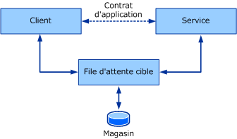
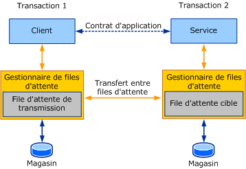

# Vue d'ensemble des files d'attente
Cette section présente les concepts généraux et principaux relatifs à la communication mise en file d'attente. Les sections suivantes fournissent des détails sur la manière dont les concepts de mise en file d'attente décrits dans cette rubrique se présentent dans [!INCLUDE[indigo1](../../../../includes/indigo1-md.md)].  
  
## Concepts de base de la mise en file d'attente  
 Lors de la conception d'une application distribuée, le choix du bon transport pour la communication entre les services et les clients est important. Plusieurs facteurs affectent le type de transport à utiliser. Un facteur important, l'isolement entre le service, le client et le transport, détermine l'utilisation d'un transport de mise en file d'attente ou d'un transport direct, tel que TCP ou HTTP. En raison de la nature des transports directs tels que TCP et HTTP, la communication s'arrête complètement si le service ou le client cessent de fonctionner ou en cas de défaillance du réseau. Le service, le client et le réseau doivent s'exécuter en même temps pour que l'application fonctionne. Les transports de mise en file d'attente fournissent l'isolement, ce qui signifie qu'en cas de défaillance du service ou du client ou des liaisons de communication entre ces derniers, le client et le service peuvent continuer à fonctionner.  
  
 Les files d'attente fournissent une communication fiable même en cas de défaillance des correspondants ou du réseau. Les files d'attente capturent et remettent les messages échangés entre les correspondants. Les files d'attente sont généralement soutenues par un type de magasin, ce qui peut être volatile ou durable. Les files d'attente stockent les messages d'un client pour le compte d'un service et transmettent ultérieurement ces messages au service. Les files d'attente d'indirection fournissent un isolement garanti des défaillances pour chaque correspondant, ce qui fait d'elles le mécanisme de communication par défaut préféré pour les systèmes à forte disponibilité et les services déconnectés. L'indirection est la conséquence d'une latence élevée. *Latence* est le délai entre le moment que le client envoie un message et l’heure de réception par le service. Cela signifie qu'une fois un message envoyé, vous ne savez pas quand celui-ci peut être traité. La plupart des applications en file d'attente s'accommodent d'une latence élevée. L'illustration suivante montre un modèle conceptuel de la communication en file d'attente.  
  
   
  
 Modèle conceptuel de la communication en file d'attente  
  
 En fait, la file d'attente est un concept distribué. En tant que tel, la file d'attente peut être locale ou distante pour les correspondants. En général, la file d'attente est locale au service. Dans cette configuration, le client ne peut pas dépendre de la connectivité de la file d'attente distante pour être constamment disponible. De la même façon, la file d'attente doit être disponible quelle que soit la disponibilité du service qui lit la file d'attente. Un gestionnaire de files d'attente gère un ensemble de files d'attente. Il est chargé d'accepter les messages envoyés à ses files d'attente par d'autres gestionnaires de files d'attente. Il doit aussi gérer la connectivité aux files d'attente distantes et le transfert des messages à ces files d'attente distantes. Pour garantir la disponibilité des files d'attente en cas de défaillances de l'application du service ou du client, le gestionnaire de files d'attente est exécuté en général comme un service externe.  
  
 Lorsqu'un client envoie un message à une file d'attente, il adresse le message à la file d'attente cible qui est la file d'attente gérée par le gestionnaire de files d'attente du service. Le gestionnaire de files d'attente sur le client envoie le message à une file d'attente de transmission (ou sortante). La file d'attente de transmission est une file d'attente sur le gestionnaire de files d'attente client qui stocke des messages pour la transmission à la file d'attente cible. Le gestionnaire de files d'attente recherche ensuite un chemin d'accès au gestionnaire de files d'attente qui possède la file d'attente cible et lui transfère le message. Pour garantir une communication fiable, les gestionnaires de files d'attente implémentent un protocole de transfert fiable pour empêcher la perte de données. Le gestionnaire de file d'attente de destination accepte les messages adressés aux files d'attente cibles qu'il possède et stocke les messages. Le service effectue une demande de lecture de la file d'attente cible ; le gestionnaire de files d'attente remet alors le message à l'application de destination. L'illustration suivante montre la communication entre les quatre correspondants.  
  
   
  
 Communication en file d'attente dans un scénario de déploiement typique  
  
 Ainsi, le gestionnaire de files d'attente fournit l'isolement nécessaire qui autorise la défaillance possible de l'expéditeur et du récepteur de manière indépendante sans affecter la communication elle-même. L'avantage de l'indirection supplémentaire fournie par les files d'attente permet aussi à plusieurs instances d'application de lire la même file d'attente et aux nœuds d'obtenir un débit plus élevé. Par conséquent, il n'est pas rare de faire appel aux files d'attente pour répondre à des exigences de débit et d'échelle supérieures.  
  
## Files d'attente et transactions  
 Les transactions vous permettent de regrouper un jeu d'opérations pour que toutes les opérations échouent si une seule opération échoue. Un exemple d'utilisation des transactions est lorsqu'une personne utilise un distributeur de billets pour transférer 1 000 € de son compte épargne vers son compte chèques. Cela entraîne les opérations suivantes :  
  
-   Le retrait de 1 000 € du compte épargne.  
  
-   Le placement de 1 000 € sur le compte chèques.  
  
 Si la première opération réussit et que les 1 000 € sont retirés du compte épargne mais que la deuxième opération échoue, les 1 000 € sont perdus parce qu'ils ont déjà été retirés du compte épargne. Pour garantir la validité des comptes, si une opération échoue, les deux opérations doivent échouer.  
  
 En messagerie transactionnelle, les messages peuvent être envoyés à la file d'attente et reçus de la file d'attente sous une transaction. Donc, si un message est envoyé dans une transaction et que celle-ci est restaurée, cela revient à n'avoir jamais envoyé le message à la file d'attente. De même, si un message est reçu dans une transaction et que celle-ci est restaurée, cela revient à n'avoir jamais reçu le message. Le message reste dans la file d'attente pour être lu.  
  
 En raison d'une latence élevée, lorsque vous envoyez un message, vous ne pouvez pas connaître le temps nécessaire pour que celui-ci atteigne sa file d'attente cible, ni le temps qu'il faudra au service pour le traiter. De ce fait, il est souhaitable de ne pas utiliser une transaction unique pour envoyer le message, le recevoir puis le traiter. Cela crée une transaction qui reste invalidée durant une période indéterminée. Lorsqu'un client et un service communiquent par l'intermédiaire d'une file d'attente à l'aide d'une transaction, deux transactions sont impliquées : une sur le client et une sur le service. L’illustration suivante montre les limites de la transaction dans une communication en file d’attente standard.  
  
   
  
 La communication en file d’attente affiche des transactions distinctes pour la capture et la remise.  
  
 La transaction cliente traite et envoie le message. Lorsque la transaction est validée, le message est dans la file d'attente de transmission. Sur le service, la transaction lit le message de la file d'attente cible, traite le message, puis valide la transaction. Si une erreur se produit pendant le traitement, le message est annulé et placé dans la file d'attente cible.  
  
## Communication asynchrone à l'aide de files d'attente  
 Les files d'attente fournissent un moyen asynchrone de communication. Les applications qui envoient des messages à l'aide de files d'attente ne peuvent pas attendre la réception du message et son traitement par le récepteur en raison de la latence élevée que présente le gestionnaire de files d'attente. Les messages peuvent rester dans la file d'attente pour une durée bien supérieure à celle prévue par l'application. Pour éviter cela, l'application peut spécifier une valeur de durée de vie sur le message. Cette valeur spécifie combien de temps le message doit rester dans la file d'attente de transmission. Si cette valeur de temps est dépassée, et que le message n'a pas encore été envoyé à la file d'attente cible, le message peut être transféré à une file d'attente de lettres mortes.  
  
 Lorsque l'expéditeur envoie un message, le retour de l'opération d'envoi implique que le message est parvenu seulement à la file d'attente de transmission sur l'expéditeur. Dans ce cas, s'il y a une défaillance dans la remise du message à la file d'attente cible, l'application émettrice ne peut pas le savoir immédiatement. Pour prendre acte de ces défaillances, le message en échec est transféré à une file d'attente de lettres mortes.  
  
 Toute erreur, par exemple lorsqu'un message ne peut pas atteindre la file d'attente cible ou lors de l'expiration de la durée de vie, doit être traitée séparément. Ainsi, il arrive que les applications en file d'attente écrivent deux jeux de logique :  
  
-   La logique normale du client et du service relative à l'envoi et à la réception des messages.  
  
-   La logique de compensation chargée de gérer les messages issus de la transmission ou de la remise ayant échoué.  
  
 Les sections suivantes traitent de ces concepts.  
  
## Programmation de la file d'attente de lettres mortes.  
 Les files d'attente de lettres mortes contiennent des messages qui ne sont pas parvenus à la file d'attente cible pour différentes raisons. Les raisons peuvent porter sur des messages arrivés à expiration et des problèmes de connectivité qui empêchent le transfert du message vers la file d'attente cible.  
  
 En général, une application peut lire des messages dans une file d'attente de lettres mortes à l'échelle du système, déterminer le mauvais fonctionnement et prendre les mesures appropriées, telles que corriger les erreurs et renvoyer le message ou en prendre note.  
  
## Programmation de la file d'attente du message incohérent  
 Une fois qu'un message parvient dans la file d'attente cible, son traitement par le service peut faire l'objet de plusieurs échecs. Par exemple, une application qui lit un message de la file d'attente sous une transaction et met à jour une base de données peut être confronté à une déconnexion temporaire de la base de données. Dans ce cas, la transaction est restaurée, une nouvelle transaction est créée et le message est relu dans la file d'attente. Une deuxième tentative peut réussir ou échouer. Dans certains cas, selon la cause de l'erreur, la remise du message à l'application peut connaître plusieurs échecs. Dans ce cas, le message est considéré comme « incohérent ». Ces messages sont déplacés vers une file d'attente de messages incohérents pour être lus par une application chargée de traiter les messages incohérents.  
  
## Voir aussi  
 [Mise en file d’attente dans WCF](../../../../docs/framework/wcf/feature-details/queuing-in-wcf.md)  
 [Mise en file d’attente dans WCF](../../../../docs/framework/wcf/feature-details/queuing-in-wcf.md)  
 [Sessions et files d’attente](../../../../docs/framework/wcf/samples/sessions-and-queues.md)  
 [Files d’attente de lettres mortes](../../../../docs/framework/wcf/samples/dead-letter-queues.md)  
 [Communications mises en file d’attente volatiles](../../../../docs/framework/wcf/samples/volatile-queued-communication.md)  
 [Windows Communication Foundation vers Message Queuing](../../../../docs/framework/wcf/samples/wcf-to-message-queuing.md)  
 [Installation de Message Queuing (MSMQ)](../../../../docs/framework/wcf/samples/installing-message-queuing-msmq.md)  
 [Exemples de Message Queuing liaison d’intégration](http://msdn.microsoft.com/library/997d11cb-f2c5-4ba0-9209-92843d4d0e1a)  
 [Message Queuing vers Windows Communication Foundation](../../../../docs/framework/wcf/samples/message-queuing-to-wcf.md)  
 [Sécurité du message sur Message Queuing](../../../../docs/framework/wcf/samples/message-security-over-message-queuing.md)
