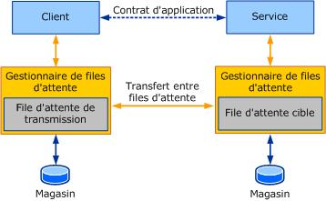

# Points de terminaison de service et adressage de files d'attente
Cette rubrique discute comment les clients adressent des services qui lisent à partir des files d'attente et comment les points de terminaison de service mappent aux files d'attente. En guise de rappel, l'illustration suivante montre le déploiement classique d'applications en file d'attente [!INCLUDE[indigo1](../../../../includes/indigo1-md.md)].  
  
   
  
 Pour pouvoir adresser le message au service, le client adresse le message à la file d'attente cible. Pour pouvoir lire des messages depuis la file d'attente, il définit son adresse d'écoute à la file d'attente cible. L'adressage dans [!INCLUDE[indigo2](../../../../includes/indigo2-md.md)] est basé sur l'URI (Uniform Resource Identifier), alors que les noms de files d'attente Message Queuing (MSMQ) ne sont pas basés sur l'URI. Il est par conséquent essentiel de comprendre comment adresser les files d'attente créées dans MSMQ à l'aide de [!INCLUDE[indigo2](../../../../includes/indigo2-md.md)].  
  
## Adressage MSMQ  
 MSMQ utilise des chemins d'accès et des noms de format pour identifier une file d'attente. Les chemins d'accès spécifient un nom d'hôte et un `QueueName`. Éventuellement, il peut y avoir un `Private$` entre le nom d'hôte et le `QueueName` pour indiquer une file d'attente privée qui n'est pas publiée dans le service d'annuaire Active Directory.  
  
 Les noms de chemin d’accès sont mappés à des « FormatNames » pour déterminer des aspects supplémentaires de l’adresse, y compris le protocole de transfert de gestionnaire file d’attente et de routage. Le Gestionnaire de files d'attente prend en charge deux protocoles de transfert : le protocole MSMQ natif et le protocole SRMP (SOAP Reliable Messaging Protocol).  
  
 [!INCLUDE[crabout](../../../../includes/crabout-md.md)]Noms de chemin d’accès et le format MSMQ, consultez [sur Message Queuing](http://go.microsoft.com/fwlink/?LinkId=94837).  
  
## NetMsmqBinding et adressage de service  
 Lors de l'adressage d'un message à un service, le schéma dans l'URI est choisi en fonction du transport utilisé pour la communication. Chaque transport dans [!INCLUDE[indigo2](../../../../includes/indigo2-md.md)] a un schéma unique. Le schéma doit refléter la nature du transport utilisé pour la communication. Par exemple, net.tcp, net.pipe, HTTP, et ainsi de suite.  
  
 Le transport de mise en file d'attente MSMQ dans [!INCLUDE[indigo2](../../../../includes/indigo2-md.md)] expose un schéma net.msmq. Tout message adressé à l'aide du schéma net.msmq est envoyé à l'aide du `NetMsmqBinding` sur le canal de transport de mise en file d'attente MSMQ.  
  
 L'adressage d'une file d'attente dans [!INCLUDE[indigo2](../../../../includes/indigo2-md.md)] est basé sur le modèle suivant :  
  
 NET.MSMQ : / / \< *nom d’hôte*> / [privé /] \< *nom de la file d’attente*>  
  
 où :  
  
-   \<*nom d’hôte*> est le nom de l’ordinateur qui héberge la file d’attente cible.  
  
-   [private] est facultatif. Il est utilisé lors de l'adressage d'une file d'attente cible qui est une file d'attente privée. Pour adresser une file d'attente publique, vous ne devez pas spécifier private. Notez que, contrairement aux chemins d'accès MSMQ, il n'y a pas de « $ » dans la forme de l'URI [!INCLUDE[indigo2](../../../../includes/indigo2-md.md)].  
  
-   \<*nom de la file d’attente*> est le nom de la file d’attente. Le nom de la file d'attente peut également faire référence à une sous-file d'attente. Par conséquent, \< *nom de la file d’attente*> = \< *nom de file d’attente*> [ ; *Sub queue-name*].  
  
 Exemple 1 : pour adresser une file d'attente privée PurchaseOrders hébergée sur l'ordinateur abc atadatum.com, l'URI serait net.msmq://abc.adatum.com/private/PurchaseOrders.  
  
 Exemple 2 : pour adresser une file d'attente AccountsPayable publique hébergée sur l'ordinateur def atadatum.com, l'URI serait net.msmq://def.adatum.com/AccountsPayable.  
  
 L'adresse de la file d'attente est utilisée comme URI d'écoute par l'écouteur pour la lecture des messages. En d'autres termes, l'adresse de la file d'attente est équivalente au port d'écoute de socket TCP.  
  
 Un point de terminaison qui lit à partir d'une file d'attente doit spécifier l'adresse de la file d'attente à l'aide du même schéma que celui spécifié précédemment lors de l'ouverture du ServiceHost. Pour obtenir des exemples, consultez [de liaison MSMQ Net](../../../../docs/framework/wcf/samples/net-msmq-binding.md) et [exemples de liaison d’intégration de Message Queuing](http://msdn.microsoft.com/en-us/997d11cb-f2c5-4ba0-9209-92843d4d0e1a).  
  
### Contrats multiples dans une file d'attente  
 Les messages dans une file d'attente peuvent implémenter des contrats différents. Dans ce cas, il est essentiel que l'une des conditions suivantes soit remplie pour lire et traiter avec succès tous les messages :  
  
-   Spécifiez un point de terminaison pour un service qui implémente tous les contrats. Il s'agit de l'approche recommandée.  
  
-   Spécifiez plusieurs points de terminaison avec différents contrats, mais assurez-vous que tous les points de terminaison utilisent le même objet `NetMsmqBinding`. La logique de distribution dans ServiceModel utilise une pompe de messages qui lit les messages du canal de transport pour distribution, et qui démultiplexe finalement les messages en fonction du contrat vers différents points de terminaison. Une pompe de messages est créée pour une paire d'écoute URI/liaison. L'adresse de la file d'attente est utilisée comme URI d'écoute par l'écouteur en file d'attente. Faire en sorte que tous les points de terminaison utilisent le même objet de liaison permet de s'assurer qu'une pompe de messages unique est utilisée pour lire le message et pour démultiplexer vers des points de terminaison pertinents en fonction du contrat.  
  
### Messagerie SRMP  
 Comme discuté précédemment, vous pouvez utiliser le protocole SRMP pour les transferts de file d'attente à file d'attente. Cette procédure est utilisée couramment lorsqu'un transport HTTP transmet des messages entre la file d'attente de transmission et la file d'attente cible.  
  
 Pour utiliser le protocole de transfert SRMP, adressez les messages à l'aide du schéma URI net.msmq, comme mentionné précédemment, et spécifiez le choix SRMP ou SRMP sécurisé dans la propriété `QueueTransferProtocol` du `NetMsmqBinding`.  
  
 La spécification de la propriété `QueueTransferProtocol` est une fonctionnalité « transmission uniquement ». Il s'agit d'une indication par le client concernant le type de protocole de transfert de file d'attente à utiliser.  
  
### Utilisation d'Active Directory  
 MSMQ prend en charge l'intégration avec Active Directory. Lorsque MSMQ est installé avec l'intégration Active Directory, l'ordinateur doit appartenir à un domaine Windows. Active Directory est utilisé pour publier des files d’attente pour la découverte ; Ces files d’attente sont appelés *files d’attente publiques*. Lors de l'adressage d'une file d'attente, la file d'attente peut être résolue à l'aide d'Active Directory. Ce principe s'apparente à la manière dont DNS (Domain Name System) est utilisé pour résoudre l'adresse IP d'un nom réseau. La propriété `UseActiveDirectory` dans `NetMsmqBinding` est une valeur booléenne qui indique si le canal en file d'attente doit utiliser Active Directory pour résoudre l'URI de file d'attente. Elle a la valeur `false` par défaut. Si la propriété `UseActiveDirectory` a la valeur `true`, le canal en file d'attente utilise Active Directory pour convertir l'URI net.msmq:// au nom de format.  
  
 La propriété `UseActiveDirectory` est explicite uniquement pour le client qui envoie le message car elle est utilisée pour résoudre l'adresse de la file d'attente lors de l'envoi de messages.  
  
### Mappage de l'URI net.msmq aux noms de format Message Queuing  
 Le canal en file d'attente gère le mappage du nom d'URI net.msmq fourni au canal en noms de format MSMQ. Le tableau suivant résume les règles de mappage utilisées.  
  
|Adresse de file d'attente basée sur URI WCF |Utiliser la propriété Active Directory|Propriété de protocole de transfert de mise en file d'attente|Noms de format MSMQ résultants|  
|----------------------------------|-----------------------------------|--------------------------------------|---------------------------------|  
|NET.MSMQ://\<machine-name >/privé/abc|False (valeur par défaut)|Native (valeur par défaut)|DIRECT=OS:machine-name\private$\abc|  
|NET.MSMQ://\<machine-name >/privé/abc|False|SRMP|DIRECT=http://machine/msmq/private$/abc|  
|NET.MSMQ://\<machine-name >/privé/abc|True|Natif|PUBLIC=un-guid (le GUID de la file d'attente)|  
  
### Lecture de messages à partir de la file d'attente de lettres mortes ou de la file d'attente de messages incohérents  
 Pour lire des messages à partir d'une file d'attente de message incohérents qui est une sous-file d'attente de la file d'attente cible, ouvrez le `ServiceHost` avec l'adresse de la sous-file d'attente.  
  
 Exemple : un service qui lit à partir de la file d'attente de message incohérents de la file d'attente privée PurchaseOrders de l'ordinateur local adresserait net.msmq://localhost/private/PurchaseOrders;poison.  
  
 Pour lire des messages à partir d'une file d'attente de lettres mortes transactionnelle système, l'URI doit être de la forme suivante : net.msmq://localhost/system$;DeadXact.  
  
 Pour lire des messages à partir d'une file d'attente de lettres mortes non transactionnelle système, l'URI doit être de la forme suivante : net.msmq://localhost/system$;DeadLetter.  
  
 Lors de l'utilisation d'une file d'attente de lettres mortes personnalisée, notez que la file d'attente de lettres mortes doit résider sur l'ordinateur local. Comme tel, l'URI de la file d'attente de lettres mortes est restreint à la forme suivante :  
  
 NET.MSMQ : //localhost/ [privé /] \< *nom du file d’attente lettre personnalisé mortes*>.  
  
 Un service [!INCLUDE[indigo2](../../../../includes/indigo2-md.md)] vérifie que tous les messages qu'il reçoit ont été adressés à la file d'attente particulière sur laquelle il écoute. Si la file d'attente de destination du message ne correspond pas à la file d'attente dans laquelle il se trouve, le service ne traite pas le message. Il s'agit d'un problème que les services qui écoutent une file d'attente de lettres mortes doivent être capables de gérer car tout message présent dans la file d'attente de lettres mortes était destiné à être remis autre part. Pour lire des messages à partir d'une file d'attente de lettres mortes ou d'une file d'attente de messages incohérents, un `ServiceBehavior` avec le paramètre <xref:System.ServiceModel.AddressFilterMode.Any> doit être utilisé. Pour obtenir un exemple, consultez [files d’attente de lettres mortes](../../../../docs/framework/wcf/samples/dead-letter-queues.md).  
  
## MsmqIntegrationBinding et adressage de service  
 Le `MsmqIntegrationBinding` est utilisé pour la communication avec les applications MSMQ traditionnelles. Pour faciliter l'interopérabilité avec une application MSMQ existante, [!INCLUDE[indigo2](../../../../includes/indigo2-md.md)] prend en charge uniquement l'adressage de nom de format. Par conséquent, les messages envoyés à l’aide de cette liaison doivent se conformer au schéma d’URI suivant :  
  
 MSMQ.FormatName :\<*nom de format MSMQ*>>  
  
 Le nom de format MSMQ est au format spécifié par MSMQ dans [sur Message Queuing](http://go.microsoft.com/fwlink/?LinkId=94837).  
  
 Notez que vous pouvez utiliser des noms de format directs, et des noms de format publics et privés (requiert l'intégration Active Directory) uniquement lors de la réception de messages à partir d'une file d'attente à l'aide de `MsmqIntegrationBinding`. Il est toutefois recommandé d'utiliser des noms de format directs. Par exemple, sur [!INCLUDE[wv](../../../../includes/wv-md.md)], l'utilisation de tout autre nom de format provoque une erreur car le système essaie d'ouvrir une sous-file d'attente qui ne peut être ouverte qu'avec des noms de format directs.  
  
 Lors de l'adressage SRMP à l'aide de `MsmqIntegrationBinding`, il n'est pas obligatoire d'ajouter /msmq/ dans le nom de format direct pour aider les services Internet (IIS) à effectuer la distribution. Par exemple : lors de l'adressage d'une file d'attente abc à l'aide du protocole SRMP, au lieu de DIRECT=http://adatum.com/msmq/private$/abc, vous devez utiliser DIRECT=http://adatum.com/private$/abc.  
  
 Notez que vous ne pouvez pas utiliser l'adressage net.msmq:// avec `MsmqIntegrationBinding`. Étant donné que `MsmqIntegrationBinding` prend en charge l'adressage de nom de format MSMQ de forme libre, vous pouvez utiliser un service [!INCLUDE[indigo2](../../../../includes/indigo2-md.md)] qui utilise cette liaison pour utiliser les fonctionnalités de multidiffusion et de liste de distribution dans MSMQ. Une exception concerne la spécification de `CustomDeadLetterQueue` lors de l'utilisation du `MsmqIntegrationBinding`. Il doit être de la forme net.msmq://, semblable à la façon dont il est spécifié à l'aide du `NetMsmqBinding`.  
  
## Voir aussi  
 [Web hébergeant une Application en file d’attente](../../../../docs/framework/wcf/feature-details/web-hosting-a-queued-application.md)
