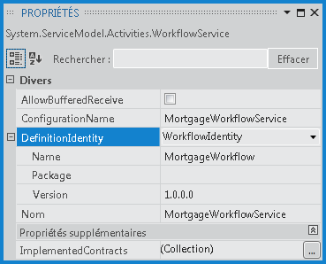
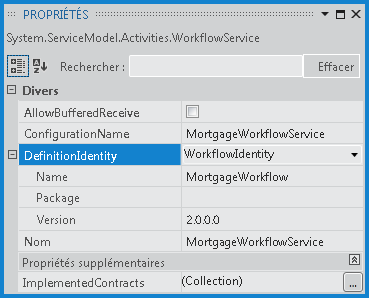

# <a name="side-by-side-versioning-in-workflowservicehost"></a><span data-ttu-id="ca3dc-102">Versioning côte à côte dans WorkflowServiceHost</span><span class="sxs-lookup"><span data-stu-id="ca3dc-102">Side by Side Versioning in WorkflowServiceHost</span></span>
<span data-ttu-id="ca3dc-103">Le contrôle de version côte à côte <xref:System.ServiceModel.Activities.WorkflowServiceHost> introduit dans le [!INCLUDE[net_v45](../../../../includes/net-v45-md.md)] permet d'héberger plusieurs versions d'un service de workflow sur un seul point de terminaison.</span><span class="sxs-lookup"><span data-stu-id="ca3dc-103">The <xref:System.ServiceModel.Activities.WorkflowServiceHost> side-by-side versioning introduced in [!INCLUDE[net_v45](../../../../includes/net-v45-md.md)] provides the capability to host multiple versions of a workflow service on a single endpoint.</span></span> <span data-ttu-id="ca3dc-104">Une fonctionnalité côte à côte fournie permet de configurer un service de workflow de façon à ce que les nouvelles instances du service de workflow soient créées à l'aide de la nouvelle définition de workflow, alors que les instances en cours de exécution s'achèvent à l'aide de définition existante.</span><span class="sxs-lookup"><span data-stu-id="ca3dc-104">The side-by-side functionality provided allows a workflow service to be configured so that new instances of the workflow service are created using the new workflow definition, while running instances complete using the existing definition.</span></span> <span data-ttu-id="ca3dc-105">Cette rubrique fournit une vue d'ensemble de l'exécution de service de workflow côte à côte à l'aide de <xref:System.ServiceModel.Activities.WorkflowServiceHost>.</span><span class="sxs-lookup"><span data-stu-id="ca3dc-105">This topic provides an overview of workflow service side-by-side execution using <xref:System.ServiceModel.Activities.WorkflowServiceHost>.</span></span>  
  
> [!NOTE]
>  <span data-ttu-id="ca3dc-106">Pour télécharger un exemple et regarder une procédure pas à pas vidéo du contrôle de version de flux de travail service côte à côte, consultez [le contrôle de version côte à côte avec un Service de Workflow Xamlx hébergé sur le Web](http://go.microsoft.com/fwlink/?LinkId=393746).</span><span class="sxs-lookup"><span data-stu-id="ca3dc-106">To download a sample and watch a video walkthrough of workflow service side-by-side versioning, see [Side by Side Versioning with a Web-Hosted Xamlx Workflow Service](http://go.microsoft.com/fwlink/?LinkId=393746).</span></span>  
  
## <a name="hosting-multiple-versions-in-a-workflow-service"></a><span data-ttu-id="ca3dc-107">Hébergement de plusieurs versions dans un service de workflow</span><span class="sxs-lookup"><span data-stu-id="ca3dc-107">Hosting Multiple Versions in a Workflow Service</span></span>  
 <span data-ttu-id="ca3dc-108"><xref:System.ServiceModel.Activities.WorkflowServiceHost> contient deux propriétés qui peuvent être configurées pour permettre à plusieurs versions d'un flux de travail de s'exécuter côte à côte : <xref:System.ServiceModel.Activities.WorkflowServiceHost.SupportedVersions%2A> et <xref:System.ServiceModel.Activities.WorkflowService.DefinitionIdentity%2A>.</span><span class="sxs-lookup"><span data-stu-id="ca3dc-108"><xref:System.ServiceModel.Activities.WorkflowServiceHost> contains two properties that can be configured to allow multiple versions of a workflow to execute side-by-side: <xref:System.ServiceModel.Activities.WorkflowServiceHost.SupportedVersions%2A> and <xref:System.ServiceModel.Activities.WorkflowService.DefinitionIdentity%2A>.</span></span> <span data-ttu-id="ca3dc-109"><xref:System.ServiceModel.Activities.WorkflowServiceHost.SupportedVersions%2A> contient les versions prises en charge du service de workflow, et <xref:System.ServiceModel.Activities.WorkflowService.DefinitionIdentity%2A> est utilisé pour identifier chaque service de workflow.</span><span class="sxs-lookup"><span data-stu-id="ca3dc-109"><xref:System.ServiceModel.Activities.WorkflowServiceHost.SupportedVersions%2A> contains the supported versions of the workflow service, and <xref:System.ServiceModel.Activities.WorkflowService.DefinitionIdentity%2A> is used to uniquely identify each workflow service.</span></span> <span data-ttu-id="ca3dc-110">Cela est effectué en associant un <xref:System.Activities.WorkflowIdentity> au service de workflow.</span><span class="sxs-lookup"><span data-stu-id="ca3dc-110">This is done by associating a <xref:System.Activities.WorkflowIdentity> with the workflow service.</span></span> <span data-ttu-id="ca3dc-111"><xref:System.Activities.WorkflowIdentity> contient trois informations d'identification.</span><span class="sxs-lookup"><span data-stu-id="ca3dc-111">A <xref:System.Activities.WorkflowIdentity> contains three identifying pieces of information.</span></span> <span data-ttu-id="ca3dc-112"><xref:System.Activities.WorkflowIdentity.Name%2A> et <xref:System.Activities.WorkflowIdentity.Version%2A> contiennent un nom et un <xref:System.Version> et sont obligatoire, et <xref:System.Activities.WorkflowIdentity.Package%2A> est facultatif et peut être utilisé pour spécifier une chaîne supplémentaire contenant des informations telles que le nom de l'assembly ou d'autres informations souhaitées.</span><span class="sxs-lookup"><span data-stu-id="ca3dc-112"><xref:System.Activities.WorkflowIdentity.Name%2A> and <xref:System.Activities.WorkflowIdentity.Version%2A> contain a name and a <xref:System.Version> and are required, and <xref:System.Activities.WorkflowIdentity.Package%2A> is optional and can be used to specify an additional string containing information such as assembly name or other desired information.</span></span> <span data-ttu-id="ca3dc-113">Chaque service de workflow contenu de la collection <xref:System.ServiceModel.Activities.WorkflowServiceHost.SupportedVersions%2A> doit disposer d'un <xref:System.Activities.WorkflowIdentity> unique.</span><span class="sxs-lookup"><span data-stu-id="ca3dc-113">Each workflow service contained in the <xref:System.ServiceModel.Activities.WorkflowServiceHost.SupportedVersions%2A> collection must have a unique <xref:System.Activities.WorkflowIdentity>.</span></span> <span data-ttu-id="ca3dc-114"><xref:System.Activities.WorkflowIdentity> est unique si l'une de ses trois propriétés est différente d'un autre <xref:System.Activities.WorkflowIdentity>.</span><span class="sxs-lookup"><span data-stu-id="ca3dc-114">A <xref:System.Activities.WorkflowIdentity> is unique if any of its three properties are different from another <xref:System.Activities.WorkflowIdentity>.</span></span> <span data-ttu-id="ca3dc-115">A `null` <xref:System.Activities.WorkflowIdentity> est une valeur autorisée pour <xref:System.ServiceModel.Activities.WorkflowService.DefinitionIdentity%2A>, mais seule une version antérieure d’un service de flux de travail peut avoir un `null` <xref:System.Activities.WorkflowIdentity>.</span><span class="sxs-lookup"><span data-stu-id="ca3dc-115">A `null` <xref:System.Activities.WorkflowIdentity> is an allowable value for <xref:System.ServiceModel.Activities.WorkflowService.DefinitionIdentity%2A>, but only one previous version of a workflow service may have a `null` <xref:System.Activities.WorkflowIdentity>.</span></span>  
  
> [!IMPORTANT]
>  <span data-ttu-id="ca3dc-116">Un <xref:System.Activities.WorkflowIdentity> ne devrait contenir aucune information d'identification personnelle (PII).</span><span class="sxs-lookup"><span data-stu-id="ca3dc-116">A <xref:System.Activities.WorkflowIdentity> should not contain any personally identifiable information (PII).</span></span> <span data-ttu-id="ca3dc-117">Un <xref:System.Activities.WorkflowIdentity> se compose de trois parties : un <xref:System.Activities.WorkflowIdentity.Name%2A> (<xref:System.String>), un <xref:System.Activities.WorkflowIdentity.Version%2A> (<xref:System.Version>) et un <xref:System.Activities.WorkflowIdentity.Package%2A> (<xref:System.String>).</span><span class="sxs-lookup"><span data-stu-id="ca3dc-117"><xref:System.Activities.WorkflowIdentity> is composed of three parts: a <xref:System.Activities.WorkflowIdentity.Name%2A> (<xref:System.String>), a <xref:System.Activities.WorkflowIdentity.Version%2A> (<xref:System.Version>), and a <xref:System.Activities.WorkflowIdentity.Package%2A> (<xref:System.String>).</span></span> <span data-ttu-id="ca3dc-118">Les informations relatives au <xref:System.Activities.WorkflowIdentity> utilisées pour créer une instance sont émises vers n'importe quel service de suivi configuré sur plusieurs points du cycle de vie du workflow différents par le runtime.</span><span class="sxs-lookup"><span data-stu-id="ca3dc-118">Information about the <xref:System.Activities.WorkflowIdentity> used to create an instance is emitted to any configured tracking services at several different points of the activity life-cycle by the runtime.</span></span> <span data-ttu-id="ca3dc-119">Le suivi WF ne dispose pas d'un mécanisme de masquage des informations PII (données utilisateur sensibles).</span><span class="sxs-lookup"><span data-stu-id="ca3dc-119">WF Tracking does not have any mechanism to hide PII (sensitive user data).</span></span> <span data-ttu-id="ca3dc-120">Par conséquent, une instance <xref:System.Activities.WorkflowIdentity> ne doit contenir aucune donnée PII, car elle est émise par le runtime dans les enregistrements de suivi et peut être vue par n'importe quelle personne qui dispose d'un accès permettant d'afficher les enregistrements de suivi.</span><span class="sxs-lookup"><span data-stu-id="ca3dc-120">Therefore, a <xref:System.Activities.WorkflowIdentity> instance should not contain any PII data as it will be emitted by the runtime in tracking records and may be visible to anyone with access to view the tracking records.</span></span>  
  
### <a name="rules-for-hosting-multiple-versions-of-a-workflow-service"></a><span data-ttu-id="ca3dc-121">Règles pour héberger plusieurs versions d'un service de workflow</span><span class="sxs-lookup"><span data-stu-id="ca3dc-121">Rules for Hosting Multiple Versions of a Workflow Service</span></span>  
 <span data-ttu-id="ca3dc-122">Lorsqu'un utilisateur ajoute une version supplémentaire à <xref:System.ServiceModel.Activities.WorkflowServiceHost>, il existe plusieurs conditions à respecter pour qu'un service de workflow soit hébergé avec le même ensemble de points de terminaison et de description.</span><span class="sxs-lookup"><span data-stu-id="ca3dc-122">When a user adds an additional version to the <xref:System.ServiceModel.Activities.WorkflowServiceHost>, there are several conditions that must be met in order for a workflow service to be hosted with the same set of endpoints and description.</span></span> <span data-ttu-id="ca3dc-123">Si l'une des versions supplémentaires ne satisfait pas ces conditions, <xref:System.ServiceModel.Activities.WorkflowServiceHost> lève une exception lorsque `Open` est appelée.</span><span class="sxs-lookup"><span data-stu-id="ca3dc-123">If any of the additional versions fail to meet these conditions, the <xref:System.ServiceModel.Activities.WorkflowServiceHost> throws an exception when `Open` is called.</span></span> <span data-ttu-id="ca3dc-124">Chaque définition de flux de travail fournie à l'hôte comme une version supplémentaire doit satisfaire les spécifications suivantes (où la version principale est la définition de service de workflow qui est fournie au constructeur hôte).</span><span class="sxs-lookup"><span data-stu-id="ca3dc-124">Each workflow definition provided to the host as an additional version must meet the following requirements (where the primary version is the workflow service definition that is provided to the host constructor).</span></span> <span data-ttu-id="ca3dc-125">La version supplémentaire du flux de travail doit :</span><span class="sxs-lookup"><span data-stu-id="ca3dc-125">The additional workflow version must:</span></span>  
  
-   <span data-ttu-id="ca3dc-126">Avoir le même <xref:System.ServiceModel.Activities.WorkflowService.Name%2A> que la version principale du service de workflow.</span><span class="sxs-lookup"><span data-stu-id="ca3dc-126">Have the same the <xref:System.ServiceModel.Activities.WorkflowService.Name%2A> as the primary version of the workflow service.</span></span>  
  
-   <span data-ttu-id="ca3dc-127">Ne doit pas avoir d'activité <xref:System.ServiceModel.Activities.Receive> ou <xref:System.ServiceModel.Activities.SendReply> dans son <xref:System.ServiceModel.Activities.WorkflowService.Body%2A> qui ne sont pas dans la version principale, et doit correspondre au contrat d'opération.</span><span class="sxs-lookup"><span data-stu-id="ca3dc-127">Must not have any <xref:System.ServiceModel.Activities.Receive> or <xref:System.ServiceModel.Activities.SendReply> activities in its <xref:System.ServiceModel.Activities.WorkflowService.Body%2A> that are not in the primary version, and they must match the operation contract.</span></span>  
  
-   <span data-ttu-id="ca3dc-128">Avoir un <xref:System.ServiceModel.Activities.WorkflowService.DefinitionIdentity%2A> unique.</span><span class="sxs-lookup"><span data-stu-id="ca3dc-128">Have a unique <xref:System.ServiceModel.Activities.WorkflowService.DefinitionIdentity%2A>.</span></span> <span data-ttu-id="ca3dc-129">Qu’une seule définition de flux de travail peut avoir un `null` <xref:System.ServiceModel.Activities.WorkflowService.DefinitionIdentity%2A>.</span><span class="sxs-lookup"><span data-stu-id="ca3dc-129">One and only one workflow definition may have a `null`<xref:System.ServiceModel.Activities.WorkflowService.DefinitionIdentity%2A>.</span></span>  
  
 <span data-ttu-id="ca3dc-130">Certaines modifications sont autorisées.</span><span class="sxs-lookup"><span data-stu-id="ca3dc-130">Some changes are permitted.</span></span> <span data-ttu-id="ca3dc-131">Les éléments suivants peuvent être différents selon les versions :</span><span class="sxs-lookup"><span data-stu-id="ca3dc-131">The following items may be different between the versions:</span></span>  
  
-   <span data-ttu-id="ca3dc-132"><xref:System.ServiceModel.Activities.WorkflowService.DefinitionIdentity%2A> peut avoir un nom et un package différents de ceux de la version principale.</span><span class="sxs-lookup"><span data-stu-id="ca3dc-132">The <xref:System.ServiceModel.Activities.WorkflowService.DefinitionIdentity%2A> may have a different Name and Package than the primary version.</span></span>  
  
-   <span data-ttu-id="ca3dc-133">La valeur <xref:System.ServiceModel.Activities.WorkflowService.AllowBufferedReceive%2A> peut être différente de celle de la version principale.</span><span class="sxs-lookup"><span data-stu-id="ca3dc-133">The <xref:System.ServiceModel.Activities.WorkflowService.AllowBufferedReceive%2A> value may be different than the primary version.</span></span>  
  
-   <span data-ttu-id="ca3dc-134">La valeur <xref:System.ServiceModel.Activities.WorkflowService.ConfigurationName%2A> peut être différente de celle de la version principale.</span><span class="sxs-lookup"><span data-stu-id="ca3dc-134">The <xref:System.ServiceModel.Activities.WorkflowService.ConfigurationName%2A> may be different than the primary version.</span></span>  
  
-   <span data-ttu-id="ca3dc-135">La valeur <xref:System.ServiceModel.Activities.WorkflowService.ImplementedContracts%2A> peut être différente de celle de la version principale.</span><span class="sxs-lookup"><span data-stu-id="ca3dc-135">The <xref:System.ServiceModel.Activities.WorkflowService.ImplementedContracts%2A> may be different than the primary version.</span></span>  
  
### <a name="configuring-the-definitionidentity"></a><span data-ttu-id="ca3dc-136">Configurer le DefinitionIdentity</span><span class="sxs-lookup"><span data-stu-id="ca3dc-136">Configuring the DefinitionIdentity</span></span>  
 <span data-ttu-id="ca3dc-137">Lorsqu’un service de flux de travail est créé à l’aide du Concepteur de flux de travail, le <xref:System.ServiceModel.Activities.WorkflowService.DefinitionIdentity%2A> est définie à l’aide de la **propriétés** fenêtre.</span><span class="sxs-lookup"><span data-stu-id="ca3dc-137">When a workflow service is created using the workflow designer, the <xref:System.ServiceModel.Activities.WorkflowService.DefinitionIdentity%2A> is set using the **Properties** window.</span></span> <span data-ttu-id="ca3dc-138">Cliquez en dehors de l’activité de racine du service dans le concepteur pour sélectionner le service de flux de travail, puis choisissez **fenêtre Propriétés** à partir de la **vue** menu.</span><span class="sxs-lookup"><span data-stu-id="ca3dc-138">Click outside of the service’s root activity in the designer to select the workflow service, and choose **Properties Window** from the **View** menu.</span></span> <span data-ttu-id="ca3dc-139">Sélectionnez **WorkflowIdentity** dans la liste déroulante qui s’affiche en regard du **DefinitionIdentity** propriété, puis développez et spécifiez le texte souhaité <xref:System.Activities.WorkflowIdentity> propriétés.</span><span class="sxs-lookup"><span data-stu-id="ca3dc-139">Select **WorkflowIdentity** from the drop-down list that appears beside the **DefinitionIdentity** property, and then expand and specify the desired <xref:System.Activities.WorkflowIdentity> properties.</span></span> <span data-ttu-id="ca3dc-140">Dans l’exemple suivant le <xref:System.ServiceModel.Activities.WorkflowService.DefinitionIdentity%2A> est configuré avec le <xref:System.Activities.WorkflowIdentity.Name%2A> `MortgageWorkflow` et un <xref:System.Activities.WorkflowIdentity.Version%2A> de `1.0.0.0`.</span><span class="sxs-lookup"><span data-stu-id="ca3dc-140">In the following example the <xref:System.ServiceModel.Activities.WorkflowService.DefinitionIdentity%2A> is configured with the <xref:System.Activities.WorkflowIdentity.Name%2A> `MortgageWorkflow` and a <xref:System.Activities.WorkflowIdentity.Version%2A> of `1.0.0.0`.</span></span> <span data-ttu-id="ca3dc-141"><xref:System.Activities.WorkflowIdentity.Package%2A> est facultatif et dans cet exemple est `null`.</span><span class="sxs-lookup"><span data-stu-id="ca3dc-141"><xref:System.Activities.WorkflowIdentity.Package%2A> is optional and in this example is `null`.</span></span>  
  
 <span data-ttu-id="ca3dc-142"></span><span class="sxs-lookup"><span data-stu-id="ca3dc-142"></span></span>  
  
 <span data-ttu-id="ca3dc-143">Lorsqu'un service de workflow est auto-hébergé, <xref:System.ServiceModel.Activities.WorkflowService.DefinitionIdentity%2A> est configuré lorsque le service de workflow est construit.</span><span class="sxs-lookup"><span data-stu-id="ca3dc-143">When a workflow service is self-hosted, the <xref:System.ServiceModel.Activities.WorkflowService.DefinitionIdentity%2A> is configured when the workflow service is constructed.</span></span> <span data-ttu-id="ca3dc-144">Dans l’exemple suivant, la <xref:System.ServiceModel.Activities.WorkflowService.DefinitionIdentity%2A> est configuré avec les mêmes valeurs que l’exemple précédent, avec les <xref:System.Activities.WorkflowIdentity.Name%2A> `MortgageWorkflow` et un <xref:System.Activities.WorkflowIdentity.Name%2A> de `1.0.0.0`.</span><span class="sxs-lookup"><span data-stu-id="ca3dc-144">In the following example, the <xref:System.ServiceModel.Activities.WorkflowService.DefinitionIdentity%2A> is configured with the same values as the previous example, with the <xref:System.Activities.WorkflowIdentity.Name%2A> `MortgageWorkflow` and a <xref:System.Activities.WorkflowIdentity.Name%2A> of `1.0.0.0`.</span></span>  
  
```csharp  
WorkflowService service = new WorkflowService  
{  
    Name = "MortgageWorkflowService",  
    Body = new MortgageWorkflow(),  
    DefinitionIdentity = new WorkflowIdentity  
    {  
        Name = "MortgageWorkflow",  
        Version = new Version(1, 0, 0, 0)  
    }  
};  
```  
  
```vb  
Dim service As New WorkflowService  
With service  
    .Name = "MortgageWorkflowService"  
    .Body = New MortgageWorkflow  
    .DefinitionIdentity = New WorkflowIdentity With _  
    { _  
        .Name = "MortgageWorkflow", _  
        .Version = New Version(1, 0, 0, 0) _  
    }  
End With  
```  
  
 <span data-ttu-id="ca3dc-145">A <xref:System.ServiceModel.Activities.WorkflowService.DefinitionIdentity%2A> n’est pas obligatoire, mais qu’une seule version du service de workflow peut avoir un **null**<xref:System.ServiceModel.Activities.WorkflowService.DefinitionIdentity%2A>.</span><span class="sxs-lookup"><span data-stu-id="ca3dc-145">A <xref:System.ServiceModel.Activities.WorkflowService.DefinitionIdentity%2A> is not required, although only one version of the workflow service may have a **null**<xref:System.ServiceModel.Activities.WorkflowService.DefinitionIdentity%2A>.</span></span>  
  
> [!NOTE]
>  <span data-ttu-id="ca3dc-146">Cela est utile si le service a été déployé initialement sans <xref:System.ServiceModel.Activities.WorkflowService.DefinitionIdentity%2A> configuré, et une version mise à jour est créée.</span><span class="sxs-lookup"><span data-stu-id="ca3dc-146">This is useful if the service was deployed initially without a <xref:System.ServiceModel.Activities.WorkflowService.DefinitionIdentity%2A> configured, and then an updated version is created.</span></span>  
  
### <a name="adding-a-new-version-to-a-web-hosted-workflow-service"></a><span data-ttu-id="ca3dc-147">Ajout d'une nouvelle version à un service de workflow hébergé sur le Web</span><span class="sxs-lookup"><span data-stu-id="ca3dc-147">Adding a New Version to a Web-hosted Workflow Service</span></span>  
 <span data-ttu-id="ca3dc-148">La première étape de configuration d'une nouvelle version d'un service de flux de travail dans un service hébergé sur le Web consiste à créer un nouveau dossier dans le dossier `App_Code` portant le même nom que le fichier de service.</span><span class="sxs-lookup"><span data-stu-id="ca3dc-148">The first step in configuring a new version of a workflow service in a web-hosted service is to create a new folder in the `App_Code` folder that has the same name as the service file.</span></span> <span data-ttu-id="ca3dc-149">Si le fichier `xamlx` du service est nommé `MortgageWorkflow.xamlx`, le dossier doit être nommé `MortgageWorkflow`.</span><span class="sxs-lookup"><span data-stu-id="ca3dc-149">If the service’s `xamlx` file is named `MortgageWorkflow.xamlx`, then the folder must be named `MortgageWorkflow`.</span></span> <span data-ttu-id="ca3dc-150">Placez une copie du fichier `xamlx` du service initial dans ce dossier et renommez-le, par exemple `MortgageWorkflowV1.xamlx`.</span><span class="sxs-lookup"><span data-stu-id="ca3dc-150">Place a copy of the original service’s `xamlx` file into this folder and rename it to a new name, such as `MortgageWorkflowV1.xamlx`.</span></span> <span data-ttu-id="ca3dc-151">Apportez les modifications souhaitées au service principal, mettez à jour son <xref:System.ServiceModel.Activities.WorkflowService.DefinitionIdentity%2A>, puis déployez le service.</span><span class="sxs-lookup"><span data-stu-id="ca3dc-151">Make the desired changes to the primary service, update its <xref:System.ServiceModel.Activities.WorkflowService.DefinitionIdentity%2A>, and then deploy the service.</span></span> <span data-ttu-id="ca3dc-152">Dans l'exemple suivant, <xref:System.ServiceModel.Activities.WorkflowService.DefinitionIdentity%2A> a été mis à jour avec un <xref:System.Activities.WorkflowIdentity.Name%2A> de `MortageWorkflow` et un <xref:System.Activities.WorkflowIdentity.Version%2A> de `2.0.0.0`.</span><span class="sxs-lookup"><span data-stu-id="ca3dc-152">In the following example the <xref:System.ServiceModel.Activities.WorkflowService.DefinitionIdentity%2A> has been updated with a <xref:System.Activities.WorkflowIdentity.Name%2A> of `MortageWorkflow` and a <xref:System.Activities.WorkflowIdentity.Version%2A> of `2.0.0.0`.</span></span>  
  
 <span data-ttu-id="ca3dc-153"></span><span class="sxs-lookup"><span data-stu-id="ca3dc-153"></span></span>  
  
 <span data-ttu-id="ca3dc-154">Lorsque le service redémarre, la version précédente est automatiquement ajoutée à la collection <xref:System.ServiceModel.Activities.WorkflowServiceHost.SupportedVersions%2A>, car elle se trouve dans le sous-dossier `App_Code` désigné.</span><span class="sxs-lookup"><span data-stu-id="ca3dc-154">When the service restarts, the previous version will automatically be added to the <xref:System.ServiceModel.Activities.WorkflowServiceHost.SupportedVersions%2A> collection because it is located in the designated `App_Code` subfolder.</span></span> <span data-ttu-id="ca3dc-155">Notez que si la version principale du service de workflow a un `null` <xref:System.ServiceModel.Activities.WorkflowService.DefinitionIdentity%2A> les versions précédentes ne seront pas ajoutées.</span><span class="sxs-lookup"><span data-stu-id="ca3dc-155">Note that if the primary version of the workflow service has a `null` <xref:System.ServiceModel.Activities.WorkflowService.DefinitionIdentity%2A> the previous versions will not be added.</span></span> <span data-ttu-id="ca3dc-156">Une version peut avoir une propriété `null`<xref:System.ServiceModel.Activities.WorkflowService.DefinitionIdentity%2A>, mais s'il existe plusieurs versions, la version principale ne doit pas être celle avec la propriété `null`<xref:System.ServiceModel.Activities.WorkflowService.DefinitionIdentity%2A>, sinon les versions précédentes ne seront pas ajoutées à la collection <xref:System.ServiceModel.Activities.WorkflowServiceHost.SupportedVersions%2A>.</span><span class="sxs-lookup"><span data-stu-id="ca3dc-156">One version may have a `null`<xref:System.ServiceModel.Activities.WorkflowService.DefinitionIdentity%2A>, but if there are multiple versions the primary version must not be the one with the `null`<xref:System.ServiceModel.Activities.WorkflowService.DefinitionIdentity%2A> or else the previous versions will not be added to the <xref:System.ServiceModel.Activities.WorkflowServiceHost.SupportedVersions%2A> collection.</span></span>  
  
### <a name="adding-a-new-version-to-a-self-hosted-workflow-service"></a><span data-ttu-id="ca3dc-157">Ajout d'une nouvelle version à un service de workflow auto-hébergé</span><span class="sxs-lookup"><span data-stu-id="ca3dc-157">Adding a New Version to a Self-hosted Workflow Service</span></span>  
 <span data-ttu-id="ca3dc-158">Lors de l'ajout d'une nouvelle version à un service de flux de travail auto-hébergé, <xref:System.ServiceModel.Activities.WorkflowServiceHost> est configuré avec la version principale du service de flux de travail, et les versions antérieures doivent être explicitement ajoutées à la collection <xref:System.ServiceModel.Activities.WorkflowServiceHost.SupportedVersions%2A>.</span><span class="sxs-lookup"><span data-stu-id="ca3dc-158">When adding a new version to a self-hosted workflow service, the <xref:System.ServiceModel.Activities.WorkflowServiceHost> is configured with the primary version of the workflow service, and previous versions must be explicitly added to the <xref:System.ServiceModel.Activities.WorkflowServiceHost.SupportedVersions%2A> collection.</span></span> <span data-ttu-id="ca3dc-159">Dans l'exemple suivant, <xref:System.ServiceModel.Activities.WorkflowServiceHost> est configuré avec un service de workflow principal qui utilise une définition de workflow `MortgageWorkflowV2`, et un service de workflow configuré avec une définition de workflow `MortgageWorkflowV1` est ajouté à la collection <xref:System.ServiceModel.Activities.WorkflowServiceHost.SupportedVersions%2A>.</span><span class="sxs-lookup"><span data-stu-id="ca3dc-159">In the following example, a <xref:System.ServiceModel.Activities.WorkflowServiceHost> is configured with a primary workflow service that uses a `MortgageWorkflowV2` workflow definition, and a workflow service configured with a `MortgageWorkflowV1` workflow definition is added to the <xref:System.ServiceModel.Activities.WorkflowServiceHost.SupportedVersions%2A> collection.</span></span> <span data-ttu-id="ca3dc-160">Chaque service de workflow est configuré avec un <xref:System.ServiceModel.Activities.WorkflowService.DefinitionIdentity%2A> unique qui reflète la version de la définition de workflow.</span><span class="sxs-lookup"><span data-stu-id="ca3dc-160">Each workflow service is configured with a unique <xref:System.ServiceModel.Activities.WorkflowService.DefinitionIdentity%2A> that reflects the version of the workflow definition.</span></span>  
  
```csharp  
// Create the primary version of the workflow service.  
WorkflowService serviceV2 = new WorkflowService  
{  
    Name = "MortgageWorkflowService",  
    Body = new MortgageWorkflowV2(),  
    DefinitionIdentity = new WorkflowIdentity  
    {  
        Name = "MortgageWorkflow",  
        Version = new Version(2, 0, 0, 0)  
    }  
};  
  
// Configure the WorkflowServiceHost with the current version  
// of the workflow service. This code requires Administrator  
// privileges to function correctly. If running from Visual  
// Studio, Visual Studio must be run with Administrator privileges.  
WorkflowServiceHost host = new WorkflowServiceHost(serviceV2,   
    new Uri("http://localhost:8080/MortgageWorkflowService"));  
  
// Create the previous version of the workflow service.  
WorkflowService serviceV1 = new WorkflowService  
{  
    Name = "MortgageWorkflowService",  
    Body = new MortgageWorkflowV1(),  
    DefinitionIdentity = new WorkflowIdentity  
    {  
        Name = "MortgageWorkflow",  
        Version = new Version(1, 0, 0, 0)  
    }  
};  
  
// Add the previous version of the service to the SupportedVersions collection.  
host.SupportedVersions.Add(serviceV1);  
```  
  
```vb  
'Create the primary version of the workflow service  
Dim serviceV2 As New WorkflowService  
With serviceV2  
    .Name = "MortgageWorkflowService"  
    .Body = New MortgageWorkflowV2  
    .DefinitionIdentity = New WorkflowIdentity With _  
    { _  
        .Name = "MortgageWorkflow", _  
        .Version = New Version(2, 0, 0, 0) _  
    }  
End With  
  
'Configure the WorkflowServiceHost with the current version  
'of the workflow service. This code requires Administrator  
'privileges to function correctly. If running from Visual  
'Studio, Visual Studio must be run with Administrator privileges.  
  
Dim host As New WorkflowServiceHost(serviceV2, _  
    New Uri("http://localhost:8080/MortgageWorkflowService"))  
  
'Create the previous version of the workflow service.  
Dim serviceV1 As New WorkflowService  
With serviceV1  
    .Name = "MortgageWorkflowService"  
    .Body = New MortgageWorkflowV1  
    .DefinitionIdentity = New WorkflowIdentity With _  
    { _  
        .Name = "MortgageWorkflow", _  
        .Version = New Version(1, 0, 0, 0) _  
    }  
End With  
  
'Add the previous version of the service to the SupportedVersions collection.  
host.SupportedVersions.Add(serviceV1)  
```
