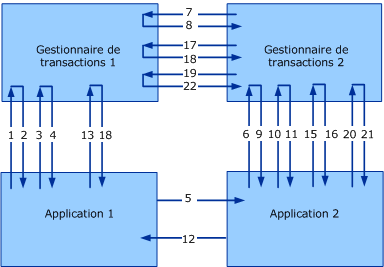

# <a name="transaction-protocols"></a>Protocoles de transaction
[!INCLUDE[indigo1](../../../../includes/indigo1-md.md)] implémente les protocoles WS-Atomic Transaction et WS-Coordination.  
  
|Spécification/Document|Version|Lien|  
|-----------------------------|-------------|----------|  
|WS-Coordination|1.0<br /><br /> 1.1|[http://go.Microsoft.com/fwlink/?LinkId=96104](http://go.microsoft.com/fwlink/?LinkId=96104)<br /><br /> [http://go.Microsoft.com/fwlink/?LinkId=96079](http://go.microsoft.com/fwlink/?LinkId=96079)|  
|WS-AtomicTransaction|1.0<br /><br /> 1.1|[http://go.Microsoft.com/fwlink/?LinkId=96080](http://go.microsoft.com/fwlink/?LinkId=96080)<br /><br /> http://go.microsoft.com/fwlink/?LinkId=96081 (page pouvant être en anglais)|  
  
 L’interopérabilité sur ces spécifications de protocole est requise à deux niveaux : entre les applications et entre les gestionnaires de transactions (consultez la figure suivante). Les spécifications décrivent de manière très détaillée les formats de message et l'échange de messages pour les deux niveaux d'interopérabilité. Une certain niveau de sécurité, de fiabilité et des encodages pour l'échange interapplication s'appliquent de la même manière que pour l'échange entre applications normal. Toutefois, l'interopérabilité réussie entre les gestionnaires de transactions requiert un contrat sur la liaison spécifique, car il n'est généralement pas configuré par l'utilisateur.  
  
 Cette rubrique décrit une composition de la spécification WS-AT (WS-Atomic Transaction) avec sécurité et décrit la liaison sécurisée utilisée pour la communication entre les gestionnaires de transactions. L'approche décrite dans ce document a été testée avec succès avec d'autres implémentations de WS-AT et WS-Coordination, dont IBM, IONA, Sun Microsystems, etc.  
  
 La figure suivante représente l’interopérabilité entre deux gestionnaires de transactions (Gestionnaire de transactions 1 et Gestionnaire de transactions 2) et deux applications (Application 1 et Application 2).  
  
   
  
 Examinons un scénario WS-Coordination/WS-Atomic Transaction classique avec un Initiateur (I) et un Participant (P). L’Initiateur et le Participant ont des Gestionnaires de transactions (ITM et PTM, respectivement). La validation en deux phases est désignée sous le terme « 2PC » dans cette rubrique.  
  
|||  
|-|-|  
|1. CreateCoordinationContext|12. Réponse de message d'application|  
|2. CreateCoordinationContextResponse|13. Commit (achèvement)|  
|3. Register (achèvement)|14. Prepare (2PC)|  
|4. RegisterResponse|15. Prepare (2PC)|  
|5. Message d'application|16. Prepared (2PC)|  
|6. CreateCoordinationContext avec Context|17. Prepared (2PC)|  
|7. Register (durable)|18. Committed (achèvement)|  
|8. RegisterResponse|19. Commit (2PC)|  
|9. CreateCoordinationContextResponse|20. Commit (2PC)|  
|10. Register (durable)|21. Committed (2PC)|  
|11. RegisterResponse|22. Committed (2PC)|  
  
 Ce document décrit une composition de la spécification WS-AtomicTransaction avec sécurité et décrit la liaison sécurisée utilisée pour la communication entre les gestionnaires de transactions. L'approche décrite dans ce document a été testée avec succès avec d'autres implémentations de WS-AT et WS-Coordination.  
  
 La figure et le tableau présentent quatre classes de messages du point de vue de sécurité :  
  
-   Messages d'activation (CreateCoordinationContext et CreateCoordinationContextResponse).  
  
-   Messages d'inscription (Register et RegisterResponse)  
  
-   Messages de protocole (Prepare, Rollback, Commit, Aborted, etc).  
  
-   Messages d'application  
  
 Les trois premières classes de message sont considérées comme des messages de gestionnaire de transactions et leur configuration de liaison est décrite dans la section « Échange de messages d'application » développée ultérieurement dans cette rubrique. La quatrième classe de message concerne les messages interapplication et est décrite dans la section « Exemples de message » développée ultérieurement dans cette rubrique. Cette section décrit les liaisons de protocole utilisées pour chacune de ces classes par [!INCLUDE[indigo2](../../../../includes/indigo2-md.md)].  
  
 Les espaces de noms XML suivants et préfixes associés sont utilisés dans l'ensemble de ce document.  
  
|Préfixe|Version|URI d'espace de noms|  
|------------|-------------|-------------------|  
|s11||[http://go.Microsoft.com/fwlink/?LinkId=96014](http://go.microsoft.com/fwlink/?LinkId=96014)|  
|wsa|Pre-1.0<br /><br /> 1.0|http://www.w3.org/2004/08/Addressing<br /><br /> [http://go.Microsoft.com/fwlink/?LinkId=96022](http://go.microsoft.com/fwlink/?LinkId=96022)|  
|wscoor|1.0<br /><br /> 1.1|[http://go.Microsoft.com/fwlink/?LinkId=96078](http://go.microsoft.com/fwlink/?LinkId=96078)<br /><br /> [http://go.Microsoft.com/fwlink/?LinkId=96079](http://go.microsoft.com/fwlink/?LinkId=96079)|  
|wsat|1.0<br /><br /> 1.1|[http://go.Microsoft.com/fwlink/?LinkId=96080](http://go.microsoft.com/fwlink/?LinkId=96080)<br /><br /> [http://go.Microsoft.com/fwlink/?LinkId=96081](http://go.microsoft.com/fwlink/?LinkId=96081)|  
|t|Pre-1.3<br /><br /> 1.3|[http://go.Microsoft.com/fwlink/?LinkId=96082](http://go.microsoft.com/fwlink/?LinkId=96082)<br /><br /> [http://go.Microsoft.com/fwlink/?LinkId=96100](http://go.microsoft.com/fwlink/?LinkId=96100)|  
|o||[http://go.Microsoft.com/fwlink/?LinkId=96101](http://go.microsoft.com/fwlink/?LinkId=96101)|  
|xsd||[http://go.Microsoft.com/fwlink/?LinkId=96102](http://go.microsoft.com/fwlink/?LinkId=96102)|  
  
## <a name="transaction-manager-bindings"></a>Liaisons de gestionnaire de transactions  
 R1001 : Les gestionnaires de transactions participant à une transaction WS-AT 1.0 doivent utiliser SOAP 1.1 et WS-Addressing 2004/08 pour WS-Atomic Transaction et les échanges de messages WS-Coordination.  
  
 R1002 : les gestionnaires de transactions qui participent à une transaction WS-AT 1.1 doivent utiliser SOAP 1.1 et WS-Addressing 2005/08 pour les échanges WS-Atomic Transaction et WS-Coordination.  
  
 Les messages d’application ne sont pas contraints à ces liaisons et sont décrits ultérieurement.  
  
### <a name="transaction-manager-https-binding"></a>Liaison HTTPS de gestionnaire de transactions  
 La liaison HTTPS de gestionnaire de transactions s'appuie uniquement sur le transport de sécurité pour assurer la sécurité et établir la confiance entre chaque paire expéditeur-récepteur dans l'arborescence de transactions.  
  
#### <a name="https-transport-configuration"></a>Configuration du transport HTTPS  
 Les certificats X.509 permettent d'établir l'identité de gestionnaire de transactions. L'authentification client/serveur est requise, et l'autorisation client/serveur est considérée comme un détail d'implémentation :  
  
-   R1111 : les certificats X.509 présentés sur le câble doivent avoir un nom de sujet qui correspond au nom de domaine complet de l'ordinateur d'origine.  
  
-   B1112 : le DNS doit être fonctionnel entre chaque paire expéditeur-récepteur du système pour que les vérifications du nom de sujet X.509 réussissent.  
  
#### <a name="activation-and-registration-binding-configuration"></a>Configuration de liaison d'activation et d'inscription  
 [!INCLUDE[indigo2](../../../../includes/indigo2-md.md)] requiert une liaison duplex demande/réponse avec corrélation sur HTTPS. (Pour plus d'informations sur la corrélation et les descriptions des modèles d'échange de messages demande/réponse, consultez WS-Atomic Transaction, section 8.)  
  
#### <a name="2pc-protocol-binding-configuration"></a>Configuration de liaison de protocole 2PC  
 [!INCLUDE[indigo2](../../../../includes/indigo2-md.md)] prend en charge des messages monodirectionnels (datagramme) sur HTTPS. La corrélation au sein des messages est considérée comme un détail d'implémentation.  
  
 B1131 : Les implémentations doivent prendre en charge `wsa:ReferenceParameters` comme décrit dans WS-Addressing pour la corrélation de [!INCLUDE[indigo2](../../../../includes/indigo2-md.md)]de messages 2PC.  
  
### <a name="transaction-manager-mixed-security-binding"></a>Liaison de sécurité mixte de gestionnaire de transactions  
 Cette autre liaison (mode mixte) utilise le transport de sécurité combiné avec le modèle WS-Coordination Issued Token à des fins d'établissement d'identité. L’activation et l’inscription sont les seuls éléments qui diffèrent entre les deux liaisons.  
  
#### <a name="https-transport-configuration"></a>Configuration du transport HTTPS  
 Les certificats X.509 permettent d’établir l’identité de gestionnaire de transactions. L'authentification client/serveur est requise, et l'autorisation client/serveur est considérée comme un détail d'implémentation.  
  
#### <a name="activation-message-binding-configuration"></a>Configuration de liaison de message d’activation  
 En général, les messages d’activation ne participent pas à l’interopérabilité car ils se produisent habituellement entre une application et son gestionnaire de transactions local.  
  
 B1221 : [!INCLUDE[indigo2](../../../../includes/indigo2-md.md)] utilise la liaison HTTPS duplex (décrit dans [protocoles de messagerie](../../../../docs/framework/wcf/feature-details/messaging-protocols.md)) pour les messages d’Activation. Les messages de demande et de réponse sont corrélés à l'aide de WS-Addressing 2004/08 pour WS-AT 1.0 et WS-Addressing 2005/08 pour WS-AT 1.1.  
  
 La spécification WS-Atomic Transaction, section 8, fournit des informations supplémentaires sur la corrélation et les modèles d'échange de messages.  
  
-   R1222 : après réception de `CreateCoordinationContext`, le coordinateur doit émettre `SecurityContextToken` avec le `STx` secret associé. Ce jeton est retourné à l'intérieur d'un en-tête `t:IssuedTokens` selon la spécification WS-Trust.  
  
-   R1223 : si l'activation se produit dans un contexte de coordination existant, l'en-tête `t:IssuedTokens` avec `SecurityContextToken` associé au contexte existant doit transmettre sur le message `CreateCoordinationContext`.  
  
 Un nouveau `t:IssuedTokens` en-tête doit être généré pour l’attachement à sortant `wscoor:CreateCoordinationContextResponse` message.  
  
#### <a name="registration-message-binding-configuration"></a>Configuration de liaison de message d’inscription  
 B1231 : [!INCLUDE[indigo2](../../../../includes/indigo2-md.md)] utilise la liaison HTTPS duplex (décrit dans [protocoles de messagerie](../../../../docs/framework/wcf/feature-details/messaging-protocols.md)). Les messages de demande et de réponse sont corrélés à l'aide de WS-Addressing 2004/08 pour WS-AT 1.0 et WS-Addressing 2005/08 pour WS-AT 1.1.  
  
 WS-AtomicTransaction, section 8, fournit des informations supplémentaires sur la corrélation et des descriptions des modèles d’échange de messages.  
  
 R1232 : Sortant `wscoor:Register` messages doivent utiliser le `IssuedTokenOverTransport` mode d’authentification décrits dans [protocoles de sécurité](../../../../docs/framework/wcf/feature-details/security-protocols.md).  
  
 Le `wsse:Timestamp` élément doit être signé à l’aide de la `SecurityContextToken``STx` émis. Cette signature est une preuve de possession du jeton associée à une transaction spécifique et est utilisée pour authentifier un participant qui s’inscrit à la transaction. Le message RegistrationResponse est renvoyé sur HTTPS.  
  
#### <a name="2pc-protocol-binding-configuration"></a>Configuration de liaison de protocole 2PC  
 [!INCLUDE[indigo2](../../../../includes/indigo2-md.md)] prend en charge des messages monodirectionnels (datagramme) sur HTTPS. La corrélation au sein des messages est considérée comme un détail d'implémentation.  
  
 B1241 : les implémentations doivent prendre en charge `wsa:ReferenceParameters`, tel que décrit dans WS-Addressing pour assurer la corrélation des messages 2PC de [!INCLUDE[indigo2](../../../../includes/indigo2-md.md)].  
  
## <a name="application-message-exchange"></a>Échange de messages d'application  
 Les applications sont libres d'utiliser n'importe quelle liaison spécifique pour les messages interapplication, tant que la liaison satisfait aux conditions de sécurité suivantes :  
  
-   R2001 : les messages interapplication doivent transmettre l'en-tête `t:IssuedTokens` avec `CoordinationContext` dans l'en-tête du message.  
  
-   R2002 : l'intégrité et la confidentialité de `t:IssuedToken` doivent être assurées.  
  
 L'en-tête `CoordinationContext` contient `wscoor:Identifier`. Alors que la définition de `xsd:AnyURI` permet d'utiliser des URI absolus et relatifs, [!INCLUDE[indigo2](../../../../includes/indigo2-md.md)] prend uniquement en charge `wscoor:Identifiers`, qui sont des URI absolus.  
  
 B2003 : si `wscoor:Identifier` de `wscoor:CoordinationContext` est un URI relatif, les erreurs seront retournées par les services [!INCLUDE[indigo2](../../../../includes/indigo2-md.md)] transactionnels.  
  
## <a name="message-examples"></a>Exemples de message  
  
### <a name="createcoordinationcontext-requestresponse-messages"></a>Messages de demande/réponse CreateCoordinationContext  
 Les messages suivants suivent un modèle de demande/réponse.  
  
#### <a name="createcoordinationcontext-with-wscoor-10"></a>CreateCoordinationContext avec WSCoor 1.0  
  
```xml  
<s:Envelope>  
  <s:Header>  
    <a:Action>http://.../ws/2004/10/wscoor/CreateCoordinationContext</Action>  
    <a:MessageID>urn:uuid:069f5104-fd88-4264-9f99-60032a82854e</MessageID>  
    <a:ReplyTo>  
      <Address>https://...</a:Address>  
    </a:ReplyTo>  
    <a:To>https://...</a:To>  
    <wsse:Security>  
      <u:Timestamp>  
        <wsu:Created>2005-12-15T23:36:09.921Z</u:Created>  
        <wsu:Expires>2005-12-15T23:41:09.921Z</u:Expires>  
      </u:Timestamp>  
    </wsse:Security>  
  </s:Header>  
  <s:Body xmlns:s="http://schemas.xmlsoap.org/soap/envelope/">  
    <wscoor:CreateCoordinationContext>  
      <wscoor:CoordinationType>...</wscoor:CoordinationType>  
    </wscoor:CreateCoordinationContext>  
  </s:Body>  
</s11:Envelope>  
```  
  
#### <a name="createcoordinationcontext-with-wscoor-11"></a>CreateCoordinationContext avec WSCoor 1.1  
  
```xml  
<s:Envelope>   
<s:Header>  
<a:Action>http://docs.oasis-open.org/ws-tx/wscoor/2006/06/CreateCoordinationContext</Action>  
<a:MessageID>urn:uuid:069f5104-fd88-4264-9f99-60032a82854e</MessageID>  
<a:ReplyTo>   
<Address>https://...</a:Address>   
</a:ReplyTo>   
<a:To>https://...</a:To>   
<wsse:Security>  
 <u:Timestamp>  
<wsu:Created>2005-12-15T23:36:09.921Z</u:Created>  
<wsu:Expires>2005-12-15T23:41:09.921Z</u:Expires>  
</u:Timestamp>   
</wsse:Security>   
</s:Header>   
<s:Body xmlns:s="http://schemas.xmlsoap.org/soap/envelope/">  
<wscoor:CreateCoordinationContext>  
<wscoor:CoordinationType>...</wscoor:CoordinationType>  
</wscoor:CreateCoordinationContext>  
 </s:Body>  
</s11:Envelope>  
```  
  
#### <a name="createcoordinationcontextresponse-with-trust-pre-13-and-wscoor-10"></a>CreateCoordinationContextResponse avec Trust Pre-1.3 et WSCoor 1.0  
  
```xml  
<s:Envelope>  
  <!-- Data below is shown in the clear for  
       illustration purposes only. -->  
  <s:Header>  
    <a:Action>./ws/2004/10/wscoor/CreateCoordinationContextResponse </a:Action>  
    <a:RelatesTo>urn:uuid:069f5104-fd88-4264-9f99-60032a82854e</a:RelatesTo>  
    <a:To s:mustUnderstand="1">https://... </a:To>  
    <t:IssuedTokens>  
 <wst:RequestSecurityTokenResponse     
    xmlns:wsse="http://docs.oasis-open.org/wss/2004/01/oasis-200401-wss-wssecurity-secext-1.0.xsd"  
    xmlns:wssu="http://docs.oasis-open.org/wss/2004/01/oasis-200401-wss-wssecurity-utility-1.0.xsd"   
    xmlns:wst="http://schemas.xmlsoap.org/ws/2005/02/trust"  
    xmlns:wsc="http://schemas.xmlsoap.org/ws/2005/02/sc"  
    xmlns:wsp="http://schemas.xmlsoap.org/ws/2004/09/policy">  
    <wst:TokenType>http://schemas.xmlsoap.org/ws/2005/02/sc/sct</wst:TokenType>  
    <wst:RequestedSecurityToken>  
      <wsc:SecurityContextToken>  
        <wssu:Identifier>  
          http://fabrikam123.com/SCTi  
        </wssu:Identifier>  
      </wsc:SecurityContextToken>   
    </wst:RequestedSecurityToken>  
    <wsp:AppliesTo>  
        http://fabrikam123.com/CCi  
    </wsp:AppliesTo>    
    <wst:RequestedAttachedReference>  
      <wsse:SecurityTokenReference >  
        <wsse:Reference   
           ValueType="http://schemas.xmlsoap.org/ws/2005/02/sc/sct"  
           URI="http://fabrikam123.com/SCTi"/>  
      </wsse:SecurityTokenReference>  
    </wst:RequestedAttachedReference>  
    <wst:RequestedUnattachedReference>  
      <wsse:SecurityTokenReference>  
        <wsse:Reference   
          ValueType="http://schemas.xmlsoap.org/ws/2005/02/sc/sct"  
          URI="http://fabrikam123.com/SCTi"/>  
      </wsse:SecurityTokenReference>  
    </wst:RequestedUnattachedReference>  
    <wst:RequestedProofToken>  
      <wst:BinarySecret   
        Type="http://schemas.xmlsoap.org/ws/2005/02/trust/SymmetricKey">  
        <!-- base64 encoded value -->  
      </wst:BinarySecret>  
    </wst:RequestedProofToken>  
    <wst:Lifetime>  
      <wssu:Created>2005-10-24T20:19:26.526Z</wssu:Created>  
      <wssu:Expires>2005-10-25T06:24:26.526Z</wssu:Expires>  
    </wst:Lifetime>  
    <wst:KeySize>256</wst:KeySize>  
</wst:RequestSecurityTokenResponse>  
    </t:IssuedTokens>  
    <o:Security xmlns:o="http://docs.oasis-open.org/wss/2004/01/oasis-200401-wss-wssecurity-secext-1.0.xsd">  
      <u:Timestamp u:Id="_0">  
        <u:Created>2005-12-15T23:36:12.015Z</u:Created>  
        <u:Expires>2005-12-15T23:41:12.015Z</u:Expires>  
      </u:Timestamp>  
    </o:Security>  
  </s:Header>  
  <s:Body>  
    <wscoor:CreateCoordinationContextResponse>  
      <wscoor:CoordinationContext>  
        <wscoor:Identifier>  
     http://fabrikam123.com/CCi  
      </wscoor:Identifier>  
        <wscoor:Expires>...</wscoor:Expires>  
        <wscoor:CoordinationType>...</wscoor:CoordinationType>  
        <wscoor:RegistrationService>  
          <a:Address>https://...</a:Address>  
          <a:ReferenceParameters>  
             ...  
          </a:ReferenceParameters>  
        </wscoor:RegistrationService>  
      </wscoor:CoordinationContext>  
    </wscoor:CreateCoordinationContextResponse>  
  </s:Body>  
</s:Envelope>  
```  
  
#### <a name="createcoordinationcontextresponse-with-trust-13-and-wscoor-11"></a>CreateCoordinationContextResponse avec Trust 1.3 et WSCoor 1.1  
  
```xml  
<s:Envelope>  
<!-- Data below is shown in the clear for illustration purposes only. -->   
<s:Header>   
<a:Action>http://docs.oasis-open.org/ws-tx/wscoor/2006/06/CreateCoordinationContextResponse </a:Action>  
<a:RelatesTo>urn:uuid:069f5104-fd88-4264-9f99-60032a82854e</a:RelatesTo>  
<a:To s:mustUnderstand="1">https://... </a:To>   
<t:IssuedTokens>   
<wst:RequestSecurityTokenResponse   
xmlns:wsse="http://docs.oasis-open.org/wss/2004/01/oasis-200401-wss-wssecurity-secext-1.0.xsd"   
xmlns:wssu="http://docs.oasis-open.org/wss/2004/01/oasis-200401-wss-     wssecurity-utility-1.0.xsd"   
xmlns:wst=http://docs.oasis-open.org/ws-sx/ws-trust/200512  
xmlns:wsc=http://schemas.xmlsoap.org/ws/2005/02/sc  
xmlns:wsp="http://schemas.xmlsoap.org/ws/2004/09/policy">  
<wst:TokenType>http://schemas.xmlsoap.org/ws/2005/02/sc/sct</wst:TokenType>  
<wst:RequestedSecurityToken>   
<wsc:SecurityContextToken>   
<wssu:Identifier> http://fabrikam123.com/SCTi  
</wssu:Identifier>   
</wsc:SecurityContextToken>   
</wst:RequestedSecurityToken>   
<wsp:AppliesTo> http://fabrikam123.com/CCi </wsp:AppliesTo>  
<wst:RequestedAttachedReference>   
<wsse:SecurityTokenReference >   
<wsse:Reference  
  ValueType=http://schemas.xmlsoap.org/ws/2005/02/sc/sct  
  URI="http://fabrikam123.com/SCTi"/>  
</wsse:SecurityTokenReference>   
</wst:RequestedAttachedReference>   
<wst:RequestedUnattachedReference>   
<wsse:SecurityTokenReference>   
<wsse:Reference  
 ValueType=http://schemas.xmlsoap.org/ws/2005/02/sc/sct  
 URI="http://fabrikam123.com/SCTi"/>  
</wsse:SecurityTokenReference>   
</wst:RequestedUnattachedReference>   
<wst:RequestedProofToken>   
<wst:BinarySecret  
  Type="http://docs.oasis-open.org/ws-sx/ws-trust/200512/SymmetricKey">  
  <!-- base64 encoded value -->   
</wst:BinarySecret>   
</wst:RequestedProofToken>   
<wst:Lifetime>   
<wssu:Created>2005-10-24T20:19:26.526Z</wssu:Created>  
<wssu:Expires>2005-10-25T06:24:26.526Z</wssu:Expires>  
</wst:Lifetime>   
<wst:KeySize>256</wst:KeySize>   
</wst:RequestSecurityTokenResponse>   
</t:IssuedTokens>   
<o:Security xmlns:o="http://docs.oasis-open.org/wss/2004/01/oasis-200401-wss-wssecurity-secext-1.0.xsd">   
<u:Timestamp u:Id="_0">   
<u:Created>2005-12-15T23:36:12.015Z</u:Created>   
<u:Expires>2005-12-15T23:41:12.015Z</u:Expires>   
</u:Timestamp>   
</o:Security>   
</s:Header>   
<s:Body>   
<wscoor:CreateCoordinationContextResponse>   
<wscoor:CoordinationContext>   
<wscoor:Identifier> http://fabrikam123.com/CCi  
</wscoor:Identifier>   
<wscoor:Expires>...</wscoor:Expires>  
<wscoor:CoordinationType>...</wscoor:CoordinationType>  
<wscoor:RegistrationService>   
<a:Address>https://...</a:Address>  
<a:ReferenceParameters> ...  
</a:ReferenceParameters>  
</wscoor:RegistrationService>   
</wscoor:CoordinationContext>   
</wscoor:CreateCoordinationContextResponse>   
</s:Body>   
</s:Envelope>  
```  
  
### <a name="registration-messages"></a>Messages d'inscription  
 Les messages suivants sont des messages d'inscription.  
  
#### <a name="register-with-wscoor-10"></a>Register avec WSCoor 1.0  
  
```xml  
<s:Envelope>  
  <s:Header>  
    <a:Action>http://schemas.xmlsoap.org/ws/2004/10/wscoor/Register</a:Action>  
    <a:MessageID>urn:uuid:ed418b86-a75e-4aea-9d4e-a5d0cb5c088e</a:MessageID>  
    <a:ReplyTo>  
      <a:Address>https://...</a:Address>        
    </a:ReplyTo>  
    <a:To>https://...</a:To>  
    <wsse:Security   
      s:mustUnderstand="1"   
      xmlns:wsse="http://docs.oasis-open.org/wss/2004/01/oasis-200401-wss-wssecurity-secext-1.0.xsd"  
      xmlns:wssu="http://docs.oasis-open.org/wss/2004/01/oasis-200401-wss-wssecurity-utility-1.0.xsd">  
      <wssu:Timestamp wssu:Id="_0" >  
        <wssu:Created>2005-12-15T23:36:13.827Z</wssu:Created>  
        <wssu:Expires>2005-12-15T23:41:13.827Z</wssu:Expires>  
      </wssu:Timestamp>  
      <wsc:SecurityContextToken>  
      <wssu:Identifier>  
          http://fabrikam123.com/SCTi  
      </wssu:Identifier>  
      </wsc:SecurityContextToken>  
      <!-- supporting signature over the timestamp -->  
      <wsse:Signature xmlns:ds="http://www.w3.org/2000/09/xmldsig#">  
        <ds:SignedInfo>  
          <ds:CanonicalizationMethod Algorithm="http://www.w3.org/2001/10/xml-exc-c14n#"/>  
          <ds:SignatureMethod Algorithm="http://www.w3.org/2000/09/xmldsig#hmac-sha1"/>  
          <ds:Reference URI="#_0">  
            <ds:Transforms>  
              <ds:Transform Algorithm="http://www.w3.org/2001/10/xml-exc-c14n#"/>  
            </ds:Transforms>  
            <ds:DigestMethod Algorithm="http://www.w3.org/2000/09/xmldsig#sha1"/>  
            <ds:DigestValue>  
              alRzyhjLgoUOYoh8cx4n75eTcUk=  
            </ds:DigestValue>  
          </ds:Reference>  
        </ds:SignedInfo>  
        <ds:SignatureValue>YZYjnVvSOVasAQqQxaaviTSWtqI=</ds:SignatureValue>  
        <ds:KeyInfo>  
          <wsse:SecurityTokenReference  
            xmlns:wsse="http://docs.oasis-open.org/wss/2004/01/oasis-200401-wss-wssecurity-secext-1.0.xsd">  
            <wsse:Reference   
              URI="http://fabrikam123.com/SCTi"/>  
          </wsse:SecurityTokenReference>  
        </ds:KeyInfo>  
      </wsse:Signature>  
    </wsse:Security>  
  </s:Header>  
  <s:Body xmlns:s="http://schemas.xmlsoap.org/soap/envelope/">  
    <wscoor:Register>  
      <wscoor:ProtocolIdentifier>...</wscoor:ProtocolIdentifier>  
      <wscoor:ParticipantProtocolService>  
        <a:Address>https://... </a:Address>  
      </wscoor:ParticipantProtocolService>  
    </wscoor:Register>  
  </s:Body>  
</s:Envelope>  
```  
  
#### <a name="register-with-wscoor-11"></a>Register avec WSCoor 1.1  
  
```xml  
<s:Envelope>  
<s:Header>   
<a:Action>http://docs.oasis-open.org/ws-tx/wscoor/2006/06/Register</a:Action>   
<a:MessageID>urn:uuid:ed418b86-a75e-4aea-9d4e-a5d0cb5c088e</a:MessageID>  
<a:ReplyTo>   
<a:Address>https://...</a:Address>   
</a:ReplyTo>  
<a:To>https://...</a:To>   
<wsse:Security   
s:mustUnderstand="1"   
xmlns:wsse="http://docs.oasis-open.org/wss/2004/01/oasis-200401-wss-wssecurity-secext-1.0.xsd"   
xmlns:wssu="http://docs.oasis-open.org/wss/2004/01/oasis-200401-wss-wssecurity-utility-1.0.xsd">  
<wssu:Timestamp wssu:Id="_0" >   
<wssu:Created>2005-12-15T23:36:13.827Z</wssu:Created>  
<wssu:Expires>2005-12-15T23:41:13.827Z</wssu:Expires>  
</wssu:Timestamp>   
<wsc:SecurityContextToken>   
<wssu:Identifier> http://fabrikam123.com/SCTi  
</wssu:Identifier>   
</wsc:SecurityContextToken>   
<!-- supporting signature over the timestamp -->  
<wsse:Signature xmlns:ds="http://www.w3.org/2000/09/xmldsig#">  
<ds:SignedInfo>   
<ds:CanonicalizationMethod Algorithm="http://www.w3.org/2001/10/xml-exc-c14n#"/>   
<ds:SignatureMethod Algorithm="http://www.w3.org/2000/09/xmldsig#hmac-sha1"/>   
<ds:Reference URI="#_0">   
<ds:Transforms>   
<ds:Transform Algorithm="http://www.w3.org/2001/10/xml-exc-c14n#"/>   
</ds:Transforms>   
<ds:DigestMethod  
Algorithm="http://www.w3.org/2000/09/xmldsig#sha1"/>   
<ds:DigestValue> alRzyhjLgoUOYoh8cx4n75eTcUk=  
</ds:DigestValue>   
</ds:Reference>   
</ds:SignedInfo>  
<ds:SignatureValue>YZYjnVvSOVasAQqQxaaviTSWtqI=  
</ds:SignatureValue>  
<ds:KeyInfo>   
<wsse:SecurityTokenReference xmlns:wsse="http://docs.oasis-open.org/wss/2004/01/oasis-200401-wss-wssecurity-secext-1.0.xsd">  
  <wsse:Reference URI="http://fabrikam123.com/SCTi"/>  
</wsse:SecurityTokenReference>   
</ds:KeyInfo>   
</wsse:Signature>   
</wsse:Security>   
</s:Header>   
<s:Body xmlns:s="http://schemas.xmlsoap.org/soap/envelope/">   
<wscoor:Register>   
<wscoor:ProtocolIdentifier>...</wscoor:ProtocolIdentifier>  
<wscoor:ParticipantProtocolService>   
<a:Address>https://... </a:Address>  
</wscoor:ParticipantProtocolService>   
</wscoor:Register>   
</s:Body>   
</s:Envelope>  
```  
  
#### <a name="register-response-with-wscoor-10"></a>Register Response avec WSCoor 1.0  
  
```xml  
<s:Envelope>  
  <s:Header>  
    <a:Action>  
      http://schemas.xmlsoap.org/ws/2004/10/wscoor/RegisterResponse  
    </a:Action>  
    <a:MessageID>urn:uuid:ed418b86-a75e-4aea-9d4e-a5d0cb5c088d</a:MessageID>  
    <a:RelatesTo>  
      urn:uuid:ed418b86-a75e-4aea-9d4e-a5d0cb5c088e        
    </a:RelatesTo>  
    <a:To>https://...</a:To>  
    <wsse:Security   
      s:mustUnderstand="1"   
      xmlns:wsse="http://docs.oasis-open.org/wss/2004/01/oasis-200401-wss-wssecurity-secext-1.0.xsd"  
      xmlns:wssu="http://docs.oasis-open.org/wss/2004/01/oasis-200401-wss-wssecurity-utility-1.0.xsd">  
      <wssu:Timestamp>  
        <wssu:Created>2005-12-15T23:36:13.827Z</wssu:Created>  
        <wssu:Expires>2005-12-15T23:41:13.827Z</wssu:Expires>  
      </wssu:Timestamp>  
    </wsse:Security>  
  </s:Header>  
  <s:Body xmlns:s="http://schemas.xmlsoap.org/soap/envelope/">  
    <wscoor:RegisterResponse>  
      <wscoor:CoordinatorProtocolService>  
        <a:Address>https://...</a:Address>  
        <a:ReferenceParameters>  
          ...  
        </a:ReferenceParameters>  
      </wscoor:CoordinatorProtocolService>  
    </wscoor:RegisterResponse>  
  </s:Body>  
</s:Envelope>  
```  
  
#### <a name="register-response-with-wscoor-11"></a>Register Response avec WSCoor 1.1  
  
```xml  
<s:Envelope>  
<s:Header>   
<a:Action> http://docs.oasis-open.org/ws-tx/wscoor/2006/06/RegisterResponse  
</a:Action>   
<a:MessageID>urn:uuid:ed418b86-a75e-4aea-9d4e-a5d0cb5c088d</a:MessageID>  
<a:RelatesTo> urn:uuid:ed418b86-a75e-4aea-9d4e-a5d0cb5c088e </a:RelatesTo>  
<a:To>https://...</a:To>   
<wsse:Security   
s:mustUnderstand="1"   
xmlns:wsse="http://docs.oasis-open.org/wss/2004/01/oasis-200401-wss-wssecurity-secext-1.0.xsd"   
xmlns:wssu="http://docs.oasis-open.org/wss/2004/01/oasis-200401-wss-wssecurity-utility-1.0.xsd">   
<wssu:Timestamp>   
<wssu:Created>2005-12-15T23:36:13.827Z</wssu:Created>  
<wssu:Expires>2005-12-15T23:41:13.827Z</wssu:Expires>  
</wssu:Timestamp>   
</wsse:Security>   
</s:Header>   
<s:Body xmlns:s="http://schemas.xmlsoap.org/soap/envelope/">   
<wscoor:RegisterResponse>   
<wscoor:CoordinatorProtocolService>  
<a:Address>https://...</a:Address>  
<a:ReferenceParameters> ... </a:ReferenceParameters>  
</wscoor:CoordinatorProtocolService>   
</wscoor:RegisterResponse>   
</s:Body>   
</s:Envelope>  
```  
  
### <a name="two-phase-commit-protocol-messages"></a>Messages de protocole de validation à deux phases  
 Le message suivant concerne le protocole de validation en deux phases (2PC).  
  
#### <a name="commit-with-wsat-10"></a>COMMIT avec WSAT 1.0  
  
```xml  
<s:Envelope>  
  <s:Header>  
    <a:Action>http://.../ws/2004/10/wsat/Commit</a:Action>  
    <a:To>https://...</a:To>  
    <wsse:Security   
      s:mustUnderstand="1"   
      xmlns:wsse="http://docs.oasis-open.org/wss/2004/01/oasis-200401-wss-wssecurity-secext-1.0.xsd"  
      xmlns:wssu="http://docs.oasis-open.org/wss/2004/01/oasis-200401-wss-wssecurity-utility-1.0.xsd">  
      <wssu:Timestamp wssu:Id="_0" >  
        <wssu:Created>2005-12-15T23:36:13.827Z</wssu:Created>  
        <wssu:Expires>2005-12-15T23:41:13.827Z</wssu:Expires>  
      </wssu:Timestamp>  
   </wsse:Security>  
  </s:Header>  
  <s:Body xmlns:s="http://schemas.xmlsoap.org/soap/envelope/">  
    <wsat:Commit />  
  </s:Body>  
</s:Envelope>  
```  
  
#### <a name="commit-with-wsat-11"></a>Commit avec WSAT 1.1  
  
```xml  
<s:Envelope>  
<s:Header>   
<a:Action>http://docs.oasis-open.org/ws-tx/wsat/2006/06</a:Action>  
<a:To>https://...</a:To>   
<wsse:Security   
s:mustUnderstand="1"   
xmlns:wsse="http://docs.oasis-open.org/wss/2004/01/oasis-200401-wss-wssecurity-secext-1.0.xsd"   
xmlns:wssu="http://docs.oasis-open.org/wss/2004/01/oasis-200401-wss-wssecurity-utility-1.0.xsd">   
<wssu:Timestamp wssu:Id="_0" >   
<wssu:Created>2005-12-15T23:36:13.827Z</wssu:Created>  
<wssu:Expires>2005-12-15T23:41:13.827Z</wssu:Expires>  
</wssu:Timestamp>   
</wsse:Security>   
</s:Header>   
<s:Body xmlns:s="http://schemas.xmlsoap.org/soap/envelope/">   
<wsat:Commit />   
</s:Body>   
</s:Envelope>  
```  
  
### <a name="application-messages"></a>Messages d'application  
 Les messages suivants sont des messages d'application.  
  
#### <a name="application-message-request"></a>Message d'application - demande  
  
```xml  
<s:Envelope>  
  <s:Header>  
<!-- Addressing headers, all signed-->  
    <wsse:Security s:mustUnderstand="1">  
      <wssu:Timestamp wssu:Id="timestamp">   
        <wssu:Created>2005-10-25T06:29:18.703Z</wssu:Created>  
        <wssu:Expires>2005-10-25T06:34:18.703Z</wssu:Expires>  
      </wssu:Timestamp>  
      <wsse:BinarySecurityToken   
          wssu:Id="IA_Certificate"   
          ValueType="...#X509v3"   
          EncodingType="...#Base64Binary">  
        <!-- IA certificate -->  
      </wsse:BinarySecurityToken>  
      <e:EncryptedKey Id="encrypted_key">  
            <!-- ephemeral key encrypted for PA certificate -->    
        <e:ReferenceList xmlns:e="http://www.w3.org/2001/04/xmlenc#">  
          <e:DataReference URI="#encrypted_body"/>  
          <e:DataReference URI="#encrypted_CCi"/>  
          <e:DataReference URI="#encrypted_issuedtokens"/>  
        </e:ReferenceList>  
      </e:EncryptedKey>  
      <Signature xmlns="http://www.w3.org/2000/09/xmldsig#">  
        <!-- signature over Addressing headers, Timestamp, and Body -->  
      </Signature>  
    </wsse:Security>  
    <wsse11:EncryptedHeader >  
     <!-- encrypted wscoor:CoordinationContext header containing CCi -->  
    </wsse11:EncryptedHeader>  
    <wsse11:EncryptedHeader   
      <!-- encrypted wst:IssuedTokens header containing SCTi -->  
      <!-- wst:IssuedTokens header is taken verbatim from message #2 above, omitted for brevity -->  
    </wsse11:EncryptedHeader>  
  </s:Header>  
  <s:Body wssu:Id="body">  
    <!-- encrypted content of the Body element of the application message -->      
    <e:EncryptedData Id="encrypted_body"   
           Type="http://www.w3.org/2001/04/xmlenc#Content"   
           xmlns:e="http://www.w3.org/2001/04/xmlenc#">  
...  
    </e:EncryptedData>  
  </s:Body>  
</s:Envelope>  
```
