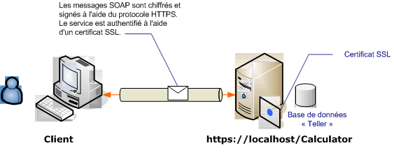

# <a name="transport-security-with-an-anonymous-client"></a>Sécurité des transports avec un client anonyme
Dans cette situation, [!INCLUDE[indigo1](../../../../includes/indigo1-md.md)] utilise la sécurité de transport (HTTPS) pour garantir l'intégrité et la confidentialité des données. Le serveur doit être authentifié à l'aide d'un certificat SSL (Secure Sockets Layer). Les clients doivent ensuite faire confiance à ce certificat. Aucun mécanisme n'authentifie les clients, ceux-ci restent donc anonymes.  
  
 Pour un exemple d’application, consultez [sécurité du Transport WS](../../../../docs/framework/wcf/samples/ws-transport-security.md). [!INCLUDE[crabout](../../../../includes/crabout-md.md)]sécurité de transport, consultez [vue d’ensemble de sécurité de Transport](../../../../docs/framework/wcf/feature-details/transport-security-overview.md).  
  
 [!INCLUDE[crabout](../../../../includes/crabout-md.md)]à l’aide d’un certificat avec un service, consultez [utilisation des certificats](../../../../docs/framework/wcf/feature-details/working-with-certificates.md) et [Comment : configurer un Port avec un certificat SSL](../../../../docs/framework/wcf/feature-details/how-to-configure-a-port-with-an-ssl-certificate.md).  
  
   
  
|Caractéristique|Description|  
|--------------------|-----------------|  
|Mode de sécurité|Transport|  
|Interopérabilité|Avec les services Web et les clients existants|  
|Authentification (serveur)<br /><br /> Authentification (client)|Oui<br /><br /> Niveau application (pas de prise en charge [!INCLUDE[indigo2](../../../../includes/indigo2-md.md)])|  
|Intégrité|Oui|  
|Confidentialité|Oui|  
|Transport|HTTPS|  
|Liaison|<<!--zz xref:System.ServiceModel.WsHttpBinding --> `xref:System.ServiceModel.WsHttpBinding`>|  
  
## <a name="service"></a>Service  
 La configuration et le code ci-dessous sont conçus pour s'exécuter indépendamment. Effectuez l’une des opérations suivantes :  
  
-   Créez un service autonome à l'aide du code sans configuration.  
  
-   Créez un service à l'aide de la configuration fournie, mais ne définissez pas de point de terminaison.  
  
### <a name="code"></a>Code  
 Le code suivant illustre comment créer un point de terminaison à l'aide de la sécurité de transport :  
  
 [!code-csharp[c_SecurityScenarios#5](../../../../samples/snippets/csharp/VS_Snippets_CFX/c_securityscenarios/cs/source.cs#5)]
 [!code-vb[c_SecurityScenarios#5](../../../../samples/snippets/visualbasic/VS_Snippets_CFX/c_securityscenarios/vb/source.vb#5)]  
  
### <a name="configuration"></a>Configuration  
 Le code ci-dessous configure le même point de terminaison en utilisant la configuration. Aucun mécanisme n'authentifie les clients, ceux-ci restent donc anonymes.  
  
```xml  
<?xml version="1.0" encoding="utf-8"?>  
<configuration>  
  <system.serviceModel>  
    <services>  
      <service name="ServiceModel.Calculator">  
        <endpoint address="http://localhost/Calculator"   
                  binding="wsHttpBinding"  
                  bindingConfiguration="WSHttpBinding_ICalculator"   
                  name="SecuredByTransportEndpoint"  
                  contract="ServiceModel.ICalculator" />  
      </service>  
    </services>  
    <bindings>  
      <wsHttpBinding>  
        <binding name="WSHttpBinding_ICalculator">  
          <security mode="Transport">  
            <transport clientCredentialType="None" />  
          </security>  
        </binding>  
      </wsHttpBinding>  
    </bindings>  
    <client />  
  </system.serviceModel>  
</configuration>  
```  
  
## <a name="client"></a>Client  
 La configuration et le code ci-dessous sont conçus pour s'exécuter indépendamment. Effectuez l’une des opérations suivantes :  
  
-   Créez un client autonome à l'aide du code (et du code client).  
  
-   Créez un client qui ne définit pas d'adresse de point de terminaison. Au lieu de cela, utilisez le constructeur client qui accepte le nom de configuration comme argument. Par exemple :  
  
     [!code-csharp[C_SecurityScenarios#0](../../../../samples/snippets/csharp/VS_Snippets_CFX/c_securityscenarios/cs/source.cs#0)]
     [!code-vb[C_SecurityScenarios#0](../../../../samples/snippets/visualbasic/VS_Snippets_CFX/c_securityscenarios/vb/source.vb#0)]  
  
### <a name="code"></a>Code  
 [!code-csharp[c_SecurityScenarios#6](../../../../samples/snippets/csharp/VS_Snippets_CFX/c_securityscenarios/cs/source.cs#6)]
 [!code-vb[c_SecurityScenarios#6](../../../../samples/snippets/visualbasic/VS_Snippets_CFX/c_securityscenarios/vb/source.vb#6)]  
  
### <a name="configuration"></a>Configuration  
 La configuration suivante peut être utilisée à la place du code pour paramétrer le service :  
  
```xml  
<configuration>  
  <system.serviceModel>  
    <bindings>  
      <wsHttpBinding>  
        <binding name="WSHttpBinding_ICalculator" >  
          <security mode="Transport">  
            <transport clientCredentialType="None" />  
          </security>  
        </binding>  
      </wsHttpBinding>  
    </bindings>  
    <client>  
      <endpoint address="https://machineName/Calculator"   
                binding="wsHttpBinding"  
                bindingConfiguration="WSHttpBinding_ICalculator"   
                contract="ICalculator"  
                name="WSHttpBinding_ICalculator" />  
    </client>  
  </system.serviceModel>  
</configuration>  
```  
  
## <a name="see-also"></a>Voir aussi  
 [Vue d’ensemble de la sécurité](../../../../docs/framework/wcf/feature-details/security-overview.md)  
 [Sécurité du Transport de WS](../../../../docs/framework/wcf/samples/ws-transport-security.md)  
 [Vue d’ensemble de la sécurité du transport](../../../../docs/framework/wcf/feature-details/transport-security-overview.md)  
 [Modèle de sécurité pour Windows Server AppFabric](http://go.microsoft.com/fwlink/?LinkID=201279&clcid=0x409)
