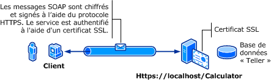

# S&#233;curit&#233; de transport avec l&#39;authentification de base
L'illustration suivante montre un service et un client [!INCLUDE[indigo1](../../../../includes/indigo1-md.md)].  Le serveur nécessite un certificat X.509 valide qui peut être utilisé pour SSL \(Secure Sockets Layer\) et les clients doivent approuver le certificat du serveur.  De plus, le service Web contient déjà une implémentation SSL disponible.  [!INCLUDE[crabout](../../../../includes/crabout-md.md)] l'activation de l'authentification de base sur Internet Information Services \(IIS\), consultez [http:\/\/go.microsoft.com\/fwlink\/?LinkId\=83822](http://go.microsoft.com/fwlink/?LinkId=83822).  
  
   
  
|Caractéristique|Description|  
|---------------------|-----------------|  
|Mode de sécurité|Transport|  
|Interopérabilité|Avec les clients de service Web et les services existants|  
|Authentification \(serveur\)<br /><br /> Authentification \(client\)|Oui \(à l'aide de HTTPS\)<br /><br /> Oui \(à l'aide du Nom d'utilisateur\/Mot de passe\)|  
|Intégrité|Oui|  
|Confidentialité|Oui|  
|Transport|HTTPS|  
|Binding|<xref:System.ServiceModel.WSHttpBinding>|  
  
## Service  
 La configuration et le code ci\-dessous sont conçus pour s'exécuter indépendamment.  Effectuez l’une des opérations suivantes :  
  
-   Créez un service autonome à l'aide du code sans configuration.  
  
-   Créez un service à l'aide de la configuration fournie, mais ne définissez pas de point de terminaison.  
  
### Code  
 Le code suivant montre comment créer un point de terminaison de service qui utilise un nom d'utilisateur de domaine et un mot de passe Windows pour la sécurité de transfert.  Notez que le service requiert un certificat X.509 pour s'authentifier auprès du client.  Pour plus d’informations, consultez [Utilisation des certificats](../../../../docs/framework/wcf/feature-details/working-with-certificates.md) et [Comment : configurer un port avec un certificat SSL](../../../../docs/framework/wcf/feature-details/how-to-configure-a-port-with-an-ssl-certificate.md).  
  
 [!code-csharp[C_SecurityScenarios#1](../../../../samples/snippets/csharp/VS_Snippets_CFX/c_securityscenarios/cs/source.cs#1)]
 [!code-vb[C_SecurityScenarios#1](../../../../samples/snippets/visualbasic/VS_Snippets_CFX/c_securityscenarios/vb/source.vb#1)]  
  
## Configuration  
 Les éléments suivants configurent un service pour utiliser l'authentification de base avec la sécurité au niveau du transport :  
  
```  
<?xml version="1.0" encoding="utf-8"?>  
<configuration>  
    <system.serviceModel>  
        <bindings>  
            <wsHttpBinding>  
                <binding name="UsernameWithTransport">  
                    <security mode="Transport">  
                        <transport clientCredentialType="Basic" />  
                    </security>  
                </binding>  
            </wsHttpBinding>  
        </bindings>  
        <services>  
            <service name="BasicAuthentication.Calculator">  
                <endpoint address="https://localhost/Calculator"  
                          binding="wsHttpBinding"   
                          bindingConfiguration="UsernameWithTransport"  
                          name="BasicEndpoint"   
                          contract="BasicAuthentication.ICalculator" />  
            </service>  
        </services>  
    </system.serviceModel>  
</configuration>  
```  
  
## Client  
  
### Code  
 Le code suivant affiche le code client qui inclut le nom d'utilisateur et le mot de passe.  Notez que l'utilisateur doit fournir un nom d'utilisateur et un mot de passe Windows valides.  Le code pour retourner le nom d'utilisateur et le mot de passe n'est pas indiqué.  Utilisez une boîte de dialogue ou une autre interface pour demander les informations à l'utilisateur.  
  
> [!NOTE]
>  Le nom d'utilisateur et le mot de passe peuvent être définis uniquement à l'aide de code.  
  
 [!code-csharp[C_SecurityScenarios#2](../../../../samples/snippets/csharp/VS_Snippets_CFX/c_securityscenarios/cs/source.cs#2)]
 [!code-vb[C_SecurityScenarios#2](../../../../samples/snippets/visualbasic/VS_Snippets_CFX/c_securityscenarios/vb/source.vb#2)]  
  
### Configuration  
 Le code suivant affiche la configuration du client.  
  
> [!NOTE]
>  Vous ne pouvez pas utiliser la configuration pour définir le nom d'utilisateur et le mot de passe.  La configuration indiquée ici doit être augmentée à l'aide du code pour définir le nom d'utilisateur et le mot de passe.  
  
```  
<?xml version="1.0" encoding="utf-8"?>  
<configuration>  
  <system.serviceModel>  
    <bindings>  
      <wsHttpBinding>  
        <binding name="WSHttpBinding_ICalculator" >  
          <security mode="Transport">  
            <transport clientCredentialType="Basic" />  
          </security>  
        </binding>  
      </wsHttpBinding>  
    </bindings>  
    <client>  
      <endpoint address="https://machineName/Calculator"   
                binding="wsHttpBinding"  
                bindingConfiguration="WSHttpBinding_ICalculator"   
                contract="ICalculator"  
                name="WSHttpBinding_ICalculator" />  
    </client>  
  </system.serviceModel>  
</configuration>  
```  
  
## Voir aussi  
 <xref:System.ServiceModel.ClientBase%601.ClientCredentials%2A>   
 <xref:System.ServiceModel.Security.UserNamePasswordClientCredential>   
 [Utilisation des certificats](../../../../docs/framework/wcf/feature-details/working-with-certificates.md)   
 [Comment : configurer un port avec un certificat SSL](../../../../docs/framework/wcf/feature-details/how-to-configure-a-port-with-an-ssl-certificate.md)   
 [Vue d'ensemble de la sécurité](../../../../docs/framework/wcf/feature-details/security-overview.md)   
 [\<clientCredentials\>](../../../../docs/framework/configure-apps/file-schema/wcf/clientcredentials.md)   
 [Modèle de sécurité pour Windows Server App Fabric](http://go.microsoft.com/fwlink/?LinkID=201279&clcid=0x409)