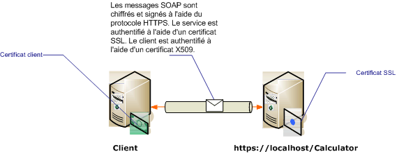

# <a name="transport-security-with-certificate-authentication"></a><span data-ttu-id="87a25-102">Sécurité de transport avec l'authentification par certificat</span><span class="sxs-lookup"><span data-stu-id="87a25-102">Transport Security with Certificate Authentication</span></span>
<span data-ttu-id="87a25-103">Cette rubrique décrit l'utilisation des certificats X.509 pour l'authentification du serveur et du client lorsque vous utilisez la sécurité de transport.</span><span class="sxs-lookup"><span data-stu-id="87a25-103">This topic discusses using X.509 certificates for server and client authentication when using transport security.</span></span> <span data-ttu-id="87a25-104">Pour plus d’informations sur la norme X.509 certificats Voir [des certificats de clé publique X.509](http://msdn.microsoft.com/library/bb540819\(VS.85\).aspx).</span><span class="sxs-lookup"><span data-stu-id="87a25-104">For more information about X.509 certificates see [X.509 Public Key Certificates](http://msdn.microsoft.com/library/bb540819\(VS.85\).aspx).</span></span> <span data-ttu-id="87a25-105">Certificats doivent être émis par une autorité de certification, qui est souvent un tiers émetteur de certificats.</span><span class="sxs-lookup"><span data-stu-id="87a25-105">Certificates must be issued by a certification authority, which is often a third-party issuer of certificates.</span></span> <span data-ttu-id="87a25-106">Dans un domaine Windows Server, les services de certificats Active Directory peuvent être utilisés pour émettre des certificats pour les ordinateurs clients figurant sur le domaine.</span><span class="sxs-lookup"><span data-stu-id="87a25-106">On a Windows Server domain, Active Directory Certificate Services can be used to issue certificates to client computers on the domain.</span></span> <span data-ttu-id="87a25-107">Pour plus d’informations, consultez [Services de certificats Windows 2008 R2](http://go.microsoft.com/fwlink/?LinkID=209949&clcid=0x409).</span><span class="sxs-lookup"><span data-stu-id="87a25-107">For more information see [Windows 2008 R2 Certificate Services](http://go.microsoft.com/fwlink/?LinkID=209949&clcid=0x409).</span></span> <span data-ttu-id="87a25-108">Dans ce scénario, le service est hébergé sous Internet Information Services (IIS) qui est configuré avec SSL (Secure Sockets Layer).</span><span class="sxs-lookup"><span data-stu-id="87a25-108">In this scenario, the service is hosted under Internet Information Services (IIS) which is configured with Secure Sockets Layer (SSL).</span></span> <span data-ttu-id="87a25-109">Le service est configuré avec un certificat SSL (X.509) pour permettre aux clients de vérifier l'identité du serveur.</span><span class="sxs-lookup"><span data-stu-id="87a25-109">The service is configured with an SSL (X.509) certificate to allow clients to verify the identity of the server.</span></span> <span data-ttu-id="87a25-110">Le client est également configuré avec un certificat X.509 qui permet au service de vérifier l'identité du client.</span><span class="sxs-lookup"><span data-stu-id="87a25-110">The client is also configured with an X.509 certificate that allows the service to verify the identity of the client.</span></span> <span data-ttu-id="87a25-111">Le certificat du serveur doit être approuvé par le client et le certificat du client doit être approuvé par le serveur.</span><span class="sxs-lookup"><span data-stu-id="87a25-111">The server’s certificate must be trusted by the client and the client’s certificate must be trusted by the server.</span></span> <span data-ttu-id="87a25-112">Le mécanisme réel de vérification par le service et le client de leurs identités réciproques n'est pas traité dans cette rubrique.</span><span class="sxs-lookup"><span data-stu-id="87a25-112">The actual mechanics of how the service and client verifies each other’s identity is beyond the scope of this topic.</span></span> <span data-ttu-id="87a25-113">Pour plus d’informations, consultez [Signature numérique sur Wikipédia](http://go.microsoft.com/fwlink/?LinkId=253157).</span><span class="sxs-lookup"><span data-stu-id="87a25-113">For more information see [Digital Signature on Wikipedia](http://go.microsoft.com/fwlink/?LinkId=253157).</span></span>  
  
 <span data-ttu-id="87a25-114">Ce scénario implémente un modèle de message de demande/réponse comme illustré dans le schéma suivant.</span><span class="sxs-lookup"><span data-stu-id="87a25-114">This scenario implements a request/reply message pattern as illustrated by the following diagram.</span></span>  
  
 <span data-ttu-id="87a25-115"></span><span class="sxs-lookup"><span data-stu-id="87a25-115"></span></span>  
  
 [!INCLUDE[crabout](../../../../includes/crabout-md.md)]<span data-ttu-id="87a25-116">à l’aide d’un certificat avec un service, consultez [utilisation des certificats](../../../../docs/framework/wcf/feature-details/working-with-certificates.md) et [Comment : configurer un Port avec un certificat SSL](../../../../docs/framework/wcf/feature-details/how-to-configure-a-port-with-an-ssl-certificate.md).</span><span class="sxs-lookup"><span data-stu-id="87a25-116"> using a certificate with a service, see [Working with Certificates](../../../../docs/framework/wcf/feature-details/working-with-certificates.md) and [How to: Configure a Port with an SSL Certificate](../../../../docs/framework/wcf/feature-details/how-to-configure-a-port-with-an-ssl-certificate.md).</span></span> <span data-ttu-id="87a25-117">Le tableau suivant décrit les différentes caractéristiques du scénario.</span><span class="sxs-lookup"><span data-stu-id="87a25-117">The following table describes the various characteristics of the scenario.</span></span>  
  
|<span data-ttu-id="87a25-118">Caractéristique</span><span class="sxs-lookup"><span data-stu-id="87a25-118">Characteristic</span></span>|<span data-ttu-id="87a25-119">Description</span><span class="sxs-lookup"><span data-stu-id="87a25-119">Description</span></span>|  
|--------------------|-----------------|  
|<span data-ttu-id="87a25-120">Mode de sécurité</span><span class="sxs-lookup"><span data-stu-id="87a25-120">Security Mode</span></span>|<span data-ttu-id="87a25-121">Transport</span><span class="sxs-lookup"><span data-stu-id="87a25-121">Transport</span></span>|  
|<span data-ttu-id="87a25-122">Interopérabilité</span><span class="sxs-lookup"><span data-stu-id="87a25-122">Interoperability</span></span>|<span data-ttu-id="87a25-123">Avec les clients de service Web et les services existants.</span><span class="sxs-lookup"><span data-stu-id="87a25-123">With existing Web service clients and services.</span></span>|  
|<span data-ttu-id="87a25-124">Authentification (serveur)</span><span class="sxs-lookup"><span data-stu-id="87a25-124">Authentication (Server)</span></span><br /><br /> <span data-ttu-id="87a25-125">Authentification (client)</span><span class="sxs-lookup"><span data-stu-id="87a25-125">Authentication (Client)</span></span>|<span data-ttu-id="87a25-126">Oui (à l’aide d’un certificat SSL)</span><span class="sxs-lookup"><span data-stu-id="87a25-126">Yes (using an SSL certificate)</span></span><br /><br /> <span data-ttu-id="87a25-127">Oui (à l'aide d'un certificat X.509)</span><span class="sxs-lookup"><span data-stu-id="87a25-127">Yes (using an X.509 certificate)</span></span>|  
|<span data-ttu-id="87a25-128">Intégrité des données</span><span class="sxs-lookup"><span data-stu-id="87a25-128">Data Integrity</span></span>|<span data-ttu-id="87a25-129">Oui</span><span class="sxs-lookup"><span data-stu-id="87a25-129">Yes</span></span>|  
|<span data-ttu-id="87a25-130">Confidentialité des données</span><span class="sxs-lookup"><span data-stu-id="87a25-130">Data Confidentiality</span></span>|<span data-ttu-id="87a25-131">Oui</span><span class="sxs-lookup"><span data-stu-id="87a25-131">Yes</span></span>|  
|<span data-ttu-id="87a25-132">Transport</span><span class="sxs-lookup"><span data-stu-id="87a25-132">Transport</span></span>|<span data-ttu-id="87a25-133">HTTPS</span><span class="sxs-lookup"><span data-stu-id="87a25-133">HTTPS</span></span>|  
|<span data-ttu-id="87a25-134">Liaison</span><span class="sxs-lookup"><span data-stu-id="87a25-134">Binding</span></span>|<xref:System.ServiceModel.WSHttpBinding>|  
  
## <a name="configure-the-service"></a><span data-ttu-id="87a25-135">Configuration du service</span><span class="sxs-lookup"><span data-stu-id="87a25-135">Configure the Service</span></span>  
 <span data-ttu-id="87a25-136">Puisque le service dans ce scénario est hébergé sous IIS, il est configuré à l'aide d'un fichier web.config.</span><span class="sxs-lookup"><span data-stu-id="87a25-136">Since the service in this scenario is hosted under IIS, it is configured with a web.config file.</span></span> <span data-ttu-id="87a25-137">La configuration Web suivante illustre comment configurer le <xref:System.ServiceModel.WSHttpBinding> pour utiliser la sécurité de transport et les informations d'identification du client X.509.</span><span class="sxs-lookup"><span data-stu-id="87a25-137">The following web.config shows how to configure the <xref:System.ServiceModel.WSHttpBinding> to use transport security and X.509 client credentials.</span></span>  
  
```xml  
<configuration>  
  <system.serviceModel>  
    <protocolMapping>  
      <add scheme="https" binding="wsHttpBinding" />  
    </protocolMapping>  
    <bindings>  
      <wsHttpBinding>  
        <!-- configure wsHttp binding with Transport security mode and clientCredentialType as Certificate -->  
        <binding>  
          <security mode="Transport">  
            <transport clientCredentialType="Certificate"/>              
          </security>  
        </binding>  
      </wsHttpBinding>  
    </bindings>  
    <!--For debugging purposes set the includeExceptionDetailInFaults attribute to true-->  
    <behaviors>  
      <serviceBehaviors>  
        <behavior>            
           <serviceDebug includeExceptionDetailInFaults="True" />  
        </behavior>  
      </serviceBehaviors>  
    </behaviors>  
  </system.serviceModel>  
</configuration>  
```  
  
## <a name="configure-the-client"></a><span data-ttu-id="87a25-138">Configuration du client</span><span class="sxs-lookup"><span data-stu-id="87a25-138">Configure the Client</span></span>  
 <span data-ttu-id="87a25-139">Le client peut être configuré en code ou dans un fichier app.config.</span><span class="sxs-lookup"><span data-stu-id="87a25-139">The client can be configured in code or in an app.config file.</span></span> <span data-ttu-id="87a25-140">L'exemple suivant indique comment configurer le client en code.</span><span class="sxs-lookup"><span data-stu-id="87a25-140">The following example shows how to configure the client in code.</span></span>  
  
```vb  
// Create the binding.  
WSHttpBinding myBinding = new WSHttpBinding();  
myBinding.Security.Mode = SecurityMode.Transport;  
myBinding.Security.Transport.ClientCredentialType =  
   HttpClientCredentialType.Certificate;  
  
// Create the endpoint address. Note that the machine name   
// must match the subject or DNS field of the X.509 certificate  
// used to authenticate the service.   
EndpointAddress ea = new  
   EndpointAddress("https://localhost/CalculatorService/service.svc");  
  
// Create the client. The code for the calculator   
// client is not shown here. See the sample applications  
// for examples of the calculator code.  
CalculatorClient cc =  
   new CalculatorClient(myBinding, ea);  
  
// The client must specify a certificate trusted by the server.  
cc.ClientCredentials.ClientCertificate.SetCertificate(  
    StoreLocation.CurrentUser,  
    StoreName.My,  
    X509FindType.FindBySubjectName,  
    "contoso.com");  
  
// Begin using the client.  
Console.WriteLine(cc.Add(100, 1111));  
//...  
cc.Close();  
```  
  
 <span data-ttu-id="87a25-141">Vous pouvez aussi configurer le client dans un fichier app.config, comme indiqué dans l'exemple suivant :</span><span class="sxs-lookup"><span data-stu-id="87a25-141">Alternatively you can configure the client in an App.config file as shown in the following example:</span></span>  
  
```xml  
<configuration>  
  <system.serviceModel>  
    <client>  
      <!-- this endpoint has an https: address -->  
      <endpoint address=" https://localhost/CalculatorService/service.svc "   
                behaviorConfiguration="endpointCredentialBehavior"  
                binding="wsHttpBinding"   
                bindingConfiguration="Binding1"   
                contract="Microsoft.Samples.TransportSecurity.ICalculator"/>  
    </client>  
    <behaviors>  
      <endpointBehaviors>  
        <behavior name="endpointCredentialBehavior">  
          <clientCredentials>  
            <clientCertificate findValue="contoso.com"  
                               storeLocation="CurrentUser"  
                               storeName="My"  
                               x509FindType="FindBySubjectName" />  
          </clientCredentials>  
        </behavior>  
      </endpointBehaviors>  
    </behaviors>  
    <bindings>  
      <wsHttpBinding>  
        <!-- configure wsHttpbinding with Transport security mode  
                   and clientCredentialType as Certificate -->  
        <binding name="Binding1">  
          <security mode="Transport">  
            <transport clientCredentialType="Certificate"/>  
          </security>  
        </binding>  
      </wsHttpBinding>  
    </bindings>  
  </system.serviceModel>  
  
<startup><supportedRuntime version="v4.0" sku=".NETFramework,Version=v4.0"/></startup></configuration>  
```  
  
## <a name="see-also"></a><span data-ttu-id="87a25-142">Voir aussi</span><span class="sxs-lookup"><span data-stu-id="87a25-142">See Also</span></span>  
 [<span data-ttu-id="87a25-143">Vue d’ensemble de la sécurité</span><span class="sxs-lookup"><span data-stu-id="87a25-143">Security Overview</span></span>](../../../../docs/framework/wcf/feature-details/security-overview.md)  
 [<span data-ttu-id="87a25-144">Modèle de sécurité pour Windows Server AppFabric</span><span class="sxs-lookup"><span data-stu-id="87a25-144">Security Model for Windows Server App Fabric</span></span>](http://go.microsoft.com/fwlink/?LinkID=201279&clcid=0x409)
