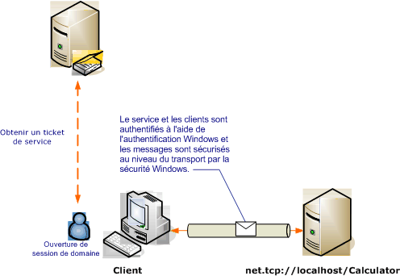

# S&#233;curit&#233; de transport avec l&#39;authentification Windows
Le scénario suivant illustre un client [!INCLUDE[indigo1](../../../../includes/indigo1-md.md)] et le service sécurisé par la sécurité Windows.[!INCLUDE[crabout](../../../../includes/crabout-md.md)] la programmation, consultez [Comment : sécuriser un service à l'aide d'informations d'identification Windows](../../../../docs/framework/wcf/how-to-secure-a-service-with-windows-credentials.md).  
  
 Un service Web d'intranet affiche des informations de ressources humaines.Le client est une application Windows Form.L'application est déployée dans un domaine sécurisé par un contrôleur Kerberos.  
  
   
  
|Caractéristique|Description|  
|---------------------|-----------------|  
|Mode de sécurité|Transport|  
|Interopérabilité|[!INCLUDE[indigo2](../../../../includes/indigo2-md.md)] uniquement|  
|Authentification \(serveur\)<br /><br /> Authentification \(client\)|Oui \(à l'aide de l'authentification intégrée Windows\)<br /><br /> Oui \(à l'aide de l'authentification intégrée Windows\)|  
|Intégrité|Oui|  
|Confidentialité|Oui|  
|Transport|NET.TCP|  
|Liaison|<xref:System.ServiceModel.NetTcpBinding>|  
  
## Service  
 La configuration et le code ci\-dessous sont conçus pour s'exécuter indépendamment.Effectuez l'une des opérations suivantes :  
  
-   Créez un service autonome à l'aide du code sans configuration.  
  
-   Créez un service à l'aide de la configuration fournie, mais ne définissez pas de point de terminaison.  
  
### Code  
 Le code ci\-dessous montre comment créer un point de terminaison de service qui utilise une sécurité Windows.  
  
 [!code-csharp[C_SecurityScenarios#3](../../../../samples/snippets/csharp/VS_Snippets_CFX/c_securityscenarios/cs/source.cs#3)]
 [!code-vb[C_SecurityScenarios#3](../../../../samples/snippets/visualbasic/VS_Snippets_CFX/c_securityscenarios/vb/source.vb#3)]  
  
### Configuration  
 La configuration ci\-dessous peut être utilisée à la place du code pour paramétrer le point de terminaison de service :  
  
```  
<?xml version="1.0" encoding="utf-8"?>  
<configuration>  
  <system.serviceModel>  
    <behaviors />  
    <services>  
      <service behaviorConfiguration="" name="ServiceModel.Calculator">  
        <endpoint address="net.tcp://localhost:8008/Calculator"   
                  binding="netTcpBinding"  
          bindingConfiguration="WindowsClientOverTcp"   
                  name="WindowsClientOverTcp"  
                  contract="ServiceModel.ICalculator" />  
      </service>  
    </services>  
    <bindings>  
      <netTcpBinding>  
        <binding name="WindowsClientOverTcp">  
          <security mode="Transport">  
            <transport clientCredentialType="Windows" />  
          </security>  
        </binding>  
      </netTcpBinding>  
    </bindings>  
    <client />  
  </system.serviceModel>  
</configuration>  
```  
  
## Client  
 La configuration et le code ci\-dessous sont destinés à s'exécuter indépendamment.Effectuez l'une des opérations suivantes :  
  
-   Créez un client autonome à l'aide du code \(et du code client\).  
  
-   Créez un client qui ne définit pas d'adresse de point de terminaison.Au lieu de cela, utilisez le constructeur client qui accepte le nom de configuration comme argument.Par exemple :  
  
     [!code-csharp[C_SecurityScenarios#0](../../../../samples/snippets/csharp/VS_Snippets_CFX/c_securityscenarios/cs/source.cs#0)]
     [!code-vb[C_SecurityScenarios#0](../../../../samples/snippets/visualbasic/VS_Snippets_CFX/c_securityscenarios/vb/source.vb#0)]  
  
### Code  
 Le code ci\-dessous crée le client.La liaison est configurée de manière à utiliser la sécurité du mode de transport, avec le transport TCP et avec le type Windows d'informations d'identification du client.  
  
 [!code-csharp[C_SecurityScenarios#4](../../../../samples/snippets/csharp/VS_Snippets_CFX/c_securityscenarios/cs/source.cs#4)]
 [!code-vb[C_SecurityScenarios#4](../../../../samples/snippets/visualbasic/VS_Snippets_CFX/c_securityscenarios/vb/source.vb#4)]  
  
### Configuration  
 La configuration ci\-dessous peut être utilisée à la place du code pour créer le client.  
  
```  
<?xml version="1.0" encoding="utf-8"?>  
<configuration>  
  <system.serviceModel>  
    <bindings>  
      <netTcpBinding>  
        <binding name="NetTcpBinding_ICalculator" >  
          <security mode="Transport">  
            <transport clientCredentialType="Windows" />  
          </security>  
        </binding>  
      </netTcpBinding>  
    </bindings>  
    <client>  
      <endpoint address="net.tcp://localhost:8008/Calculator"   
                binding="netTcpBinding"            
                bindingConfiguration="NetTcpBinding_ICalculator"   
                contract="ICalculator"  
                name="NetTcpBinding_ICalculator">  
      </endpoint>  
    </client>  
  </system.serviceModel>  
</configuration>  
```  
  
## Voir aussi  
 [Vue d'ensemble de la sécurité](../../../../docs/framework/wcf/feature-details/security-overview.md)   
 [Comment : sécuriser un service à l'aide d'informations d'identification Windows](../../../../docs/framework/wcf/how-to-secure-a-service-with-windows-credentials.md)   
 [Modèle de sécurité pour Windows Server AppFabric](http://go.microsoft.com/fwlink/?LinkID=201279&clcid=0x409)