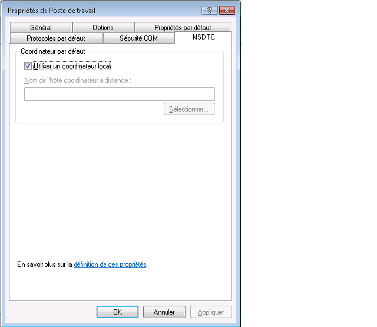
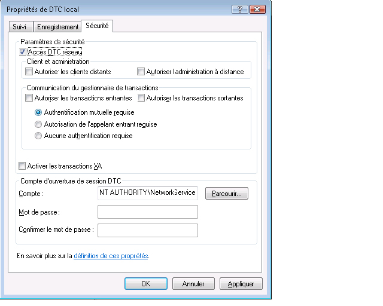

# <a name="troubleshooting-queued-messaging"></a>Résolution des problèmes de messagerie en file d'attente
Cette section contient les questions courantes et l'aide à la résolution des problèmes relatifs à l'utilisation des files d'attente dans [!INCLUDE[indigo1](../../../../includes/indigo1-md.md)].  
  
## <a name="common-questions"></a>Questions courantes  
 **Q :** j’ai utilisé [!INCLUDE[indigo2](../../../../includes/indigo2-md.md)] bêta 1 et installé le correctif logiciel MSMQ. Est-ce que je dois supprimer le correctif logiciel ?  
  
 **R :** Oui. Ce correctif logiciel n'est plus pris en charge. [!INCLUDE[indigo2](../../../../includes/indigo2-md.md)] fonctionne maintenant sur MSMQ sans spécification de correctif logiciel.  
  
 **Q :** il existe deux liaisons pour MSMQ : <xref:System.ServiceModel.NetMsmqBinding> et <xref:System.ServiceModel.MsmqIntegration.MsmqIntegrationBinding>. Laquelle dois-je utiliser et à quel moment ?  
  
 **R :** utiliser le <xref:System.ServiceModel.NetMsmqBinding> lorsque vous souhaitez utiliser MSMQ comme transport pour la communication en file d’attente entre deux [!INCLUDE[indigo2](../../../../includes/indigo2-md.md)] applications. Utilisez <xref:System.ServiceModel.MsmqIntegration.MsmqIntegrationBinding> lorsque vous souhaitez utiliser des applications MSMQ existantes pour communiquer avec les nouvelles applications [!INCLUDE[indigo2](../../../../includes/indigo2-md.md)].  
  
 **Q :** ai-je besoin de mettre à niveau MSMQ pour utiliser le <xref:System.ServiceModel.NetMsmqBinding> et `MsmqIntegration` liaisons ?  
  
 **R :** non. Les deux liaisons fonctionnent avec MSMQ 3.0 sur [!INCLUDE[wxp](../../../../includes/wxp-md.md)] et [!INCLUDE[ws2003](../../../../includes/ws2003-md.md)]. Certaines fonctionnalités des liaisons deviennent disponibles lorsque vous effectuez la mise à niveau vers MSMQ 4.0 dans [!INCLUDE[wv](../../../../includes/wv-md.md)].  
  
 **Q :** les fonctionnalités de la <xref:System.ServiceModel.NetMsmqBinding> et <xref:System.ServiceModel.MsmqIntegration.MsmqIntegrationBinding> liaisons sont disponibles dans MSMQ 4.0 mais pas dans MSMQ 3.0 ?  
  
 **R :** les fonctionnalités suivantes sont disponibles dans MSMQ 4.0 mais pas dans MSMQ 3.0 :  
  
-   La file d'attente de lettres mortes personnalisée est uniquement prise en charge sur MSMQ 4.0.  
  
-   MSMQ 3.0 et 4.0 gèrent les messages incohérents différemment.  
  
-   Seul MSMQ 4.0 prend en charge la lecture transactionnelle à distance.  
  
 [!INCLUDE[crdefault](../../../../includes/crdefault-md.md)][Les différences dans les files d’attente de fonctionnalités dans Windows Vista, Windows Server 2003 et Windows XP](../../../../docs/framework/wcf/feature-details/diff-in-queue-in-vista-server-2003-windows-xp.md).  
  
 **Q :** puis-je utiliser MSMQ 3.0 sur le côté « un » d’une communication en file d’attente et MSMQ 4.0 sur l’autre côté ?  
  
 **R :** Oui.  
  
 **Q :** je souhaite intégrer des applications MSMQ existantes avec new [!INCLUDE[indigo2](../../../../includes/indigo2-md.md)] clients ou serveurs. Est-ce que je dois mettre à niveau les deux côtés de mon infrastructure MSMQ ?  
  
 **R :** non. Vous n'êtes pas obligé d'effectuer la mise à niveau vers MSMQ 4.0 sur l'un ou l'autre des côtés.  
  
## <a name="troubleshooting"></a>Résolution des problèmes  
 Cette section contient les solutions aux problèmes les plus courants. Certains problèmes correspondant à des restrictions connues sont également décrits dans les notes de publication.  
  
 **Q :** vous essayez d’utiliser une file d’attente privée et j’obtiens l’exception suivante : `System.InvalidOperationException`: l’URL n’est pas valide. L'URL de la file d'attente ne peut pas contenir le caractère « $ ». Utilisez la syntaxe dans net.msmq://machine/private/queueName pour adresser une file d'attente privée.  
  
 **R :** Veuillez vérifier la file d’attente un identificateur de ressource uniforme (URI) dans votre configuration et le code. N'utilisez pas le caractère « $ » dans l'URI. Par exemple, pour adresser une file d'attente privée nommée OrdersQueue, spécifiez l'URI comme net.msmq://localhost/private/ordersQueue.  
  
 **Q :** appel `ServiceHost.Open()` sur mon application en file d’attente lève l’exception suivante : `System.ArgumentException`: une adresse de base ne peut pas contenir une chaîne de requête URI. Pourquoi ?  
  
 **R :** vérifier la file d’attente URI dans votre fichier de configuration et dans votre code. Alors que les files d'attente MSMQ prennent en charge l'utilisation du caractère '?', les Uri interprètent ce dernier comme le début d'une requête de chaîne. Pour éviter ce problème, utilisez des noms de file d'attente qui ne comportent pas de caractère '?'.  
  
 **Q :** mon envoi a réussi, mais aucune opération de service est appelée sur le récepteur. Pourquoi ?  
  
 **R :** pour déterminer la réponse, passez en revue la liste de vérification suivante :  
  
-   Vérifiez que les spécifications de la file d’attente transactionnelle sont compatibles avec les garanties spécifiées. Notez les principes suivants :  
  
    -   Vous pouvez envoyer des messages durables (datagrammes et sessions) avec « exactement une fois » assurances (<xref:System.ServiceModel.MsmqBindingBase.ExactlyOnce%2A> = `true`) uniquement à une file d’attente transactionnelle.  
  
    -   Vous pouvez envoyer des sessions uniquement avec des garanties « exactly-once ».  
  
    -   Une transaction est requise pour recevoir des messages dans une session provenant d’une file d’attente transactionnelle.  
  
    -   Vous pouvez envoyer ou recevoir des messages volatiles ou durables (datagrammes uniquement) sans garanties (<xref:System.ServiceModel.MsmqBindingBase.ExactlyOnce%2A> = `false`) uniquement à une file d’attente non transactionnelle.  
  
-   Vérifiez la file d'attente de lettres mortes. Si vous y trouvez les messages, déterminez pourquoi ils n'ont pas été remis.  
  
-   Recherchez dans les files d'attente sortantes d'éventuels problèmes de connectivité ou d'adressage.  
  
 **Q :** j’ai spécifié une file d’attente de lettres mortes personnalisée, mais lorsque je démarre l’application émettrice, j’obtiens une exception soit la file d’attente de lettres mortes est introuvable ou que l’application émettrice n’a aucune autorisation sur la file d’attente de lettres mortes. Pourquoi ?  
  
 **R :** la file de lettres mortes personnalisée URI doit inclure « localhost » ou le nom d’ordinateur dans le premier segment, par exemple, NET.MSMQ://localhost/Private/myappdead-Letter queue.  
  
 **Q :** est-il toujours nécessaire de définir une file d’attente de lettres mortes personnalisée, ou existe-t-il une file d’attente de lettres mortes par défaut ?  
  
 **R :** si les garanties sont « exactement une fois » (<xref:System.ServiceModel.MsmqBindingBase.ExactlyOnce%2A> = `true`), et si vous ne spécifiez pas une file d’attente de lettres mortes personnalisée, la valeur par défaut est une file d’attente de lettres mortes transactionnelle à l’échelle du système.  
  
 Si les garanties sont none (<xref:System.ServiceModel.MsmqBindingBase.ExactlyOnce%2A> = `false`), puis la valeur par défaut n’existe aucune fonctionnalité de file d’attente de lettres mortes.  
  
 **Q :** mon service lève une exception sur SvcHost.Open avec un message « les exigences EndpointListener ne peuvent pas être respectées par ListenerFactory ». Pourquoi ?  
  
 Un fichier . Consultez votre contrat de service. Vous avez peut-être oublié de mettre « IsOneWay =`true`» sur toutes les opérations de service. Les files d'attente prennent uniquement en charge les opérations de service monodirectionnelles.  
  
 **Q :** contient des messages dans la file d’attente mais aucune opération de service est appelée. Quel est le problème ?  
  
 **R :** déterminer si votre hôte de service est défectueux. Vous pouvez le vérifier en examinant le suivi ou en implémentant `IErrorHandler`. L'hôte de service provoque une erreur, par défaut, si un message incohérent est détecté.  
  
 **Q :** contient des messages dans la file d’attente mais mon service en file d’attente hébergée sur le Web n’est pas activé. Pourquoi ?  
  
 **R :** la raison la plus courante est d’autorisations.  
  
1.  Vérifiez que le processus `NetMsmqActivator` s'exécute et que des autorisations de lecture et de recherche sont attribuées à l'identité du processus `NetMsmqActivator` sur la file d'attente.  
  
2.  Si `NetMsmqActivator` surveille les files d'attente sur un ordinateur distant, assurez-vous que `NetMsmqActivator` ne s'exécute pas sous un jeton restreint. Pour exécuter `NetMsmqActivator` avec un jeton non restreint :  
  
    ```  
    sc sidtype NetMsmqActivator unrestricted  
    ```  
  
 Pour faire des problèmes de sécurité associés Web hôte : [Web hébergeant une Application en file d’attente](../../../../docs/framework/wcf/feature-details/web-hosting-a-queued-application.md).  
  
 **Q :** quel est le moyen le plus simple pour les sessions accès ?  
  
 **R :** définir la saisie semi-automatique =`true` sur l’opération qui correspond au dernier message de la session et définir la saisie semi-automatique =`false` sur toutes les opérations de service restantes.  
  
 **Q :** où trouver des réponses aux questions courantes sur MSMQ ?  
  
 **R :** [!INCLUDE[crabout](../../../../includes/crabout-md.md)] MSMQ, consultez [Microsoft Message Queuing](http://go.microsoft.com/fwlink/?LinkId=87810).  
  
 **Q :** Pourquoi mon service lève une `ProtocolException` lorsque la lecture à partir d’une file d’attente qui contient à la fois en file d’attente de messages de session et en file d’attente de messages de datagramme ?  
  
 **R :** il existe une différence fondamentale dans les messages de la session de façon en file d’attente et les messages de datagramme en file d’attente. De ce fait, un service conçu pour lire un message de session en file d'attente ne peut pas recevoir de message de datagramme en file d'attente et un service conçu pour lire un message de datagramme en file d'attente ne peut pas recevoir de message de session. La tentative de lire les deux types de messages à partir de la même file d'attente lève l'exception suivante :  
  
```  
System.ServiceModel.MsmqPoisonMessageException: The transport channel detected a poison message. This occurred because the message exceeded the maximum number of delivery attempts or because the channel detected a fundamental problem with the message. The inner exception may contain additional information.   
---> System.ServiceModel.ProtocolException: An incoming MSMQ message contained invalid or unexpected .NET Message Framing information in its body. The message cannot be received. Ensure that the sender is using a compatible service contract with a matching SessionMode.  
```  
  
 La file d'attente de lettres mortes du système, ainsi que toutes les files d'attente de lettres mortes personnalisées, sont particulièrement exposées à ce problème si une application envoie à la fois des messages de session en file d'attente et des messages de datagramme en file d'attente depuis le même ordinateur. Si un message ne peut pas être envoyé avec succès, il est déplacé vers la file d'attente de lettres mortes. Dans ces circonstances, il est possible d'avoir à la fois des messages de session et de datagramme dans la file d'attente de lettres mortes. Il n'existe aucun moyen de séparer les deux types de messages pendant l'exécution lors de la lecture à partir d'une file d'attente, par conséquent, les applications ne doivent pas envoyer à la fois des messages de session en file d'attente et des messages de datagramme en file d'attente depuis le même ordinateur.  
  
### <a name="msmq-integration-specific-troubleshooting"></a>Intégration de MSMQ : Dépannage spécifique  
 **Q :** lorsque j’envoie un message, ou l’ouverture de l’hôte de service, j’obtiens une erreur indiquant que le modèle est incorrect. Pourquoi ?  
  
 **R :** lorsque vous utilisez la liaison d’intégration MSMQ, vous devez utiliser le modèle msmq.formatname. Par exemple, msmq.formatname:DIRECT=OS:. \private $ \OrdersQueue. Mais lorsque vous spécifiez la file d'attente de lettres mortes personnalisée, vous devez utiliser le modèle net.msmq.  
  
 **Q :** lorsque vous utilisez un nom de format public ou privé, que vous ouvrez l’hôte de service sur [!INCLUDE[wv](../../../../includes/wv-md.md)], j’obtiens une erreur. Pourquoi ?  
  
 **R :** le [!INCLUDE[indigo2](../../../../includes/indigo2-md.md)] canal d’intégration sur [!INCLUDE[wv](../../../../includes/wv-md.md)] vérifie si une sous-file d’attente peut être ouverte pour la file d’attente de l’application principale pour la gestion des messages incohérents. Le nom de la sous-file d'attente est dérivé d'un URI msmq.formatname transmis à l'écouteur. Le nom de la sous-file d'attente dans MSMQ peut uniquement être un nom de format direct. Donc vous obtenez l'erreur. Remplacez l'URI de la file d'attente par un nom de format direct.  
  
 **Q :** lors de la réception d’une application MSMQ, le message se trouve dans la file d’attente et n’est pas lu par la réception [!INCLUDE[indigo2](../../../../includes/indigo2-md.md)] application. Pourquoi ?  
  
 **R :** vérifie si le message a un corps. Si le message n'a aucun corps, le canal d'intégration MSMQ l'ignore. Implémentez `IErrorHandler` pour être averti des exceptions et vérifiez les suivis.  
  
### <a name="security-related-troubleshooting"></a>Résolution des problèmes liés à la sécurité  
 **Q :** lorsque j’exécute l’exemple qui utilise une liaison par défaut en mode groupe de travail, les messages semblent être envoyés mais ne sont jamais reçus par le récepteur.  
  
 **R :** par défaut, les messages sont signés à l’aide d’un certificat interne MSMQ qui requiert le service d’annuaire Active Directory. En mode groupe de travail, parce qu'Active Directory n'est pas disponible, la signature des messages échoue. Par conséquent, le message arrive dans la file d’attente de lettres mortes et cause de l’échec, tels que « Signature incorrecte », est indiqué.  
  
 La solution à ce problème consiste à désactiver la sécurité. Cela est effectué en définissant <xref:System.ServiceModel.NetMsmqSecurity.Mode%2A>  =  <xref:System.ServiceModel.NetMsmqSecurityMode.None> pour qu’il fonctionne en mode groupe de travail.  
  
 Une autre solution consiste à obtenir <xref:System.ServiceModel.MsmqTransportSecurity> de la propriété <xref:System.ServiceModel.NetMsmqSecurity.Transport%2A> et à lui affecter la valeur <xref:System.ServiceModel.MsmqAuthenticationMode.Certificate>, puis à définir le certificat client.  
  
 Une autre solution consiste à installer MSMQ avec l'intégration Active Directory.  
  
 **Q :** lorsque j’envoie un message avec la liaison par défaut (sécurité de transport activée) dans Active Directory à une file d’attente, j’obtiens un message « certificat interne introuvable ». Comment puis-je résoudre ce problème ?  
  
 **R :** cela signifie que le certificat dans Active Directory pour l’expéditeur doit être renouvelé. Pour ce faire, ouvrez **le panneau de configuration**, **outils d’administration**, **gestion de l’ordinateur**, avec le bouton droit **MSMQ**, puis sélectionnez **Propriétés**. Sélectionnez le **certificat utilisateur** onglet et cliquez sur le **renouveler** bouton.  
  
 **Q :** lorsque j’envoie un message à l’aide de <xref:System.ServiceModel.MsmqAuthenticationMode.Certificate> et spécifier le certificat à utiliser, je reçois un message « Certificat non valide ». Comment puis-je résoudre ce problème ?  
  
 **R :** vous ne pouvez pas utiliser un magasin de certificats ordinateur local avec le mode certificat. Vous devez copier le certificat du magasin de certificats de l'ordinateur vers le magasin de l'utilisateur actuel à l'aide du composant logiciel enfichable Certificat. Pour obtenir le composant logiciel enfichable Certificat :  
  
1.  Cliquez sur **Démarrer**, sélectionnez **exécuter**, type `mmc`, puis cliquez sur **OK**.  
  
2.  Dans le **Microsoft Management Console**, ouvrez le **fichier** menu et sélectionnez **ajouter/supprimer un composant logiciel enfichable**.  
  
3.  Dans le **ajouter/supprimer un composant logiciel enfichable** boîte de dialogue, cliquez sur le **ajouter** bouton.  
  
4.  Dans le **ajouter Standalone Snap-in** boîte de dialogue, sélectionnez certificats et cliquez sur **ajouter**.  
  
5.  Dans le **certificats** boîte de dialogue composant logiciel enfichable, sélectionnez **mon compte d’utilisateur,** et cliquez sur **Terminer**.  
  
6.  Ensuite, ajoutez une seconde certificats enfichable à l’aide de la procédure précédente, mais cette fois, sélectionnez **compte d’ordinateur** et cliquez sur **suivant**.  
  
7.  Sélectionnez **ordinateur Local** et cliquez sur **Terminer**. Vous pouvez à présent glisser et déposer des certificats depuis le magasin de certificats de l’ordinateur vers le magasin de l’utilisateur actuel.  
  
 **Q :** lorsque mon service lit à partir d’une file d’attente sur un autre ordinateur en mode de groupe de travail, j’obtiens une exception « accès refusé ».  
  
 **R :** en mode groupe de travail, une application distante accéder à la file d’attente, l’application doit avoir l’autorisation pour accéder à la file d’attente. Ajoutez « Connexion anonyme » à la liste de contrôle d’accès (ACL) de la file d’attente et lui donner une autorisation de lecture.  
  
 **Q :** lorsqu’un client de service réseau (ou tout client qui ne dispose pas d’un compte de domaine) envoie un message en file d’attente, l’envoi échoue avec un certificat non valide. Comment puis-je résoudre ce problème ?  
  
 **R :** vérifier la configuration de liaison. Pour la liaison par défaut, la sécurité de transport MSMQ est activée afin de signer le message. Désactivez-la.  
  
### <a name="remote-transacted-receives"></a>Réceptions avec transactions distantes  
 **Q :** lorsque j’ai une file d’attente sur l’ordinateur A et un [!INCLUDE[indigo2](../../../../includes/indigo2-md.md)] service qui lit les messages à partir d’une file d’attente sur l’ordinateur B (scénario de réception transactionnel distant), les messages ne sont pas lus à partir de la file d’attente. Informations de suivi indique la réception a échoué avec le message « Transaction ne peut pas être importé. » Que puis-je faire pour résoudre ce problème ?  
  
 **R :** il existe trois raisons possibles :  
  
-   Si vous êtes en mode domaine, la réception avec transaction distante requiert l’accès réseau MSDTC (Microsoft Distributed Transaction Coordinator). Vous pouvez activer cette option à l’aide de **ajouter/supprimer des composants**.  
  
       
  
-   Vérifiez le mode d’authentification pour communiquer avec le gestionnaire de transactions. Si vous êtes en mode groupe de travail, « Aucune authentification requise » ne doit être sélectionnée. Si vous êtes en mode domaine, « Authentification mutuelle requise » doit être sélectionnée.  
  
       
  
-   Vérifiez que MSDTC est dans la liste des exceptions dans le **pare-feu** paramètres.  
  
-   Vérifiez que vous utilisez [!INCLUDE[wv](../../../../includes/wv-md.md)]. MSMQ sur [!INCLUDE[wv](../../../../includes/wv-md.md)] prend en charge la lecture avec transaction distante. MSMQ sur les mises en production antérieures de Windows ne prend pas en charge la lecture avec transaction distante.  
  
 **Q :** lorsque le service lors de la lecture à partir de la file d’attente est un service réseau, par exemple, dans un site Web hôte, je reçois une exception en cas accès d'refusé est déclenché lors de la lecture à partir de la file d’attente ?  
  
 **R :** accès en lecture de service réseau doit être ajouté à la liste ACL pour s’assurer qu’un service réseau peut lire à partir de la file d’attente de la file d’attente.  
  
 **Q :** puis-je utiliser le service d’activation MSMQ pour activer des applications basées sur les messages dans une file d’attente sur un ordinateur distant ?  
  
 **R :** Oui. Pour cela, vous devez configurer le service d'activation MSMQ afin qu'il s'exécute comme un service réseau, puis ajouter l'accès au service réseau à la file d'attente sur l'ordinateur distant.  
  
## <a name="using-custom-msmq-bindings-with-receivecontext-enabled"></a>Utilisation de liaisons MSMQ personnalisées avec ReceiveContext activé  
 Si vous utilisez une liaison MSMQ personnalisée avec <xref:System.ServiceModel.Channels.ReceiveContext> activé, le traitement d'un message entrant utilisera un thread de pool de threads car le protocole MSMQ natif ne prend pas en charge les ports de terminaison d'E/S pour les réceptions <xref:System.ServiceModel.Channels.ReceiveContext> asynchrones. En effet, le traitement de ce message utilise des transactions internes pour <xref:System.ServiceModel.Channels.ReceiveContext> et  MSMQ ne prend pas en charge le traitement asynchrone. Pour contourner ce problème vous pouvez ajouter un <xref:System.ServiceModel.Description.SynchronousReceiveBehavior> au point de terminaison pour forcer le traitement synchrone ou affecter la valeur 1 à la propriété <xref:System.ServiceModel.Description.DispatcherSynchronizationBehavior.MaxPendingReceives%2A>.
