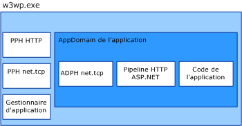

# <a name="was-activation-architecture"></a><span data-ttu-id="d3ab6-102">Architecture d'activation WAS</span><span class="sxs-lookup"><span data-stu-id="d3ab6-102">WAS Activation Architecture</span></span>
<span data-ttu-id="d3ab6-103">Cette rubrique détaille et décrit les composants du service d'activation des processus de Windows (également appelé WAS).</span><span class="sxs-lookup"><span data-stu-id="d3ab6-103">This topic itemizes and discusses the components of the Windows Process Activation Service (also known as WAS).</span></span>  
  
## <a name="activation-components"></a><span data-ttu-id="d3ab6-104">Composants d'activation</span><span class="sxs-lookup"><span data-stu-id="d3ab6-104">Activation Components</span></span>  
 <span data-ttu-id="d3ab6-105">Le service WAS se compose de plusieurs composants architecturaux :</span><span class="sxs-lookup"><span data-stu-id="d3ab6-105">WAS consists of several architectural components:</span></span>  
  
-   <span data-ttu-id="d3ab6-106">Adaptateurs d'écouteur.</span><span class="sxs-lookup"><span data-stu-id="d3ab6-106">Listener adapters.</span></span> <span data-ttu-id="d3ab6-107">Services Windows qui reçoivent des messages sur des protocoles réseau spécifiques et communiquent avec WAS pour acheminer les messages entrants vers le processus de travail correct.</span><span class="sxs-lookup"><span data-stu-id="d3ab6-107">Windows services that receive messages on specific network protocols and communicate with WAS to route incoming messages to the correct worker process.</span></span>  
  
-   <span data-ttu-id="d3ab6-108">WAS.</span><span class="sxs-lookup"><span data-stu-id="d3ab6-108">WAS.</span></span> <span data-ttu-id="d3ab6-109">Service Windows qui gère la création et la durée de vie des processus de travail.</span><span class="sxs-lookup"><span data-stu-id="d3ab6-109">The Windows service that manages the creation and lifetime of worker processes.</span></span>  
  
-   <span data-ttu-id="d3ab6-110">Fichier exécutable de processus de travail générique (w3wp.exe).</span><span class="sxs-lookup"><span data-stu-id="d3ab6-110">The generic worker process executable (w3wp.exe).</span></span>  
  
-   <span data-ttu-id="d3ab6-111">Gestionnaire d'application.</span><span class="sxs-lookup"><span data-stu-id="d3ab6-111">Application manager.</span></span> <span data-ttu-id="d3ab6-112">Gère la création et la durée de vie des domaines d'application qui hébergent des applications dans le processus de travail.</span><span class="sxs-lookup"><span data-stu-id="d3ab6-112">Manages the creation and lifetime of application domains that host applications within the worker process.</span></span>  
  
-   <span data-ttu-id="d3ab6-113">Gestionnaires de protocoles.</span><span class="sxs-lookup"><span data-stu-id="d3ab6-113">Protocol handlers.</span></span> <span data-ttu-id="d3ab6-114">Composants spécifiques au protocole qui s'exécutent dans le processus de travail et gèrent les communications entre le processus de travail et les différents adaptateurs d'écouteur.</span><span class="sxs-lookup"><span data-stu-id="d3ab6-114">Protocol-specific components that run in the worker process and manage communication between the worker process and the individual listener adapters.</span></span> <span data-ttu-id="d3ab6-115">Il existe deux types de gestionnaires de protocoles : les gestionnaires de protocoles de processus et les gestionnaires de protocoles de domaine d'application (AppDomain).</span><span class="sxs-lookup"><span data-stu-id="d3ab6-115">Two types of protocol handlers exist: process protocol handlers and AppDomain protocol handlers.</span></span>  
  
 <span data-ttu-id="d3ab6-116">Lorsque le service WAS active une instance de processus de traitement, il charge les gestionnaires de protocoles de processus requis dans le processus de traitement et utilise le gestionnaire d'application pour créer un domaine d'application destiné à héberger l'application.</span><span class="sxs-lookup"><span data-stu-id="d3ab6-116">When WAS activates a worker process instance, it loads the process protocol handlers required into the worker process and uses the application manager to create an application domain to host the application.</span></span> <span data-ttu-id="d3ab6-117">Le domaine d'application charge le code de l'application ainsi que les gestionnaires de protocoles AppDomain requis par l'application.</span><span class="sxs-lookup"><span data-stu-id="d3ab6-117">The application domain loads the application’s code as well as the AppDomain protocol handlers that the network protocols used by the application require.</span></span>  
  
 <span data-ttu-id="d3ab6-118"></span><span class="sxs-lookup"><span data-stu-id="d3ab6-118"></span></span>  
  
### <a name="listener-adapters"></a><span data-ttu-id="d3ab6-119">Adaptateurs d'écouteur</span><span class="sxs-lookup"><span data-stu-id="d3ab6-119">Listener Adapters</span></span>  
 <span data-ttu-id="d3ab6-120">Les adaptateurs d'écouteur sont des services Windows individuels qui implémentent la logique de la communication réseau utilisée pour recevoir les messages à l'aide du protocole réseau sur lequel ils écoutent.</span><span class="sxs-lookup"><span data-stu-id="d3ab6-120">Listener adapters are individual Windows services that implement the network communication logic used to receive messages using the network protocol on which they listen.</span></span> <span data-ttu-id="d3ab6-121">Le tableau suivant répertorie les adaptateurs d'écouteur pour les protocoles [!INCLUDE[indigo1](../../../../includes/indigo1-md.md)].</span><span class="sxs-lookup"><span data-stu-id="d3ab6-121">The following table lists the listener adapters for [!INCLUDE[indigo1](../../../../includes/indigo1-md.md)] protocols.</span></span>  
  
|<span data-ttu-id="d3ab6-122">Nom du service d'adaptateur de l'écouteur</span><span class="sxs-lookup"><span data-stu-id="d3ab6-122">Listener adapter service name</span></span>|<span data-ttu-id="d3ab6-123">Protocole</span><span class="sxs-lookup"><span data-stu-id="d3ab6-123">Protocol</span></span>|<span data-ttu-id="d3ab6-124">Notes</span><span class="sxs-lookup"><span data-stu-id="d3ab6-124">Notes</span></span>|  
|-----------------------------------|--------------|-----------|  
|<span data-ttu-id="d3ab6-125">W3SVC</span><span class="sxs-lookup"><span data-stu-id="d3ab6-125">W3SVC</span></span>|<span data-ttu-id="d3ab6-126">http</span><span class="sxs-lookup"><span data-stu-id="d3ab6-126">http</span></span>|<span data-ttu-id="d3ab6-127">Composant commun qui assure l'activation HTTP pour les protocoles IIS 7.0 et [!INCLUDE[indigo2](../../../../includes/indigo2-md.md)].</span><span class="sxs-lookup"><span data-stu-id="d3ab6-127">Common component that provides HTTP activation for both IIS 7.0 and [!INCLUDE[indigo2](../../../../includes/indigo2-md.md)].</span></span>|  
|<span data-ttu-id="d3ab6-128">NetTcpActivator</span><span class="sxs-lookup"><span data-stu-id="d3ab6-128">NetTcpActivator</span></span>|<span data-ttu-id="d3ab6-129">net.tcp</span><span class="sxs-lookup"><span data-stu-id="d3ab6-129">net.tcp</span></span>|<span data-ttu-id="d3ab6-130">Dépend du service NetTcpPortSharing.</span><span class="sxs-lookup"><span data-stu-id="d3ab6-130">Depends on the NetTcpPortSharing service.</span></span>|  
|<span data-ttu-id="d3ab6-131">NetPipeActivator</span><span class="sxs-lookup"><span data-stu-id="d3ab6-131">NetPipeActivator</span></span>|<span data-ttu-id="d3ab6-132">net.pipe</span><span class="sxs-lookup"><span data-stu-id="d3ab6-132">net.pipe</span></span>||  
|<span data-ttu-id="d3ab6-133">NetMsmqActivator</span><span class="sxs-lookup"><span data-stu-id="d3ab6-133">NetMsmqActivator</span></span>|<span data-ttu-id="d3ab6-134">net.msmq</span><span class="sxs-lookup"><span data-stu-id="d3ab6-134">net.msmq</span></span>|<span data-ttu-id="d3ab6-135">Utilisé avec les applications Message Queuing reposant sur [!INCLUDE[indigo2](../../../../includes/indigo2-md.md)].</span><span class="sxs-lookup"><span data-stu-id="d3ab6-135">For use with [!INCLUDE[indigo2](../../../../includes/indigo2-md.md)]-based Message Queuing applications.</span></span>|  
|<span data-ttu-id="d3ab6-136">NetMsmqActivator</span><span class="sxs-lookup"><span data-stu-id="d3ab6-136">NetMsmqActivator</span></span>|<span data-ttu-id="d3ab6-137">msmq.formatname</span><span class="sxs-lookup"><span data-stu-id="d3ab6-137">msmq.formatname</span></span>|<span data-ttu-id="d3ab6-138">Assure la compatibilité descendante avec les applications Message Queuing existantes.</span><span class="sxs-lookup"><span data-stu-id="d3ab6-138">Provides backwards compatibility with existing Message Queuing applications.</span></span>|  
  
 <span data-ttu-id="d3ab6-139">Les adaptateurs d'écouteur pour des protocoles spécifiques sont enregistrés lors de l'installation dans le fichier applicationHost.config, comme l'illustre l'exemple XML suivant.</span><span class="sxs-lookup"><span data-stu-id="d3ab6-139">Listener adapters for specific protocols are registered during installation in the applicationHost.config file, as shown in the following XML example.</span></span>  
  
```xml  
<system.applicationHost>  
    <listenerAdapters>  
        <add name="http" />  
        <add name="net.tcp"   
          identity="S-1-5-80-3579033775-2824656752-1522793541-1960352512-462907086" />  
         <add name="net.pipe"   
           identity="S-1-5-80-2943419899-937267781-4189664001-1229628381-3982115073" />  
          <add name="net.msmq"   
            identity="S-1-5-80-89244771-1762554971-1007993102-348796144-2203111529" />  
           <add name="msmq.formatname"   
             identity="S-1-5-80-89244771-1762554971-1007993102-348796144-2203111529" />  
    </listenerAdapters>  
</system.applicationHost>  
```  
  
### <a name="protocol-handlers"></a><span data-ttu-id="d3ab6-140">Gestionnaires de protocoles</span><span class="sxs-lookup"><span data-stu-id="d3ab6-140">Protocol Handlers</span></span>  
 <span data-ttu-id="d3ab6-141">Les gestionnaires de protocoles de processus et AppDomain pour des protocoles spécifiques sont enregistrés dans le fichier Web.config de l'ordinateur.</span><span class="sxs-lookup"><span data-stu-id="d3ab6-141">Process and AppDomain protocol handlers for specific protocols are registered in the machine-level Web.config file.</span></span>  
  
```xml  
<system.web>  
   <protocols>  
      <add name="net.tcp"   
        processHandlerType=  
         "System.ServiceModel.WasHosting.TcpProcessProtocolHandler"  
        appDomainHandlerType=  
         "System.ServiceModel.WasHosting.TcpAppDomainProtocolHandler"  
        validate="false" />  
      <add name="net.pipe"   
        processHandlerType=  
         "System.ServiceModel.WasHosting.NamedPipeProcessProtocolHandler"  
          appDomainHandlerType=  
           "System.ServiceModel.WasHosting.NamedPipeAppDomainProtocolHandler"/>  
      <add name="net.msmq"  
        processHandlerType=  
         "System.ServiceModel.WasHosting.MsmqProcessProtocolHandler"  
        appDomainHandlerType=  
         "System.ServiceModel.WasHosting.MsmqAppDomainProtocolHandler"  
        validate="false" />  
   </protocols>  
</system.web>  
```  
  
## <a name="see-also"></a><span data-ttu-id="d3ab6-142">Voir aussi</span><span class="sxs-lookup"><span data-stu-id="d3ab6-142">See Also</span></span>  
 [<span data-ttu-id="d3ab6-143">Configuration du service WAS pour une utilisation avec WCF</span><span class="sxs-lookup"><span data-stu-id="d3ab6-143">Configuring WAS for Use with WCF</span></span>](../../../../docs/framework/wcf/feature-details/configuring-the-wpa--service-for-use-with-wcf.md)  
 [<span data-ttu-id="d3ab6-144">Fonctionnalités d’hébergement de Windows Server App Fabric</span><span class="sxs-lookup"><span data-stu-id="d3ab6-144">Windows Server App Fabric Hosting Features</span></span>](http://go.microsoft.com/fwlink/?LinkId=201276)
