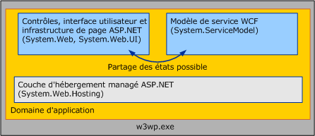

# <a name="wcf-services-and-aspnet"></a><span data-ttu-id="1a884-102">Services WCF et ASP.NET</span><span class="sxs-lookup"><span data-stu-id="1a884-102">WCF Services and ASP.NET</span></span>
<span data-ttu-id="1a884-103">Cette rubrique présente les services [!INCLUDE[indigo1](../../../../includes/indigo1-md.md)] d'hébergement côte à côte avec ASP.NET et leur hébergement en mode de compatibilité ASP.NET.</span><span class="sxs-lookup"><span data-stu-id="1a884-103">This topic discusses hosting [!INCLUDE[indigo1](../../../../includes/indigo1-md.md)] services side-by-side with ASP.NET and hosting them in ASP.NET compatibility mode.</span></span>  
  
## <a name="hosting-wcf-side-by-side-with-aspnet"></a><span data-ttu-id="1a884-104">Hébergement côte à côte de WCF avec ASP.NET</span><span class="sxs-lookup"><span data-stu-id="1a884-104">Hosting WCF Side-by-Side with ASP.NET</span></span>  
 <span data-ttu-id="1a884-105">Les services [!INCLUDE[indigo2](../../../../includes/indigo2-md.md)] hébergés dans les services IIS (Internet Information Services) peuvent être localisés avec les pages.ASPX et les services Web ASMX dans un domaine d'application unique et commun.</span><span class="sxs-lookup"><span data-stu-id="1a884-105">[!INCLUDE[indigo2](../../../../includes/indigo2-md.md)] services hosted in Internet Information Services (IIS) can be located with .ASPX pages and ASMX Web services inside of a single, common Application Domain.</span></span> <span data-ttu-id="1a884-106">ASP.NET fournit des services d'infrastructure communs tels que la gestion AppDomain et la compilation dynamique pour [!INCLUDE[indigo2](../../../../includes/indigo2-md.md)] et l'exécution d'ASP.NET http à la fois.</span><span class="sxs-lookup"><span data-stu-id="1a884-106">ASP.NET provides common infrastructure services such as AppDomain management and dynamic compilation for both [!INCLUDE[indigo2](../../../../includes/indigo2-md.md)] and the ASP.NET HTTP runtime.</span></span> <span data-ttu-id="1a884-107">La configuration par défaut de [!INCLUDE[indigo2](../../../../includes/indigo2-md.md)] est côte à côte avec ASP.NET.</span><span class="sxs-lookup"><span data-stu-id="1a884-107">The default configuration for [!INCLUDE[indigo2](../../../../includes/indigo2-md.md)] is side-by-side with ASP.NET.</span></span>  
  
 <span data-ttu-id="1a884-108"></span><span class="sxs-lookup"><span data-stu-id="1a884-108"></span></span>  
  
 <span data-ttu-id="1a884-109">L'exécution d'ASP.NET HTTP gère des demandes ASP.NET mais ne participe pas au traitement des demandes destinées aux services [!INCLUDE[indigo2](../../../../includes/indigo2-md.md)], bien que ces services soient hébergés dans le même AppDomain que le contenu ASP.NET.</span><span class="sxs-lookup"><span data-stu-id="1a884-109">The ASP.NET HTTP runtime handles ASP.NET requests but does not participate in the processing of requests destined for [!INCLUDE[indigo2](../../../../includes/indigo2-md.md)] services, even though these services are hosted in the same AppDomain as is the ASP.NET content.</span></span> <span data-ttu-id="1a884-110">À la place, le modèle de service [!INCLUDE[indigo2](../../../../includes/indigo2-md.md)] intercepte les messages adressés aux services [!INCLUDE[indigo2](../../../../includes/indigo2-md.md)] et les route à travers le transport/pile de canaux de [!INCLUDE[indigo2](../../../../includes/indigo2-md.md)].</span><span class="sxs-lookup"><span data-stu-id="1a884-110">Instead, the [!INCLUDE[indigo2](../../../../includes/indigo2-md.md)] Service Model intercepts messages addressed to [!INCLUDE[indigo2](../../../../includes/indigo2-md.md)] services and routes them through the [!INCLUDE[indigo2](../../../../includes/indigo2-md.md)] transport/channel stack.</span></span>  
  
 <span data-ttu-id="1a884-111">Les résultats du modèle côte à côte est le suivant :</span><span class="sxs-lookup"><span data-stu-id="1a884-111">The results of the side-by-side model are as follows:</span></span>  
  
-   <span data-ttu-id="1a884-112">ASP.NET et les services [!INCLUDE[indigo2](../../../../includes/indigo2-md.md)] peuvent partager l'état AppDomain.</span><span class="sxs-lookup"><span data-stu-id="1a884-112">ASP.NET and [!INCLUDE[indigo2](../../../../includes/indigo2-md.md)] services can share AppDomain state.</span></span> <span data-ttu-id="1a884-113">Parce que les deux infrastructures peuvent coexister dans le même AppDomain, [!INCLUDE[indigo2](../../../../includes/indigo2-md.md)] peut également partager l'état AppDomain avec ASP.NET (y compris les variables statiques, les événements et ainsi de suite).</span><span class="sxs-lookup"><span data-stu-id="1a884-113">Because the two frameworks can coexist in the same AppDomain, [!INCLUDE[indigo2](../../../../includes/indigo2-md.md)] can also share AppDomain state with ASP.NET (including static variables, events, and so on).</span></span>  
  
-   <span data-ttu-id="1a884-114">Les services [!INCLUDE[indigo2](../../../../includes/indigo2-md.md)] se comportent de façon cohérente, indépendamment de l'environnement d'hébergement et du transport.</span><span class="sxs-lookup"><span data-stu-id="1a884-114">[!INCLUDE[indigo2](../../../../includes/indigo2-md.md)] services behave consistently, independent of hosting environment and transport.</span></span> <span data-ttu-id="1a884-115">L'exécution d'ASP.NET HTTP est intentionnellement associée à l'environnement d'hébergement de IIS/ASP.NET et à la communication HTTP.</span><span class="sxs-lookup"><span data-stu-id="1a884-115">The ASP.NET HTTP runtime is intentionally coupled to the IIS/ASP.NET hosting environment and HTTP communication.</span></span> <span data-ttu-id="1a884-116">Inversement, [!INCLUDE[indigo2](../../../../includes/indigo2-md.md)] est conçu pour se comporter de façon cohérente à travers les environnements d'hébergement ([!INCLUDE[indigo2](../../../../includes/indigo2-md.md)] se comporte de façon cohérente à la fois à l'intérieur et en dehors d'IIS) et à travers le transport (un service hébergé dans IIS 7.0 et version ultérieure a un comportement cohérent à travers tous les points de terminaison qu'il expose, même si quelques-uns de ces points utilisent des protocoles autres que HTTP).</span><span class="sxs-lookup"><span data-stu-id="1a884-116">Conversely, [!INCLUDE[indigo2](../../../../includes/indigo2-md.md)] is designed to behave consistently across hosting environments ([!INCLUDE[indigo2](../../../../includes/indigo2-md.md)] behaves consistently both inside and outside of IIS) and across transport (a service hosted in IIS 7.0 and later has consistent behavior across all endpoints it exposes, even if some of those endpoints use protocols other than HTTP).</span></span>  
  
-   <span data-ttu-id="1a884-117">Dans un AppDomain, les fonctionnalités implémentées par l'exécution de HTTP s'appliquent au contenu ASP.NET mais pas à [!INCLUDE[indigo2](../../../../includes/indigo2-md.md)].</span><span class="sxs-lookup"><span data-stu-id="1a884-117">Within an AppDomain, features implemented by the HTTP runtime apply to ASP.NET content but not to [!INCLUDE[indigo2](../../../../includes/indigo2-md.md)].</span></span> <span data-ttu-id="1a884-118">De nombreuses fonctionnalités de la plate-forme d'application ASP.NET spécifiques à HTTP ne s'appliquent pas aux services [!INCLUDE[indigo2](../../../../includes/indigo2-md.md)] hébergés dans un AppDomain qui contient le contenu ASP.NET.</span><span class="sxs-lookup"><span data-stu-id="1a884-118">Many HTTP-specific features of the ASP.NET application platform do not apply to [!INCLUDE[indigo2](../../../../includes/indigo2-md.md)] Services hosted inside of an AppDomain that contains ASP.NET content.</span></span> <span data-ttu-id="1a884-119">Voici des exemples de ces fonctionnalités :</span><span class="sxs-lookup"><span data-stu-id="1a884-119">Examples of these features include the following:</span></span>  
  
    -   <span data-ttu-id="1a884-120">HttpContext : <xref:System.Web.HttpContext.Current%2A> est toujours `null` lorsqu'il est accédé à partir d'un service [!INCLUDE[indigo2](../../../../includes/indigo2-md.md)].</span><span class="sxs-lookup"><span data-stu-id="1a884-120">HttpContext: <xref:System.Web.HttpContext.Current%2A> is always `null` when accessed from within a [!INCLUDE[indigo2](../../../../includes/indigo2-md.md)] service.</span></span> <span data-ttu-id="1a884-121">Utilisez <!--zz <xref:System.ServiceModel.OperationContext.Current.RequestContext>--> `RequestContext` à la place.</span><span class="sxs-lookup"><span data-stu-id="1a884-121">Use <!--zz <xref:System.ServiceModel.OperationContext.Current.RequestContext>--> `RequestContext` instead.</span></span>  
  
    -   <span data-ttu-id="1a884-122">Autorisation basée sur des fichiers : le modèle de sécurité [!INCLUDE[indigo2](../../../../includes/indigo2-md.md)] n'autorise pas l'application de la liste de contrôle d'accès (ACL, Access Control List) au fichier .svc du service lorsqu'il faut décider si une demande de service est autorisée.</span><span class="sxs-lookup"><span data-stu-id="1a884-122">File-based authorization: The [!INCLUDE[indigo2](../../../../includes/indigo2-md.md)] security model does not allow for the access control list (ACL) applied to the .svc file of the service when deciding if a service request is authorized.</span></span>  
  
    -   <span data-ttu-id="1a884-123">Basée sur la configuration de l’autorisation d’URL : De la même façon, le [!INCLUDE[indigo2](../../../../includes/indigo2-md.md)] modèle de sécurité n’est pas conforme à toutes les règles d’autorisation basée sur l’URL spécifiées dans System.Web \<autorisation > élément de configuration.</span><span class="sxs-lookup"><span data-stu-id="1a884-123">Configuration-based URL Authorization: Similarly, the [!INCLUDE[indigo2](../../../../includes/indigo2-md.md)] security model does not adhere to any URL-based authorization rules specified in System.Web’s \<authorization> configuration element.</span></span> <span data-ttu-id="1a884-124">Ces paramètres sont ignorés pour les demandes [!INCLUDE[indigo2](../../../../includes/indigo2-md.md)] si un service réside dans un espace d'URL sécurisé par les règles d'autorisation d'URL de ASP.NET.</span><span class="sxs-lookup"><span data-stu-id="1a884-124">These settings are ignored for [!INCLUDE[indigo2](../../../../includes/indigo2-md.md)] requests if a service resides in a URL space secured by ASP.NET’s URL authorization rules.</span></span>  
  
    -   <span data-ttu-id="1a884-125">Extensibilité HttpModule : l'infrastructure d'hébergement de [!INCLUDE[indigo2](../../../../includes/indigo2-md.md)] intercepte les demandes [!INCLUDE[indigo2](../../../../includes/indigo2-md.md)] lorsque l'événement <xref:System.Web.HttpApplication.PostAuthenticateRequest> est déclenché et ne retourne pas de traitement au pipeline de ASP.NET HTTP.</span><span class="sxs-lookup"><span data-stu-id="1a884-125">HttpModule extensibility: The [!INCLUDE[indigo2](../../../../includes/indigo2-md.md)] hosting infrastructure intercepts [!INCLUDE[indigo2](../../../../includes/indigo2-md.md)] requests when the <xref:System.Web.HttpApplication.PostAuthenticateRequest> event is raised and does not return processing to the ASP.NET HTTP pipeline.</span></span> <span data-ttu-id="1a884-126">Les modules encodés pour intercepter des demandes aux étapes ultérieures du pipeline n'interceptent pas les demandes [!INCLUDE[indigo2](../../../../includes/indigo2-md.md)].</span><span class="sxs-lookup"><span data-stu-id="1a884-126">Modules that are coded to intercept requests at later stages of the pipeline do not intercept [!INCLUDE[indigo2](../../../../includes/indigo2-md.md)] requests.</span></span>  
  
    -   <span data-ttu-id="1a884-127">Emprunt d’identité ASP.NET : par défaut, [!INCLUDE[indigo2](../../../../includes/indigo2-md.md)] demande toujours s’exécute le processus IIS identité, même si ASP.NET est configuré pour activer l’emprunt d’identité à l’aide de System.Web \<identity impersonate = « true » / > option de configuration.</span><span class="sxs-lookup"><span data-stu-id="1a884-127">ASP.NET impersonation: By default, [!INCLUDE[indigo2](../../../../includes/indigo2-md.md)] requests always runs as the IIS process identity, even if ASP.NET is set to enable impersonation using System.Web’s \<identity impersonate="true" /> configuration option.</span></span>  
  
 <span data-ttu-id="1a884-128">Ces restrictions s'appliquent uniquement aux services [!INCLUDE[indigo2](../../../../includes/indigo2-md.md)] hébergés dans l'application IIS.</span><span class="sxs-lookup"><span data-stu-id="1a884-128">These restrictions apply only to [!INCLUDE[indigo2](../../../../includes/indigo2-md.md)] services hosted in IIS application.</span></span> <span data-ttu-id="1a884-129">Le comportement du contenu ASP.NET n'est pas affecté par la présence de [!INCLUDE[indigo2](../../../../includes/indigo2-md.md)].</span><span class="sxs-lookup"><span data-stu-id="1a884-129">The behavior of ASP.NET content is not affected by the presence of [!INCLUDE[indigo2](../../../../includes/indigo2-md.md)].</span></span>  
  
 <span data-ttu-id="1a884-130">Les applications [!INCLUDE[indigo2](../../../../includes/indigo2-md.md)] qui requièrent les fonctionnalités traditionnellement fournies par le pipeline HTTP doivent envisager d'utiliser les équivalents [!INCLUDE[indigo2](../../../../includes/indigo2-md.md)] indépendants de l'hôte et du transport :</span><span class="sxs-lookup"><span data-stu-id="1a884-130">[!INCLUDE[indigo2](../../../../includes/indigo2-md.md)] applications that require functionality traditionally provided by the HTTP pipeline should consider using the [!INCLUDE[indigo2](../../../../includes/indigo2-md.md)] equivalents, which are host and transport independent:</span></span>  
  
-   <span data-ttu-id="1a884-131"><xref:System.ServiceModel.OperationContext> plutôt que <xref:System.Web.HttpContext>.</span><span class="sxs-lookup"><span data-stu-id="1a884-131"><xref:System.ServiceModel.OperationContext> instead of <xref:System.Web.HttpContext>.</span></span>  
  
-   <span data-ttu-id="1a884-132"><xref:System.ServiceModel.Description.ServiceAuthorizationBehavior> au lieu de l'autorisation de fichier/URL de ASP.NET.</span><span class="sxs-lookup"><span data-stu-id="1a884-132"><xref:System.ServiceModel.Description.ServiceAuthorizationBehavior> instead of ASP.NET’s File/URL Authorization.</span></span>  
  
-   <span data-ttu-id="1a884-133"><xref:System.ServiceModel.Dispatcher.IDispatchMessageInspector> ou des canaux en couche personnalisés au lieu des modules HTTP.</span><span class="sxs-lookup"><span data-stu-id="1a884-133"><xref:System.ServiceModel.Dispatcher.IDispatchMessageInspector> or custom layered channels instead of HTTP modules.</span></span>  
  
-   <span data-ttu-id="1a884-134">Emprunt d'identité pour chaque opération à l'aide de [!INCLUDE[indigo2](../../../../includes/indigo2-md.md)] au lieu de l'emprunt d'identité System.Web.</span><span class="sxs-lookup"><span data-stu-id="1a884-134">Impersonation for each operation using [!INCLUDE[indigo2](../../../../includes/indigo2-md.md)] instead of System.Web impersonation.</span></span>  
  
 <span data-ttu-id="1a884-135">Vous pouvez également envisager d'exécuter vos services en mode de compatibilité ASP.NET de [!INCLUDE[indigo2](../../../../includes/indigo2-md.md)].</span><span class="sxs-lookup"><span data-stu-id="1a884-135">Alternatively, you can consider running your services in [!INCLUDE[indigo2](../../../../includes/indigo2-md.md)]’s ASP.NET compatibility mode.</span></span>  
  
## <a name="hosting-wcf-services-in-aspnet-compatibility-mode"></a><span data-ttu-id="1a884-136">Hébergement des services WCF en mode de compatibilité ASP.NET</span><span class="sxs-lookup"><span data-stu-id="1a884-136">Hosting WCF Services in ASP.NET Compatibility Mode</span></span>  
 <span data-ttu-id="1a884-137">Bien que le modèle [!INCLUDE[indigo2](../../../../includes/indigo2-md.md)] soit conçu pour se comporter de façon cohérente à travers les environnements d'hébergement et les transports, souvent, dans certains scénarios, une application ne requiert pas ce degré de souplesse.</span><span class="sxs-lookup"><span data-stu-id="1a884-137">Although the [!INCLUDE[indigo2](../../../../includes/indigo2-md.md)] model is designed to behave consistently across hosting environments and transports, there are often scenarios where an application does not require this degree of flexibility.</span></span> <span data-ttu-id="1a884-138">Le mode de compatibilité ASP.NET de [!INCLUDE[indigo2](../../../../includes/indigo2-md.md)] est approprié pour les scénarios qui ne requièrent pas d'hébergement en dehors d'IIS ni de communication sur des protocoles autres que HTTP, mais qui utilisent toutes les fonctionnalités de la plate-forme d'application Web ASP.NET.</span><span class="sxs-lookup"><span data-stu-id="1a884-138">[!INCLUDE[indigo2](../../../../includes/indigo2-md.md)]’s ASP.NET compatibility mode is suitable for scenarios that do not require the ability to host outside of IIS or to communicate over protocols other than HTTP, but that use all of features of the ASP.NET Web application platform.</span></span>  
  
 <span data-ttu-id="1a884-139">Contrairement à la configuration côte à côte par défaut, où l'infrastructure d'hébergement [!INCLUDE[indigo2](../../../../includes/indigo2-md.md)] intercepte les messages [!INCLUDE[indigo2](../../../../includes/indigo2-md.md)] et les route hors du pipeline HTTP, les services [!INCLUDE[indigo2](../../../../includes/indigo2-md.md)] qui s'exécutent en mode de compatibilité ASP.NET participent pleinement au cycle de vie de la demande HTTP ASP.NET.</span><span class="sxs-lookup"><span data-stu-id="1a884-139">Unlike the default side-by-side configuration, where the [!INCLUDE[indigo2](../../../../includes/indigo2-md.md)] hosting infrastructure intercepts [!INCLUDE[indigo2](../../../../includes/indigo2-md.md)] messages and routes them out of the HTTP pipeline, [!INCLUDE[indigo2](../../../../includes/indigo2-md.md)] services running in ASP.NET Compatibility Mode participate fully in the ASP.NET HTTP request lifecycle.</span></span> <span data-ttu-id="1a884-140">En mode de compatibilité, les services [!INCLUDE[indigo2](../../../../includes/indigo2-md.md)] utilisent le pipeline HTTP à travers une implémentation <xref:System.Web.IHttpHandler>, semblable à la façon dont sont gérées les demandes pour les pages ASPX et les services Web ASMX.</span><span class="sxs-lookup"><span data-stu-id="1a884-140">In compatibility mode, [!INCLUDE[indigo2](../../../../includes/indigo2-md.md)] services use the HTTP pipeline through an <xref:System.Web.IHttpHandler> implementation, similar to the way requests for ASPX pages and ASMX Web services are handled.</span></span> <span data-ttu-id="1a884-141">En conséquence, [!INCLUDE[indigo2](../../../../includes/indigo2-md.md)] se comporte de façon identique à ASMX en ce qui concerne fonctionnalités ASP.NET suivantes :</span><span class="sxs-lookup"><span data-stu-id="1a884-141">As a result, [!INCLUDE[indigo2](../../../../includes/indigo2-md.md)] behaves identically to ASMX with respect to the following ASP.NET features:</span></span>  
  
-   <span data-ttu-id="1a884-142"><xref:System.Web.HttpContext> : les services [!INCLUDE[indigo2](../../../../includes/indigo2-md.md)] qui s'exécutent en mode de compatibilité ASP.NET peuvent accéder à <xref:System.Web.HttpContext.Current%2A> et à son état associé.</span><span class="sxs-lookup"><span data-stu-id="1a884-142"><xref:System.Web.HttpContext>: [!INCLUDE[indigo2](../../../../includes/indigo2-md.md)] services running in ASP.NET Compatibility Mode can access <xref:System.Web.HttpContext.Current%2A> and its associated state.</span></span>  
  
-   <span data-ttu-id="1a884-143">Autorisation basée sur des fichiers : les services [!INCLUDE[indigo2](../../../../includes/indigo2-md.md)] qui s'exécutent en mode de compatibilité ASP.NET peuvent être sécurisés en joignant des listes de contrôle d'accès de système de fichiers (ACL) au fichier .svc du service.</span><span class="sxs-lookup"><span data-stu-id="1a884-143">File-based authorization: [!INCLUDE[indigo2](../../../../includes/indigo2-md.md)] services running in ASP.NET compatibility mode can be secure by attaching file system access control lists (ACLs) to the service’s .svc file.</span></span>  
  
-   <span data-ttu-id="1a884-144">Autorisation d'URL configurable : les règles d'autorisation d'URL de ASP.NET sont appliquées pour les demandes [!INCLUDE[indigo2](../../../../includes/indigo2-md.md)] lorsque le service [!INCLUDE[indigo2](../../../../includes/indigo2-md.md)] s'exécute en mode de compatibilité ASP.NET.</span><span class="sxs-lookup"><span data-stu-id="1a884-144">Configurable URL authorization: ASP.NET’s URL authorization rules are enforced for [!INCLUDE[indigo2](../../../../includes/indigo2-md.md)] requests when the [!INCLUDE[indigo2](../../../../includes/indigo2-md.md)] service is running in ASP.NET Compatibility Mode.</span></span>  
  
-   <span data-ttu-id="1a884-145">Extensibilité <xref:System.Web.HttpModuleCollection> : parce que les services [!INCLUDE[indigo2](../../../../includes/indigo2-md.md)] qui s'exécutent en mode de compatibilité ASP.NET participent pleinement au cycle de vie de la demande HTTP ASP.NET, tout module HTTP configuré dans le pipeline HTTP est en mesure de fonctionner sur les demandes [!INCLUDE[indigo2](../../../../includes/indigo2-md.md)] à la fois avant et après l'appel du service.</span><span class="sxs-lookup"><span data-stu-id="1a884-145"><xref:System.Web.HttpModuleCollection> extensibility: Because [!INCLUDE[indigo2](../../../../includes/indigo2-md.md)] services running in ASP.NET Compatibility Mode participate fully in the ASP.NET HTTP request lifecycle, any HTTP module configured in the HTTP pipeline is able to operate on [!INCLUDE[indigo2](../../../../includes/indigo2-md.md)] requests both before and after service invocation.</span></span>  
  
-   <span data-ttu-id="1a884-146">Emprunt d'identité ASP.NET : les services [!INCLUDE[indigo2](../../../../includes/indigo2-md.md)] s'exécutent avec l'identité actuelle du thread qui a emprunté l'identité de ASP.NET ; celle-ci peut être différente de l'identité du processus IIS si l'emprunt d'identité ASP.NET a été activé pour l'application.</span><span class="sxs-lookup"><span data-stu-id="1a884-146">ASP.NET Impersonation: [!INCLUDE[indigo2](../../../../includes/indigo2-md.md)] services run using the current identity of the ASP.NET impersonated thread, which may be different than the IIS process identity if ASP.NET impersonation has been enabled for the application.</span></span> <span data-ttu-id="1a884-147">Si l'emprunt d'identité ASP.NET et l'emprunt d'identité [!INCLUDE[indigo2](../../../../includes/indigo2-md.md)] sont activés à la fois pour une opération de service particulière, l'implémentation du service s'exécute finalement à l'aide de l'identité obtenue de [!INCLUDE[indigo2](../../../../includes/indigo2-md.md)].</span><span class="sxs-lookup"><span data-stu-id="1a884-147">If ASP.NET impersonation and [!INCLUDE[indigo2](../../../../includes/indigo2-md.md)] impersonation are both enabled for a particular service operation, the service implementation ultimately runs using the identity obtained from [!INCLUDE[indigo2](../../../../includes/indigo2-md.md)].</span></span>  
  
 <span data-ttu-id="1a884-148">Le mode de compatibilité ASP.NET de [!INCLUDE[indigo2](../../../../includes/indigo2-md.md)] est activé au niveau de l'application à travers la configuration suivante (localisée dans le fichier Web.config de l'application) :</span><span class="sxs-lookup"><span data-stu-id="1a884-148">[!INCLUDE[indigo2](../../../../includes/indigo2-md.md)]’s ASP.NET compatibility mode is enabled at the application level through the following configuration (located in the application’s Web.config file):</span></span>  
  
```xml  
<system.serviceModel>  
    <serviceHostingEnvironment aspNetCompatibilityEnabled="true" />  
</system.serviceModel>  
```  
  
 <span data-ttu-id="1a884-149">Cette valeur par défaut est «`true`» si non spécifié.</span><span class="sxs-lookup"><span data-stu-id="1a884-149">This value defaults to "`true`" if not specified.</span></span> <span data-ttu-id="1a884-150">La valeur «`false`» indique que tous les [!INCLUDE[indigo2](../../../../includes/indigo2-md.md)] services s’exécutant dans l’application seront exécutera pas dans le Mode de compatibilité ASP.NET.</span><span class="sxs-lookup"><span data-stu-id="1a884-150">Setting this value to "`false`" indicates that all [!INCLUDE[indigo2](../../../../includes/indigo2-md.md)] services running in the application will not run in ASP.NET Compatibility Mode.</span></span>  
  
 <span data-ttu-id="1a884-151">Parce que le mode de compatibilité ASP.NET implique des sémantiques de traitement de la demande fondamentalement différentes de la valeur par défaut de [!INCLUDE[indigo2](../../../../includes/indigo2-md.md)], les implémentations de service individuelles peuvent contrôler si elles s'exécutent dans une application pour laquelle le mode de compatibilité ASP.NET a été activé.</span><span class="sxs-lookup"><span data-stu-id="1a884-151">Because ASP.NET Compatibility Mode implies request processing semantics that are fundamentally different from the [!INCLUDE[indigo2](../../../../includes/indigo2-md.md)] default, individual service implementations have the ability to control whether they run inside of an application for which ASP.NET Compatibility Mode has been enabled.</span></span> <span data-ttu-id="1a884-152">Les services peuvent utiliser <xref:System.ServiceModel.Activation.AspNetCompatibilityRequirementsAttribute> pour indiquer s'ils prennent en charge le mode de compatibilité ASP.NET.</span><span class="sxs-lookup"><span data-stu-id="1a884-152">Services can use the <xref:System.ServiceModel.Activation.AspNetCompatibilityRequirementsAttribute> to indicate whether they support ASP.NET Compatibility Mode.</span></span> <span data-ttu-id="1a884-153">La valeur par défaut de cet attribut est <xref:System.ServiceModel.Activation.AspNetCompatibilityRequirementsMode.Allowed>.</span><span class="sxs-lookup"><span data-stu-id="1a884-153">The default value for this attribute is <xref:System.ServiceModel.Activation.AspNetCompatibilityRequirementsMode.Allowed>.</span></span>  
  
 `[AspNetCompatibilityRequirements(RequirementsMode = AspNetCompatibilityRequirementsMode.Allowed)]`  
  
 `public class CalculatorService : ICalculatorSession`  
  
 `{//Implement calculator service methods.}`  
  
 <span data-ttu-id="1a884-154">Le tableau suivant illustre comment le paramètre de mode de compatibilité défini au niveau de l'application interagit avec le niveau de prise en charge déclaré du service :</span><span class="sxs-lookup"><span data-stu-id="1a884-154">The following table illustrates how the application-wide compatibility mode setting interacts with the individual service’s stated level of support:</span></span>  
  
|<span data-ttu-id="1a884-155">Paramètre de mode de compatibilité défini au niveau de l'application</span><span class="sxs-lookup"><span data-stu-id="1a884-155">Application-wide Compatibility Mode setting</span></span>|<span data-ttu-id="1a884-156">[AspNetCompatibilityRequirementsMode]</span><span class="sxs-lookup"><span data-stu-id="1a884-156">[AspNetCompatibilityRequirementsMode]</span></span><br /><br /> <span data-ttu-id="1a884-157">Paramètre</span><span class="sxs-lookup"><span data-stu-id="1a884-157">Setting</span></span>|<span data-ttu-id="1a884-158">Résultat observé</span><span class="sxs-lookup"><span data-stu-id="1a884-158">Observed Result</span></span>|  
|--------------------------------------------------|---------------------------------------------------------|---------------------|  
|<span data-ttu-id="1a884-159">aspNetCompatibilityEnabled = «`true`»</span><span class="sxs-lookup"><span data-stu-id="1a884-159">aspNetCompatibilityEnabled = "`true`"</span></span>|<xref:System.ServiceModel.Activation.AspNetCompatibilityRequirementsMode.Required>|<span data-ttu-id="1a884-160">Le service est activé.</span><span class="sxs-lookup"><span data-stu-id="1a884-160">Service activates successfully.</span></span>|  
|<span data-ttu-id="1a884-161">aspNetCompatibilityEnabled = «`true`»</span><span class="sxs-lookup"><span data-stu-id="1a884-161">aspNetCompatibilityEnabled = "`true`"</span></span>|<xref:System.ServiceModel.Activation.AspNetCompatibilityRequirementsMode.Allowed>|<span data-ttu-id="1a884-162">Le service est activé.</span><span class="sxs-lookup"><span data-stu-id="1a884-162">Service activates successfully.</span></span>|  
|<span data-ttu-id="1a884-163">aspNetCompatibilityEnabled = «`true`»</span><span class="sxs-lookup"><span data-stu-id="1a884-163">aspNetCompatibilityEnabled = "`true`"</span></span>|<xref:System.ServiceModel.Activation.AspNetCompatibilityRequirementsMode.NotAllowed>|<span data-ttu-id="1a884-164">Une erreur d'activation se produit lorsque le service reçoit un message.</span><span class="sxs-lookup"><span data-stu-id="1a884-164">An activation error occurs when the service receives a message.</span></span>|  
|<span data-ttu-id="1a884-165">aspNetCompatibilityEnabled = «`false`»</span><span class="sxs-lookup"><span data-stu-id="1a884-165">aspNetCompatibilityEnabled = "`false`"</span></span>|<xref:System.ServiceModel.Activation.AspNetCompatibilityRequirementsMode.Required>|<span data-ttu-id="1a884-166">Une erreur d'activation se produit lorsque le service reçoit un message.</span><span class="sxs-lookup"><span data-stu-id="1a884-166">An activation error occurs when the service receives a message.</span></span>|  
|<span data-ttu-id="1a884-167">aspNetCompatibilityEnabled = «`false`»</span><span class="sxs-lookup"><span data-stu-id="1a884-167">aspNetCompatibilityEnabled = "`false`"</span></span>|<xref:System.ServiceModel.Activation.AspNetCompatibilityRequirementsMode.Allowed>|<span data-ttu-id="1a884-168">Le service est activé.</span><span class="sxs-lookup"><span data-stu-id="1a884-168">Service activates successfully.</span></span>|  
|<span data-ttu-id="1a884-169">aspNetCompatibilityEnabled = «`false`»</span><span class="sxs-lookup"><span data-stu-id="1a884-169">aspNetCompatibilityEnabled = "`false`"</span></span>|<xref:System.ServiceModel.Activation.AspNetCompatibilityRequirementsMode.NotAllowed>|<span data-ttu-id="1a884-170">Le service est activé.</span><span class="sxs-lookup"><span data-stu-id="1a884-170">Service activates successfully.</span></span>|  
  
> [!NOTE]
>  <span data-ttu-id="1a884-171">IIS 7.0 et WAS autorisent la communication des services [!INCLUDE[indigo2](../../../../includes/indigo2-md.md)] sur des protocoles autres que HTTP.</span><span class="sxs-lookup"><span data-stu-id="1a884-171">IIS 7.0 and WAS allows [!INCLUDE[indigo2](../../../../includes/indigo2-md.md)] services to communicate over protocols other than HTTP.</span></span> <span data-ttu-id="1a884-172">Toutefois, les services [!INCLUDE[indigo2](../../../../includes/indigo2-md.md)] qui s'exécutent dans les applications qui ont activé le mode de compatibilité ASP.NET ne sont pas autorisés à exposer des points de terminaison non-HTTP.</span><span class="sxs-lookup"><span data-stu-id="1a884-172">However, [!INCLUDE[indigo2](../../../../includes/indigo2-md.md)] services running in applications that have enabled ASP.NET compatibility mode are not permitted to expose non-HTTP endpoints.</span></span> <span data-ttu-id="1a884-173">Une telle configuration génère une exception d'activation lorsque le service reçoit son premier message.</span><span class="sxs-lookup"><span data-stu-id="1a884-173">Such a configuration generates an activation exception when the service receives its first message.</span></span>  
  
 <span data-ttu-id="1a884-174">Pour plus d’informations sur l’activation du mode de compatibilité ASP.NET pour [!INCLUDE[indigo2](../../../../includes/indigo2-md.md)] services, consultez <xref:System.ServiceModel.Activation.AspNetCompatibilityRequirementsMode> et [compatibilité ASP.NET](../../../../docs/framework/wcf/samples/aspnet-compatibility.md) exemple.</span><span class="sxs-lookup"><span data-stu-id="1a884-174">For more information about enabling ASP.NET compatibility mode for [!INCLUDE[indigo2](../../../../includes/indigo2-md.md)] services, see <xref:System.ServiceModel.Activation.AspNetCompatibilityRequirementsMode> and the [ASP.NET Compatibility](../../../../docs/framework/wcf/samples/aspnet-compatibility.md) sample.</span></span>  
  
## <a name="see-also"></a><span data-ttu-id="1a884-175">Voir aussi</span><span class="sxs-lookup"><span data-stu-id="1a884-175">See Also</span></span>  
 <xref:System.ServiceModel.Activation.AspNetCompatibilityRequirementsAttribute>  
 [<span data-ttu-id="1a884-176">Fonctionnalités d’hébergement de Windows Server App Fabric</span><span class="sxs-lookup"><span data-stu-id="1a884-176">Windows Server App Fabric Hosting Features</span></span>](http://go.microsoft.com/fwlink/?LinkId=201276)
