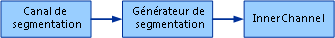
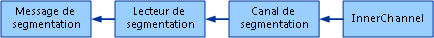

# Canal de segmentation
Lorsque vous envoyez des messages de grande taille à l'aide de [!INCLUDE[indigo1](../../../../includes/indigo1-md.md)], nous vous recommandons de limiter la quantité de mémoire utilisée pour leur mise en mémoire tampon.  L'une des solutions pour ce faire consiste à transmettre en continu le corps de ces messages \(possible à condition que la plus grande partie des données figurent dans le corps des messages concernés\).  Certains protocoles, cependant, nécessitent la mise en mémoire tampon de l'intégralité des messages.  Parmi ces protocoles figurent notamment ceux de la messagerie fiable et de la sécurité.  L'une des autres solutions consiste à diviser les messages de grande taille en messages plus petits appelés segments, à envoyer ces segment un par un, puis à reconstituer les grands messages initiaux à partir de ces segments, côté destinataire.  L'application peut effectuer ces opérations de segmentation et désegmentation elle\-même ou utiliser un canal personnalisé pour ce faire.  L'exemple de canal de segmentation suivant illustre la manière dont un protocole personnalisé ou un canal superposé peuvent être utilisés afin de segmenter ou désegmenter des messages de grande taille.  
  
 La segmentation doit toujours être employée uniquement une fois le message à envoyer entièrement construit.  Un canal de segmentation doit toujours être disposé en couche sous un canal de sécurité et un canal de session fiable.  
  
> [!NOTE]
>  La procédure d'installation ainsi que les instructions de génération relatives à cet exemple figurent à la fin de cette rubrique.  
  
> [!IMPORTANT]
>  Les exemples peuvent déjà être installés sur votre ordinateur.  Recherchez le répertoire \(par défaut\) suivant avant de continuer.  
>   
>  `<LecteurInstall>:\WF_WCF_Samples`  
>   
>  Si ce répertoire n'existe pas, rendez\-vous sur la page \(éventuellement en anglais\) des [exemples Windows Communication Foundation \(WCF\) et Windows Workflow Foundation \(WF\) pour .NET Framework 4](http://go.microsoft.com/fwlink/?LinkId=150780) pour télécharger tous les exemples [!INCLUDE[indigo1](../../../../includes/indigo1-md.md)] et [!INCLUDE[wf1](../../../../includes/wf1-md.md)].  Cet exemple se trouve dans le répertoire suivant.  
>   
>  `<LecteurInstall>:\WF_WCF_Samples\WCF\Extensibility\Channels\ChunkingChannel`  
  
## Hypothèses et limites concernant les canaux de segmentation  
  
### Structure de message  
 Les canaux de segmentation partent de l'hypothèse que la structure des messages est la suivante pour permettre leur segmentation :  
  
```  
<soap:Envelope ...>  
  <!-- headers -->  
  <soap:Body>  
    <operationElement>  
      <paramElement>data to be chunked</paramElement>  
    </operationElement>  
  </soap:Body>  
</soap:Envelope>  
```  
  
 Lorsque ServiceModel est utilisé, les opérations de contrat disposant d'un paramètre d'entrée appliquent cette forme de message à leur message d'entrée.  De la même façon, les opérations de contrat disposant d'un paramètre de sortie ou d'une valeur de retour applique cette forme de message à leur message de sortie.  Le code suivant donne des exemples de ce genre d'opérations :  
  
```  
[ServiceContract]  
interface ITestService  
{  
    [OperationContract]  
    Stream EchoStream(Stream stream);  
  
    [OperationContract]  
    Stream DownloadStream();  
  
    [OperationContract(IsOneWay = true)]  
    void UploadStream(Stream stream);  
}  
```  
  
### Sessions  
 Les canaux de segmentation nécessitent que les messages soient remis exactement une seule fois, en respectant l'ordre de remise des messages, c'est\-à\-dire des segments.  Cela signifie que la pile des canaux sous\-jacente doit correspondre à une pile de session.  Les sessions peuvent être fournies par le transport \(par exemple, par le transport TCP\) ou par un canal de protocole de session \(par exemple, par un canal ReliableSession\).  
  
### Méthodes Send et Receive asynchrones  
 Les méthodes Send et de Receive asynchrones ne sont pas implémentées dans cette version de l'exemple de canal de segmentation.  
  
## Protocole de segmentation  
 Le canal de segmentation définit un protocole marquant le début et la fin d'une série de segments et définissant également le numéro de séquence de chaque segment.  Les trois exemples de messages suivants correspondent à des messages de début, de segment et de fin. Ces exemples comportent également des explications présentant les principaux aspects de chacun d'entre eux.  
  
### Message de début  
  
```  
<s:Envelope xmlns:a="http://www.w3.org/2005/08/addressing"   
            xmlns:s="http://www.w3.org/2003/05/soap-envelope">  
  <s:Header>  
<!—Original message action is replaced with a chunking-specific action. -->  
    <a:Action s:mustUnderstand="1">http://samples.microsoft.com/chunkingAction</a:Action>  
<!--  
Original message is assigned a unique id that is transmitted   
in a MessageId header. Note that this is different from the WS-Addressing MessageId header.  
-->  
    <MessageId s:mustUnderstand="1" xmlns="http://samples.microsoft.com/chunking">  
53f183ee-04aa-44a0-b8d3-e45224563109  
</MessageId>  
<!--  
ChunkingStart header signals the start of a chunked message.  
-->  
    <ChunkingStart s:mustUnderstand="1" i:nil="true" xmlns:i="http://www.w3.org/2001/XMLSchema-instance" xmlns="http://samples.microsoft.com/chunking" />  
<!--  
Original message action is transmitted in OriginalAction.  
This is required to re-create the original message on the other side.  
-->  
    <OriginalAction xmlns="http://samples.microsoft.com/chunking">  
http://tempuri.org/ITestService/EchoStream  
    </OriginalAction>  
   <!--  
    All original message headers are included here.  
   -->  
  </s:Header>  
  <s:Body>  
<!--  
Chunking assumes this structure of Body content:  
<element>  
  <childelement>large data to be chunked<childelement>  
</element>  
The start message contains just <element> and <childelement> without  
the data to be chunked.  
-->  
    <EchoStream xmlns="http://tempuri.org/">  
      <stream />  
    </EchoStream>  
  </s:Body>  
</s:Envelope>  
```  
  
### Message de segment  
  
```  
<s:Envelope   
  xmlns:a="http://www.w3.org/2005/08/addressing"   
  xmlns:s="http://www.w3.org/2003/05/soap-envelope">  
  <s:Header>  
   <!--  
    All chunking protocol messages have this action.  
   -->  
    <a:Action s:mustUnderstand="1">  
      http://samples.microsoft.com/chunkingAction  
    </a:Action>  
<!--  
Same as MessageId in the start message. The GUID indicates which original message this chunk belongs to.  
-->  
    <MessageId s:mustUnderstand="1"   
               xmlns="http://samples.microsoft.com/chunking">  
      53f183ee-04aa-44a0-b8d3-e45224563109  
    </MessageId>  
<!--  
The sequence number of the chunk.  
This number restarts at 1 with each new sequence of chunks.  
-->  
    <ChunkNumber s:mustUnderstand="1"   
                 xmlns="http://samples.microsoft.com/chunking">  
      1096  
    </ChunkNumber>  
  </s:Header>  
  <s:Body>  
<!--  
The chunked data is wrapped in a chunk element.  
The encoding of this data (and the entire message)   
depends on the encoder used. The chunking channel does not mandate an encoding.  
-->  
    <chunk xmlns="http://samples.microsoft.com/chunking">  
kfSr2QcBlkHTvQ==  
    </chunk>  
  </s:Body>  
</s:Envelope>  
  
```  
  
### Message de fin  
  
```  
<s:Envelope xmlns:a="http://www.w3.org/2005/08/addressing"   
            xmlns:s="http://www.w3.org/2003/05/soap-envelope">  
  <s:Header>  
    <a:Action s:mustUnderstand="1">  
      http://samples.microsoft.com/chunkingAction  
    </a:Action>  
<!--  
Same as MessageId in the start message. The GUID indicates which original message this chunk belongs to.  
-->  
    <MessageId s:mustUnderstand="1"   
               xmlns="http://samples.microsoft.com/chunking">  
      53f183ee-04aa-44a0-b8d3-e45224563109  
    </MessageId>  
<!--  
ChunkingEnd header signals the end of a chunk sequence.  
-->  
    <ChunkingEnd s:mustUnderstand="1" i:nil="true"   
                 xmlns:i="http://www.w3.org/2001/XMLSchema-instance"   
                 xmlns="http://samples.microsoft.com/chunking" />  
<!--  
ChunkingEnd messages have a sequence number.  
-->  
    <ChunkNumber s:mustUnderstand="1"   
                 xmlns="http://samples.microsoft.com/chunking">  
      79  
    </ChunkNumber>  
  </s:Header>  
  <s:Body>  
<!--  
The ChunkingEnd message has the same <element><childelement> structure  
as the ChunkingStart message.  
-->  
    <EchoStream xmlns="http://tempuri.org/">  
      <stream />  
    </EchoStream>  
  </s:Body>  
</s:Envelope>  
```  
  
## Architecture des canaux de segmentation  
 Les canaux de segmentation sont des canaux `IDuplexSessionChannel` dont l'architecture, au plus haut niveau, s'apparente à celle des canaux standard.  Il existe en effet un élément `ChunkingBindingElement` capable de générer une fabrication `ChunkingChannelFactory` ainsi qu'un écouteur `ChunkingChannelListener`.  La fabrication `ChunkingChannelFactory` crée des instances de `ChunkingChannel` lorsqu'elle en reçoit la demande.  L'écouteur `ChunkingChannelListener` crée des instances de `ChunkingChannel` lorsqu'un nouveau canal interne est accepté.  Le `ChunkingChannel` est lui\-même chargé d'envoyer et de recevoir des messages.  
  
 Au niveau inférieur suivant, le canal `ChunkingChannel` s'appuie sur plusieurs composants afin d'implémenter le protocole de segmentation.  Du côté expéditeur, ce canal utilise un `XmlDictionaryWriter` personnalisé appelé `ChunkingWriter` qui procède à la segmentation effective des messages.  `ChunkingWriter` utilise directement le canal interne pour envoyer les segments.  L'utilisation d'un `XmlDictionaryWriter` personnalisé nous permet d'envoyer les segments pendant l'écriture du corps des messages initiaux de grande taille.  Cela signifie que nous ne mettons pas en mémoire tampon l'intégralité des messages initiaux.  
  
   
  
 Côté destinataire, `ChunkingChannel` extrait les messages du canal interne, puis les remet à un `XmlDictionaryReader` personnalisé appelé `ChunkingReader`, qui reconstitue les messages initiaux à partir des segments entrants.  `ChunkingChannel` encapsule ce `ChunkingReader` dans une implémentation de `Message` personnalisée appelée `ChunkingMessage` et retourne ce message à la couche supérieure.  Cette combinaison de `ChunkingReader` et `ChunkingMessage` nous permet de désegmenter le corps des messages initiaux pendant leur lecture par la couche supérieure, nous évitant ainsi d'avoir à mettre la totalité de leur corps en mémoire tampon.  `ChunkingReader` met en mémoire tampon un certain nombre de segments entrants, ce nombre étant configurable.  Cette limite atteinte, le lecteur patiente jusqu'à ce que les messages soient extraits de la file d'attente par la couche supérieure \(c'est\-à\-dire par simple lecture de leur corps\) ou jusqu'à ce que le délai de réception arrive à échéance.  
  
   
  
## Modèle de programmation de segmentation  
 Les développeurs de service peuvent spécifier quels messages doivent être segmentés en appliquant l'attribut `ChunkingBehavior` aux opérations du contrat.  Cet attribut expose une propriété `AppliesTo` qui permet aux développeurs de préciser si la segmentation doit être appliquée aux messages entrants, aux messages sortants ou aux deux.  L'exemple suivant illustre la manière dont l'attribut `ChunkingBehavior` est utilisé :  
  
```  
[ServiceContract]  
interface ITestService  
{  
    [OperationContract]  
    [ChunkingBehavior(ChunkingAppliesTo.Both)]  
    Stream EchoStream(Stream stream);  
  
    [OperationContract]  
    [ChunkingBehavior(ChunkingAppliesTo.OutMessage)]  
    Stream DownloadStream();  
  
    [OperationContract(IsOneWay=true)]  
    [ChunkingBehavior(ChunkingAppliesTo.InMessage)]  
    void UploadStream(Stream stream);  
  
}  
  
```  
  
 À partir de ce modèle de programmation, le `ChunkingBindingElement` compile une liste d'URI d'action qui identifient les messages qui doivent être segmentés.  L'action de chaque message sortant est comparée à celles figurant dans cette liste afin de déterminer si les messages doivent être segmentés ou envoyés directement.  
  
## Implémentation de l'opération d'envoi  
 Au niveau le plus élevé, l'opération d'envoi vérifie d'abord si le message sortant doit être segmenté, lorsque ce n'est pas le cas, elle l'envoie directement à l'aide du canal interne.  
  
 Si le message doit être segmenté, elle crée un nouveau `ChunkingWriter`, puis appelle `WriteBodyContents` sur ce message auquel elle passe ce `ChunkingWriter`.  Le `ChunkingWriter` procède ensuite à la segmentation du message \(notamment en copiant ses en\-têtes dans le message de début\), puis envoie les segments à l'aide du canal interne.  
  
 Autres informations dignes d'intérêt :  
  
-   La méthode Send appelle d'abord `ThrowIfDisposedOrNotOpened` afin de s'assurer que `CommunicationState` est ouvert.  
  
-   L'envoi est synchronisé afin qu'un seul message puisse être envoyé à la fois pour chaque session.  Lors de l'envoi d'un message segmenté, un événement `ManualResetEvent` appelé `sendingDone` est réinitialisé.  Cet événement est défini, une fois le segment de fin envoyé.  La méthode Send patiente jusqu'à la définition de cet événement avant d'essayer d'envoyer le message sortant.  
  
-   La méthode Send verrouille `CommunicationObject.ThisLock` pour empêcher la modification des états synchronisés lors de l'envoi.  Consultez la documentation <xref:System.ServiceModel.Channels.CommunicationObject> pour plus d'informations sur les états et l'ordinateur d'état <xref:System.ServiceModel.Channels.CommunicationObject>.  
  
-   Le délai passé à la méthode Send correspond au délai appliqué à l'intégralité de l'opération d'envoi, notamment à l'envoi de tous les segments.  
  
-   Le `XmlDictionaryWriter` a été spécialement conçu pour éviter la mise en mémoire tampon de la totalité du corps des messages initiaux.  Si le `XmlDictionaryReader` du corps des messages était obtenu à l'aide de `message.GetReaderAtBodyContents`, tout leur corps serait mis en mémoire tampon.  Au lieu de cela, un `XmlDictionaryWriter` personnalisé est passé à `message.WriteBodyContents`.  Les messages appelant WriteBase64 sur l'enregistreur, ce dernier emballe les segments dans des messages, puis les envoie à l'aide du canal interne.  WriteBase64 est verrouillé jusqu'à l'envoi des segments.  
  
## Implémentation de l'opération de réception  
 Au plus haut niveau, l'opération de réception s'assure d'abord que les deux conditions suivantes sont réunies : le message entrant n'est pas `null` et son action correspond à `ChunkingAction`.  Si l'une ou l'autre de ces conditions n'est pas respectée, la méthode Receive retourne le message sans le modifier.  En revanche, si ces deux conditions sont réunies, la méthode Receive crée un nouveau `ChunkingReader` ainsi qu'un nouveau `ChunkingMessage` encapsulé autour du premier \(en appelant `GetNewChunkingMessage`\).  Avant de retourner ce nouveau `ChunkingMessage`, la méthode Receive utilise un thread Threadpool pour exécuter une `ReceiveChunkLoop` qui appelle la méthode `innerChannel.Receive` dans une boucle, puis remet les segments au `ChunkingReader` jusqu'à réception du segment de fin ou échéance du délai de réception.  
  
 Autres informations dignes d'intérêt :  
  
-   À l'instar de la méthode Send, la méthode Receive appelle d'abord `ThrowIfDisposedOrNotOepned` afin de s'assurer que `CommunicationState` est ouvert.  
  
-   La méthode Receive est également synchronisée afin qu'un seul message puisse être reçu à la fois pour chaque session.  Il s'agit d'une spécification particulièrement importante. En effet, une fois le segment de début reçu, tous les messages suivants sont censés correspondre à des segments appartenant à la nouvelle séquence de segments démarrée par ce segment de début, et ce jusqu'à réception du segment de fin.  La méthode Receive ne peut extraire les segments du message en cours de désegmentation du canal interne qu'une fois tous ces segments reçus.  À cette fin, la méthode Receive utilise un événement `ManualResetEvent` appelé `currentMessageCompleted` qui est défini à réception du segment de fin et réinitialisé à réception d'un nouveau segment de début.  
  
-   À la différence de la méthode Send, la méthode Receive n'empêche pas les transitions entre états synchronisés pendant la réception.  Par exemple, la méthode Close, laquelle patiente alors jusqu'au terme de la réception en attente du message initial ou jusqu'à l'arrivée à échéance du délai spécifié, peut être appelée pendant la réception.  
  
-   Le délai passé à la méthode Receive correspond au délai appliqué à l'intégralité de l'opération de réception, notamment à la réception de tous les segments.  
  
-   Lorsque la couche absorbe le corps des messages à une vitesse inférieure à la vitesse d'arrivée des segments entrants, le `ChunkingReader` met en mémoire tampon ces segments jusqu'à ce que la limite spécifiée par `ChunkingBindingElement.MaxBufferedChunks` soit atteinte.  Cette limite atteinte, plus aucun segment n'est extrait de la couche inférieure jusqu'à absorption d'un des segments en mémoire tampon ou jusqu'à l'arrivée à échéance du délai de réception.  
  
## Substitutions CommunicationObject  
  
### OnOpen  
 `OnOpen` appelle la méthode `innerChannel.Open` afin d'ouvrir le canal interne.  
  
### OnClose  
 `OnClose` affecte d'abord à `stopReceive` la valeur `true` pour arrêter l'exécution de la boucle `ReceiveChunkLoop` en attente.  Cette méthode patiente ensuite jusqu'à l'arrivée de l'événement `ManualResetEvent` `receiveStopped` défini lorsque la boucle `ReceiveChunkLoop` s'arrête.  En partant de l'hypothèse que la boucle `ReceiveChunkLoop` s'arrête avant l'expiration du délai spécifié, la méthode `OnClose` appelle alors `innerChannel.Close` dans le temps encore imparti.  
  
### OnAbort  
 `OnAbort` appelle la méthode `innerChannel.Abort` afin d'annuler le canal interne.  Lorsqu'une boucle `ReceiveChunkLoop` est en attente, une exception est levée depuis l'appel de `innerChannel.Receive` en attente.  
  
### OnFaulted  
 Le `ChunkingChannel` ne requiert pas de comportement spécial lorsqu'il est rendu défaillant afin d'empêcher la substitution de `OnFaulted`.  
  
## Implémentation de la fabrication de canal  
 La fabrication `ChunkingChannelFactory` est chargée de créer des instances de `ChunkingDuplexSessionChannel` et de mettre en cascade les transitions d'état au niveau de la fabrication de canal interne.  
  
 `OnCreateChannel` utilise la fabrication de canal interne pour créer un canal interne `IDuplexSessionChannel`.  Cette méthode crée ensuite un nouveau canal `ChunkingDuplexSessionChannel` auquel elle passe ce canal interne, la liste des actions de message à segmenter et le nombre maximal de segments pouvant être mis en mémoire tampon à réception.  Cette liste et ce nombre correspondent à deux paramètres passés à `ChunkingChannelFactory` par l'intermédiaire de son constructeur.  La section consacrée à `ChunkingBindingElement` contient des explications sur l'origine de ces deux valeurs.  
  
 Les méthodes `OnOpen`, `OnClose`, `OnAbort` et leurs équivalents asynchrones appellent la méthode de transition d'état correspondante sur la fabrication de canal interne.  
  
## Implémentation de l'écouteur de canal  
 L'écouteur `ChunkingChannelListener` correspond à un wrapper autour d'un écouteur de canal interne.  Sa fonction principale, outre déléguer les appels à l'écouteur de canal interne, consiste à encapsuler les nouveaux canaux `ChunkingDuplexSessionChannels` autour des canaux acceptés depuis l'écouteur de canal interne.  Ce processus s'effectue dans `OnAcceptChannel` et `OnEndAcceptChannel`.  Le canal interne ainsi que les autres paramètres décrits précédemment sont passés au nouveau canal `ChunkingDuplexSessionChannel` créé.  
  
## Implémentation de l'élément de liaison et de la liaison  
 L'élément `ChunkingBindingElement` est chargé de créer la fabrication `ChunkingChannelFactory` et l'écouteur `ChunkingChannelListener`.  L'élément `ChunkingBindingElement` vérifie si les T dans `CanBuildChannelFactory`\<T\> et `CanBuildChannelListener`\<T\> sont du type `IDuplexSessionChannel` \(c'est\-à\-dire du seul type de canal pris en charge par le canal de segmentation\) et si les autres éléments de la liaison prennent en charge ce type de canal.  
  
 `BuildChannelFactory`\<T\> vérifie d'abord si le type de canal demandé peut être généré, puis obtient une liste d'actions de message à segmenter.  Pour plus d'informations, consultez la section suivante.  Cette méthode crée alors une nouvelle fabrication `ChunkingChannelFactory` à laquelle elle passe la fabrication de canal interne \(telle que retournée depuis `context.BuildInnerChannelFactory<IDuplexSessionChannel>`\), la liste d'actions de message et le nombre maximal de segments pouvant être mise en mémoire tampon.  Ce nombre maximal est issu de la propriété appelée `MaxBufferedChunks`, laquelle est exposée par l'élément `ChunkingBindingElement`.  
  
 `BuildChannelListener<T>` utilise une implémentation similaire pour créer `ChunkingChannelListener` et lui passer l'écouteur de canal interne.  
  
 Cet exemple de code contient une liaison appelée `TcpChunkingBinding`.  Cette liaison se compose de deux éléments de liaison : `TcpTransportBindingElement` et `ChunkingBindingElement`.  En plus d'exposer la propriété `MaxBufferedChunks`, cette liaison définit également quelques\-unes des propriétés `TcpTransportBindingElement` telles que `MaxReceivedMessageSize` \(elle affecte à cette dernière la valeur `ChunkingUtils.ChunkSize` \+ 100 Ko pour les en\-têtes\).  
  
 `TcpChunkingBinding` implémente également `IBindingRuntimePreferences` et retourne la valeur true depuis la méthode `ReceiveSynchronously`, indiquant que seuls les appels Receive synchrones sont implémentés.  
  
### Identification des messages à segmenter  
 Les canaux de segmentation segmentent uniquement les messages identifiés à l'aide de l'attribut `ChunkingBehavior`.  La classe `ChunkingBehavior` implémente `IOperationBehavior` et est elle\-même implémentée par l'appel de la méthode `AddBindingParameter`.  Dans cette méthode, la classe `ChunkingBehavior` examine la valeur de sa propriété `AppliesTo` \(`InMessage` ou `OutMessage` ou encore les deux\) afin d'identifier les messages à segmenter.  Elle obtient ensuite l'action correspondant à chacun de ces messages \(depuis la collection Messages sur `OperationDescription`\), puis ajoute chacune de ces actions aux collections de chaînes contenue dans les instances de `ChunkingBindingParameter`.  Elle ajoute enfin ce `ChunkingBindingParameter` à la collection `BindingParameterCollection`.  
  
 Cette `BindingParameterCollection` est passée à l'intérieur du `BindingContext` à chaque élément de la liaison lorsque ces éléments génèrent la fabrication de canal ou l'écouteur de canal.  L'implémentation de l'élément `ChunkingBindingElement` de `BuildChannelFactory<T>` et de `BuildChannelListener<T>` extrait le paramètre `ChunkingBindingParameter` de la collection `BindingParameterCollection` du contexte `BindingContext’`.  La collection d'actions contenue dans le `ChunkingBindingParameter` est passée à `ChunkingChannelFactory` ou à `ChunkingChannelListener`, qui la passe ensuite au `ChunkingDuplexSessionChannel`.  
  
## Exécution de l'exemple  
  
#### Pour configurer, générer et exécuter l'exemple  
  
1.  Installez [!INCLUDE[vstecasp](../../../../includes/vstecasp-md.md)] 4.0 à l'aide de la commande suivante.  
  
    ```  
    %windir%\Microsoft.NET\Framework\v4.0.XXXXX\aspnet_regiis.exe /i /enable  
  
    ```  
  
2.  Assurez\-vous d'avoir effectué la procédure indiquée à la section [Procédure d'installation unique pour les exemples Windows Communication Foundation](../../../../docs/framework/wcf/samples/one-time-setup-procedure-for-the-wcf-samples.md).  
  
3.  Pour générer la solution, suivez les instructions indiquées dans [Génération des exemples Windows Communication Foundation](../../../../docs/framework/wcf/samples/building-the-samples.md).  
  
4.  Pour exécuter l'exemple dans une configuration à un ou plusieurs ordinateurs, conformez\-vous aux instructions figurant dans [Exécution des exemples Windows Communication Foundation](../../../../docs/framework/wcf/samples/running-the-samples.md).  
  
5.  Exécutez en premier Service.exe, puis Client.exe. Regardez ensuite leurs fenêtres de console respectives pour connaître leur résultat.  
  
 L'exécution de l'exemple est censée donner le résultat suivant.  
  
 Client :  
  
```  
Press enter when service is available  
  
 > Sent chunk 1 of message 867c1fd1-d39e-4be1-bc7b-32066d7ced10  
 > Sent chunk 2 of message 867c1fd1-d39e-4be1-bc7b-32066d7ced10  
 > Sent chunk 3 of message 867c1fd1-d39e-4be1-bc7b-32066d7ced10  
 > Sent chunk 4 of message 867c1fd1-d39e-4be1-bc7b-32066d7ced10  
 > Sent chunk 5 of message 867c1fd1-d39e-4be1-bc7b-32066d7ced10  
 > Sent chunk 6 of message 867c1fd1-d39e-4be1-bc7b-32066d7ced10  
 > Sent chunk 7 of message 867c1fd1-d39e-4be1-bc7b-32066d7ced10  
 > Sent chunk 8 of message 867c1fd1-d39e-4be1-bc7b-32066d7ced10  
 > Sent chunk 9 of message 867c1fd1-d39e-4be1-bc7b-32066d7ced10  
 > Sent chunk 10 of message 867c1fd1-d39e-4be1-bc7b-32066d7ced10  
 < Received chunk 1 of message 5b226ad5-c088-4988-b737-6a565e0563dd  
 < Received chunk 2 of message 5b226ad5-c088-4988-b737-6a565e0563dd  
 < Received chunk 3 of message 5b226ad5-c088-4988-b737-6a565e0563dd  
 < Received chunk 4 of message 5b226ad5-c088-4988-b737-6a565e0563dd  
 < Received chunk 5 of message 5b226ad5-c088-4988-b737-6a565e0563dd  
 < Received chunk 6 of message 5b226ad5-c088-4988-b737-6a565e0563dd  
 < Received chunk 7 of message 5b226ad5-c088-4988-b737-6a565e0563dd  
 < Received chunk 8 of message 5b226ad5-c088-4988-b737-6a565e0563dd  
 < Received chunk 9 of message 5b226ad5-c088-4988-b737-6a565e0563dd  
 < Received chunk 10 of message 5b226ad5-c088-4988-b737-6a565e0563dd  
```  
  
 Serveur :  
  
```  
Service started, press enter to exit  
 < Received chunk 1 of message 867c1fd1-d39e-4be1-bc7b-32066d7ced10  
 < Received chunk 2 of message 867c1fd1-d39e-4be1-bc7b-32066d7ced10  
 < Received chunk 3 of message 867c1fd1-d39e-4be1-bc7b-32066d7ced10  
 < Received chunk 4 of message 867c1fd1-d39e-4be1-bc7b-32066d7ced10  
 < Received chunk 5 of message 867c1fd1-d39e-4be1-bc7b-32066d7ced10  
 < Received chunk 6 of message 867c1fd1-d39e-4be1-bc7b-32066d7ced10  
 < Received chunk 7 of message 867c1fd1-d39e-4be1-bc7b-32066d7ced10  
 < Received chunk 8 of message 867c1fd1-d39e-4be1-bc7b-32066d7ced10  
 < Received chunk 9 of message 867c1fd1-d39e-4be1-bc7b-32066d7ced10  
 < Received chunk 10 of message 867c1fd1-d39e-4be1-bc7b-32066d7ced10  
 > Sent chunk 1 of message 5b226ad5-c088-4988-b737-6a565e0563dd  
 > Sent chunk 2 of message 5b226ad5-c088-4988-b737-6a565e0563dd  
 > Sent chunk 3 of message 5b226ad5-c088-4988-b737-6a565e0563dd  
 > Sent chunk 4 of message 5b226ad5-c088-4988-b737-6a565e0563dd  
 > Sent chunk 5 of message 5b226ad5-c088-4988-b737-6a565e0563dd  
 > Sent chunk 6 of message 5b226ad5-c088-4988-b737-6a565e0563dd  
 > Sent chunk 7 of message 5b226ad5-c088-4988-b737-6a565e0563dd  
 > Sent chunk 8 of message 5b226ad5-c088-4988-b737-6a565e0563dd  
 > Sent chunk 9 of message 5b226ad5-c088-4988-b737-6a565e0563dd  
 > Sent chunk 10 of message 5b226ad5-c088-4988-b737-6a565e0563dd  
```  
  
## Voir aussi