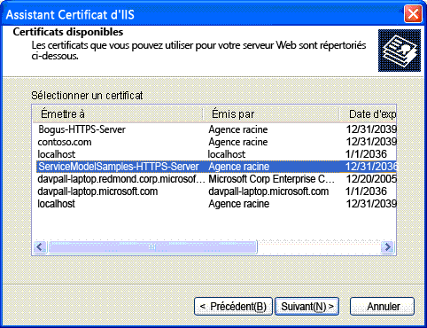

# <a name="internet-information-services-iis-server-certificate-installation-instructions"></a>Instructions d'installation du certificat de serveur des services Internet (IIS)
Pour pouvoir exécuter les exemples qui utilisent la communication sécurisée avec les services Internet (IIS), vous devez créer et installer un certificat de serveur.  
  
## <a name="step-1-creating-certificates"></a>Étape 1. Création de certificats  
 Pour créer un certificat pour votre ordinateur, ouvrez une invite de commandes de Visual studio avec des privilèges d'administrateur, puis exécutez le fichier Setup.bat inclus dans chacun des exemples qui utilisent la communication sécurisée avec IIS. Vérifiez que le chemin d'accès inclut le dossier qui contient Makecert.exe avant d'exécuter ce fichier batch. La commande suivante permet de créer le certificat dans Setup.bat.  
  
```  
makecert -sr LocalMachine -ss My -n CN=ServiceModelSamples-HTTPS-Server -sky exchange -sk ServiceModelSamples-HTTPS-Key  
```  
  
## <a name="step-2-installing-certificates"></a>Étape 2. Installation de certificats  
 La procédure d'installation des certificats que vous venez de créer varie en fonction de la version d'IIS utilisée.  
  
#### <a name="to-install-iis-on-iis-51-windows-xp-and-iis-60-windows-server-2003"></a>Pour installer IIS sur IIS 5.1 (Windows XP) et IIS 6.0 (Windows Server 2003)  
  
1.  Ouvrez le composant logiciel enfichable MMC du Gestionnaire des services IIS.  
  
2.  Cliquez sur le site Web par défaut et sélectionnez **propriétés**.  
  
3.  Sélectionnez le **sécurité du répertoire** onglet.  
  
4.  Cliquez sur le **certificat de serveur** bouton. L’Assistant de création de certificats de serveur web démarre.  
  
5.  Terminez l'Assistant. Sélectionnez l'option d'assignation de certificat. Sélectionnez le certificat ServiceModelSamples-HTTPS-Server dans la liste de certificats qui s'affiche.  
  
       
  
6.  Testez l'accès au service dans un navigateur, en utilisant l'adresse HTTPS suivante : https://localhost/servicemodelsamples/service.svc.  
  
#### <a name="if-ssl-was-previously-configured-by-using-httpcfgexe"></a>Si SSL a été configuré précédemment via l'utilisation du fichier Httpcfg.exe :  
  
1.  Utilisez Makecert.exe (ou exécutez Setup.bat) pour créer le certificat de serveur.  
  
2.  Exécutez le Gestionnaire des services IIS et installez le certificat conformément aux instructions des étapes précédentes.  
  
3.  Ajoutez la ligne de code suivante au programme client :  
  
> [!IMPORTANT]
>  Ce code est uniquement requis pour les certificats de test tels que ceux créés par Makecert.exe. Il n'est pas recommandé pour le code de production.  
  
```  
PermissiveCertificatePolicy.Enact("CN=ServiceModelSamples-HTTPS-Server");  
```  
  
#### <a name="to-install-iis-on-iis-70-windows-vista-and-windows-server-2008"></a>Pour installer IIS sur IIS 7.0 (Windows Vista et Windows Server 2008)  
  
1.  À partir de la **Démarrer** menu, cliquez sur **exécuter**, puis tapez **inetmgr** pour ouvrir le composant logiciel enfichable MMC Internet Information Services (IIS).  
  
2.  Cliquez sur le **Site Web par défaut** et sélectionnez **modifier les liaisons...**  
  
3.  Cliquez sur le **ajouter** bouton de la **liaisons de Site** boîte de dialogue.  
  
4.  Sélectionnez **HTTPS** à partir de la **Type** liste déroulante.  
  
5.  Sélectionnez le **ServiceModelSamples-HTTPS-Server** à partir de la **certificat SSL** liste déroulante, puis cliquez sur **OK**.  
  
6.  Testez l'accès au service dans un navigateur, en utilisant l'adresse HTTPS suivante : https://localhost/servicemodelsamples/service.svc.  
  
> [!NOTE]
>  Étant donné que le certificat de test que vous venez d'installer n'est pas un certificat approuvé, vous risquez de recevoir des avertissements de sécurité Internet Explorer supplémentaires lorsque vous recherchez des adresses Web locales sécurisées à l'aide de ce certificat.  
  
## <a name="removing-certificates"></a>Suppression de certificats  
  
-   Utilisez le Gestionnaire des services IIS comme indiqué précédemment, mais supprimez le certificat ou la liaison au lieu de l'ajouter.  
  
-   Supprimez le certificat d'ordinateur en utilisant la commande suivante.  
  
    ```  
    httpcfg delete ssl -i 0.0.0.0:443  
    ```
