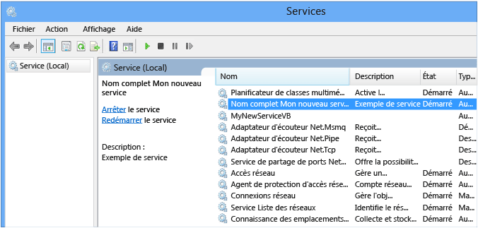
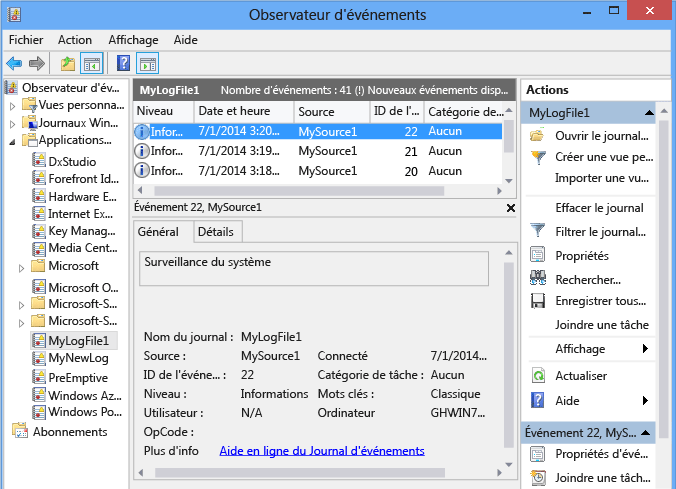

# <a name="walkthrough-creating-a-windows-service-application-in-the-component-designer"></a><span data-ttu-id="3fb7f-102">Procédure pas à pas : création d'une application de service Windows dans le Concepteur de composants</span><span class="sxs-lookup"><span data-stu-id="3fb7f-102">Walkthrough: Creating a Windows Service Application in the Component Designer</span></span>
<span data-ttu-id="3fb7f-103">Cet article explique comment créer, dans Visual Studio, une application de service Windows simple qui écrit des messages dans un journal des événements.</span><span class="sxs-lookup"><span data-stu-id="3fb7f-103">This article demonstrates how to create a simple Windows Service application in Visual Studio that writes messages to an event log.</span></span> <span data-ttu-id="3fb7f-104">La création et l'utilisation de votre service comportent les étapes de base suivantes :</span><span class="sxs-lookup"><span data-stu-id="3fb7f-104">Here are the basic steps that you perform to create and use your service:</span></span>  
  
1.  <span data-ttu-id="3fb7f-105">[Création d'un service](#BK_CreateProject) à l’aide du modèle de projet **Service Windows** , puis configuration de celui-ci.</span><span class="sxs-lookup"><span data-stu-id="3fb7f-105">[Creating a Service](#BK_CreateProject) by using the **Windows Service** project template, and configure it.</span></span> <span data-ttu-id="3fb7f-106">Ce modèle crée une classe qui hérite de <xref:System.ServiceProcess.ServiceBase?displayProperty=nameWithType> et écrit la majeure partie du code de base du service, notamment le code servant à démarrer le service.</span><span class="sxs-lookup"><span data-stu-id="3fb7f-106">This template creates a class for you that inherits from <xref:System.ServiceProcess.ServiceBase?displayProperty=nameWithType> and writes much of the basic service code, such as the code to start the service.</span></span>  
  
2.  <span data-ttu-id="3fb7f-107">[Ajout de fonctionnalités au service](#BK_WriteCode) des procédures <xref:System.ServiceProcess.ServiceBase.OnStart%2A> et <xref:System.ServiceProcess.ServiceBase.OnStop%2A> , puis substitution de toute autre méthode que vous souhaitez redéfinir.</span><span class="sxs-lookup"><span data-stu-id="3fb7f-107">[Adding Features to the Service](#BK_WriteCode) for the <xref:System.ServiceProcess.ServiceBase.OnStart%2A> and <xref:System.ServiceProcess.ServiceBase.OnStop%2A> procedures, and override any other methods that you want to redefine.</span></span>  
  
3.  <span data-ttu-id="3fb7f-108">[Définition de l'état du service](#BK_SetStatus).</span><span class="sxs-lookup"><span data-stu-id="3fb7f-108">[Setting Service Status](#BK_SetStatus).</span></span> <span data-ttu-id="3fb7f-109">Par défaut, les services créés avec <xref:System.ServiceProcess.ServiceBase?displayProperty=nameWithType> implémentent uniquement un sous-ensemble des indicateurs d'état disponibles.</span><span class="sxs-lookup"><span data-stu-id="3fb7f-109">By default, services created with <xref:System.ServiceProcess.ServiceBase?displayProperty=nameWithType> implement only a subset of the available status flags.</span></span> <span data-ttu-id="3fb7f-110">Si le démarrage, l'interruption ou l'arrêt de votre service est long, vous pouvez implémenter des valeurs d'état telles que Démarrer Suspendre ou Arrêter Suspendre pour indiquer qu'il est en train de travailler sur une opération.</span><span class="sxs-lookup"><span data-stu-id="3fb7f-110">If your service takes a long time to start up, pause, or stop, you can implement status values such as Start Pending or Stop Pending to indicate that it's working on an operation.</span></span>  
  
4.  <span data-ttu-id="3fb7f-111">[Ajout de programmes d'installation pour le service](#BK_AddInstallers) pour votre application de service.</span><span class="sxs-lookup"><span data-stu-id="3fb7f-111">[Adding Installers to the Service](#BK_AddInstallers) for your service application.</span></span>  
  
5.  <span data-ttu-id="3fb7f-112">(Facultatif) [Définition de paramètres de démarrage](#BK_StartupParameters), spécification des arguments de démarrage par défaut, puis octroi aux utilisateurs de l’autorisation de remplacer les paramètres par défaut quand ils démarrent manuellement votre service.</span><span class="sxs-lookup"><span data-stu-id="3fb7f-112">(Optional) [Set Startup Parameters](#BK_StartupParameters), specify default startup arguments, and enable users to override default settings when they start your service manually.</span></span>  
  
6.  <span data-ttu-id="3fb7f-113">[Génération du service](#BK_Build).</span><span class="sxs-lookup"><span data-stu-id="3fb7f-113">[Building the Service](#BK_Build).</span></span>  
  
7.  <span data-ttu-id="3fb7f-114">[Installation du service](#BK_Install) sur l’ordinateur local.</span><span class="sxs-lookup"><span data-stu-id="3fb7f-114">[Installing the Service](#BK_Install) on the local machine.</span></span>  
  
8.  <span data-ttu-id="3fb7f-115">Accès au Gestionnaire de contrôle des services Windows et [Démarrage et exécution du service](#BK_StartService).</span><span class="sxs-lookup"><span data-stu-id="3fb7f-115">Access the Windows Service Control Manager and [Starting and Running the Service](#BK_StartService).</span></span>  
  
9. <span data-ttu-id="3fb7f-116">[Désinstallation d'un service Windows](#BK_Uninstall).</span><span class="sxs-lookup"><span data-stu-id="3fb7f-116">[Uninstalling a Windows Service](#BK_Uninstall).</span></span>  
  
> [!WARNING]
>  <span data-ttu-id="3fb7f-117">Le modèle de projet Services Windows requis pour cette procédure pas-à-pas n'est pas disponible dans l'édition Express de Visual Studio.</span><span class="sxs-lookup"><span data-stu-id="3fb7f-117">The Windows Services project template that is required for this walkthrough is not available in the Express edition of Visual Studio.</span></span>  
  
 [!INCLUDE[note_settings_general](../../../includes/note-settings-general-md.md)]  
  
<a name="BK_CreateProject"></a>   
## <a name="creating-a-service"></a><span data-ttu-id="3fb7f-118">Création d'un service</span><span class="sxs-lookup"><span data-stu-id="3fb7f-118">Creating a Service</span></span>  
 <span data-ttu-id="3fb7f-119">Pour commencer, créez votre projet et définissez les valeurs nécessaires au fonctionnement correct du service.</span><span class="sxs-lookup"><span data-stu-id="3fb7f-119">To begin, you create the project and set values that are required for the service to function correctly.</span></span>  
  
#### <a name="to-create-and-configure-your-service"></a><span data-ttu-id="3fb7f-120">Pour créer et configurer votre service</span><span class="sxs-lookup"><span data-stu-id="3fb7f-120">To create and configure your service</span></span>  
  
1.  <span data-ttu-id="3fb7f-121">Dans Visual Studio, dans la barre de menus, choisissez **Fichier**, **Nouveau**, puis **Projet**.</span><span class="sxs-lookup"><span data-stu-id="3fb7f-121">In Visual Studio, on the menu bar, choose **File**, **New**, **Project**.</span></span>  
  
     <span data-ttu-id="3fb7f-122">La boîte de dialogue **Nouveau projet** s'affiche.</span><span class="sxs-lookup"><span data-stu-id="3fb7f-122">The **New Project** dialog box opens.</span></span>  
  
2.  <span data-ttu-id="3fb7f-123">Dans la liste des modèles de projet Visual Basic ou Visual C#, choisissez **Service Windows**, puis nommez le projet **MyNewService**.</span><span class="sxs-lookup"><span data-stu-id="3fb7f-123">In the list of Visual Basic or Visual C# project templates, choose **Windows Service**, and name the project **MyNewService**.</span></span> <span data-ttu-id="3fb7f-124">Cliquez sur **OK**.</span><span class="sxs-lookup"><span data-stu-id="3fb7f-124">Choose **OK**.</span></span>  
  
     <span data-ttu-id="3fb7f-125">Le modèle de projet ajoute automatiquement une classe Component appelée `Service1` qui hérite de <xref:System.ServiceProcess.ServiceBase?displayProperty=nameWithType>.</span><span class="sxs-lookup"><span data-stu-id="3fb7f-125">The project template automatically adds a component class named `Service1` that inherits from <xref:System.ServiceProcess.ServiceBase?displayProperty=nameWithType>.</span></span>  
  
3.  <span data-ttu-id="3fb7f-126">Dans le menu **Modifier** , choisissez **Rechercher et remplacer**, **Rechercher dans les fichiers** (clavier : Ctrl+Maj+F).</span><span class="sxs-lookup"><span data-stu-id="3fb7f-126">On the **Edit** menu, choose **Find and Replace**, **Find in Files** (Keyboard: Ctrl+Shift+F).</span></span> <span data-ttu-id="3fb7f-127">Remplacez toutes les occurrences de `Service1` par `MyNewService`.</span><span class="sxs-lookup"><span data-stu-id="3fb7f-127">Change all occurrences of `Service1` to `MyNewService`.</span></span> <span data-ttu-id="3fb7f-128">Vous en trouverez des instances dans Service1.cs, Program.cs et Service1.Designer.cs (ou leurs équivalents .vb).</span><span class="sxs-lookup"><span data-stu-id="3fb7f-128">You’ll find instances in Service1.cs, Program.cs, and Service1.Designer.cs (or their .vb equivalents).</span></span>  
  
4.  <span data-ttu-id="3fb7f-129">Dans la fenêtre **Propriétés** de **Service1.cs [Conception]** ou **Service1.vb [Conception]**, affectez à <xref:System.ServiceProcess.ServiceBase.ServiceName%2A> et à la propriété **(Name)** de `Service1` la valeur **MyNewService**, si elle n’est pas encore définie.</span><span class="sxs-lookup"><span data-stu-id="3fb7f-129">In the **Properties** window for **Service1.cs [Design]** or **Service1.vb [Design]**, set the <xref:System.ServiceProcess.ServiceBase.ServiceName%2A> and the **(Name)** property for `Service1` to **MyNewService**, if it's not already set.</span></span>  
  
5.  <span data-ttu-id="3fb7f-130">Dans l'Explorateur de solutions, renommez **Service1.cs** en **MyNewService.cs**, ou **Service1.vb** en **MyNewService.vb**.</span><span class="sxs-lookup"><span data-stu-id="3fb7f-130">In Solution Explorer, rename **Service1.cs** to **MyNewService.cs**, or **Service1.vb** to **MyNewService.vb**.</span></span>  
  
<a name="BK_WriteCode"></a>   
## <a name="adding-features-to-the-service"></a><span data-ttu-id="3fb7f-131">Ajout de fonctionnalités au service</span><span class="sxs-lookup"><span data-stu-id="3fb7f-131">Adding Features to the Service</span></span>  
 <span data-ttu-id="3fb7f-132">Dans cette section, vous ajoutez un journal des événements personnalisé au service Windows.</span><span class="sxs-lookup"><span data-stu-id="3fb7f-132">In this section, you add a custom event log to the Windows service.</span></span> <span data-ttu-id="3fb7f-133">Les journaux des événements ne sont en aucune façon associés aux services Windows.</span><span class="sxs-lookup"><span data-stu-id="3fb7f-133">Event logs are not associated in any way with Windows services.</span></span> <span data-ttu-id="3fb7f-134">Dans ce cas-ci, le composant <xref:System.Diagnostics.EventLog> est utilisé comme un exemple du type de composants que vous pouvez ajouter à un service Windows.</span><span class="sxs-lookup"><span data-stu-id="3fb7f-134">Here the <xref:System.Diagnostics.EventLog> component is used as an example of the type of component you could add to a Windows service.</span></span>  
  
#### <a name="to-add-custom-event-log-functionality-to-your-service"></a><span data-ttu-id="3fb7f-135">Pour ajouter une fonctionnalité de journal des événements personnalisé à votre service</span><span class="sxs-lookup"><span data-stu-id="3fb7f-135">To add custom event log functionality to your service</span></span>  
  
1.  <span data-ttu-id="3fb7f-136">Dans l' **Explorateur de solutions**, ouvrez le menu contextuel pour **MyNewService.cs** ou **MyNewService.vb**, puis choisissez **Concepteur de vues**.</span><span class="sxs-lookup"><span data-stu-id="3fb7f-136">In **Solution Explorer**, open the context menu for **MyNewService.cs** or **MyNewService.vb**, and then choose **View Designer**.</span></span>  
  
2.  <span data-ttu-id="3fb7f-137">À partir de la section **Composants** de la **boîte à outils**, faites glisser un composant <xref:System.Diagnostics.EventLog> jusqu'au concepteur.</span><span class="sxs-lookup"><span data-stu-id="3fb7f-137">From the **Components** section of the **Toolbox**, drag an <xref:System.Diagnostics.EventLog> component to the designer.</span></span>  
  
3.  <span data-ttu-id="3fb7f-138">Dans l' **Explorateur de solutions**, ouvrez le menu contextuel pour **MyNewService.cs** ou **MyNewService.vb**, puis choisissez **Afficher le code**.</span><span class="sxs-lookup"><span data-stu-id="3fb7f-138">In **Solution Explorer**, open the context menu for **MyNewService.cs** or **MyNewService.vb**, and then choose **View Code**.</span></span>  
  
4.  <span data-ttu-id="3fb7f-139">Ajoutez une déclaration de l'objet **eventLog** dans la classe `MyNewService` , juste après la ligne qui déclare la variable `components` :</span><span class="sxs-lookup"><span data-stu-id="3fb7f-139">Add a declaration for the **eventLog** object in the `MyNewService` class, right after the line that declares the `components` variable:</span></span>  
  
     [!code-csharp[VbRadconService#16](../../../samples/snippets/csharp/VS_Snippets_VBCSharp/VbRadconService/CS/MyNewService.cs#16)]
     [!code-vb[VbRadconService#16](../../../samples/snippets/visualbasic/VS_Snippets_VBCSharp/VbRadconService/VB/MyNewService.vb#16)]  
  
5.  <span data-ttu-id="3fb7f-140">Ajoutez ou modifiez le constructeur pour définir un journal des événements personnalisé :</span><span class="sxs-lookup"><span data-stu-id="3fb7f-140">Add or edit the constructor to define a custom event log:</span></span>  
  
     [!code-csharp[VbRadconService#2](../../../samples/snippets/csharp/VS_Snippets_VBCSharp/VbRadconService/CS/MyNewService.cs#2)]
     [!code-vb[VbRadconService#2](../../../samples/snippets/visualbasic/VS_Snippets_VBCSharp/VbRadconService/VB/MyNewService.vb#2)]  
  
#### <a name="to-define-what-occurs-when-the-service-starts"></a><span data-ttu-id="3fb7f-141">Pour définir les actions à effectuer lors du démarrage du service</span><span class="sxs-lookup"><span data-stu-id="3fb7f-141">To define what occurs when the service starts</span></span>  
  
-   <span data-ttu-id="3fb7f-142">Dans l'éditeur de code, localisez la méthode <xref:System.ServiceProcess.ServiceBase.OnStart%2A> qui a été automatiquement substituée lorsque vous avez créé le projet, puis remplacez le code par ce qui suit.</span><span class="sxs-lookup"><span data-stu-id="3fb7f-142">In the Code Editor, locate the <xref:System.ServiceProcess.ServiceBase.OnStart%2A> method that was automatically overridden when you created the project, and replace the code with the following.</span></span> <span data-ttu-id="3fb7f-143">Cette opération ajoute une entrée dans le journal des événements lorsque le service commence à s'exécuter :</span><span class="sxs-lookup"><span data-stu-id="3fb7f-143">This adds an entry to the event log when the service starts running:</span></span>  
  
     [!code-csharp[VbRadconService#3](../../../samples/snippets/csharp/VS_Snippets_VBCSharp/VbRadconService/CS/MyNewService.cs#3)]
     [!code-vb[VbRadconService#3](../../../samples/snippets/visualbasic/VS_Snippets_VBCSharp/VbRadconService/VB/MyNewService.vb#3)]  
  
     <span data-ttu-id="3fb7f-144">Une application de service est conçue pour s'exécuter sur une longue durée, et elle interroge ou surveille généralement quelque chose dans le système.</span><span class="sxs-lookup"><span data-stu-id="3fb7f-144">A service application is designed to be long-running, so it usually polls or monitors something in the system.</span></span> <span data-ttu-id="3fb7f-145">La surveillance est configurée dans la méthode <xref:System.ServiceProcess.ServiceBase.OnStart%2A> .</span><span class="sxs-lookup"><span data-stu-id="3fb7f-145">The monitoring is set up in the <xref:System.ServiceProcess.ServiceBase.OnStart%2A> method.</span></span> <span data-ttu-id="3fb7f-146">Toutefois, la méthode <xref:System.ServiceProcess.ServiceBase.OnStart%2A> n'effectue pas elle-même la surveillance.</span><span class="sxs-lookup"><span data-stu-id="3fb7f-146">However, <xref:System.ServiceProcess.ServiceBase.OnStart%2A> doesn’t actually do the monitoring.</span></span> <span data-ttu-id="3fb7f-147">La méthode <xref:System.ServiceProcess.ServiceBase.OnStart%2A> doit retourner au système d'exploitation dès que le service est en cours d'exécution.</span><span class="sxs-lookup"><span data-stu-id="3fb7f-147">The <xref:System.ServiceProcess.ServiceBase.OnStart%2A> method must return to the operating system after the service's operation has begun.</span></span> <span data-ttu-id="3fb7f-148">Elle ne doit pas s'exécuter indéfiniment en boucle ni se bloquer.</span><span class="sxs-lookup"><span data-stu-id="3fb7f-148">It must not loop forever or block.</span></span> <span data-ttu-id="3fb7f-149">Pour définir un mécanisme d'interrogation simple, vous pouvez utiliser le composant <xref:System.Timers.Timer?displayProperty=nameWithType> comme suit : dans la méthode <xref:System.ServiceProcess.ServiceBase.OnStart%2A>, définissez des paramètres sur le composant, puis affectez à la propriété <xref:System.Timers.Timer.Enabled%2A> la valeur `true`.</span><span class="sxs-lookup"><span data-stu-id="3fb7f-149">To set up a simple polling mechanism, you can use the <xref:System.Timers.Timer?displayProperty=nameWithType> component as follows: In the <xref:System.ServiceProcess.ServiceBase.OnStart%2A> method, set parameters on the component, and then set the <xref:System.Timers.Timer.Enabled%2A> property to `true`.</span></span> <span data-ttu-id="3fb7f-150">La minuterie déclenche périodiquement des événements dans votre code, lesquels indiquent au service qu'il peut effectuer son analyse.</span><span class="sxs-lookup"><span data-stu-id="3fb7f-150">The timer raises events in your code periodically, at which time your service could do its monitoring.</span></span> <span data-ttu-id="3fb7f-151">Pour cela, vous pouvez utiliser le code suivant :</span><span class="sxs-lookup"><span data-stu-id="3fb7f-151">You can use the following code to do this:</span></span>  
  
    ```csharp  
    // Set up a timer to trigger every minute.  
    System.Timers.Timer timer = new System.Timers.Timer();  
    timer.Interval = 60000; // 60 seconds  
    timer.Elapsed += new System.Timers.ElapsedEventHandler(this.OnTimer);  
    timer.Start();  
    ```  
  
    ```vb  
    ' Set up a timer to trigger every minute.  
    Dim timer As System.Timers.Timer = New System.Timers.Timer()  
    timer.Interval = 60000 ' 60 seconds  
    AddHandler timer.Elapsed, AddressOf Me.OnTimer  
    timer.Start()  
    ```  
     <span data-ttu-id="3fb7f-152">Ajoutez une variable membre à la classe.</span><span class="sxs-lookup"><span data-stu-id="3fb7f-152">Add a member variable to the class.</span></span> <span data-ttu-id="3fb7f-153">Il contient l’identificateur de l’événement suivant à écrire dans le journal des événements.</span><span class="sxs-lookup"><span data-stu-id="3fb7f-153">It will contain the identifier of the next event to write into the event log.</span></span>

    ```csharp
    private int eventId = 1;
    ```

    ```vb
    Private eventId As Integer = 1
    ```

     <span data-ttu-id="3fb7f-154">Ajoutez du code pour gérer l'événement du minuteur :</span><span class="sxs-lookup"><span data-stu-id="3fb7f-154">Add code to handle the timer event:</span></span>  
  
    ```csharp  
    public void OnTimer(object sender, System.Timers.ElapsedEventArgs args)  
    {  
        // TODO: Insert monitoring activities here.  
        eventLog1.WriteEntry("Monitoring the System", EventLogEntryType.Information, eventId++);  
    }  
    ```  
  
    ```vb  
    Private Sub OnTimer(sender As Object, e As Timers.ElapsedEventArgs)  
        ' TODO: Insert monitoring activities here.  
        eventLog1.WriteEntry("Monitoring the System", EventLogEntryType.Information, eventId)  
        eventId = eventId + 1  
    End Sub  
    ```  
  
     <span data-ttu-id="3fb7f-155">Vous pouvez effectuer des tâches à l'aide de threads de travail en arrière-plan au lieu d'exécuter l'ensemble de votre travail sur le thread principal.</span><span class="sxs-lookup"><span data-stu-id="3fb7f-155">You might want to perform tasks by using background worker threads instead of running all your work on the main thread.</span></span> <span data-ttu-id="3fb7f-156">Pour obtenir un exemple de cette opération, consultez la page de référence <xref:System.ServiceProcess.ServiceBase?displayProperty=nameWithType>.</span><span class="sxs-lookup"><span data-stu-id="3fb7f-156">For an example of this, see the <xref:System.ServiceProcess.ServiceBase?displayProperty=nameWithType> reference page.</span></span>  
  
#### <a name="to-define-what-occurs-when-the-service-is-stopped"></a><span data-ttu-id="3fb7f-157">Pour définir les actions à effectuer lors de l'arrêt du service</span><span class="sxs-lookup"><span data-stu-id="3fb7f-157">To define what occurs when the service is stopped</span></span>  
  
-   <span data-ttu-id="3fb7f-158">Remplacez le code de la méthode <xref:System.ServiceProcess.ServiceBase.OnStop%2A> par le code suivant.</span><span class="sxs-lookup"><span data-stu-id="3fb7f-158">Replace the code for the <xref:System.ServiceProcess.ServiceBase.OnStop%2A> method with the following.</span></span> <span data-ttu-id="3fb7f-159">Cette opération ajoute une entrée dans le journal des événements lorsque le service est arrêté :</span><span class="sxs-lookup"><span data-stu-id="3fb7f-159">This adds an entry to the event log when the service is stopped:</span></span>  
  
     [!code-csharp[VbRadconService#4](../../../samples/snippets/csharp/VS_Snippets_VBCSharp/VbRadconService/CS/MyNewService.cs#4)]
     [!code-vb[VbRadconService#4](../../../samples/snippets/visualbasic/VS_Snippets_VBCSharp/VbRadconService/VB/MyNewService.vb#4)]  
  
 <span data-ttu-id="3fb7f-160">Dans la section suivante, vous pouvez substituer les méthodes <xref:System.ServiceProcess.ServiceBase.OnPause%2A>, <xref:System.ServiceProcess.ServiceBase.OnContinue%2A>et <xref:System.ServiceProcess.ServiceBase.OnShutdown%2A> pour définir un traitement supplémentaire pour votre composant.</span><span class="sxs-lookup"><span data-stu-id="3fb7f-160">In the next section, you can override the <xref:System.ServiceProcess.ServiceBase.OnPause%2A>, <xref:System.ServiceProcess.ServiceBase.OnContinue%2A>, and <xref:System.ServiceProcess.ServiceBase.OnShutdown%2A> methods to define additional processing for your component.</span></span>  
  
#### <a name="to-define-other-actions-for-the-service"></a><span data-ttu-id="3fb7f-161">Pour définir d'autres actions du service</span><span class="sxs-lookup"><span data-stu-id="3fb7f-161">To define other actions for the service</span></span>  
  
-   <span data-ttu-id="3fb7f-162">Localisez la méthode à gérer, puis substituez-la pour définir ce qui doit se produire.</span><span class="sxs-lookup"><span data-stu-id="3fb7f-162">Locate the method that you want to handle, and override it to define what you want to occur.</span></span>  
  
     <span data-ttu-id="3fb7f-163">Le code suivant montre comment substituer la méthode <xref:System.ServiceProcess.ServiceBase.OnContinue%2A> :</span><span class="sxs-lookup"><span data-stu-id="3fb7f-163">The following code shows how you can override the <xref:System.ServiceProcess.ServiceBase.OnContinue%2A> method:</span></span>  
  
     [!code-csharp[VbRadconService#5](../../../samples/snippets/csharp/VS_Snippets_VBCSharp/VbRadconService/CS/MyNewService.cs#5)]
     [!code-vb[VbRadconService#5](../../../samples/snippets/visualbasic/VS_Snippets_VBCSharp/VbRadconService/VB/MyNewService.vb#5)]  
  
 <span data-ttu-id="3fb7f-164">Certaines actions personnalisées doivent se produire lorsqu'un service Windows est installé par la classe <xref:System.Configuration.Install.Installer> .</span><span class="sxs-lookup"><span data-stu-id="3fb7f-164">Some custom actions have to occur when a Windows service is installed by the <xref:System.Configuration.Install.Installer> class.</span></span> <span data-ttu-id="3fb7f-165">Visual Studio peut créer ces programmes d'installation spécialement pour un service Windows et les ajouter à votre projet.</span><span class="sxs-lookup"><span data-stu-id="3fb7f-165">Visual Studio can create these installers specifically for a Windows service and add them to your project.</span></span>  
  
<a name="BK_SetStatus"></a>   
## <a name="setting-service-status"></a><span data-ttu-id="3fb7f-166">Définition de l'état du service</span><span class="sxs-lookup"><span data-stu-id="3fb7f-166">Setting Service Status</span></span>  
 <span data-ttu-id="3fb7f-167">Les services indiquent leur état au Gestionnaire de contrôle des services. Les utilisateurs peuvent ainsi déterminer si un service fonctionne correctement.</span><span class="sxs-lookup"><span data-stu-id="3fb7f-167">Services report their status to the Service Control Manager, so that users can tell whether a service is functioning correctly.</span></span> <span data-ttu-id="3fb7f-168">Par défaut, les services qui héritent de <xref:System.ServiceProcess.ServiceBase> indiquent un ensemble limité de paramètres d'état, notamment Arrêté, Suspendu et En cours d'exécution.</span><span class="sxs-lookup"><span data-stu-id="3fb7f-168">By default, services that inherit from <xref:System.ServiceProcess.ServiceBase> report a limited set of status settings, including Stopped, Paused, and Running.</span></span> <span data-ttu-id="3fb7f-169">Si le démarrage d'un service prend un peu de temps, il peut être utile de signaler un état Démarrer Suspendre.</span><span class="sxs-lookup"><span data-stu-id="3fb7f-169">If a service takes a little while to start up, it might be helpful to report a Start Pending status.</span></span> <span data-ttu-id="3fb7f-170">Vous pouvez également implémenter les paramètres d’état Démarrer Suspendre et Arrêter Suspendre en ajoutant du code qui appelle la [fonction SetServiceStatus](http://msdn.microsoft.com/library/windows/desktop/ms686241.aspx)Windows.</span><span class="sxs-lookup"><span data-stu-id="3fb7f-170">You can also implement the Start Pending and Stop Pending status settings by adding code that calls into the Windows [SetServiceStatus function](http://msdn.microsoft.com/library/windows/desktop/ms686241.aspx).</span></span>  
  
#### <a name="to-implement-service-pending-status"></a><span data-ttu-id="3fb7f-171">Pour implémenter l'état de service suspendu</span><span class="sxs-lookup"><span data-stu-id="3fb7f-171">To implement service pending status</span></span>  
  
1.  <span data-ttu-id="3fb7f-172">Ajoutez une instruction `using` ou une déclaration `Imports` à l'espace de noms <xref:System.Runtime.InteropServices?displayProperty=nameWithType> dans le fichier MyNewService.cs ou MyNewService.vb :</span><span class="sxs-lookup"><span data-stu-id="3fb7f-172">Add a `using` statement or `Imports` declaration to the <xref:System.Runtime.InteropServices?displayProperty=nameWithType> namespace in the MyNewService.cs or MyNewService.vb file:</span></span>  
  
    ```csharp  
    using System.Runtime.InteropServices;  
    ```  
  
    ```vb  
    Imports System.Runtime.InteropServices  
    ```  
  
2.  <span data-ttu-id="3fb7f-173">Ajoutez le code suivant dans MyNewService.cs pour déclarer les valeurs `ServiceState` et ajouter une structure pour l'état. Vous utiliserez cette structure dans un appel de code non managé :</span><span class="sxs-lookup"><span data-stu-id="3fb7f-173">Add the following code to MyNewService.cs to declare the `ServiceState` values and to add a structure for the status, which you'll use in a platform invoke call:</span></span>  
  
    ```csharp  
    public enum ServiceState  
      {  
          SERVICE_STOPPED = 0x00000001,  
          SERVICE_START_PENDING = 0x00000002,  
          SERVICE_STOP_PENDING = 0x00000003,  
          SERVICE_RUNNING = 0x00000004,  
          SERVICE_CONTINUE_PENDING = 0x00000005,  
          SERVICE_PAUSE_PENDING = 0x00000006,  
          SERVICE_PAUSED = 0x00000007,  
      }  
  
      [StructLayout(LayoutKind.Sequential)]  
      public struct ServiceStatus  
      {  
          public int dwServiceType;  
          public ServiceState dwCurrentState;  
          public int dwControlsAccepted;  
          public int dwWin32ExitCode;  
          public int dwServiceSpecificExitCode;  
          public int dwCheckPoint;  
          public int dwWaitHint;  
      };  
    ```  
  
    ```vb  
    Public Enum ServiceState  
        SERVICE_STOPPED = 1  
        SERVICE_START_PENDING = 2  
        SERVICE_STOP_PENDING = 3  
        SERVICE_RUNNING = 4  
        SERVICE_CONTINUE_PENDING = 5  
        SERVICE_PAUSE_PENDING = 6  
        SERVICE_PAUSED = 7  
    End Enum  
  
    <StructLayout(LayoutKind.Sequential)>  
    Public Structure ServiceStatus  
        Public dwServiceType As Long  
        Public dwCurrentState As ServiceState  
        Public dwControlsAccepted As Long  
        Public dwWin32ExitCode As Long  
        Public dwServiceSpecificExitCode As Long  
        Public dwCheckPoint As Long  
        Public dwWaitHint As Long  
    End Structure  
    ```  
  
3.  <span data-ttu-id="3fb7f-174">À présent, dans la classe `MyNewService` , déclarez la [fonction SetServiceStatus](http://msdn.microsoft.com/library/windows/desktop/ms686241.aspx) à l’aide d’un appel de plateforme :</span><span class="sxs-lookup"><span data-stu-id="3fb7f-174">Now, in the `MyNewService` class, declare the [SetServiceStatus function](http://msdn.microsoft.com/library/windows/desktop/ms686241.aspx) by using platform invoke:</span></span>  
  
    ```csharp  
    [DllImport("advapi32.dll", SetLastError=true)]  
            private static extern bool SetServiceStatus(IntPtr handle, ref ServiceStatus serviceStatus);  
    ```  
  
    ```vb  
    Declare Auto Function SetServiceStatus Lib "advapi32.dll" (ByVal handle As IntPtr, ByRef serviceStatus As ServiceStatus) As Boolean  
    ```  
  
4.  <span data-ttu-id="3fb7f-175">Pour implémenter l'état Démarrer Suspendre, ajoutez le code suivant au début de la méthode <xref:System.ServiceProcess.ServiceBase.OnStart%2A> :</span><span class="sxs-lookup"><span data-stu-id="3fb7f-175">To implement the Start Pending status, add the following code to the beginning of the <xref:System.ServiceProcess.ServiceBase.OnStart%2A> method:</span></span>  
  
    ```csharp  
    // Update the service state to Start Pending.  
    ServiceStatus serviceStatus = new ServiceStatus();  
    serviceStatus.dwCurrentState = ServiceState.SERVICE_START_PENDING;  
    serviceStatus.dwWaitHint = 100000;  
    SetServiceStatus(this.ServiceHandle, ref serviceStatus);  
    ```  
  
    ```vb  
    ' Update the service state to Start Pending.  
    Dim serviceStatus As ServiceStatus = New ServiceStatus()  
    serviceStatus.dwCurrentState = ServiceState.SERVICE_START_PENDING  
    serviceStatus.dwWaitHint = 100000  
    SetServiceStatus(Me.ServiceHandle, serviceStatus)  
    ```  
  
5.  <span data-ttu-id="3fb7f-176">Ajoutez du code pour définir l'état En cours d'exécution à la fin de la méthode <xref:System.ServiceProcess.ServiceBase.OnStart%2A> .</span><span class="sxs-lookup"><span data-stu-id="3fb7f-176">Add code to set the status to Running at the end of the <xref:System.ServiceProcess.ServiceBase.OnStart%2A> method.</span></span>  
  
    ```csharp
    // Update the service state to Running.  
    serviceStatus.dwCurrentState = ServiceState.SERVICE_RUNNING;  
    SetServiceStatus(this.ServiceHandle, ref serviceStatus);  
    ```  
  
    ```vb  
    ' Update the service state to Running.  
    serviceStatus.dwCurrentState = ServiceState.SERVICE_RUNNING  
    SetServiceStatus(Me.ServiceHandle, serviceStatus)  
    ```  
  
6.  <span data-ttu-id="3fb7f-177">(Facultatif) Répétez cette procédure pour la méthode <xref:System.ServiceProcess.ServiceBase.OnStop%2A> .</span><span class="sxs-lookup"><span data-stu-id="3fb7f-177">(Optional) Repeat this procedure for the <xref:System.ServiceProcess.ServiceBase.OnStop%2A> method.</span></span>  
  
> [!CAUTION]
>  <span data-ttu-id="3fb7f-178">La boîte de dialogue [Gestionnaire de contrôle des services](http://msdn.microsoft.com/library/windows/desktop/ms685150.aspx) utilise les membres `dwWaitHint` et `dwCheckpoint` de la [structure SERVICE_STATUS](http://msdn.microsoft.com/library/windows/desktop/ms685996.aspx) pour déterminer le délai d’attente avant le démarrage ou l’arrêt d’un service Windows.</span><span class="sxs-lookup"><span data-stu-id="3fb7f-178">The [Service Control Manager](http://msdn.microsoft.com/library/windows/desktop/ms685150.aspx) uses the `dwWaitHint` and `dwCheckpoint` members of the [SERVICE_STATUS structure](http://msdn.microsoft.com/library/windows/desktop/ms685996.aspx) to determine how much time to wait for a Windows Service to start or shut down.</span></span> <span data-ttu-id="3fb7f-179">Si l’exécution de vos méthodes <xref:System.ServiceProcess.ServiceBase.OnStart%2A> et <xref:System.ServiceProcess.ServiceBase.OnStop%2A> est longue, votre service peut demander plus de temps en appelant à nouveau [SetServiceStatus](http://msdn.microsoft.com/library/windows/desktop/ms686241.aspx) avec une valeur `dwCheckPoint` incrémentée.</span><span class="sxs-lookup"><span data-stu-id="3fb7f-179">If your <xref:System.ServiceProcess.ServiceBase.OnStart%2A> and <xref:System.ServiceProcess.ServiceBase.OnStop%2A> methods run long, your service can request more time by calling [SetServiceStatus](http://msdn.microsoft.com/library/windows/desktop/ms686241.aspx) again with an incremented `dwCheckPoint` value.</span></span>  
  
<a name="BK_AddInstallers"></a>   
## <a name="adding-installers-to-the-service"></a><span data-ttu-id="3fb7f-180">Ajout de programmes d'installation pour le service</span><span class="sxs-lookup"><span data-stu-id="3fb7f-180">Adding Installers to the Service</span></span>  
 <span data-ttu-id="3fb7f-181">Avant de pouvoir exécuter un service Windows, vous devez l'installer, ce qui l'inscrit auprès du Gestionnaire de contrôle des services.</span><span class="sxs-lookup"><span data-stu-id="3fb7f-181">Before you can run a Windows Service, you need to install it, which registers it with the Service Control Manager.</span></span> <span data-ttu-id="3fb7f-182">Vous pouvez ajouter à votre projet des programmes d'installation qui gèrent les détails de l'inscription.</span><span class="sxs-lookup"><span data-stu-id="3fb7f-182">You can add installers to your project that handle the registration details.</span></span>  
  
#### <a name="to-create-the-installers-for-your-service"></a><span data-ttu-id="3fb7f-183">Pour créer les programmes d'installation de votre service</span><span class="sxs-lookup"><span data-stu-id="3fb7f-183">To create the installers for your service</span></span>  
  
1.  <span data-ttu-id="3fb7f-184">Dans l' **Explorateur de solutions**, ouvrez le menu contextuel pour **MyNewService.cs** ou **MyNewService.vb**, puis choisissez **Concepteur de vues**.</span><span class="sxs-lookup"><span data-stu-id="3fb7f-184">In **Solution Explorer**, open the context menu for **MyNewService.cs** or **MyNewService.vb**, and then choose **View Designer**.</span></span>  
  
2.  <span data-ttu-id="3fb7f-185">Cliquez sur l'arrière-plan du concepteur pour sélectionner le service lui-même plutôt que son contenu.</span><span class="sxs-lookup"><span data-stu-id="3fb7f-185">Click the background of the designer to select the service itself, instead of any of its contents.</span></span>  
  
3.  <span data-ttu-id="3fb7f-186">Ouvrez le menu contextuel de la fenêtre du concepteur (si vous utilisez un dispositif de pointage, cliquez avec le bouton droit à l'intérieur de la fenêtre), puis choisissez **Ajouter le programme d'installation**.</span><span class="sxs-lookup"><span data-stu-id="3fb7f-186">Open the context menu for the designer window (if you’re using a pointing device, right-click inside the window), and then choose **Add Installer**.</span></span>  
  
     <span data-ttu-id="3fb7f-187">Par défaut, une classe Component comprenant deux programmes d'installation est ajoutée à votre projet.</span><span class="sxs-lookup"><span data-stu-id="3fb7f-187">By default, a component class that contains two installers is added to your project.</span></span> <span data-ttu-id="3fb7f-188">Le composant est appelé **ProjectInstaller**et contient le programme d'installation de votre service ainsi que le programme d'installation du processus associé au service.</span><span class="sxs-lookup"><span data-stu-id="3fb7f-188">The component is named **ProjectInstaller**, and the installers it contains are the installer for your service and the installer for the service's associated process.</span></span>  
  
4.  <span data-ttu-id="3fb7f-189">En mode **Design** pour **ProjectInstaller**, choisissez **serviceInstaller1** pour un projet Visual C# ou **ServiceInstaller1** pour un projet Visual Basic.</span><span class="sxs-lookup"><span data-stu-id="3fb7f-189">In **Design** view for **ProjectInstaller**, choose **serviceInstaller1** for a Visual C# project, or **ServiceInstaller1** for a Visual Basic project.</span></span>  
  
5.  <span data-ttu-id="3fb7f-190">Dans la fenêtre **Propriétés** , vérifiez que la propriété <xref:System.ServiceProcess.ServiceInstaller.ServiceName%2A> a la valeur **MyNewService**.</span><span class="sxs-lookup"><span data-stu-id="3fb7f-190">In the **Properties** window, make sure the <xref:System.ServiceProcess.ServiceInstaller.ServiceName%2A> property is set to **MyNewService**.</span></span>  
  
6.  <span data-ttu-id="3fb7f-191">Affectez à la propriété **Description** du texte, par exemple « Un exemple de service ».</span><span class="sxs-lookup"><span data-stu-id="3fb7f-191">Set the **Description** property to some text, such as "A sample service".</span></span> <span data-ttu-id="3fb7f-192">Ce texte, qui s'affiche dans la fenêtre Services, permet à l'utilisateur d'identifier le service et de comprendre son utilité.</span><span class="sxs-lookup"><span data-stu-id="3fb7f-192">This text appears in the Services window and helps the user identify the service and understand what it’s used for.</span></span>  
  
7.  <span data-ttu-id="3fb7f-193">Affectez à la propriété <xref:System.ServiceProcess.ServiceInstaller.DisplayName%2A> le texte à afficher dans la colonne **Nom** de la fenêtre Services.</span><span class="sxs-lookup"><span data-stu-id="3fb7f-193">Set the <xref:System.ServiceProcess.ServiceInstaller.DisplayName%2A> property to the text that you want to appear in the Services window in the **Name** column.</span></span> <span data-ttu-id="3fb7f-194">Par exemple, vous pouvez entrer « Nom complet de MyNewService ».</span><span class="sxs-lookup"><span data-stu-id="3fb7f-194">For example, you can enter "MyNewService Display Name".</span></span> <span data-ttu-id="3fb7f-195">Ce nom peut être différent de la propriété <xref:System.ServiceProcess.ServiceInstaller.ServiceName%2A> , qui est le nom utilisé par le système (par exemple, lorsque vous utilisez la commande `net start` pour démarrer votre service).</span><span class="sxs-lookup"><span data-stu-id="3fb7f-195">This name can be different from the <xref:System.ServiceProcess.ServiceInstaller.ServiceName%2A> property, which is the name used by the system (for example, when you use the `net start` command to start your service).</span></span>  
  
8.  <span data-ttu-id="3fb7f-196">Affectez à la propriété <xref:System.ServiceProcess.ServiceInstaller.StartType%2A> la valeur <xref:System.ServiceProcess.ServiceStartMode.Automatic>.</span><span class="sxs-lookup"><span data-stu-id="3fb7f-196">Set the <xref:System.ServiceProcess.ServiceInstaller.StartType%2A> property to <xref:System.ServiceProcess.ServiceStartMode.Automatic>.</span></span>  
  
     <span data-ttu-id="3fb7f-197"></span><span class="sxs-lookup"><span data-stu-id="3fb7f-197"></span></span>  
  
9. <span data-ttu-id="3fb7f-198">Dans le concepteur, choisissez **serviceProcessInstaller1** pour un projet Visual C# ou **ServiceProcessInstaller1** pour un projet Visual Basic.</span><span class="sxs-lookup"><span data-stu-id="3fb7f-198">In the designer, choose **serviceProcessInstaller1** for a Visual C# project, or **ServiceProcessInstaller1** for a Visual Basic project.</span></span> <span data-ttu-id="3fb7f-199">Affectez à la propriété <xref:System.ServiceProcess.ServiceProcessInstaller.Account%2A> la valeur <xref:System.ServiceProcess.ServiceAccount.LocalSystem>.</span><span class="sxs-lookup"><span data-stu-id="3fb7f-199">Set the <xref:System.ServiceProcess.ServiceProcessInstaller.Account%2A> property to <xref:System.ServiceProcess.ServiceAccount.LocalSystem>.</span></span> <span data-ttu-id="3fb7f-200">Le service sera ainsi installé et exécuté sous un compte de services local.</span><span class="sxs-lookup"><span data-stu-id="3fb7f-200">This will cause the service to be installed and to run on a local service account.</span></span>  
  
    > [!IMPORTANT]
    >  <span data-ttu-id="3fb7f-201">Le compte <xref:System.ServiceProcess.ServiceAccount.LocalSystem> dispose d'autorisations générales, y compris la possibilité d'écrire dans le journal des événements.</span><span class="sxs-lookup"><span data-stu-id="3fb7f-201">The <xref:System.ServiceProcess.ServiceAccount.LocalSystem> account has broad permissions, including the ability to write to the event log.</span></span> <span data-ttu-id="3fb7f-202">Utilisez ce compte avec précaution car il peut augmenter le risque d'attaques par des logiciels malveillants.</span><span class="sxs-lookup"><span data-stu-id="3fb7f-202">Use this account with caution, because it might increase your risk of attacks from malicious software.</span></span> <span data-ttu-id="3fb7f-203">Pour les autres tâches, utilisez le compte <xref:System.ServiceProcess.ServiceAccount.LocalService>, qui se comporte comme un utilisateur non privilégié de l'ordinateur local et présente des informations d'identification anonymes à tout serveur distant.</span><span class="sxs-lookup"><span data-stu-id="3fb7f-203">For other tasks, consider using the <xref:System.ServiceProcess.ServiceAccount.LocalService> account, which acts as a non-privileged user on the local computer and presents anonymous credentials to any remote server.</span></span> <span data-ttu-id="3fb7f-204">Cet exemple échoue si vous essayez d'utiliser le compte <xref:System.ServiceProcess.ServiceAccount.LocalService>, car il doit disposer d'une autorisation pour écrire dans le journal des événements.</span><span class="sxs-lookup"><span data-stu-id="3fb7f-204">This example fails if you try to use the <xref:System.ServiceProcess.ServiceAccount.LocalService> account, because it needs permission to write to the event log.</span></span>  
  
     <span data-ttu-id="3fb7f-205">Pour plus d’informations sur les programmes d’installation, consultez [How to: Add Installers to Your Service Application](../../../docs/framework/windows-services/how-to-add-installers-to-your-service-application.md).</span><span class="sxs-lookup"><span data-stu-id="3fb7f-205">For more information about installers, see [How to: Add Installers to Your Service Application](../../../docs/framework/windows-services/how-to-add-installers-to-your-service-application.md).</span></span>  
  
<a name="BK_StartupParameters"></a>   
## <a name="set-startup-parameters"></a><span data-ttu-id="3fb7f-206">Définition de paramètres de démarrage</span><span class="sxs-lookup"><span data-stu-id="3fb7f-206">Set Startup Parameters</span></span>  
 <span data-ttu-id="3fb7f-207">Un service Windows, comme tout autre fichier exécutable, peut accepter des arguments de ligne de commande ou des paramètres de démarrage.</span><span class="sxs-lookup"><span data-stu-id="3fb7f-207">A Windows Service, like any other executable, can accept command-line arguments, or startup parameters.</span></span> <span data-ttu-id="3fb7f-208">Lorsque vous ajoutez du code pour traiter les paramètres de démarrage, les utilisateurs peuvent démarrer votre service avec leurs propres paramètres de démarrage personnalisés à l'aide de la fenêtre Services du panneau de configuration Windows.</span><span class="sxs-lookup"><span data-stu-id="3fb7f-208">When you add code to process startup parameters, users can start your service with their own custom startup parameters by using the Services window in the Windows Control Panel.</span></span> <span data-ttu-id="3fb7f-209">Toutefois, ces paramètres de démarrage ne sont pas persistants lors du prochain démarrage du service.</span><span class="sxs-lookup"><span data-stu-id="3fb7f-209">However, these startup parameters are not persisted the next time the service starts.</span></span> <span data-ttu-id="3fb7f-210">Pour définir les paramètres de démarrage de façon permanente, vous pouvez les définir dans le Registre, comme indiqué dans la procédure suivante.</span><span class="sxs-lookup"><span data-stu-id="3fb7f-210">To set startup parameters permanently, you can set them in the registry, as shown in this procedure.</span></span>  
  
> [!NOTE]
>  <span data-ttu-id="3fb7f-211">Avant de décider d'ajouter des paramètres de démarrage, vous devez déterminer si c'est le meilleur moyen de passer des informations à votre service.</span><span class="sxs-lookup"><span data-stu-id="3fb7f-211">Before you decide to add startup parameters, consider whether that is the best way to pass information to your service.</span></span> <span data-ttu-id="3fb7f-212">Les paramètres de démarrage sont faciles à utiliser et à analyser, et les utilisateurs peuvent facilement les substituer. Il peut toutefois être plus difficile pour les utilisateurs de les détecter et de les utiliser sans documentation.</span><span class="sxs-lookup"><span data-stu-id="3fb7f-212">Although startup parameters are easy to use and to parse, and users can easily override them, they might be harder for users to discover and use without documentation.</span></span> <span data-ttu-id="3fb7f-213">En général, si votre service nécessite seulement quelques paramètres de démarrage, vous devez envisager d'utiliser plutôt le Registre ou un fichier de configuration.</span><span class="sxs-lookup"><span data-stu-id="3fb7f-213">Generally, if your service requires more than just a few startup parameters, you should consider using the registry or a configuration file instead.</span></span> <span data-ttu-id="3fb7f-214">Tous les services Windows ont une entrée dans le Registre, sous HKLM\System\CurrentControlSet\services.</span><span class="sxs-lookup"><span data-stu-id="3fb7f-214">Every Windows Service has an entry in the registry under HKLM\System\CurrentControlSet\services.</span></span> <span data-ttu-id="3fb7f-215">Sous la clé du service, vous pouvez utiliser la sous-clé **Parameters** pour stocker les informations auxquelles votre service peut accéder.</span><span class="sxs-lookup"><span data-stu-id="3fb7f-215">Under the service's key, you can use the **Parameters** subkey to store information that your service can access.</span></span> <span data-ttu-id="3fb7f-216">Vous pouvez utiliser des fichiers de configuration d'application pour un service Windows de la même façon que vous le faites pour les autres types de programmes.</span><span class="sxs-lookup"><span data-stu-id="3fb7f-216">You can use application configuration files for a Windows Service the same way you do for other types of programs.</span></span> <span data-ttu-id="3fb7f-217">Pour obtenir un exemple de code, consultez <xref:System.Configuration.ConfigurationManager.AppSettings%2A>.</span><span class="sxs-lookup"><span data-stu-id="3fb7f-217">For example code, see <xref:System.Configuration.ConfigurationManager.AppSettings%2A>.</span></span>  
  
#### <a name="adding-startup-parameters"></a><span data-ttu-id="3fb7f-218">Ajout de paramètres de démarrage</span><span class="sxs-lookup"><span data-stu-id="3fb7f-218">Adding startup parameters</span></span>  
  
1.  <span data-ttu-id="3fb7f-219">Dans la méthode `Main` dans Program.cs ou MyNewService.Designer.vb, ajoutez un argument pour la ligne de commande :</span><span class="sxs-lookup"><span data-stu-id="3fb7f-219">In the `Main` method in Program.cs or in MyNewService.Designer.vb, add an argument for the command line:</span></span>  
  
```csharp  
static void Main(string[] args)
{
    ServiceBase[] ServicesToRun = new ServiceBase[] { new MyNewService(args) };
    ServiceBase.Run(ServicesToRun);
}
```  
  
```vb
Shared Sub Main(ByVal cmdArgs() As String)
    Dim ServicesToRun() As System.ServiceProcess.ServiceBase = New System.ServiceProcess.ServiceBase() {New MyNewServiceVB(cmdArgs)}
    System.ServiceProcess.ServiceBase.Run(ServicesToRun)
End Sub
```  
  
2.  <span data-ttu-id="3fb7f-220">Modifiez le constructeur `MyNewService` comme suit :</span><span class="sxs-lookup"><span data-stu-id="3fb7f-220">Change the `MyNewService` constructor as follows:</span></span>  
  
```csharp  
public MyNewService(string[] args)
{
    InitializeComponent();
    string eventSourceName = "MySource";
    string logName = "MyNewLog";
    if (args.Count() > 0) 
    {
        eventSourceName = args[0];
    }
    if (args.Count() > 1)
    {
        logName = args[1];
    }
    eventLog1 = new System.Diagnostics.EventLog();
    if (!System.Diagnostics.EventLog.SourceExists(eventSourceName))
    {
        System.Diagnostics.EventLog.CreateEventSource(eventSourceName, logName);
    }
    eventLog1.Source = eventSourceName;
    eventLog1.Log = logName;        
}
```  
  
```vb  
Public Sub New(ByVal cmdArgs() As String)
    InitializeComponent()
    Dim eventSourceName As String = "MySource"
    Dim logName As String = "MyNewLog"
    If (cmdArgs.Count() > 0) Then
        eventSourceName = cmdArgs(0)
    End If
    If (cmdArgs.Count() > 1) Then
        logName = cmdArgs(1)
    End If
    eventLog1 = New System.Diagnostics.EventLog()
    If (Not System.Diagnostics.EventLog.SourceExists(eventSourceName)) Then
        System.Diagnostics.EventLog.CreateEventSource(eventSourceName, logName)
    End If
    eventLog1.Source = eventSourceName
    eventLog1.Log = logName
End Sub  
```  
  
<span data-ttu-id="3fb7f-221">Ce code définit la source d'événement et le nom du journal en fonction des paramètres de démarrage fournis, ou utilise les valeurs par défaut si aucun argument n'est fourni.</span><span class="sxs-lookup"><span data-stu-id="3fb7f-221">This code sets the event source and log name according to the supplied startup parameters, or uses default values if no arguments are supplied.</span></span>  
  
3. <span data-ttu-id="3fb7f-222">Pour spécifier les arguments de ligne de commande, ajoutez le code suivant à la classe `ProjectInstaller` dans ProjectInstaller.cs ou ProjectInstaller.vb :</span><span class="sxs-lookup"><span data-stu-id="3fb7f-222">To specify the command-line arguments, add the following code to the `ProjectInstaller` class in ProjectInstaller.cs or ProjectInstaller.vb:</span></span>  
  
```csharp  
protected override void OnBeforeInstall(IDictionary savedState)
{
    string parameter = "MySource1\" \"MyLogFile1";
    Context.Parameters["assemblypath"] = "\"" + Context.Parameters["assemblypath"] + "\" \"" + parameter + "\"";
    base.OnBeforeInstall(savedState);
}
```

```vb  
Protected Overrides Sub OnBeforeInstall(ByVal savedState As IDictionary)
    Dim parameter As String = "MySource1"" ""MyLogFile1"
    Context.Parameters("assemblypath") = """" + Context.Parameters("assemblypath") + """ """ + parameter + """"
    MyBase.OnBeforeInstall(savedState)
End Sub  
```  
  
<span data-ttu-id="3fb7f-223">Ce code modifie la clé de Registre **ImagePath** qui contient généralement le chemin d'accès complet au fichier exécutable du service Windows, en ajoutant les valeurs de paramètres par défaut.</span><span class="sxs-lookup"><span data-stu-id="3fb7f-223">This code modifies the **ImagePath** registry key, which typically contains the full path to the executable for the Windows Service, by adding the default parameter values.</span></span> <span data-ttu-id="3fb7f-224">Les guillemets autour du chemin d'accès (et autour de chaque paramètre individuel) sont nécessaires pour que le service démarre correctement.</span><span class="sxs-lookup"><span data-stu-id="3fb7f-224">The quotation marks around the path (and around each individual parameter) are required for the service to start up correctly.</span></span> <span data-ttu-id="3fb7f-225">Pour modifier les paramètres de démarrage de ce service Windows, les utilisateurs peuvent modifier les paramètres indiqués dans la clé de Registre **ImagePath** . La meilleure méthode consiste toutefois à la modifier par programmation et à exposer les fonctionnalités aux utilisateurs d'une manière conviviale (par exemple dans un utilitaire de gestion ou de configuration).</span><span class="sxs-lookup"><span data-stu-id="3fb7f-225">To change the startup parameters for this Windows Service, users can change the parameters given in the **ImagePath** registry key, although the better way is to change it programmatically and expose the functionality to users in a friendly way (for example, in a management or configuration utility).</span></span>  
  
<a name="BK_Build"></a>   
## <a name="building-the-service"></a><span data-ttu-id="3fb7f-226">Génération du service</span><span class="sxs-lookup"><span data-stu-id="3fb7f-226">Building the Service</span></span>  
  
#### <a name="to-build-your-service-project"></a><span data-ttu-id="3fb7f-227">Pour générer votre projet de service</span><span class="sxs-lookup"><span data-stu-id="3fb7f-227">To build your service project</span></span>  
  
1.  <span data-ttu-id="3fb7f-228">Dans l' **Explorateur de solutions**, ouvrez le menu contextuel de votre projet, puis choisissez **Propriétés**.</span><span class="sxs-lookup"><span data-stu-id="3fb7f-228">In **Solution Explorer**, open the context menu for your project, and then choose **Properties**.</span></span> <span data-ttu-id="3fb7f-229">Les pages de propriétés de votre projet s'affichent.</span><span class="sxs-lookup"><span data-stu-id="3fb7f-229">The property pages for your project  appear.</span></span>  
  
2.  <span data-ttu-id="3fb7f-230">Dans la liste **Objet de démarrage** de l'onglet Application, choisissez **MyNewService.Program**.</span><span class="sxs-lookup"><span data-stu-id="3fb7f-230">On the Application tab, in the **Startup object** list, choose **MyNewService.Program**.</span></span>  
  
3.  <span data-ttu-id="3fb7f-231">Dans l' **Explorateur de solutions**, ouvrez le menu contextuel de votre projet, puis choisissez **Générer** pour générer le projet (clavier : Ctrl+Maj+G).</span><span class="sxs-lookup"><span data-stu-id="3fb7f-231">In **Solution Explorer**, open the context menu for your project, and then choose **Build** to build the project (Keyboard: Ctrl+Shift+B).</span></span>  
  
<a name="BK_Install"></a>   
## <a name="installing-the-service"></a><span data-ttu-id="3fb7f-232">Installation du service</span><span class="sxs-lookup"><span data-stu-id="3fb7f-232">Installing the Service</span></span>  
 <span data-ttu-id="3fb7f-233">Maintenant que vous avez généré le service Windows, vous pouvez l'installer.</span><span class="sxs-lookup"><span data-stu-id="3fb7f-233">Now that you've built the Windows service, you can install it.</span></span> <span data-ttu-id="3fb7f-234">Pour installer un service Windows, vous devez disposer d'informations d'identification d'administration sur l'ordinateur sur lequel vous l'installez.</span><span class="sxs-lookup"><span data-stu-id="3fb7f-234">To install a Windows service, you must have administrative credentials on the computer on which you're installing it.</span></span>  
  
#### <a name="to-install-a-windows-service"></a><span data-ttu-id="3fb7f-235">Pour installer un service Windows</span><span class="sxs-lookup"><span data-stu-id="3fb7f-235">To install a Windows Service</span></span>  
  
1.  <span data-ttu-id="3fb7f-236">Dans Windows 7 et Windows Server, ouvrez l' **invite de commandes développeur** sous **Visual Studio Tools** dans le menu **Démarrer** .</span><span class="sxs-lookup"><span data-stu-id="3fb7f-236">In Windows 7 and Windows Server, open the **Developer Command Prompt** under **Visual Studio Tools** in the **Start** menu.</span></span> <span data-ttu-id="3fb7f-237">Dans Windows 8 ou Windows 8.1, choisissez la vignette **Visual Studio Tools** de l'écran d' **accueil** , et puis exécutez l'invite de commandes développeur avec des informations d'identification administratives.</span><span class="sxs-lookup"><span data-stu-id="3fb7f-237">In Windows 8 or Windows 8.1, choose the **Visual Studio Tools** tile on the **Start** screen, and then run Developer Command Prompt with administrative credentials.</span></span> <span data-ttu-id="3fb7f-238">(Si vous utilisez une souris, cliquez avec le bouton droit sur **Invite de commandes développeur**, puis choisissez **Exécuter en tant qu'administrateur**.)</span><span class="sxs-lookup"><span data-stu-id="3fb7f-238">(If you’re using a mouse, right-click on **Developer Command Prompt**, and then choose **Run as Administrator**.)</span></span>  
  
2.  <span data-ttu-id="3fb7f-239">Dans la fenêtre d'invite de commandes, accédez au dossier qui contient la sortie de votre projet.</span><span class="sxs-lookup"><span data-stu-id="3fb7f-239">In the Command Prompt window, navigate to the folder that contains your project's output.</span></span> <span data-ttu-id="3fb7f-240">Par exemple, dans votre dossier Mes documents, accédez à Visual Studio 2013\Projects\MyNewService\bin\Debug.</span><span class="sxs-lookup"><span data-stu-id="3fb7f-240">For example, under your My Documents folder, navigate to Visual Studio 2013\Projects\MyNewService\bin\Debug.</span></span>  
  
3.  <span data-ttu-id="3fb7f-241">Entrez la commande suivante :</span><span class="sxs-lookup"><span data-stu-id="3fb7f-241">Enter the following command:</span></span>  
  
    ```  
    installutil.exe MyNewService.exe  
    ```  
  
     <span data-ttu-id="3fb7f-242">Si le service est installé correctement, le fichier installutil.exe le signale.</span><span class="sxs-lookup"><span data-stu-id="3fb7f-242">If the service installs successfully, installutil.exe will report success.</span></span> <span data-ttu-id="3fb7f-243">Si le système n'a pas trouvé InstallUtil.exe, vérifiez qu'il existe sur votre ordinateur.</span><span class="sxs-lookup"><span data-stu-id="3fb7f-243">If the system could not find InstallUtil.exe, make sure that it exists on your computer.</span></span> <span data-ttu-id="3fb7f-244">Cet outil est installé avec le .NET Framework dans le dossier `%WINDIR%\Microsoft.NET\Framework[64]\`*version_framework*.</span><span class="sxs-lookup"><span data-stu-id="3fb7f-244">This tool is installed with the .NET Framework to the folder `%WINDIR%\Microsoft.NET\Framework[64]\`*framework_version*.</span></span> <span data-ttu-id="3fb7f-245">Par exemple, le chemin d'accès par défaut de la version 32 bits de .NET Framework 4, 4.5, 4.5.1 et 4.5.2 est `C:\Windows\Microsoft.NET\Framework\v4.0.30319\InstallUtil.exe`.</span><span class="sxs-lookup"><span data-stu-id="3fb7f-245">For example, the default path for the 32-bit version of the .NET Framework 4, 4.5, 4.5.1, and 4.5.2 is `C:\Windows\Microsoft.NET\Framework\v4.0.30319\InstallUtil.exe`.</span></span>  
  
     <span data-ttu-id="3fb7f-246">Si le processus installutil.exe signale un échec, examinez le journal d’installation pour en connaître la raison.</span><span class="sxs-lookup"><span data-stu-id="3fb7f-246">If the installutil.exe process reports failure, check the install log to find out why.</span></span> <span data-ttu-id="3fb7f-247">Par défaut, le journal se trouve dans le même dossier que l’exécutable du service.</span><span class="sxs-lookup"><span data-stu-id="3fb7f-247">By default the log is in the same folder as the service executable.</span></span> <span data-ttu-id="3fb7f-248">L’installation peut échouer si le <xref:System.ComponentModel.RunInstallerAttribute> classe n’est pas présent sur le `ProjectInstaller` classe, sans quoi l’attribut n’est pas défini sur `true`, sans quoi la `ProjectInstaller` classe n’est pas `public`.</span><span class="sxs-lookup"><span data-stu-id="3fb7f-248">The installation can fail if  the <xref:System.ComponentModel.RunInstallerAttribute> Class is not present on the `ProjectInstaller` class, or else the attribute is not set to `true`, or else the `ProjectInstaller` class is not `public`.</span></span>  
  
     <span data-ttu-id="3fb7f-249">Pour plus d'informations, consultez [How to: Install and Uninstall Services](../../../docs/framework/windows-services/how-to-install-and-uninstall-services.md).</span><span class="sxs-lookup"><span data-stu-id="3fb7f-249">For more information, see [How to: Install and Uninstall Services](../../../docs/framework/windows-services/how-to-install-and-uninstall-services.md).</span></span>  
  
<a name="BK_StartService"></a>   
## <a name="starting-and-running-the-service"></a><span data-ttu-id="3fb7f-250">Démarrage et exécution du service</span><span class="sxs-lookup"><span data-stu-id="3fb7f-250">Starting and Running the Service</span></span>  
  
#### <a name="to-start-and-stop-your-service"></a><span data-ttu-id="3fb7f-251">Pour démarrer et arrêter le service</span><span class="sxs-lookup"><span data-stu-id="3fb7f-251">To start and stop your service</span></span>  
  
1.  <span data-ttu-id="3fb7f-252">Dans Windows, ouvrez l’écran d’ **accueil** ou le menu **Démarrer** , puis tapez `services.msc`.</span><span class="sxs-lookup"><span data-stu-id="3fb7f-252">In Windows, open the **Start** screen or **Start** menu, and type `services.msc`.</span></span>  
  
     <span data-ttu-id="3fb7f-253">Vous devez maintenant voir **MyNewService** affiché dans la fenêtre **Services** .</span><span class="sxs-lookup"><span data-stu-id="3fb7f-253">You should now see **MyNewService** listed in the **Services** window.</span></span>  
  
     <span data-ttu-id="3fb7f-254">![MyNewService dans la fenêtre Services. ] (../../../docs/framework/windows-services/media/windowsservices-serviceswindow.PNG "WindowsServices_ServicesWindow")</span><span class="sxs-lookup"><span data-stu-id="3fb7f-254"></span></span>  
  
2.  <span data-ttu-id="3fb7f-255">Dans la fenêtre **Services** , ouvrez le menu contextuel de votre service, puis choisissez **Démarrer**.</span><span class="sxs-lookup"><span data-stu-id="3fb7f-255">In the **Services** window, open the shortcut menu for your service, and then choose **Start**.</span></span>  
  
3.  <span data-ttu-id="3fb7f-256">Ouvrez le menu contextuel du service, puis choisissez **Arrêter**.</span><span class="sxs-lookup"><span data-stu-id="3fb7f-256">Open the shortcut menu for the service, and then choose **Stop**.</span></span>  
  
4.  <span data-ttu-id="3fb7f-257">(Facultatif) À partir de la ligne de commande, vous pouvez utiliser les commandes `net start``ServiceName` et `net stop``ServiceName` pour démarrer et arrêter votre service.</span><span class="sxs-lookup"><span data-stu-id="3fb7f-257">(Optional) From the command line, you can use the commands `net start``ServiceName` and `net stop``ServiceName` to start and stop your service.</span></span>  
  
#### <a name="to-verify-the-event-log-output-of-your-service"></a><span data-ttu-id="3fb7f-258">Pour vérifier la sortie du journal des événements de votre service</span><span class="sxs-lookup"><span data-stu-id="3fb7f-258">To verify the event log output of your service</span></span>  
  
1.  <span data-ttu-id="3fb7f-259">Dans Visual Studio, ouvrez l' **Explorateur de serveurs** (clavier : Ctrl+Alt+S), puis accédez au nœud **Journaux des événements** de l'ordinateur local.</span><span class="sxs-lookup"><span data-stu-id="3fb7f-259">In Visual Studio, open **Server Explorer** (Keyboard: Ctrl+Alt+S), and access the **Event Logs** node for the local computer.</span></span>  
  
2.  <span data-ttu-id="3fb7f-260">Recherchez le nom **MyNewLog** (ou **MyLogFile1**, si vous avez utilisé la procédure facultative pour ajouter des arguments de ligne de commande) dans la liste, puis développez-le.</span><span class="sxs-lookup"><span data-stu-id="3fb7f-260">Locate the listing for **MyNewLog** (or **MyLogFile1**, if you used the optional procedure to add command-line arguments) and expand it.</span></span> <span data-ttu-id="3fb7f-261">Vous devez voir des entrées relatives aux deux actions (démarrage et arrêt) que votre service a effectuées.</span><span class="sxs-lookup"><span data-stu-id="3fb7f-261">You should see entries for the two actions (start and stop) your service has performed.</span></span>  
  
     <span data-ttu-id="3fb7f-262">![Utilisez l’Observateur d’événements pour voir les entrées de journal des événements. ] (../../../docs/framework/windows-services/media/windowsservices-eventviewer.PNG "WindowsServices_EventViewer")</span><span class="sxs-lookup"><span data-stu-id="3fb7f-262"></span></span>  
  
<a name="BK_Uninstall"></a>   
## <a name="uninstalling-a-windows-service"></a><span data-ttu-id="3fb7f-263">Désinstallation d'un service Windows</span><span class="sxs-lookup"><span data-stu-id="3fb7f-263">Uninstalling a Windows Service</span></span>  
  
#### <a name="to-uninstall-your-service"></a><span data-ttu-id="3fb7f-264">Pour désinstaller votre service</span><span class="sxs-lookup"><span data-stu-id="3fb7f-264">To uninstall your service</span></span>  
  
1.  <span data-ttu-id="3fb7f-265">Ouvrez une invite de commandes développeur avec des informations d'identification administratives.</span><span class="sxs-lookup"><span data-stu-id="3fb7f-265">Open a developer command prompt with administrative credentials.</span></span>  
  
2.  <span data-ttu-id="3fb7f-266">Dans la fenêtre d'invite de commandes, accédez au dossier qui contient la sortie de votre projet.</span><span class="sxs-lookup"><span data-stu-id="3fb7f-266">In the Command Prompt window, navigate to the folder that contains your project's output.</span></span> <span data-ttu-id="3fb7f-267">Par exemple, dans votre dossier Mes documents, accédez à Visual Studio 2013\Projects\MyNewService\bin\Debug.</span><span class="sxs-lookup"><span data-stu-id="3fb7f-267">For example, under your My Documents folder, navigate to Visual Studio 2013\Projects\MyNewService\bin\Debug.</span></span>  
  
3.  <span data-ttu-id="3fb7f-268">Entrez la commande suivante :</span><span class="sxs-lookup"><span data-stu-id="3fb7f-268">Enter the following command:</span></span>  
  
    ```  
    installutil.exe /u MyNewService.exe  
    ```  
  
     <span data-ttu-id="3fb7f-269">Si le service est désinstallé avec succès, installutil.exe le signale.</span><span class="sxs-lookup"><span data-stu-id="3fb7f-269">If the service uninstalls successfully, installutil.exe will report that your service was successfully removed.</span></span> <span data-ttu-id="3fb7f-270">Pour plus d'informations, consultez [How to: Install and Uninstall Services](../../../docs/framework/windows-services/how-to-install-and-uninstall-services.md).</span><span class="sxs-lookup"><span data-stu-id="3fb7f-270">For more information, see [How to: Install and Uninstall Services](../../../docs/framework/windows-services/how-to-install-and-uninstall-services.md).</span></span>  
  
## <a name="next-steps"></a><span data-ttu-id="3fb7f-271">Étapes suivantes</span><span class="sxs-lookup"><span data-stu-id="3fb7f-271">Next Steps</span></span>  
 <span data-ttu-id="3fb7f-272">Vous pouvez créer un programme d'installation autonome que d'autres peuvent utiliser pour installer votre service Windows, mais cette opération nécessite des étapes supplémentaires.</span><span class="sxs-lookup"><span data-stu-id="3fb7f-272">You can create a standalone setup program that others can use to install your Windows service, but it requires additional steps.</span></span> <span data-ttu-id="3fb7f-273">ClickOnce ne prend pas en charge les services Windows, vous ne pouvez donc pas utiliser l'Assistant Publication.</span><span class="sxs-lookup"><span data-stu-id="3fb7f-273">ClickOnce doesn't support Windows services, so you can't use the Publish Wizard.</span></span> <span data-ttu-id="3fb7f-274">Vous pouvez utiliser une version complète d'InstallShield, non fournie par Microsoft.</span><span class="sxs-lookup"><span data-stu-id="3fb7f-274">You can use a full edition of InstallShield, which Microsoft doesn't provide.</span></span> <span data-ttu-id="3fb7f-275">Pour plus d’informations sur InstallShield, consultez [InstallShield Limited Edition](/visualstudio/deployment/installshield-limited-edition).</span><span class="sxs-lookup"><span data-stu-id="3fb7f-275">For more information about InstallShield, see [InstallShield Limited Edition](/visualstudio/deployment/installshield-limited-edition).</span></span> <span data-ttu-id="3fb7f-276">Vous pouvez également utiliser [Windows Installer XML Toolset](http://go.microsoft.com/fwlink/?LinkId=249067) pour créer un programme d’installation pour un service Windows.</span><span class="sxs-lookup"><span data-stu-id="3fb7f-276">You can also use the [Windows Installer XML Toolset](http://go.microsoft.com/fwlink/?LinkId=249067) to create an installer for a Windows service.</span></span>  
  
 <span data-ttu-id="3fb7f-277">Vous pouvez également opter pour l'utilisation d'un composant <xref:System.ServiceProcess.ServiceController> , ce qui vous permet d'envoyer des commandes au service que vous avez installé.</span><span class="sxs-lookup"><span data-stu-id="3fb7f-277">You might explore the use of a <xref:System.ServiceProcess.ServiceController> component, which enables you to send commands to the service you have installed.</span></span>  
  
 <span data-ttu-id="3fb7f-278">Vous pouvez utiliser un programme d'installation pour créer un journal des événements lors de l'installation de l'application plutôt que lors de son exécution.</span><span class="sxs-lookup"><span data-stu-id="3fb7f-278">You can use an installer to create an event log when the application is installed instead of creating the event log when the application runs.</span></span> <span data-ttu-id="3fb7f-279">En outre, le journal des événements sera supprimé par le programme d'installation lors de la désinstallation de l'application.</span><span class="sxs-lookup"><span data-stu-id="3fb7f-279">Additionally, the event log will be deleted by the installer when the application is uninstalled.</span></span> <span data-ttu-id="3fb7f-280">Pour plus d'informations, consultez la page de référence relative à <xref:System.Diagnostics.EventLogInstaller> .</span><span class="sxs-lookup"><span data-stu-id="3fb7f-280">For more information, see the <xref:System.Diagnostics.EventLogInstaller> reference page.</span></span>  
  
## <a name="see-also"></a><span data-ttu-id="3fb7f-281">Voir aussi</span><span class="sxs-lookup"><span data-stu-id="3fb7f-281">See Also</span></span>  
 [<span data-ttu-id="3fb7f-282">Applications de service Windows</span><span class="sxs-lookup"><span data-stu-id="3fb7f-282">Windows Service Applications</span></span>](../../../docs/framework/windows-services/index.md)  
 [<span data-ttu-id="3fb7f-283">Introduction aux Applications de Service Windows</span><span class="sxs-lookup"><span data-stu-id="3fb7f-283">Introduction to Windows Service Applications</span></span>](../../../docs/framework/windows-services/introduction-to-windows-service-applications.md)  
 [<span data-ttu-id="3fb7f-284">Comment : déboguer des Applications de Service Windows</span><span class="sxs-lookup"><span data-stu-id="3fb7f-284">How to: Debug Windows Service Applications</span></span>](../../../docs/framework/windows-services/how-to-debug-windows-service-applications.md)  
 [<span data-ttu-id="3fb7f-285">Services (Windows)</span><span class="sxs-lookup"><span data-stu-id="3fb7f-285">Services (Windows)</span></span>](http://msdn.microsoft.com/library/windows/desktop/ms685141.aspx)
