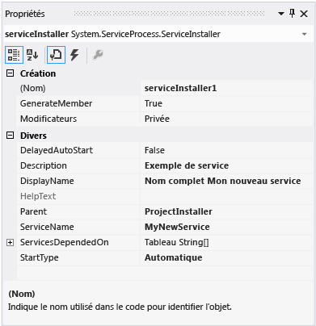

# <a name="walkthrough-creating-a-windows-service-application-in-the-component-designer"></a>Procédure pas à pas : création d'une application de service Windows dans le Concepteur de composants
Cet article explique comment créer, dans Visual Studio, une application de service Windows simple qui écrit des messages dans un journal des événements. La création et l'utilisation de votre service comportent les étapes de base suivantes :  
  
1.  [Création d'un service](#BK_CreateProject) à l’aide du modèle de projet **Service Windows** , puis configuration de celui-ci. Ce modèle crée une classe qui hérite de <xref:System.ServiceProcess.ServiceBase?displayProperty=nameWithType> et écrit la majeure partie du code de base du service, notamment le code servant à démarrer le service.  
  
2.  [Ajout de fonctionnalités au service](#BK_WriteCode) des procédures <xref:System.ServiceProcess.ServiceBase.OnStart%2A> et <xref:System.ServiceProcess.ServiceBase.OnStop%2A> , puis substitution de toute autre méthode que vous souhaitez redéfinir.  
  
3.  [Définition de l'état du service](#BK_SetStatus). Par défaut, les services créés avec <xref:System.ServiceProcess.ServiceBase?displayProperty=nameWithType> implémentent uniquement un sous-ensemble des indicateurs d'état disponibles. Si le démarrage, l'interruption ou l'arrêt de votre service est long, vous pouvez implémenter des valeurs d'état telles que Démarrer Suspendre ou Arrêter Suspendre pour indiquer qu'il est en train de travailler sur une opération.  
  
4.  [Ajout de programmes d'installation pour le service](#BK_AddInstallers) pour votre application de service.  
  
5.  (Facultatif) [Définition de paramètres de démarrage](#BK_StartupParameters), spécification des arguments de démarrage par défaut, puis octroi aux utilisateurs de l’autorisation de remplacer les paramètres par défaut quand ils démarrent manuellement votre service.  
  
6.  [Génération du service](#BK_Build).  
  
7.  [Installation du service](#BK_Install) sur l’ordinateur local.  
  
8.  Accès au Gestionnaire de contrôle des services Windows et [Démarrage et exécution du service](#BK_StartService).  
  
9. [Désinstallation d'un service Windows](#BK_Uninstall).  
  
> [!WARNING]
>  Le modèle de projet Services Windows requis pour cette procédure pas-à-pas n'est pas disponible dans l'édition Express de Visual Studio.  
  
 [!INCLUDE[note_settings_general](../../../includes/note-settings-general-md.md)]  
  
<a name="BK_CreateProject"></a>   
## <a name="creating-a-service"></a>Création d'un service  
 Pour commencer, créez votre projet et définissez les valeurs nécessaires au fonctionnement correct du service.  
  
#### <a name="to-create-and-configure-your-service"></a>Pour créer et configurer votre service  
  
1.  Dans Visual Studio, dans la barre de menus, choisissez **Fichier**, **Nouveau**, puis **Projet**.  
  
     La boîte de dialogue **Nouveau projet** s'affiche.  
  
2.  Dans la liste des modèles de projet Visual Basic ou Visual C#, choisissez **Service Windows**, puis nommez le projet **MyNewService**. Cliquez sur **OK**.  
  
     Le modèle de projet ajoute automatiquement une classe Component appelée `Service1` qui hérite de <xref:System.ServiceProcess.ServiceBase?displayProperty=nameWithType>.  
  
3.  Dans le menu **Modifier** , choisissez **Rechercher et remplacer**, **Rechercher dans les fichiers** (clavier : Ctrl+Maj+F). Remplacez toutes les occurrences de `Service1` par `MyNewService`. Vous en trouverez des instances dans Service1.cs, Program.cs et Service1.Designer.cs (ou leurs équivalents .vb).  
  
4.  Dans la fenêtre **Propriétés** de **Service1.cs [Conception]** ou **Service1.vb [Conception]**, affectez à <xref:System.ServiceProcess.ServiceBase.ServiceName%2A> et à la propriété **(Name)** de `Service1` la valeur **MyNewService**, si elle n’est pas encore définie.  
  
5.  Dans l'Explorateur de solutions, renommez **Service1.cs** en **MyNewService.cs**, ou **Service1.vb** en **MyNewService.vb**.  
  
<a name="BK_WriteCode"></a>   
## <a name="adding-features-to-the-service"></a>Ajout de fonctionnalités au service  
 Dans cette section, vous ajoutez un journal des événements personnalisé au service Windows. Les journaux des événements ne sont en aucune façon associés aux services Windows. Dans ce cas-ci, le composant <xref:System.Diagnostics.EventLog> est utilisé comme un exemple du type de composants que vous pouvez ajouter à un service Windows.  
  
#### <a name="to-add-custom-event-log-functionality-to-your-service"></a>Pour ajouter une fonctionnalité de journal des événements personnalisé à votre service  
  
1.  Dans l' **Explorateur de solutions**, ouvrez le menu contextuel pour **MyNewService.cs** ou **MyNewService.vb**, puis choisissez **Concepteur de vues**.  
  
2.  À partir de la section **Composants** de la **boîte à outils**, faites glisser un composant <xref:System.Diagnostics.EventLog> jusqu'au concepteur.  
  
3.  Dans l' **Explorateur de solutions**, ouvrez le menu contextuel pour **MyNewService.cs** ou **MyNewService.vb**, puis choisissez **Afficher le code**.  
  
4.  Ajoutez une déclaration de l'objet **eventLog** dans la classe `MyNewService` , juste après la ligne qui déclare la variable `components` :  
  
     [!code-csharp[VbRadconService#16](../../../samples/snippets/csharp/VS_Snippets_VBCSharp/VbRadconService/CS/MyNewService.cs#16)]
     [!code-vb[VbRadconService#16](../../../samples/snippets/visualbasic/VS_Snippets_VBCSharp/VbRadconService/VB/MyNewService.vb#16)]  
  
5.  Ajoutez ou modifiez le constructeur pour définir un journal des événements personnalisé :  
  
     [!code-csharp[VbRadconService#2](../../../samples/snippets/csharp/VS_Snippets_VBCSharp/VbRadconService/CS/MyNewService.cs#2)]
     [!code-vb[VbRadconService#2](../../../samples/snippets/visualbasic/VS_Snippets_VBCSharp/VbRadconService/VB/MyNewService.vb#2)]  
  
#### <a name="to-define-what-occurs-when-the-service-starts"></a>Pour définir les actions à effectuer lors du démarrage du service  
  
-   Dans l'éditeur de code, localisez la méthode <xref:System.ServiceProcess.ServiceBase.OnStart%2A> qui a été automatiquement substituée lorsque vous avez créé le projet, puis remplacez le code par ce qui suit. Cette opération ajoute une entrée dans le journal des événements lorsque le service commence à s'exécuter :  
  
     [!code-csharp[VbRadconService#3](../../../samples/snippets/csharp/VS_Snippets_VBCSharp/VbRadconService/CS/MyNewService.cs#3)]
     [!code-vb[VbRadconService#3](../../../samples/snippets/visualbasic/VS_Snippets_VBCSharp/VbRadconService/VB/MyNewService.vb#3)]  
  
     Une application de service est conçue pour s'exécuter sur une longue durée, et elle interroge ou surveille généralement quelque chose dans le système. La surveillance est configurée dans la méthode <xref:System.ServiceProcess.ServiceBase.OnStart%2A> . Toutefois, la méthode <xref:System.ServiceProcess.ServiceBase.OnStart%2A> n'effectue pas elle-même la surveillance. La méthode <xref:System.ServiceProcess.ServiceBase.OnStart%2A> doit retourner au système d'exploitation dès que le service est en cours d'exécution. Elle ne doit pas s'exécuter indéfiniment en boucle ni se bloquer. Pour définir un mécanisme d'interrogation simple, vous pouvez utiliser le composant <xref:System.Timers.Timer?displayProperty=nameWithType> comme suit : dans la méthode <xref:System.ServiceProcess.ServiceBase.OnStart%2A>, définissez des paramètres sur le composant, puis affectez à la propriété <xref:System.Timers.Timer.Enabled%2A> la valeur `true`. La minuterie déclenche périodiquement des événements dans votre code, lesquels indiquent au service qu'il peut effectuer son analyse. Pour cela, vous pouvez utiliser le code suivant :  
  
    ```csharp  
    // Set up a timer to trigger every minute.  
    System.Timers.Timer timer = new System.Timers.Timer();  
    timer.Interval = 60000; // 60 seconds  
    timer.Elapsed += new System.Timers.ElapsedEventHandler(this.OnTimer);  
    timer.Start();  
    ```  
  
    ```vb  
    ' Set up a timer to trigger every minute.  
    Dim timer As System.Timers.Timer = New System.Timers.Timer()  
    timer.Interval = 60000 ' 60 seconds  
    AddHandler timer.Elapsed, AddressOf Me.OnTimer  
    timer.Start()  
    ```  
     Ajoutez une variable membre à la classe. Il contient l’identificateur de l’événement suivant à écrire dans le journal des événements.

    ```csharp
    private int eventId = 1;
    ```

    ```vb
    Private eventId As Integer = 1
    ```

     Ajoutez du code pour gérer l'événement du minuteur :  
  
    ```csharp  
    public void OnTimer(object sender, System.Timers.ElapsedEventArgs args)  
    {  
        // TODO: Insert monitoring activities here.  
        eventLog1.WriteEntry("Monitoring the System", EventLogEntryType.Information, eventId++);  
    }  
    ```  
  
    ```vb  
    Private Sub OnTimer(sender As Object, e As Timers.ElapsedEventArgs)  
        ' TODO: Insert monitoring activities here.  
        eventLog1.WriteEntry("Monitoring the System", EventLogEntryType.Information, eventId)  
        eventId = eventId + 1  
    End Sub  
    ```  
  
     Vous pouvez effectuer des tâches à l'aide de threads de travail en arrière-plan au lieu d'exécuter l'ensemble de votre travail sur le thread principal. Pour obtenir un exemple de cette opération, consultez la page de référence <xref:System.ServiceProcess.ServiceBase?displayProperty=nameWithType>.  
  
#### <a name="to-define-what-occurs-when-the-service-is-stopped"></a>Pour définir les actions à effectuer lors de l'arrêt du service  
  
-   Remplacez le code de la méthode <xref:System.ServiceProcess.ServiceBase.OnStop%2A> par le code suivant. Cette opération ajoute une entrée dans le journal des événements lorsque le service est arrêté :  
  
     [!code-csharp[VbRadconService#4](../../../samples/snippets/csharp/VS_Snippets_VBCSharp/VbRadconService/CS/MyNewService.cs#4)]
     [!code-vb[VbRadconService#4](../../../samples/snippets/visualbasic/VS_Snippets_VBCSharp/VbRadconService/VB/MyNewService.vb#4)]  
  
 Dans la section suivante, vous pouvez substituer les méthodes <xref:System.ServiceProcess.ServiceBase.OnPause%2A>, <xref:System.ServiceProcess.ServiceBase.OnContinue%2A>et <xref:System.ServiceProcess.ServiceBase.OnShutdown%2A> pour définir un traitement supplémentaire pour votre composant.  
  
#### <a name="to-define-other-actions-for-the-service"></a>Pour définir d'autres actions du service  
  
-   Localisez la méthode à gérer, puis substituez-la pour définir ce qui doit se produire.  
  
     Le code suivant montre comment substituer la méthode <xref:System.ServiceProcess.ServiceBase.OnContinue%2A> :  
  
     [!code-csharp[VbRadconService#5](../../../samples/snippets/csharp/VS_Snippets_VBCSharp/VbRadconService/CS/MyNewService.cs#5)]
     [!code-vb[VbRadconService#5](../../../samples/snippets/visualbasic/VS_Snippets_VBCSharp/VbRadconService/VB/MyNewService.vb#5)]  
  
 Certaines actions personnalisées doivent se produire lorsqu'un service Windows est installé par la classe <xref:System.Configuration.Install.Installer> . Visual Studio peut créer ces programmes d'installation spécialement pour un service Windows et les ajouter à votre projet.  
  
<a name="BK_SetStatus"></a>   
## <a name="setting-service-status"></a>Définition de l'état du service  
 Les services indiquent leur état au Gestionnaire de contrôle des services. Les utilisateurs peuvent ainsi déterminer si un service fonctionne correctement. Par défaut, les services qui héritent de <xref:System.ServiceProcess.ServiceBase> indiquent un ensemble limité de paramètres d'état, notamment Arrêté, Suspendu et En cours d'exécution. Si le démarrage d'un service prend un peu de temps, il peut être utile de signaler un état Démarrer Suspendre. Vous pouvez également implémenter les paramètres d’état Démarrer Suspendre et Arrêter Suspendre en ajoutant du code qui appelle la [fonction SetServiceStatus](http://msdn.microsoft.com/library/windows/desktop/ms686241.aspx)Windows.  
  
#### <a name="to-implement-service-pending-status"></a>Pour implémenter l'état de service suspendu  
  
1.  Ajoutez une instruction `using` ou une déclaration `Imports` à l'espace de noms <xref:System.Runtime.InteropServices?displayProperty=nameWithType> dans le fichier MyNewService.cs ou MyNewService.vb :  
  
    ```csharp  
    using System.Runtime.InteropServices;  
    ```  
  
    ```vb  
    Imports System.Runtime.InteropServices  
    ```  
  
2.  Ajoutez le code suivant dans MyNewService.cs pour déclarer les valeurs `ServiceState` et ajouter une structure pour l'état. Vous utiliserez cette structure dans un appel de code non managé :  
  
    ```csharp  
    public enum ServiceState  
      {  
          SERVICE_STOPPED = 0x00000001,  
          SERVICE_START_PENDING = 0x00000002,  
          SERVICE_STOP_PENDING = 0x00000003,  
          SERVICE_RUNNING = 0x00000004,  
          SERVICE_CONTINUE_PENDING = 0x00000005,  
          SERVICE_PAUSE_PENDING = 0x00000006,  
          SERVICE_PAUSED = 0x00000007,  
      }  
  
      [StructLayout(LayoutKind.Sequential)]  
      public struct ServiceStatus  
      {  
          public int dwServiceType;  
          public ServiceState dwCurrentState;  
          public int dwControlsAccepted;  
          public int dwWin32ExitCode;  
          public int dwServiceSpecificExitCode;  
          public int dwCheckPoint;  
          public int dwWaitHint;  
      };  
    ```  
  
    ```vb  
    Public Enum ServiceState  
        SERVICE_STOPPED = 1  
        SERVICE_START_PENDING = 2  
        SERVICE_STOP_PENDING = 3  
        SERVICE_RUNNING = 4  
        SERVICE_CONTINUE_PENDING = 5  
        SERVICE_PAUSE_PENDING = 6  
        SERVICE_PAUSED = 7  
    End Enum  
  
    <StructLayout(LayoutKind.Sequential)>  
    Public Structure ServiceStatus  
        Public dwServiceType As Long  
        Public dwCurrentState As ServiceState  
        Public dwControlsAccepted As Long  
        Public dwWin32ExitCode As Long  
        Public dwServiceSpecificExitCode As Long  
        Public dwCheckPoint As Long  
        Public dwWaitHint As Long  
    End Structure  
    ```  
  
3.  À présent, dans la classe `MyNewService` , déclarez la [fonction SetServiceStatus](http://msdn.microsoft.com/library/windows/desktop/ms686241.aspx) à l’aide d’un appel de plateforme :  
  
    ```csharp  
    [DllImport("advapi32.dll", SetLastError=true)]  
            private static extern bool SetServiceStatus(IntPtr handle, ref ServiceStatus serviceStatus);  
    ```  
  
    ```vb  
    Declare Auto Function SetServiceStatus Lib "advapi32.dll" (ByVal handle As IntPtr, ByRef serviceStatus As ServiceStatus) As Boolean  
    ```  
  
4.  Pour implémenter l'état Démarrer Suspendre, ajoutez le code suivant au début de la méthode <xref:System.ServiceProcess.ServiceBase.OnStart%2A> :  
  
    ```csharp  
    // Update the service state to Start Pending.  
    ServiceStatus serviceStatus = new ServiceStatus();  
    serviceStatus.dwCurrentState = ServiceState.SERVICE_START_PENDING;  
    serviceStatus.dwWaitHint = 100000;  
    SetServiceStatus(this.ServiceHandle, ref serviceStatus);  
    ```  
  
    ```vb  
    ' Update the service state to Start Pending.  
    Dim serviceStatus As ServiceStatus = New ServiceStatus()  
    serviceStatus.dwCurrentState = ServiceState.SERVICE_START_PENDING  
    serviceStatus.dwWaitHint = 100000  
    SetServiceStatus(Me.ServiceHandle, serviceStatus)  
    ```  
  
5.  Ajoutez du code pour définir l'état En cours d'exécution à la fin de la méthode <xref:System.ServiceProcess.ServiceBase.OnStart%2A> .  
  
    ```csharp
    // Update the service state to Running.  
    serviceStatus.dwCurrentState = ServiceState.SERVICE_RUNNING;  
    SetServiceStatus(this.ServiceHandle, ref serviceStatus);  
    ```  
  
    ```vb  
    ' Update the service state to Running.  
    serviceStatus.dwCurrentState = ServiceState.SERVICE_RUNNING  
    SetServiceStatus(Me.ServiceHandle, serviceStatus)  
    ```  
  
6.  (Facultatif) Répétez cette procédure pour la méthode <xref:System.ServiceProcess.ServiceBase.OnStop%2A> .  
  
> [!CAUTION]
>  La boîte de dialogue [Gestionnaire de contrôle des services](http://msdn.microsoft.com/library/windows/desktop/ms685150.aspx) utilise les membres `dwWaitHint` et `dwCheckpoint` de la [structure SERVICE_STATUS](http://msdn.microsoft.com/library/windows/desktop/ms685996.aspx) pour déterminer le délai d’attente avant le démarrage ou l’arrêt d’un service Windows. Si l’exécution de vos méthodes <xref:System.ServiceProcess.ServiceBase.OnStart%2A> et <xref:System.ServiceProcess.ServiceBase.OnStop%2A> est longue, votre service peut demander plus de temps en appelant à nouveau [SetServiceStatus](http://msdn.microsoft.com/library/windows/desktop/ms686241.aspx) avec une valeur `dwCheckPoint` incrémentée.  
  
<a name="BK_AddInstallers"></a>   
## <a name="adding-installers-to-the-service"></a>Ajout de programmes d'installation pour le service  
 Avant de pouvoir exécuter un service Windows, vous devez l'installer, ce qui l'inscrit auprès du Gestionnaire de contrôle des services. Vous pouvez ajouter à votre projet des programmes d'installation qui gèrent les détails de l'inscription.  
  
#### <a name="to-create-the-installers-for-your-service"></a>Pour créer les programmes d'installation de votre service  
  
1.  Dans l' **Explorateur de solutions**, ouvrez le menu contextuel pour **MyNewService.cs** ou **MyNewService.vb**, puis choisissez **Concepteur de vues**.  
  
2.  Cliquez sur l'arrière-plan du concepteur pour sélectionner le service lui-même plutôt que son contenu.  
  
3.  Ouvrez le menu contextuel de la fenêtre du concepteur (si vous utilisez un dispositif de pointage, cliquez avec le bouton droit à l'intérieur de la fenêtre), puis choisissez **Ajouter le programme d'installation**.  
  
     Par défaut, une classe Component comprenant deux programmes d'installation est ajoutée à votre projet. Le composant est appelé **ProjectInstaller**et contient le programme d'installation de votre service ainsi que le programme d'installation du processus associé au service.  
  
4.  En mode **Design** pour **ProjectInstaller**, choisissez **serviceInstaller1** pour un projet Visual C# ou **ServiceInstaller1** pour un projet Visual Basic.  
  
5.  Dans la fenêtre **Propriétés** , vérifiez que la propriété <xref:System.ServiceProcess.ServiceInstaller.ServiceName%2A> a la valeur **MyNewService**.  
  
6.  Affectez à la propriété **Description** du texte, par exemple « Un exemple de service ». Ce texte, qui s'affiche dans la fenêtre Services, permet à l'utilisateur d'identifier le service et de comprendre son utilité.  
  
7.  Affectez à la propriété <xref:System.ServiceProcess.ServiceInstaller.DisplayName%2A> le texte à afficher dans la colonne **Nom** de la fenêtre Services. Par exemple, vous pouvez entrer « Nom complet de MyNewService ». Ce nom peut être différent de la propriété <xref:System.ServiceProcess.ServiceInstaller.ServiceName%2A> , qui est le nom utilisé par le système (par exemple, lorsque vous utilisez la commande `net start` pour démarrer votre service).  
  
8.  Affectez à la propriété <xref:System.ServiceProcess.ServiceInstaller.StartType%2A> la valeur <xref:System.ServiceProcess.ServiceStartMode.Automatic>.  
  
       
  
9. Dans le concepteur, choisissez **serviceProcessInstaller1** pour un projet Visual C# ou **ServiceProcessInstaller1** pour un projet Visual Basic. Affectez à la propriété <xref:System.ServiceProcess.ServiceProcessInstaller.Account%2A> la valeur <xref:System.ServiceProcess.ServiceAccount.LocalSystem>. Le service sera ainsi installé et exécuté sous un compte de services local.  
  
    > [!IMPORTANT]
    >  Le compte <xref:System.ServiceProcess.ServiceAccount.LocalSystem> dispose d'autorisations générales, y compris la possibilité d'écrire dans le journal des événements. Utilisez ce compte avec précaution car il peut augmenter le risque d'attaques par des logiciels malveillants. Pour les autres tâches, utilisez le compte <xref:System.ServiceProcess.ServiceAccount.LocalService>, qui se comporte comme un utilisateur non privilégié de l'ordinateur local et présente des informations d'identification anonymes à tout serveur distant. Cet exemple échoue si vous essayez d'utiliser le compte <xref:System.ServiceProcess.ServiceAccount.LocalService>, car il doit disposer d'une autorisation pour écrire dans le journal des événements.  
  
     Pour plus d’informations sur les programmes d’installation, consultez [How to: Add Installers to Your Service Application](../../../docs/framework/windows-services/how-to-add-installers-to-your-service-application.md).  
  
<a name="BK_StartupParameters"></a>   
## <a name="set-startup-parameters"></a>Définition de paramètres de démarrage  
 Un service Windows, comme tout autre fichier exécutable, peut accepter des arguments de ligne de commande ou des paramètres de démarrage. Lorsque vous ajoutez du code pour traiter les paramètres de démarrage, les utilisateurs peuvent démarrer votre service avec leurs propres paramètres de démarrage personnalisés à l'aide de la fenêtre Services du panneau de configuration Windows. Toutefois, ces paramètres de démarrage ne sont pas persistants lors du prochain démarrage du service. Pour définir les paramètres de démarrage de façon permanente, vous pouvez les définir dans le Registre, comme indiqué dans la procédure suivante.  
  
> [!NOTE]
>  Avant de décider d'ajouter des paramètres de démarrage, vous devez déterminer si c'est le meilleur moyen de passer des informations à votre service. Les paramètres de démarrage sont faciles à utiliser et à analyser, et les utilisateurs peuvent facilement les substituer. Il peut toutefois être plus difficile pour les utilisateurs de les détecter et de les utiliser sans documentation. En général, si votre service nécessite seulement quelques paramètres de démarrage, vous devez envisager d'utiliser plutôt le Registre ou un fichier de configuration. Tous les services Windows ont une entrée dans le Registre, sous HKLM\System\CurrentControlSet\services. Sous la clé du service, vous pouvez utiliser la sous-clé **Parameters** pour stocker les informations auxquelles votre service peut accéder. Vous pouvez utiliser des fichiers de configuration d'application pour un service Windows de la même façon que vous le faites pour les autres types de programmes. Pour obtenir un exemple de code, consultez <xref:System.Configuration.ConfigurationManager.AppSettings%2A>.  
  
#### <a name="adding-startup-parameters"></a>Ajout de paramètres de démarrage  
  
1.  Dans la méthode `Main` dans Program.cs ou MyNewService.Designer.vb, ajoutez un argument pour la ligne de commande :  
  
```csharp  
static void Main(string[] args)
{
    ServiceBase[] ServicesToRun = new ServiceBase[] { new MyNewService(args) };
    ServiceBase.Run(ServicesToRun);
}
```  
  
```vb
Shared Sub Main(ByVal cmdArgs() As String)
    Dim ServicesToRun() As System.ServiceProcess.ServiceBase = New System.ServiceProcess.ServiceBase() {New MyNewServiceVB(cmdArgs)}
    System.ServiceProcess.ServiceBase.Run(ServicesToRun)
End Sub
```  
  
2.  Modifiez le constructeur `MyNewService` comme suit :  
  
```csharp  
public MyNewService(string[] args)
{
    InitializeComponent();
    string eventSourceName = "MySource";
    string logName = "MyNewLog";
    if (args.Count() > 0) 
    {
        eventSourceName = args[0];
    }
    if (args.Count() > 1)
    {
        logName = args[1];
    }
    eventLog1 = new System.Diagnostics.EventLog();
    if (!System.Diagnostics.EventLog.SourceExists(eventSourceName))
    {
        System.Diagnostics.EventLog.CreateEventSource(eventSourceName, logName);
    }
    eventLog1.Source = eventSourceName;
    eventLog1.Log = logName;        
}
```  
  
```vb  
Public Sub New(ByVal cmdArgs() As String)
    InitializeComponent()
    Dim eventSourceName As String = "MySource"
    Dim logName As String = "MyNewLog"
    If (cmdArgs.Count() > 0) Then
        eventSourceName = cmdArgs(0)
    End If
    If (cmdArgs.Count() > 1) Then
        logName = cmdArgs(1)
    End If
    eventLog1 = New System.Diagnostics.EventLog()
    If (Not System.Diagnostics.EventLog.SourceExists(eventSourceName)) Then
        System.Diagnostics.EventLog.CreateEventSource(eventSourceName, logName)
    End If
    eventLog1.Source = eventSourceName
    eventLog1.Log = logName
End Sub  
```  
  
Ce code définit la source d'événement et le nom du journal en fonction des paramètres de démarrage fournis, ou utilise les valeurs par défaut si aucun argument n'est fourni.  
  
3. Pour spécifier les arguments de ligne de commande, ajoutez le code suivant à la classe `ProjectInstaller` dans ProjectInstaller.cs ou ProjectInstaller.vb :  
  
```csharp  
protected override void OnBeforeInstall(IDictionary savedState)
{
    string parameter = "MySource1\" \"MyLogFile1";
    Context.Parameters["assemblypath"] = "\"" + Context.Parameters["assemblypath"] + "\" \"" + parameter + "\"";
    base.OnBeforeInstall(savedState);
}
```

```vb  
Protected Overrides Sub OnBeforeInstall(ByVal savedState As IDictionary)
    Dim parameter As String = "MySource1"" ""MyLogFile1"
    Context.Parameters("assemblypath") = """" + Context.Parameters("assemblypath") + """ """ + parameter + """"
    MyBase.OnBeforeInstall(savedState)
End Sub  
```  
  
Ce code modifie la clé de Registre **ImagePath** qui contient généralement le chemin d'accès complet au fichier exécutable du service Windows, en ajoutant les valeurs de paramètres par défaut. Les guillemets autour du chemin d'accès (et autour de chaque paramètre individuel) sont nécessaires pour que le service démarre correctement. Pour modifier les paramètres de démarrage de ce service Windows, les utilisateurs peuvent modifier les paramètres indiqués dans la clé de Registre **ImagePath** . La meilleure méthode consiste toutefois à la modifier par programmation et à exposer les fonctionnalités aux utilisateurs d'une manière conviviale (par exemple dans un utilitaire de gestion ou de configuration).  
  
<a name="BK_Build"></a>   
## <a name="building-the-service"></a>Génération du service  
  
#### <a name="to-build-your-service-project"></a>Pour générer votre projet de service  
  
1.  Dans l' **Explorateur de solutions**, ouvrez le menu contextuel de votre projet, puis choisissez **Propriétés**. Les pages de propriétés de votre projet s'affichent.  
  
2.  Dans la liste **Objet de démarrage** de l'onglet Application, choisissez **MyNewService.Program**.  
  
3.  Dans l' **Explorateur de solutions**, ouvrez le menu contextuel de votre projet, puis choisissez **Générer** pour générer le projet (clavier : Ctrl+Maj+G).  
  
<a name="BK_Install"></a>   
## <a name="installing-the-service"></a>Installation du service  
 Maintenant que vous avez généré le service Windows, vous pouvez l'installer. Pour installer un service Windows, vous devez disposer d'informations d'identification d'administration sur l'ordinateur sur lequel vous l'installez.  
  
#### <a name="to-install-a-windows-service"></a>Pour installer un service Windows  
  
1.  Dans Windows 7 et Windows Server, ouvrez l' **invite de commandes développeur** sous **Visual Studio Tools** dans le menu **Démarrer** . Dans Windows 8 ou Windows 8.1, choisissez la vignette **Visual Studio Tools** de l'écran d' **accueil** , et puis exécutez l'invite de commandes développeur avec des informations d'identification administratives. (Si vous utilisez une souris, cliquez avec le bouton droit sur **Invite de commandes développeur**, puis choisissez **Exécuter en tant qu'administrateur**.)  
  
2.  Dans la fenêtre d'invite de commandes, accédez au dossier qui contient la sortie de votre projet. Par exemple, dans votre dossier Mes documents, accédez à Visual Studio 2013\Projects\MyNewService\bin\Debug.  
  
3.  Entrez la commande suivante :  
  
    ```  
    installutil.exe MyNewService.exe  
    ```  
  
     Si le service est installé correctement, le fichier installutil.exe le signale. Si le système n'a pas trouvé InstallUtil.exe, vérifiez qu'il existe sur votre ordinateur. Cet outil est installé avec le .NET Framework dans le dossier `%WINDIR%\Microsoft.NET\Framework[64]\`*version_framework*. Par exemple, le chemin d'accès par défaut de la version 32 bits de .NET Framework 4, 4.5, 4.5.1 et 4.5.2 est `C:\Windows\Microsoft.NET\Framework\v4.0.30319\InstallUtil.exe`.  
  
     Si le processus installutil.exe signale un échec, examinez le journal d’installation pour en connaître la raison. Par défaut, le journal se trouve dans le même dossier que l’exécutable du service. L’installation peut échouer si le <xref:System.ComponentModel.RunInstallerAttribute> classe n’est pas présent sur le `ProjectInstaller` classe, sans quoi l’attribut n’est pas défini sur `true`, sans quoi la `ProjectInstaller` classe n’est pas `public`.  
  
     Pour plus d'informations, consultez [How to: Install and Uninstall Services](../../../docs/framework/windows-services/how-to-install-and-uninstall-services.md).  
  
<a name="BK_StartService"></a>   
## <a name="starting-and-running-the-service"></a>Démarrage et exécution du service  
  
#### <a name="to-start-and-stop-your-service"></a>Pour démarrer et arrêter le service  
  
1.  Dans Windows, ouvrez l’écran d’ **accueil** ou le menu **Démarrer** , puis tapez `services.msc`.  
  
     Vous devez maintenant voir **MyNewService** affiché dans la fenêtre **Services** .  
  
     ![MyNewService dans la fenêtre Services. ] (../../../docs/framework/windows-services/media/windowsservices-serviceswindow.PNG "WindowsServices_ServicesWindow")  
  
2.  Dans la fenêtre **Services** , ouvrez le menu contextuel de votre service, puis choisissez **Démarrer**.  
  
3.  Ouvrez le menu contextuel du service, puis choisissez **Arrêter**.  
  
4.  (Facultatif) À partir de la ligne de commande, vous pouvez utiliser les commandes `net start``ServiceName` et `net stop``ServiceName` pour démarrer et arrêter votre service.  
  
#### <a name="to-verify-the-event-log-output-of-your-service"></a>Pour vérifier la sortie du journal des événements de votre service  
  
1.  Dans Visual Studio, ouvrez l' **Explorateur de serveurs** (clavier : Ctrl+Alt+S), puis accédez au nœud **Journaux des événements** de l'ordinateur local.  
  
2.  Recherchez le nom **MyNewLog** (ou **MyLogFile1**, si vous avez utilisé la procédure facultative pour ajouter des arguments de ligne de commande) dans la liste, puis développez-le. Vous devez voir des entrées relatives aux deux actions (démarrage et arrêt) que votre service a effectuées.  
  
     ![Utilisez l’Observateur d’événements pour voir les entrées de journal des événements. ] (../../../docs/framework/windows-services/media/windowsservices-eventviewer.PNG "WindowsServices_EventViewer")  
  
<a name="BK_Uninstall"></a>   
## <a name="uninstalling-a-windows-service"></a>Désinstallation d'un service Windows  
  
#### <a name="to-uninstall-your-service"></a>Pour désinstaller votre service  
  
1.  Ouvrez une invite de commandes développeur avec des informations d'identification administratives.  
  
2.  Dans la fenêtre d'invite de commandes, accédez au dossier qui contient la sortie de votre projet. Par exemple, dans votre dossier Mes documents, accédez à Visual Studio 2013\Projects\MyNewService\bin\Debug.  
  
3.  Entrez la commande suivante :  
  
    ```  
    installutil.exe /u MyNewService.exe  
    ```  
  
     Si le service est désinstallé avec succès, installutil.exe le signale. Pour plus d'informations, consultez [How to: Install and Uninstall Services](../../../docs/framework/windows-services/how-to-install-and-uninstall-services.md).  
  
## <a name="next-steps"></a>Étapes suivantes  
 Vous pouvez créer un programme d'installation autonome que d'autres peuvent utiliser pour installer votre service Windows, mais cette opération nécessite des étapes supplémentaires. ClickOnce ne prend pas en charge les services Windows, vous ne pouvez donc pas utiliser l'Assistant Publication. Vous pouvez utiliser une version complète d'InstallShield, non fournie par Microsoft. Pour plus d’informations sur InstallShield, consultez [InstallShield Limited Edition](/visualstudio/deployment/installshield-limited-edition). Vous pouvez également utiliser [Windows Installer XML Toolset](http://go.microsoft.com/fwlink/?LinkId=249067) pour créer un programme d’installation pour un service Windows.  
  
 Vous pouvez également opter pour l'utilisation d'un composant <xref:System.ServiceProcess.ServiceController> , ce qui vous permet d'envoyer des commandes au service que vous avez installé.  
  
 Vous pouvez utiliser un programme d'installation pour créer un journal des événements lors de l'installation de l'application plutôt que lors de son exécution. En outre, le journal des événements sera supprimé par le programme d'installation lors de la désinstallation de l'application. Pour plus d'informations, consultez la page de référence relative à <xref:System.Diagnostics.EventLogInstaller> .  
  
## <a name="see-also"></a>Voir aussi  
 [Applications de service Windows](../../../docs/framework/windows-services/index.md)  
 [Introduction aux applications de service Windows](../../../docs/framework/windows-services/introduction-to-windows-service-applications.md)  
 [Guide pratique pour déboguer les applications de service Windows](../../../docs/framework/windows-services/how-to-debug-windows-service-applications.md)  
 [Services (Windows)](http://msdn.microsoft.com/library/windows/desktop/ms685141.aspx)
