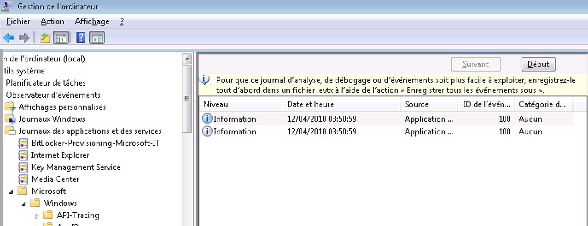

# <a name="configuring-tracking-for-a-workflow"></a><span data-ttu-id="e7370-102">Configuration du suivi d'un workflow</span><span class="sxs-lookup"><span data-stu-id="e7370-102">Configuring Tracking for a Workflow</span></span>
<span data-ttu-id="e7370-103">Un workflow peut s'exécuter de trois façons :</span><span class="sxs-lookup"><span data-stu-id="e7370-103">A workflow can execute in three ways:</span></span>  
  
-   <span data-ttu-id="e7370-104">Hébergé dans <xref:System.ServiceModel.Activities.WorkflowServiceHost></span><span class="sxs-lookup"><span data-stu-id="e7370-104">Hosted in <xref:System.ServiceModel.Activities.WorkflowServiceHost></span></span>  
  
-   <span data-ttu-id="e7370-105">Exécuté en tant que <xref:System.Activities.WorkflowApplication></span><span class="sxs-lookup"><span data-stu-id="e7370-105">Executed as a <xref:System.Activities.WorkflowApplication></span></span>  
  
-   <span data-ttu-id="e7370-106">Exécuté directement à l'aide de <xref:System.Activities.WorkflowInvoker></span><span class="sxs-lookup"><span data-stu-id="e7370-106">Executed directly using <xref:System.Activities.WorkflowInvoker></span></span>  
  
 <span data-ttu-id="e7370-107">En fonction de l'option d'hébergement du workflow, un participant de suivi peut être ajouté soit via du code, soit via un fichier de configuration.</span><span class="sxs-lookup"><span data-stu-id="e7370-107">Depending on the workflow hosting option, a tracking participant can be added either through code or through a configuration file.</span></span> <span data-ttu-id="e7370-108">Cette rubrique explique comment le suivi est configuré en ajoutant un participant de suivi à un <xref:System.Activities.WorkflowApplication> et à un <xref:System.ServiceModel.Activities.WorkflowServiceHost>, et comment activer le suivi lorsque vous utilisez <xref:System.Activities.WorkflowInvoker>.</span><span class="sxs-lookup"><span data-stu-id="e7370-108">This topic describes how tracking is configured by adding a tracking participant to a <xref:System.Activities.WorkflowApplication> and to a <xref:System.ServiceModel.Activities.WorkflowServiceHost>, and how to enable tracking when using <xref:System.Activities.WorkflowInvoker>.</span></span>  
  
## <a name="configuring-workflow-application-tracking"></a><span data-ttu-id="e7370-109">Configuration du suivi d'application de workflow</span><span class="sxs-lookup"><span data-stu-id="e7370-109">Configuring Workflow Application Tracking</span></span>  
 <span data-ttu-id="e7370-110">Un workflow peut s'exécuter à l'aide de la classe <xref:System.Activities.WorkflowApplication>.</span><span class="sxs-lookup"><span data-stu-id="e7370-110">A workflow can run using the <xref:System.Activities.WorkflowApplication> class.</span></span> <span data-ttu-id="e7370-111">Cette rubrique montre comment le suivi est configuré pour une application de workflow [!INCLUDE[netfx_current_long](../../../includes/netfx-current-long-md.md)] en ajoutant un participant de suivi à l'hôte du workflow <xref:System.Activities.WorkflowApplication>.</span><span class="sxs-lookup"><span data-stu-id="e7370-111">This topic demonstrates how tracking is configured for a [!INCLUDE[netfx_current_long](../../../includes/netfx-current-long-md.md)] workflow application by adding a tracking participant to the <xref:System.Activities.WorkflowApplication> workflow host.</span></span> <span data-ttu-id="e7370-112">Dans ce cas, le workflow s'exécute comme une application de workflow.</span><span class="sxs-lookup"><span data-stu-id="e7370-112">In this case, the workflow runs as a workflow application.</span></span> <span data-ttu-id="e7370-113">Vous configurez une application de workflow via du code (plutôt qu'à l'aide d'un fichier de configuration), qui est un fichier .exe auto-hébergé à l'aide de la classe <xref:System.Activities.WorkflowApplication>.</span><span class="sxs-lookup"><span data-stu-id="e7370-113">You configure a workflow application through code (rather than by using a configuration file), which is a self-hosted .exe file using the <xref:System.Activities.WorkflowApplication> class.</span></span> <span data-ttu-id="e7370-114">Le participant de suivi est ajouté sous forme d'extension à l'instance <xref:System.Activities.WorkflowApplication>.</span><span class="sxs-lookup"><span data-stu-id="e7370-114">The tracking participant is added as an extension to the <xref:System.Activities.WorkflowApplication> instance.</span></span> <span data-ttu-id="e7370-115">Cela est fait en ajoutant le <xref:System.Activities.Tracking.TrackingParticipant> à la collection d'extensions pour l'instance WorkflowApplication.</span><span class="sxs-lookup"><span data-stu-id="e7370-115">This is done by adding the <xref:System.Activities.Tracking.TrackingParticipant> to the extensions collection for the WorkflowApplication instance.</span></span>  
  
 <span data-ttu-id="e7370-116">Pour une application de workflow, vous pouvez ajouter l'extension de comportement <xref:System.Activities.Tracking.EtwTrackingParticipant> comme indiqué dans le code suivant.</span><span class="sxs-lookup"><span data-stu-id="e7370-116">For a workflow application, you can add the <xref:System.Activities.Tracking.EtwTrackingParticipant> behavior extension as shown in the following code.</span></span>  
  
```csharp  
LogActivity activity = new LogActivity();  
  
WorkflowApplication instance = new WorkflowApplication(activity);  
EtwTrackingParticipant trackingParticipant =  
    new EtwTrackingParticipant  
{  
  
        TrackingProfile = new TrackingProfile  
           {  
               Name = "SampleTrackingProfile",  
               ActivityDefinitionId = "ProcessOrder",  
               Queries = new WorkflowInstanceQuery  
               {  
                  States = { "*" }  
              }  
          }  
       };  
instance.Extensions.Add(trackingParticipant);  
```  
  
### <a name="configuring-workflow-service-tracking"></a><span data-ttu-id="e7370-117">Configuration du suivi de service de workflow</span><span class="sxs-lookup"><span data-stu-id="e7370-117">Configuring Workflow Service Tracking</span></span>  
 <span data-ttu-id="e7370-118">Un workflow peut être exposé en tant que service [!INCLUDE[indigo2](../../../includes/indigo2-md.md)] lorsqu'il est hébergé dans l'hôte de service <xref:System.ServiceModel.Activities.WorkflowServiceHost>.</span><span class="sxs-lookup"><span data-stu-id="e7370-118">A workflow can be exposed as a [!INCLUDE[indigo2](../../../includes/indigo2-md.md)] service when hosted in the <xref:System.ServiceModel.Activities.WorkflowServiceHost> service host.</span></span> <span data-ttu-id="e7370-119"><xref:System.ServiceModel.Activities.WorkflowServiceHost> est une implémentation spécialisée de ServiceHost .NET pour un service basé sur un workflow.</span><span class="sxs-lookup"><span data-stu-id="e7370-119"><xref:System.ServiceModel.Activities.WorkflowServiceHost> is a specialized .NET ServiceHost implementation for a workflow-based service.</span></span> <span data-ttu-id="e7370-120">Cette section explique comment configurer le suivi pour un service de workflow [!INCLUDE[netfx_current_short](../../../includes/netfx-current-short-md.md)] s'exécutant dans <xref:System.ServiceModel.Activities.WorkflowServiceHost>.</span><span class="sxs-lookup"><span data-stu-id="e7370-120">This section explains how to configure tracking for a [!INCLUDE[netfx_current_short](../../../includes/netfx-current-short-md.md)] workflow service running in <xref:System.ServiceModel.Activities.WorkflowServiceHost>.</span></span> <span data-ttu-id="e7370-121">Il est configuré via un fichier Web.config (pour un service hébergé sur le Web) ou un fichier App.config (pour un service hébergé dans une application autonome, telle qu'une application console) en spécifiant un comportement de service ou via du code en ajoutant, à la collection <xref:System.ServiceModel.Description.ServiceDescription.Behaviors%2A>, un comportement spécifique au suivi pour l'hôte de service.</span><span class="sxs-lookup"><span data-stu-id="e7370-121">It is configured through a Web.config file (for a Web-hosted service) or an App.config file (for a service hosted in a stand-alone application, such as a console application) by specifying a service behavior or through code by adding a tracking-specific behavior to the <xref:System.ServiceModel.Description.ServiceDescription.Behaviors%2A> collection for the service host.</span></span>  
  
 <span data-ttu-id="e7370-122">Pour un service de workflow hébergé dans <xref:System.ServiceModel.WorkflowServiceHost>, vous pouvez ajouter <xref:System.Activities.Tracking.EtwTrackingParticipant> à l'aide de l'élément <`behavior`> dans un fichier de configuration, comme indiqué dans l'exemple suivant.</span><span class="sxs-lookup"><span data-stu-id="e7370-122">For a workflow service hosted in <xref:System.ServiceModel.WorkflowServiceHost>, you can add the <xref:System.Activities.Tracking.EtwTrackingParticipant> using the <`behavior`> element in a configuration file, as shown in the following example.</span></span>  
  
```xml  
<behaviors>  
   <serviceBehaviors>  
        <behavior>  
          <etwTracking profileName="Sample Tracking Profile" />  
        </behavior>              
   </serviceBehaviors>  
<behaviors>  
```  
  
 <span data-ttu-id="e7370-123">Pour un service de workflow hébergé dans <xref:System.ServiceModel.WorkflowServiceHost>, vous pouvez également ajouter l'extension de comportement <xref:System.Activities.Tracking.EtwTrackingParticipant> dans le code.</span><span class="sxs-lookup"><span data-stu-id="e7370-123">Alternatively, for a workflow service hosted in <xref:System.ServiceModel.WorkflowServiceHost>, you can add the <xref:System.Activities.Tracking.EtwTrackingParticipant> behavior extension through code.</span></span> <span data-ttu-id="e7370-124">Pour ajouter un participant au suivi personnalisé, créez une extension de comportement et ajoutez-le au <xref:System.ServiceModel.ServiceHost> comme indiqué dans l'exemple de code suivant.</span><span class="sxs-lookup"><span data-stu-id="e7370-124">To add a custom tracking participant, create a new behavior extension and add it to the <xref:System.ServiceModel.ServiceHost> as shown in the following example code.</span></span>  
  
> [!NOTE]
>  <span data-ttu-id="e7370-125">Si vous souhaitez afficher l’exemple de code qui montre comment créer un élément de comportement personnalisé qui ajoute un participant de suivi personnalisé, reportez-vous à la [suivi](../../../docs/framework/windows-workflow-foundation/samples/tracking.md) exemples.</span><span class="sxs-lookup"><span data-stu-id="e7370-125">If you want to view sample code that shows how to create a custom behavior element that adds a custom tracking participant, refer to the [Tracking](../../../docs/framework/windows-workflow-foundation/samples/tracking.md) samples.</span></span>  
  
```  
ServiceHost svcHost = new ServiceHost(typeof(WorkflowService), new   
                                 Uri("http://localhost:8001/Sample"));  
EtwTrackingBehavior trackingBehavior =   
    new EtwTrackingBehavior  
    {  
        ProfileName = "Sample Tracking Profile"  
    };  
svcHost.Description.Behaviors.Add(trackingBehavior);  
svcHost.Open();  
```  
  
 <span data-ttu-id="e7370-126">Le participant au suivi est ajouté à l’hôte du service de workflow comme une extension au comportement.</span><span class="sxs-lookup"><span data-stu-id="e7370-126">The tracking participant is added to the workflow service host as an extension to the behavior.</span></span>  
  
 <span data-ttu-id="e7370-127">Cet exemple de code suivant indique comment lire un modèle de suivi de fichier de configuration.</span><span class="sxs-lookup"><span data-stu-id="e7370-127">This sample code below shows how to read a tracking profile from configuration file.</span></span>  
  
```  
TrackingProfile GetProfile(string profileName, string displayName)  
        {  
            TrackingProfile trackingProfile = null;  
            TrackingSection trackingSection = (TrackingSection)WebConfigurationManager.GetSection("system.serviceModel/tracking");  
            if (trackingSection == null)   
            {  
                return null;  
            }  
  
            if (profileName == null)   
            {  
                profileName = "";  
            }  
  
            //Find the profile with the specified profile name in the list of profile found in config  
            var match = from p in new List<TrackingProfile>(trackingSection.TrackingProfiles)  
                        where (p.Name == profileName) && ((p.ActivityDefinitionId == displayName) || (p.ActivityDefinitionId == "*"))  
                        select p;  
  
            if (match.Count() == 0)  
            {  
                //return an empty profile  
                trackingProfile = new TrackingProfile()  
                {  
                    ActivityDefinitionId = displayName  
                };  
  
            }  
            else  
            {  
                trackingProfile = match.First();  
            }  
  
            return trackingProfile;  
```  
  
 <span data-ttu-id="e7370-128">Cet exemple de code indique comment ajouter un modèle de suivi à un hôte de workflow.</span><span class="sxs-lookup"><span data-stu-id="e7370-128">This sample code shows how to add a tracking profile to a workflow host.</span></span>  
  
```  
WorkflowServiceHost workflowServiceHost = serviceHostBase as WorkflowServiceHost;  
if (null != workflowServiceHost)  
{  
              string workflowDisplayName = workflowServiceHost.Activity.DisplayName;  
               TrackingProfile trackingProfile = GetProfile(this.profileName, workflowDisplayName);  
                workflowServiceHost.WorkflowExtensions.Add(()  => new EtwTrackingParticipant  {  
               TrackingProfile = trackingProfile  
                        });  
 }  
```  
  
> [!NOTE]
>  <span data-ttu-id="e7370-129">Pour plus d’informations sur les profils de suivi, reportez-vous à [modèles de suivi](http://go.microsoft.com/fwlink/?LinkId=201310).</span><span class="sxs-lookup"><span data-stu-id="e7370-129">For more information on tracking profiles, refer to [Tracking Profiles](http://go.microsoft.com/fwlink/?LinkId=201310).</span></span>  
  
### <a name="configuring-tracking-using-workflowinvoker"></a><span data-ttu-id="e7370-130">Configuration du suivi à l'aide de WorkflowInvoker</span><span class="sxs-lookup"><span data-stu-id="e7370-130">Configuring tracking using WorkflowInvoker</span></span>  
 <span data-ttu-id="e7370-131">Pour configurer le suivi pour un workflow exécuté à l'aide de <xref:System.Activities.WorkflowInvoker>, ajoutez le fournisseur de suivi en tant qu'extension à une instance <xref:System.Activities.WorkflowInvoker>.</span><span class="sxs-lookup"><span data-stu-id="e7370-131">To configure tracking for a workflow executed using <xref:System.Activities.WorkflowInvoker>, add the tracking provider as an extension to a <xref:System.Activities.WorkflowInvoker> instance.</span></span> <span data-ttu-id="e7370-132">L’exemple de code suivant est à partir de la [suivi personnalisé](../../../docs/framework/windows-workflow-foundation/samples/custom-tracking.md) exemple.</span><span class="sxs-lookup"><span data-stu-id="e7370-132">The following code example is from the [Custom Tracking](../../../docs/framework/windows-workflow-foundation/samples/custom-tracking.md) sample.</span></span>  
  
```  
WorkflowInvoker invoker = new WorkflowInvoker(BuildSampleWorkflow());  
invoker.Extensions.Add(customTrackingParticipant);  
invoker.Invoke();  
```  
  
### <a name="viewing-tracking-records-in-event-viewer"></a><span data-ttu-id="e7370-133">Affichage des enregistrements de suivi dans l'observateur d'événements</span><span class="sxs-lookup"><span data-stu-id="e7370-133">Viewing tracking records in Event Viewer</span></span>  
 <span data-ttu-id="e7370-134">Il existe deux journaux de l'Observateur d'événements particulièrement intéressants à consulter lors de l'exécution de WF : le journal d'analyse et le journal de débogage.</span><span class="sxs-lookup"><span data-stu-id="e7370-134">There are two Event Viewer logs of particular interest to view when tracking WF execution - the Analytic log and the Debug log.</span></span> <span data-ttu-id="e7370-135">Tous deux résident sous Microsoft &#124; Windows &#124; Nœud Applications de serveur d’application.</span><span class="sxs-lookup"><span data-stu-id="e7370-135">Both reside under the Microsoft&#124;Windows&#124;Application Server-Applications node.</span></span>  <span data-ttu-id="e7370-136">Les journaux de cette section contiennent des événements d'une application unique plutôt que des événements qui ont un impact sur le système entier.</span><span class="sxs-lookup"><span data-stu-id="e7370-136">Logs within this section contain events from a single application rather than events that have an impact on the entire system.</span></span>  
  
 <span data-ttu-id="e7370-137">Les événements de trace de débogage sont écrits dans le journal de débogage.</span><span class="sxs-lookup"><span data-stu-id="e7370-137">Debug trace events are written to the Debug Log.</span></span> <span data-ttu-id="e7370-138">Pour collecter les événements de trace de débogage WF dans l'Observateur d'événements, activez le journal de débogage.</span><span class="sxs-lookup"><span data-stu-id="e7370-138">To collect WF debug trace events in the Event Viewer, enable the Debug Log.</span></span>  
  
1.  <span data-ttu-id="e7370-139">Pour ouvrir l’Observateur d’événements, cliquez sur **Démarrer**, puis cliquez sur **exécuter.**</span><span class="sxs-lookup"><span data-stu-id="e7370-139">To open Event Viewer, click **Start**, and then click **Run.**</span></span> <span data-ttu-id="e7370-140">Dans la boîte de dialogue Exécuter, tapez `eventvwr`.</span><span class="sxs-lookup"><span data-stu-id="e7370-140">In the Run dialog, type `eventvwr`.</span></span>  
  
2.  <span data-ttu-id="e7370-141">Dans la boîte de dialogue Observateur d’événements, développez le **journaux des Applications et Services** nœud.</span><span class="sxs-lookup"><span data-stu-id="e7370-141">In the Event Viewer dialog, expand the **Applications and Services Logs** node.</span></span>  
  
3.  <span data-ttu-id="e7370-142">Développez le **Microsoft**, **Windows**, et **serveur d’applications-Applications** nœuds.</span><span class="sxs-lookup"><span data-stu-id="e7370-142">Expand the **Microsoft**, **Windows**, and **Application Server-Applications** nodes.</span></span>  
  
4.  <span data-ttu-id="e7370-143">Avec le bouton droit le **déboguer** nœud sous la **serveur d’applications-Applications** nœud et sélectionnez **activer le journal**.</span><span class="sxs-lookup"><span data-stu-id="e7370-143">Right-click the **Debug** node under the **Application Server-Applications** node, and select **Enable Log**.</span></span>  
  
5.  <span data-ttu-id="e7370-144">Exécutez votre application avec le suivi activé pour générer des événements de suivi.</span><span class="sxs-lookup"><span data-stu-id="e7370-144">Execute your tracing-enabled application to generate tracing events.</span></span>  
  
6.  <span data-ttu-id="e7370-145">Cliquez sur le **déboguer** nœud et sélectionnez **Actualiser.**</span><span class="sxs-lookup"><span data-stu-id="e7370-145">Right-click the **Debug** node and select **Refresh.**</span></span> <span data-ttu-id="e7370-146">Les événements de suivi doivent être visibles dans le volet central.</span><span class="sxs-lookup"><span data-stu-id="e7370-146">Tracing events should be visible in the center pane.</span></span>  
  
 <span data-ttu-id="e7370-147">WF 4 fournit un participant de suivi qui écrit des enregistrements de suivi dans une session ETW (suivi d'événements pour Windows).</span><span class="sxs-lookup"><span data-stu-id="e7370-147">WF 4 provides a tracking participant that writes tracking records to an ETW (Event Tracing for Windows) session.</span></span> <span data-ttu-id="e7370-148">Le participant de suivi ETW est configuré avec un modèle de suivi pour s'abonner aux enregistrements de suivi.</span><span class="sxs-lookup"><span data-stu-id="e7370-148">The ETW tracking participant is configured with a tracking profile to subscribe to tracking records.</span></span>  <span data-ttu-id="e7370-149">Lorsque le suivi est activé, les enregistrements de suivi des erreurs sont émis dans ETW.</span><span class="sxs-lookup"><span data-stu-id="e7370-149">When tracking is enabled, errors tracking records are emitted to ETW.</span></span> <span data-ttu-id="e7370-150">Les événements de suivi ETW (entre la plage 100-113) correspondant aux événements de suivi émis par le participant de suivi ETW sont écrits dans le journal analytique.</span><span class="sxs-lookup"><span data-stu-id="e7370-150">ETW tracking events (between the range of 100-113) corresponding to the tracking events emitted by the ETW tracking participant are written to the Analytic Log.</span></span>  
  
 <span data-ttu-id="e7370-151">Pour afficher des enregistrements de suivi, procédez comme suit :</span><span class="sxs-lookup"><span data-stu-id="e7370-151">To view tracking records, follow these steps.</span></span>  
  
1.  <span data-ttu-id="e7370-152">Pour ouvrir l’Observateur d’événements, cliquez sur **Démarrer**, puis cliquez sur **exécuter.**</span><span class="sxs-lookup"><span data-stu-id="e7370-152">To open Event Viewer, click **Start**, and then click **Run.**</span></span> <span data-ttu-id="e7370-153">Dans la boîte de dialogue Exécuter, tapez `eventvwr`.</span><span class="sxs-lookup"><span data-stu-id="e7370-153">In the Run dialog, type `eventvwr`.</span></span>  
  
2.  <span data-ttu-id="e7370-154">Dans la boîte de dialogue Observateur d’événements, développez le **journaux des Applications et Services** nœud.</span><span class="sxs-lookup"><span data-stu-id="e7370-154">In the Event Viewer dialog, expand the **Applications and Services Logs** node.</span></span>  
  
3.  <span data-ttu-id="e7370-155">Développez le **Microsoft**, **Windows**, et **serveur d’applications-Applications** nœuds.</span><span class="sxs-lookup"><span data-stu-id="e7370-155">Expand the **Microsoft**, **Windows**, and **Application Server-Applications** nodes.</span></span>  
  
4.  <span data-ttu-id="e7370-156">Avec le bouton droit le **analyse** nœud sous la **serveur d’applications-Applications** nœud et sélectionnez **activer le journal**.</span><span class="sxs-lookup"><span data-stu-id="e7370-156">Right-click the **Analytic** node under the **Application Server-Applications** node, and select **Enable Log**.</span></span>  
  
5.  <span data-ttu-id="e7370-157">Exécutez votre application avec le suivi activé pour générer des enregistrements de suivi.</span><span class="sxs-lookup"><span data-stu-id="e7370-157">Execute your tracking-enabled application to generate tracking records.</span></span>  
  
6.  <span data-ttu-id="e7370-158">Cliquez sur le **analyse** nœud et sélectionnez **Actualiser.**</span><span class="sxs-lookup"><span data-stu-id="e7370-158">Right-click the **Analytic** node and select **Refresh.**</span></span> <span data-ttu-id="e7370-159">Les enregistrements de suivi doivent être visibles dans le volet central.</span><span class="sxs-lookup"><span data-stu-id="e7370-159">Tracking records should be visible in the center pane.</span></span>  
  
 <span data-ttu-id="e7370-160">L'image suivante montre des événements de suivi dans l'observateur d'événements.</span><span class="sxs-lookup"><span data-stu-id="e7370-160">The following image shows tracking events in the event viewer.</span></span>  
  
 <span data-ttu-id="e7370-161"></span><span class="sxs-lookup"><span data-stu-id="e7370-161"></span></span>  
  
### <a name="registering-an-application-specific-provider-id"></a><span data-ttu-id="e7370-162">Enregistrement d'un ID de fournisseur spécifique à l'application</span><span class="sxs-lookup"><span data-stu-id="e7370-162">Registering an application-specific provider ID</span></span>  
 <span data-ttu-id="e7370-163">Si des événements doivent être écrits dans un journal des applications spécifique, procédez comme suit pour enregistrer le nouveau manifeste du fournisseur.</span><span class="sxs-lookup"><span data-stu-id="e7370-163">If events need to be written to a specific application log, follow these steps to register the new provider manifest.</span></span>  
  
1.  <span data-ttu-id="e7370-164">Déclarez l'ID de fournisseur dans le fichier de configuration de l'application.</span><span class="sxs-lookup"><span data-stu-id="e7370-164">Declare the provider ID in the application configuration file.</span></span>  
  
    ```xml  
    <system.serviceModel>  
        <diagnostics etwProviderId="2720e974-9fe9-477a-bb60-81fe3bf91eec"/>  
    </system.serviceModel>  
    ```  
  
2.  <span data-ttu-id="e7370-165">Copiez le fichier manifest %windir%\Microsoft.NET\Framework\\< version la plus récente de [!INCLUDE[netfx_current_short](../../../includes/netfx-current-short-md.md)]> \Microsoft.Windows.ApplicationServer.Applications.man vers un emplacement temporaire et le renommer Microsoft.Windows.ApplicationServer.Applications_Provider1.man</span><span class="sxs-lookup"><span data-stu-id="e7370-165">Copy the manifest file from %windir%\Microsoft.NET\Framework\\<latest version of [!INCLUDE[netfx_current_short](../../../includes/netfx-current-short-md.md)]>\Microsoft.Windows.ApplicationServer.Applications.man to a temporary location, and rename it to Microsoft.Windows.ApplicationServer.Applications_Provider1.man</span></span>  
  
3.  <span data-ttu-id="e7370-166">Remplacez le GUID dans le fichier manifeste par le nouveau GUID.</span><span class="sxs-lookup"><span data-stu-id="e7370-166">Change the GUID in the manifest file to the new GUID.</span></span>  
  
    ```xml  
    <provider name="Microsoft-Windows-Application Server-Applications" guid="{2720e974-9fe9-477a-bb60-81fe3bf91eec}"  
    ```  
  
4.  <span data-ttu-id="e7370-167">Modifiez le nom du fournisseur si vous ne voulez pas désinstaller le fournisseur par défaut.</span><span class="sxs-lookup"><span data-stu-id="e7370-167">Change the provider name if you do not want to uninstall the default provider.</span></span>  
  
    ```xml  
    <provider name="Microsoft-Windows-Application Server-Applications" guid="{2720e974-9fe9-477a-bb60-81fe3bf91eec}"  
    ```  
  
5.  <span data-ttu-id="e7370-168">Si vous avez modifié le nom du fournisseur à l'étape précédente, remplacez les noms des canaux dans le fichier manifeste par le nouveau nom de fournisseur.</span><span class="sxs-lookup"><span data-stu-id="e7370-168">If you changed the provider name in the previous step, change the channel names in the manifest file to the new provider name.</span></span>  
  
    ```xml  
    <channel name="Microsoft-Windows-Application Server-Applications_Provider1/Admin" chid="ADMIN_CHANNEL" symbol="ADMIN_CHANNEL" type="Admin" enabled="false" isolation="Application" message="$(string.MICROSOFT_WINDOWS_APPLICATIONSERVER_APPLICATIONS.channel.ADMIN_CHANNEL.message)" />  
    <channel name="Microsoft-Windows-Application Server-Applications_Provider1/Operational" chid="OPERATIONAL_CHANNEL" symbol="OPERATIONAL_CHANNEL" type="Operational" enabled="false" isolation="Application" message="$(string.MICROSOFT_WINDOWS_APPLICATIONSERVER_APPLICATIONS.channel.OPERATIONAL_CHANNEL.message)" />  
    <channel name="Microsoft-Windows-Application Server-Applications_Provider1/Analytic" chid="ANALYTIC_CHANNEL" symbol="ANALYTIC_CHANNEL" type="Analytic" enabled="false" isolation="Application" message="$(string.MICROSOFT_WINDOWS_APPLICATIONSERVER_APPLICATIONS.channel.ANALYTIC_CHANNEL.message)" />  
    <channel name="Microsoft-Windows-Application Server-Applications_Provider1/Debug" chid="DEBUG_CHANNEL" symbol="DEBUG_CHANNEL" type="Debug" enabled="false" isolation="Application" message="$(string.MICROSOFT_WINDOWS_APPLICATIONSERVER_APPLICATIONS.channel.DEBUG_CHANNEL.message)" />  
    <channel name="Microsoft-Windows-Application Server-Applications_Provider1/Perf" chid="PERF_CHANNEL" symbol="PERF_CHANNEL" type="Analytic" enabled="false" isolation="Application" message="$(string.MICROSOFT_WINDOWS_APPLICATIONSERVER_APPLICATIONS.channel.PERF_CHANNEL.message)" />  
    ```  
  
6.  <span data-ttu-id="e7370-169">Générez la DLL de ressource en procédant comme suit.</span><span class="sxs-lookup"><span data-stu-id="e7370-169">Generate the resource DLL by following these steps.</span></span>  
  
    1.  <span data-ttu-id="e7370-170">Installez le Kit de développement logiciel (SDK) Windows.</span><span class="sxs-lookup"><span data-stu-id="e7370-170">Install the Windows SDK.</span></span> <span data-ttu-id="e7370-171">Le Kit de développement inclut le compilateur de message ([mc.exe](http://go.microsoft.com/fwlink/?LinkId=184606)) et le compilateur de ressources ([rc.exe](http://go.microsoft.com/fwlink/?LinkId=184605)).</span><span class="sxs-lookup"><span data-stu-id="e7370-171">The Windows SDK includes the message compiler ([mc.exe](http://go.microsoft.com/fwlink/?LinkId=184606)) and resource compiler ([rc.exe](http://go.microsoft.com/fwlink/?LinkId=184605)).</span></span>  
  
    2.  <span data-ttu-id="e7370-172">Dans une invite de commandes du Kit de développement logiciel (SDK) Windows, exécutez mc.exe sur le nouveau fichier manifeste.</span><span class="sxs-lookup"><span data-stu-id="e7370-172">In a Windows SDK command prompt, run mc.exe on the new manifest file.</span></span>  
  
        ```  
        mc.exe Microsoft.Windows.ApplicationServer.Applications_Provider1.man  
        ```  
  
    3.  <span data-ttu-id="e7370-173">Exécutez rc.exe sur le fichier de ressources généré à l'étape précédente.</span><span class="sxs-lookup"><span data-stu-id="e7370-173">Run rc.exe on the resource file generated in the previous step.</span></span>  
  
        ```  
        rc.exe  Microsoft.Windows.ApplicationServer.Applications_Provider1.rc  
        ```  
  
    4.  <span data-ttu-id="e7370-174">Créez un fichier .cs vide appelé NewProviderReg.cs.</span><span class="sxs-lookup"><span data-stu-id="e7370-174">Create an empty cs file called NewProviderReg.cs.</span></span>  
  
    5.  <span data-ttu-id="e7370-175">Créez une DLL de ressource à l'aide du compilateur C#.</span><span class="sxs-lookup"><span data-stu-id="e7370-175">Create a resource DLL using the C# compiler.</span></span>  
  
        ```  
        csc /target:library /win32res:Microsoft.Windows.ApplicationServer.Applications_Provider1.res NewProviderReg.cs /out:Microsoft.Windows.ApplicationServer.Applications_Provider1.dll  
        ```  
  
    6.  <span data-ttu-id="e7370-176">Remplacez le nom de la DLL de ressource et de message dans le fichier manifeste de `Microsoft.Windows.ApplicationServer.Applications.Provider1.man` par le nouveau nom de DLL.</span><span class="sxs-lookup"><span data-stu-id="e7370-176">Change the resource and message dl namel in the manifest file from `Microsoft.Windows.ApplicationServer.Applications.Provider1.man` to the new dll name.</span></span>  
  
        ```xml  
        <provider name="Microsoft-Windows-Application Server-Applications_Provider1" guid="{2720e974-9fe9-477a-bb60-81fe3bf91eec}" symbol="Microsoft_Windows_ApplicationServer_ApplicationEvents" resourceFileName="<dll directory>\Microsoft.Windows.ApplicationServer.Applications_Provider1.dll" messageFileName="<dll directory>\Microsoft.Windows.ApplicationServer.Applications_Provider1.dll">  
        ```  
  
    7.  <span data-ttu-id="e7370-177">Utilisez [wevtutil](http://go.microsoft.com/fwlink/?LinkId=184608) pour enregistrer le manifeste.</span><span class="sxs-lookup"><span data-stu-id="e7370-177">Use [wevtutil](http://go.microsoft.com/fwlink/?LinkId=184608) to register the manifest.</span></span>  
  
        ```  
        wevtutil im Microsoft.Windows.ApplicationServer.Applications_Provider1.man  
        ```  
  
## <a name="see-also"></a><span data-ttu-id="e7370-178">Voir aussi</span><span class="sxs-lookup"><span data-stu-id="e7370-178">See Also</span></span>  
 [<span data-ttu-id="e7370-179">Analyse de Windows Server App Fabric</span><span class="sxs-lookup"><span data-stu-id="e7370-179">Windows Server App Fabric Monitoring</span></span>](http://go.microsoft.com/fwlink/?LinkId=201273)  
 [<span data-ttu-id="e7370-180">Analyse des Applications avec AppFabric</span><span class="sxs-lookup"><span data-stu-id="e7370-180">Monitoring Applications with App Fabric</span></span>](http://go.microsoft.com/fwlink/?LinkId=201275)
