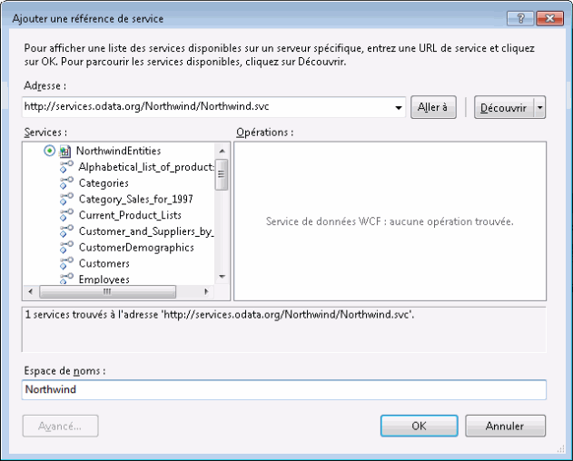

# Consommation de flux OData à partir d'un workflowConsuming OData Feeds from a Workflow
WCF Data Services est un composant du [!INCLUDE[dnprdnshort](../../../includes/dnprdnshort-md.md)] qui vous permet de créer des services qui utilisent le protocole OData (Open Data Protocol) pour exposer et consommer des données sur le Web ou l'intranet à l'aide de la sémantique de REST (Representational State transfer).WCF Data Services is a component of the [!INCLUDE[dnprdnshort](../../../includes/dnprdnshort-md.md)] that enables you to create services that use the Open Data Protocol (OData) to expose and consume data over the Web or intranet by using the semantics of representational state transfer (REST). OData expose les données sous forme de ressources adressables par des URI.OData exposes data as resources that are addressable by URIs. Toute application peut interagir avec un service de données basé sur OData si elle peut envoyer une requête HTTP et traiter le flux OData retourné par un service de données.Any application can interact with an OData-based data service if it can send an HTTP request and process the OData feed that a data service returns. WCF Data Services inclut également des bibliothèques clientes qui fournissent une expérience en programmation plus riche lorsque vous consommez des flux OData à partir des applications [!INCLUDE[dnprdnshort](../../../includes/dnprdnshort-md.md)] .In addition, WCF Data Services includes client libraries that provide a richer programming experience when you consume OData feeds from [!INCLUDE[dnprdnshort](../../../includes/dnprdnshort-md.md)] applications. Cette rubrique fournit une vue d'ensemble de la consommation d'un flux OData dans un workflow avec et sans l'utilisation de bibliothèques clientes.This topic provides an overview of consuming an OData feed in a workflow with and without using the client libraries.  
  
## Utilisation de l'exemple OData de base de données NorthwindUsing the Sample Northwind OData Service  
 Les exemples présentés dans cette rubrique s’appuient sur l’exemple de service de données Northwind situé à l’adresse [http://services.odata.org/Northwind/Northwind.svc/](http://go.microsoft.com/fwlink/?LinkID=187426).The examples in this topic use the sample Northwind data service located at [http://services.odata.org/Northwind/Northwind.svc/](http://go.microsoft.com/fwlink/?LinkID=187426). Ce service fait partie du [SDK OData](http://go.microsoft.com/fwlink/?LinkID=185248) et fournit un accès en lecture seule à l’exemple de base de données Northwind.This service is provided as part of the [OData SDK](http://go.microsoft.com/fwlink/?LinkID=185248) and provides read-only access to the sample Northwind database. Si vous souhaitez un accès en écriture ou un service de données WCF local, vous pouvez suivre la procédure de [démarrage rapide WCF Data Services](http://go.microsoft.com/fwlink/?LinkID=131076) pour créer un service OData local qui donne accès à la base de données Northwind.If write access is desired, or if a local WCF Data Service is desired, you can follow the steps of the [WCF Data Services Quickstart](http://go.microsoft.com/fwlink/?LinkID=131076) to create a local OData service that provides access to the Northwind database. Si vous suivez la procédure de démarrage rapide, remplacez l'URI local par celui fourni dans l'exemple de code de cette rubrique.If you follow the quickstart, substitute the local URI for the one provided in the example code in this topic.  
  
## Consommation d'un flux OData à l'aide des bibliothèques clientesConsuming an OData Feed Using the Client Libraries  
 WCF Data Services inclut des bibliothèques clientes qui vous permettent de consommer plus facilement un flux OData depuis les applications clientes [!INCLUDE[dnprdnshort](../../../includes/dnprdnshort-md.md)] .WCF Data Services includes client libraries that enable you to more easily consume an OData feed from [!INCLUDE[dnprdnshort](../../../includes/dnprdnshort-md.md)] and client applications. Ces bibliothèques simplifient l'envoi et la réception des messages HTTP.These libraries simplify sending and receiving HTTP messages. Elles traduisent également la charge utile de message dans les objets CLR qui représentent des données d'entité.They also translate the message payload into CLR objects that represent entity data. Les bibliothèques clientes comprennent les deux classes principales <xref:System.Data.Services.Client.DataServiceContext> et <xref:System.Data.Services.Client.DataServiceQuery%601>.The client libraries feature the two core classes <xref:System.Data.Services.Client.DataServiceContext> and <xref:System.Data.Services.Client.DataServiceQuery%601>. Ces classes vous permettent d'interroger un service de données, puis d'utiliser les données d'entité retournées sous forme d'objets CLR.These classes enable you to query a data service and then work with the returned entity data as CLR objects. Cette rubrique décrit deux approches de création d'activités qui utilisent les bibliothèques clientes.This section covers two approaches to creating activities that use the client libraries.  
  
### Ajout d'une référence de service au service de données WCFAdding a Service Reference to the WCF Data Service  
 Pour générer les bibliothèques clientes Northwind, vous pouvez utiliser la boîte de dialogue **Ajouter une référence de service** dans [!INCLUDE[vs_current_long](../../../includes/vs-current-long-md.md)] pour ajouter une référence au service OData Northwind.To generate the Northwind client libraries, you can use the **Add Service Reference** dialog box in [!INCLUDE[vs_current_long](../../../includes/vs-current-long-md.md)] to add a reference to the Northwind OData service.  
  
   
  
 Notez qu'aucune opération du service n'est exposée par le service et que la liste **Services** contient des éléments représentant les entités exposées par le service de données Northwind.Note that there are no service operations exposed by the service, and in the **Services** list there are items representing the entities exposed by the Northwind data service. Lorsqu'une référence de service est ajoutée, les classes sont générées pour ces entités et peuvent être utilisées dans le code client.When the service reference is added, classes will be generated for these entities and they can be used in the client code. Les exemples de cette rubrique utilisent ces classes et la classe `NorthwindEntities` pour exécuter les requêtes.The examples in this topic use these classes and the `NorthwindEntities` class to perform the queries.  
  
> [!NOTE]
>  [!INCLUDE[crdefault](../../../includes/crdefault-md.md)][Génération de la bibliothèque de Client de Service de données (WCF Data Services)](http://go.microsoft.com/fwlink/?LinkID=191611). [Generating the Data Service Client Library (WCF Data Services)](http://go.microsoft.com/fwlink/?LinkID=191611).  
  
### Utilisation de méthodes asynchronesUsing Asynchronous Methods  
 Pour résoudre les problèmes de latence possibles qui peuvent se produire lors de l'accès aux ressources sur le Web, il est recommandé d'accéder à WCF Data Services de façon asynchrone.To address possible latency issues that may occur when accessing resources over the Web, we recommend accessing WCF Data Services asynchronously. Les bibliothèques clientes WCF Data Services contiennent des méthodes asynchrones pour appeler les requêtes, et [!INCLUDE[wf](../../../includes/wf-md.md)] fournit la classe <xref:System.Activities.AsyncCodeActivity> pour créer des activités asynchrones.The WCF Data Services client libraries include asynchronous methods for invoking queries, and [!INCLUDE[wf](../../../includes/wf-md.md)] provides the <xref:System.Activities.AsyncCodeActivity> class for authoring asynchronous activities. Les activités dérivées<xref:System.Activities.AsyncCodeActivity> peuvent être écrites pour tirer parti des classes [!INCLUDE[dnprdnshort](../../../includes/dnprdnshort-md.md)] qui ont des méthodes asynchrones, ou le code qui doit être exécuté de façon asynchrone peut être inséré dans une méthode et appelé à l'aide d'un délégué.<xref:System.Activities.AsyncCodeActivity> derived activities can be written to take advantage of [!INCLUDE[dnprdnshort](../../../includes/dnprdnshort-md.md)] classes that have asynchronous methods, or the code to be executed asynchronously can be put into a method and invoked by using a delegate. Cette section contient deux exemples d'une activité dérivée <xref:System.Activities.AsyncCodeActivity> ; une qui utilise les méthodes asynchrones des bibliothèques clientes WCF Data Services et une qui utilise un délégué.This section provides two examples of an <xref:System.Activities.AsyncCodeActivity> derived activity; one that uses the asynchronous methods of the WCF Data Services client libraries and one that uses a delegate.  
  
> [!NOTE]
>  [!INCLUDE[crdefault](../../../includes/crdefault-md.md)][Opérations asynchrones (WCF Data Services)](http://go.microsoft.com/fwlink/?LinkId=193396) et [création d’activités asynchrones](../../../docs/framework/windows-workflow-foundation/creating-asynchronous-activities-in-wf.md). [Asynchronous Operations (WCF Data Services)](http://go.microsoft.com/fwlink/?LinkId=193396) and [Creating Asynchronous Activities](../../../docs/framework/windows-workflow-foundation/creating-asynchronous-activities-in-wf.md).  
  
### Utilisation de méthodes asynchrones des bibliothèques clientesUsing Client Library Asynchronous Methods  
 La classe <xref:System.Data.Services.Client.DataServiceQuery%601> fournit les méthodes <xref:System.Data.Services.Client.DataServiceQuery%601.BeginExecute%2A> et <xref:System.Data.Services.Client.DataServiceQuery%601.EndExecute%2A> pour interroger un service OData de façon asynchrone.The <xref:System.Data.Services.Client.DataServiceQuery%601> class provides <xref:System.Data.Services.Client.DataServiceQuery%601.BeginExecute%2A> and <xref:System.Data.Services.Client.DataServiceQuery%601.EndExecute%2A> methods for querying an OData service asynchronously. Ces méthodes peuvent être appelées à partir des substitutions <xref:System.Activities.AsyncCodeActivity.BeginExecute%2A> et <xref:System.Activities.AsyncCodeActivity.EndExecute%2A> d'une classe dérivée <xref:System.Activities.AsyncCodeActivity> .These methods can be called from the <xref:System.Activities.AsyncCodeActivity.BeginExecute%2A> and <xref:System.Activities.AsyncCodeActivity.EndExecute%2A> overrides of an <xref:System.Activities.AsyncCodeActivity> derived class. Si la substitution <xref:System.Activities.AsyncCodeActivity> <xref:System.Activities.AsyncCodeActivity.BeginExecute%2A> retourne, le workflow peut être inactif (mais pas persistant), et si la tâche asynchrone est terminée, la méthode <xref:System.Activities.AsyncCodeActivity.EndExecute%2A> est appelée par le runtime.When the <xref:System.Activities.AsyncCodeActivity> <xref:System.Activities.AsyncCodeActivity.BeginExecute%2A> override returns, the workflow can go idle (but not persist), and when the asynchronous work is completed, <xref:System.Activities.AsyncCodeActivity.EndExecute%2A> is invoked by the runtime.  
  
 Dans l'exemple suivant, une activité `OrdersByCustomer` est définie et contient deux arguments d'entrée.In the following example, an `OrdersByCustomer` activity is defined that has two input arguments. L'argument `CustomerId` représente le client qui identifie les commandes à retourner, et l'argument `ServiceUri` représente l'URI du service Odata à interroger.The `CustomerId` argument represents the customer who identifies which orders to return, and the `ServiceUri` argument represents the URI of the OData service to be queried. Comme l'activité dérive de `AsyncCodeActivity<IEnumerable<Order>>` , il y a aussi un argument de sortie <xref:System.Activities.Activity%601.Result%2A> , utilisé pour retourner le résultat de la requête.Because the activity derives from `AsyncCodeActivity<IEnumerable<Order>>` there is also a <xref:System.Activities.Activity%601.Result%2A> output argument that is used to return the results of the query. La substitution <xref:System.Activities.AsyncCodeActivity.BeginExecute%2A> crée une requête LINQ qui sélectionne toutes les commandes du client spécifié.The <xref:System.Activities.AsyncCodeActivity.BeginExecute%2A> override creates a LINQ query that selects all orders of the specified customer. Cette requête est spécifiée comme <xref:System.Activities.AsyncCodeActivityContext.UserState%2A> du <xref:System.Activities.AsyncCodeActivityContext>passé, puis la méthode <xref:System.Data.Services.Client.DataServiceQuery%601.BeginExecute%2A> de la requête est appelée.This query is specified as the <xref:System.Activities.AsyncCodeActivityContext.UserState%2A> of the passed <xref:System.Activities.AsyncCodeActivityContext>, and then the query's <xref:System.Data.Services.Client.DataServiceQuery%601.BeginExecute%2A> method is called. Notez que le rappel et l'état qui sont passés à la méthode <xref:System.Data.Services.Client.DataServiceQuery%601.BeginExecute%2A> de la requête sont ceux qui sont passés à la méthode <xref:System.Activities.AsyncCodeActivity.BeginExecute%2A> de l'activité.Note that the callback and state that are passed into the query's <xref:System.Data.Services.Client.DataServiceQuery%601.BeginExecute%2A> are the ones that are passed in to the activity's <xref:System.Activities.AsyncCodeActivity.BeginExecute%2A> method. Lorsque l'exécution de la requête est terminée, la méthode <xref:System.Activities.AsyncCodeActivity.EndExecute%2A> de l'activité est appelée.When the query has finished executing, the activity's <xref:System.Activities.AsyncCodeActivity.EndExecute%2A> method is invoked. La requête est récupérée dans la propriété <xref:System.Activities.AsyncCodeActivityContext.UserState%2A>, puis la méthode <xref:System.Data.Services.Client.DataServiceQuery%601.EndExecute%2A> de la requête est appelée.The query is retrieved from the <xref:System.Activities.AsyncCodeActivityContext.UserState%2A>, and then the query's <xref:System.Data.Services.Client.DataServiceQuery%601.EndExecute%2A> method is called. Cette méthode retourne un <xref:System.Collections.Generic.IEnumerable%601> du type d'entité spécifié, dans ce cas `Order`.This method returns an <xref:System.Collections.Generic.IEnumerable%601> of the specified entity type; in this case `Order`. `IEnumerable<Order>` étant le type générique de <xref:System.Activities.AsyncCodeActivity%601>, ce `IEnumerable` est défini comme <xref:System.Activities.Activity%601.Result%2A> <xref:System.Activities.OutArgument%601> de l'activité.Since `IEnumerable<Order>` is the generic type of the <xref:System.Activities.AsyncCodeActivity%601>, this `IEnumerable` is set as the <xref:System.Activities.Activity%601.Result%2A> <xref:System.Activities.OutArgument%601> of the activity.  
  
 [!code-csharp[CFX_WCFDataServicesActivityExample#100](../../../samples/snippets/csharp/VS_Snippets_CFX/CFX_WCFDataServicesActivityExample/cs/Program.cs#100)]  
  
 Dans l'exemple suivant, l'activité `OrdersByCustomer` récupère une liste de commandes pour le client spécifié, puis une activité <xref:System.Activities.Statements.ForEach%601> énumère les commandes retournées et écrit la date de chacune d'elles dans la console.In the following example, the `OrdersByCustomer` activity retrieves a list of orders for the specified customer, and then a <xref:System.Activities.Statements.ForEach%601> activity enumerates the returned orders and writes the date of each order to the console.  
  
 [!code-csharp[CFX_WCFDataServicesActivityExample#10](../../../samples/snippets/csharp/VS_Snippets_CFX/CFX_WCFDataServicesActivityExample/cs/Program.cs#10)]  
  
 Lorsque ce workflow est appelé, les données suivantes sont écrites dans la console :When this workflow is invoked, the following data is written to the console:  
  
 **Appel du Service de données WCF...****Calling WCF Data Service...**  
**8/25/1997** **8/25/1997**   
**10/3/1997** **10/3/1997**   
**10/13/1997** **10/13/1997**   
**1/15/1998** **1/15/1998**   
**3/16/1998** **3/16/1998**   
**4/9/1998****4/9/1998**    
> [!NOTE]
>  S'il est impossible d'établir une connexion au serveur OData, vous obtiendrez une exception semblable à la suivante :If a connection to the OData server cannot be established, you will get an exception similar to the following exception:  
>   
>  Exception non gérée : System.InvalidOperationException : Une erreur s'est produite lors du traitement de cette requête.Unhandled Exception: System.InvalidOperationException: An error occurred while processing this request. ---> System.Net.WebException : Impossible de se connecter au serveur distant. ---> System.Net.Sockets.SocketException : Une tentative de connexion a échoué car la partie connectée n'a pas répondu convenablement au-delà d'une certaine durée ou une connexion établie a échoué car l'hôte de connexion n'a pas répondu.---> System.Net.WebException: Unable to connect to the remote server ---> System.Net.Sockets.SocketException: A connection attempt failed because the connected party did not properly respond after a period of time, or established connection failed because connected host has failed to respond.  
  
 Si un traitement supplémentaire des données retournées par la requête est nécessaire, il peut être effectué dans la substitution <xref:System.Activities.AsyncCodeActivity%601.EndExecute%2A> de l'activité.If any additional processing of the data returned by the query is required, it can be done in the activity's <xref:System.Activities.AsyncCodeActivity%601.EndExecute%2A> override. Les méthodes <xref:System.Activities.AsyncCodeActivity%601.BeginExecute%2A> et <xref:System.Activities.AsyncCodeActivity%601.EndExecute%2A> sont appelées à l'aide du thread de workflow, et le code de ces substitutions ne s'exécute pas de façon asynchrone.Both <xref:System.Activities.AsyncCodeActivity%601.BeginExecute%2A> and <xref:System.Activities.AsyncCodeActivity%601.EndExecute%2A> are invoked by using the workflow thread, and any code in these overrides does not run asynchronously. Si le traitement supplémentaire est étendu ou de longue durée, ou les résultats de la requête sont paginés, vous devez envisager d'adopter l'approche décrite dans la section suivante. Cette approche utilise un délégué pour exécuter la requête et effectuer le traitement supplémentaire de façon asynchrone.If the additional processing is extensive or long-running, or the query results are paged, you should consider the approach discussed in the next section, which uses a delegate to execute the query and perform additional processing asynchronously.  
  
### Utilisation d'un déléguéUsing a Delegate  
 Outre appeler la méthode asynchrone d'une classe [!INCLUDE[dnprdnshort](../../../includes/dnprdnshort-md.md)] , une activité basée sur un <xref:System.Activities.AsyncCodeActivity>-peut aussi définir la logique asynchrone dans l'une de ses méthodes.In addition to invoking the asynchronous method of a [!INCLUDE[dnprdnshort](../../../includes/dnprdnshort-md.md)] class, an <xref:System.Activities.AsyncCodeActivity>-based activity can also define the asynchronous logic in one of its methods. Cette méthode est spécifiée en utilisant un délégué dans la substitution <xref:System.Activities.AsyncCodeActivity.BeginExecute%2A> de l'activité.This method is specified by using a delegate in the activity's <xref:System.Activities.AsyncCodeActivity.BeginExecute%2A> override. Lorsque la méthode retourne, le runtime appelle la substitution <xref:System.Activities.AsyncCodeActivity.EndExecute%2A> de l'activité.When the method returns, the runtime invokes the activity's <xref:System.Activities.AsyncCodeActivity.EndExecute%2A> override. Lors de l'appel d'un service OData d'un workflow, cette méthode peut être utilisée pour interroger le service et fournir un traitement supplémentaire.When calling an OData service from a workflow, this method can be used to query the service and provide any additional processing.  
  
 Dans l'exemple suivant, une activité `ListCustomers` est définie.In the following example, a `ListCustomers` activity is defined. Cette activité interroge l'exemple de service de données Northwind et retourne un `List<Customer>` qui contient tous les clients dans la base de données Northwind.This activity queries the sample Northwind data service and returns a `List<Customer>` that contains all of the customers in the Northwind database. La tâche asynchrone est effectuée par la méthode `GetCustomers` .The asynchronous work is performed by the `GetCustomers` method. Cette méthode interroge le service pour tous les clients, puis les copie dans un `List<Customer>`.This method queries the service for all customers, and then copies them into a `List<Customer>`. Elle vérifie ensuite si les résultats sont paginés.It then checks to see if the results are paged. Le cas échéant, elle interroge le service pour la page suivante de résultats, les ajoute à la liste et continue jusqu'à ce que tous les clients aient été récupérés.If so, it queries the service for the next page of results, adds them to the list, and continues until all of the customer data has been retrieved.  
  
> [!NOTE]
>  [!INCLUDE[crabout](../../../includes/crabout-md.md)]pagination dans WCF Data Services, consultez. paging in WCF Data Services, see . [Procédure : charger des résultats paginés (WCF Data Services)](http://go.microsoft.com/fwlink/?LinkId=193452).[How to: Load Paged Results (WCF Data Services)](http://go.microsoft.com/fwlink/?LinkId=193452).  
  
 Une fois tous les clients ajoutés, la liste est retournée.Once all customers are added, the list is returned. La méthode `GetCustomers` est spécifiée dans la substitution <xref:System.Activities.AsyncCodeActivity.BeginExecute%2A> de l'activité.The `GetCustomers` method is specified in the activity's <xref:System.Activities.AsyncCodeActivity.BeginExecute%2A> override. Comme la méthode a une valeur de retour, un `Func<string, List<Customer>>` est créé pour spécifier la méthode.Since the method has a return value, a `Func<string, List<Customer>>` is created to specify the method.  
  
> [!NOTE]
>  Si la méthode qui effectue la tâche asynchrone n'a pas de valeur de retour, un <xref:System.Action> est utilisé à la place d'un <!--zz <xref:System.Func> --> `System.Func`.If the method that performs the asynchronous work does not have a return value, an <xref:System.Action> is used instead of a <!--zz <xref:System.Func> --> `System.Func`. Pour obtenir des exemples de création d’un exemple asynchrone à l’aide de ces deux approches, consultez [création d’activités asynchrones](../../../docs/framework/windows-workflow-foundation/creating-asynchronous-activities-in-wf.md).For examples of creating an asynchronous example using both approaches, see [Creating Asynchronous Activities](../../../docs/framework/windows-workflow-foundation/creating-asynchronous-activities-in-wf.md).  
  
 Ce <!--zz <xref:System.Func> --> `System.Func` est assigné au <xref:System.Activities.AsyncCodeActivityContext.UserState%2A>, puis `BeginInvoke` est appelé.This <!--zz <xref:System.Func> --> `System.Func` is assigned to the <xref:System.Activities.AsyncCodeActivityContext.UserState%2A>, and then `BeginInvoke` is called. Comme la méthode à appeler n'a pas accès à l'environnement des arguments de l'activité, la valeur de l'argument `ServiceUri` est passée comme premier paramètre, avec le rappel et l'état passés dans la méthode <xref:System.Activities.AsyncCodeActivity.BeginExecute%2A>.Since the method to be invoked does not have access to the activity's environment of arguments, the value of the `ServiceUri` argument is passed as the first parameter, together with the callback and state that were passed into <xref:System.Activities.AsyncCodeActivity.BeginExecute%2A>. Lorsque `GetCustomers` retourne, le runtime appelle <xref:System.Activities.AsyncCodeActivity.EndExecute%2A>.When `GetCustomers` returns, the runtime invokes <xref:System.Activities.AsyncCodeActivity.EndExecute%2A>. Le code dans la méthode <xref:System.Activities.AsyncCodeActivity.EndExecute%2A> récupère le délégué à partir de la propriété <xref:System.Activities.AsyncCodeActivityContext.UserState%2A>, appelle `EndInvoke`, et retourne le résultat, qui correspond à la liste des clients retournés à partir de la méthode `GetCustomers` .The code in <xref:System.Activities.AsyncCodeActivity.EndExecute%2A> retrieves the delegate from the <xref:System.Activities.AsyncCodeActivityContext.UserState%2A>, calls `EndInvoke`, and returns the result, which is the list of customers returned from the `GetCustomers` method.  
  
 [!code-csharp[CFX_WCFDataServicesActivityExample#200](../../../samples/snippets/csharp/VS_Snippets_CFX/CFX_WCFDataServicesActivityExample/cs/Program.cs#200)]  
  
 Dans l'exemple suivant, l'activité `ListCustomers` récupère une liste de clients, puis une activité <xref:System.Activities.Statements.ForEach%601> les énumère et écrit le nom de la société et du contact de chacun des clients dans la console.In the following example, the `ListCustomers` activity retrieves a list of customers, and then a <xref:System.Activities.Statements.ForEach%601> activity enumerates them and writes the company name and contact name of each customer to the console.  
  
 [!code-csharp[CFX_WCFDataServicesActivityExample#20](../../../samples/snippets/csharp/VS_Snippets_CFX/CFX_WCFDataServicesActivityExample/cs/Program.cs#20)]  
  
 Lorsque ce workflow est appelé, les données suivantes sont écrites dans la console :When this workflow is invoked, the following data is written to the console. Comme cette requête retourne de nombreux clients, une seule partie du résultat s'affiche ici.Since this query returns many customers, only part of the output is displayed here.  
  
 **Appel du Service de données WCF...****Calling WCF Data Service...**  
**Alfreds Futterkiste, Contact: Maria Anders** **Alfreds Futterkiste, Contact: Maria Anders**   
**Ana Trujillo Emparedados y helados, Contact: Ana Trujillo** **Ana Trujillo Emparedados y helados, Contact: Ana Trujillo**   
**Antonio Moreno Taquería, Contact: Antonio Moreno** **Antonio Moreno Taquería, Contact: Antonio Moreno**   
**Around the Horn, Contact: Thomas Hardy** **Around the Horn, Contact: Thomas Hardy**   
**Berglunds snabbköp, Contact: Christina Berglund** **Berglunds snabbköp, Contact: Christina Berglund**   
**...****...**    
## Consommation d'un flux OData sans utiliser les bibliothèques clientesConsuming an OData Feed Without Using the Client Libraries  
 OData expose les données sous forme de ressources adressables par des URI.OData exposes data as resources that are addressable by URIs. Lorsque vous utilisez les bibliothèques clientes, ces URI sont créés pour vous, mais vous n'avez pas besoin d'utiliser les bibliothèques clientes.When you use the client libraries these URIs are created for you, but you do not have to use the client libraries. Si vous le souhaitez, vous pouvez accéder aux services OData directement sans utiliser les bibliothèques clientes.If desired, OData services can be accessed directly without using the client libraries. Le cas échéant, l'emplacement du service et les données voulues sont spécifiés par l'URI et les résultats sont retournés dans la réponse à la requête HTTP.When not using the client libraries the location of the service and the desired data are specified by the URI and the results are returned in the response to the HTTP request. Vous pouvez ensuite traiter ou manipuler ces données brutes de la façon appropriée.This raw data can then be processed or manipulated in the desired manner. Pour récupérer les résultats d'une requête OData, vous pouvez utiliser la classe <xref:System.Net.WebClient> .One way to retrieve the results of an OData query is by using the <xref:System.Net.WebClient> class. Dans cet exemple, le contact du client représenté par la clé ALFKI est récupéré.In this example, the contact name for the customer represented by the key ALFKI is retrieved.  
  
 [!code-csharp[CFX_WCFDataServicesActivityExample#2](../../../samples/snippets/csharp/VS_Snippets_CFX/CFX_WCFDataServicesActivityExample/cs/Program.cs#2)]  
  
 Lorsque ce code s'exécute, la sortie suivante s'affiche sur la console :When this code is run, the following output is displayed to the console:  
  
 **Données brutes retournées :****Raw data returned:**  
**\<? xml version = « 1.0 » encoding = « utf-8 » standalone = « yes » ? >** **\<?xml version="1.0" encoding="utf-8" standalone="yes"?>**   
**\<ContactName xmlns = « http://schemas.microsoft.com/ado/2007/08/dataservices » > Maria Anders\</ContactName >** dans un flux de travail, le code de cet exemple peut être incorporé dans le <xref:System.Activities.CodeActivity.Execute%2A> la substitution d’un <xref:System.Activities.CodeActivity>-en fonction d’activité personnalisée, mais cette même fonctionnalité peut également être obtenue à l’aide de la <xref:System.Activities.Expressions.InvokeMethod%601> activité.**\<ContactName xmlns="http://schemas.microsoft.com/ado/2007/08/dataservices">Maria Anders\</ContactName>**  In a workflow, the code from this example could be incorporated into the <xref:System.Activities.CodeActivity.Execute%2A> override of a <xref:System.Activities.CodeActivity>-based custom activity, but the same functionality can also be accomplished by using the <xref:System.Activities.Expressions.InvokeMethod%601> activity. L'activité <xref:System.Activities.Expressions.InvokeMethod%601> permet aux auteurs de workflow d'appeler des méthodes d'instance et statiques d'une classe, ainsi que d'appeler la méthode spécifiée de façon asynchrone.The <xref:System.Activities.Expressions.InvokeMethod%601> activity enables workflow authors to invoke static and instance methods of a class, and also has an option to invoke the specified method asynchronously. Dans l'exemple suivant, une activité <xref:System.Activities.Expressions.InvokeMethod%601> est configurée pour appeler la méthode <xref:System.Net.WebClient.DownloadString%2A> de la classe <xref:System.Net.WebClient> et retourner une liste de clients.In the following example, an <xref:System.Activities.Expressions.InvokeMethod%601> activity is configured to call the <xref:System.Net.WebClient.DownloadString%2A> method of the <xref:System.Net.WebClient> class and return a list of customers.  
  
 [!code-csharp[CFX_WCFDataServicesActivityExample#3](../../../samples/snippets/csharp/VS_Snippets_CFX/CFX_WCFDataServicesActivityExample/cs/Program.cs#3)]  
  
 <xref:System.Activities.Expressions.InvokeMethod%601> peut appeler à la fois des méthodes d'instance et statiques d'une classe.<xref:System.Activities.Expressions.InvokeMethod%601> can call both static and instance methods of a class. Comme <xref:System.Net.WebClient.DownloadString%2A> est une méthode d'instance de la classe <xref:System.Net.WebClient> , une nouvelle instance de la classe <xref:System.Net.WebClient> est spécifiée pour <xref:System.Activities.Expressions.InvokeMethod%601.TargetObject%2A>.Since <xref:System.Net.WebClient.DownloadString%2A> is an instance method of the <xref:System.Net.WebClient> class, a new instance of the <xref:System.Net.WebClient> class is specified for the <xref:System.Activities.Expressions.InvokeMethod%601.TargetObject%2A>. `DownloadString` est spécifiée pour la propriété <xref:System.Activities.Expressions.InvokeMethod%601.MethodName%2A>, l'URI qui contient la requête est spécifié dans la collection <xref:System.Activities.Expressions.InvokeMethod%601.Parameters%2A> , et la propriété <xref:System.Activities.Activity%601.Result%2A> est affectée à la valeur de retour.`DownloadString` is specified as the <xref:System.Activities.Expressions.InvokeMethod%601.MethodName%2A>, the URI that contains the query is specified in the <xref:System.Activities.Expressions.InvokeMethod%601.Parameters%2A> collection, and the return value is assigned to the <xref:System.Activities.Activity%601.Result%2A> value. La valeur <xref:System.Activities.Expressions.InvokeMethod%601.RunAsynchronously%2A> est affectée à la propriété `true`, ce qui signifie que l'appel de la méthode s'exécutera de façon asynchrone par rapport au workflow.The <xref:System.Activities.Expressions.InvokeMethod%601.RunAsynchronously%2A> value is set to `true`, which means that the method invocation will run asynchronously with regard to the workflow. Dans l'exemple suivant, un workflow est construit qui utilise l'activité <xref:System.Activities.Expressions.InvokeMethod%601> pour interroger l'exemple de service de données Northwind pour une liste de commandes d'un client spécifique, puis les données retournées sont écrites dans la console.In the following example, a workflow is constructed that uses the <xref:System.Activities.Expressions.InvokeMethod%601> activity to query the sample Northwind data service for a list of orders for a specific customer, and then the returned data is written to the console.  
  
 [!code-csharp[CFX_WCFDataServicesActivityExample#1](../../../samples/snippets/csharp/VS_Snippets_CFX/CFX_WCFDataServicesActivityExample/cs/Program.cs#1)]  
  
 Lorsque ce workflow est appelé, la sortie suivante s'affiche sur la console.When this workflow is invoked, the following output is displayed to the console. Comme cette requête retourne plusieurs commandes, une seule partie du résultat s'affiche ici.Since this query returns several orders, only part of the output is displayed here.  
  
 **Appel du Service de données WCF...****Calling WCF Data Service...**  
**Raw data returned:** **Raw data returned:**   
**\<? xml version = « 1.0 » encoding = « utf-8 » standalone = « yes » ? >** **\<?xml version="1.0" encoding="utf-8" standalone="yes"?>**   
**\<flux** **\<feed**   
 **XML : base = « http://services.odata.org/Northwind/Northwind.svc/ »****xml:base="http://services.odata.org/Northwind/Northwind.svc/"**  
 **xmlns:d = « http://schemas.microsoft.com/ado/2007/08/dataservices »****xmlns:d="http://schemas.microsoft.com/ado/2007/08/dataservices"**  
 **xmlns:m = « http://schemas.microsoft.com/ado/2007/08/dataservices/metadata »****xmlns:m="http://schemas.microsoft.com/ado/2007/08/dataservices/metadata"**  
 **xmlns = « http://www.w3.org/2005/Atom » >****xmlns="http://www.w3.org/2005/Atom">**  
 **\<titre de type = « text » > commandes \< /title >****\<title type="text">Orders\</title>**  
 **\<ID > http://services.odata.org/Northwind/Northwind.svc/Customers('ALFKI')/commandes\</id >****\<id>http://services.odata.org/Northwind/Northwind.svc/Customers('ALFKI')/Orders\</id>**  
 **\<mise à jour > 2010-05-19T19:37:07Z\</ mise à jour >****\<updated>2010-05-19T19:37:07Z\</updated>**  
 **\<Link rel = « personnel » title = « Orders » href = « Orders » / >****\<link rel="self" title="Orders" href="Orders" />**  
 **\<entrée >****\<entry>**  
 **\<ID > http://services.odata.org/Northwind/Northwind.svc/Orders (10643)\</id >****\<id>http://services.odata.org/Northwind/Northwind.svc/Orders(10643)\</id>**  
 **\<titre de type = « text » > \< /title >****\<title type="text">\</title>**  
 **\<mise à jour > 2010-05-19T19:37:07Z\</ mise à jour >****\<updated>2010-05-19T19:37:07Z\</updated>**  
 **\<Auteur >****\<author>**  
 **\<nom / >****\<name />**  
 **\</ Créer >****\</author>**  
 **\<Link rel = « edit » title = « Order » href="Orders(10643) » / >****\<link rel="edit" title="Order" href="Orders(10643)" />**  
 **\<Link rel = « http://schemas.microsoft.com/ado/2007/08/dataservices/related/Customer »****\<link rel="http://schemas.microsoft.com/ado/2007/08/dataservices/related/Customer"**  
 **type = « application/atom + xml ; type = entrée « titre = « Customer » href = « Commandes client (10643) / » / >****type="application/atom+xml;type=entry" title="Customer" href="Orders(10643)/Customer" />**  
**...**  Cet exemple fournit une méthode que les auteurs d'applications de workflow peuvent utiliser pour consommer les données brutes retournées par un service OData.**...**  This example provides one method that workflow application authors can use to consume the raw data returned from an OData service. [!INCLUDE[crabout](../../../includes/crabout-md.md)] l’accès aux services de données WCF à l’aide d’URI, consultez [Accès aux ressources de service de données (WCF Data Services)](http://go.microsoft.com/fwlink/?LinkId=193397) et [OData : conventions d’URI](http://go.microsoft.com/fwlink/?LinkId=185564). accessing WCF Data Services using URIs, see [Accessing Data Service Resources (WCF Data Services)](http://go.microsoft.com/fwlink/?LinkId=193397) and [OData: URI Conventions](http://go.microsoft.com/fwlink/?LinkId=185564).
