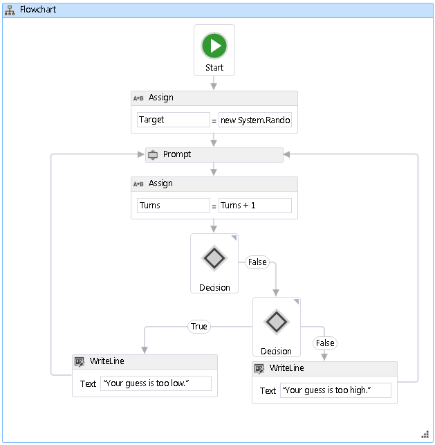

# <a name="how-to-create-a-flowchart-workflow"></a>Procédure : créer un workflow d'organigramme
Les workflows peuvent être construits aussi bien à partir d'activités intégrées que d'activités personnalisées. Cette rubrique Guide de création d’un workflow qui utilise les deux activités intégrées, telles que la <xref:System.Activities.Statements.Flowchart> activité et les activités personnalisées à partir de la précédente [Comment : créer une activité](../../../docs/framework/windows-workflow-foundation/how-to-create-an-activity.md) rubrique. Le workflow modélise un jeu d'estimation de nombre.  
  
> [!NOTE]
>  Chaque rubrique du didacticiel de mise en route dépend des rubriques précédentes. Pour terminer cette rubrique, vous devez d’abord terminer [Comment : créer une activité](../../../docs/framework/windows-workflow-foundation/how-to-create-an-activity.md).  
  
> [!NOTE]
>  Pour télécharger une version complète du didacticiel, consultez [Windows Workflow Foundation (WF45) - Getting Started Tutorial](http://go.microsoft.com/fwlink/?LinkID=248976)(Windows Workflow Foundation (WF45) - Didacticiel de mise en route).  
  
### <a name="to-create-the-workflow"></a>Pour créer le flux de travail  
  
1.  Avec le bouton droit **NumberGuessWorkflowActivities** dans **l’Explorateur de solutions** et sélectionnez **ajouter**, **un nouvel élément**.  
  
2.  Dans le **installé**, **éléments communs** nœud, sélectionnez **Workflow**. Sélectionnez **activité** à partir de la **Workflow** liste.  
  
3.  Type `FlowchartNumberGuessWorkflow` dans les **nom** , puis cliquez sur **ajouter**.  
  
4.  Faites glisser un **organigramme** activité à partir de la **organigramme** section du **boîte à outils** et déposez-la sur le **déposer l’activité ici** étiquette sur le aire de conception de workflow.  
  
### <a name="to-create-the-workflow-variables-and-arguments"></a>Pour créer les variables et arguments du flux de travail  
  
1.  Double-cliquez sur **FlowchartNumberGuessWorkflow.xaml** dans **l’Explorateur de solutions** pour afficher le flux de travail dans le concepteur, si elle n’est pas affichée.  
  
2.  Cliquez sur **Arguments** dans la partie inférieure gauche du Concepteur de flux de travail pour afficher la **Arguments** volet.  
  
3.  Cliquez sur **créer un Argument**.  
  
4.  Type `MaxNumber` dans les **nom** boîte, sélectionnez **dans** à partir de la **Direction** la liste déroulante, sélectionnez **Int32** à partir de la **Type d’argument** liste déroulante et appuyez sur ENTRÉE pour enregistrer l’argument.  
  
5.  Cliquez sur **créer un Argument**.  
  
6.  Type `Turns` dans le **nom** zone ci-dessous récemment ajouté `MaxNumber` argument, sélectionnez **hors** à partir de la **Direction** liste déroulante, sélectionnez  **Int32** à partir de la **type d’Argument** liste déroulante et appuyez sur ENTRÉE.  
  
7.  Cliquez sur **Arguments** dans la partie inférieure gauche du Concepteur d’activités pour fermer la **Arguments** volet.  
  
8.  Cliquez sur **Variables** dans la partie inférieure gauche du Concepteur de flux de travail pour afficher la **Variables** volet.  
  
9. Cliquez sur **créer la Variable**.  
  
    > [!TIP]
    >  Si aucun **créer une Variable** s’affiche, cliquez sur le <xref:System.Activities.Statements.Flowchart> activité sur l’aire de Concepteur de flux de travail pour le sélectionner.  
  
10. Type `Guess` dans les **nom** boîte, sélectionnez **Int32** à partir de la **le type de Variable** liste déroulante et appuyez sur ENTRÉE pour enregistrer la variable.  
  
11. Cliquez sur **créer la Variable**.  
  
12. Type `Target` dans les **nom** boîte, sélectionnez **Int32** à partir de la **le type de Variable** liste déroulante et appuyez sur ENTRÉE pour enregistrer la variable.  
  
13. Cliquez sur **Variables** dans la partie inférieure gauche du Concepteur d’activités pour fermer la **Variables** volet.  
  
### <a name="to-add-the-workflow-activities"></a>Pour ajouter les activités de flux de travail  
  
1.  Faites glisser un **affecter** activité à partir de la **Primitives** section de la **boîte à outils** et placez-la sur le **Démarrer** nœud, qui est en haut de la diagramme de flux. Lorsque le **affecter** activité se trouve sur le **Démarrer** nœud, trois triangles apparaissent autour de le **Démarrer** nœud. Supprimer le **affecter** activité sur le triangle qui est directement sous le **Démarrer** nœud. Cela lie les deux éléments ensemble et désigne le **affecter** activité comme première activité dans le diagramme de flux.  
  
    > [!NOTE]
    >  Les activités peuvent également être définies comme activité de départ dans le workflow en les liant manuellement au nœud de démarrage. Pour ce faire, pointez la souris sur le **Démarrer** nœud, cliquez sur un des rectangles qui s’affichent lorsque la souris se trouve sur le **Démarrer** nœud et faites glisser la connexion de la ligne jusqu'à l’activité souhaitée, puis déposez-le sur l’un des les rectangles qui s’affichent. Vous pouvez également désigner activité en tant qu’activité de départ en cliquant avec le droit de l’informatique et en choisissant **définir en tant que nœud début**.  
  
2.  Type `Target` dans les **à** boîte et l’expression suivante dans le **entrer une Expression c#** ou **entrer une expression VB** boîte.  
  
    ```vb  
    New System.Random().Next(1, MaxNumber + 1)  
    ```  
  
    ```csharp  
    new System.Random().Next(1, MaxNumber + 1)  
    ```  
  
    > [!TIP]
    >  Si le **boîte à outils** fenêtre n’est pas affichée, sélectionnez **boîte à outils** à partir de la **vue** menu.  
  
3.  Faites glisser un **invite** activité à partir de la **NumberGuessWorkflowActivities** section de la **boîte à outils**, déposez-la au-dessous la **affecter** activité du précédent pas à pas et vous connecter le **invite** activité à la **affecter** activité. Il existe trois façons de connecter les deux activités. La première consiste à les connecter lorsque vous déposez le **invite** activité sur le flux de travail. Lorsque vous faites glisser le **invite** activité du workflow, placez-la sur le **affecter** activité et déposez-la sur un des quatre triangles qui apparaît lorsque le **invite** activité se trouve sur le **affecter** activité. La seconde consiste à supprimer la **invite** activité sur le flux de travail à l’emplacement souhaité. Ensuite, pointez la souris sur le **affecter** activité et faites glisser un des rectangles qui apparaît sous le **invite** activité. Faites glisser la souris afin que la ligne de connexion à partir de la **affecter** activité se connecte à un des rectangles de le **invite** activité et relâchez le bouton de la souris. La troisième méthode est très similaire à la première, mais au lieu de faire glisser le **invite** activité à partir de la **boîte à outils**, vous faites glisser à partir de son emplacement sur l’aire de conception de workflow, placez-la sur le  **Affecter** activité et déposez-la sur un des triangles qui s’affiche.  
  
4.  Dans le **fenêtre Propriétés** pour le **invite** activité, type `"EnterGuess"` les guillemets le **BookmarkName** zone de valeur de propriété. Type `Guess` dans les **résultat** zone de valeur de propriété et tapez l’expression suivante dans le **texte** zone de propriété.  
  
    ```vb  
    "Please enter a number between 1 and " & MaxNumber  
    ```  
  
    ```csharp  
    "Please enter a number between 1 and " + MaxNumber  
    ```  
  
    > [!TIP]
    >  Si le **fenêtre Propriétés** n’est pas affichée, sélectionnez **fenêtre Propriétés** à partir de la **vue** menu.  
  
5.  Faites glisser un **affecter** activité à partir de la **Primitives** section de la **boîte à outils** et connectez-vous à l’aide d’une des méthodes décrites dans l’étape précédente, afin qu’il soit sous la  **Invite de commandes** activité.  
  
6.  Type `Turns` dans le **à** boîte et `Turns + 1` dans le **entrer une expression c#** ou **entrer une expression VB** boîte.  
  
7.  Faites glisser un **FlowDecision** à partir de la **organigramme** section de la **boîte à outils** et connectez-la en dessous le **affecter** activité. Dans le **fenêtre Propriétés**, tapez l’expression suivante dans le **Condition** zone de valeur de propriété.  
  
    ```vb  
    Guess = Target  
    ```  
  
    ```csharp  
    Guess == Target  
    ```  
  
8.  Faites glisser une autre **FlowDecision** activité à partir de la **boîte à outils** et déposez-le sous le premier. Connecter les deux activités en faisant glisser le rectangle qui porte le nom **False** en haut **FlowDecision** activité vers le rectangle en haut de la seconde **FlowDecision**activité.  
  
    > [!TIP]
    >  Si vous ne voyez pas le **True** et **False** des étiquettes sur le **FlowDecision**, pointez la souris sur le **FlowDecision**.  
  
9. Cliquez sur le second **FlowDecision** activité pour le sélectionner. Dans le **fenêtre Propriétés**, tapez l’expression suivante dans le **Condition** zone de valeur de propriété.  
  
    ```
    Guess < Target  
    ```  
  
10. Faites glisser deux **WriteLine** activités à partir de la **Primitives** section de la **boîte à outils** et déposez-les de sorte qu’elles soient côte à côte sous les deux **FlowDecision**  activités. Connecter le **True** action du bas **FlowDecision** activité la plus à gauche **WriteLine** activité et le **False** action à la à l’extrême droite **WriteLine** activité.  
  
11. Cliquez sur le plus à gauche **WriteLine** activité pour la sélectionner, puis tapez l’expression suivante dans le **texte** zone de valeur de propriété du **fenêtre Propriétés**.  
  
    ```
    "Your guess is too low."  
    ```  
  
12. Connecter le **WriteLine** sur le côté gauche de la **invite** activité qui est au-dessus de lui.  
  
13. Cliquez sur le plus à droite **WriteLine** activité pour la sélectionner, puis tapez l’expression suivante dans le **texte** zone de valeur de propriété du **fenêtre Propriétés**.  
  
    ```
    "Your guess is too high."  
    ```  
  
14. Connecter le **WriteLine** activité vers la droite de la **invite** activité au-dessus de lui.  
  
     L'exemple suivant illustre le flux de travail terminé.  
  
       
  
### <a name="to-build-the-workflow"></a>Pour générer le flux de travail  
  
1.  Appuyez sur Ctrl+Maj+B pour générer la solution.  
  
     Pour obtenir des instructions sur la façon d’exécuter le flux de travail, consultez la rubrique suivante, [Comment : exécuter un Workflow](../../../docs/framework/windows-workflow-foundation/how-to-run-a-workflow.md). Si vous avez déjà effectué le [Comment : exécuter un Workflow](../../../docs/framework/windows-workflow-foundation/how-to-run-a-workflow.md) étape avec un style différent de flux de travail et à exécuter à l’aide du workflow d’organigramme à partir de cette étape, passez directement à la [pour générer et exécuter l’application](../../../docs/framework/windows-workflow-foundation/how-to-run-a-workflow.md#BKMK_ToRunTheApplication)section de [Comment : exécuter un Workflow](../../../docs/framework/windows-workflow-foundation/how-to-run-a-workflow.md).  
  
## <a name="see-also"></a>Voir aussi  
 <xref:System.Activities.Statements.Flowchart>  
 <xref:System.Activities.Statements.FlowDecision>  
 [Programmation Windows Workflow Foundation](../../../docs/framework/windows-workflow-foundation/programming.md)  
 [Conception des workflows](../../../docs/framework/windows-workflow-foundation/designing-workflows.md)  
 [Didacticiel Bien démarrer](../../../docs/framework/windows-workflow-foundation/getting-started-tutorial.md)  
 [Guide pratique pour créer une activité](../../../docs/framework/windows-workflow-foundation/how-to-create-an-activity.md)  
 [Guide pratique pour exécuter un workflow](../../../docs/framework/windows-workflow-foundation/how-to-run-a-workflow.md)
