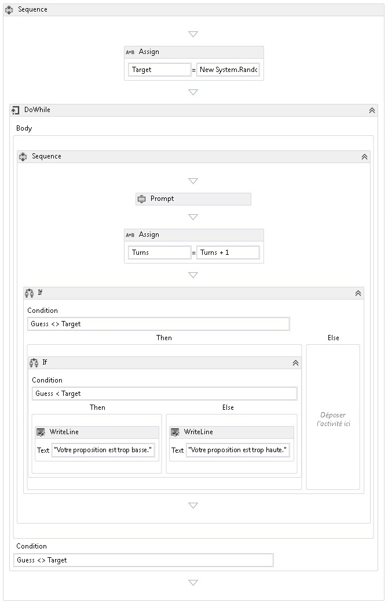

# <a name="how-to-create-a-sequential-workflow"></a><span data-ttu-id="dabdd-102">Procédure : créer un workflow séquentiel</span><span class="sxs-lookup"><span data-stu-id="dabdd-102">How to: Create a Sequential Workflow</span></span>
<span data-ttu-id="dabdd-103">Les workflows peuvent être construits aussi bien à partir d'activités intégrées que d'activités personnalisées.</span><span class="sxs-lookup"><span data-stu-id="dabdd-103">Workflows can be constructed from built-in activities as well as from custom activities.</span></span> <span data-ttu-id="dabdd-104">Cette rubrique Guide de création d’un workflow qui utilise les deux activités intégrées, telles que la <xref:System.Activities.Statements.Sequence> activité et les activités personnalisées à partir de la précédente [Comment : créer une activité](../../../docs/framework/windows-workflow-foundation/how-to-create-an-activity.md) rubrique.</span><span class="sxs-lookup"><span data-stu-id="dabdd-104">This topic steps through creating a workflow that uses both built-in activities such as the <xref:System.Activities.Statements.Sequence> activity, and the custom activities from the previous [How to: Create an Activity](../../../docs/framework/windows-workflow-foundation/how-to-create-an-activity.md) topic.</span></span> <span data-ttu-id="dabdd-105">Le workflow modélise un jeu d'estimation de nombre.</span><span class="sxs-lookup"><span data-stu-id="dabdd-105">The workflow models a number guessing game.</span></span>  
  
> [!NOTE]
>  <span data-ttu-id="dabdd-106">Chaque rubrique du didacticiel de mise en route dépend des rubriques précédentes.</span><span class="sxs-lookup"><span data-stu-id="dabdd-106">Each topic in the Getting Started tutorial depends on the previous topics.</span></span> <span data-ttu-id="dabdd-107">Pour terminer cette rubrique, vous devez d’abord terminer [Comment : créer une activité](../../../docs/framework/windows-workflow-foundation/how-to-create-an-activity.md).</span><span class="sxs-lookup"><span data-stu-id="dabdd-107">To complete this topic, you must first complete [How to: Create an Activity](../../../docs/framework/windows-workflow-foundation/how-to-create-an-activity.md).</span></span>  
  
> [!NOTE]
>  <span data-ttu-id="dabdd-108">Pour télécharger une version complète du didacticiel, consultez [Windows Workflow Foundation (WF45) - Getting Started Tutorial](http://go.microsoft.com/fwlink/?LinkID=248976)(Windows Workflow Foundation (WF45) - Didacticiel de mise en route).</span><span class="sxs-lookup"><span data-stu-id="dabdd-108">To download a completed version of the tutorial, see [Windows Workflow Foundation (WF45) - Getting Started Tutorial](http://go.microsoft.com/fwlink/?LinkID=248976).</span></span>  
  
### <a name="to-create-the-workflow"></a><span data-ttu-id="dabdd-109">Pour créer le flux de travail</span><span class="sxs-lookup"><span data-stu-id="dabdd-109">To create the workflow</span></span>  
  
1.  <span data-ttu-id="dabdd-110">Avec le bouton droit **NumberGuessWorkflowActivities** dans **l’Explorateur de solutions** et sélectionnez **ajouter**, **un nouvel élément**.</span><span class="sxs-lookup"><span data-stu-id="dabdd-110">Right-click **NumberGuessWorkflowActivities** in **Solution Explorer** and select **Add**, **New Item**.</span></span>  
  
2.  <span data-ttu-id="dabdd-111">Dans le **installé**, **éléments communs** nœud, sélectionnez **Workflow**.</span><span class="sxs-lookup"><span data-stu-id="dabdd-111">In the **Installed**, **Common Items** node, select **Workflow**.</span></span> <span data-ttu-id="dabdd-112">Sélectionnez **activité** à partir de la **Workflow** liste.</span><span class="sxs-lookup"><span data-stu-id="dabdd-112">Select **Activity** from the **Workflow** list.</span></span>  
  
3.  <span data-ttu-id="dabdd-113">Type `SequentialNumberGuessWorkflow` dans les **nom** , puis cliquez sur **ajouter**.</span><span class="sxs-lookup"><span data-stu-id="dabdd-113">Type `SequentialNumberGuessWorkflow` into the **Name** box and click **Add**.</span></span>  
  
4.  <span data-ttu-id="dabdd-114">Faites glisser un **séquence** activité à partir de la **flux de contrôle** section du **boîte à outils** et déposez-la sur le **déposer l’activité ici** étiquette sur le aire de conception de workflow.</span><span class="sxs-lookup"><span data-stu-id="dabdd-114">Drag a **Sequence** activity from the **Control Flow** section of the **Toolbox** and drop it onto the **Drop activity here** label on the workflow design surface.</span></span>  
  
### <a name="to-create-the-workflow-variables-and-arguments"></a><span data-ttu-id="dabdd-115">Pour créer les variables et arguments du flux de travail</span><span class="sxs-lookup"><span data-stu-id="dabdd-115">To create the workflow variables and arguments</span></span>  
  
1.  <span data-ttu-id="dabdd-116">Double-cliquez sur **SequentialNumberGuessWorkflow.xaml** dans **l’Explorateur de solutions** pour afficher le flux de travail dans le concepteur, si elle n’est pas affichée.</span><span class="sxs-lookup"><span data-stu-id="dabdd-116">Double-click **SequentialNumberGuessWorkflow.xaml** in **Solution Explorer** to display the workflow in the designer, if it is not already displayed.</span></span>  
  
2.  <span data-ttu-id="dabdd-117">Cliquez sur **Arguments** dans la partie inférieure gauche du Concepteur de flux de travail pour afficher la **Arguments** volet.</span><span class="sxs-lookup"><span data-stu-id="dabdd-117">Click **Arguments** in the lower-left side of the workflow designer to display the **Arguments** pane.</span></span>  
  
3.  <span data-ttu-id="dabdd-118">Cliquez sur **créer un Argument**.</span><span class="sxs-lookup"><span data-stu-id="dabdd-118">Click **Create Argument**.</span></span>  
  
4.  <span data-ttu-id="dabdd-119">Type `MaxNumber` dans les **nom** boîte, sélectionnez **dans** à partir de la **Direction** la liste déroulante, sélectionnez **Int32** à partir de la **Type d’argument** liste déroulante et appuyez sur ENTRÉE pour enregistrer l’argument.</span><span class="sxs-lookup"><span data-stu-id="dabdd-119">Type `MaxNumber` into the **Name** box, select **In** from the **Direction** drop-down list, select **Int32** from the **Argument type** drop-down list, and then press ENTER to save the argument.</span></span>  
  
5.  <span data-ttu-id="dabdd-120">Cliquez sur **créer un Argument**.</span><span class="sxs-lookup"><span data-stu-id="dabdd-120">Click **Create Argument**.</span></span>  
  
6.  <span data-ttu-id="dabdd-121">Type `Turns` dans le **nom** zone ci-dessous récemment ajouté `MaxNumber` argument, sélectionnez **hors** à partir de la **Direction** liste déroulante, sélectionnez  **Int32** à partir de la **type d’Argument** liste déroulante et appuyez sur ENTRÉE.</span><span class="sxs-lookup"><span data-stu-id="dabdd-121">Type `Turns` into the **Name** box that is below the newly added `MaxNumber` argument, select **Out** from the **Direction** drop-down list, select **Int32** from the **Argument type** drop-down list, and then press ENTER.</span></span>  
  
7.  <span data-ttu-id="dabdd-122">Cliquez sur **Arguments** dans la partie inférieure gauche du Concepteur d’activités pour fermer la **Arguments** volet.</span><span class="sxs-lookup"><span data-stu-id="dabdd-122">Click **Arguments** in the lower-left side of the activity designer to close the **Arguments** pane.</span></span>  
  
8.  <span data-ttu-id="dabdd-123">Cliquez sur **Variables** dans la partie inférieure gauche du Concepteur de flux de travail pour afficher la **Variables** volet.</span><span class="sxs-lookup"><span data-stu-id="dabdd-123">Click **Variables** in the lower-left side of the workflow designer to display the **Variables** pane.</span></span>  
  
9. <span data-ttu-id="dabdd-124">Cliquez sur **créer la Variable**.</span><span class="sxs-lookup"><span data-stu-id="dabdd-124">Click **Create Variable**.</span></span>  
  
    > [!TIP]
    >  <span data-ttu-id="dabdd-125">Si aucun **créer une Variable** s’affiche, cliquez sur le **séquence** activité sur l’aire de Concepteur de flux de travail pour le sélectionner.</span><span class="sxs-lookup"><span data-stu-id="dabdd-125">If no **Create Variable** box is displayed, click the **Sequence** activity on the workflow designer surface to select it.</span></span>  
  
10. <span data-ttu-id="dabdd-126">Type `Guess` dans les **nom** boîte, sélectionnez **Int32** à partir de la **le type de Variable** liste déroulante et appuyez sur ENTRÉE pour enregistrer la variable.</span><span class="sxs-lookup"><span data-stu-id="dabdd-126">Type `Guess` into the **Name** box, select **Int32** from the **Variable type** drop-down list, and then press ENTER to save the variable.</span></span>  
  
11. <span data-ttu-id="dabdd-127">Cliquez sur **créer la Variable**.</span><span class="sxs-lookup"><span data-stu-id="dabdd-127">Click **Create Variable**.</span></span>  
  
12. <span data-ttu-id="dabdd-128">Type `Target` dans les **nom** boîte, sélectionnez **Int32** à partir de la **le type de Variable** liste déroulante et appuyez sur ENTRÉE pour enregistrer la variable.</span><span class="sxs-lookup"><span data-stu-id="dabdd-128">Type `Target` into the **Name** box, select **Int32** from the **Variable type** drop-down list, and then press ENTER to save the variable.</span></span>  
  
13. <span data-ttu-id="dabdd-129">Cliquez sur **Variables** dans la partie inférieure gauche du Concepteur d’activités pour fermer la **Variables** volet.</span><span class="sxs-lookup"><span data-stu-id="dabdd-129">Click **Variables** in the lower-left side of the activity designer to close the **Variables** pane.</span></span>  
  
### <a name="to-add-the-workflow-activities"></a><span data-ttu-id="dabdd-130">Pour ajouter les activités de flux de travail</span><span class="sxs-lookup"><span data-stu-id="dabdd-130">To add the workflow activities</span></span>  
  
1.  <span data-ttu-id="dabdd-131">Faites glisser un **affecter** activité à partir de la **Primitives** section de la **boîte à outils** et déposez-le sur le **séquence** activité.</span><span class="sxs-lookup"><span data-stu-id="dabdd-131">Drag an **Assign** activity from the **Primitives** section of the **Toolbox** and drop it onto the **Sequence** activity.</span></span> <span data-ttu-id="dabdd-132">Type `Target` dans les **à** boîte et l’expression suivante dans le **entrer une expression c#** ou **entrer une expression VB** boîte.</span><span class="sxs-lookup"><span data-stu-id="dabdd-132">Type `Target` into the **To** box and the following expression into the **Enter a C# expression** or **Enter a VB expression** box.</span></span>  
  
    ```vb  
    New System.Random().Next(1, MaxNumber + 1)  
    ```  
  
    ```csharp  
    new System.Random().Next(1, MaxNumber + 1)  
    ```  
  
    > [!TIP]
    >  <span data-ttu-id="dabdd-133">Si le **boîte à outils** fenêtre n’est pas affichée, sélectionnez **boîte à outils** à partir de la **vue** menu.</span><span class="sxs-lookup"><span data-stu-id="dabdd-133">If the **Toolbox** window is not displayed, select **Toolbox** from the **View** menu.</span></span>  
  
2.  <span data-ttu-id="dabdd-134">Faites glisser un **DoWhile** activité à partir de la **flux de contrôle** section de la **boîte à outils** et déposez-le sur le flux de travail afin qu’il soit sous la **affecter** activité.</span><span class="sxs-lookup"><span data-stu-id="dabdd-134">Drag a **DoWhile** activity from the **Control Flow** section of the **Toolbox** and drop it on the workflow so that it is below the **Assign** activity.</span></span>  
  
3.  <span data-ttu-id="dabdd-135">Tapez l’expression suivante dans le **DoWhile** l’activité **Condition** zone de valeur de propriété.</span><span class="sxs-lookup"><span data-stu-id="dabdd-135">Type the following expression into the **DoWhile** activity’s **Condition** property value box.</span></span>  
  
    ```vb  
    Guess <> Target  
    ```  
  
    ```csharp  
    Guess != Target  
    ```  
  
     <span data-ttu-id="dabdd-136">Une activité <xref:System.Activities.Statements.DoWhile> exécute ses activités enfants puis évalue son <xref:System.Activities.Statements.DoWhile.Condition%2A>.</span><span class="sxs-lookup"><span data-stu-id="dabdd-136">A <xref:System.Activities.Statements.DoWhile> activity executes its child activities and then evaluates its <xref:System.Activities.Statements.DoWhile.Condition%2A>.</span></span> <span data-ttu-id="dabdd-137">Si <xref:System.Activities.Statements.DoWhile.Condition%2A> a la valeur `True`, les activités dans <xref:System.Activities.Statements.DoWhile> s'exécutent encore.</span><span class="sxs-lookup"><span data-stu-id="dabdd-137">If the <xref:System.Activities.Statements.DoWhile.Condition%2A> evaluates to `True`, then the activities in the <xref:System.Activities.Statements.DoWhile> execute again.</span></span> <span data-ttu-id="dabdd-138">Dans cet exemple, l'estimation de l'utilisateur est évaluée et <xref:System.Activities.Statements.DoWhile> continue jusqu'à ce que l'estimation soit correcte.</span><span class="sxs-lookup"><span data-stu-id="dabdd-138">In this example, the user’s guess is evaluated and the <xref:System.Activities.Statements.DoWhile> continues until the guess is correct.</span></span>  
  
4.  <span data-ttu-id="dabdd-139">Faites glisser un **invite** activité à partir de la **NumberGuessWorkflowActivities** section de la **boîte à outils** et déposez-la dans le **DoWhile** activité à partir de l’étape précédente.</span><span class="sxs-lookup"><span data-stu-id="dabdd-139">Drag a **Prompt** activity from the **NumberGuessWorkflowActivities** section of the **Toolbox** and drop it in the **DoWhile** activity from the previous step.</span></span>  
  
5.  <span data-ttu-id="dabdd-140">Dans le **fenêtre Propriétés**, type `"EnterGuess"` les guillemets le **BookmarkName** zone de valeur de propriété pour le **invite** activité.</span><span class="sxs-lookup"><span data-stu-id="dabdd-140">In the **Properties Window**, type `"EnterGuess"` including the quotes into the **BookmarkName** property value box for the **Prompt** activity.</span></span> <span data-ttu-id="dabdd-141">Type `Guess` dans les **résultat** zone de valeur de propriété et tapez l’expression suivante dans le **texte** zone de propriété.</span><span class="sxs-lookup"><span data-stu-id="dabdd-141">Type `Guess` into the **Result** property value box, and type the following expression into the **Text** property box.</span></span>  
  
    ```vb  
    "Please enter a number between 1 and " & MaxNumber  
    ```  
  
    ```csharp  
    "Please enter a number between 1 and " + MaxNumber  
    ```  
  
    > [!TIP]
    >  <span data-ttu-id="dabdd-142">Si le **fenêtre Propriétés** n’est pas affichée, sélectionnez **fenêtre Propriétés** à partir de la **vue** menu.</span><span class="sxs-lookup"><span data-stu-id="dabdd-142">If the **Properties Window** is not displayed, select **Properties Window** from the **View** menu.</span></span>  
  
6.  <span data-ttu-id="dabdd-143">Faites glisser une **affecter** activité à partir de la **Primitives** section de la **boîte à outils** et déposez-le dans le **DoWhile** activité afin qu’elle suive le **Invite** activité.</span><span class="sxs-lookup"><span data-stu-id="dabdd-143">Drag an **Assign** activity from the **Primitives** section of the **Toolbox** and drop it in the **DoWhile** activity so that it follows the **Prompt** activity.</span></span>  
  
    > [!NOTE]
    >  <span data-ttu-id="dabdd-144">Lorsque vous déposez le **affecter** activité, notez comment le Concepteur de workflow ajoute automatiquement un **séquence** activité pour contenir le **invite** activité et récemment ajouté **Affecter** activité.</span><span class="sxs-lookup"><span data-stu-id="dabdd-144">When you drop the **Assign** activity, note how the workflow designer automatically adds a **Sequence** activity to contain both the **Prompt** activity and the newly added **Assign** activity.</span></span>  
  
7.  <span data-ttu-id="dabdd-145">Type `Turns` dans le **à** boîte et `Turns + 1` dans le **entrer une expression c#** ou **entrer une expression VB** boîte.</span><span class="sxs-lookup"><span data-stu-id="dabdd-145">Type `Turns` into the **To** box and `Turns + 1` into the **Enter a C# expression** or **Enter a VB expression** box.</span></span>  
  
8.  <span data-ttu-id="dabdd-146">Faites glisser une **si** activité à partir de la **flux de contrôle** section de la **boîte à outils** et déposez-la dans le **séquence** activité afin qu’elle suive le qui vient d’être ajouté **affecter** activité.</span><span class="sxs-lookup"><span data-stu-id="dabdd-146">Drag an **If** activity from the **Control Flow** section of the **Toolbox** and drop it in the **Sequence** activity so that it follows the newly added **Assign** activity.</span></span>  
  
9. <span data-ttu-id="dabdd-147">Tapez l’expression suivante dans le **si** l’activité **Condition** zone de valeur de propriété.</span><span class="sxs-lookup"><span data-stu-id="dabdd-147">Type the following expression into the **If** activity’s **Condition** property value box.</span></span>  
  
    ```vb  
    Guess <> Target  
    ```  
  
    ```csharp  
    Guess != Target  
    ```  
  
10. <span data-ttu-id="dabdd-148">Faites glisser une autre **si** activité à partir de la **flux de contrôle** section de la **boîte à outils** et déposez-la dans le **puis** section de la première **Si** activité.</span><span class="sxs-lookup"><span data-stu-id="dabdd-148">Drag another **If** activity from the **Control Flow** section of the **Toolbox** and drop it in the **Then** section of the first **If** activity.</span></span>  
  
11. <span data-ttu-id="dabdd-149">Tapez l’expression suivante dans récemment ajouté **si** l’activité **Condition** zone de valeur de propriété.</span><span class="sxs-lookup"><span data-stu-id="dabdd-149">Type the following expression into the newly added **If** activity’s **Condition** property value box.</span></span>  
  
    ```
    Guess < Target  
    ```  
  
12. <span data-ttu-id="dabdd-150">Faites glisser deux **WriteLine** activités à partir de la **Primitives** section de la **boîte à outils** et déposez-les de sorte qu’un est dans le **puis** section de récemment ajouté **si** activité et l’autre est dans le **Else** section.</span><span class="sxs-lookup"><span data-stu-id="dabdd-150">Drag two **WriteLine** activities from the **Primitives** section of the **Toolbox** and drop them so that one is in the **Then** section of the newly added **If** activity, and one is in the **Else** section.</span></span>  
  
13. <span data-ttu-id="dabdd-151">Cliquez sur le **WriteLine** activité dans le **puis** pour le sélectionner, puis tapez l’expression suivante dans le **texte** zone de valeur de propriété.</span><span class="sxs-lookup"><span data-stu-id="dabdd-151">Click the **WriteLine** activity in the **Then** section to select it, and type the following expression into the **Text** property value box.</span></span>  
  
    ```vb  
    "Your guess is too low."  
    ```  
  
14. <span data-ttu-id="dabdd-152">Cliquez sur le **WriteLine** activité dans le **Else** pour le sélectionner, puis tapez l’expression suivante dans le **texte** zone de valeur de propriété.</span><span class="sxs-lookup"><span data-stu-id="dabdd-152">Click the **WriteLine** activity in the **Else** section to select it, and type the following expression into the **Text** property value box.</span></span>  
  
    ```vb  
    "Your guess is too high."  
    ```  
  
     <span data-ttu-id="dabdd-153">L'exemple suivant illustre le flux de travail terminé.</span><span class="sxs-lookup"><span data-stu-id="dabdd-153">The following example illustrates the completed workflow.</span></span>  
  
     <span data-ttu-id="dabdd-154"></span><span class="sxs-lookup"><span data-stu-id="dabdd-154"></span></span>  
  
### <a name="to-build-the-workflow"></a><span data-ttu-id="dabdd-155">Pour générer le flux de travail</span><span class="sxs-lookup"><span data-stu-id="dabdd-155">To build the workflow</span></span>  
  
1.  <span data-ttu-id="dabdd-156">Appuyez sur Ctrl+Maj+B pour générer la solution.</span><span class="sxs-lookup"><span data-stu-id="dabdd-156">Press CTRL+SHIFT+B to build the solution.</span></span>  
  
     <span data-ttu-id="dabdd-157">Pour obtenir des instructions sur la façon d’exécuter le flux de travail, consultez la rubrique suivante, [Comment : exécuter un Workflow](../../../docs/framework/windows-workflow-foundation/how-to-run-a-workflow.md).</span><span class="sxs-lookup"><span data-stu-id="dabdd-157">For instructions on how to run the workflow, please see the next topic, [How to: Run a Workflow](../../../docs/framework/windows-workflow-foundation/how-to-run-a-workflow.md).</span></span> <span data-ttu-id="dabdd-158">Si vous avez déjà effectué le [Comment : exécuter un Workflow](../../../docs/framework/windows-workflow-foundation/how-to-run-a-workflow.md) étape avec un style différent de flux de travail et à exécuter à l’aide du flux de travail séquentiel à partir de cette étape, passez directement à la [pour générer et exécuter l’application](../../../docs/framework/windows-workflow-foundation/how-to-run-a-workflow.md#BKMK_ToRunTheApplication)section de [Comment : exécuter un Workflow](../../../docs/framework/windows-workflow-foundation/how-to-run-a-workflow.md).</span><span class="sxs-lookup"><span data-stu-id="dabdd-158">If you have already completed the [How to: Run a Workflow](../../../docs/framework/windows-workflow-foundation/how-to-run-a-workflow.md) step with a different style of workflow and wish to run it using the sequential workflow from this step, skip ahead to the [To build and run the application](../../../docs/framework/windows-workflow-foundation/how-to-run-a-workflow.md#BKMK_ToRunTheApplication) section of [How to: Run a Workflow](../../../docs/framework/windows-workflow-foundation/how-to-run-a-workflow.md).</span></span>  
  
## <a name="see-also"></a><span data-ttu-id="dabdd-159">Voir aussi</span><span class="sxs-lookup"><span data-stu-id="dabdd-159">See Also</span></span>  
 <xref:System.Activities.Statements.Flowchart>  
 <xref:System.Activities.Statements.FlowDecision>  
 [<span data-ttu-id="dabdd-160">Programmation Windows Workflow Foundation</span><span class="sxs-lookup"><span data-stu-id="dabdd-160">Windows Workflow Foundation Programming</span></span>](../../../docs/framework/windows-workflow-foundation/programming.md)  
 [<span data-ttu-id="dabdd-161">Conception des workflows</span><span class="sxs-lookup"><span data-stu-id="dabdd-161">Designing Workflows</span></span>](../../../docs/framework/windows-workflow-foundation/designing-workflows.md)  
 [<span data-ttu-id="dabdd-162">Didacticiel Bien démarrer</span><span class="sxs-lookup"><span data-stu-id="dabdd-162">Getting Started Tutorial</span></span>](../../../docs/framework/windows-workflow-foundation/getting-started-tutorial.md)  
 [<span data-ttu-id="dabdd-163">Guide pratique pour créer une activité</span><span class="sxs-lookup"><span data-stu-id="dabdd-163">How to: Create an Activity</span></span>](../../../docs/framework/windows-workflow-foundation/how-to-create-an-activity.md)  
 [<span data-ttu-id="dabdd-164">Guide pratique pour exécuter un workflow</span><span class="sxs-lookup"><span data-stu-id="dabdd-164">How to: Run a Workflow</span></span>](../../../docs/framework/windows-workflow-foundation/how-to-run-a-workflow.md)
