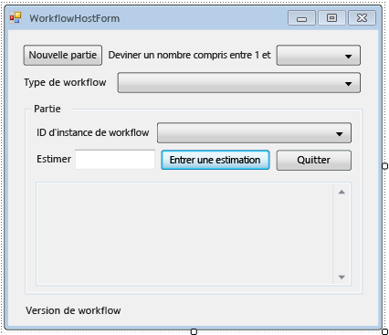

# <a name="how-to-create-and-run-a-long-running-workflow"></a>Procédure : créer et exécuter un workflow de longue durée
L'une des fonctionnalités centrales de [!INCLUDE[wf](../../../includes/wf-md.md)] est la capacité de l'exécution à rendre persistants et à décharger les workflows inactifs dans une base de données. Les étapes de [Comment : exécuter un Workflow](../../../docs/framework/windows-workflow-foundation/how-to-run-a-workflow.md) démontré les principes fondamentaux de l’hébergement de flux de travail à l’aide d’une application console. Des exemples de démarrage de workflow, gestionnaires de cycle de vie de workflow et de reprise des signets ont été donnés. Pour illustrer la persistance de workflow efficacement, un hôte de workflow plus complexe est nécessaire, prenant en charge le démarrage et la reprise de plusieurs instances de workflow. Cette étape du didacticiel explique comment créer une application hôte de formulaire Windows qui prend en charge le démarrage et la reprise de plusieurs instances de workflow, la persistance de workflow, et constitue une base pour les fonctionnalités avancées telles que le suivi et le versioning qui sont expliquées dans les étapes suivantes du didacticiel.  
  
> [!NOTE]
>  Cette étape du didacticiel et les étapes suivantes utilisent les trois types de flux de travail à partir de [Comment : créer un flux de travail](../../../docs/framework/windows-workflow-foundation/how-to-create-a-workflow.md). Si vous n’avez pas effectué les trois types, vous pouvez télécharger une version complète des étapes à partir de [Windows Workflow Foundation (WF45) - didacticiel de mise en route](http://go.microsoft.com/fwlink/?LinkID=248976).  
  
> [!NOTE]
>  Pour télécharger une version complète ou consulter une procédure pas à pas vidéo du didacticiel, consultez [Windows Workflow Foundation (WF45) - didacticiel de mise en route](http://go.microsoft.com/fwlink/?LinkID=248976).  
  
## <a name="in-this-topic"></a>Dans cette rubrique  
  
-   [Pour créer la base de données de persistance](../../../docs/framework/windows-workflow-foundation/how-to-create-and-run-a-long-running-workflow.md#BKMK_CreatePersistenceDatabase)  
  
-   [Pour ajouter la référence aux assemblys DurableInstancing](../../../docs/framework/windows-workflow-foundation/how-to-create-and-run-a-long-running-workflow.md#BKMK_AddReference)  
  
-   [Pour créer le formulaire hôte de flux de travail](../../../docs/framework/windows-workflow-foundation/how-to-create-and-run-a-long-running-workflow.md#BKMK_CreateForm)  
  
-   [Pour ajouter les propriétés et méthodes d’assistance de l’écran](../../../docs/framework/windows-workflow-foundation/how-to-create-and-run-a-long-running-workflow.md#BKMK_AddHelperMethods)  
  
-   [Pour configurer le magasin d’instances, les gestionnaires de cycle de vie de workflow et les extensions](../../../docs/framework/windows-workflow-foundation/how-to-create-and-run-a-long-running-workflow.md#BKMK_ConfigureWorkflowApplication)  
  
-   [Pour activer le démarrage et la reprise de plusieurs types de flux de travail](../../../docs/framework/windows-workflow-foundation/how-to-create-and-run-a-long-running-workflow.md#BKMK_WorkflowVersionMap)  
  
-   [Pour démarrer un nouveau flux de travail](../../../docs/framework/windows-workflow-foundation/how-to-create-and-run-a-long-running-workflow.md#BKMK_StartWorkflow)  
  
-   [Pour reprendre un workflow](../../../docs/framework/windows-workflow-foundation/how-to-create-and-run-a-long-running-workflow.md#BKMK_ResumeWorkflow)  
  
-   [Pour mettre fin à un flux de travail](../../../docs/framework/windows-workflow-foundation/how-to-create-and-run-a-long-running-workflow.md#BKMK_TerminateWorkflow)  
  
-   [Pour générer et exécuter l’application](../../../docs/framework/windows-workflow-foundation/how-to-create-and-run-a-long-running-workflow.md#BKMK_BuildAndRun)  
  
###  <a name="BKMK_CreatePersistenceDatabase"></a>Pour créer la base de données de persistance  
  
1.  Ouvrez SQL Server Management Studio et connectez-vous au serveur local, par exemple **. \SQLEXPRESS**. Cliquez sur le **bases de données** nœud sur le serveur local, puis sélectionnez **nouvelle base de données**. Nom de la nouvelle base de données **WF45GettingStartedTutorial**, acceptez toutes les autres valeurs, puis sélectionnez **OK**.  
  
    > [!NOTE]
    >  Assurez-vous d’avoir **Create Database** autorisation sur le serveur local avant de créer la base de données.  
  
2.  Choisissez **ouvrir**, **fichier** à partir de la **fichier** menu. Accédez au dossier suivant : `C:\Windows\Microsoft.NET\Framework\4.0.30319\sql\en`  
  
     Sélectionnez les deux fichiers suivants et cliquez sur **ouvrir**.  
  
    -   SqlWorkflowInstanceStoreLogic.sql  
  
    -   SqlWorkflowInstanceStoreSchema.sql  
  
3.  Choisissez **SqlWorkflowInstanceStoreSchema.sql** à partir de la **fenêtre** menu. Vérifiez que **WF45GettingStartedTutorial** est sélectionné dans le **bases de données disponibles** liste déroulante et choisissez **Execute** à partir de la **requête**menu.  
  
4.  Choisissez **SqlWorkflowInstanceStoreLogic.sql** à partir de la **fenêtre** menu. Vérifiez que **WF45GettingStartedTutorial** est sélectionné dans le **bases de données disponibles** liste déroulante et choisissez **Execute** à partir de la **requête**menu.  
  
    > [!WARNING]
    >  Il est important d'effectuer les deux étapes précédentes dans l'ordre approprié. Si les requêtes ne sont pas exécutées dans l'ordre, des erreurs se produisent et la base de données de persistance n'est pas configurée correctement.  
  
###  <a name="BKMK_AddReference"></a>Pour ajouter la référence aux assemblys DurableInstancing  
  
1.  Avec le bouton droit **NumberGuessWorkflowHost** dans **l’Explorateur de solutions** et sélectionnez **ajouter une référence**.  
  
2.  Sélectionnez **assemblys** à partir de la **ajouter une référence** liste et tapez `DurableInstancing` dans le **rechercher des assemblys** boîte. Cette opération filtre les assemblys et facilite la sélection des références souhaitées.  
  
3.  Cochez la case en regard de **System.Activities.DurableInstancing** et **System.Runtime.DurableInstancing** à partir de la **résultats de la recherche** liste, puis cliquez sur **OK**.  
  
###  <a name="BKMK_CreateForm"></a>Pour créer le formulaire hôte de flux de travail  
  
> [!NOTE]
>  Les étapes de cette procédure expliquent comment ajouter et configurer le formulaire manuellement. Si vous le souhaitez, téléchargez les fichiers solution pour le didacticiel et ajoutez le formulaire rempli au projet. Pour télécharger les fichiers du didacticiel, consultez [Windows Workflow Foundation (WF45) - didacticiel de mise en route](http://go.microsoft.com/fwlink/?LinkID=248976). Avec le bouton droit une fois que les fichiers sont téléchargés, **NumberGuessWorkflowHost** et choisissez **ajouter une référence**. Ajoutez une référence à **System.Windows.Forms** et **System.Drawing**. Ces références sont ajoutées automatiquement si vous ajoutez un nouveau formulaire à partir de la **ajouter**, **un nouvel élément** menu, mais doivent être ajoutés manuellement lors de l’importation d’un formulaire. Avec le bouton droit une fois que les références sont ajoutées, **NumberGuessWorkflowHost** dans **l’Explorateur de solutions** et choisissez **ajouter**, **élément existant**. Accédez à la `Form` dossier des fichiers de projet, sélectionnez **WorkflowHostForm.cs** (ou **WorkflowHostForm.vb**), puis cliquez sur **ajouter**. Si vous choisissez d’importer le formulaire, puis passez à la section suivante, [pour ajouter les propriétés et méthodes d’assistance sous la forme](../../../docs/framework/windows-workflow-foundation/how-to-create-and-run-a-long-running-workflow.md#BKMK_AddHelperMethods).  
  
1.  Avec le bouton droit **NumberGuessWorkflowHost** dans **l’Explorateur de solutions** et choisissez **ajouter**, **un nouvel élément**.  
  
2.  Dans le **installé** modèles, choisissez **Windows Form**, type `WorkflowHostForm` dans les **nom** , puis cliquez sur **ajouter**.  
  
3.  Configurez les propriétés suivantes sur le formulaire.  
  
    |Propriété|Valeur|  
    |--------------|-----------|  
    |FormBorderStyle|FixedSingle|  
    |MaximizeBox|False|  
    |Taille|400, 420|  
  
4.  Ajoutez les contrôles suivants au formulaire dans l'ordre spécifié et configurez les propriétés selon les instructions.  
  
    |Contrôle|Propriété : valeur|  
    |-------------|---------------------|  
    |**Button**|Nom : NewGame<br /><br /> Emplacement : 13, 13<br /><br /> Taille : 75, 23<br /><br /> Texte : Nouvelle partie|  
    |**Label**|Emplacement : 94, 18<br /><br /> Texte : Deviner un nombre compris entre 1 et|  
    |**ComboBox**|Nom : NumberRange<br /><br /> DropDownStyle : DropDownList<br /><br /> Éléments : 10, 100 et 1000<br /><br /> Emplacement : 228, 12<br /><br /> Taille : 143, 21|  
    |**Label**|Emplacement : 13, 43<br /><br /> Texte : Type de flux de travail|  
    |**ComboBox**|Nom : WorkflowType<br /><br /> DropDownStyle : DropDownList<br /><br /> Éléments : StateMachineNumberGuessWorkflow, FlowchartNumberGuessWorkflow, SequentialNumberGuessWorkflow<br /><br /> Emplacement : 94, 40<br /><br /> Taille : 277, 21|  
    |**Label**|Nom : WorkflowVersion<br /><br /> Emplacement : 13, 362<br /><br /> Texte : Version de flux de travail|  
    |**GroupBox**|Emplacement : 13, 67<br /><br /> Taille : 358, 287<br /><br /> Texte : jeu|  
  
    > [!NOTE]
    >  Lorsque vous ajoutez les contrôles suivants, placez-les dans la zone de groupe.  
  
    |Contrôle|Propriété : valeur|  
    |-------------|---------------------|  
    |**Label**|Emplacement : 7, 20<br /><br /> Texte : Id d’Instance de flux de travail|  
    |**ComboBox**|Nom : InstanceId<br /><br /> DropDownStyle : DropDownList<br /><br /> Emplacement : 121, 17<br /><br /> Taille : 227, 21|  
    |**Label**|Emplacement : 7, 47<br /><br /> Texte : deviner|  
    |**TextBox**|Nom : deviner<br /><br /> Emplacement : 50, 44<br /><br /> Taille : 65, 20|  
    |**Button**|Nom : EnterGuess<br /><br /> Emplacement : 121, 42<br /><br /> Taille : 75, 23<br /><br /> Texte : Entrez la proposition|  
    |**Button**|Nom : QuitGame<br /><br /> Emplacement : 274, 42<br /><br /> Taille : 75, 23<br /><br /> Texte : quitter|  
    |**TextBox**|Nom : WorkflowStatus<br /><br /> Emplacement : 10, 73<br /><br /> Multiline : True<br /><br /> En lecture seule : True<br /><br /> Barres de défilement : Vertical<br /><br /> Taille : 338, 208|  
  
5.  Définir le **AcceptButton** propriété du formulaire **EnterGuess**.  
  
 L'exemple suivant illustre le formulaire terminé.  
  
   
  
###  <a name="BKMK_AddHelperMethods"></a>Pour ajouter les propriétés et méthodes d’assistance de l’écran  
 La procédure de cette section permet d'ajouter des propriétés et des méthodes d'assistance à la classe de formulaire qui configure l'interface utilisateur du formulaire pour prendre en charge l'exécution et la reprise des workflows d'estimation.  
  
1.  Avec le bouton droit **WorkflowHostForm** dans **l’Explorateur de solutions** et choisissez **afficher le Code**.  
  
2.  Ajoutez les instructions `using` (ou `Imports`) suivantes au début du fichier avec les autres instructions `using` (ou `Imports`).  
  
    ```vb  
    Imports System.Windows.Forms  
    Imports System.Activities.DurableInstancing  
    Imports System.Activities  
    Imports System.Data.SqlClient  
    Imports System.IO  
    ```  
  
    ```csharp  
    using System.Windows.Forms;  
    using System.Activities.DurableInstancing;  
    using System.Activities;  
    using System.Data.SqlClient;  
    using System.IO;  
    ```  
  
3.  Ajoutez les déclarations de membre suivantes à la **WorkflowHostForm** classe.  
  
    ```vb  
    Const connectionString = "Server=.\SQLEXPRESS;Initial Catalog=WF45GettingStartedTutorial;Integrated Security=SSPI"  
    Dim store As SqlWorkflowInstanceStore  
    Dim WorkflowStarting As Boolean  
    ```  
  
    ```csharp  
    const string connectionString = "Server=.\\SQLEXPRESS;Initial Catalog=WF45GettingStartedTutorial;Integrated Security=SSPI";  
    SqlWorkflowInstanceStore store;  
    bool WorkflowStarting;  
    ```  
  
    > [!NOTE]
    >  Si votre chaîne de connexion est différente, mettez à jour `connectionString` pour faire référence à votre base de données.  
  
4.  Ajoutez une propriété `WorkflowInstanceId` à la classe `WorkflowFormHost`.  
  
    ```vb  
    Public ReadOnly Property WorkflowInstanceId() As Guid  
        Get  
            If InstanceId.SelectedIndex = -1 Then  
                Return Guid.Empty  
            Else  
                Return New Guid(InstanceId.SelectedItem.ToString())  
            End If  
        End Get  
    End Property  
    ```  
  
    ```csharp  
    public Guid WorkflowInstanceId  
    {  
        get  
        {  
            return InstanceId.SelectedIndex == -1 ? Guid.Empty : (Guid)InstanceId.SelectedItem;  
        }  
    }  
    ```  
  
     Le `InstanceId` zone de liste déroulante affiche la liste des ID d’instance de workflow persistantes et le `WorkflowInstanceId` propriété retourne le flux de travail actuellement sélectionné.  
  
5.  Ajoutez un gestionnaire pour l'événement `Load` du formulaire. Pour ajouter le gestionnaire, basculez vers **mode** pour le formulaire, cliquez sur le **événements** icône en haut de la **propriétés** fenêtre, puis double-cliquez sur **charge**.  
  
    ```vb  
    Private Sub WorkflowHostForm_Load(sender As Object, e As EventArgs) Handles Me.Load  
  
    End Sub  
    ```  
  
    ```csharp  
    private void WorkflowHostForm_Load(object sender, EventArgs e)  
    {  
  
    }  
    ```  
  
6.  Ajoutez le code suivant à `WorkflowHostForm_Load`.  
  
    ```vb  
    'Initialize the store and configure it so that it can be used for  
    'multiple WorkflowApplication instances.  
    store = New SqlWorkflowInstanceStore(connectionString)  
    WorkflowApplication.CreateDefaultInstanceOwner(store, Nothing, WorkflowIdentityFilter.Any)  
  
    'Set default ComboBox selections.  
    NumberRange.SelectedIndex = 0  
    WorkflowType.SelectedIndex = 0  
  
    ListPersistedWorkflows()  
    ```  
  
    ```csharp  
    // Initialize the store and configure it so that it can be used for  
    // multiple WorkflowApplication instances.  
    store = new SqlWorkflowInstanceStore(connectionString);  
    WorkflowApplication.CreateDefaultInstanceOwner(store, null, WorkflowIdentityFilter.Any);  
  
    // Set default ComboBox selections.  
    NumberRange.SelectedIndex = 0;  
    WorkflowType.SelectedIndex = 0;  
  
    ListPersistedWorkflows();  
    ```  
  
     Lors du chargement du formulaire, `SqlWorkflowInstanceStore` est configuré, les zones de liste déroulante de plage et de type de workflow ont les valeurs par défaut, et les instances persistantes de workflow sont ajoutées à la zone de liste modifiable `InstanceId`.  
  
7.  Ajoutez un gestionnaire `SelectedIndexChanged` pour `InstanceId`. Pour ajouter le gestionnaire, basculez vers **mode** pour le formulaire, sélectionnez le `InstanceId` zone de liste déroulante, cliquez sur le **événements** icône en haut de la **propriétés** fenêtre, et Double-cliquez sur **SelectedIndexChanged**.  
  
    ```vb  
    Private Sub InstanceId_SelectedIndexChanged(sender As Object, e As EventArgs) Handles InstanceId.SelectedIndexChanged  
  
    End Sub  
    ```  
  
    ```csharp  
    private void InstanceId_SelectedIndexChanged(object sender, EventArgs e)  
    {  
  
    }  
    ```  
  
8.  Ajoutez le code suivant à `InstanceId_SelectedIndexChanged`. Chaque fois que l'utilisateur sélectionne un workflow à l'aide de la zone de liste modifiable, ce gestionnaire met à jour la fenêtre d'état.  
  
    ```vb  
    If InstanceId.SelectedIndex = -1 Then  
        Return  
    End If  
  
    'Clear the status window.  
    WorkflowStatus.Clear()  
  
    'Get the workflow version and display it.  
    'If the workflow is just starting then this info will not  
    'be available in the persistence store so do not try and retrieve it.  
    If Not WorkflowStarting Then  
        Dim instance As WorkflowApplicationInstance = _  
            WorkflowApplication.GetInstance(WorkflowInstanceId, store)  
  
        WorkflowVersion.Text = _  
            WorkflowVersionMap.GetIdentityDescription(instance.DefinitionIdentity)  
  
        'Unload the instance.  
        instance.Abandon()  
    End If  
    ```  
  
    ```csharp  
    if (InstanceId.SelectedIndex == -1)  
    {  
        return;  
    }  
  
    // Clear the status window.  
    WorkflowStatus.Clear();  
  
    // Get the workflow version and display it.  
    // If the workflow is just starting then this info will not  
    // be available in the persistence store so do not try and retrieve it.  
    if (!WorkflowStarting)  
    {  
        WorkflowApplicationInstance instance =  
            WorkflowApplication.GetInstance(this.WorkflowInstanceId, store);  
  
        WorkflowVersion.Text =  
            WorkflowVersionMap.GetIdentityDescription(instance.DefinitionIdentity);  
  
        // Unload the instance.  
        instance.Abandon();  
    }  
    ```  
  
9. Ajoutez la méthode `ListPersistedWorkflows` suivante à la classe de formulaire.  
  
    ```vb  
    Private Sub ListPersistedWorkflows()  
        Using localCon As New SqlConnection(connectionString)  
            Dim localCmd As String = _  
                "Select [InstanceId] from [System.Activities.DurableInstancing].[Instances] Order By [CreationTime]"  
  
            Dim cmd As SqlCommand = localCon.CreateCommand()  
            cmd.CommandText = localCmd  
            localCon.Open()  
            Using reader As SqlDataReader = cmd.ExecuteReader(CommandBehavior.CloseConnection)  
  
                While (reader.Read())  
                    'Get the InstanceId of the persisted Workflow.  
                    Dim id As Guid = Guid.Parse(reader(0).ToString())  
                    InstanceId.Items.Add(id)  
                End While  
            End Using  
        End Using  
    End Sub  
    ```  
  
    ```csharp  
    using (SqlConnection localCon = new SqlConnection(connectionString))  
    {  
        string localCmd =  
            "Select [InstanceId] from [System.Activities.DurableInstancing].[Instances] Order By [CreationTime]";  
  
        SqlCommand cmd = localCon.CreateCommand();  
        cmd.CommandText = localCmd;  
        localCon.Open();  
        using (SqlDataReader reader = cmd.ExecuteReader(CommandBehavior.CloseConnection))  
        {  
            while (reader.Read())  
            {  
                // Get the InstanceId of the persisted Workflow  
                Guid id = Guid.Parse(reader[0].ToString());  
                InstanceId.Items.Add(id);  
            }  
        }  
    }  
    ```  
  
     `ListPersistedWorkflows` interroge le magasin d'instances pour les instances persistantes de workflow, et ajoute les ID d'instance à la zone de liste modifiable `cboInstanceId`.  
  
10. Ajoutez la méthode `UpdateStatus` suivante et le délégué correspondant à la classe de formulaire. Cette méthode met à jour la fenêtre d'état du formulaire avec l'état du workflow en cours d'exécution.  
  
    ```vb  
    Private Delegate Sub UpdateStatusDelegate(msg As String)  
    Public Sub UpdateStatus(msg As String)  
        'We may be on a different thread so we need to  
        'make this call using BeginInvoke.  
        If InvokeRequired Then  
            BeginInvoke(New UpdateStatusDelegate(AddressOf UpdateStatus), msg)  
        Else  
            If Not msg.EndsWith(vbCrLf) Then  
                msg = msg & vbCrLf  
            End If  
  
            WorkflowStatus.AppendText(msg)  
  
            'Ensure that the newly added status is visible.  
            WorkflowStatus.SelectionStart = WorkflowStatus.Text.Length  
            WorkflowStatus.ScrollToCaret()  
        End If  
    End Sub  
    ```  
  
    ```csharp  
    private delegate void UpdateStatusDelegate(string msg);  
    public void UpdateStatus(string msg)  
    {  
        // We may be on a different thread so we need to  
        // make this call using BeginInvoke.  
        if (InvokeRequired)  
        {  
            BeginInvoke(new UpdateStatusDelegate(UpdateStatus), msg);  
        }  
        else  
        {  
            if (!msg.EndsWith("\r\n"))  
            {  
                msg += "\r\n";  
            }  
            WorkflowStatus.AppendText(msg);  
  
            WorkflowStatus.SelectionStart = WorkflowStatus.Text.Length;  
            WorkflowStatus.ScrollToCaret();  
        }  
    }  
    ```  
  
11. Ajoutez la méthode `GameOver` suivante et le délégué correspondant à la classe de formulaire. Quand un flux de travail se termine, cette méthode met à jour l’interface utilisateur du formulaire en supprimant l’id d’instance de flux de travail terminé à partir de la **InstanceId** zone de liste déroulante.  
  
    ```vb  
    Private Delegate Sub GameOverDelegate()  
    Private Sub GameOver()  
        If InvokeRequired Then  
            BeginInvoke(New GameOverDelegate(AddressOf GameOver))  
        Else  
            'Remove this instance from the InstanceId combo box.  
            InstanceId.Items.Remove(InstanceId.SelectedItem)  
            InstanceId.SelectedIndex = -1  
        End If  
    End Sub  
    ```  
  
    ```csharp  
    private delegate void GameOverDelegate();  
    private void GameOver()  
    {  
        if (InvokeRequired)  
        {  
            BeginInvoke(new GameOverDelegate(GameOver));  
        }  
        else  
        {  
            // Remove this instance from the combo box  
            InstanceId.Items.Remove(InstanceId.SelectedItem);  
            InstanceId.SelectedIndex = -1;  
        }  
    }  
    ```  
  
###  <a name="BKMK_ConfigureWorkflowApplication"></a>Pour configurer le magasin d’instances, les gestionnaires de cycle de vie de workflow et les extensions  
  
1.  Ajoutez une méthode `ConfigureWorkflowApplication` à la classe de formulaire.  
  
    ```vb  
    Private Sub ConfigureWorkflowApplication(wfApp As WorkflowApplication)  
  
    End Sub  
    ```  
  
    ```csharp  
    private void ConfigureWorkflowApplication(WorkflowApplication wfApp)  
    {      
    }  
    ```  
  
     Cette méthode configure `WorkflowApplication`, ajoute les extensions souhaitées, et ajoute des gestionnaires pour les événements de cycle de vie de workflow.  
  
2.  Dans `ConfigureWorkflowApplication`, spécifiez le `SqlWorkflowInstanceStore` pour `WorkflowApplication`.  
  
    ```vb  
    'Configure the persistence store.  
    wfApp.InstanceStore = store  
    ```  
  
    ```csharp  
    // Configure the persistence store.  
    wfApp.InstanceStore = store;  
    ```  
  
3.  Ensuite, créez une instance de `StringWriter` et ajoutez-la à la collection `Extensions` de `WorkflowApplication`. Lorsqu’un `StringWriter` est ajoutée aux extensions, il capture toutes les `WriteLine` sortie d’activité. Lorsque le workflow devient inactif, la sortie de `WriteLine` peut être récupérée à partir de `StringWriter` et s'afficher sur le formulaire.  
  
    ```vb  
    'Add a StringWriter to the extensions. This captures the output  
    'from the WriteLine activities so we can display it in the form.  
    Dim sw As New StringWriter()  
    wfApp.Extensions.Add(sw)  
    ```  
  
    ```csharp  
    // Add a StringWriter to the extensions. This captures the output  
    // from the WriteLine activities so we can display it in the form.  
    StringWriter sw = new StringWriter();  
    wfApp.Extensions.Add(sw);  
    ```  
  
4.  Ajoutez le gestionnaire suivant pour l'événement `Completed`. Lorsqu'un workflow se termine correctement, le nombre de tours utilisés pour deviner le nombre est affiché dans la fenêtre d'état. Si le workflow se termine, les informations sur les exceptions qui ont provoqué l'arrêt sont affichées. À la fin du gestionnaire, la méthode `GameOver` est appelée, ce qui supprime le workflow terminé de la liste de workflow.  
  
    ```vb  
    wfApp.Completed = _  
        Sub(e As WorkflowApplicationCompletedEventArgs)  
            If e.CompletionState = ActivityInstanceState.Faulted Then  
                UpdateStatus(String.Format("Workflow Terminated. Exception: {0}" & vbCrLf & "{1}", _  
                    e.TerminationException.GetType().FullName, _  
                    e.TerminationException.Message))  
            ElseIf e.CompletionState = ActivityInstanceState.Canceled Then  
                UpdateStatus("Workflow Canceled.")  
            Else  
                Dim Turns As Integer = Convert.ToInt32(e.Outputs("Turns"))  
                UpdateStatus(String.Format("Congratulations, you guessed the number in {0} turns.", Turns))  
            End If  
            GameOver()  
        End Sub  
    ```  
  
    ```csharp  
    wfApp.Completed = delegate(WorkflowApplicationCompletedEventArgs e)  
    {  
        if (e.CompletionState == ActivityInstanceState.Faulted)  
        {  
            UpdateStatus(string.Format("Workflow Terminated. Exception: {0}\r\n{1}",  
                e.TerminationException.GetType().FullName,  
                e.TerminationException.Message));  
        }  
        else if (e.CompletionState == ActivityInstanceState.Canceled)  
        {  
            UpdateStatus("Workflow Canceled.");  
        }  
        else  
        {  
            int Turns = Convert.ToInt32(e.Outputs["Turns"]);  
            UpdateStatus(string.Format("Congratulations, you guessed the number in {0} turns.", Turns));  
        }  
        GameOver();  
    };  
    ```  
  
5.  Ajoutez les gestionnaires `Aborted` et `OnUnhandledException` suivants. La méthode `GameOver` n'est pas appelée à partir du gestionnaire `Aborted`, car lorsqu'une instance du workflow est interrompue, elle ne se termine pas, et il est possible de reprendre l'instance ultérieurement.  
  
    ```vb  
    wfApp.Aborted = _  
        Sub(e As WorkflowApplicationAbortedEventArgs)  
            UpdateStatus(String.Format("Workflow Aborted. Exception: {0}" & vbCrLf & "{1}", _  
                e.Reason.GetType().FullName, _  
                e.Reason.Message))  
        End Sub  
  
    wfApp.OnUnhandledException = _  
        Function(e As WorkflowApplicationUnhandledExceptionEventArgs)  
            UpdateStatus(String.Format("Unhandled Exception: {0}" & vbCrLf & "{1}", _  
                e.UnhandledException.GetType().FullName, _  
                e.UnhandledException.Message))  
            GameOver()  
            Return UnhandledExceptionAction.Terminate  
        End Function  
    ```  
  
    ```csharp  
    wfApp.Aborted = delegate(WorkflowApplicationAbortedEventArgs e)  
    {  
        UpdateStatus(string.Format("Workflow Aborted. Exception: {0}\r\n{1}",  
                e.Reason.GetType().FullName,  
                e.Reason.Message));  
    };  
  
    wfApp.OnUnhandledException = delegate(WorkflowApplicationUnhandledExceptionEventArgs e)  
    {  
        UpdateStatus(string.Format("Unhandled Exception: {0}\r\n{1}",  
                e.UnhandledException.GetType().FullName,  
                e.UnhandledException.Message));  
        GameOver();  
        return UnhandledExceptionAction.Terminate;  
    };  
    ```  
  
6.  Ajoutez le gestionnaire `PersistableIdle` suivant. Ce gestionnaire extrait l'extension `StringWriter` ajoutée, récupère la sortie des activités `WriteLine`, et l'affiche dans la fenêtre d'état.  
  
    ```vb  
    wfApp.PersistableIdle = _  
        Function(e As WorkflowApplicationIdleEventArgs)  
            'Send the current WriteLine outputs to the status window.  
            Dim writers = e.GetInstanceExtensions(Of StringWriter)()  
            For Each writer In writers  
                UpdateStatus(writer.ToString())  
            Next  
            Return PersistableIdleAction.Unload  
        End Function  
    ```  
  
    ```csharp  
    wfApp.PersistableIdle = delegate(WorkflowApplicationIdleEventArgs e)  
    {  
        // Send the current WriteLine outputs to the status window.  
        var writers = e.GetInstanceExtensions<StringWriter>();  
        foreach (var writer in writers)  
        {  
            UpdateStatus(writer.ToString());  
        }  
        return PersistableIdleAction.Unload;  
    };  
    ```  
  
     L'énumération <xref:System.Activities.PersistableIdleAction> a trois valeurs : <xref:System.Activities.PersistableIdleAction.None>, <xref:System.Activities.PersistableIdleAction.Persist> et <xref:System.Activities.PersistableIdleAction.Unload>. <xref:System.Activities.PersistableIdleAction.Persist> entraîne la persistance du workflow, mais pas son déchargement. <xref:System.Activities.PersistableIdleAction.Unload> entraîne la persistance du workflow et son déchargement.  
  
     L'exemple suivant illustre la méthode `ConfigureWorkflowApplication` complète.  
  
    ```vb  
    Private Sub ConfigureWorkflowApplication(wfApp As WorkflowApplication)  
        'Configure the persistence store.  
        wfApp.InstanceStore = store  
  
        'Add a StringWriter to the extensions. This captures the output  
        'from the WriteLine activities so we can display it in the form.  
        Dim sw As New StringWriter()  
        wfApp.Extensions.Add(sw)  
  
        wfApp.Completed = _  
            Sub(e As WorkflowApplicationCompletedEventArgs)  
                If e.CompletionState = ActivityInstanceState.Faulted Then  
                    UpdateStatus(String.Format("Workflow Terminated. Exception: {0}" & vbCrLf & "{1}", _  
                        e.TerminationException.GetType().FullName, _  
                        e.TerminationException.Message))  
                ElseIf e.CompletionState = ActivityInstanceState.Canceled Then  
                    UpdateStatus("Workflow Canceled.")  
                Else  
                    Dim Turns As Integer = Convert.ToInt32(e.Outputs("Turns"))  
                    UpdateStatus(String.Format("Congratulations, you guessed the number in {0} turns.", Turns))  
                End If  
                GameOver()  
            End Sub  
  
        wfApp.Aborted = _  
            Sub(e As WorkflowApplicationAbortedEventArgs)  
                UpdateStatus(String.Format("Workflow Aborted. Exception: {0}" & vbCrLf & "{1}", _  
                    e.Reason.GetType().FullName, _  
                    e.Reason.Message))  
            End Sub  
  
        wfApp.OnUnhandledException = _  
            Function(e As WorkflowApplicationUnhandledExceptionEventArgs)  
                UpdateStatus(String.Format("Unhandled Exception: {0}" & vbCrLf & "{1}", _  
                    e.UnhandledException.GetType().FullName, _  
                    e.UnhandledException.Message))  
                GameOver()  
                Return UnhandledExceptionAction.Terminate  
            End Function  
  
        wfApp.PersistableIdle = _  
            Function(e As WorkflowApplicationIdleEventArgs)  
                'Send the current WriteLine outputs to the status window.  
                Dim writers = e.GetInstanceExtensions(Of StringWriter)()  
                For Each writer In writers  
                    UpdateStatus(writer.ToString())  
                Next  
                Return PersistableIdleAction.Unload  
            End Function  
    End Sub  
    ```  
  
    ```csharp  
    private void ConfigureWorkflowApplication(WorkflowApplication wfApp)  
    {  
        // Configure the persistence store.  
        wfApp.InstanceStore = store;  
  
        // Add a StringWriter to the extensions. This captures the output  
        // from the WriteLine activities so we can display it in the form.  
        StringWriter sw = new StringWriter();  
        wfApp.Extensions.Add(sw);  
  
        wfApp.Completed = delegate(WorkflowApplicationCompletedEventArgs e)  
        {  
            if (e.CompletionState == ActivityInstanceState.Faulted)  
            {  
                UpdateStatus(string.Format("Workflow Terminated. Exception: {0}\r\n{1}",  
                    e.TerminationException.GetType().FullName,  
                    e.TerminationException.Message));  
            }  
            else if (e.CompletionState == ActivityInstanceState.Canceled)  
            {  
                UpdateStatus("Workflow Canceled.");  
            }  
            else  
            {  
                int Turns = Convert.ToInt32(e.Outputs["Turns"]);  
                UpdateStatus(string.Format("Congratulations, you guessed the number in {0} turns.", Turns));  
            }  
            GameOver();  
        };  
  
        wfApp.Aborted = delegate(WorkflowApplicationAbortedEventArgs e)  
        {  
            UpdateStatus(string.Format("Workflow Aborted. Exception: {0}\r\n{1}",  
                    e.Reason.GetType().FullName,  
                    e.Reason.Message));  
        };  
  
        wfApp.OnUnhandledException = delegate(WorkflowApplicationUnhandledExceptionEventArgs e)  
        {  
            UpdateStatus(string.Format("Unhandled Exception: {0}\r\n{1}",  
                    e.UnhandledException.GetType().FullName,  
                    e.UnhandledException.Message));  
            GameOver();  
            return UnhandledExceptionAction.Terminate;  
        };  
  
        wfApp.PersistableIdle = delegate(WorkflowApplicationIdleEventArgs e)  
        {  
            // Send the current WriteLine outputs to the status window.  
            var writers = e.GetInstanceExtensions<StringWriter>();  
            foreach (var writer in writers)  
            {  
                UpdateStatus(writer.ToString());  
            }  
            return PersistableIdleAction.Unload;  
        };  
    }  
    ```  
  
###  <a name="BKMK_WorkflowVersionMap"></a>Pour activer le démarrage et la reprise de plusieurs types de flux de travail  
 Afin de reprendre une instance de workflow, l'hôte doit fournir la définition du workflow. Dans ce didacticiel il existe trois types de workflow, et les étapes suivantes présentent plusieurs versions de ces types. `WorkflowIdentity` offre un moyen pour une application hôte d'associer les informations d'identification à une instance persistante de workflow. Les étapes de cette section expliquent comment créer une classe utilitaire pour assister le mappage de l'identité de workflow d'une instance persistante de workflow à la définition correspondante de workflow. [!INCLUDE[crabout](../../../includes/crabout-md.md)]`WorkflowIdentity` et le contrôle de version, consultez [à l’aide de WorkflowIdentity et du Versioning](../../../docs/framework/windows-workflow-foundation/using-workflowidentity-and-versioning.md).  
  
1.  Avec le bouton droit **NumberGuessWorkflowHost** dans **l’Explorateur de solutions** et choisissez **ajouter**, **classe**. Type `WorkflowVersionMap` dans les **nom** , puis cliquez sur **ajouter**.  
  
2.  Ajoutez les instructions `using` (ou `Imports`) suivantes au début du fichier avec les autres instructions `using` (ou `Imports`).  
  
    ```vb  
    Imports NumberGuessWorkflowActivities  
    Imports System.Activities  
    ```  
  
    ```csharp  
    using NumberGuessWorkflowActivities;  
    using System.Activities;  
    ```  
  
3.  Remplacez la déclaration de classe `WorkflowVersionMap` par la déclaration suivante.  
  
    ```vb  
    Public Module WorkflowVersionMap  
        Dim map As Dictionary(Of WorkflowIdentity, Activity)  
  
        'Current version identities.  
        Public StateMachineNumberGuessIdentity As WorkflowIdentity  
        Public FlowchartNumberGuessIdentity As WorkflowIdentity  
        Public SequentialNumberGuessIdentity As WorkflowIdentity  
  
        Sub New()  
            map = New Dictionary(Of WorkflowIdentity, Activity)  
  
            'Add the current workflow version identities.  
            StateMachineNumberGuessIdentity = New WorkflowIdentity With  
            {  
                .Name = "StateMachineNumberGuessWorkflow",  
                .Version = New Version(1, 0, 0, 0)  
            }  
  
            FlowchartNumberGuessIdentity = New WorkflowIdentity With  
            {  
                .Name = "FlowchartNumberGuessWorkflow",  
                .Version = New Version(1, 0, 0, 0)  
            }  
  
            SequentialNumberGuessIdentity = New WorkflowIdentity With  
            {  
                .Name = "SequentialNumberGuessWorkflow",  
                .Version = New Version(1, 0, 0, 0)  
            }  
  
            map.Add(StateMachineNumberGuessIdentity, New StateMachineNumberGuessWorkflow())  
            map.Add(FlowchartNumberGuessIdentity, New FlowchartNumberGuessWorkflow())  
            map.Add(SequentialNumberGuessIdentity, New SequentialNumberGuessWorkflow())  
        End Sub  
  
        Public Function GetWorkflowDefinition(identity As WorkflowIdentity) As Activity  
            Return map(identity)  
        End Function  
  
        Public Function GetIdentityDescription(identity As WorkflowIdentity) As String  
            Return identity.ToString()  
        End Function  
    End Module  
    ```  
  
    ```csharp  
    public static class WorkflowVersionMap  
    {  
        static Dictionary<WorkflowIdentity, Activity> map;  
  
        // Current version identities.  
        static public WorkflowIdentity StateMachineNumberGuessIdentity;  
        static public WorkflowIdentity FlowchartNumberGuessIdentity;  
        static public WorkflowIdentity SequentialNumberGuessIdentity;  
  
        static WorkflowVersionMap()  
        {  
            map = new Dictionary<WorkflowIdentity, Activity>();  
  
            // Add the current workflow version identities.  
            StateMachineNumberGuessIdentity = new WorkflowIdentity  
            {  
                Name = "StateMachineNumberGuessWorkflow",  
                Version = new Version(1, 0, 0, 0)  
            };  
  
            FlowchartNumberGuessIdentity = new WorkflowIdentity  
            {  
                Name = "FlowchartNumberGuessWorkflow",  
                Version = new Version(1, 0, 0, 0)  
            };  
  
            SequentialNumberGuessIdentity = new WorkflowIdentity  
            {  
                Name = "SequentialNumberGuessWorkflow",  
                Version = new Version(1, 0, 0, 0)  
            };  
  
            map.Add(StateMachineNumberGuessIdentity, new StateMachineNumberGuessWorkflow());  
            map.Add(FlowchartNumberGuessIdentity, new FlowchartNumberGuessWorkflow());  
            map.Add(SequentialNumberGuessIdentity, new SequentialNumberGuessWorkflow());  
        }  
  
        public static Activity GetWorkflowDefinition(WorkflowIdentity identity)  
        {  
            return map[identity];  
        }  
  
        public static string GetIdentityDescription(WorkflowIdentity identity)  
        {          
            return identity.ToString();  
       }  
    }  
    ```  
  
     `WorkflowVersionMap` contient trois identités de workflow mappées aux trois définitions de workflow de ce didacticiel et est utilisé dans les sections suivantes lorsque des workflow sont démarrés et repris.  
  
###  <a name="BKMK_StartWorkflow"></a>Pour démarrer un nouveau flux de travail  
  
1.  Ajoutez un gestionnaire `Click` pour `NewGame`. Pour ajouter le gestionnaire, basculez vers **mode** pour le formulaire, puis double-cliquez sur `NewGame`. Un gestionnaire `NewGame_Click` est ajouté et l'affichage bascule en mode Code pour le formulaire. Chaque fois que l'utilisateur clique sur ce bouton un nouveau workflow est démarré.  
  
    ```vb  
    Private Sub NewGame_Click(sender As Object, e As EventArgs) Handles NewGame.Click  
  
    End Sub  
    ```  
  
    ```csharp  
    private void NewGame_Click(object sender, EventArgs e)  
    {  
  
    }  
    ```  
  
2.  Ajoutez le code suivant au gestionnaire de clics. Ce code crée un dictionnaire d'arguments d'entrée du workflow, indexés par nom d'argument. Ce dictionnaire a une entrée qui contient la plage du nombre généré de manière aléatoire extrait de la zone de liste modifiable de plage.  
  
    ```vb  
    Dim inputs As New Dictionary(Of String, Object)()  
    inputs.Add("MaxNumber", Convert.ToInt32(NumberRange.SelectedItem))  
    ```  
  
    ```csharp  
    var inputs = new Dictionary<string, object>();  
    inputs.Add("MaxNumber", Convert.ToInt32(NumberRange.SelectedItem));  
    ```  
  
3.  Ensuite, ajoutez le code suivant qui démarre le workflow. `WorkflowIdentity` et la définition de workflow correspondant au type de workflow sélectionné sont récupérés à l'aide de la classe d'assistance `WorkflowVersionMap`. Ensuite, une nouvelle instance `WorkflowApplication` est créée à l'aide de la définition de workflow, `WorkflowIdentity`, et du dictionnaire d'arguments d'entrée.  
  
    ```vb  
    Dim identity As WorkflowIdentity = Nothing  
    Select Case WorkflowType.SelectedItem.ToString()  
        Case "SequentialNumberGuessWorkflow"  
            identity = WorkflowVersionMap.SequentialNumberGuessIdentity  
  
        Case "StateMachineNumberGuessWorkflow"  
            identity = WorkflowVersionMap.StateMachineNumberGuessIdentity  
  
        Case "FlowchartNumberGuessWorkflow"  
            identity = WorkflowVersionMap.FlowchartNumberGuessIdentity  
    End Select  
  
    Dim wf As Activity = WorkflowVersionMap.GetWorkflowDefinition(identity)  
  
    Dim wfApp = New WorkflowApplication(wf, inputs, identity)  
    ```  
  
    ```csharp  
    WorkflowIdentity identity = null;  
    switch (WorkflowType.SelectedItem.ToString())  
    {  
        case "SequentialNumberGuessWorkflow":  
            identity = WorkflowVersionMap.SequentialNumberGuessIdentity;  
            break;  
  
        case "StateMachineNumberGuessWorkflow":  
            identity = WorkflowVersionMap.StateMachineNumberGuessIdentity;  
            break;  
  
        case "FlowchartNumberGuessWorkflow":  
            identity = WorkflowVersionMap.FlowchartNumberGuessIdentity;  
            break;  
    };  
  
    Activity wf = WorkflowVersionMap.GetWorkflowDefinition(identity);  
  
    WorkflowApplication wfApp = new WorkflowApplication(wf, inputs, identity);  
    ```  
  
4.  Ensuite, ajoutez le code suivant qui ajoute le workflow à la liste de workflow et affiche les informations de version du workflow sur le formulaire.  
  
    ```vb  
    'Add the workflow to the list and display the version information.  
    WorkflowStarting = True  
    InstanceId.SelectedIndex = InstanceId.Items.Add(wfApp.Id)  
    WorkflowVersion.Text = identity.ToString()  
    WorkflowStarting = False  
    ```  
  
    ```csharp  
    // Add the workflow to the list and display the version information.  
    WorkflowStarting = true;  
    InstanceId.SelectedIndex = InstanceId.Items.Add(wfApp.Id);  
    WorkflowVersion.Text = identity.ToString();  
    WorkflowStarting = false;  
    ```  
  
5.  Appelez `ConfigureWorkflowApplication` pour configurer le magasin d'instances, les extensions et les gestionnaires du cycle de vie de workflow pour cette instance `WorkflowApplication`.  
  
    ```vb  
    'Configure the instance store, extensions, and   
    'workflow lifecycle handlers.  
    ConfigureWorkflowApplication(wfApp)  
    ```  
  
    ```csharp  
    // Configure the instance store, extensions, and   
    // workflow lifecycle handlers.  
    ConfigureWorkflowApplication(wfApp);  
    ```  
  
6.  Pour finir, appelez `Run`.  
  
    ```vb  
    'Start the workflow.  
    wfApp.Run()  
    ```  
  
    ```  
    // Start the workflow.  
    wfApp.Run();  
    ```  
  
     Cet exemple est le gestionnaire `NewGame_Click` terminé.  
  
    ```vb  
    Private Sub NewGame_Click(sender As Object, e As EventArgs) Handles NewGame.Click  
        'Start a new workflow.  
        Dim inputs As New Dictionary(Of String, Object)()  
        inputs.Add("MaxNumber", Convert.ToInt32(NumberRange.SelectedItem))  
  
        Dim identity As WorkflowIdentity = Nothing  
        Select Case WorkflowType.SelectedItem.ToString()  
            Case "SequentialNumberGuessWorkflow"  
                identity = WorkflowVersionMap.SequentialNumberGuessIdentity  
  
            Case "StateMachineNumberGuessWorkflow"  
                identity = WorkflowVersionMap.StateMachineNumberGuessIdentity  
  
            Case "FlowchartNumberGuessWorkflow"  
                identity = WorkflowVersionMap.FlowchartNumberGuessIdentity  
        End Select  
  
        Dim wf As Activity = WorkflowVersionMap.GetWorkflowDefinition(identity)  
  
        Dim wfApp = New WorkflowApplication(wf, inputs, identity)  
  
        'Add the workflow to the list and display the version information.  
        WorkflowStarting = True  
        InstanceId.SelectedIndex = InstanceId.Items.Add(wfApp.Id)  
        WorkflowVersion.Text = identity.ToString()  
        WorkflowStarting = False  
  
        'Configure the instance store, extensions, and   
        'workflow lifecycle handlers.  
        ConfigureWorkflowApplication(wfApp)  
  
        'Start the workflow.  
        wfApp.Run()  
    End Sub  
    ```  
  
    ```csharp  
    private void NewGame_Click(object sender, EventArgs e)  
    {  
        var inputs = new Dictionary<string, object>();  
        inputs.Add("MaxNumber", Convert.ToInt32(NumberRange.SelectedItem));  
  
        WorkflowIdentity identity = null;  
        switch (WorkflowType.SelectedItem.ToString())  
        {  
            case "SequentialNumberGuessWorkflow":  
                identity = WorkflowVersionMap.SequentialNumberGuessIdentity;  
                break;  
  
            case "StateMachineNumberGuessWorkflow":  
                identity = WorkflowVersionMap.StateMachineNumberGuessIdentity;  
                break;  
  
            case "FlowchartNumberGuessWorkflow":  
                identity = WorkflowVersionMap.FlowchartNumberGuessIdentity;  
                break;  
        };  
  
        Activity wf = WorkflowVersionMap.GetWorkflowDefinition(identity);  
  
        WorkflowApplication wfApp = new WorkflowApplication(wf, inputs, identity);  
  
        // Add the workflow to the list and display the version information.  
        WorkflowStarting = true;  
        InstanceId.SelectedIndex = InstanceId.Items.Add(wfApp.Id);  
        WorkflowVersion.Text = identity.ToString();  
        WorkflowStarting = false;  
  
        // Configure the instance store, extensions, and   
        // workflow lifecycle handlers.  
        ConfigureWorkflowApplication(wfApp);  
  
        // Start the workflow.  
        wfApp.Run();  
    }  
    ```  
  
###  <a name="BKMK_ResumeWorkflow"></a>Pour reprendre un workflow  
  
1.  Ajoutez un gestionnaire `Click` pour `EnterGuess`. Pour ajouter le gestionnaire, basculez vers **mode** pour le formulaire, puis double-cliquez sur `EnterGuess`. Chaque fois que l'utilisateur clique sur ce bouton un nouveau workflow reprend.  
  
    ```vb  
    Private Sub EnterGuess_Click(sender As Object, e As EventArgs) Handles EnterGuess.Click  
  
    End Sub  
    ```  
  
    ```csharp  
    private void EnterGuess_Click(object sender, EventArgs e)  
    {  
  
    }  
    ```  
  
2.  Ajoutez le code suivant pour vous assurer qu'un workflow est sélectionné dans la liste de workflow, et que l'estimation de l'utilisateur est valide.  
  
    ```vb  
    If WorkflowInstanceId = Guid.Empty Then  
        MessageBox.Show("Please select a workflow.")  
        Return  
    End If  
  
    Dim userGuess As Integer  
    If Not Int32.TryParse(Guess.Text, userGuess) Then  
        MessageBox.Show("Please enter an integer.")  
        Guess.SelectAll()  
        Guess.Focus()  
        Return  
    End If  
    ```  
  
    ```csharp  
    if (WorkflowInstanceId == Guid.Empty)  
    {  
        MessageBox.Show("Please select a workflow.");  
        return;  
    }  
  
    int guess;  
    if (!Int32.TryParse(Guess.Text, out guess))  
    {  
        MessageBox.Show("Please enter an integer.");  
        Guess.SelectAll();  
        Guess.Focus();  
        return;  
    }  
    ```  
  
3.  Ensuite, récupérez `WorkflowApplicationInstance` de l'instance persistante de workflow. `WorkflowApplicationInstance` représente une instance persistante de workflow qui n'a pas encore été associée à une définition de workflow. `DefinitionIdentity` de `WorkflowApplicationInstance` contient `WorkflowIdentity` de l'instance persistante de workflow. Dans ce didacticiel, la classe utilitaire `WorkflowVersionMap` est utilisée pour mapper `WorkflowIdentity` à la définition appropriée de workflow. Une fois que la définition de workflow est récupérée, `WorkflowApplication` est créé, à l'aide de la définition appropriée de workflow.  
  
    ```vb  
    Dim instance As WorkflowApplicationInstance = _  
        WorkflowApplication.GetInstance(WorkflowInstanceId, store)  
  
    'Use the persisted WorkflowIdentity to retrieve the correct workflow  
    'definition from the dictionary.  
    Dim wf As Activity = _  
        WorkflowVersionMap.GetWorkflowDefinition(instance.DefinitionIdentity)  
  
    'Associate the WorkflowApplication with the correct definition  
    Dim wfApp As WorkflowApplication = _  
        New WorkflowApplication(wf, instance.DefinitionIdentity)  
    ```  
  
    ```csharp  
    WorkflowApplicationInstance instance =  
        WorkflowApplication.GetInstance(WorkflowInstanceId, store);  
  
    // Use the persisted WorkflowIdentity to retrieve the correct workflow  
    // definition from the dictionary.  
    Activity wf =  
        WorkflowVersionMap.GetWorkflowDefinition(instance.DefinitionIdentity);  
  
    // Associate the WorkflowApplication with the correct definition  
    WorkflowApplication wfApp =  
        new WorkflowApplication(wf, instance.DefinitionIdentity);  
    ```  
  
4.  Une fois que `WorkflowApplication` est créé, configurez le magasin d'instances, les gestionnaires du cycle de vie de workflow et les extensions en appelant `ConfigureWorkflowApplication`. Ces étapes doivent être effectuées chaque fois qu'un nouveau`WorkflowApplication` est créé, et elles doivent être effectuées avant que l'instance de workflow ne soit chargée dans `WorkflowApplication`. Une fois que le workflow est chargé, il reprend à l'estimation de l'utilisateur.  
  
    ```vb  
    'Configure the extensions and lifecycle handlers.  
    'Do this before the instance is loaded. Once the instance is  
    'loaded it is too late to add extensions.  
    ConfigureWorkflowApplication(wfApp)  
  
    'Load the workflow.  
    wfApp.Load(instance)  
  
    'Resume the workflow.  
    wfApp.ResumeBookmark("EnterGuess", userGuess)  
    ```  
  
    ```csharp  
    // Configure the extensions and lifecycle handlers.  
    // Do this before the instance is loaded. Once the instance is  
    // loaded it is too late to add extensions.  
    ConfigureWorkflowApplication(wfApp);  
  
    // Load the workflow.  
    wfApp.Load(instance);  
  
    // Resume the workflow.  
    wfApp.ResumeBookmark("EnterGuess", guess);  
    ```  
  
5.  Enfin, effacez la zone de texte d'estimation et préparez le formulaire pour recevoir une autre estimation.  
  
    ```vb  
    'Clear the Guess textbox.  
    Guess.Clear()  
    Guess.Focus()  
    ```  
  
    ```csharp  
    // Clear the Guess textbox.  
    Guess.Clear();  
    Guess.Focus();  
    ```  
  
     Cet exemple est le gestionnaire `EnterGuess_Click` terminé.  
  
    ```vb  
    Private Sub EnterGuess_Click(sender As Object, e As EventArgs) Handles EnterGuess.Click  
        If WorkflowInstanceId = Guid.Empty Then  
            MessageBox.Show("Please select a workflow.")  
            Return  
        End If  
  
        Dim userGuess As Integer  
        If Not Int32.TryParse(Guess.Text, userGuess) Then  
            MessageBox.Show("Please enter an integer.")  
            Guess.SelectAll()  
            Guess.Focus()  
            Return  
        End If  
  
        Dim instance As WorkflowApplicationInstance = _  
            WorkflowApplication.GetInstance(WorkflowInstanceId, store)  
  
        'Use the persisted WorkflowIdentity to retrieve the correct workflow  
        'definition from the dictionary.  
        Dim wf As Activity = _  
            WorkflowVersionMap.GetWorkflowDefinition(instance.DefinitionIdentity)  
  
        'Associate the WorkflowApplication with the correct definition  
        Dim wfApp As WorkflowApplication = _  
            New WorkflowApplication(wf, instance.DefinitionIdentity)  
  
        'Configure the extensions and lifecycle handlers.  
        'Do this before the instance is loaded. Once the instance is  
        'loaded it is too late to add extensions.  
        ConfigureWorkflowApplication(wfApp)  
  
        'Load the workflow.  
        wfApp.Load(instance)  
  
        'Resume the workflow.  
        wfApp.ResumeBookmark("EnterGuess", userGuess)  
  
        'Clear the Guess textbox.  
        Guess.Clear()  
        Guess.Focus()  
    End Sub  
    ```  
  
    ```csharp  
    private void EnterGuess_Click(object sender, EventArgs e)  
    {  
        if (WorkflowInstanceId == Guid.Empty)  
        {  
            MessageBox.Show("Please select a workflow.");  
            return;  
        }  
  
        int guess;  
        if (!Int32.TryParse(Guess.Text, out guess))  
        {  
            MessageBox.Show("Please enter an integer.");  
            Guess.SelectAll();  
            Guess.Focus();  
            return;  
        }  
  
        WorkflowApplicationInstance instance =  
            WorkflowApplication.GetInstance(WorkflowInstanceId, store);  
  
        // Use the persisted WorkflowIdentity to retrieve the correct workflow  
        // definition from the dictionary.  
        Activity wf =  
            WorkflowVersionMap.GetWorkflowDefinition(instance.DefinitionIdentity);  
  
        // Associate the WorkflowApplication with the correct definition  
        WorkflowApplication wfApp =  
            new WorkflowApplication(wf, instance.DefinitionIdentity);  
  
        // Configure the extensions and lifecycle handlers.  
        // Do this before the instance is loaded. Once the instance is  
        // loaded it is too late to add extensions.  
        ConfigureWorkflowApplication(wfApp);  
  
        // Load the workflow.  
        wfApp.Load(instance);  
  
        // Resume the workflow.  
        wfApp.ResumeBookmark("EnterGuess", guess);  
  
        // Clear the Guess textbox.  
        Guess.Clear();  
        Guess.Focus();  
    }  
    ```  
  
###  <a name="BKMK_TerminateWorkflow"></a>Pour mettre fin à un flux de travail  
  
1.  Ajoutez un gestionnaire `Click` pour `QuitGame`. Pour ajouter le gestionnaire, basculez vers **mode** pour le formulaire, puis double-cliquez sur `QuitGame`. Chaque fois que l'utilisateur clique sur ce bouton le workflow actuellement sélectionné est terminé.  
  
    ```vb  
    Private Sub QuitGame_Click(sender As Object, e As EventArgs) Handles QuitGame.Click  
  
    End Sub  
    ```  
  
    ```csharp  
    private void QuitGame_Click(object sender, EventArgs e)  
    {  
  
    }  
    ```  
  
2.  Ajoutez le code suivant au gestionnaire `QuitGame_Click`. Ce code vérifie d'abord qu'un workflow est sélectionné dans la liste de workflow. Ensuite, il charge l'instance persistante dans `WorkflowApplicationInstance`, utilise `DefinitionIdentity` pour déterminer la définition appropriée de workflow, puis initialise `WorkflowApplication`. Ensuite, les extensions et les gestionnaires de cycle de vie de workflow sont configurés avec un appel à `ConfigureWorkflowApplication`. Une fois que `WorkflowApplication` est configuré, il est chargé, puis `Terminate` est appelé.  
  
    ```vb  
    If WorkflowInstanceId = Guid.Empty Then  
        MessageBox.Show("Please select a workflow.")  
        Return  
    End If  
  
    Dim instance As WorkflowApplicationInstance = _  
        WorkflowApplication.GetInstance(WorkflowInstanceId, store)  
  
    'Use the persisted WorkflowIdentity to retrieve the correct workflow  
    'definition from the dictionary.  
    Dim wf As Activity = WorkflowVersionMap.GetWorkflowDefinition(instance.DefinitionIdentity)  
  
    'Associate the WorkflowApplication with the correct definition.  
    Dim wfApp As WorkflowApplication = _  
        New WorkflowApplication(wf, instance.DefinitionIdentity)  
  
    'Configure the extensions and lifecycle handlers.  
    ConfigureWorkflowApplication(wfApp)  
  
    'Load the workflow.  
    wfApp.Load(instance)  
  
    'Terminate the workflow.  
    wfApp.Terminate("User resigns.")  
    ```  
  
    ```csharp  
    if (WorkflowInstanceId == Guid.Empty)  
    {  
        MessageBox.Show("Please select a workflow.");  
        return;  
    }  
  
    WorkflowApplicationInstance instance =  
        WorkflowApplication.GetInstance(WorkflowInstanceId, store);  
  
    // Use the persisted WorkflowIdentity to retrieve the correct workflow  
    // definition from the dictionary.  
    Activity wf = WorkflowVersionMap.GetWorkflowDefinition(instance.DefinitionIdentity);  
  
    // Associate the WorkflowApplication with the correct definition  
    WorkflowApplication wfApp =  
        new WorkflowApplication(wf, instance.DefinitionIdentity);  
  
    // Configure the extensions and lifecycle handlers  
    ConfigureWorkflowApplication(wfApp);  
  
    // Load the workflow.  
    wfApp.Load(instance);  
  
    // Terminate the workflow.  
    wfApp.Terminate("User resigns.");  
    ```  
  
###  <a name="BKMK_BuildAndRun"></a>Pour générer et exécuter l’application  
  
1.  Double-cliquez sur **Program.cs** (ou **Module1.vb**) dans **l’Explorateur de solutions** pour afficher le code.  
  
2.  Ajoutez l'instruction `using` (ou `Imports`) suivante au début du fichier avec les autres instructions `using` (ou `Imports`).  
  
    ```vb  
    Imports System.Windows.Forms  
    ```  
  
    ```csharp  
    using System.Windows.Forms;  
    ```  
  
3.  Supprimez ou commentez le code à partir d’hébergement de workflow existant [Comment : exécuter un Workflow](../../../docs/framework/windows-workflow-foundation/how-to-run-a-workflow.md)et remplacez-le par le code suivant.  
  
    ```vb  
    Sub Main()  
        Application.EnableVisualStyles()  
        Application.Run(New WorkflowHostForm())  
    End Sub  
    ```  
  
    ```csharp  
    static void Main(string[] args)  
    {  
        Application.EnableVisualStyles();  
        Application.Run(new WorkflowHostForm());  
    }  
    ```  
  
4.  Avec le bouton droit **NumberGuessWorkflowHost** dans **l’Explorateur de solutions** et choisissez **propriétés**. Dans le **Application** onglet, spécifiez **Application Windows** pour le **type de sortie**. Cette étape est facultative, mais si elle n'est pas suivie, la fenêtre de console s'affiche en plus du formulaire.  
  
5.  Appuyez sur Ctrl+Maj+B pour générer l'application.  
  
6.  Vérifiez que **NumberGuessWorkflowHost** est définie en tant que l’application de démarrage, puis appuyez sur Ctrl + F5 pour démarrer l’application.  
  
7.  Sélectionnez une plage pour le jeu de devinettes et le type de flux de travail à démarrer, puis cliquez sur **nouveau jeu**. Entrez une proposition dans la **estimation** , puis cliquez sur **accédez** pour soumettre votre proposition. Notez que la sortie des activités `WriteLine` s'affiche sur le formulaire.  
  
8.  Démarrer plusieurs flux de travail à l’aide de différents types de workflow et plages de nombres, entrez des propositions et basculer entre les flux de travail en sélectionnant à partir de la **Id d’Instance de flux de travail** liste.  
  
     Notez que lorsque vous basculez vers un nouveau workflow, les propositions précédentes et la progression du workflow ne s'affichent pas dans la fenêtre d'état. En effet, l'état n'est pas disponible, car il n'est pas capturé ni enregistré. Dans l’étape suivante du didacticiel, [Comment : créer un Participant de suivi personnalisé](../../../docs/framework/windows-workflow-foundation/how-to-create-a-custom-tracking-participant.md), vous créez un participant de suivi personnalisé qui enregistre ces informations.
