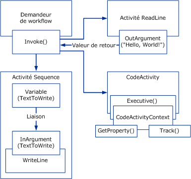

# Vue d'ensemble de Windows WorkflowWindows Workflow Overview
Un flux de travail est un ensemble d’unités élémentaires appelé *activités* qui sont stockés sous la forme d’un modèle qui décrit un processus réel.A workflow is a set of elemental units called *activities* that are stored as a model that describes a real-world process. Les workflows offrent un moyen de décrire l'ordre d'exécution et les relations de dépendance entre des éléments de travail de courte ou longue durée.Workflows provide a way of describing the order of execution and dependent relationships between pieces of short- or long-running work. Ce travail s'effectue à travers le modèle de démarrage à l'arrêt et les activités peuvent être exécutées par des utilisateurs ou par les fonctions système.This work passes through the model from start to finish, and activities might be executed by people or by system functions.  
  
## Moteur d'exécution de workflowWorkflow Run-time Engine  
 Chaque instance de workflow en cours d'exécution est créée et gérée par un moteur d'exécution in-process avec lequel le processus hôte interagit par le biais de l'un des éléments suivants :Every running workflow instance is created and maintained by an in-process run-time engine that the host process interacts with through one of the following:  
  
-   Un <xref:System.Activities.WorkflowInvoker>, qui appelle le workflow comme une méthode.A <xref:System.Activities.WorkflowInvoker>, which invokes the workflow like a method.  
  
-   Un <xref:System.Activities.WorkflowApplication> pour contrôler explicitement l'exécution d'une instance de workflow unique.A <xref:System.Activities.WorkflowApplication> for explicit control over the execution of a single workflow instance.  
  
-   Un <xref:System.ServiceModel.WorkflowServiceHost> pour les interactions basées sur des messages dans les scénarios à plusieurs instances.A <xref:System.ServiceModel.WorkflowServiceHost> for message-based interactions in multi-instance scenarios.  
  
 Chacune de ces classes encapsule le runtime de l'activité principale représenté en tant que <xref:System.Activities.ActivityInstance> responsable de l'exécution de l'activité.Each of these classes wraps the core activity runtime represented as a <xref:System.Activities.ActivityInstance> responsible for activity execution. Un domaine d'application peut comporter plusieurs objets <xref:System.Activities.ActivityInstance> fonctionnant simultanément.There can be several <xref:System.Activities.ActivityInstance> objects within an application domain running concurrently.  
  
 Chacun des trois objets d'interaction hôtes précédents est créé à partir d'une arborescence d'activités appelée programme de workflow.Each of the preceding three host interaction objects is created from a tree of activities referred to as a workflow program. À l'aide de ces types ou d'un hôte personnalisé qui encapsule <xref:System.Activities.ActivityInstance>, les workflows peuvent être exécutés à l'intérieur de n'importe quel processus Windows, notamment des applications console, des applications basées sur les formulaires, des services Windows, des sites Web [!INCLUDE[vstecasp](../../../includes/vstecasp-md.md)] et des services [!INCLUDE[indigo1](../../../includes/indigo1-md.md)].Using these types or a custom host that wraps <xref:System.Activities.ActivityInstance>, workflows can be executed inside any Windows process including console applications, forms-based applications, Windows Services, [!INCLUDE[vstecasp](../../../includes/vstecasp-md.md)] Web sites, and [!INCLUDE[indigo1](../../../includes/indigo1-md.md)]services.  
  
   
Composants de workflow dans le processus hôteWorkflow components in the host process  
  
## Interaction entre composants de workflowInteraction between Workflow Components  
 Le diagramme suivant montre comment les composants de workflow interagissent les uns avec les autres.The following diagram demonstrates how workflow components interact with one another.  
  
   
  
 Dans le diagramme précédent, la méthode <xref:System.Activities.WorkflowInvoker.Invoke%2A> de classe <xref:System.Activities.WorkflowInvoker> est utilisée pour appeler plusieurs instances de workflow.In the preceding diagram, the <xref:System.Activities.WorkflowInvoker.Invoke%2A> method of the <xref:System.Activities.WorkflowInvoker> class is used to invoke several workflow instances. <xref:System.Activities.WorkflowInvoker> est utilisé pour les workflows légers ne nécessitant pas de gestion à partir de l'hôte ; les workflows qui nécessitent d'être gérés à partir de l'hôte (tel qu'une reprise <xref:System.Activities.Bookmark>) doivent être exécutés avec <xref:System.Activities.WorkflowApplication.Run%2A> à la place.<xref:System.Activities.WorkflowInvoker> is used for lightweight workflows that do not need management from the host; workflows that need management from the host (such as <xref:System.Activities.Bookmark> resumption) must be executed using <xref:System.Activities.WorkflowApplication.Run%2A> instead. Il n'est pas nécessaire d'attendre qu'une instance de workflow soit terminée avant d'en appeler une autre ; le moteur de runtime prend en charge plusieurs instances de workflow simultanément.It isn’t required to wait for one workflow instance to complete before invoking another; the runtime engine supports running multiple workflow instances simultaneously.  Les workflows appelés sont les suivants :The workflows invoked are as follows:  
  
-   Une activité <xref:System.Activities.Statements.Sequence> qui contient une activité <xref:System.Activities.Statements.WriteLine> enfant.A <xref:System.Activities.Statements.Sequence> activity that contains a <xref:System.Activities.Statements.WriteLine> child activity. <xref:System.Activities.Variable> de l'activité parente est lié à un <xref:System.Activities.InArgument> de l'activité enfant.A <xref:System.Activities.Variable> of the parent activity is bound to an <xref:System.Activities.InArgument> of the child activity. [!INCLUDE[crabout](../../../includes/crabout-md.md)]sur les variables, arguments et la liaison, consultez [Variables et Arguments](../../../docs/framework/windows-workflow-foundation/variables-and-arguments.md). on variables, arguments, and binding, see [Variables and Arguments](../../../docs/framework/windows-workflow-foundation/variables-and-arguments.md).  
  
-   Une activité personnalisée appelée `ReadLine`.A custom activity called `ReadLine`. Un <xref:System.Activities.OutArgument> de l'activité `ReadLine` est retourné à la méthode  <xref:System.Activities.WorkflowInvoker.Invoke%2A> appelante.An <xref:System.Activities.OutArgument> of the `ReadLine` activity is returned to the calling <xref:System.Activities.WorkflowInvoker.Invoke%2A> method.  
  
-   Une activité personnalisée qui dérive de la classe abstraite <xref:System.Activities.CodeActivity>.A custom activity that derives from the <xref:System.Activities.CodeActivity> abstract class. Le <xref:System.Activities.CodeActivity> peut accéder aux fonctionnalités d'exécution (telles que le suivi et les propriétés) à l'aide du <xref:System.Activities.CodeActivityContext> qui est disponible en tant que paramètre de la méthode <xref:System.Activities.CodeActivity.Execute%2A>.The <xref:System.Activities.CodeActivity> can access run-time features (such as tracking and properties) using the <xref:System.Activities.CodeActivityContext> that is available as a parameter of the <xref:System.Activities.CodeActivity.Execute%2A> method. [!INCLUDE[crabout](../../../includes/crabout-md.md)]Ces fonctionnalités d’exécution, consultez [suivi et traçage de Workflow](../../../docs/framework/windows-workflow-foundation/workflow-tracking-and-tracing.md) et [propriétés d’exécution de Workflow](../../../docs/framework/windows-workflow-foundation/workflow-execution-properties.md). these run-time features, see [Workflow Tracking and Tracing](../../../docs/framework/windows-workflow-foundation/workflow-tracking-and-tracing.md) and [Workflow Execution Properties](../../../docs/framework/windows-workflow-foundation/workflow-execution-properties.md).  
  
## Voir aussiSee Also  
 [BizTalk Server 2006 ou WF ? Choix de l’outil de Workflow approprié pour votre projetBizTalk Server 2006 or WF? Choosing the Right Workflow Tool for Your Project](http://go.microsoft.com/fwlink/?LinkId=154901)
