# <a name="windows-workflow-foundation-4-performance"></a><span data-ttu-id="d81f0-102">Performances de Windows Workflow Foundation 4</span><span class="sxs-lookup"><span data-stu-id="d81f0-102">Windows Workflow Foundation 4 Performance</span></span>
<span data-ttu-id="d81f0-103">Dustin Metzgar</span><span class="sxs-lookup"><span data-stu-id="d81f0-103">Dustin Metzgar</span></span>  
  
 <span data-ttu-id="d81f0-104">Wenlong Dong</span><span class="sxs-lookup"><span data-stu-id="d81f0-104">Wenlong Dong</span></span>  
  
 <span data-ttu-id="d81f0-105">Microsoft Corporation, septembre 2010</span><span class="sxs-lookup"><span data-stu-id="d81f0-105">Microsoft Corporation, September 2010</span></span>  
  
 <span data-ttu-id="d81f0-106">Microsoft [!INCLUDE[netfx40_long](../../../includes/netfx40-long-md.md)] inclut une révision majeure de [!INCLUDE[wf](../../../includes/wf-md.md)] qui met l'accent sur les performances.</span><span class="sxs-lookup"><span data-stu-id="d81f0-106">Microsoft [!INCLUDE[netfx40_long](../../../includes/netfx40-long-md.md)] includes a major revision of the [!INCLUDE[wf](../../../includes/wf-md.md)] with heavy investments in performance.</span></span>  <span data-ttu-id="d81f0-107">Cette nouvelle révision introduit des modifications de conception importantes par rapport aux versions précédentes de [!INCLUDE[wf1](../../../includes/wf1-md.md)] livrées avec .NET Framework 3.0 et [!INCLUDE[netfx35_short](../../../includes/netfx35-short-md.md)].</span><span class="sxs-lookup"><span data-stu-id="d81f0-107">This new revision introduces significant design changes from the previous versions of [!INCLUDE[wf1](../../../includes/wf1-md.md)] that shipped as part of .NET Framework 3.0 and [!INCLUDE[netfx35_short](../../../includes/netfx35-short-md.md)].</span></span> <span data-ttu-id="d81f0-108">Elle a été remodelée à partir du modèle de programmation, du runtime et des outils de base afin d'améliorer considérablement ses performances et sa facilité d'utilisation.</span><span class="sxs-lookup"><span data-stu-id="d81f0-108">It has been re-architected from the core of the programming model, runtime, and tooling to greatly improve performance and usability.</span></span> <span data-ttu-id="d81f0-109">Cette rubrique décrit les caractéristiques de performances importantes de ces révisions et les compare avec celles de la version précédente.</span><span class="sxs-lookup"><span data-stu-id="d81f0-109">This topic shows the important performance characteristics of these revisions and compares them against those of the previous version.</span></span>  
  
 <span data-ttu-id="d81f0-110">Les performances des composants de workflow individuels ont augmenté considérablement entre WF3 et WF4.</span><span class="sxs-lookup"><span data-stu-id="d81f0-110">Individual workflow component performance has increased by orders of magnitude between WF3 and WF4.</span></span>  <span data-ttu-id="d81f0-111">Cela a permis de réduire grandement l'écart entre les services [!INCLUDE[indigo1](../../../includes/indigo1-md.md)] codés manuellement et les services de workflow [!INCLUDE[indigo2](../../../includes/indigo2-md.md)].</span><span class="sxs-lookup"><span data-stu-id="d81f0-111">This leaves the gap between hand-coded [!INCLUDE[indigo1](../../../includes/indigo1-md.md)] services and [!INCLUDE[indigo2](../../../includes/indigo2-md.md)] workflow services to be quite small.</span></span>  <span data-ttu-id="d81f0-112">La latence du workflow a été considérablement réduite dans WF4.</span><span class="sxs-lookup"><span data-stu-id="d81f0-112">Workflow latency has been significantly reduced in WF4.</span></span>  <span data-ttu-id="d81f0-113">Les performances de la persistance ont augmenté d'un facteur de 2,5 à 3.</span><span class="sxs-lookup"><span data-stu-id="d81f0-113">Persistence performance has increased by a factor of 2.5 - 3.0.</span></span>  <span data-ttu-id="d81f0-114">Le contrôle d'état au moyen du suivi de workflow nécessite une charge mémoire bien moindre.</span><span class="sxs-lookup"><span data-stu-id="d81f0-114">Health monitoring by means of workflow tracking has significantly less overhead.</span></span>  <span data-ttu-id="d81f0-115">Ces raisons incontestables justifient la migration vers WF4 ou son adoption dans vos applications.</span><span class="sxs-lookup"><span data-stu-id="d81f0-115">These are compelling reasons to migrate to or adopt WF4 in your applications.</span></span>  
  
## <a name="terminology"></a><span data-ttu-id="d81f0-116">Terminologie</span><span class="sxs-lookup"><span data-stu-id="d81f0-116">Terminology</span></span>  
 <span data-ttu-id="d81f0-117">La version de [!INCLUDE[wf1](../../../includes/wf1-md.md)] introduite dans le [!INCLUDE[netfx40_short](../../../includes/netfx40-short-md.md)] sera appelée WF4 dans le reste de cette rubrique.</span><span class="sxs-lookup"><span data-stu-id="d81f0-117">The version of [!INCLUDE[wf1](../../../includes/wf1-md.md)] introduced in [!INCLUDE[netfx40_short](../../../includes/netfx40-short-md.md)] will be referred to as WF4 for the rest of this topic.</span></span>  [!INCLUDE[wf1](../../../includes/wf1-md.md)]<span data-ttu-id="d81f0-118"> a été introduit dans le .Net 3.0 et a eu des révisions mineures via [!INCLUDE[netfx35_short](../../../includes/netfx35-short-md.md)] SP1.</span><span class="sxs-lookup"><span data-stu-id="d81f0-118"> was introduced in .Net 3.0 and had a few minor revisions through [!INCLUDE[netfx35_short](../../../includes/netfx35-short-md.md)] SP1.</span></span> <span data-ttu-id="d81f0-119">La version [!INCLUDE[netfx35_short](../../../includes/netfx35-short-md.md)] de Workflow Foundation sera appelée WF3 dans le reste de cette rubrique.</span><span class="sxs-lookup"><span data-stu-id="d81f0-119">The [!INCLUDE[netfx35_short](../../../includes/netfx35-short-md.md)] version of Workflow Foundation will be referred to as WF3 for the rest of this topic.</span></span> <span data-ttu-id="d81f0-120">WF3 est fourni avec [!INCLUDE[netfx40_short](../../../includes/netfx40-short-md.md)] côte à côte avec WF4.</span><span class="sxs-lookup"><span data-stu-id="d81f0-120">WF3 is shipped in [!INCLUDE[netfx40_short](../../../includes/netfx40-short-md.md)] side-by-side with WF4.</span></span> [!INCLUDE[crabout](../../../includes/crabout-md.md)]<span data-ttu-id="d81f0-121">migration des artefacts WF3 vers WF4, consultez : [Guide de Migration de Windows Workflow Foundation 4](http://go.microsoft.com/fwlink/?LinkID=153313)</span><span class="sxs-lookup"><span data-stu-id="d81f0-121"> migrating WF3 artifacts to WF4 see: [Windows Workflow Foundation 4 Migration Guide](http://go.microsoft.com/fwlink/?LinkID=153313)</span></span>  
  
 [!INCLUDE[indigo1](../../../includes/indigo1-md.md)]<span data-ttu-id="d81f0-122"> est le modèle de programmation unifié de Microsoft permettant de générer des applications orientées service.</span><span class="sxs-lookup"><span data-stu-id="d81f0-122"> is Microsoft’s unified programming model for building service-oriented applications.</span></span> <span data-ttu-id="d81f0-123">Il a été introduit pour la première fois dans .Net 3.0 avec WF3 et est aujourd'hui un des composants clés du [!INCLUDE[dnprdnshort](../../../includes/dnprdnshort-md.md)].</span><span class="sxs-lookup"><span data-stu-id="d81f0-123">It was first introduced as part of .Net 3.0 together with WF3 and now is one of the key components of the [!INCLUDE[dnprdnshort](../../../includes/dnprdnshort-md.md)].</span></span>  
  
 <span data-ttu-id="d81f0-124">Windows Server AppFabric est un jeu de technologies intégrées permettant de générer, mettre à l'échelle et gérer facilement des applications Web et composites qui s'exécutent sur les Services Internet (IIS).</span><span class="sxs-lookup"><span data-stu-id="d81f0-124">Windows Server AppFabric is a set of integrated technologies that make it easier to build, scale and manage Web and composite applications that run on IIS.</span></span> <span data-ttu-id="d81f0-125">Il fournit des outils pour déployer, surveiller et gérer les services et les workflows.</span><span class="sxs-lookup"><span data-stu-id="d81f0-125">It provides tools for monitoring and managing services and workflows.</span></span> [!INCLUDE[crdefault](../../../includes/crdefault-md.md)]<span data-ttu-id="d81f0-126">[Windows Server AppFabric](http://msdn.microsoft.com/windowsserver/ee695849.aspx)</span><span class="sxs-lookup"><span data-stu-id="d81f0-126"> [Windows Server AppFabric](http://msdn.microsoft.com/windowsserver/ee695849.aspx)</span></span>  
  
## <a name="goals"></a><span data-ttu-id="d81f0-127">Objectifs</span><span class="sxs-lookup"><span data-stu-id="d81f0-127">Goals</span></span>  
 <span data-ttu-id="d81f0-128">Cette rubrique a pour objectif d'illustrer les caractéristiques de performances de WF4 à l'aide des données mesurées pour différents scénarios.</span><span class="sxs-lookup"><span data-stu-id="d81f0-128">The goal of this topic is to show the performance characteristics of WF4 with data measured for different scenarios.</span></span> <span data-ttu-id="d81f0-129">Elle présente également une comparaison détaillée entre WF4 et WF3, qui permet d'illustrer les grandes améliorations apportées à cette nouvelle révision.</span><span class="sxs-lookup"><span data-stu-id="d81f0-129">It also provides detailed comparisons between WF4 and WF3, and thus shows the great improvements that have been made in this new revision.</span></span> <span data-ttu-id="d81f0-130">Les scénarios et données présentés dans cet article permettent de quantifier le coût sous-jacent de différents aspects de WF4 et WF3.</span><span class="sxs-lookup"><span data-stu-id="d81f0-130">The scenarios and data presented in this article quantify the underlying cost of different aspects of WF4 and WF3.</span></span> <span data-ttu-id="d81f0-131">Ces données permettent de comprendre les caractéristiques de performances générales de WF4 et peuvent s'avérer utiles pour planifier les migrations de WF3 vers WF4 ou utiliser WF4 pour le développement d'applications.</span><span class="sxs-lookup"><span data-stu-id="d81f0-131">This data is useful in understanding the performance characteristics of WF4 and can be helpful in planning migrations from WF3 to WF4 or using WF4 in application development.</span></span> <span data-ttu-id="d81f0-132">Toutefois, nous vous recommandons de faire preuve de prudence lorsque vous tirez des conclusions des données présentées dans cet article.</span><span class="sxs-lookup"><span data-stu-id="d81f0-132">However, care should be taken in the conclusions drawn from the data presented in this article.</span></span> <span data-ttu-id="d81f0-133">Les performances d'une application de workflow composite dépendent beaucoup de la façon dont le workflow est implémenté et de la manière dont les différents composants sont intégrés.</span><span class="sxs-lookup"><span data-stu-id="d81f0-133">The performance of a composite workflow application is highly dependent on how the workflow is implemented and how different components are integrated.</span></span> <span data-ttu-id="d81f0-134">Il est nécessaire d'évaluer chaque application afin de déterminer ses caractéristiques de performances.</span><span class="sxs-lookup"><span data-stu-id="d81f0-134">One must measure each application to determine the performance characteristics of that application.</span></span>  
  
## <a name="overview-of-wf4-performance-enhancements"></a><span data-ttu-id="d81f0-135">Vue d'ensemble des amélioration de performances de WF4</span><span class="sxs-lookup"><span data-stu-id="d81f0-135">Overview of WF4 Performance Enhancements</span></span>  
 <span data-ttu-id="d81f0-136">WF4 a été conçu et implémenté avec soin et ses performances et son évolutivité optimales sont décrites dans les sections suivantes.</span><span class="sxs-lookup"><span data-stu-id="d81f0-136">WF4 was carefully designed and implemented with high performance and scalability which are described in the following sections.</span></span>  
  
### <a name="wf-runtime"></a><span data-ttu-id="d81f0-137">Runtime WF</span><span class="sxs-lookup"><span data-stu-id="d81f0-137">WF Runtime</span></span>  
 <span data-ttu-id="d81f0-138">À la base du runtime [!INCLUDE[wf1](../../../includes/wf1-md.md)] se trouve un planificateur asynchrone qui gère l'exécution des activités dans un workflow.</span><span class="sxs-lookup"><span data-stu-id="d81f0-138">At the core of the [!INCLUDE[wf1](../../../includes/wf1-md.md)] runtime is an asynchronous scheduler that drives the execution of the activities in a workflow.</span></span> <span data-ttu-id="d81f0-139">Il fournit un environnement d'exécution performant et prévisible pour les activités.</span><span class="sxs-lookup"><span data-stu-id="d81f0-139">It provides a performant, predictable execution environment for activities.</span></span> <span data-ttu-id="d81f0-140">L'environnement dispose d'un contrat bien défini pour l'exécution, la continuation, l'achèvement, l'annulation et les exceptions, ainsi que d'un modèle de thread prévisible.</span><span class="sxs-lookup"><span data-stu-id="d81f0-140">The environment has a well-defined contract for execution, continuation, completion, cancellation, exceptions, and a predictable threading model.</span></span>  
  
 <span data-ttu-id="d81f0-141">Par rapport à WF3, le runtime WF4 est doté d'un planificateur plus efficace.</span><span class="sxs-lookup"><span data-stu-id="d81f0-141">In comparison to WF3, the WF4 runtime has a more efficient scheduler.</span></span> <span data-ttu-id="d81f0-142">Il tire parti du même pool de threads d'E/S que celui qui est utilisé pour [!INCLUDE[indigo2](../../../includes/indigo2-md.md)], qui exécute de manière efficace les éléments de travail par lot.</span><span class="sxs-lookup"><span data-stu-id="d81f0-142">It leverages the same I/O thread pool that is used for [!INCLUDE[indigo2](../../../includes/indigo2-md.md)], which is very efficient at executing batched work items.</span></span> <span data-ttu-id="d81f0-143">La file d'attente interne du planificateur d'éléments de travail est optimisée pour les modèles d'utilisation les plus courants.</span><span class="sxs-lookup"><span data-stu-id="d81f0-143">The internal work item scheduler queue is optimized for most common usage patterns.</span></span> <span data-ttu-id="d81f0-144">Le runtime WF4 gère également les états d'exécution de façon très simplifiée avec une synchronisation et une logique de gestion des événements minimales, tandis que WF3 dépend d'une inscription aux événements et de l'appel de fonctions lourdes pour effectuer une synchronisation complexe pour les transitions d'état.</span><span class="sxs-lookup"><span data-stu-id="d81f0-144">The WF4 runtime also manages the execution states in a very light-weight way with minimal synchronization and event handling logic, while WF3 depends on heavy-weight event registration and invocation to perform complex synchronization for state transitions.</span></span>  
  
### <a name="data-storage-and-flow"></a><span data-ttu-id="d81f0-145">Stockage et flux de données</span><span class="sxs-lookup"><span data-stu-id="d81f0-145">Data Storage and Flow</span></span>  
 <span data-ttu-id="d81f0-146">Dans WF3, les données associées à une activité sont modélisées à l'aide des propriétés de dépendance implémentées par le type <xref:System.Windows.DependencyProperty>.</span><span class="sxs-lookup"><span data-stu-id="d81f0-146">In WF3, data associated with an activity is modeled through dependency properties implemented by the type <xref:System.Windows.DependencyProperty>.</span></span> <span data-ttu-id="d81f0-147">Le modèle de propriété de dépendance a été introduit dans [!INCLUDE[avalon1](../../../includes/avalon1-md.md)].</span><span class="sxs-lookup"><span data-stu-id="d81f0-147">The dependency property pattern was introduced in [!INCLUDE[avalon1](../../../includes/avalon1-md.md)].</span></span> <span data-ttu-id="d81f0-148">En général, ce modèle est très flexible afin de faciliter la liaison de données et de prendre en charge d'autres fonctionnalités.</span><span class="sxs-lookup"><span data-stu-id="d81f0-148">In general, this pattern is very flexible to support easy data binding and other UI features.</span></span> <span data-ttu-id="d81f0-149">Toutefois, ce modèle nécessite de définir les propriétés en tant que champs statiques dans la définition du workflow.</span><span class="sxs-lookup"><span data-stu-id="d81f0-149">However, the pattern requires the properties to be defined as static fields in the workflow definition.</span></span> <span data-ttu-id="d81f0-150">Lorsque le runtime [!INCLUDE[wf1](../../../includes/wf1-md.md)] définit ou obtient les valeurs de propriétés, cela implique une logique de recherche lourde.</span><span class="sxs-lookup"><span data-stu-id="d81f0-150">Whenever the [!INCLUDE[wf1](../../../includes/wf1-md.md)] runtime sets or gets the property values, it involves heavily-weighted look-up logic.</span></span>  
  
 <span data-ttu-id="d81f0-151">WF4 utilise une logique claire de portée des données afin d'améliorer considérablement le traitement des données dans un workflow.</span><span class="sxs-lookup"><span data-stu-id="d81f0-151">WF4 uses clear data scoping logic to greatly improve how data is handled in a workflow.</span></span> <span data-ttu-id="d81f0-152">Il sépare les données stockées dans une activité de celles transférées hors des limites de l’activité à l’aide de deux concepts différents : variables et arguments.</span><span class="sxs-lookup"><span data-stu-id="d81f0-152">It separates the data stored in an activity from the data that is flowing across the activity boundaries by using two different concepts: variables and arguments.</span></span> <span data-ttu-id="d81f0-153">Grâce à un périmètre hiérarchique clair pour les variables et les arguments « In/Out/InOut », la complexité des données d’utilisation pour les activités est considérablement réduite et la durée de vie des données est automatiquement étendue.</span><span class="sxs-lookup"><span data-stu-id="d81f0-153">By using a clear hierarchical scope for variables and "In/Out/InOut" arguments, the data usage complexity for activities is dramatically reduced and the lifetime of the data is also automatically scoped.</span></span> <span data-ttu-id="d81f0-154">Les activités ont une signature bien définie décrite par ses arguments.</span><span class="sxs-lookup"><span data-stu-id="d81f0-154">Activities have a well-defined signature described by its arguments.</span></span> <span data-ttu-id="d81f0-155">Il vous suffit d'inspecter une activité pour déterminer les données qu'elle s'attend à recevoir et celles qu'elle générera suite à son exécution.</span><span class="sxs-lookup"><span data-stu-id="d81f0-155">By simply inspecting an activity you can determine what data it expects to receive and what data will be produced by it as the result of its execution.</span></span>  
  
 <span data-ttu-id="d81f0-156">Dans WF3, les activités étaient initialisées lors de la création d'un workflow.</span><span class="sxs-lookup"><span data-stu-id="d81f0-156">In WF3 activities were initialized when a workflow was created.</span></span> <span data-ttu-id="d81f0-157">Dans WF 4, les activités sont initialisées seulement lorsque les activités correspondantes sont en cours d'exécution.</span><span class="sxs-lookup"><span data-stu-id="d81f0-157">In WF 4 activities are initialized only when the corresponding activities are executing.</span></span> <span data-ttu-id="d81f0-158">Cela permet de simplifier le cycle de vie des activités sans effectuer d'opérations d'initialisation/d'annulation de l'initialisation lors de la création d'une nouvelle instance de workflow, et de garantir une meilleure efficacité.</span><span class="sxs-lookup"><span data-stu-id="d81f0-158">This allows a simpler activity lifecycle without performing Initialize/Uninitialize operations when a new workflow instance is created, and thus has achieved more efficiency</span></span>  
  
### <a name="control-flow"></a><span data-ttu-id="d81f0-159">Flux de contrôle</span><span class="sxs-lookup"><span data-stu-id="d81f0-159">Control Flow</span></span>  
 <span data-ttu-id="d81f0-160">Comme dans tout autre langage de programmation, [!INCLUDE[wf1](../../../includes/wf1-md.md)] fournit la prise en charge des flux de contrôle pour les définitions de workflow en introduisant un ensemble d'activités de flux de contrôle pour la mise en séquence, les boucles, les branchements et autres modèles.</span><span class="sxs-lookup"><span data-stu-id="d81f0-160">Just as in any programming language, [!INCLUDE[wf1](../../../includes/wf1-md.md)] provides support for control flows for workflow definitions by introducing a set of control flow activities for sequencing, looping, branching and other patterns.</span></span> <span data-ttu-id="d81f0-161">Dans WF3, lorsque la même activité doit être exécutée à nouveau, un <xref:System.Workflow.ComponentModel.ActivityExecutionContext> est créé et l'activité est clonée à l'aide d'une logique de sérialisation et de désérialisation lourde basée sur <xref:System.Runtime.Serialization.Formatters.Binary.BinaryFormatter>.</span><span class="sxs-lookup"><span data-stu-id="d81f0-161">In WF3, when the same activity needs to be re-executed, a new <xref:System.Workflow.ComponentModel.ActivityExecutionContext> is created and the activity is cloned through a heavy-weight serialization and deserialization logic based on <xref:System.Runtime.Serialization.Formatters.Binary.BinaryFormatter>.</span></span> <span data-ttu-id="d81f0-162">Les performances des flux de contrôle itératif sont généralement bien plus lentes que lors de l'exécution d'une séquence d'activités.</span><span class="sxs-lookup"><span data-stu-id="d81f0-162">Usually the performance for iterative control flows is much slower than executing a sequence of activities.</span></span>  
  
 <span data-ttu-id="d81f0-163">WF4 traite cela de façon très différente.</span><span class="sxs-lookup"><span data-stu-id="d81f0-163">WF4 handles this quite differently.</span></span> <span data-ttu-id="d81f0-164">Il utilise le modèle d'activité pour créer un nouvel objet ActivityInstance qu'il ajoute à la file d'attente du planificateur.</span><span class="sxs-lookup"><span data-stu-id="d81f0-164">It takes the activity template, creates a new ActivityInstance object, and adds it to the scheduler queue.</span></span> <span data-ttu-id="d81f0-165">Ce processus implique seulement la création d'objets explicites et il est très léger.</span><span class="sxs-lookup"><span data-stu-id="d81f0-165">This whole process only involves explicit object creation and is very light-weight.</span></span>  
  
### <a name="asynchronous-programming"></a><span data-ttu-id="d81f0-166">Programmation asynchrone</span><span class="sxs-lookup"><span data-stu-id="d81f0-166">Asynchronous Programming</span></span>  
 <span data-ttu-id="d81f0-167">Les performances et l'évolutivité des applications sont généralement meilleures grâce à la programmation asynchrone pour les opérations à durée d'exécution longue et bloquantes telles que les opérations d'E/S ou de traitement distribué.</span><span class="sxs-lookup"><span data-stu-id="d81f0-167">Applications usually have better performance and scalability with asynchronous programming for long running blocking operations such as I/O or distributed computing operations.</span></span> <span data-ttu-id="d81f0-168">WF4 fournit la prise en charge asynchrone à l'aide des types d'activité de base <xref:System.Activities.AsyncCodeActivity> et <xref:System.Activities.AsyncCodeActivity%601>.</span><span class="sxs-lookup"><span data-stu-id="d81f0-168">WF4 provides asynchronous support through base activity types <xref:System.Activities.AsyncCodeActivity>, <xref:System.Activities.AsyncCodeActivity%601>.</span></span> <span data-ttu-id="d81f0-169">Le runtime comprend les activités asynchrones en mode natif et peut donc placer automatiquement l'instance dans une zone sans persistance pendant que le travail asynchrone est en attente.</span><span class="sxs-lookup"><span data-stu-id="d81f0-169">The runtime natively understands asynchronous activities and therefore can automatically put the instance in a no-persist zone while the asynchronous work is outstanding.</span></span> <span data-ttu-id="d81f0-170">Les activités personnalisées peuvent ainsi dériver de ces types pour effectuer un travail asynchrone sans maintenir le thread du service de planification de workflow. Elles peuvent également bloquer toute activité qui peut s'exécuter en parallèle.</span><span class="sxs-lookup"><span data-stu-id="d81f0-170">Custom activities can derive from these types to perform asynchronous work without holding the workflow scheduler thread and blocking any activities that may be able to run in parallel.</span></span>  
  
### <a name="messaging"></a><span data-ttu-id="d81f0-171">Messagerie</span><span class="sxs-lookup"><span data-stu-id="d81f0-171">Messaging</span></span>  
 <span data-ttu-id="d81f0-172">Initialement, WF3 offrait une prise en charge de la messagerie limitée au moyen d'événements externes ou d'appels de services Web.</span><span class="sxs-lookup"><span data-stu-id="d81f0-172">Initially WF3 had very limited messaging support through external events or web services invocations.</span></span> <span data-ttu-id="d81f0-173">Dans .Net 3.5, les workflows ont pu être implémentés en tant que clients [!INCLUDE[indigo2](../../../includes/indigo2-md.md)] ou exposés sous la forme de services [!INCLUDE[indigo2](../../../includes/indigo2-md.md)] via <xref:System.Workflow.Activities.SendActivity> et <xref:System.Workflow.Activities.ReceiveActivity>.</span><span class="sxs-lookup"><span data-stu-id="d81f0-173">In .Net 3.5, workflows could be implemented as [!INCLUDE[indigo2](../../../includes/indigo2-md.md)] clients or exposed as [!INCLUDE[indigo2](../../../includes/indigo2-md.md)] services through <xref:System.Workflow.Activities.SendActivity> and <xref:System.Workflow.Activities.ReceiveActivity>.</span></span> <span data-ttu-id="d81f0-174">Dans WF4, le concept de programmation de messagerie basée sur le workflow a été encore renforcé grâce à l'intégration étroite de la logique de messagerie de [!INCLUDE[indigo2](../../../includes/indigo2-md.md)] dans WF.</span><span class="sxs-lookup"><span data-stu-id="d81f0-174">In WF4, the concept of workflow-based messaging programming has been further strengthened through the tight integration of [!INCLUDE[indigo2](../../../includes/indigo2-md.md)] messaging logic into WF.</span></span>  
  
 <span data-ttu-id="d81f0-175">Grâce au pipeline de traitement de messagerie unifiée fourni dans [!INCLUDE[indigo2](../../../includes/indigo2-md.md)] dans .Net 4, les performances et l'évolutivité des services WF4 sont bien supérieures à celles de WF3.</span><span class="sxs-lookup"><span data-stu-id="d81f0-175">The unified message processing pipeline provided in [!INCLUDE[indigo2](../../../includes/indigo2-md.md)] in .Net 4 helps WF4 services to have significantly better performance and scalability than WF3.</span></span> <span data-ttu-id="d81f0-176">WF4 fournit également une prise en charge plus riche de la programmation de messagerie qui peut modéliser des modèles d'échange de messages (MEP, message exchange patterns) complexes.</span><span class="sxs-lookup"><span data-stu-id="d81f0-176">WF4 also provides richer messaging programming support that can model complex Message Exchange Patterns (MEPs).</span></span> <span data-ttu-id="d81f0-177">Les développeurs peuvent utiliser des contrats de service typés pour faciliter la programmation ou non typés pour améliorer les performances sans coûts de sérialisation.</span><span class="sxs-lookup"><span data-stu-id="d81f0-177">Developers can use either typed service contracts to achieve easy programming or un-typed service contracts to achieve better performance without paying serialization costs.</span></span> <span data-ttu-id="d81f0-178">La prise en charge de la mise en cache côté client à l'aide de la classe <xref:System.ServiceModel.Activities.SendMessageChannelCache> dans WF4 permet aux développeurs de créer des applications rapides avec un minimum d'effort.</span><span class="sxs-lookup"><span data-stu-id="d81f0-178">The client-side channel caching support through the <xref:System.ServiceModel.Activities.SendMessageChannelCache> class in WF4 helps developers build fast applications with minimal effort.</span></span> [!INCLUDE[crdefault](../../../includes/crdefault-md.md)]<span data-ttu-id="d81f0-179">[Des niveaux de modification du partage du Cache pour les activités d’envoi](../../../docs/framework/wcf/feature-details/changing-the-cache-sharing-levels-for-send-activities.md).</span><span class="sxs-lookup"><span data-stu-id="d81f0-179"> [Changing the Cache Sharing Levels for Send Activities](../../../docs/framework/wcf/feature-details/changing-the-cache-sharing-levels-for-send-activities.md).</span></span>  
  
### <a name="declarative-programming"></a><span data-ttu-id="d81f0-180">Programmation déclarative</span><span class="sxs-lookup"><span data-stu-id="d81f0-180">Declarative Programming</span></span>  
 <span data-ttu-id="d81f0-181">WF4 fournit une structure de programmation déclarative nette et simple permettant de modéliser les processus et services d'entreprise.</span><span class="sxs-lookup"><span data-stu-id="d81f0-181">WF4 provides a clean and simple declarative programming framework to model business processes and services.</span></span> <span data-ttu-id="d81f0-182">Le modèle de programmation prend en charge la composition entièrement déclarative des activités, sans code-beside, ce qui simplifie considérablement la création de workflow.</span><span class="sxs-lookup"><span data-stu-id="d81f0-182">The programming model supports fully declarative composition of activities, with no code-beside, greatly simplifying workflow authoring.</span></span> <span data-ttu-id="d81f0-183">Dans [!INCLUDE[netfx40_short](../../../includes/netfx40-short-md.md)], la structure de programmation déclarative basée sur XAML a été unifiée dans l'assembly unique System.Xaml.dll afin de prendre en charge WPF et WF.</span><span class="sxs-lookup"><span data-stu-id="d81f0-183">In [!INCLUDE[netfx40_short](../../../includes/netfx40-short-md.md)], the XAML-based declarative programming framework has been unified into the single assembly System.Xaml.dll to support both WPF and WF.</span></span>  
  
 <span data-ttu-id="d81f0-184">Dans WF4, XAML fournit une expérience véritablement déclarative et permet de définir l'intégralité du workflow dans le balisage XML, en référençant les activités et les types créés à l'aide de .NET.</span><span class="sxs-lookup"><span data-stu-id="d81f0-184">In WF4, XAML provides a truly declarative experience and allows for the entire definition of the workflow to be defined in XML markup, referencing activities and types built using .NET.</span></span> <span data-ttu-id="d81f0-185">Il était difficile de le faire dans WF3 avec le format XOML sans impliquer une logique code-behind personnalisée.</span><span class="sxs-lookup"><span data-stu-id="d81f0-185">This was difficult to do in WF3 with XOML format without involving custom code-behind logic.</span></span> <span data-ttu-id="d81f0-186">La nouvelle pile XAML dans .Net 4 offre de bien meilleures performances dans les artefacts de workflow de sérialisation/désérialisation et rend la programmation déclarative plus intéressante et fiable.</span><span class="sxs-lookup"><span data-stu-id="d81f0-186">The new XAML-stack in .Net 4 has much better performance in serializing/deserializing workflow artifacts and makes declarative programming more attractive and solid.</span></span>  
  
### <a name="workflow-designer"></a><span data-ttu-id="d81f0-187">Concepteur de flux de travail</span><span class="sxs-lookup"><span data-stu-id="d81f0-187">Workflow Designer</span></span>  
 <span data-ttu-id="d81f0-188">La prise en charge de la programmation entièrement déclarative pour WF4 impose explicitement des exigences supérieures en matière de performances au moment de la conception pour les grands workflows.</span><span class="sxs-lookup"><span data-stu-id="d81f0-188">Fully declarative programming support for WF4 explicitly imposes higher requirements for design time performance for large workflows.</span></span> <span data-ttu-id="d81f0-189">L'évolutivité du concepteur de workflow de WF4 pour les grands workflows est bien supérieure à celle du concepteur de WF3.</span><span class="sxs-lookup"><span data-stu-id="d81f0-189">The Workflow designer in WF4 has much better scalability for large workflows than that for WF3.</span></span> <span data-ttu-id="d81f0-190">La prise en charge de la virtualisation de l'interface permet au concepteur de charger facilement un grand workflow de 1000 activités en quelques secondes, alors qu'il est presque impossible de charger un workflow de quelques centaines d'activités avec le concepteur de WF3.</span><span class="sxs-lookup"><span data-stu-id="d81f0-190">With UI virtualization support, the designer can easily load a large workflow of 1000 activities in a few seconds, while it is almost impossible to load a workflow of a few hundred activities with the WF3 designer.</span></span>  
  
## <a name="component-level-performance-comparisons"></a><span data-ttu-id="d81f0-191">Comparaisons des performances au niveau des composants</span><span class="sxs-lookup"><span data-stu-id="d81f0-191">Component-level Performance Comparisons</span></span>  
 <span data-ttu-id="d81f0-192">Cette section contient des données sur des comparaisons directes entre les activités individuelles dans les workflows de WF3 et de WF4.</span><span class="sxs-lookup"><span data-stu-id="d81f0-192">This section contains data on direct comparisons between individual activities in WF3 and WF4 workflows.</span></span>  <span data-ttu-id="d81f0-193">Des domaines clés tels que la persistance ont un impact plus profond sur les performances que les composants d'activité individuels.</span><span class="sxs-lookup"><span data-stu-id="d81f0-193">Key areas like persistence have a more profound impact on performance than the individual activity components.</span></span>  <span data-ttu-id="d81f0-194">Les améliorations de performances des composants individuels dans WF4 sont toutefois importantes, car les composants sont désormais suffisamment rapides pour pouvoir être comparés avec une logique d'orchestration codée manuellement.</span><span class="sxs-lookup"><span data-stu-id="d81f0-194">The performance improvements in individual components in WF4 are important though because the components are now fast enough to be compared against hand-coded orchestration logic.</span></span>  <span data-ttu-id="d81f0-195">Un exemple de ce qui est décrite dans la section suivante : « Scénario de Composition de Service ».</span><span class="sxs-lookup"><span data-stu-id="d81f0-195">An example of which is covered in the next section: "Service Composition Scenario."</span></span>  
  
### <a name="environment-setup"></a><span data-ttu-id="d81f0-196">Configuration de l'environnement</span><span class="sxs-lookup"><span data-stu-id="d81f0-196">Environment Setup</span></span>  
 <span data-ttu-id="d81f0-197">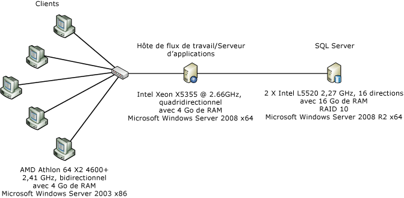</span><span class="sxs-lookup"><span data-stu-id="d81f0-197"></span></span>  
  
 <span data-ttu-id="d81f0-198">La figure ci-dessus illustre la configuration de l'ordinateur utilisée pour la mesure des performances au niveau du composant.</span><span class="sxs-lookup"><span data-stu-id="d81f0-198">The above figure shows the machine configuration used for component-level performance measurement.</span></span> <span data-ttu-id="d81f0-199">Un serveur unique et cinq clients connectés par le biais d'une interface réseau Ethernet de 1 Gbit/s. </span><span class="sxs-lookup"><span data-stu-id="d81f0-199">A single server and five clients connected over one 1-Gbps Ethernet network interface.</span></span> <span data-ttu-id="d81f0-200">Pour faciliter les mesures, le serveur est configuré pour utiliser un seul cœur d'un serveur double processeur/quatre cœurs exécutant Windows Server 2008 x86.</span><span class="sxs-lookup"><span data-stu-id="d81f0-200">For easy measurements, the server is configured to use a single core of a dual-proc/quad-core server  running Windows Server 2008 x86.</span></span> <span data-ttu-id="d81f0-201">L'utilisation de l'UC système est maintenue aux alentours de 100 %.</span><span class="sxs-lookup"><span data-stu-id="d81f0-201">The system CPU utilization is maintained at nearly 100%.</span></span>  
  
### <a name="test-details"></a><span data-ttu-id="d81f0-202">Détails du test</span><span class="sxs-lookup"><span data-stu-id="d81f0-202">Test Details</span></span>  
 <span data-ttu-id="d81f0-203"><xref:System.Workflow.Activities.CodeActivity> de WF3 est sans doute l'activité la plus simple pouvant être utilisée dans un workflow WF3.</span><span class="sxs-lookup"><span data-stu-id="d81f0-203">The WF3 <xref:System.Workflow.Activities.CodeActivity> is likely the simplest activity that can be used in a WF3 workflow.</span></span>  <span data-ttu-id="d81f0-204">Cette activité appelle une méthode du code-behind où le programmeur de workflow peut entrer du code personnalisé.</span><span class="sxs-lookup"><span data-stu-id="d81f0-204">The activity calls a method in the code-behind that the workflow programmer can put custom code into.</span></span>  <span data-ttu-id="d81f0-205">Dans WF4, il n'existe aucun équivalent direct à <xref:System.Workflow.Activities.CodeActivity> de WF3 qui fournit les mêmes fonctionnalités.</span><span class="sxs-lookup"><span data-stu-id="d81f0-205">In WF4, there is no direct analog to the WF3 <xref:System.Workflow.Activities.CodeActivity> that provides the same functionality.</span></span>  <span data-ttu-id="d81f0-206">Notez que WF4 contient une classe de base <xref:System.Activities.CodeActivity> qui n'est pas liée à <xref:System.Workflow.Activities.CodeActivity> de WF3.</span><span class="sxs-lookup"><span data-stu-id="d81f0-206">Note that there is a <xref:System.Activities.CodeActivity> base class in WF4 that is not related to the WF3 <xref:System.Workflow.Activities.CodeActivity>.</span></span>  <span data-ttu-id="d81f0-207">Les auteurs de workflow sont encouragés à créer des activités personnalisées et à concevoir des workflows en XAML uniquement.</span><span class="sxs-lookup"><span data-stu-id="d81f0-207">Workflow authors are encouraged to create custom activities and build XAML-only workflows.</span></span>  <span data-ttu-id="d81f0-208">Dans les tests ci-dessous, une activité appelée `Comment` est utilisée à la place d'une <xref:System.Workflow.Activities.CodeActivity> vide dans les workflows WF4.</span><span class="sxs-lookup"><span data-stu-id="d81f0-208">In the tests below, an activity called `Comment` is used in place of an empty <xref:System.Workflow.Activities.CodeActivity> in WF4 workflows.</span></span>  <span data-ttu-id="d81f0-209">Le code de l'activité `Comment` est le suivant :</span><span class="sxs-lookup"><span data-stu-id="d81f0-209">The code in the `Comment` activity is as follows:</span></span>  
  
```  
[ContentProperty("Body")]  
    public sealed class Comment : CodeActivity  
    {  
        public Comment()  
            : base()  
        {  
        }  
  
        [DefaultValue(null)]  
        public Activity Body  
        {  
            get;  
            set;  
        }  
  
        protected override void Execute(CodeActivityContext context)  
        {  
        }  
    }  
```  
  
### <a name="empty-workflow"></a><span data-ttu-id="d81f0-210">Workflow vide</span><span class="sxs-lookup"><span data-stu-id="d81f0-210">Empty Workflow</span></span>  
 <span data-ttu-id="d81f0-211">Ce test utilise un workflow en séquences sans activités enfants.</span><span class="sxs-lookup"><span data-stu-id="d81f0-211">This test uses a sequence workflow with no child activities.</span></span>  
  
### <a name="single-activity"></a><span data-ttu-id="d81f0-212">Activité unique</span><span class="sxs-lookup"><span data-stu-id="d81f0-212">Single Activity</span></span>  
 <span data-ttu-id="d81f0-213">Ce workflow est un workflow en séquences contenant une activité enfant.</span><span class="sxs-lookup"><span data-stu-id="d81f0-213">The workflow is a sequence workflow containing one child activity.</span></span>  <span data-ttu-id="d81f0-214">L'activité est une <xref:System.Workflow.Activities.CodeActivity> sans code dans le cas de WF3 et une activité `Comment` dans le cas de WF4.</span><span class="sxs-lookup"><span data-stu-id="d81f0-214">The activity is a <xref:System.Workflow.Activities.CodeActivity> with no code in the WF3 case and a `Comment` activity in the WF4 case.</span></span>  
  
### <a name="while-with-1000-iterations"></a><span data-ttu-id="d81f0-215">While avec 1000 itérations</span><span class="sxs-lookup"><span data-stu-id="d81f0-215">While with 1000 Iterations</span></span>  
 <span data-ttu-id="d81f0-216">Le workflow en séquences contient une activité <xref:System.Activities.Statements.While> avec une activité enfant dans la boucle qui n'exécute aucun travail.</span><span class="sxs-lookup"><span data-stu-id="d81f0-216">The sequence workflow contains one <xref:System.Activities.Statements.While> activity with one child activity in the loop that does not perform any work.</span></span>  
  
### <a name="replicator-compared-to-parallelforeach"></a><span data-ttu-id="d81f0-217">Replicator comparé à ParallelForEach</span><span class="sxs-lookup"><span data-stu-id="d81f0-217">Replicator compared to ParallelForEach</span></span>  
 <span data-ttu-id="d81f0-218"><xref:System.Workflow.Activities.ReplicatorActivity> de WF3 a des modes d'exécution séquentiels et parallèles.</span><span class="sxs-lookup"><span data-stu-id="d81f0-218"><xref:System.Workflow.Activities.ReplicatorActivity> in WF3 has sequential and parallel execution modes.</span></span>  <span data-ttu-id="d81f0-219">En mode séquentiel, les performances de l'activité sont similaires à celles de <xref:System.Workflow.Activities.WhileActivity>.</span><span class="sxs-lookup"><span data-stu-id="d81f0-219">In sequential mode, the activity’s performance is similar to the <xref:System.Workflow.Activities.WhileActivity>.</span></span>  <span data-ttu-id="d81f0-220"><xref:System.Workflow.Activities.ReplicatorActivity> est surtout utile pour l'exécution parallèle.</span><span class="sxs-lookup"><span data-stu-id="d81f0-220">The <xref:System.Workflow.Activities.ReplicatorActivity> is most useful for parallel execution.</span></span>  <span data-ttu-id="d81f0-221">L'équivalent WF4 de ceci est l'activité <xref:System.Activities.Statements.ParallelForEach%601>.</span><span class="sxs-lookup"><span data-stu-id="d81f0-221">The WF4 analog for this is the <xref:System.Activities.Statements.ParallelForEach%601> activity.</span></span>  
  
 <span data-ttu-id="d81f0-222">Le diagramme suivant montre les workflows utilisés pour ce test.</span><span class="sxs-lookup"><span data-stu-id="d81f0-222">The following diagram shows the workflows used for this test.</span></span> <span data-ttu-id="d81f0-223">Le workflow WF3 est représenté sur la gauche et le workflow WF4 sur la droite.</span><span class="sxs-lookup"><span data-stu-id="d81f0-223">The WF3 workflow is on the left and the WF4 workflow is on the right.</span></span>  
  
 <span data-ttu-id="d81f0-224">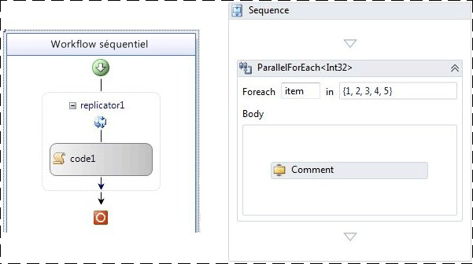</span><span class="sxs-lookup"><span data-stu-id="d81f0-224"></span></span>  
  
### <a name="sequential-workflow-with-five-activities"></a><span data-ttu-id="d81f0-225">Workflow séquentiel avec cinq activités.</span><span class="sxs-lookup"><span data-stu-id="d81f0-225">Sequential Workflow with Five Activities</span></span>  
 <span data-ttu-id="d81f0-226">Ces tests visent à montrer le résultat de l'exécution de plusieurs activités en séquences.</span><span class="sxs-lookup"><span data-stu-id="d81f0-226">This test is meant to show the effect of having several activities execute in sequence.</span></span>  <span data-ttu-id="d81f0-227">La séquence inclut cinq activités.</span><span class="sxs-lookup"><span data-stu-id="d81f0-227">There are five activities in the sequence.</span></span>  
  
### <a name="transaction-scope"></a><span data-ttu-id="d81f0-228">Étendue de transaction</span><span class="sxs-lookup"><span data-stu-id="d81f0-228">Transaction Scope</span></span>  
 <span data-ttu-id="d81f0-229">Le test d'étendue de transaction est légèrement différent des autres tests en ceci qu'une nouvelle instance de workflow n'est pas créée pour chaque itération.</span><span class="sxs-lookup"><span data-stu-id="d81f0-229">The transaction scope test differs from the other tests slightly in that a new workflow instance is not created for every iteration.</span></span>  <span data-ttu-id="d81f0-230">Au lieu de cela, le workflow est structuré avec une boucle while comprenant une activité <xref:System.Activities.Statements.TransactionScope> qui contient une activité unique qui n'effectue aucun travail.</span><span class="sxs-lookup"><span data-stu-id="d81f0-230">Instead, the workflow is structured with a while loop containing a <xref:System.Activities.Statements.TransactionScope> activity containing a single activity that does no work.</span></span>  <span data-ttu-id="d81f0-231">Chaque exécution d'un lot de 50 itérations dans la boucle while est comptée comme une opération unique.</span><span class="sxs-lookup"><span data-stu-id="d81f0-231">Each run of a batch of 50 iterations through the while loop is counted as a single operation.</span></span>  
  
### <a name="compensation"></a><span data-ttu-id="d81f0-232">Compensation</span><span class="sxs-lookup"><span data-stu-id="d81f0-232">Compensation</span></span>  
 <span data-ttu-id="d81f0-233">Le workflow WF3 contient une activité compensable unique appelée `WorkScope`.</span><span class="sxs-lookup"><span data-stu-id="d81f0-233">The WF3 workflow has a single compensatable activity named `WorkScope`.</span></span>  <span data-ttu-id="d81f0-234">L'activité implémente simplement l'interface <xref:System.Workflow.ComponentModel.ICompensatableActivity> :</span><span class="sxs-lookup"><span data-stu-id="d81f0-234">The activity simply implements the <xref:System.Workflow.ComponentModel.ICompensatableActivity> interface:</span></span>  
  
```  
class WorkScope :   
        CompositeActivity, ICompensatableActivity  
    {  
        public WorkScope() : base() { }  
  
        public WorkScope(string name)  
        {  
            this.Name = name;  
        }  
  
        public ActivityExecutionStatus Compensate(  
            ActivityExecutionContext executionContext)  
        {  
            return ActivityExecutionStatus.Closed;  
        }  
    }  
```  
  
 <span data-ttu-id="d81f0-235">Le gestionnaire d'erreur cible l'activité `WorkScope`. Le workflow WF4 est tout aussi simple.</span><span class="sxs-lookup"><span data-stu-id="d81f0-235">The fault handler targets the `WorkScope` activity.The WF4 workflow is equally simplistic.</span></span>  <span data-ttu-id="d81f0-236">Une <xref:System.Activities.Statements.CompensableActivity> possède un corps et un gestionnaire de compensation.</span><span class="sxs-lookup"><span data-stu-id="d81f0-236">A <xref:System.Activities.Statements.CompensableActivity> has a body and a compensation handler.</span></span>  <span data-ttu-id="d81f0-237">La séquence suivante contient une compensation explicite.</span><span class="sxs-lookup"><span data-stu-id="d81f0-237">An explicit compensate is next in the sequence.</span></span>  <span data-ttu-id="d81f0-238">L'activité de corps et le gestionnaire de compensation sont des implémentations vides :</span><span class="sxs-lookup"><span data-stu-id="d81f0-238">The body activity and compensation handler activity are both empty implementations:</span></span>  
  
```  
public sealed class CompensableActivityEmptyCompensation : CodeActivity  
    {  
        public CompensableActivityEmptyCompensation()  
            : base() { }  
  
        public Activity Body { get; set; }  
  
        protected override void Execute(CodeActivityContext context) { }  
    }  
    public sealed class CompensableActivityEmptyBody : CodeActivity  
    {  
        public CompensableActivityEmptyBody()  
            : base() { }  
  
        public Activity Body { get; set; }  
  
        protected override void Execute(CodeActivityContext context) { }  
    }  
```  
  
 <span data-ttu-id="d81f0-239">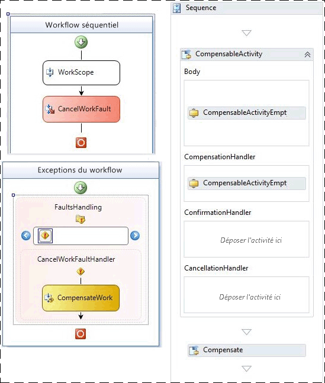</span><span class="sxs-lookup"><span data-stu-id="d81f0-239"></span></span>  
  
 <span data-ttu-id="d81f0-240">Figure 2 – Workflows de compensation WF3 (à gauche) et WF4 (à droite) de base</span><span class="sxs-lookup"><span data-stu-id="d81f0-240">Figure 2 – WF3 (left) and WF4 (right) basic compensation workflows</span></span>  
  
### <a name="performance-test-results"></a><span data-ttu-id="d81f0-241">Résultats des test de performances</span><span class="sxs-lookup"><span data-stu-id="d81f0-241">Performance Test Results</span></span>  
 <span data-ttu-id="d81f0-242">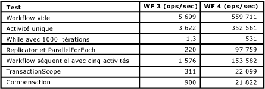</span><span class="sxs-lookup"><span data-stu-id="d81f0-242"></span></span>  
  
 <span data-ttu-id="d81f0-243">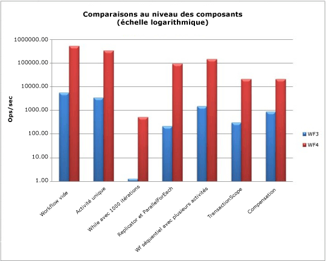</span><span class="sxs-lookup"><span data-stu-id="d81f0-243"></span></span>  
  
 <span data-ttu-id="d81f0-244">Tous les tests sont mesurés en workflows par seconde à l’exception du test d’étendue de transaction.</span><span class="sxs-lookup"><span data-stu-id="d81f0-244">All tests are measured in workflows per second with the exception of the transaction scope test.</span></span>  <span data-ttu-id="d81f0-245">Comme vous pouvez le constater ci-dessus, les performances du runtime [!INCLUDE[wf1](../../../includes/wf1-md.md)] se sont améliorées dans le tableau, en particulier dans les domaines qui nécessitent plusieurs exécutions de la même activité comme la boucle while.</span><span class="sxs-lookup"><span data-stu-id="d81f0-245">As can be seen above, the [!INCLUDE[wf1](../../../includes/wf1-md.md)] runtime performance has improved across the board, especially in areas that require multiple executions of the same activity like the while loop.</span></span>  
  
## <a name="service-composition-scenario"></a><span data-ttu-id="d81f0-246">Scénario de composition de service</span><span class="sxs-lookup"><span data-stu-id="d81f0-246">Service Composition Scenario</span></span>  
 <span data-ttu-id="d81f0-247">Comme indiqué dans la section précédente, « comparaisons des performances au niveau du composant », a été une réduction significative de la surcharge entre WF3 et WF4.</span><span class="sxs-lookup"><span data-stu-id="d81f0-247">As is shown in the previous section, "Component-level Performance Comparisons," there has been a significant reduction in overhead between WF3 and WF4.</span></span>  <span data-ttu-id="d81f0-248">Les services de workflow [!INCLUDE[indigo2](../../../includes/indigo2-md.md)] parviennent désormais à égaler quasiment les performances des services [!INCLUDE[indigo2](../../../includes/indigo2-md.md)] codés manuellement, tout en conservant tous les avantages du runtime [!INCLUDE[wf1](../../../includes/wf1-md.md)].</span><span class="sxs-lookup"><span data-stu-id="d81f0-248">[!INCLUDE[indigo2](../../../includes/indigo2-md.md)] workflow services can now almost match the performance of hand-coded [!INCLUDE[indigo2](../../../includes/indigo2-md.md)] services but still have all the benefits of the [!INCLUDE[wf1](../../../includes/wf1-md.md)] runtime.</span></span>  <span data-ttu-id="d81f0-249">Ce scénario de test compare un service [!INCLUDE[indigo2](../../../includes/indigo2-md.md)] avec un service de workflow [!INCLUDE[indigo2](../../../includes/indigo2-md.md)] dans WF4.</span><span class="sxs-lookup"><span data-stu-id="d81f0-249">This test scenario compares a [!INCLUDE[indigo2](../../../includes/indigo2-md.md)] service against a [!INCLUDE[indigo2](../../../includes/indigo2-md.md)] workflow service in WF4.</span></span>  
  
### <a name="online-store-service"></a><span data-ttu-id="d81f0-250">Service de magasin en ligne</span><span class="sxs-lookup"><span data-stu-id="d81f0-250">Online Store Service</span></span>  
 <span data-ttu-id="d81f0-251">Une des forces de [!INCLUDE[wf2](../../../includes/wf2-md.md)] réside dans le fait qu'il permet de composer des processus à l'aide de plusieurs services.</span><span class="sxs-lookup"><span data-stu-id="d81f0-251">One of the strengths of [!INCLUDE[wf2](../../../includes/wf2-md.md)] is the ability to compose processes using several services.</span></span>  <span data-ttu-id="d81f0-252">Dans cet exemple, un service de magasin en ligne organise deux appels de service pour passer une commande.</span><span class="sxs-lookup"><span data-stu-id="d81f0-252">For this example, there is an online store service that orchestrates two service calls to purchase an order.</span></span>  <span data-ttu-id="d81f0-253">La première étape consiste à valider la commande par le biais d'un service de validation des commandes.</span><span class="sxs-lookup"><span data-stu-id="d81f0-253">The first step is to validate the order using an Order Validating Service.</span></span>  <span data-ttu-id="d81f0-254">La seconde étape consiste à satisfaire la commande à l'aide d'un service d'entrepôt .</span><span class="sxs-lookup"><span data-stu-id="d81f0-254">The second step is to fill the order using a Warehouse Service.</span></span>  
  
 <span data-ttu-id="d81f0-255">Les deux services backend, de validation des commandes et d'entrepôt, sont les mêmes pour les deux tests.</span><span class="sxs-lookup"><span data-stu-id="d81f0-255">The two backend services, Order Validating Service and Warehouse Service, remain the same for both tests.</span></span>  <span data-ttu-id="d81f0-256">La partie qui change est le service de magasin en ligne qui effectue l'orchestration.</span><span class="sxs-lookup"><span data-stu-id="d81f0-256">The part that changes is the Online Store Service that performs the orchestration.</span></span>  <span data-ttu-id="d81f0-257">Dans un cas, le service est codé manuellement en tant que service [!INCLUDE[indigo2](../../../includes/indigo2-md.md)].</span><span class="sxs-lookup"><span data-stu-id="d81f0-257">In one case, the service is hand-coded as a [!INCLUDE[indigo2](../../../includes/indigo2-md.md)] service.</span></span>  <span data-ttu-id="d81f0-258">Dans l'autre cas, le service est écrit en tant que service de workflow [!INCLUDE[indigo2](../../../includes/indigo2-md.md)] dans WF4.</span><span class="sxs-lookup"><span data-stu-id="d81f0-258">For the other case, the service is written as a [!INCLUDE[indigo2](../../../includes/indigo2-md.md)] workflow service in WF4.</span></span> <span data-ttu-id="d81f0-259">Les fonctionnalités spécifiques à [!INCLUDE[wf1](../../../includes/wf1-md.md)], telles que le suivi et la persistance, sont désactivées pour ce test.</span><span class="sxs-lookup"><span data-stu-id="d81f0-259">[!INCLUDE[wf1](../../../includes/wf1-md.md)]-specific features like tracking and persistence are turned off for this test.</span></span>  
  
### <a name="environment"></a><span data-ttu-id="d81f0-260">Environnement</span><span class="sxs-lookup"><span data-stu-id="d81f0-260">Environment</span></span>  
 <span data-ttu-id="d81f0-261"></span><span class="sxs-lookup"><span data-stu-id="d81f0-261"></span></span>  
  
 <span data-ttu-id="d81f0-262">Les demandes du client sont transmises au service de magasin en ligne via HTTP à partir de plusieurs ordinateurs.</span><span class="sxs-lookup"><span data-stu-id="d81f0-262">Client requests are made to the Online Store Service via HTTP from multiple computers.</span></span>  <span data-ttu-id="d81f0-263">Un ordinateur unique héberge les trois services.</span><span class="sxs-lookup"><span data-stu-id="d81f0-263">A single computer hosts all three services.</span></span>  <span data-ttu-id="d81f0-264">La couche de transport entre le service de magasin en ligne et les services backend est TCP ou HTTP.</span><span class="sxs-lookup"><span data-stu-id="d81f0-264">The transport layer between the Online Store Service and the backend services is TCP or HTTP.</span></span>  <span data-ttu-id="d81f0-265">La mesure des opérations/seconde est basée sur le nombre d'appels `PurchaseOrder` passés au service de magasin en ligne.</span><span class="sxs-lookup"><span data-stu-id="d81f0-265">The measurement of operations/second is based on the number of completed `PurchaseOrder` calls made to the Online Store Service.</span></span>  <span data-ttu-id="d81f0-266">Le regroupement de canaux est une nouvelle fonctionnalité disponible dans WF4.</span><span class="sxs-lookup"><span data-stu-id="d81f0-266">Channel pooling is a new feature available in WF4.</span></span>  <span data-ttu-id="d81f0-267">Dans la partie [!INCLUDE[indigo2](../../../includes/indigo2-md.md)] de ce test, le regroupement de canaux n'est pas fourni, c'est pourquoi une implémentation codée manuellement d'une technique de regroupement simple a été utilisée dans le service de magasin en ligne.</span><span class="sxs-lookup"><span data-stu-id="d81f0-267">In the [!INCLUDE[indigo2](../../../includes/indigo2-md.md)] portion of this test channel pooling is not provided out of the box so a hand-coded implementation of a simple pooling technique was used in the Online Store Service.</span></span>  
  
### <a name="performance"></a><span data-ttu-id="d81f0-268">Performances</span><span class="sxs-lookup"><span data-stu-id="d81f0-268">Performance</span></span>  
 <span data-ttu-id="d81f0-269">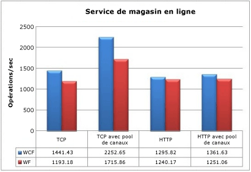</span><span class="sxs-lookup"><span data-stu-id="d81f0-269"></span></span>  
  
 <span data-ttu-id="d81f0-270">En se connectant aux services TCP backend sans regroupement de canaux, le service [!INCLUDE[wf1](../../../includes/wf1-md.md)] a un impact de 17,2 % sur le débit.</span><span class="sxs-lookup"><span data-stu-id="d81f0-270">Connecting to backend TCP services without channel pooling, the [!INCLUDE[wf1](../../../includes/wf1-md.md)] service has a 17.2% impact on throughput.</span></span>  <span data-ttu-id="d81f0-271">Avec le regroupement de canaux, la pénalité est d'environ 23,8 %.</span><span class="sxs-lookup"><span data-stu-id="d81f0-271">With channel pooling, the penalty is about 23.8%.</span></span>  <span data-ttu-id="d81f0-272">Pour HTTP, l'impact est bien moindre : 4,3 % sans regroupement et 8,1 % avec le regroupement.</span><span class="sxs-lookup"><span data-stu-id="d81f0-272">For HTTP, the impact is much less: 4.3% without pooling and 8.1% with pooling.</span></span>  <span data-ttu-id="d81f0-273">Il est important de noter que le regroupement de canaux présente très peu d'avantages lors de l'utilisation de HTTP.</span><span class="sxs-lookup"><span data-stu-id="d81f0-273">It is also important to note that the channel pooling provides very little benefit when using HTTP.</span></span>  
  
 <span data-ttu-id="d81f0-274">Même si le runtime WF4 nécessite une charge mémoire supplémentaire par rapport à un service [!INCLUDE[indigo2](../../../includes/indigo2-md.md)] codé manuellement dans ce test, on peut considérer qu'il s'agit du pire cas de figure.</span><span class="sxs-lookup"><span data-stu-id="d81f0-274">While there is overhead from the WF4 runtime compared with a hand-coded [!INCLUDE[indigo2](../../../includes/indigo2-md.md)] service in this test, it could be considered a worst-case scenario.</span></span>  <span data-ttu-id="d81f0-275">Les deux services backend dans ce test exécutent très peu de travail.</span><span class="sxs-lookup"><span data-stu-id="d81f0-275">The two backend services in this test do very little work.</span></span>  <span data-ttu-id="d81f0-276">Dans un scénario de bout en bout réel, ces services effectueraient des opérations plus coûteuses telles que des appels de base de données, ce qui réduirait l'impact de la couche de transport sur les performances.</span><span class="sxs-lookup"><span data-stu-id="d81f0-276">In a real end-to-end scenario, these services would perform more expensive operations like database calls, making the performance impact of the transport layer less important.</span></span>  <span data-ttu-id="d81f0-277">Tout cela ajouté aux avantages des fonctionnalités disponibles dans WF4 fait de Workflow Foundation un choix viable pour la création de services d'orchestration.</span><span class="sxs-lookup"><span data-stu-id="d81f0-277">This plus the benefits of the features available in WF4 makes Workflow Foundation a viable choice for creating orchestration services.</span></span>  
  
## <a name="key-performance-considerations"></a><span data-ttu-id="d81f0-278">Considérations sur les performances clés</span><span class="sxs-lookup"><span data-stu-id="d81f0-278">Key Performance Considerations</span></span>  
 <span data-ttu-id="d81f0-279">Les fonctionnalités abordées dans cette section, à l'exception de l'interopérabilité, ont radicalement changé entre WF3 et WF4.</span><span class="sxs-lookup"><span data-stu-id="d81f0-279">The feature areas in this section, with the exception of interop, have dramatically changed between WF3 and WF4.</span></span>  <span data-ttu-id="d81f0-280">Cela affecte la conception des applications de workflow ainsi que les performances.</span><span class="sxs-lookup"><span data-stu-id="d81f0-280">This affects the design of workflow applications as well as the performance.</span></span>  
  
#### <a name="workflow-activation-latency"></a><span data-ttu-id="d81f0-281">Latence de l'activation de workflow</span><span class="sxs-lookup"><span data-stu-id="d81f0-281">Workflow Activation Latency</span></span>  
 <span data-ttu-id="d81f0-282">Dans une application de service de workflow [!INCLUDE[indigo2](../../../includes/indigo2-md.md)], la latence de démarrage d'un nouveau workflow ou de chargement d'un workflow existant est importante, car elle peut provoquer des blocages.</span><span class="sxs-lookup"><span data-stu-id="d81f0-282">In a [!INCLUDE[indigo2](../../../includes/indigo2-md.md)] workflow service application, the latency for starting a new workflow or loading an existing workflow is important as it can be blocking.</span></span>  <span data-ttu-id="d81f0-283">Ce cas de test compare un hôte XOML WF3 à un hôte XAMLX WF4 dans un scénario classique.</span><span class="sxs-lookup"><span data-stu-id="d81f0-283">This test case measures a WF3 XOML host against a WF4 XAMLX host in a typical scenario.</span></span>  
  
##### <a name="environment-setup"></a><span data-ttu-id="d81f0-284">Configuration de l'environnement</span><span class="sxs-lookup"><span data-stu-id="d81f0-284">Environment Setup</span></span>  
 <span data-ttu-id="d81f0-285">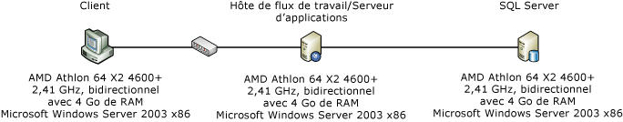</span><span class="sxs-lookup"><span data-stu-id="d81f0-285"></span></span>  
  
##### <a name="test-setup"></a><span data-ttu-id="d81f0-286">Configuration du test</span><span class="sxs-lookup"><span data-stu-id="d81f0-286">Test Setup</span></span>  
 <span data-ttu-id="d81f0-287">Dans ce scénario, un ordinateur client contacte un service de [!INCLUDE[indigo2](../../../includes/indigo2-md.md)] à l'aide de la corrélation basée sur le contexte.</span><span class="sxs-lookup"><span data-stu-id="d81f0-287">In the scenario, a client computer contacts a [!INCLUDE[indigo2](../../../includes/indigo2-md.md)] workflow service using context-based correlation.</span></span>  <span data-ttu-id="d81f0-288">La corrélation de contexte nécessite une liaison de contexte spéciale et utilise un en-tête ou un cookie de contexte pour lier les messages à l'instance de workflow correcte.</span><span class="sxs-lookup"><span data-stu-id="d81f0-288">Context correlation requires a special context binding and uses a context header or cookie to relate messages to the correct workflow instance.</span></span>  <span data-ttu-id="d81f0-289">Elle offre un avantage en termes de performances, car dans la mesure où l'ID de corrélation se trouve dans l'en-tête du message, il n'est pas nécessaire d'analyser le corps du message.</span><span class="sxs-lookup"><span data-stu-id="d81f0-289">It has a performance benefit in that the correlation Id is located in the message header so the message body does not need to be parsed.</span></span> [!INCLUDE[crabout](../../../includes/crabout-md.md)]<span data-ttu-id="d81f0-290">corrélation de contexte voir [corrélation d’échange de contexte](../../../docs/framework/wcf/feature-details/context-exchange-correlation.md)</span><span class="sxs-lookup"><span data-stu-id="d81f0-290"> context correlation see [Context Exchange Correlation](../../../docs/framework/wcf/feature-details/context-exchange-correlation.md)</span></span>  
  
 <span data-ttu-id="d81f0-291">Le service crée un nouveau workflow avec la demande et envoie une réponse immédiate de sorte que la mesure de la latence n'inclut pas le temps d'exécution du workflow.</span><span class="sxs-lookup"><span data-stu-id="d81f0-291">The service will create a new workflow with the request and send an immediate response so that the measurement of latency does not include the time spent running the workflow.</span></span>  <span data-ttu-id="d81f0-292">Le workflow WF3 est au format XOML avec un code-behind et le workflow WF4 est entièrement au format XAML.</span><span class="sxs-lookup"><span data-stu-id="d81f0-292">The WF3 workflow is XOML with a code-behind and the WF4 workflow is entirely XAML.</span></span>  <span data-ttu-id="d81f0-293">Voici un exemple de workflow WF4 :</span><span class="sxs-lookup"><span data-stu-id="d81f0-293">The WF4 workflow looks like this:</span></span>  
  
 <span data-ttu-id="d81f0-294">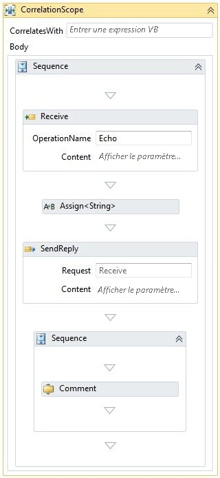</span><span class="sxs-lookup"><span data-stu-id="d81f0-294"></span></span>  
  
 <span data-ttu-id="d81f0-295">L'activité <xref:System.ServiceModel.Activities.Receive> crée l'instance de workflow.</span><span class="sxs-lookup"><span data-stu-id="d81f0-295">The <xref:System.ServiceModel.Activities.Receive> activity creates the workflow instance.</span></span>  <span data-ttu-id="d81f0-296">Une valeur passée dans le message reçu est répercutée dans le message de réponse.</span><span class="sxs-lookup"><span data-stu-id="d81f0-296">A value passed in the received message is echoed in the reply message.</span></span>  <span data-ttu-id="d81f0-297">Une séquence qui suit la réponse contient le reste du workflow.</span><span class="sxs-lookup"><span data-stu-id="d81f0-297">A sequence following the reply contains the rest of the workflow.</span></span>  <span data-ttu-id="d81f0-298">Dans le cas ci-dessus, un seule activité de commentaire est représentée.</span><span class="sxs-lookup"><span data-stu-id="d81f0-298">In the above case, only one comment activity is shown.</span></span>  <span data-ttu-id="d81f0-299">Le nombre d'activités de commentaire est modifié pour simuler la complexité de workflow.</span><span class="sxs-lookup"><span data-stu-id="d81f0-299">The number of comment activities is changed to simulate workflow complexity.</span></span>  <span data-ttu-id="d81f0-300">Une activité de commentaire est équivalente à un <xref:System.Workflow.Activities.CodeActivity> WF3 qui n'effectue aucune tâche.</span><span class="sxs-lookup"><span data-stu-id="d81f0-300">A comment activity is equivalent to a WF3 <xref:System.Workflow.Activities.CodeActivity> that performs no work.</span></span> [!INCLUDE[crabout](../../../includes/crabout-md.md)]<span data-ttu-id="d81f0-301">l’activité de commentaire, consultez la section « comparaisons des performances au niveau des composants » plus haut dans cet article.</span><span class="sxs-lookup"><span data-stu-id="d81f0-301"> the comment activity, see the "Component-level Performance Comparison" section earlier in this article.</span></span>  
  
##### <a name="test-results"></a><span data-ttu-id="d81f0-302">Résultats des tests</span><span class="sxs-lookup"><span data-stu-id="d81f0-302">Test Results</span></span>  
 <span data-ttu-id="d81f0-303">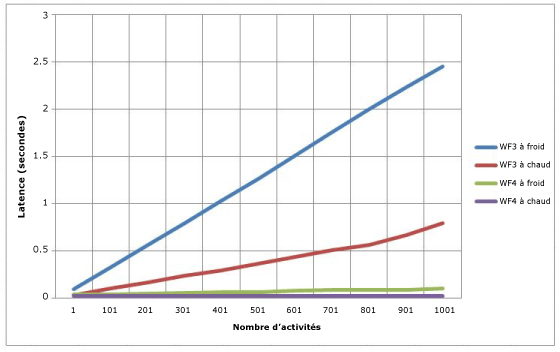</span><span class="sxs-lookup"><span data-stu-id="d81f0-303"></span></span>  
  
 <span data-ttu-id="d81f0-304">Figure 3 – Latence à froid et à chaud pour les services de workflow WCF</span><span class="sxs-lookup"><span data-stu-id="d81f0-304">Figure 3 – Cold and warm latency for WCF workflow services</span></span>  
  
 <span data-ttu-id="d81f0-305">Dans le graphique ci-dessus, « froid » correspond à un cas dans lequel il n'existe aucun <xref:System.ServiceModel.WorkflowServiceHost> pour le workflow donné.</span><span class="sxs-lookup"><span data-stu-id="d81f0-305">In the graph above, cold refers to the case where there is not an existing <xref:System.ServiceModel.WorkflowServiceHost> for the given workflow.</span></span>  <span data-ttu-id="d81f0-306">En d'autres termes, la latence à froid correspond au cas dans lequel le workflow est utilisé pour la première fois et le XOML ou le XAML doit être compilé.</span><span class="sxs-lookup"><span data-stu-id="d81f0-306">In other words, cold latency is when the workflow is being used for the first time and the XOML or XAML needs to be compiled.</span></span>  <span data-ttu-id="d81f0-307">La latence à chaud correspond à la création d'une nouvelle instance de workflow lorsque le type de workflow a déjà été compilé.</span><span class="sxs-lookup"><span data-stu-id="d81f0-307">Warm latency is the time to create a new workflow instance when the workflow type has already been compiled.</span></span>  <span data-ttu-id="d81f0-308">La complexité du workflow a très peu d'impact dans le cas de WF4, mais a une progression linéaire dans le cas de WF3.</span><span class="sxs-lookup"><span data-stu-id="d81f0-308">The complexity of the workflow makes very little difference in the WF4 case but has a linear progression in the WF3 case.</span></span>  
  
#### <a name="correlation-throughput"></a><span data-ttu-id="d81f0-309">Débit de corrélation</span><span class="sxs-lookup"><span data-stu-id="d81f0-309">Correlation Throughput</span></span>  
 <span data-ttu-id="d81f0-310">WF4 introduit une nouvelle fonctionnalité de corrélation basée sur le contenu.</span><span class="sxs-lookup"><span data-stu-id="d81f0-310">WF4 introduces a new content-based correlation feature.</span></span>  <span data-ttu-id="d81f0-311">WF3 offrait seulement la corrélation basée sur le contexte.</span><span class="sxs-lookup"><span data-stu-id="d81f0-311">WF3 provided only context-based correlation.</span></span>  <span data-ttu-id="d81f0-312">La corrélation basée sur le contexte pouvait seulement avoir lieu via des liaisons de canaux [!INCLUDE[indigo2](../../../includes/indigo2-md.md)] spécifiques.</span><span class="sxs-lookup"><span data-stu-id="d81f0-312">Context-based correlation could only be done over specific [!INCLUDE[indigo2](../../../includes/indigo2-md.md)] channel bindings.</span></span>  <span data-ttu-id="d81f0-313">L'ID de workflow est inséré dans l'en-tête de message lors de l'utilisation de ces liaisons.</span><span class="sxs-lookup"><span data-stu-id="d81f0-313">The workflow Id is inserted into the message header when using these bindings.</span></span>  <span data-ttu-id="d81f0-314">Le runtime WF3 pouvait seulement identifier un workflow par son ID.  Avec la corrélation basée sur le contenu, l’auteur de workflow peut créer une clé de corrélation de données comme un numéro de compte ou un ID client pertinentes [!INCLUDE[crabout](../../../includes/crabout-md.md)] en fonction du contenu de corrélation, consultez [corrélation en fonction de contenu](../../../docs/framework/wcf/feature-details/content-based-correlation.md).</span><span class="sxs-lookup"><span data-stu-id="d81f0-314">The WF3 runtime could only identify a workflow by its Id.  With content-based correlation, the workflow author can create a correlation key out of a relevant piece of data like an account number or customer Id. [!INCLUDE[crabout](../../../includes/crabout-md.md)] content-based correlation see [Content Based Correlation](../../../docs/framework/wcf/feature-details/content-based-correlation.md).</span></span>  
  
 <span data-ttu-id="d81f0-315">La corrélation basée sur le contexte offre un avantage en matière de performances en ceci que la clé de corrélation se trouve dans l'en-tête du message.</span><span class="sxs-lookup"><span data-stu-id="d81f0-315">Context-based correlation has a performance advantage in that the correlation key is located in the message header.</span></span>  <span data-ttu-id="d81f0-316">La clé peut être lue à partir du message sans désérialisation/copie du message.</span><span class="sxs-lookup"><span data-stu-id="d81f0-316">The key can be read from the message without de-serialization/message-copying.</span></span>  <span data-ttu-id="d81f0-317">Avec la corrélation basée sur le contenu, la clé de corrélation est stockée dans le corps du message.</span><span class="sxs-lookup"><span data-stu-id="d81f0-317">In content-based correlation, the correlation key is stored in the message body.</span></span>  <span data-ttu-id="d81f0-318">Une expression XPath est utilisée pour rechercher la clé.</span><span class="sxs-lookup"><span data-stu-id="d81f0-318">An XPath expression is used to locate the key.</span></span>  <span data-ttu-id="d81f0-319">Le coût de ce traitement supplémentaire dépend de la taille du message, de la profondeur de la clé dans le corps et du nombre de clés.</span><span class="sxs-lookup"><span data-stu-id="d81f0-319">The cost of this extra processing depends on the size of the message, depth of the key in the body, and the number of keys.</span></span>  <span data-ttu-id="d81f0-320">Ce test compare la corrélation basée sur le contexte à celle basée sur le contenu et montre également la détérioration des performances lors de l'utilisation de plusieurs clés.</span><span class="sxs-lookup"><span data-stu-id="d81f0-320">This test compares context- and content-based correlation and also shows the performance degradation when using multiple keys.</span></span>  
  
#### <a name="environment-setup"></a><span data-ttu-id="d81f0-321">Configuration de l'environnement</span><span class="sxs-lookup"><span data-stu-id="d81f0-321">Environment Setup</span></span>  
 <span data-ttu-id="d81f0-322"></span><span class="sxs-lookup"><span data-stu-id="d81f0-322"></span></span>  
  
#### <a name="test-setup"></a><span data-ttu-id="d81f0-323">Configuration du test</span><span class="sxs-lookup"><span data-stu-id="d81f0-323">Test Setup</span></span>  
 <span data-ttu-id="d81f0-324">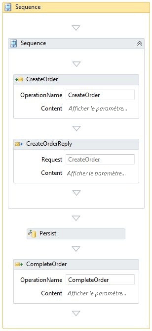</span><span class="sxs-lookup"><span data-stu-id="d81f0-324"></span></span>  
  
 <span data-ttu-id="d81f0-325">Le workflow illustré ci-dessus est le même que celui utilisé dans la section « Persistance » ci-dessous.</span><span class="sxs-lookup"><span data-stu-id="d81f0-325">The workflow shown above is the same one used in the "Persistence" section below.</span></span>  <span data-ttu-id="d81f0-326">Pour les tests de corrélation sans persistance aucun fournisseur de persistance n'est installé dans le runtime.</span><span class="sxs-lookup"><span data-stu-id="d81f0-326">For the correlation tests without persistence there is no persistence provider installed in the runtime.</span></span>  <span data-ttu-id="d81f0-327">La corrélation se produit en deux endroits : CreateOrder et CompleteOrder.</span><span class="sxs-lookup"><span data-stu-id="d81f0-327">Correlation occurs in two places: CreateOrder and CompleteOrder.</span></span>  
  
#### <a name="test-results"></a><span data-ttu-id="d81f0-328">Résultats des tests</span><span class="sxs-lookup"><span data-stu-id="d81f0-328">Test Results</span></span>  
 <span data-ttu-id="d81f0-329">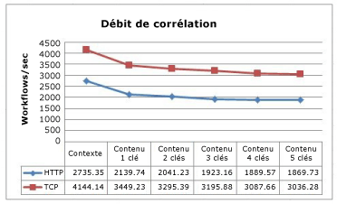</span><span class="sxs-lookup"><span data-stu-id="d81f0-329"></span></span>  
  
 <span data-ttu-id="d81f0-330">Ce graphique illustre une baisse des performances au fur et à mesure que le nombre de clés utilisées dans la corrélation basée sur le contenu augmente.</span><span class="sxs-lookup"><span data-stu-id="d81f0-330">This graph shows a decrease in performance as the number of keys used in content-based correlation increases.</span></span>  <span data-ttu-id="d81f0-331">La similarité entre les courbes de TCP et HTTP indique la charge mémoire associée à ces protocoles.</span><span class="sxs-lookup"><span data-stu-id="d81f0-331">The similarity in the curves between TCP and HTTP indicates the overhead associated with these protocols.</span></span>  
  
#### <a name="correlation-with-persistence"></a><span data-ttu-id="d81f0-332">Corrélation et persistance.</span><span class="sxs-lookup"><span data-stu-id="d81f0-332">Correlation with Persistence</span></span>  
 <span data-ttu-id="d81f0-333">Avec un workflow rendu persistant, la pression sur l'UC de la corrélation basée sur le contenu passe du runtine de workflow à la base de données SQL.</span><span class="sxs-lookup"><span data-stu-id="d81f0-333">With a persisted workflow, the CPU pressure from content-based correlation shifts from the workflow runtime to the SQL database.</span></span>  <span data-ttu-id="d81f0-334">Les procédures stockées dans le fournisseur de persistance SQL font correspondre les clés pour rechercher le workflow approprié.</span><span class="sxs-lookup"><span data-stu-id="d81f0-334">The stored procedures in the SQL persistence provider do the work of matching the keys to locate the appropriate workflow.</span></span>  
  
 <span data-ttu-id="d81f0-335">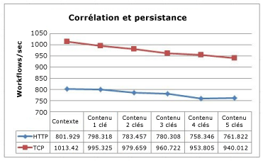</span><span class="sxs-lookup"><span data-stu-id="d81f0-335"></span></span>  
  
 <span data-ttu-id="d81f0-336">La corrélation basée sur le contexte est toujours plus rapide que la corrélation basée sur le contenu.</span><span class="sxs-lookup"><span data-stu-id="d81f0-336">Context-based correlation is still faster than content-based correlation.</span></span>  <span data-ttu-id="d81f0-337">Toutefois, la différence est moins prononcée, car la persistance a plus d'impact sur les performances que la corrélation.</span><span class="sxs-lookup"><span data-stu-id="d81f0-337">However, the difference is less pronounced as persistence has more impact on performance than correlation.</span></span>  
  
### <a name="complex-workflow-throughput"></a><span data-ttu-id="d81f0-338">Débit de workflow complexe</span><span class="sxs-lookup"><span data-stu-id="d81f0-338">Complex Workflow Throughput</span></span>  
 <span data-ttu-id="d81f0-339">La complexité d'un workflow ne se mesure pas uniquement au nombre d'activités.</span><span class="sxs-lookup"><span data-stu-id="d81f0-339">The complexity of a workflow is not measured only by the number of activities.</span></span>  <span data-ttu-id="d81f0-340">Les activités composites peuvent contenir de nombreux enfants, qui peuvent aussi être des activités composites.</span><span class="sxs-lookup"><span data-stu-id="d81f0-340">Composite activities can contain many children and those children can also be composite activities.</span></span>  <span data-ttu-id="d81f0-341">Au fur et à mesure que le nombre de niveaux d'imbrication augmente, il en va de même pour le nombre d'activités pouvant avoir l'état Exécution et le nombre de variables pouvant avoir cet état.</span><span class="sxs-lookup"><span data-stu-id="d81f0-341">As the number of levels of nesting increases, so does the number of activities that can be currently in the executing state and the number of variables that can be in state.</span></span>  <span data-ttu-id="d81f0-342">Ce test compare les débits de WF3 et de WF4 lors de l'exécution de workflows complexes.</span><span class="sxs-lookup"><span data-stu-id="d81f0-342">This test compares throughput between WF3 and WF4 when executing complex workflows.</span></span>  
  
### <a name="test-setup"></a><span data-ttu-id="d81f0-343">Configuration du test</span><span class="sxs-lookup"><span data-stu-id="d81f0-343">Test Setup</span></span>  
 <span data-ttu-id="d81f0-344">Ces tests ont été exécutés sur un ordinateur Intel Xeon X5355 2,66 GHz quatre cœurs avec 4 Go de RAM exécutant Windows Server 2008 x64.</span><span class="sxs-lookup"><span data-stu-id="d81f0-344">These tests were executed on an Intel Xeon X5355 @ 2.66GHz 4-way computer with 4GB RAM running Windows Server 2008 x64.</span></span>  <span data-ttu-id="d81f0-345">Le code de test exécute un processus unique avec un thread par cœur pour atteindre une utilisation de l'UC de 100 %.</span><span class="sxs-lookup"><span data-stu-id="d81f0-345">The test code runs in a single process with one thread per core to reach 100% CPU utilization.</span></span>  
  
 <span data-ttu-id="d81f0-346">Les workflows générés pour ce test contiennent deux variables principales : profondeur et nombre d'activités dans chaque séquence.</span><span class="sxs-lookup"><span data-stu-id="d81f0-346">The workflows generated for this test have two main variables: depth and number of activities in each sequence.</span></span>  <span data-ttu-id="d81f0-347">Chaque niveau de profondeur inclut une activité parallèle, pendant la boucle, les décisions, les affectations et les séquences.</span><span class="sxs-lookup"><span data-stu-id="d81f0-347">Each depth level includes a parallel activity, while loop, decisions, assignments, and sequences.</span></span>  <span data-ttu-id="d81f0-348">Dans le concepteur WF4 illustré ci-dessous, l'organigramme de niveau supérieur est représenté.</span><span class="sxs-lookup"><span data-stu-id="d81f0-348">In the WF4 designer pictured below, the top-level flow chart is pictured.</span></span>  <span data-ttu-id="d81f0-349">Chaque activité d'organigramme ressemble au diagramme principal.</span><span class="sxs-lookup"><span data-stu-id="d81f0-349">Each flowchart activity resembles the main flowchart.</span></span>  <span data-ttu-id="d81f0-350">Il peut s'avérer utile de considérer une fractale pour illustrer ce workflow, dans lequel la profondeur est limitée aux paramètres du test.</span><span class="sxs-lookup"><span data-stu-id="d81f0-350">It may be helpful to think of a fractal when picturing this workflow, where the depth is limited to the parameters of the test.</span></span>  
  
 <span data-ttu-id="d81f0-351">Le nombre d'activités dans un test donné est déterminé par la profondeur et nombre d'activités par séquence.</span><span class="sxs-lookup"><span data-stu-id="d81f0-351">The number of activities in a given test is determined by the depth and number of activities per sequence.</span></span>  <span data-ttu-id="d81f0-352">L'équation suivante calcule le nombre d'activités dans le test de WF4 :</span><span class="sxs-lookup"><span data-stu-id="d81f0-352">The following equation computes the number of activities in the WF4 test:</span></span>  
  
 <span data-ttu-id="d81f0-353"></span><span class="sxs-lookup"><span data-stu-id="d81f0-353"></span></span>  
  
 <span data-ttu-id="d81f0-354">Le nombre d'activités du test de WF3 peut être calculé à l'aide d'une équation un peu différente à cause d'une séquence supplémentaire :</span><span class="sxs-lookup"><span data-stu-id="d81f0-354">The WF3 test’s activity count can be computed with a slightly different equation due to an extra sequence:</span></span>  
  
 <span data-ttu-id="d81f0-355"></span><span class="sxs-lookup"><span data-stu-id="d81f0-355"></span></span>  
  
 <span data-ttu-id="d81f0-356">Où d correspond à la profondeur et a au nombre d'activités par séquence.</span><span class="sxs-lookup"><span data-stu-id="d81f0-356">Where d is the depth and a is the number of activities per sequence.</span></span>  <span data-ttu-id="d81f0-357">La logique qui sous-tend ces équations est que la première constante, multipliée par a, correspond au nombre de séquences et la seconde constante correspond au nombre statique d'activités dans le niveau actuel.</span><span class="sxs-lookup"><span data-stu-id="d81f0-357">The logic behind these equations is that the first constant, multiplied by a, is the number of sequences and the second constant is the static number of activities in the current level.</span></span>  <span data-ttu-id="d81f0-358">Chaque organigramme inclut trois activités enfant.</span><span class="sxs-lookup"><span data-stu-id="d81f0-358">There are three flowchart child activities in each flowchart.</span></span>  <span data-ttu-id="d81f0-359">Au niveau de profondeur inférieur, ces organigrammes sont vides, mais les autres niveaux contiennent des copies de l'organigramme principal.</span><span class="sxs-lookup"><span data-stu-id="d81f0-359">At the bottom depth level, these flowcharts are empty but at the other levels they are copies of the main flowchart.</span></span>  <span data-ttu-id="d81f0-360">Le nombre d'activités dans la définition de workflow de chaque variation de test est indiqué dans le tableau suivant :</span><span class="sxs-lookup"><span data-stu-id="d81f0-360">The number of activities in each test variation’s workflow definition is indicated in the following table:</span></span>  
  
 <span data-ttu-id="d81f0-361">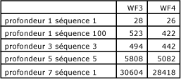</span><span class="sxs-lookup"><span data-stu-id="d81f0-361"></span></span>  
  
 <span data-ttu-id="d81f0-362">Le nombre d'activités dans la définition de workflow augmente nettement avec chaque niveau de profondeur.</span><span class="sxs-lookup"><span data-stu-id="d81f0-362">The number of activities in the workflow definition increases sharply with each depth level.</span></span>  <span data-ttu-id="d81f0-363">Toutefois, un seul chemin par point de décision est exécuté dans une instance de workflow donnée. Par conséquent, seul un petit sous-ensemble des activités réelles est exécuté.</span><span class="sxs-lookup"><span data-stu-id="d81f0-363">But only one path per decision point is executed in a given workflow instance, so only a small subset of the actual activities are executed.</span></span>  
  
 <span data-ttu-id="d81f0-364">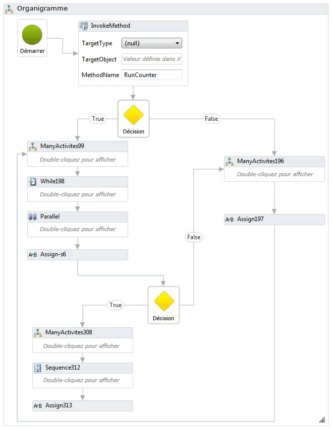</span><span class="sxs-lookup"><span data-stu-id="d81f0-364"></span></span>  
  
 <span data-ttu-id="d81f0-365">Un workflow équivalent a été créé pour WF3.</span><span class="sxs-lookup"><span data-stu-id="d81f0-365">An equivalent workflow was created for WF3.</span></span> <span data-ttu-id="d81f0-366">Le concepteur de WF3 montre l'intégralité du workflow dans la zone de conception au lieu de l'imbriquer, et il est donc trop volumineux pour s'afficher dans cette rubrique.</span><span class="sxs-lookup"><span data-stu-id="d81f0-366">The WF3 designer shows the entire workflow in the design area instead of nesting, therefore it is too big to display in this topic.</span></span> <span data-ttu-id="d81f0-367">Un extrait du workflow est présenté ci-dessous.</span><span class="sxs-lookup"><span data-stu-id="d81f0-367">A snippet of the workflow is shown below.</span></span>  
  
 <span data-ttu-id="d81f0-368">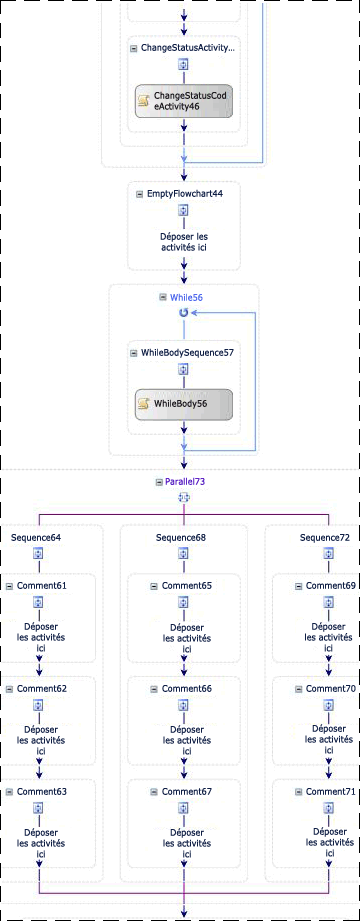</span><span class="sxs-lookup"><span data-stu-id="d81f0-368"></span></span>  
  
 <span data-ttu-id="d81f0-369">Pour effectuer l'imbrication dans un cas extrême, un autre workflow inclus dans ce test utilise 100 séquences imbriquées.</span><span class="sxs-lookup"><span data-stu-id="d81f0-369">To exercise nesting in an extreme case, another workflow that is part of this test uses 100 nested sequences.</span></span>  <span data-ttu-id="d81f0-370">La séquence la plus profonde contient une activité `Comment` ou <xref:System.Workflow.Activities.CodeActivity> unique.</span><span class="sxs-lookup"><span data-stu-id="d81f0-370">In the innermost sequence is a single `Comment` or <xref:System.Workflow.Activities.CodeActivity>.</span></span>  
  
 <span data-ttu-id="d81f0-371">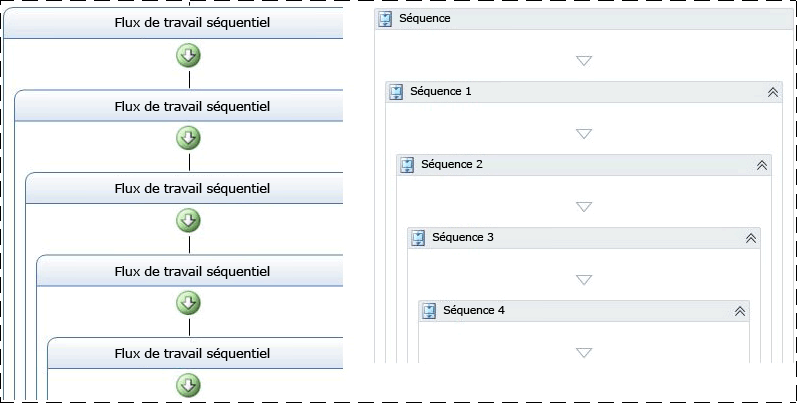</span><span class="sxs-lookup"><span data-stu-id="d81f0-371"></span></span>  
  
 <span data-ttu-id="d81f0-372">Le suivi et la persistance ne sont pas utilisés dans ce test.</span><span class="sxs-lookup"><span data-stu-id="d81f0-372">Tracking and persistence are not used as part of this test.</span></span>  
  
### <a name="test-results"></a><span data-ttu-id="d81f0-373">Résultats des tests</span><span class="sxs-lookup"><span data-stu-id="d81f0-373">Test Results</span></span>  
 <span data-ttu-id="d81f0-374">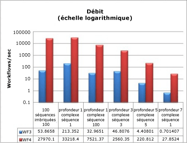</span><span class="sxs-lookup"><span data-stu-id="d81f0-374"></span></span>  
  
 <span data-ttu-id="d81f0-375">Même dans le cas de workflows complexes avec de nombreux niveaux de profondeur et un grand nombre d'activités, les résultats des performances sont cohérents avec d'autres nombres de débit indiqués plus haut dans cet article.</span><span class="sxs-lookup"><span data-stu-id="d81f0-375">Even with complex workflows with lots of depth and a high number of activities, the performance results are consistent with other throughput numbers shown earlier in this article.</span></span>  <span data-ttu-id="d81f0-376">Le débit de WF4 est beaucoup plus rapide et doit être comparé sur une échelle logarithmique.</span><span class="sxs-lookup"><span data-stu-id="d81f0-376">WF4’s throughput is orders of magnitude faster and has to be compared on a logarithmic scale.</span></span>  
  
### <a name="memory"></a><span data-ttu-id="d81f0-377">Mémoire</span><span class="sxs-lookup"><span data-stu-id="d81f0-377">Memory</span></span>  
 <span data-ttu-id="d81f0-378">La charge mémoire de Windows Workflow Foundation est mesurée dans deux domaines clés : complexité de workflow et nombre de définitions de workflow.</span><span class="sxs-lookup"><span data-stu-id="d81f0-378">The memory overhead of Windows Workflow Foundation is measured in two key areas: workflow complexity and number of workflow definitions.</span></span>  <span data-ttu-id="d81f0-379">Les mesures de mémoire proviennent d'une station de travail Windows 7 64 bits.</span><span class="sxs-lookup"><span data-stu-id="d81f0-379">Memory measurements were taken on a Windows 7 64-bit workstation.</span></span>  <span data-ttu-id="d81f0-380">Il existe plusieurs façons d’obtenir la mesure de la taille de jeu telles que la surveillance des compteurs de performances, interrogation d’Environment.WorkingSet ou à l’aide des outils comme VMMap disponible à partir de travail [VMMap](http://technet.microsoft.com/sysinternals/dd535533.aspx).</span><span class="sxs-lookup"><span data-stu-id="d81f0-380">There are many ways to obtain the measurement of working set size such as monitoring performance counters, polling Environment.WorkingSet, or using a tool like VMMap available from [VMMap](http://technet.microsoft.com/sysinternals/dd535533.aspx).</span></span> <span data-ttu-id="d81f0-381">Une combinaison de méthodes a été utilisée pour obtenir et vérifier les résultats de chaque test.</span><span class="sxs-lookup"><span data-stu-id="d81f0-381">A combination of methods was used to obtain and verify the results of each test.</span></span>  
  
### <a name="workflow-complexity-test"></a><span data-ttu-id="d81f0-382">Test de complexité de workflow</span><span class="sxs-lookup"><span data-stu-id="d81f0-382">Workflow Complexity Test</span></span>  
 <span data-ttu-id="d81f0-383">Les test de complexité de workflow mesure la différence du jeu de travail en fonction de la complexité du workflow.</span><span class="sxs-lookup"><span data-stu-id="d81f0-383">The workflow complexity test measures the working set difference based on the complexity of the workflow.</span></span>  <span data-ttu-id="d81f0-384">Outre les workflows complexes utilisés dans la section précédente, de nouvelles variations sont ajoutées pour couvrir deux cas de base : un workflow à activité unique et une séquence avec 1 000 activités.</span><span class="sxs-lookup"><span data-stu-id="d81f0-384">In addition to the complex workflows used in the previous section, new variations are added to cover two basic cases: a single activity workflow and a sequence with 1000 activities.</span></span>  <span data-ttu-id="d81f0-385">Pour ces tests, les workflows sont initialisés et exécutés jusqu'à la fin dans une boucle sérielle unique pour une période d'une minute.</span><span class="sxs-lookup"><span data-stu-id="d81f0-385">For these tests the workflows are initialized and executed to completion in a single serial loop for a period of one minute.</span></span>  <span data-ttu-id="d81f0-386">Chaque variation de test est exécutée trois fois et les données enregistrées correspondent à la moyenne de ces trois exécutions.</span><span class="sxs-lookup"><span data-stu-id="d81f0-386">Each test variation is run three times and the data recorded is the average of those three runs.</span></span>  
  
 <span data-ttu-id="d81f0-387">Les workflows des deux nouveaux tests de base ressemblent à ceux-ci :</span><span class="sxs-lookup"><span data-stu-id="d81f0-387">The two new basic tests have workflows that look like those shown below:</span></span>  
  
 <span data-ttu-id="d81f0-388">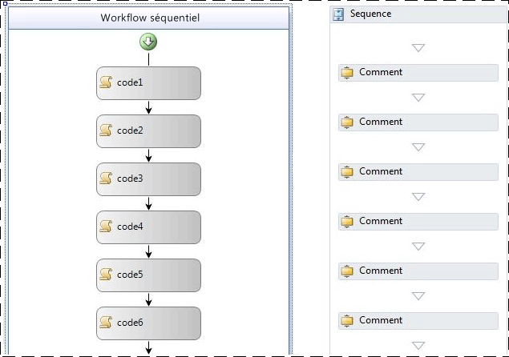</span><span class="sxs-lookup"><span data-stu-id="d81f0-388"></span></span>  
  
 <span data-ttu-id="d81f0-389">Dans le workflow WF3 représenté ci-dessus, des activités <xref:System.Workflow.Activities.CodeActivity> vides sont utilisées.</span><span class="sxs-lookup"><span data-stu-id="d81f0-389">In the WF3 workflow shown above, empty <xref:System.Workflow.Activities.CodeActivity> activities are used.</span></span>  <span data-ttu-id="d81f0-390">Le workflow WF4 ci-dessus utilise des activités `Comment`.</span><span class="sxs-lookup"><span data-stu-id="d81f0-390">The WF4 workflow above uses `Comment` activities.</span></span>  <span data-ttu-id="d81f0-391">L'activité `Comment` a été décrite dans la section « Comparaisons des performances au niveau des composants » plus haut dans cet article.</span><span class="sxs-lookup"><span data-stu-id="d81f0-391">The `Comment` activity was described in the Component-level Performance Comparisons section earlier in this article.</span></span>  
  
 <span data-ttu-id="d81f0-392">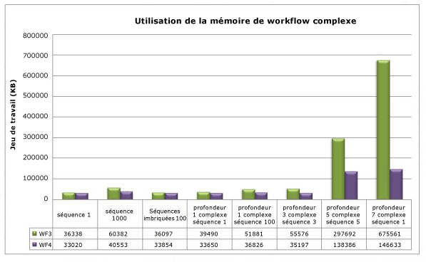</span><span class="sxs-lookup"><span data-stu-id="d81f0-392"></span></span>  
  
 <span data-ttu-id="d81f0-393">Une des tendances nettes à noter dans ce graphique est que l'imbrication a un impact relativement minime sur l'utilisation de la mémoire dans WF3 et WF4.</span><span class="sxs-lookup"><span data-stu-id="d81f0-393">One of the clear trends to notice in this graph is that nesting has relatively minimal impact on memory usage in both WF3 and WF4.</span></span>  <span data-ttu-id="d81f0-394">L'impact le plus important sur la mémoire vient du nombre d'activités dans un workflow donné.</span><span class="sxs-lookup"><span data-stu-id="d81f0-394">The most significant memory impact comes from the number of activities in a given workflow.</span></span>  <span data-ttu-id="d81f0-395">Compte tenu des données de la séquence 1000, les variations de la séquence 5 de profondeur 5 complexe et de la séquence 1 de profondeur 7 complexe, il est clair que lorsque le nombre d'activités se compte en milliers, l'augmentation de l'utilisation de la mémoire devient plus notable.</span><span class="sxs-lookup"><span data-stu-id="d81f0-395">Given the data from the sequence 1000, complex depth 5 sequence 5, and complex depth 7 sequence 1 variations, it is clear that as the number of activities enters the thousands, the memory usage increase becomes more noticeable.</span></span>  <span data-ttu-id="d81f0-396">Dans le cas extrême (séquence 1 de profondeur 7) qui contient environ 29 000 activités, WF4 utilise presque 79 % moins de mémoire que WF3.</span><span class="sxs-lookup"><span data-stu-id="d81f0-396">In the extreme case (depth 7 sequence 1) where there are ~29K activities, WF4 is using almost 79% less memory than WF3.</span></span>  
  
### <a name="multiple-workflow-definitions-test"></a><span data-ttu-id="d81f0-397">Test de plusieurs définitions de workflow</span><span class="sxs-lookup"><span data-stu-id="d81f0-397">Multiple Workflow Definitions Test</span></span>  
 <span data-ttu-id="d81f0-398">La mesure de la mémoire par définition de workflow fait l'objet de deux tests différents à cause des options disponibles pour l'hébergement de workflows dans WF3 et WF4.</span><span class="sxs-lookup"><span data-stu-id="d81f0-398">Measuring memory per workflow definition is divided into two different tests because of the available options for hosting workflows in WF3 and WF4.</span></span>  <span data-ttu-id="d81f0-399">Les tests sont exécutés de manière différente du test de complexité de workflow en ceci qu'un workflow donné est instancié et exécuté seulement une fois par définition.</span><span class="sxs-lookup"><span data-stu-id="d81f0-399">The tests are run in a different manner than the workflow complexity test in that a given workflow is instanced and executed only once per definition.</span></span>  <span data-ttu-id="d81f0-400">Ceci est dû au fait que la définition de workflow et son hôte restent en mémoire pour la durée de vie de l'AppDomain.</span><span class="sxs-lookup"><span data-stu-id="d81f0-400">This is because the workflow definition and its host remain in memory for the lifetime of the AppDomain.</span></span>  <span data-ttu-id="d81f0-401">La mémoire utilisée pour l'exécution d'une instance de workflow donnée doit être nettoyée lors de l'opération garbage collection.</span><span class="sxs-lookup"><span data-stu-id="d81f0-401">The memory used by running a given workflow instance should be cleaned up during garbage collection.</span></span>  <span data-ttu-id="d81f0-402">Les conseils de migration pour WF4 contiennent des informations plus détaillées sur les options d'hébergement.</span><span class="sxs-lookup"><span data-stu-id="d81f0-402">The migration guidance for WF4 contains more detailed information on the hosting options.</span></span> [!INCLUDE[crdefault](../../../includes/crdefault-md.md)]<span data-ttu-id="d81f0-403">[Guide de Migration WF : hébergement de Workflow](http://go.microsoft.com/fwlink/?LinkID=153313).</span><span class="sxs-lookup"><span data-stu-id="d81f0-403"> [WF Migration Cookbook: Workflow Hosting](http://go.microsoft.com/fwlink/?LinkID=153313).</span></span>  
  
 <span data-ttu-id="d81f0-404">Plusieurs méthodes permettent de créer de nombreuses définitions de workflow pour un test de définition de workflow.</span><span class="sxs-lookup"><span data-stu-id="d81f0-404">Creating many workflow definitions for a workflow definition test can be done in several ways.</span></span>  <span data-ttu-id="d81f0-405">Par exemple, la génération de code permet de créer 1000 workflows identiques, sauf en ce qui concerne leurs noms et d'enregistrer chaque workflow dans un fichier distinct.</span><span class="sxs-lookup"><span data-stu-id="d81f0-405">For instance, one could use code generation to create a set of 1000 workflows that are identical except in name and save each of those workflows into separate files.</span></span>  <span data-ttu-id="d81f0-406">Cette approche a été choisie pour le test hébergé sur console.</span><span class="sxs-lookup"><span data-stu-id="d81f0-406">This approach was taken for the console-hosted test.</span></span>  <span data-ttu-id="d81f0-407">Dans WF3, la classe <xref:System.Workflow.Runtime.WorkflowRuntime> a été utilisée pour exécuter les définitions de workflow.</span><span class="sxs-lookup"><span data-stu-id="d81f0-407">In WF3, the <xref:System.Workflow.Runtime.WorkflowRuntime> class was used to run the workflow definitions.</span></span>  <span data-ttu-id="d81f0-408">WF4 peut utiliser <xref:System.Activities.WorkflowApplication> pour créer une instance unique de workflow ou pour utiliser directement <xref:System.Activities.WorkflowInvoker> pour exécuter l'activité comme s'il s'agissait d'un appel de méthode.</span><span class="sxs-lookup"><span data-stu-id="d81f0-408">WF4 can either use <xref:System.Activities.WorkflowApplication> to create a single workflow instance or directly use <xref:System.Activities.WorkflowInvoker> to run the activity as if it were a method call.</span></span>  <span data-ttu-id="d81f0-409"><xref:System.Activities.WorkflowApplication> est l'hôte d'une instance de workflow unique et a une parité de fonctions plus proche de <xref:System.Workflow.Runtime.WorkflowRuntime> et a donc été utilisé dans ce test.</span><span class="sxs-lookup"><span data-stu-id="d81f0-409"><xref:System.Activities.WorkflowApplication> is a host of a single workflow instance and has closer feature parity to <xref:System.Workflow.Runtime.WorkflowRuntime> so that was used in this test.</span></span>  
  
 <span data-ttu-id="d81f0-410">En cas d'hébergement de workflows dans IIS, il est possible d'utiliser un <xref:System.Web.Hosting.VirtualPathProvider> pour créer un nouveau <xref:System.ServiceModel.WorkflowServiceHost> au lieu de générer tous les fichiers XAMLX ou XOML.</span><span class="sxs-lookup"><span data-stu-id="d81f0-410">When hosting workflows in IIS it is possible to use a <xref:System.Web.Hosting.VirtualPathProvider> to create a new <xref:System.ServiceModel.WorkflowServiceHost> instead of generating all of the XAMLX or XOML files.</span></span>  <span data-ttu-id="d81f0-411">Le <xref:System.Web.Hosting.VirtualPathProvider> traite la demande entrante et répond avec un « fichier virtuel » qui peut être chargé à partir d’une base de données ou, dans ce cas, généré à la volée.</span><span class="sxs-lookup"><span data-stu-id="d81f0-411">The <xref:System.Web.Hosting.VirtualPathProvider> handles the incoming request and responds with a "virtual file" that can be loaded from a database or, in this case, generated on the fly.</span></span>  <span data-ttu-id="d81f0-412">Il n'est donc pas nécessaire de créer 1000 fichiers physiques.</span><span class="sxs-lookup"><span data-stu-id="d81f0-412">It is therefore unnecessary to create 1000 physical files.</span></span>  
  
 <span data-ttu-id="d81f0-413">Les définitions de workflow utilisées dans ce test de console étaient des workflows séquentiels simples à activité unique.</span><span class="sxs-lookup"><span data-stu-id="d81f0-413">The workflow definitions used in the console test were simple sequential workflows with a single activity.</span></span>  <span data-ttu-id="d81f0-414">L'activité unique était une <xref:System.Workflow.Activities.CodeActivity> vide pour le cas WF3 et une activité `Comment` pour le cas WF4.</span><span class="sxs-lookup"><span data-stu-id="d81f0-414">The single activity was an empty <xref:System.Workflow.Activities.CodeActivity> for the WF3 case and a `Comment` activity for the WF4 case.</span></span>  <span data-ttu-id="d81f0-415">Le cas hébergé dans IIS utilisait des workflows qui commençaient lors de la réception d'un message et s'achevaient lors de l'envoi d'une réponse :</span><span class="sxs-lookup"><span data-stu-id="d81f0-415">The IIS-hosted case used workflows that start on receiving a message and end on sending a reply:</span></span>  
  
 <span data-ttu-id="d81f0-416">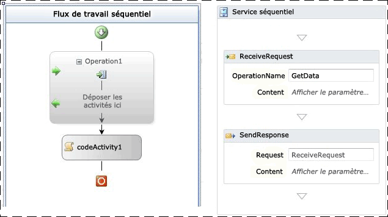</span><span class="sxs-lookup"><span data-stu-id="d81f0-416"></span></span>  
  
 <span data-ttu-id="d81f0-417">Figure 4 – Workflow WF3 avec ReceiveActivity et workflow WF4 avec modèle de demande/réponse</span><span class="sxs-lookup"><span data-stu-id="d81f0-417">Figure 4 – WF3 workflow with ReceiveActivity and WF4 workflow with request/response pattern</span></span>  
  
 <span data-ttu-id="d81f0-418">Le tableau ci-dessous montre le delta de jeu de travail entre une définition de workflow unique et 1001 définitions :</span><span class="sxs-lookup"><span data-stu-id="d81f0-418">The table below shows the delta in working set between a single workflow definition and 1001 definitions:</span></span>  
  
|<span data-ttu-id="d81f0-419">Options d'hébergement </span><span class="sxs-lookup"><span data-stu-id="d81f0-419">Hosting Options</span></span>|<span data-ttu-id="d81f0-420">Delta de jeu de travail WF3</span><span class="sxs-lookup"><span data-stu-id="d81f0-420">WF3 Working Set Delta</span></span>|<span data-ttu-id="d81f0-421">Delta de jeu de travail WF4</span><span class="sxs-lookup"><span data-stu-id="d81f0-421">WF4 Working Set Delta</span></span>|  
|---------------------|---------------------------|---------------------------|  
|<span data-ttu-id="d81f0-422">Workflows hébergés d'application console</span><span class="sxs-lookup"><span data-stu-id="d81f0-422">Console Application Hosted Workflows</span></span>|<span data-ttu-id="d81f0-423">18 MB</span><span class="sxs-lookup"><span data-stu-id="d81f0-423">18 MB</span></span>|<span data-ttu-id="d81f0-424">9 MB</span><span class="sxs-lookup"><span data-stu-id="d81f0-424">9 MB</span></span>|  
|<span data-ttu-id="d81f0-425">Services de workflow hébergés par IIS</span><span class="sxs-lookup"><span data-stu-id="d81f0-425">IIS Hosted Workflow Services</span></span>|<span data-ttu-id="d81f0-426">446 MB</span><span class="sxs-lookup"><span data-stu-id="d81f0-426">446 MB</span></span>|<span data-ttu-id="d81f0-427">364 MB</span><span class="sxs-lookup"><span data-stu-id="d81f0-427">364 MB</span></span>|  
  
 <span data-ttu-id="d81f0-428">L'hébergement de définitions de workflow par IIS consomme beaucoup plus de mémoire à cause du <xref:System.ServiceModel.WorkflowServiceHost>, des artefacts de service [!INCLUDE[indigo2](../../../includes/indigo2-md.md)] détaillés et de la logique de traitement de messages associée à l'hôte.</span><span class="sxs-lookup"><span data-stu-id="d81f0-428">Hosting workflow definitions in IIS consumes much more memory due to the <xref:System.ServiceModel.WorkflowServiceHost>, detailed [!INCLUDE[indigo2](../../../includes/indigo2-md.md)] service artifacts, and the message processing logic associated with the host.</span></span>  
  
 <span data-ttu-id="d81f0-429">Pour l'hébergement sur console dans WF3 les workflows étaient implémentés dans le code plutôt que dans le format XOML.</span><span class="sxs-lookup"><span data-stu-id="d81f0-429">For console hosting in WF3 the workflows were implemented in code instead of XOML.</span></span>  <span data-ttu-id="d81f0-430">Dans WF4, XAML est utilisé par défaut.</span><span class="sxs-lookup"><span data-stu-id="d81f0-430">In WF4 the default is to use XAML.</span></span>  <span data-ttu-id="d81f0-431">Le XAML est stocké en tant que ressource incorporée dans l'assembly et compilé pendant l'exécution afin de fournir l'implémentation du workflow.</span><span class="sxs-lookup"><span data-stu-id="d81f0-431">The XAML is stored as an embedded resource in the assembly and compiled during runtime to provide the implementation of the workflow.</span></span>  <span data-ttu-id="d81f0-432">Une charge mémoire est associée à ce processus.</span><span class="sxs-lookup"><span data-stu-id="d81f0-432">There is some overhead associated with this process.</span></span>  <span data-ttu-id="d81f0-433">Pour une comparaison équitable entre WF3 et WF4, des workflows codés ont été utilisés au lieu de worflows XAML.</span><span class="sxs-lookup"><span data-stu-id="d81f0-433">In order to make a fair comparison between WF3 and WF4, coded workflows were used instead of XAML.</span></span>  <span data-ttu-id="d81f0-434">Un exemple d'un des workflows WF4 vous est proposé ci-après.</span><span class="sxs-lookup"><span data-stu-id="d81f0-434">An example of one of the WF4 workflows is shown below:</span></span>  
  
```  
public class Workflow1 : Activity  
{  
    protected override Func<Activity> Implementation  
    {  
        get  
        {  
            return new Func<Activity>(() =>  
            {  
                return new Sequence  
                {  
                    Activities = {  
                        new Comment()  
                    }  
                };  
            });  
        }  
        set  
        {  
            base.Implementation = value;  
        }  
    }  
}  
```  
  
 <span data-ttu-id="d81f0-435">Beaucoup d'autres facteurs peuvent affecter la consommation de mémoire.</span><span class="sxs-lookup"><span data-stu-id="d81f0-435">There are many other factors that can affect memory consumption.</span></span> <span data-ttu-id="d81f0-436">Le même conseil pour tous les programmes gérés est toujours applicable.</span><span class="sxs-lookup"><span data-stu-id="d81f0-436">The same advice for all managed programs still applies.</span></span>  <span data-ttu-id="d81f0-437">Dans les environnements hébergés par IIS, l'objet <xref:System.ServiceModel.WorkflowServiceHost> créé pour une définition de workflow reste en mémoire jusqu'à ce que le pool d'application soit recyclé.</span><span class="sxs-lookup"><span data-stu-id="d81f0-437">In IIS-hosted environments, the <xref:System.ServiceModel.WorkflowServiceHost> object created for a workflow definition stays in memory until the application pool is recycled.</span></span>  <span data-ttu-id="d81f0-438">Il ne faut pas l’oublier lors de l’écriture d’extensions.</span><span class="sxs-lookup"><span data-stu-id="d81f0-438">This should be kept in mind when writing extensions.</span></span>  <span data-ttu-id="d81f0-439">En outre, il est préférable éviter des variables « globales » (variables étendues au flux de travail entière) et de limiter la portée des variables dans la mesure du possible.</span><span class="sxs-lookup"><span data-stu-id="d81f0-439">Also, it is best to avoid "global" variables (variables scoped to the whole workflow) and limit the scope of variables wherever possible.</span></span>  
  
## <a name="workflow-runtime-services"></a><span data-ttu-id="d81f0-440">Services d'exécution de workflow</span><span class="sxs-lookup"><span data-stu-id="d81f0-440">Workflow Runtime Services</span></span>  
  
### <a name="persistence"></a><span data-ttu-id="d81f0-441">Persistance</span><span class="sxs-lookup"><span data-stu-id="d81f0-441">Persistence</span></span>  
 <span data-ttu-id="d81f0-442">WF3 et WF4 sont fournis avec un fournisseur de persistance SQL.</span><span class="sxs-lookup"><span data-stu-id="d81f0-442">WF3 and WF4 both ship with a SQL persistence provider.</span></span>  <span data-ttu-id="d81f0-443">Le fournisseur de persistance SQL de WF3 est une implémentation simple qui sérialise l'instance de workflow et la stocke dans un blob.</span><span class="sxs-lookup"><span data-stu-id="d81f0-443">The WF3 SQL persistence provider is a simple implementation that serializes the workflow instance and stores it in a blob.</span></span>  <span data-ttu-id="d81f0-444">Pour cette raison, les performances de ce fournisseur dépendent fortement de la taille de l'instance de workflow.</span><span class="sxs-lookup"><span data-stu-id="d81f0-444">For this reason, the performance of this provider depends heavily on the size of the workflow instance.</span></span>  <span data-ttu-id="d81f0-445">Dans WF3, la taille de l'instance pouvait augmenter pour de nombreuses raisons, comme indiqué précédemment dans cet article.</span><span class="sxs-lookup"><span data-stu-id="d81f0-445">In WF3, the instance size could increase for many reasons, as is discussed previously in this paper.</span></span>  <span data-ttu-id="d81f0-446">De nombreux clients choisissent de ne pas utiliser le fournisseur de persistance SQL par défaut, car le stockage d'une instance sérialisée dans une base de données ne donne aucune visibilité sur l'état du workflow.</span><span class="sxs-lookup"><span data-stu-id="d81f0-446">Many customers choose not to use the default SQL persistence provider because storing a serialized instance in a database gives no visibility into the state of the workflow.</span></span>  <span data-ttu-id="d81f0-447">Pour trouver un workflow particulier sans connaître son ID, il faudrait désérialiser chaque instance persistante et examiner son contenu.</span><span class="sxs-lookup"><span data-stu-id="d81f0-447">In order to find a particular workflow without knowing the workflow id, one would have to deserialize each persisted instance and examine the contents.</span></span>  <span data-ttu-id="d81f0-448">Beaucoup de développeurs préfèrent écrire leurs propres fournisseurs de persistance afin de surmonter cet obstacle.</span><span class="sxs-lookup"><span data-stu-id="d81f0-448">Many developers prefer to write their own persistence providers to overcome this obstacle.</span></span>  
  
 <span data-ttu-id="d81f0-449">Le fournisseur de persistance SQL de WF4 SQL a tenté de régler ces problèmes.</span><span class="sxs-lookup"><span data-stu-id="d81f0-449">The WF4 SQL persistence provider has tried to address some of these concerns.</span></span>  <span data-ttu-id="d81f0-450">Les tables de persistance exposent des informations telles que les signets actifs et les propriétés pouvant être promues.</span><span class="sxs-lookup"><span data-stu-id="d81f0-450">The persistence tables expose certain information such as the active bookmarks and promotable properties.</span></span>  <span data-ttu-id="d81f0-451">La nouvelle fonctionnalité de corrélation basée sur le contenu de WF4 ne fonctionnerait pas correctement avec l'approche de persistance SQL de WF3, qui a entraîné des modifications dans l'organisation de l'instance de workflow persistante.</span><span class="sxs-lookup"><span data-stu-id="d81f0-451">The new content-based correlation feature in WF4 would not perform well using the WF3 SQL persistence approach, which has driven some change in the organization of the persisted workflow instance.</span></span>  <span data-ttu-id="d81f0-452">Cela rend le travail du fournisseur de persistance plus complexe et augmente le stress sur la base de données.</span><span class="sxs-lookup"><span data-stu-id="d81f0-452">This makes the job of the persistence provider more complex and puts extra stress on the database.</span></span>  
  
### <a name="environment-setup"></a><span data-ttu-id="d81f0-453">Configuration de l'environnement</span><span class="sxs-lookup"><span data-stu-id="d81f0-453">Environment Setup</span></span>  
 <span data-ttu-id="d81f0-454"></span><span class="sxs-lookup"><span data-stu-id="d81f0-454"></span></span>  
  
### <a name="test-setup"></a><span data-ttu-id="d81f0-455">Configuration du test</span><span class="sxs-lookup"><span data-stu-id="d81f0-455">Test Setup</span></span>  
 <span data-ttu-id="d81f0-456">Même avec un jeu de fonctionnalités amélioré et une meilleure gestion d'accès concurrentiel, le fournisseur de persistance SQL de WF4 est plus rapide que celui de WF3.</span><span class="sxs-lookup"><span data-stu-id="d81f0-456">Even with an improved feature set and better concurrency handling, the SQL persistence provider in WF4 is faster than the provider in WF3.</span></span>  <span data-ttu-id="d81f0-457">Pour illustrer cela, deux workflows qui exécutent des opérations identiques pour l'essentiel dans WF3 et WF4 sont comparés ci-dessous.</span><span class="sxs-lookup"><span data-stu-id="d81f0-457">To showcase this, two workflows that perform essentially the same operations in WF3 and WF4 are compared below.</span></span>  
  
 <span data-ttu-id="d81f0-458">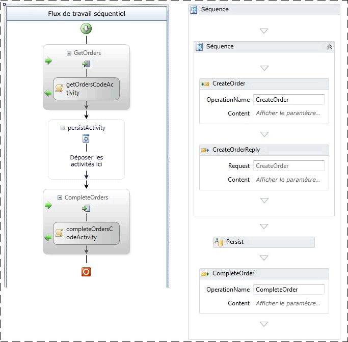</span><span class="sxs-lookup"><span data-stu-id="d81f0-458"></span></span>  
  
 <span data-ttu-id="d81f0-459">Figure 5 – Workflow de persistance de WF3 à gauche et de WF4 à droite</span><span class="sxs-lookup"><span data-stu-id="d81f0-459">Figure 5 – Persistence workflow in WF3 on left and WF4 on right</span></span>  
  
 <span data-ttu-id="d81f0-460">Les deux workflows sont créés par un message reçu.</span><span class="sxs-lookup"><span data-stu-id="d81f0-460">The two workflows are both created by a received message.</span></span>  <span data-ttu-id="d81f0-461">Une fois la réponse initiale envoyée, le workflow est persistant.</span><span class="sxs-lookup"><span data-stu-id="d81f0-461">After sending an initial reply, the workflow is persisted.</span></span>  <span data-ttu-id="d81f0-462">Dans le cas de WF3, une <xref:System.Workflow.ComponentModel.TransactionScopeActivity> vide est utilisée pour initier la persistance.</span><span class="sxs-lookup"><span data-stu-id="d81f0-462">In the WF3 case, an empty <xref:System.Workflow.ComponentModel.TransactionScopeActivity> is used to initiate the persistence.</span></span>  <span data-ttu-id="d81f0-463">Le même peut être effectué dans WF3 en marquant une activité avec « persister lors de la fermeture ».</span><span class="sxs-lookup"><span data-stu-id="d81f0-463">The same could be achieved in WF3 by marking an activity as "persist on close."</span></span>  <span data-ttu-id="d81f0-464">Un second message corrélé termine le workflow.</span><span class="sxs-lookup"><span data-stu-id="d81f0-464">A second, correlated message completes the workflow.</span></span>  <span data-ttu-id="d81f0-465">Les workflows sont persistants mais pas déchargés.</span><span class="sxs-lookup"><span data-stu-id="d81f0-465">The workflows are persisted but not unloaded.</span></span>  
  
### <a name="test-results"></a><span data-ttu-id="d81f0-466">Résultats des tests</span><span class="sxs-lookup"><span data-stu-id="d81f0-466">Test Results</span></span>  
 <span data-ttu-id="d81f0-467">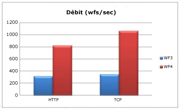</span><span class="sxs-lookup"><span data-stu-id="d81f0-467"></span></span>  
  
 <span data-ttu-id="d81f0-468">Lorsque le transport entre le client et le niveau intermédiaire est HTTP, la persistance dans WF4 présente une amélioration de 2,6 fois.</span><span class="sxs-lookup"><span data-stu-id="d81f0-468">When the transport between client and middle tier is HTTP, persistence in WF4 shows an improvement of 2.6 times.</span></span>  <span data-ttu-id="d81f0-469">Avec le transport TCP, ce facteur est de 3 fois.</span><span class="sxs-lookup"><span data-stu-id="d81f0-469">The TCP transport increases that factor to 3.0 times.</span></span>  <span data-ttu-id="d81f0-470">Dans tous le cas, l'utilisation de l'UC sur le niveau intermédiaire est de 98 % ou supérieure.</span><span class="sxs-lookup"><span data-stu-id="d81f0-470">In all cases, CPU utilization on the middle tier is 98% or higher.</span></span>  <span data-ttu-id="d81f0-471">Le débit est plus élevé dans WF4 à cause du runtime de workflow plus rapide.</span><span class="sxs-lookup"><span data-stu-id="d81f0-471">The reason that WF4 throughput is greater is due to the faster workflow runtime.</span></span>  <span data-ttu-id="d81f0-472">La taille de l'instance sérialisée est petite dans les deux cas et n'est pas un élément contributif majeur dans cette situation.</span><span class="sxs-lookup"><span data-stu-id="d81f0-472">The size of the serialized instance is low for both cases and is not a major contributing element in this situation.</span></span>  
  
 <span data-ttu-id="d81f0-473">Les workflows WF3 et WF4 de ce test utilisent une activité pour indiquer explicitement quand la persistance doit avoir lieu.</span><span class="sxs-lookup"><span data-stu-id="d81f0-473">Both the WF3 and WF4 workflows in this test use an activity to explicitly indicate when persistence should occur.</span></span>  <span data-ttu-id="d81f0-474">Cela a pour avantage de faire persister le workflow sans le décharger.</span><span class="sxs-lookup"><span data-stu-id="d81f0-474">This has the benefit of persisting the workflow without unloading it.</span></span>  <span data-ttu-id="d81f0-475">Dans WF3, il est également possible de le faire persister à l'aide de la fonctionnalité <xref:System.ServiceModel.Activities.Description.WorkflowIdleBehavior.TimeToUnload%2A>, mais cela décharge l'instance de workflow de la mémoire.</span><span class="sxs-lookup"><span data-stu-id="d81f0-475">In WF3, it is also possible to persist using the <xref:System.ServiceModel.Activities.Description.WorkflowIdleBehavior.TimeToUnload%2A> feature, but this unloads the workflow instance from memory.</span></span>  <span data-ttu-id="d81f0-476">Si un développeur utilisant WF3 veut s'assurer qu'un workflow persiste à certains points, il doit modifier la définition du workflow ou payer le coût du déchargement et du rechargement de l'instance de workflow.</span><span class="sxs-lookup"><span data-stu-id="d81f0-476">If a developer using WF3 wants to make sure a workflow persists at certain points, they either have to alter the workflow definition or pay the cost for unloading and re-loading the workflow instance.</span></span>  <span data-ttu-id="d81f0-477">Une nouvelle fonctionnalité de WF4 permet la persistance sans déchargement : <xref:System.ServiceModel.Activities.Description.WorkflowIdleBehavior.TimeToPersist%2A>.</span><span class="sxs-lookup"><span data-stu-id="d81f0-477">A new feature in WF4 makes it possible to persist without unloading: <xref:System.ServiceModel.Activities.Description.WorkflowIdleBehavior.TimeToPersist%2A>.</span></span>  <span data-ttu-id="d81f0-478">Cette fonctionnalité permet de faire persister l'instance de workflow en cas de période d'inactivité, mais de la conserver dans la mémoire jusqu'à ce que le seuil de <xref:System.ServiceModel.Activities.Description.WorkflowIdleBehavior.TimeToUnload%2A> soit atteint ou que l'exécution reprenne.</span><span class="sxs-lookup"><span data-stu-id="d81f0-478">This feature allows the workflow instance to be persisted on idle but stay in memory until the <xref:System.ServiceModel.Activities.Description.WorkflowIdleBehavior.TimeToUnload%2A> threshold is met or execution is resumed.</span></span>  
  
 <span data-ttu-id="d81f0-479">Notez que le fournisseur de persistance SQL de WF4 effectue davantage de travail dans la couche de base de données.</span><span class="sxs-lookup"><span data-stu-id="d81f0-479">Note that the WF4 SQL persistence provider performs more work in the database tier.</span></span>  <span data-ttu-id="d81f0-480">La base de données SQL peut se transformer en goulot d'étranglement, il est donc important de surveiller l'utilisation du processeur et du disque à cet endroit.</span><span class="sxs-lookup"><span data-stu-id="d81f0-480">The SQL database can become a bottleneck so it is important to monitor the CPU and disk usage there.</span></span>  <span data-ttu-id="d81f0-481">Assurez-vous d’inclure les compteurs de performance suivants de la base de données SQL lors d’un test de performance des applications de workflow :</span><span class="sxs-lookup"><span data-stu-id="d81f0-481">Be sure to include the following performance counters from the SQL database when performance testing workflow applications:</span></span>  
  
-   <span data-ttu-id="d81f0-482">Disque physique\\temps de lecture du disque</span><span class="sxs-lookup"><span data-stu-id="d81f0-482">PhysicalDisk\\%Disk Read Time</span></span>  
  
-   <span data-ttu-id="d81f0-483">Disque physique\\% temps du disque</span><span class="sxs-lookup"><span data-stu-id="d81f0-483">PhysicalDisk\\% Disk Time</span></span>  
  
-   <span data-ttu-id="d81f0-484">Disque physique\\heure d’écriture disque</span><span class="sxs-lookup"><span data-stu-id="d81f0-484">PhysicalDisk\\% Disk Write Time</span></span>  
  
-   <span data-ttu-id="d81f0-485">Disque physique\\% moyenne Longueur de file d'attente disque</span><span class="sxs-lookup"><span data-stu-id="d81f0-485">PhysicalDisk\\% Avg. Disk Queue Length</span></span>  
  
-   <span data-ttu-id="d81f0-486">PhysicalDisk\Long. moy. de file d'attente lecture disque</span><span class="sxs-lookup"><span data-stu-id="d81f0-486">PhysicalDisk\Avg. Disk Read Queue Length</span></span>  
  
-   <span data-ttu-id="d81f0-487">PhysicalDisk\Long. moy. de file d'attente écriture disque</span><span class="sxs-lookup"><span data-stu-id="d81f0-487">PhysicalDisk\Avg. Disk Write Queue Length</span></span>  
  
-   <span data-ttu-id="d81f0-488">PhysicalDisk\Longueur actuelle de la file d'attente du disque</span><span class="sxs-lookup"><span data-stu-id="d81f0-488">PhysicalDisk\Current Disk Queue Length</span></span>  
  
-   <span data-ttu-id="d81f0-489">Informations de processeur\\% temps processeur</span><span class="sxs-lookup"><span data-stu-id="d81f0-489">Processor Information\\% Processor Time</span></span>  
  
-   <span data-ttu-id="d81f0-490">SQLServer : Verrous internes\Durée d'attente moyenne d'un verrou interne (ms)</span><span class="sxs-lookup"><span data-stu-id="d81f0-490">SQLServer:Latches\Average Latch Wait Time (ms)</span></span>  
  
-   <span data-ttu-id="d81f0-491">SQLServer : Verrous internes\Attentes de verrous NP internes/s</span><span class="sxs-lookup"><span data-stu-id="d81f0-491">SQLServer:Latches\Latch Waits/sec</span></span>  
  
### <a name="tracking"></a><span data-ttu-id="d81f0-492">Suivi</span><span class="sxs-lookup"><span data-stu-id="d81f0-492">Tracking</span></span>  
 <span data-ttu-id="d81f0-493">Le suivi de workflow permet de suivre la progression d'un workflow.</span><span class="sxs-lookup"><span data-stu-id="d81f0-493">Workflow tracking can be used to track the progress of a workflow.</span></span>  <span data-ttu-id="d81f0-494">Les informations incluses dans les événements de suivi sont déterminées par un modèle de suivi.</span><span class="sxs-lookup"><span data-stu-id="d81f0-494">The information that is included in the tracking events is determined by a tracking profile.</span></span>  <span data-ttu-id="d81f0-495">Plus le modèle de suivi est complexe, plus cette opération est coûteuse.</span><span class="sxs-lookup"><span data-stu-id="d81f0-495">The more complex the tracking profile, the more expensive tracking becomes.</span></span>  
  
 <span data-ttu-id="d81f0-496">WF3 était fourni avec un service de suivi SQL.</span><span class="sxs-lookup"><span data-stu-id="d81f0-496">WF3 shipped with a SQL-based tracking service.</span></span>  <span data-ttu-id="d81f0-497">Ce service fonctionnait en mode batch et non-batch.</span><span class="sxs-lookup"><span data-stu-id="d81f0-497">This service could work in batched and non-batched modes.</span></span>  <span data-ttu-id="d81f0-498">En mode non-batch, les événements de suivi sont écrits directement dans la base de données.</span><span class="sxs-lookup"><span data-stu-id="d81f0-498">In non-batched mode, tracking events are written directly to the database.</span></span>  <span data-ttu-id="d81f0-499">En mode batch, les événements de suivi sont regroupés dans le même lot que l'état de l'instance de workflow.</span><span class="sxs-lookup"><span data-stu-id="d81f0-499">In batched mode, tracking events are collected into the same batch as the workflow instance state.</span></span>  <span data-ttu-id="d81f0-500">Le mode batch offre les meilleures performances pour l'éventail de conceptions de workflow le plus large.</span><span class="sxs-lookup"><span data-stu-id="d81f0-500">The batched mode has the best performance for the widest range of workflow designs.</span></span>  <span data-ttu-id="d81f0-501">Toutefois, le traitement par lots peut avoir un impact négatif sur les performances si le workflow exécute de nombreuses activités sans persistance et que ces activités sont suivies.</span><span class="sxs-lookup"><span data-stu-id="d81f0-501">However, batching can have a negative performance impact if the workflow runs many activities without persisting and those activities are tracked.</span></span>  <span data-ttu-id="d81f0-502">Cela se produit généralement dans les boucles et la meilleure façon d'éviter ce scénario consiste à concevoir de grandes boucles pour contenir un point de persistance.</span><span class="sxs-lookup"><span data-stu-id="d81f0-502">This would commonly happen in loops and the best way to avoid this scenario is to design large loops to contain a persistence point.</span></span>  <span data-ttu-id="d81f0-503">L'introduction d'un point de persistance dans une boucle peut également avoir un impact négatif sur les performances. Il est donc important de mesurer les coûts de chaque élément et d'atteindre un équilibre.</span><span class="sxs-lookup"><span data-stu-id="d81f0-503">Introducing a persistence point into a loop can negatively affect performance as well so it is important to measure the costs of each and come up with a balance.</span></span>  
  
 <span data-ttu-id="d81f0-504">WF4 n'est pas fourni avec un service de suivi SQL.</span><span class="sxs-lookup"><span data-stu-id="d81f0-504">WF4 is not shipped with a SQL tracking service.</span></span>  <span data-ttu-id="d81f0-505">L'enregistrement des informations de suivi dans une base de données SQL est plus facile à gérer à partir d'un serveur d'applications plutôt que s'il est intégré dans [!INCLUDE[dnprdnshort](../../../includes/dnprdnshort-md.md)].</span><span class="sxs-lookup"><span data-stu-id="d81f0-505">Recording tracking information to a SQL database can be handled better from an application server rather than built into the [!INCLUDE[dnprdnshort](../../../includes/dnprdnshort-md.md)].</span></span> <span data-ttu-id="d81f0-506">Par conséquent, le suivi SQL est désormais géré par AppFabric.</span><span class="sxs-lookup"><span data-stu-id="d81f0-506">Therefore SQL tracking is now handled by AppFabric.</span></span>  <span data-ttu-id="d81f0-507">Le fournisseur de suivi prédéfini de WF4 est basé sur ETW (suivi d'événements Windows).</span><span class="sxs-lookup"><span data-stu-id="d81f0-507">The out-of-the-box tracking provider in WF4 is based on Event Tracing for Windows (ETW).</span></span>  
  
 <span data-ttu-id="d81f0-508">ETW est un système d'événement de niveau noyau à faible latence intégré à Windows.</span><span class="sxs-lookup"><span data-stu-id="d81f0-508">ETW is a kernel-level, low-latency event system built into Windows.</span></span>  <span data-ttu-id="d81f0-509">Il utilise un modèle fournisseur/consommateur qui permet d'encourir la pénalité liée au suivi d'événements seulement lorsqu'il y a réellement un consommateur.</span><span class="sxs-lookup"><span data-stu-id="d81f0-509">It uses a provider/consumer model that makes it possible to only incur the penalty for event tracing when there is actually a consumer.</span></span>  <span data-ttu-id="d81f0-510">Outre les événements de noyau tels que l'utilisation du processeur, du disque, de la mémoire et du réseau, de nombreuses applications tirent également parti d'ETW.</span><span class="sxs-lookup"><span data-stu-id="d81f0-510">In addition to kernel events such as processor, disk, memory, and network usage, many applications leverage ETW as well.</span></span>  <span data-ttu-id="d81f0-511">Les événements ETW sont plus puissants que les compteurs de performance en ceci que les événements peuvent être personnalisés pour l'application.</span><span class="sxs-lookup"><span data-stu-id="d81f0-511">ETW events are more powerful than performance counters in that events can be customized to the application.</span></span>  <span data-ttu-id="d81f0-512">Un événement peut contenir du texte tel qu'un ID de workflow ou un message d'information.</span><span class="sxs-lookup"><span data-stu-id="d81f0-512">An event can contain text such as a workflow ID or an informational message.</span></span>  <span data-ttu-id="d81f0-513">En outre, les événements sont classés à l'aide de masque de bits, de sorte que l'utilisation d'un sous-ensemble d'événements donné aura moins d'impact sur les performances que la capture de tous les événements.</span><span class="sxs-lookup"><span data-stu-id="d81f0-513">Also, events are categorized with bitmasks so that consuming a certain subset of events will have less performance impact than capturing all events.</span></span>  
  
 <span data-ttu-id="d81f0-514">Les avantages de l'utilisation d'ETW pour le suivi au lieu de SQL sont les suivants :</span><span class="sxs-lookup"><span data-stu-id="d81f0-514">Benefits to the approach of using ETW for tracking instead of SQL include:</span></span>  
  
-   <span data-ttu-id="d81f0-515">Le regroupement d'événements de suivi peut être séparé dans un processus distinct.</span><span class="sxs-lookup"><span data-stu-id="d81f0-515">Collection of tracking events can be separated to another process.</span></span>  <span data-ttu-id="d81f0-516">Cela augmente la flexibilité de l'enregistrement des événements.</span><span class="sxs-lookup"><span data-stu-id="d81f0-516">This gives greater flexibility in how the events are recorded.</span></span>  
  
-   <span data-ttu-id="d81f0-517">Les événements de suivi ETW sont combinés facilement avec les événements ETW [!INCLUDE[indigo2](../../../includes/indigo2-md.md)] ou d'autres fournisseurs ETW tels qu'un fournisseur SQL Server ou du noyau.</span><span class="sxs-lookup"><span data-stu-id="d81f0-517">ETW tracking events are easily combined with the [!INCLUDE[indigo2](../../../includes/indigo2-md.md)] ETW events or other ETW providers such as a SQL Server or kernel provider.</span></span>  
  
-   <span data-ttu-id="d81f0-518">Les auteurs de workflow n'ont pas besoin de modifier un workflow pour qu'il fonctionne mieux avec une implémentation de suivi particulière, telle que le mode batch du service de suivi SQL de WF3.</span><span class="sxs-lookup"><span data-stu-id="d81f0-518">Workflow authors do not need to alter a workflow to work better with a particular tracking implementation, such as the WF3 SQL tracking service’s batch mode.</span></span>  
  
-   <span data-ttu-id="d81f0-519">Un administrateur peut activer ou désactiver le suivi sans recycler le processus hôte.</span><span class="sxs-lookup"><span data-stu-id="d81f0-519">An administrator can turn tracking on or off without recycling the host process.</span></span>  
  
 <span data-ttu-id="d81f0-520">Les avantages en matière de performances pour le suivi ETW s'accompagnent d'un inconvénient.</span><span class="sxs-lookup"><span data-stu-id="d81f0-520">The performance benefits to ETW tracking come with a drawback.</span></span>  <span data-ttu-id="d81f0-521">Les événements ETW peuvent être perdus si le système subit une pression intense sur les ressources.</span><span class="sxs-lookup"><span data-stu-id="d81f0-521">ETW events can be lost if the system is under intense resource pressure.</span></span>  <span data-ttu-id="d81f0-522">Le traitement des événements n'est pas destiné à bloquer l'exécution normale du programme et il n'est donc pas garanti que tous les événements ETW seront diffusés à leurs abonnés.</span><span class="sxs-lookup"><span data-stu-id="d81f0-522">The processing of events is not meant to block normal program execution and therefore it is not guaranteed that all ETW events will be broadcast to their subscribers.</span></span>  <span data-ttu-id="d81f0-523">Le suivi ETW est donc idéal pour le contrôle d'état, mais il n'est pas approprié pour l'audit.</span><span class="sxs-lookup"><span data-stu-id="d81f0-523">This makes ETW tracking great for health monitoring but not suitable for auditing.</span></span>  
  
 <span data-ttu-id="d81f0-524">Contrairement à WF4, AppFabric est doté d'un fournisseur de suivi SQL.</span><span class="sxs-lookup"><span data-stu-id="d81f0-524">While WF4 does not have a SQL tracking provider, AppFabric does.</span></span>  <span data-ttu-id="d81f0-525">L'approche de suivi d'AppFabric consiste à s'abonner aux événements ETW à l'aide d'un service Windows qui traite les événements par lots et les écrit dans une table SQL conçue pour des insertions rapides.</span><span class="sxs-lookup"><span data-stu-id="d81f0-525">AppFabric’s SQL tracking approach is to subscribe to ETW events with a Windows Service that batches the events and writes them to a SQL table designed for quick inserts.</span></span>  <span data-ttu-id="d81f0-526">Un travail séparé extrait les données de cette table et les restitue dans des tables de rapports pouvant être affichées sur le tableau de bord AppFabric.</span><span class="sxs-lookup"><span data-stu-id="d81f0-526">A separate job drains the data from this table and reforms it into reporting tables that can be viewed on the AppFabric dashboard.</span></span>  <span data-ttu-id="d81f0-527">Cela signifie qu'un lot d'événements de suivi est traité indépendamment du workflow dont il provient et qu'il ne doit pas attendre un point de persistance pour être enregistré.</span><span class="sxs-lookup"><span data-stu-id="d81f0-527">This means that a batch of tracking events is handled independent of the workflow it came from and therefore does not have to wait for a persistence point before being recorded.</span></span>  
  
 <span data-ttu-id="d81f0-528">Les événements ETW peuvent être enregistrés à l'aide d'outils tels que logman ou xperf.</span><span class="sxs-lookup"><span data-stu-id="d81f0-528">ETW events can be recorded with tools such as logman or xperf.</span></span>  <span data-ttu-id="d81f0-529">Le fichier ETL compact peut être affiché avec un outil tel que xperfview ou converti dans un format plus lisible, tel que XML, à l'aide de tracerpt.</span><span class="sxs-lookup"><span data-stu-id="d81f0-529">The compact ETL file can be viewed with a tool like xperfview or converted to a more readable format, such as XML, with tracerpt.</span></span>  <span data-ttu-id="d81f0-530">Dans WF3, la seule option permettant d'obtenir des événements de suivi sans base de données SQL consiste à créer un service de suivi personnalisé.</span><span class="sxs-lookup"><span data-stu-id="d81f0-530">In WF3, the only option for getting tracking events without a SQL database is to create a custom tracking service.</span></span> [!INCLUDE[crabout](../../../includes/crabout-md.md)]<span data-ttu-id="d81f0-531">ETW, consultez [les Services WCF et Event Tracing for Windows](../../../docs/framework/wcf/samples/wcf-services-and-event-tracing-for-windows.md) et [Event Tracing for Windows](http://msdn.microsoft.com/library/ff190903.aspx\)).</span><span class="sxs-lookup"><span data-stu-id="d81f0-531"> ETW, see [WCF Services and Event Tracing for Windows](../../../docs/framework/wcf/samples/wcf-services-and-event-tracing-for-windows.md) and [Event Tracing for Windows](http://msdn.microsoft.com/library/ff190903.aspx\)).</span></span>  
  
 <span data-ttu-id="d81f0-532">L'activation du suivi de workflow affecte les performances à des degrés divers.</span><span class="sxs-lookup"><span data-stu-id="d81f0-532">Enabling workflow tracking will impact performance in varying degrees.</span></span>  <span data-ttu-id="d81f0-533">Le test d'évaluation ci-dessous emploie l'outil logman pour consommer les événements de suivi ETW et les enregistrer dans un fichier ETL.</span><span class="sxs-lookup"><span data-stu-id="d81f0-533">The benchmark below uses the logman tool to consume the ETW tracking events and record them to an ETL file.</span></span>  <span data-ttu-id="d81f0-534">Le coût du suivi SQL dans AppFabric n'est pas couvert dans cet article.</span><span class="sxs-lookup"><span data-stu-id="d81f0-534">The cost of the SQL tracking in AppFabric is not in the scope of this article.</span></span>  <span data-ttu-id="d81f0-535">Le modèle de suivi de base, également utilisé dans AppFabric, est décrit dans ce test d'évaluation.</span><span class="sxs-lookup"><span data-stu-id="d81f0-535">The basic tracking profile, also used in AppFabric, is shown in this benchmark.</span></span>  <span data-ttu-id="d81f0-536">Ce test inclut également le coût du suivi des événements de contrôle d'état uniquement.</span><span class="sxs-lookup"><span data-stu-id="d81f0-536">Also included is the cost of tracking only health monitoring events.</span></span>  <span data-ttu-id="d81f0-537">Ces événements sont utiles pour résoudre les problèmes et déterminer le débit moyen du système.</span><span class="sxs-lookup"><span data-stu-id="d81f0-537">These events are useful for troubleshooting problems and determining the average throughput of the system.</span></span>  
  
### <a name="environment-setup"></a><span data-ttu-id="d81f0-538">Configuration de l'environnement</span><span class="sxs-lookup"><span data-stu-id="d81f0-538">Environment Setup</span></span>  
 <span data-ttu-id="d81f0-539"></span><span class="sxs-lookup"><span data-stu-id="d81f0-539"></span></span>  
  
### <a name="test-results"></a><span data-ttu-id="d81f0-540">Résultats des tests</span><span class="sxs-lookup"><span data-stu-id="d81f0-540">Test Results</span></span>  
 <span data-ttu-id="d81f0-541">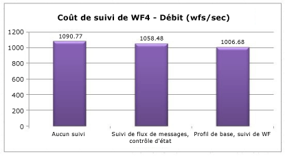</span><span class="sxs-lookup"><span data-stu-id="d81f0-541"></span></span>  
  
 <span data-ttu-id="d81f0-542">Le contrôle d'état a un impact d'environ 3 % sur le débit.</span><span class="sxs-lookup"><span data-stu-id="d81f0-542">Health monitoring has roughly a 3% impact on throughput.</span></span>  <span data-ttu-id="d81f0-543">Le coût du modèle de base est d'environ 8 %.</span><span class="sxs-lookup"><span data-stu-id="d81f0-543">The basic profile’s cost is around 8%.</span></span>  
  
## <a name="interop"></a><span data-ttu-id="d81f0-544">Interop</span><span class="sxs-lookup"><span data-stu-id="d81f0-544">Interop</span></span>  
 <span data-ttu-id="d81f0-545">WF4 a été presque entièrement réécrit à partir de [!INCLUDE[wf1](../../../includes/wf1-md.md)], c'est pourquoi les workflows et les activités de WF3 ne sont pas directement compatibles avec WF4.</span><span class="sxs-lookup"><span data-stu-id="d81f0-545">WF4 is almost a complete rewrite of [!INCLUDE[wf1](../../../includes/wf1-md.md)] and therefore WF3 workflows and activities are not directly compatible with WF4.</span></span>  <span data-ttu-id="d81f0-546">De nombreux clients adoptent [!INCLUDE[wf2](../../../includes/wf2-md.md)] tôt disposent de définitions de workflow en interne ou tierce et des activités personnalisées pour WF3.</span><span class="sxs-lookup"><span data-stu-id="d81f0-546">Many customers that adopted [!INCLUDE[wf2](../../../includes/wf2-md.md)] early will have in-house or third-party workflow definitions and custom activities for WF3.</span></span>  <span data-ttu-id="d81f0-547">Une façon de faciliter la transition vers WF4 consiste à utiliser l'activité Interop, qui peut exécuter des activités WF3 à partir d'un workflow WF4.</span><span class="sxs-lookup"><span data-stu-id="d81f0-547">One way to ease the transition to WF4 is to use the Interop activity, which can execute WF3 activities from within a WF4 workflow.</span></span>  <span data-ttu-id="d81f0-548">Il est recommandé d'utiliser l'activité <xref:System.Activities.Statements.Interop> seulement si nécessaire.</span><span class="sxs-lookup"><span data-stu-id="d81f0-548">It is recommended that the <xref:System.Activities.Statements.Interop> activity only be used when necessary.</span></span> [!INCLUDE[crabout](../../../includes/crabout-md.md)]<span data-ttu-id="d81f0-549">migration vers WF4, consultez la [conseils de Migration de WF4](http://go.microsoft.com/fwlink/?LinkID=153313).</span><span class="sxs-lookup"><span data-stu-id="d81f0-549"> migrating to WF4 check out the [WF4 Migration Guidance](http://go.microsoft.com/fwlink/?LinkID=153313).</span></span>  
  
### <a name="environment-setup"></a><span data-ttu-id="d81f0-550">Configuration de l'environnement</span><span class="sxs-lookup"><span data-stu-id="d81f0-550">Environment Setup</span></span>  
 <span data-ttu-id="d81f0-551"></span><span class="sxs-lookup"><span data-stu-id="d81f0-551"></span></span>  
  
### <a name="test-results"></a><span data-ttu-id="d81f0-552">Résultats des tests</span><span class="sxs-lookup"><span data-stu-id="d81f0-552">Test Results</span></span>  
 <span data-ttu-id="d81f0-553">Le tableau ci-dessous présente les résultats de l'exécution d'un workflow contenant cinq activités dans une séquence dans différentes configurations.</span><span class="sxs-lookup"><span data-stu-id="d81f0-553">The table below shows the results of running a workflow containing five activities in a sequence in various configurations.</span></span>  
  
|<span data-ttu-id="d81f0-554">Test</span><span class="sxs-lookup"><span data-stu-id="d81f0-554">Test</span></span>|<span data-ttu-id="d81f0-555">Débit (workflows/s)</span><span class="sxs-lookup"><span data-stu-id="d81f0-555">Throughput (workflows/sec)</span></span>|  
|----------|-----------------------------------|  
|<span data-ttu-id="d81f0-556">Séquence WF3 dans le runtime WF3</span><span class="sxs-lookup"><span data-stu-id="d81f0-556">WF3 Sequence in WF3 runtime</span></span>|<span data-ttu-id="d81f0-557">1,576</span><span class="sxs-lookup"><span data-stu-id="d81f0-557">1,576</span></span>|  
|<span data-ttu-id="d81f0-558">Séquence WF3 dans le runtime WF4 utilisant Interop</span><span class="sxs-lookup"><span data-stu-id="d81f0-558">WF3 Sequence in WF4 runtime using Interop</span></span>|<span data-ttu-id="d81f0-559">2,745</span><span class="sxs-lookup"><span data-stu-id="d81f0-559">2,745</span></span>|  
|<span data-ttu-id="d81f0-560">Séquence WF4</span><span class="sxs-lookup"><span data-stu-id="d81f0-560">WF4 Sequence</span></span>|<span data-ttu-id="d81f0-561">153,582</span><span class="sxs-lookup"><span data-stu-id="d81f0-561">153,582</span></span>|  
  
 <span data-ttu-id="d81f0-562">On constate une amélioration notable lors de l'utilisation d'Interop par rapport à WF3 simple.</span><span class="sxs-lookup"><span data-stu-id="d81f0-562">There is a notable performance increase to using Interop over straight WF3.</span></span>  <span data-ttu-id="d81f0-563">Toutefois, par rapport aux activités WF4, l'augmentation est négligeable.</span><span class="sxs-lookup"><span data-stu-id="d81f0-563">However, when compared against WF4 activities, the increase is negligible.</span></span>  
  
## <a name="summary"></a><span data-ttu-id="d81f0-564">Résumé</span><span class="sxs-lookup"><span data-stu-id="d81f0-564">Summary</span></span>  
 <span data-ttu-id="d81f0-565">Les lourds efforts consacrés aux performances pour WF4 ont payé dans de nombreux domaines cruciaux.</span><span class="sxs-lookup"><span data-stu-id="d81f0-565">Heavy investments in performance for WF4 have paid off in many crucial areas.</span></span>  <span data-ttu-id="d81f0-566">Dans certains cas, les performances des composants de workflow individuels sont des centaines de fois plus rapides dans WF4 que dans WF3 grâce à un runtime [!INCLUDE[wf1](../../../includes/wf1-md.md)] plus léger.</span><span class="sxs-lookup"><span data-stu-id="d81f0-566">Individual workflow component performance is in some cases hundreds of times faster in WF4 compared to WF3 due to a leaner [!INCLUDE[wf1](../../../includes/wf1-md.md)] runtime.</span></span>  <span data-ttu-id="d81f0-567">Les chiffres de latence sont également considérablement meilleurs.</span><span class="sxs-lookup"><span data-stu-id="d81f0-567">Latency numbers are significantly better as well.</span></span>  <span data-ttu-id="d81f0-568">Cela signifie que les pertes en termes de performances dues à l'utilisation de [!INCLUDE[wf1](../../../includes/wf1-md.md)] plutôt que des services d'orchestration [!INCLUDE[indigo2](../../../includes/indigo2-md.md)] à codage manuel sont très petites si l'on considère les avantages supplémentaires liés à l'utilisation de [!INCLUDE[wf1](../../../includes/wf1-md.md)].</span><span class="sxs-lookup"><span data-stu-id="d81f0-568">This means the performance penalty for using [!INCLUDE[wf1](../../../includes/wf1-md.md)] as opposed to hand-coding [!INCLUDE[indigo2](../../../includes/indigo2-md.md)] orchestration services is very small considering the added benefits of using [!INCLUDE[wf1](../../../includes/wf1-md.md)].</span></span>  <span data-ttu-id="d81f0-569">Les performances de la persistance ont augmenté d'un facteur de 2,5 à 3.</span><span class="sxs-lookup"><span data-stu-id="d81f0-569">Persistence performance has increased by a factor of 2.5 - 3.0.</span></span>  <span data-ttu-id="d81f0-570">Le contrôle d'état au moyen du suivi de workflow nécessite désormais très peu de charge mémoire.</span><span class="sxs-lookup"><span data-stu-id="d81f0-570">Health monitoring by means of workflow tracking now has very little overhead.</span></span>  <span data-ttu-id="d81f0-571">Un ensemble complet de guides de migration est disponible pour les utilisateurs qui envisagent de passer de WF3 à WF4.</span><span class="sxs-lookup"><span data-stu-id="d81f0-571">A comprehensive set of migration guides are available for those that are considering moving from WF3 to WF4.</span></span>  <span data-ttu-id="d81f0-572">Pour toutes ces raisons, WF4 constitue une option avantageuse pour l'écriture d'applications complexes.</span><span class="sxs-lookup"><span data-stu-id="d81f0-572">All of this should make WF4 an attractive option for writing complex applications.</span></span>  
  
## <a name="acknowledgements"></a><span data-ttu-id="d81f0-573">Remerciements</span><span class="sxs-lookup"><span data-stu-id="d81f0-573">Acknowledgements</span></span>  
 <span data-ttu-id="d81f0-574">Un grand merci aux contributeurs et relecteurs suivants pour leurs efforts:</span><span class="sxs-lookup"><span data-stu-id="d81f0-574">Many thanks to the following contributors and reviewers for their efforts:</span></span>  
  
-   <span data-ttu-id="d81f0-575">Leon Welicki, Microsoft Corporation</span><span class="sxs-lookup"><span data-stu-id="d81f0-575">Leon Welicki, Microsoft Corporation</span></span>  
  
-   <span data-ttu-id="d81f0-576">Ryszard Kwiecinski, Microsoft Corporation</span><span class="sxs-lookup"><span data-stu-id="d81f0-576">Ryszard Kwiecinski, Microsoft Corporation</span></span>  
  
-   <span data-ttu-id="d81f0-577">Emil Velinov, Microsoft Corporation</span><span class="sxs-lookup"><span data-stu-id="d81f0-577">Emil Velinov, Microsoft Corporation</span></span>  
  
-   <span data-ttu-id="d81f0-578">Nate Talbert, Microsoft Corporation</span><span class="sxs-lookup"><span data-stu-id="d81f0-578">Nate Talbert, Microsoft Corporation</span></span>  
  
-   <span data-ttu-id="d81f0-579">Bob Schmidt, Microsoft Corporation</span><span class="sxs-lookup"><span data-stu-id="d81f0-579">Bob Schmidt, Microsoft Corporation</span></span>  
  
-   <span data-ttu-id="d81f0-580">Stefan Batres, Microsoft Corporation</span><span class="sxs-lookup"><span data-stu-id="d81f0-580">Stefan Batres, Microsoft Corporation</span></span>
