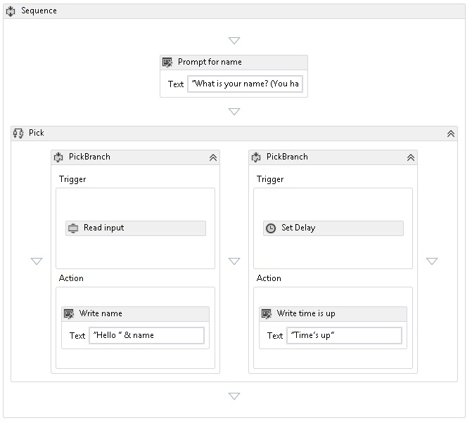

# <a name="pick-activity"></a>Activité Pick
L'activité <xref:System.Activities.Statements.Pick> simplifie la modélisation d'un jeu de déclencheurs d'événements suivis de leurs gestionnaires correspondants.  Une activité <xref:System.Activities.Statements.Pick> contient une collection d'activités <xref:System.Activities.Statements.PickBranch>, où chaque <xref:System.Activities.Statements.PickBranch> est un couplage entre une activité <xref:System.Activities.Statements.PickBranch.Trigger%2A> et une activité <xref:System.Activities.Statements.PickBranch.Action%2A>.  Au moment de l'exécution, les déclencheurs de toutes les branches sont exécutés en parallèle.  Une fois qu'un déclencheur a été exécuté, son action correspondante est exécutée, et tous les autres déclencheurs sont annulés.  L'activité [!INCLUDE[netfx_current_short](../../../includes/netfx-current-short-md.md)] de <xref:System.Activities.Statements.Pick> se comporte de manière similaire à l'activité [!INCLUDE[netfx35_short](../../../includes/netfx35-short-md.md)] de <xref:System.Workflow.Activities.ListenActivity>.  
  
 La capture d’écran suivante de l’exemple du SDK [Utilisation de l’activité Pick](../../../docs/framework/windows-workflow-foundation/samples/using-the-pick-activity.md) montre une activité Pick avec deux branches.  Une branche a un déclencheur appelé **Read input**, une activité personnalisée qui lit l’entrée à partir de la ligne de commande. La deuxième branche comporte un déclencheur d'activité <xref:System.Activities.Statements.Delay>. Si le **Read input** activité reçoit des données avant le <xref:System.Activities.Statements.Delay> a fini d’activité, <xref:System.Activities.Statements.Delay> délai sera annulé et un message d’accueil sera écrit dans la console.  Sinon, si l’activité **Read input** ne reçoit pas de données dans le délai alloué, elle est annulée et un message d’expiration du délai d’attente est écrit sur la console.  C’est un modèle commun utilisé pour ajouter un délai d’attente à une action.  
  
   
  
## <a name="best-practices"></a>meilleures pratiques recommandées.  
 Lors de l'utilisation de Pick, la branche exécutée est la branche dont le déclencheur a fini de s'exécuter en premier.  Conceptuellement, tous les déclencheurs s'exécutent en parallèle, et un déclencheur peut avoir exécuté la majorité de sa logique avant d'être annulé par la fin de l'exécution d'un autre déclencheur.  Par conséquent, lors de l'utilisation de l'activité Pick, il est recommandé de traiter le déclencheur en tant que représentant d'un événement unique et d'y inclure le minimum de logique possible.  Idéalement, le déclencheur doit contenir juste assez de logique pour recevoir un événement, et la totalité du traitement de cet événement doit être placée dans l'action de la branche.  Cette méthode réduit le chevauchement entre l'exécution des déclencheurs.  Prenons l'exemple d'un <xref:System.Activities.Statements.Pick> avec deux déclencheurs, où chaque déclencheur contient une activité <xref:System.ServiceModel.Activities.Receive> suivie d'une logique supplémentaire.  Si la logique supplémentaire ajoute un point inactif, il est possible que les deux activités <xref:System.ServiceModel.Activities.Receive> s'exécutent correctement.  Un déclencheur sera exécuté entièrement, tandis que l'autre ne le sera que partiellement.  Dans certains scénarios, il n'est pas possible d'accepter un message et de terminer ensuite partiellement le traitement.  Par conséquent, si des activités de messagerie intégrées WF, telles que <xref:System.ServiceModel.Activities.Receive> et <xref:System.ServiceModel.Activities.SendReply>, sont utilisées alors que <xref:System.ServiceModel.Activities.Receive> est utilisé communément dans le déclencheur, <xref:System.ServiceModel.Activities.SendReply> et toute autre logique doivent être placées dans l'action dans la mesure du possible.  
  
## <a name="using-the-pick-activity-in-the-designer"></a>Utilisation de l'activité Pick dans le concepteur  
 Pour utiliser l’activité Pick dans le concepteur, recherchez **Pick** et **PickBranch** dans la boîte à outils.  Faites glisser **Pick** pour le déposer sur le canevas.  Par défaut, toute nouvelle activité **Pick** créée dans le concepteur contient deux branches.  Pour ajouter des branches supplémentaires, faites glisser l’activité **PickBranch** et déposez-la à côté des branches existantes. Les activités peuvent être déposées sur l’activité **Pick** dans la zone **Trigger** ou dans la zone **Action** de n’importe quelle activité **PickBranch**.  
  
## <a name="using-the-pick-activity-in-code"></a>Utilisation de l'activité Pick dans le code  
 L'activité <xref:System.Activities.Statements.Pick> est utilisée en remplissant sa collection <xref:System.Activities.Statements.Pick.Branches%2A> avec les activités <xref:System.Activities.Statements.PickBranch>. Chaque activité <xref:System.Activities.Statements.PickBranch> a une propriété <xref:System.Activities.Statements.PickBranch.Trigger%2A> de type <xref:System.Activities.Activity>. Une fois que l'activité spécifiée a été exécutée, l'action <xref:System.Activities.Statements.PickBranch.Action%2A> est exécutée à son tour.  
  
 L'exemple de code suivant montre comment utiliser une activité <xref:System.Activities.Statements.Pick> pour implémenter un délai d'attente pour une activité qui lit une ligne de la console.  
  
```csharp  
Sequence body = new Sequence()  
{  
    Variables = { name },  
    Activities =   
   {  
       new System.Activities.Statements.Pick  
        {  
           Branches =   
           {  
               new PickBranch  
               {  
                   Trigger = new ReadLine  
                   {  
                      Result = name,  
                      BookmarkName = "name"  
                   },  
                   Action = new WriteLine   
                   {   
                       Text = ExpressionServices.Convert<string>(ctx => "Hello " +   
                           name.Get(ctx))   
                   }  
               },  
               new PickBranch  
               {  
                   Trigger = new Delay  
                   {  
                      Duration = new TimeSpan(0, 0, 5)  
                   },  
                   Action = new WriteLine  
                   {  
                      Text = "Time is up."  
                   }  
               }  
           }  
       }  
   }  
};  
```  
  
```xaml  
<Sequence xmlns="http://schemas.microsoft.com/netfx/2009/xaml/activities" xmlns:x="http://schemas.microsoft.com/winfx/2006/xaml">  
  <Sequence.Variables>  
    <Variable x:TypeArguments="x:String" Name="username" />  
  </Sequence.Variables>  
  <Pick>  
    <PickBranch>  
      <PickBranch.Trigger>  
        <ReadLine BookmarkName="name" Result="username" />  
      </PickBranch.Trigger>  
      <WriteLine>[String.Concat("Hello ", username)]</WriteLine>  
    </PickBranch>  
    <PickBranch>  
      <PickBranch.Trigger>  
        <Delay>00:00:05</Delay>  
      </PickBranch.Trigger>  
      <WriteLine>Time is up.</WriteLine>  
    </PickBranch>  
  </Pick>  
</Sequence>  
```
