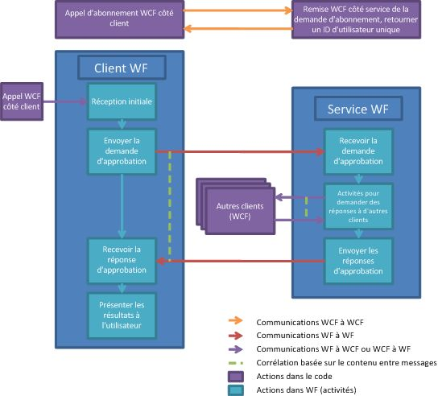

# Processus d'approbation des documents
Cet exemple illustre l'utilisation conjointe de nombreuses fonctionnalités [!INCLUDE[wf](../../../../includes/wf-md.md)] et [!INCLUDE[indigo1](../../../../includes/indigo1-md.md)]. Ensemble, elles implémentent un scénario de processus d'approbation des documents. Une application cliente peut soumettre des documents pour approbation et approuver des documents. Une application du responsable des approbations existe pour faciliter les communications entre les clients et mettre en vigueur les règles du processus d'approbation. Le processus d'approbation est un workflow qui peut exécuter plusieurs types d'approbation. Il existe des activités pour obtenir une approbation unique, une approbation de quorum (pourcentage de l'ensemble d'approbateurs) et un processus d'approbation complexe qui se compose d'une approbation unique et de quorum dans une séquence.  
  
> [!IMPORTANT]
>  Les exemples peuvent déjà être installés sur votre ordinateur. Recherchez le répertoire (par défaut) suivant avant de continuer.  
>   
>  `<InstallDrive>:\WF_WCF_Samples`  
>   
>  Si ce répertoire n’existe pas, accédez à la page [Windows Communication Foundation (WCF) and Windows Workflow Foundation (WF) Samples for .NET Framework 4](http://go.microsoft.com/fwlink/?LinkId=150780) pour télécharger tous les exemples [!INCLUDE[indigo1](../../../../includes/indigo1-md.md)] et [!INCLUDE[wf1](../../../../includes/wf1-md.md)] . Cet exemple se trouve dans le répertoire suivant.  
>   
>  `<InstallDrive>:\WF_WCF_Samples\WF\Application\DocumentApprovalProcess`  
  
## Détails de l'exemple  
 Le graphique suivant illustre le workflow de processus d'approbation des documents.  
  
   
  
 Du point de vue du client, le processus d'approbation fonctionne comme suit :  
  
1.  Un client s'abonne pour être un utilisateur dans le système du processus d'approbation.  
  
2.  Un client [!INCLUDE[indigo2](../../../../includes/indigo2-md.md)] envoie à un service [!INCLUDE[indigo2](../../../../includes/indigo2-md.md)] hébergé par l'application du responsable des approbations.  
  
3.  Un ID d'utilisateur unique est retourné au client. Le client peut maintenant participer aux processus d'approbation.  
  
4.  Une fois joint, un client peut envoyer un document pour approbation à l'aide de processus d'approbation unique, de quorum ou complexe.  
  
5.  Un clic sur un bouton dans l'interface du client permet de démarrer une instance de workflow dans un hôte du service de workflow client.  
  
6.  Le workflow envoie une demande d'approbation à l'application du responsable des approbations.  
  
7.  Le gestionnaire de workflow démarre un workflow de son propre côté pour représenter un processus d'approbation.  
  
8.  Une fois le workflow d'approbation du responsable exécuté, les résultats sont renvoyés au client.  
  
9. Le client affiche les résultats.  
  
10. Un client peut recevoir une demande d'approbation et y répondre à tout moment.  
  
11. Un service [!INCLUDE[indigo2](../../../../includes/indigo2-md.md)] hébergé sur le client peut recevoir une demande d'approbation de l'application du responsable des approbations.  
  
12. Les informations concernant les documents sont présentées sur le client à des fins de révision.  
  
13. L'utilisateur peut approuver ou rejeter le document.  
  
14. Un client [!INCLUDE[indigo2](../../../../includes/indigo2-md.md)] est utilisé pour renvoyer une réponse d'approbation à l'application du responsable des approbations.  
  
 Du point de vue de l'application du responsable des approbations, le processus d'approbation fonctionne comme suit :  
  
1.  Un client demande à participer au système du processus d'approbation.  
  
2.  Un service [!INCLUDE[indigo2](../../../../includes/indigo2-md.md)] sur le responsable des approbations reçoit une demande de faire partie du système du processus d'approbation.  
  
3.  Un ID unique est généré pour le client. Les informations utilisateur sont stockées dans une base de données.  
  
4.  L'ID unique est renvoyé à l'utilisateur.  
  
5.  Une demande d'approbation est reçue. Le responsable des approbations exécute un processus d'approbation.  
  
6.  Une demande d'approbation est reçue par le responsable des approbations, ce qui démarre un nouveau workflow.  
  
7.  Selon le type de demande (simple, quorum ou complexe), une activité différente est exécutée.  
  
8.  Les activités Send et Receive avec corrélation sont utilisées pour envoyer la demande d'approbation au client à des fins de révision et pour recevoir la réponse.  
  
9. Le résultat du workflow de processus d'approbation est envoyé au client.  
  
## Utilisation de l'exemple  
  
##### Pour configurer la base de données  
  
1.  À partir d'une invite de commandes [!INCLUDE[vs2010](../../../../includes/vs2010-md.md)] ouverte avec des privilèges d'administrateur, accédez au dossier DocumentApprovalProcess et exécutez Setup.cmd.  
  
##### Pour configurer l'application  
  
1.  À l'aide de [!INCLUDE[vs2010](../../../../includes/vs2010-md.md)], ouvrez le fichier solution DocumentApprovalProcess.sln.  
  
2.  Pour générer la solution, appuyez sur Ctrl+Maj+B.  
  
3.  Pour exécuter la solution, lancez l’Application du responsable des approbations en cliquant sur le projet ApprovalManager dans le **l’Explorateur de solutions** et en cliquant sur **déboguer**->**Démarrer**  nouvelle instance dans le menu contextuel.  
  
     Attendez que la sortie du responsable vous indique qu'il est prêt.  
  
##### Pour exécuter le scénario avec approbation unique  
  
1.  Ouvrez une invite de commandes avec l'autorisation d'administrateur.  
  
2.  Naviguez jusqu'au répertoire qui contient la solution.  
  
3.  Naviguez jusqu’au dossier ApprovalClient\Bin\Debug et exécutez deux instances d’ApprovalClient.exe.  
  
4.  Cliquez sur **découvrir**, attendez que le **s’abonner** bouton est activé.  
  
5.  Tapez un nom d’utilisateur et cliquez sur **s’abonner**. Pour un client, utilisez `UserType1` et pour l'autre, tapez `UserType2`.  
  
6.  Dans le client `UserType1`, sélectionnez le type d'approbation unique dans le menu déroulant et tapez un nom de document ainsi qu'un contenu. Cliquez sur **demander l’approbation**.  
  
7.  Dans le client `UserType2`, un document en attente d'approbation apparaît. Sélectionnez-le et appuyez sur **approuver** ou **rejeter**. Les résultats doivent s'afficher dans le client `UserType1`.  
  
##### Pour exécuter le scénario avec approbation de quorum  
  
1.  Ouvrez une invite de commandes avec l'autorisation d'administrateur.  
  
2.  Naviguez jusqu'au répertoire qui contient la solution.  
  
3.  Naviguez jusqu’au dossier ApprovalClient\Bin\Debug et exécutez trois instances d’ApprovalClient.exe.  
  
4.  Cliquez sur **découvrir**, attendez que le **s’abonner** bouton est activé.  
  
5.  Tapez un nom d’utilisateur et cliquez sur **s’abonner**. Pour un client, utilisez `UserType1` et pour les deux autres, tapez `UserType2`.  
  
6.  Dans le client `UserType1`, sélectionnez le type d'approbation de quorum dans le menu déroulant et tapez un nom de document ainsi qu'un contenu. Cliquez sur **demander l’approbation**. Ceci nécessite que les deux clients `UserType2` approuvent ou rejettent le document. Alors que les deux clients `UserType2` doivent répondre, un seul client doit approuver le document pour qu'il le soit.  
  
7.  Dans les clients `UserType2`, un document en attente d'approbation apparaît. Sélectionnez-le et appuyez sur **approuver** ou **rejeter**. Les résultats doivent s'afficher dans le client `UserType1`.  
  
##### Pour exécuter le scénario avec approbation complexe  
  
1.  Ouvrez une invite de commandes avec l'autorisation d'administrateur.  
  
2.  Naviguez jusqu'au répertoire qui contient la solution.  
  
3.  Naviguez jusqu’au dossier ApprovalClient\Bin\Debug et exécutez quatre instances d’ApprovalClient.exe.  
  
4.  Cliquez sur **découvrir**, attendez que le **s’abonner** bouton est activé.  
  
5.  Tapez un nom d’utilisateur et cliquez sur **s’abonner**. Pour un client, utilisez `UserType1`, pour deux utilisations, tapez `UserType2` et, pour le dernier, utilisez `UserType3`.  
  
6.  Dans le client `UserType1`, sélectionnez le type d'approbation unique dans le menu déroulant et tapez un nom de document ainsi qu'un contenu. Cliquez sur **demander l’approbation**.  
  
7.  Dans les clients `UserType2`, un document en attente d'approbation apparaît. Sélectionnez-le et appuyez sur **approuver**, le document est transmis à la `UserType3` client.  
  
     Si le document est approuvé par le premier quorum `UserType2`, le document est passé au client `UserType3`.  
  
8.  Approuvez ou rejetez le document du client `UserType3`. Les résultats doivent s'afficher dans le client `UserType1`.  
  
##### Pour nettoyer  
  
1.  À partir d'une invite de commandes [!INCLUDE[vs2010](../../../../includes/vs2010-md.md)], naviguez jusqu'au dossier DocumentApprovalProcess et exécutez Cleanup.cmd.